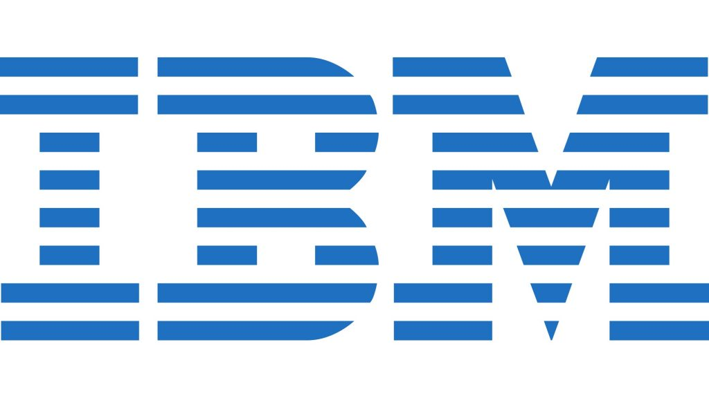
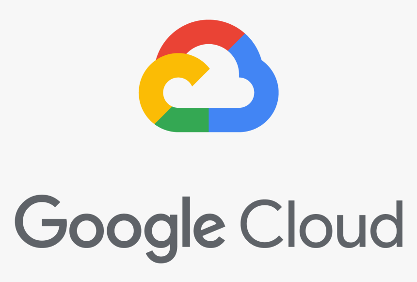
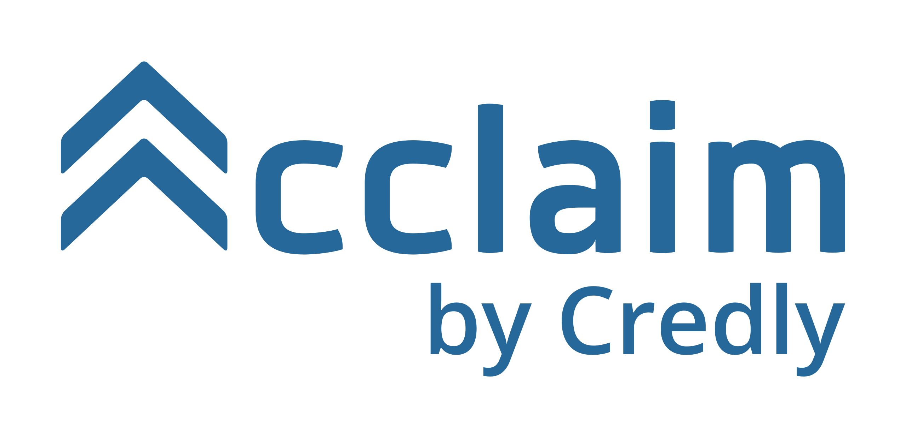

## Industry Certifications

- AWS Certified **Data Analytics** – Specialty. Issuing authority Amazon Web Services (AWS) March 2021
- AWS Certified **Machine Learning** – Specialty.  Issuing authority Amazon Web Services (AWS) May 2020
- AWS Certified **Solutions Architect** – Associate.  Issuing authority Amazon Web Services (AWS)  July 2020
- AWS Certified **Cloud Practitioner** Issuing authority Amazon Web Services (AWS), Dec 2019

- Microsoft Certified: **Azure Data Scientist Associate** -  Issuing authority Microsoft Corporation,  Oct 2022
- Microsoft Certified: **Azure Fundamentals** -  Issuing authority Microsoft Corporation,  Jan 2022

## Professional Certifications

- IBM Applied **AI Professional** Certificate, Coursera "Specialization", August 2020

- IBM **AI Foundations for Business**, IBM, Coursera "Specialization", July 2020

- Key **Technologies for Business**, IBM, Coursera "Specialization", July 2020

- **AI Foundations** for Everyone, IBM, Coursera "Specialization", Jan 2020

- **Advanced Data Science** with IBM ,IBM, Coursera "Specialization", Jan 2020

- IBM **AI Engineering Professional** Certificate ,IBM, Coursera "Specialization", Jan 2020

- **Applied Data Science with Python**,IBM, Coursera "Specialization", Oct 2019

- IBM **Data Science Professional** Certificate, IBM, Coursera "Specialization", July 2019.

  
 
       
          

- Machine Learning with **TensorFlow on Google Cloud Platform**, Google, Coursera "Specialization", July 2019

  
 
       
          

- Applied **Data Science using Python**,University of Michigan, Coursera "Specialization", May 2019
## Certifications
- Introduction to Computer Vision with Watson and OpenCV by IBM
August 2020
- Building AI Applications with Watson APIs by IBM
August 2020
-  AWS Computer Vision: Getting Started with GluonCV by AWS, July 2020
-  AWS Certified Solutions Architect Associate - 2020 by Neal Davis on Udemy, July 2020
- Amazon SageMaker: Simplifying Machine Learning Application Development by AWS, July 2020
- AWS Certified Machine Learning - Specialty issued by Linux Academy, Apr 2020
-  AWS Certified Machine Learning Specialty 2020 issued by A Cloud Guru, Mar 2020
-  Building Deep Learning Models with TensorFlow, Jan. 2020
- Deep Neural Networks with PyTorch by IBM, Dec. 2019
- Google Cloud Platform Big Data and Machine Learning Fundamentals, Dec. 2019
-  Introduction to Deep Learning and Neural Networks with Keras by IBM, Dec. 2019
- Getting Started with AWS Machine Learning by AWS Nov 2019
- Scalable Machine Learning on Big Data using Apache Spark, Nov. 2019
- Data Science: R Basics by Harvard University on edX, Nov. 2019
- Applied Social Network Analysis in Python, Oct 2019
- Applied Text Mining in Python by University of Michigan, October 2019
- Applied Plotting, Charting and Data Representation in Python by University of Michigan, Sep. 2019.
- Guided Tour of Machine Learning in Finance by New York University Tandon School of Engineering, Sep. 2019.
- Networks and Communications Security by (ISC)2, August 2019.
- Introduction to Data Science in Python by University of Michigan, August 2019
- Introduction to Artificial Intelligence (AI) by IBM, July 2019
- Getting Started with AI using IBM Watson by IBM, July 2019
- Fundamentals of Scalable Data Science by IBM, July 2019
- The Data Scientist’s Toolbox by Johns Hopkins University, July 2019
- Machine Learning with Python by IBM, July 2019.
- Machine Learning with MATLAB by MATLAB, June 2019.
- Fundamentals of deep learning for computer vision by NVIDIA Deep Learning Institute, June 2019.
- Databases and SQL for Data Science by IBM, June 2019.
- Data Visualization with Python by IBM, June 2019.
- Data Analysis with Python by IBM, June 2019.
- What is Data Science? by IBM, May 2019.
- Performance of Research practicum on Student Movement Institution Program’s frame- work during February-July 2013, at the National Autonomous University of Mexico in the Nuclear Science Institute.
- Passing corresponding studies of Graphic Design Software Teaching Course at the Juarez Autonomous University of Tabasco, in Villahermosa municipality, the state of Tabasco, May 26 2001.

## Additional Online Certifications

