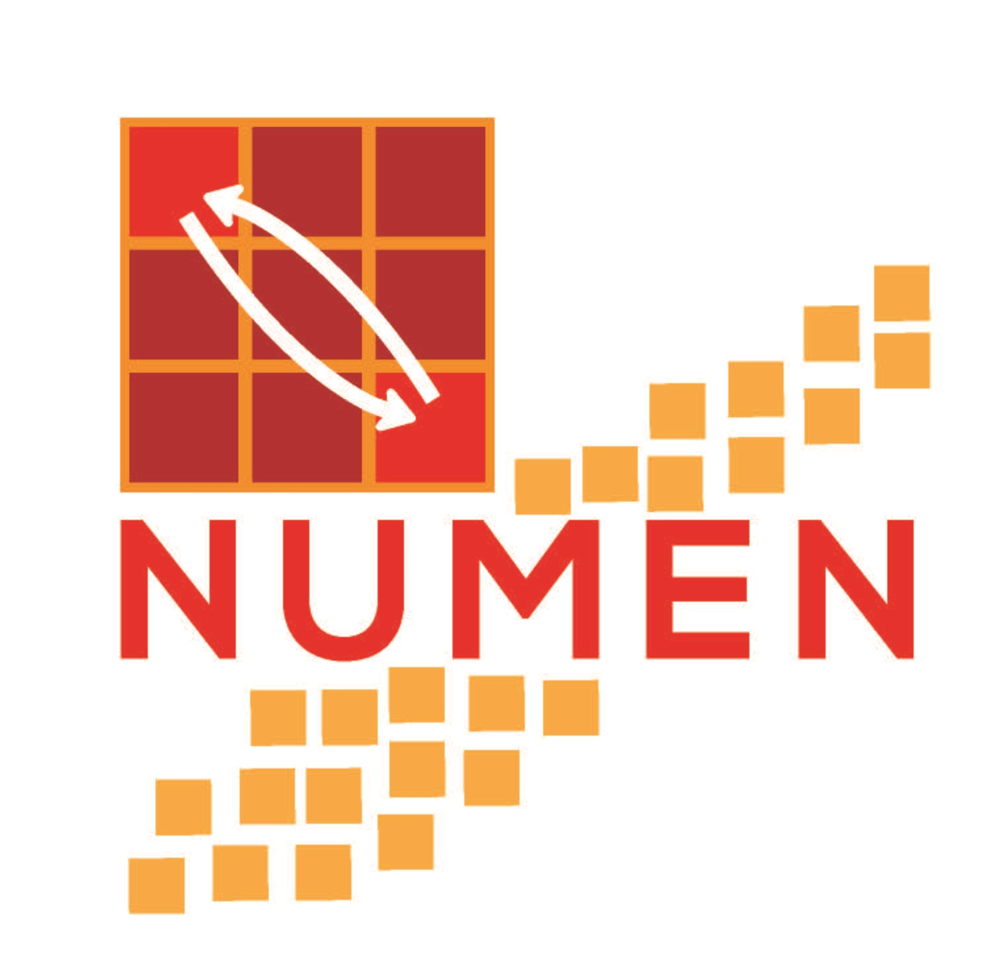
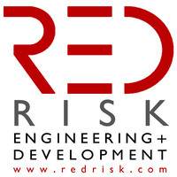

My work is based on analysis data for actionable insights. Devising and applying **models** and **algorithms** to mine the stores of big data. Analyzing the data to identify **patterns** and **trends**.

## Cloud Solutions

I am responsible for Analyzing a company's IT system and  **cloud** infrastructure of a client. Diagnosing IT system problems, inefficiencies, and weaknesses. Planning a timeline for **completion of projects**. Understanding a client's business needs. Implementing a **cloud solution** to meet business needs. Analyzing and determining security threats. Providing advice on technology best practices. Collaborating with the **technical** in-house team to ensure familiarity with **cloud** technology.

I  have **built** and maintained an organization's data infrastructure, particularly for cloud services in AWS, including relational databases and non-relational databases, **data warehouses**, and data pipelines. The infrastructure is deployed by using **Terraform** and the data transformation through **Scala** and **Spark**.

My professional background includes crafting **algorithms**, making use of **machine learning** to mine, make sense of data, and using **data visualization** to present it to decision-makers. I am instrumental in analysing and delivering quantitative and qualitative research based solutions that reduce redundancy, improve accuracy and efficiency, and achieve organisational objectives. I have the ability to expand existing data delivery platforms and creating data systems that optimise data management, capturing, and quality. I develop advanced cloud-based solutions and migrate existing workloads to the cloud. [Read more...](https://cloud-data-science.com/index.php/services/)

##  Cloud Data Science

I perform **data mining, analysis, synthesis, visualization**, and data conversion into reportable formats for presentations, reports writing, and disseminate findings. I determine research methodology by collecting and evaluating data to ensure completeness and accuracy of information. I develop and implement extensive research plans and deliver detailed reports for informed decision-making. [Read more...](https://cloud-data-science.com)

## Data Analysis at  NUMEN 

I am part of the experimental [NUMEN](https://web.infn.it/NUMEN/index.php/it/collaboration) collaboration. In the NUMEN project, nuclear reactions of double charge-exchange (DCE) will be used as a tool to extract information on the ββ nuclear matrix elements (NME). Nuclear matrix elements for neutrinoless double beta decay and double charge exchange in the scheme of microscopic Interacting Boson Model are important allowing me belong to the NUMEN collaboration.

My research provides insights to compute accurate nuclear matrix elements that serve to improve the nuclear reactions calculations that can be compared with the current experimental data. By using **machine learning** techniques, such as regression and classification techniques it was possible develop an accurate method to fit parameters to construct the nuclear wave functions for complex nuclei allowing present the results by using plots in Python or R, which helps to understand the complex quantum structure of the nuclei. The implementation of **new technologies** is part of the aim of my future work

## Virial Expansion of Nuclear Equation

Texas A&M University and Cyclotron Institute
College Station, Texas (United States).
Programming Language: Python with Mathematica

I have developed a **model** to study the transition between mater and plasma. This may help to understand the external conditions of nature to materialize the matter. This provides insight into how was created our universe in terms of thermodynamics. I have proposed a function in terms of energy and with my team, we expanded the energy per particle (E/A) of symmetric infinite nuclear matter in powers of the density to take into account 2, 3, . . . , N-body forces.

Here we have used a **Machine Learning** technique of **Regression** in Python and used it in Mathematica to check our results.

The new model is proposed by fitting ground state properties of nuclear matter (binding energy, compressibility, and pressure) and assuming that at high densities a second-order phase transition to the quark-gluon plasma (QGP) occurs.

This work helped to understand the nature of the nuclear matter and research more interesting properties of the plasma such are the sun and how under certain conditions the matter if created.

This work was published in [World Scientifc](https://www.worldscientific.com/doi/abs/10.1142/S0218301312500061) as: Int.J.Mod.Phys. E21 (2012) 1250006

## Classification of the nuclei by knowing their spectrum and perform analysis of nuclear reactions

National Institute for Nuclear Physics
Genova (Italy)
Programming Language: Python with Fortran

In this project, my task was to provide accurate wavefunctions of the 64Ni and 66Ni. To do that I required to compute the best parameters of the model which reproduce the experimental data coming from the [Database](https://www.nndc.bnl.gov/nudat2/ ) Nndc - Brookhaven National Laboratory. With this data, I have created a data set of all even-even nuclei which we have labeled the parameters. The parameters of the 66Ni and 66Ni were obtained by using a classification program in Python and by using the results I could determine the spectrum which are helpful to perform the analysis. The model is written in Fortran, but I was able to use python to get the coefficients. This work helped to study short-range correlations of sequential and direct reactions.

This work was published [Physical Review](https://journals.aps.org/prc/abstract/10.1103/PhysRevC.96.044612) C 96, 044612 (2017)

## Analysis and development of a model of the nuclear reaction of Double Charge Exchange

National Institute for Nuclear Physics
Genova (Italy)
Programming Language: Python, Wolfram Mathematica, Matlab, C

In this project, I have proposed a model to try to explain a nuclear reaction of a double charge exchange that allows determining the nature of the neutrinos. Find constraints to determine if the neutrinos are antiparticles and particles at the same time. My main role was to give the idea of the process and perform the calculation.

I have performed the calculation by using sophisticated numeric and algebraic methods. We found correlations between neutrinoless double beta decay and double charge exchange and this opens the nuclear physicist community put constraints in the research of the masses of the neutrinos and explorer the new physics.

This work was published in [Physical Review](https://journals.aps.org/prc/abstract/10.1103/PhysRevC.98.061601)  Phys. Rev. C 98, 061601(R)

## HPC CUDA Developments

I have developed software in CUDA language that used in clusters to perform heavy calculations.

## Developing of CUDA software for the analysis of flooding of a geographical area.

RED Risk Engineering + Development
Pavia (Italy)
Programming Language,C,C++ ,Fortran, CUDA

 In this project, the Italian Association of Insurers enquired RED about some flood model results previously obtained for Italy and the South East of Europe in a different project. RED carried out an exhaustive analysis to evaluate the consistency of the flood event generation process, in the case of both defended and undefended areas, thus taking into account the asset vulnerability. Methodological and technical improvements were suggested to obtain a more accurate representation of the flood hazard in Italy, the results of the G-Cat model were analyzed for the 2014 flood of Modena (Italy), for residential buildings, using an exposure dataset. My role in this project was to help the software developers the porting of the code to CUDA and setup the GPUs ready to the servers for debugging on-premises servers. This program is useful to determine the risk of flooding for some geographical areas.

The code is private and belong to the [RED Risk Engineering](https://www.redrisk.com/)

