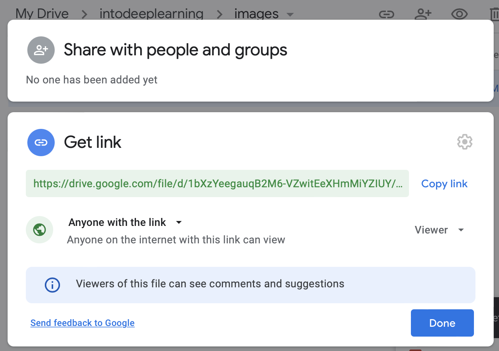

Hello, today we are going to  download files and folders with Python from Google Drive.

## 1. Get a Direct Link for Your Google Drive Files

a. open **[Google Drive](https://drive.google.com/)**

b. Right-click on your file

c. Click on **Get Link**

d. Make sure your file is available for “**Anyone with the link**”



e. Click on **Copy Link**

## 2. Install gdown

- [gdown doc](https://pypi.org/project/gdown/)

```
!pip install gdown
```

## 3. Download the file in google drive using Python

```
import gdown

url = 'https://drive.google.com/file/d/1uFTzwFc3tmS-D7azjMiJcxSfn71BPqKt/view?usp=sharing'
output_path = 'myfile.txt'
gdown.download(url, output_path, quiet=False,fuzzy=True)
```

<details class="description" style="box-sizing: border-box; display: block;"><summary class="btn btn-sm" data-open="Hide Output" data-close="Show Output" style="box-sizing: border-box; display: inline-block; cursor: pointer; position: relative; padding: 3px 12px; font-size: 12px; font-weight: 500; line-height: 20px; white-space: nowrap; vertical-align: middle; user-select: none; border: 1px solid rgba(27, 31, 35, 0.15); border-radius: 6px; appearance: none; color: rgb(36, 41, 46); background-color: rgb(250, 251, 252); box-shadow: rgba(27, 31, 35, 0.04) 0px 1px 0px, rgba(255, 255, 255, 0.25) 0px 1px 0px inset; transition: background-color 0.2s cubic-bezier(0.3, 0, 0.5, 1) 0s;"></summary></details>

## 4. Download a folder in google drive using Python

```
import gdown
url = "https://drive.google.com/drive/folders/1HWFHKCprFzR7H7TYhrE-W7v4bz2Vc7Ia"
gdown.download_folder(url, quiet=True, use_cookies=False)
```

**Congratulations!,** We have learned how to download files in python from google drive.