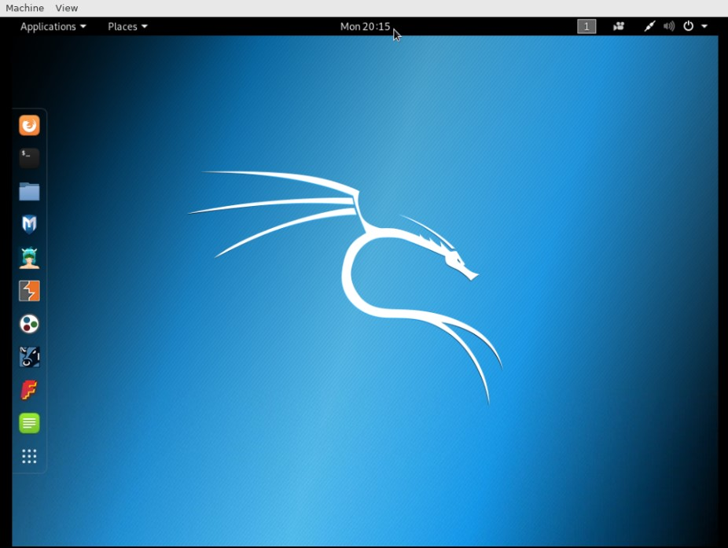
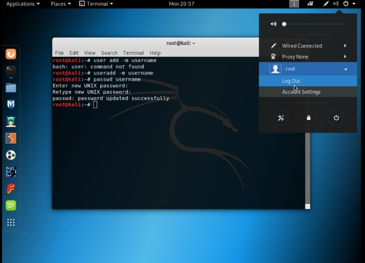
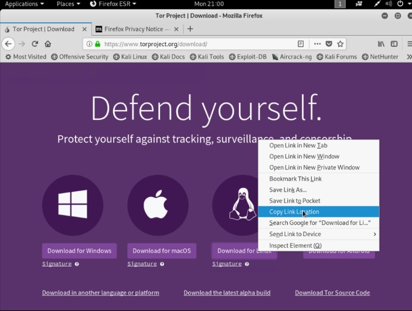
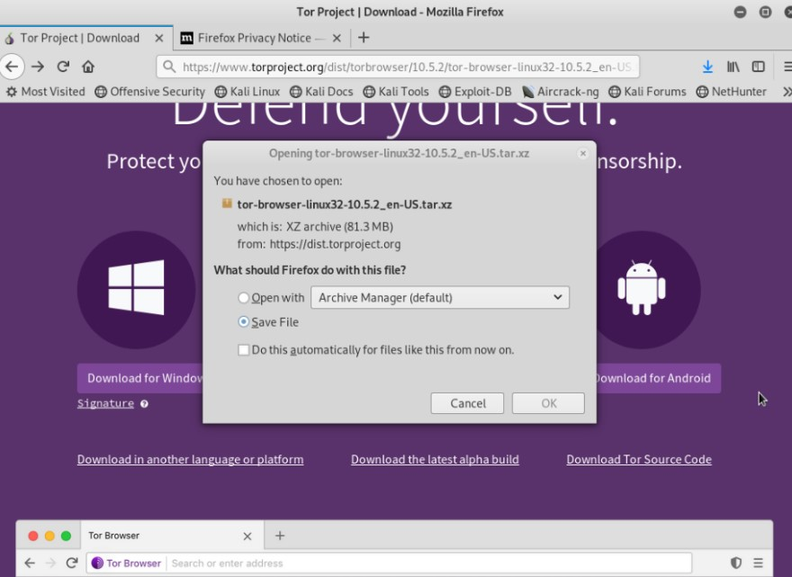
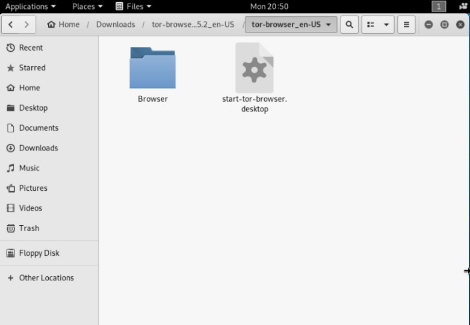
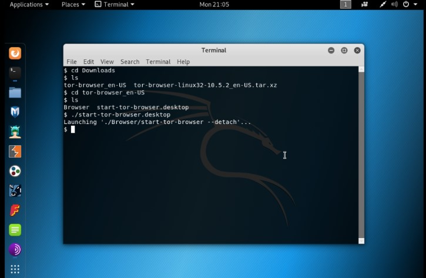
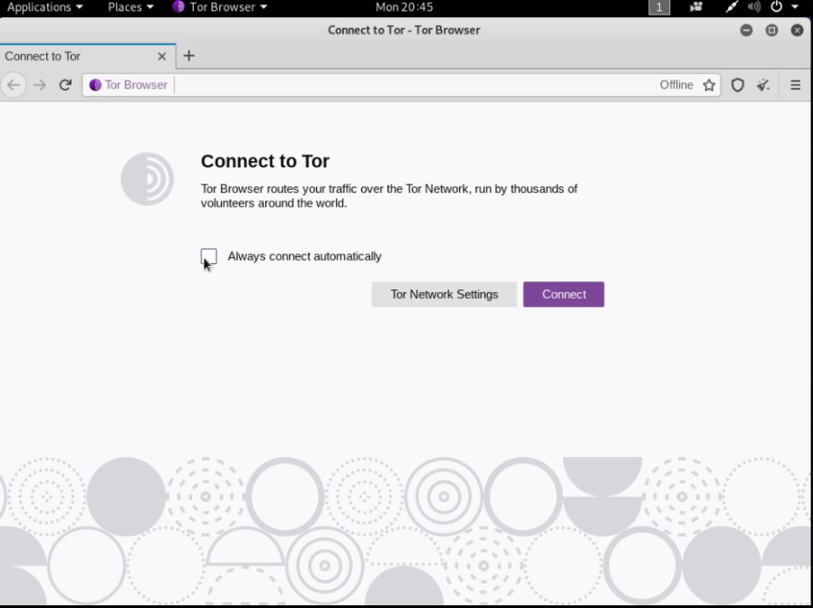
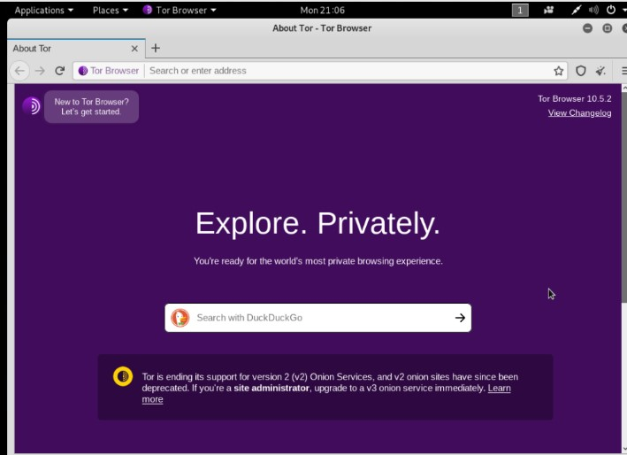

The Dark Web is only a small fraction (0.01%) of the Deep Web, which contains Internet content that is not searchable by your standard search engines.

 In other words, if Google can’t find what you’re looking for, it’s probably still out there in the World Wide Web; it’s just in the harder-to-access Deep Web.

 (If Google *can* find it, then it’s on the Surface Web, which makes up about 0.03% of the Internet.)

The surface web refers to content published publicly on the internet that doesn’t require paywalls or logins to access and is indexed by search engines. 

> Much of the content an average person accesses on the internet is part of the deep web: your email, your online banking information, your private social media accounts, or paid streaming sites.


## How to enter get on DarkWeb by using OnWorks


We are going to run a public VPS with Kali and install Tor.  Note that if either you perform no action during more than **10 minutes,** or you leave the tab with the OnWorks session, the remote server will release your session for another user.


### Step 1 We open session on Onworks 

[https://www.onworks.net/runos/prepare-os.html?home=init&os=kali-linux-2019.1a-i386](https://www.onworks.net/runos/prepare-os.html?home=init&os=kali-linux-2019.1a-i386)

we click and wait the session




The user will be created using **`useradd`** the command. Then we will set the password with the `passwd` command. The **-m** command will create the user’s home directory on kali. It will enable login with the user you created.

add -m new user 

```
sudo useradd -m username 

```

creating a password for the user we created

```
sudo passwd username 
```

then logout and enter with your username



### Download the package

First of all, you have open Firefox ESR and

 to visit the Tor Browser [https://www.torproject.org/download/](https://www.torproject.org/download/) and download the latest version of Tor Browser. You have copy **Download for Linux** option.



 and modify **64** to **32**

Now you have to save the *tor-browser-linux*xxx.tar.xz in my case it is **tor-browser-linux32-10.5.2_en-US.tar.xz.** 



### Save the *tor-browser-linux*xxxxx.tar.xz file

And wait for downloading and then open the **Download** folder.

### **Unzip the downloaded file**

Now you have to unzip the downloaded tor-browser file by using a terminal or using Archive Manager, but in this article, I am using the command line. Open the Kali Linux terminal, and type the following commands.

```
$ cd Downloads/
$ ls
tor-browser-linux32-10.5.2_en-US.tar.xz
$ tar -xf tor-browser-linux32-10.5.2_en-US.tar.xz
```




## **Start the Tor Browser**

Now you can open the Tor Browser go to the extracted folder and double click on **Tor Browser** or you can run the following command in terminal to open the Tor Browser in Kali Linux.

```
$ cd tor-browser_en-US
$ cd Browser
$ ./start-tor-browser 
```





we connect and wait



Now you can navigate on the DarkWeb. In the following section, I present some onion sites.

## Top Dark Web Links (August 2021)

1. [**The Hidden Wiki**]( http://zqktlwi4fecvo6ri.onion/wiki/index.php/Main_Page) — A directory of the Dark Web that helps you locate pages and tools that may be of interest to you.
2. [**ProtonMail**](https://protonirockerxow.onion/) — A secure email service that keeps you anonymous.
3. [**DuckDuckGo**]( http://3g2upl4pq6kufc4m.onion/) — A search engine that indexes .onion sites and doesn’t track your search history or use ad trackers.
4. [**Library Genesis**](http://genotypeinczgrxr.onion/) — A vast collection of books, literature, and comics.
5. [**Sci-Hub**](http://scihub22266oqcxt.onion/) — A database that lets you access millions of scientific research papers for free.
6. [**The Intercept**](http://xpxduj55x2j27l2qytu2tcetykyfxbjbafin3x4i3ywddzphkbrd3jyd.onion/) — An online publication that brings you the latest in unfiltered news and welcomes tips from whistleblowers.
7. [**ProPublica**](https://www.propub3r6espa33w.onion/) — A thought-provoking platform that publishes pieces on a wide range of topics like politics, finance, and the environment.
8. [**Wasabi Wallet**](http://wasabiukrxmkdgve5kynjztuovbg43uxcbcxn6y2okcrsg7gb6jdmbad.onion) — A virtual Bitcoin wallet that lets you manage your cryptocurrency anonymously.
9. [**SecureDrop**](http://secrdrop5wyphb5x.onion/) — A non-traceable platform for whistleblowers to send information to media outlets.
10. [**Torch Search Engine**](http://xmh57jrzrnw6insl.onion/) — The oldest search engine on the Tor network, it has access to the largest database of .onion links available.
11. [**Black Cloud**]( http://bcloud2suoza3ybr.onion/) — A secure Dark Web cloud that lets you upload files just like DropBox or Google Drive, but anonymous and no data mining.
12. [**Impreza Hosting**]( http://v7avmdv2l6dio3cg.onion/) — Affordable hosting services to start your own site on the Dark Web.
13. [**TorLinks**](http://torlinksd6pdnihy.onion) — A directory of .onion sites to use as a backup if other directories go offline.
14. [**ZeroBin**](http://zerobinqmdqd236y.onion/) — This site lets you securely share anonymous messages and images, with an option for your message to self-destruct.

If you’re new to the Dark Web, you might think it’s mainly just for criminals. 

In reality, **most Dark Web users are regular people**.  Accessing and browsing the dark web is entirely legal. 

Many live in politically-sensitive countries, have careers that could put them in danger (like journalism), or simply just value their online privacy. Some of the most popular uses for the Dark Web are:

- **Freedom of speech** — Dark websites let you post anything you want, whether you’re a journalist or a free speech advocate.
- **Data mining prevention** — From ads and trackers to social media sites that sell your information, the Dark Web lets you “opt-out” of the data mining over the regular web.
- **Goods trading** — Although people sell illegal things on the Dark Web, it can also be a great place to buy legal but rare items. It also lets you purchase restricted items like life-saving medicine in areas where access is limited.
- **Asset protection** — In countries with unstable currencies and banking systems, converting and holding cash in digital currencies on Dark Web wallets gives you a way to protect your money’s purchasing power if your country’s economy is unstable.

**Congratulations !**  We learn how to enter to **DarkWeb** by using **Linux Kali.**

