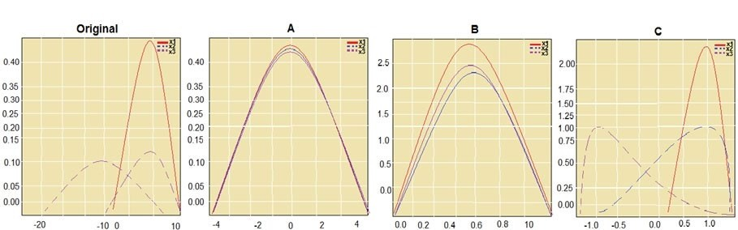
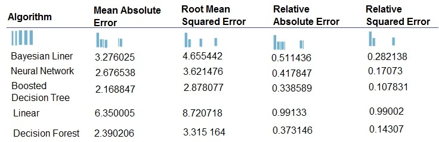
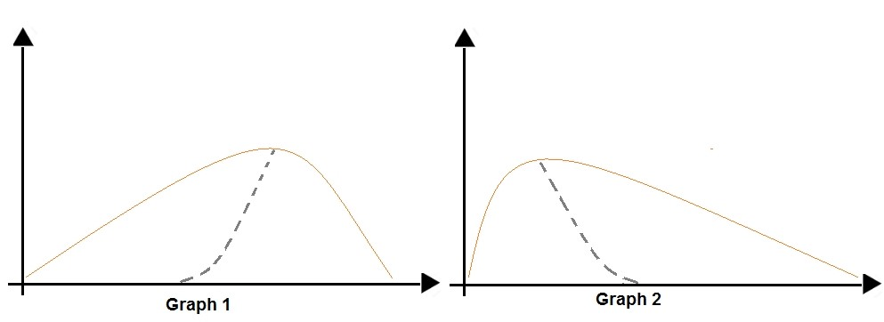

Hello everyone, today we are going to practice some  Azure Data Science Questions. In the following sections we are going to answer several questions that are important in Data Science projects in the IT industry by using
Microsoft Azure.

Microsoft Azure, formerly known as Windows Azure, is Microsoft's public cloud computing platform. It provides a range of cloud services, including compute, analytics, storage and networking. Users can pick and choose from these services to develop and scale new applications, or run existing applications in the public cloud.

We have spited the questions and answers into six parts:[ 1 ](#part-1),   [ 2 ](#part-2),   [ 3 ](#part-3),   [ 4 ](#part-4),   [ 5 ](#part-5),   [ 6 ](#part-6).

# Part 1

<iframe src="https://player.rss.com/ruslanmv/621174" style="width: 100%" title="rss embed thingy" frameborder="0" allow="accelerometer; autoplay; clipboard-write; encrypted-media; gyroscope; picture-in-picture" allowfullscreen><a href="https://rss.com/podcasts/ruslanmv/621174/">Azure Data Science Practice Questions - Part 1 | RSS.com</a></iframe>

1. ### Which two prerequisite wee need to run Docker on Windows?

   Your machine must have BIOS-enabled virtualization and system running  64-bit operating system running Windows

2. ### You need to create the environment with  Python and Scala what should you do?

   Build the environment in Azure Databricks and use Azure Data Factory for
   orchestration

3. ### We need create the environment with Spark instances to perform feature engineering and model building in machine learning pipelines. What you should do?

   Step 1: Create an Azure HDInsight cluster to include the Apache Spark Mlib library

   Step 2: Install Microsot Machine Learning for Apache Spark

   Step 3: Create and execute the Zeppelin notebooks on the cluster

   Step 4: When the cluster is ready, export Zeppelin notebooks to a local environment

4. ### Which environment should you use with with Caffe2 or Chainer frameworks?

   Azure Machine Learning Service  with  Data Science Virtual Machine (DSVM)

5. ### You need to create a virtual machine  with GPU processing. What should you do?

   Create a Data Science Virtual Machine (DSVM) that's based on GPUS.

6. ### Which environment you should  use to to analyze semi-structured, unstructured, and structured data types.?

   Azure Cognitive Services

7. ### You need to transfer the data into Azure Blob. What you should do?

   You can move data to and from Azure Blob storage using different technologies:
   Azure Storage-Explorer
   AzCopy
   Python

8. ### You need to format the data for the Weka environment, Which module should you use?

   Convert to ARFF

9. ### You need to recommend a deep learning framework for speech recognition which framework you should recommend?

   TensorFlow and PyTorch

10. ### You need to configure the DLVM to support CUDA.  What you should do?

    You need environment for deep learning using GPU instances

11. ### You need to select a pre-configured DSVM with  Caffe2 and PyTorch. What should you create?

    Caffe2 and PyTorch is supported by Data Science Virtual Machine for Linux.

12. ### You must create a new n-gram dictionary from the customer review text and set the maximum n-gram size to trigrams.
    What should you select?

    Vocabulary Create
    N-grams 3

13. ### You need to select a compute target to deploy the workspace. What should you use?

    Azure Container Instances can be used as compute target for testing or development

14. ### You are solving a classification task.
    The dataset is imbalanced.Which module should you use?

    Synthetic Minority Oversampling Technique (SMOTE)

15. ### You need to recommend tools and frameworks to perform the following:
    Build deep neural network (DNN) models and Perform interactive data exploration and visualization. Which tools and frameworks should you recommend?

    Build DNN models with  Vowpal Wabbit and use Power BI Desktop which is  a powerful visual data exploration and interactive reporting tool.

16. ### You need to divide data into two distinct datasets.
    Which module should you use?

    Partition and Sample with the Stratified split option outputs multiple datasets, partitioned using the rules you specified.


17. ### You must divide the data into four subsets for evaluation. There is a high degree of missing values in the data.
    Which three modules should you use?

    Import Data
    Cleaning Missing Data
    Partition and Sample

18. ### You must create a subset of the data for testing purposes using a random sampling. Which values should you select?

    Sampling - This is useful if you want to create a smaller representative sample dataset for testing.

    1. Add the Partition and Sample module to your experiment in Studio,  and connect the dataset.

    2. Partition or sample mode: Set this to Sampling.
    3. Rate of sampling. Random seed for sampling.
       The default value is 0, meaning that a starting seed is generated based on the system clock.

19. You have a dataset that contains null rows.
    You need to use the Clean Missing Data module. Which parameter should you use?
    You can remove the row if the missing value can be considered randomly missing
    otherwise Replace with mean

20. You need to register the container as a datastore in an Azure Machine Learning workspace.

    ```
    datastore=Datastore.register_azure_blob_container
    create_if_not_exists = False
    ```


{:start="21"}
21. ### You plan to provision an Azure Machine Learning Basic edition workspace for a data science project.
    Which three tasks will you be able to perform?

    Create a Compute Instance and use it to run code in Jupyter notebooks.
    Create an Azure Kubernetes Service (AKS) inference cluster.
    Create a tabular dataset that supports versioning.

{:start="23"}
23. a) You need to write code to access the datastore from a notebook. How should you code?

    ```
    import azureml.core
    from azure.core import Workspace, Datastore
    ws = Workspace.from_config()
    datastore= Datastore.get(ws,'demo_datastore')
    ```

    b). You must define a dataset that loads all of the sales data to date into a structure that can be easily converted to a dataframe where at the end of each month, a new folder with that month's sales file is added to the sales folder

    Register the dataset with the name sales_dataset and a tag named month indicating the month and year it was registered

24. ### Which enviroment you should use to run an azure machine learning designer trainer pipeline and deploying a web service from Azure ML designer.  What you should do?
    Use the enviroment with computer instance (nb_server)  and Machine Learning Compute (mlc_cluster )

25. ### What is ComputeTargetException class?

    An exception related to failures when creating, interacting with, or configuring a compute target.
    This exception is commonly raised for failures attaching a compute target, missing headers, and unsupported configuration values.

26. ### Which two virtual machines sizes can you use to developing a deep learning model by using TensorFlow?

    Any  virtual machine with GPUS, ie STANDARD_NC12 or  STANDARD_NC24

27. ### a) Which  module should use under the scenario to replace missing  values removing row and columns?

    Clean Missing Data

    ### b) Which  module should use under the scenario Increase the number of low incedence examples in the dataset?

    SMOTE

    ### c) Which  module should use under the scenario to convert a categorical feture into a binary indicator?

    Convert to Indicator Values

    ### d) Which  module should use under the scenario to remove potential duplicates from a dataset?

    Remove Duplicate Rows

28. ### You need to normalize values to produce a feature column grouped into bins. What you should do?

    Apply an Entropy Minimum Description Length (MDL) binning mode.

    This method requires that you select the column you want to predict and the column or columns that you want to group into bins. It then makes a pass over the data and attempts to determine the number of bins that minimizes the entropy. In other words, it chooses a number of bins that allows the data column to best predict the target column.

30. ### You need to normalize values to produce an output column into bins to predict a target column. What you should do?

    Use the Entropy MDL binning mode which has a target column.

31. ### One class has a much smaller number of observations than the other classes in the training set.

    You need to select an appropriate data sampling strategy to compensate for the class imbalance. What you should do?
    Use the Synthetic Minority Oversampling Technique (SMOTE) sampling mode. SMOTE is used to increase the number of underepresented cases in a dataset used for machine learning. SMOTE is a better way of increasing the number of rare cases than simply duplicating existing cases.

32. ### You need to generate a statistical summary that contains the p-value and the unique count for each feature column. What you should do?

    Export Count Table and Summarize Data

    The Export Count Table module is provided for backward compatibility with experiments that use the Build Count Table (deprecated) and Count Featurizer (deprecated) modules.
     Summarize Data statistics are useful when you want to understand the characteristics of the complete dataset.

33. ### You are analyzing a numerical dataset which contains missing values in several columns. You must clean the missing values using an appropriate operation without affecting the dimensionality of the feature set.  What you should do?

    Replace using MICE: For each missing value, this option assigns a new value, which is calculated by using a method described in the statistical literature as "Multivariate Imputation using Chained Equations" or "Multiple Imputation by Chained Equations". With a multiple imputation method, each variable with missing data is modeled conditionally using the other variables in the data before filling in the missing values.

33. ### You are building a regression model using the scikit-learn Python package. You need to transform the text data to be compatible with the scikit-learn Python package. What you should do?

    - Use Pandas. Pandas takes data (like a CSV or TSV file, or a SQL database) and creates a Python object with rows and columns called data frame that looks very similar to table in a statistical software (think Excel or SPSS for example
    - And use  transpose. Reshape the data from the pandas Series to columns.

 {:start="34"}

34. ### Which Azure tool should you use to run Python-based data visualization code?

​	 Azure Notebooks

{:start="36"}

36. ### You must clean the missing values using an appropriate operation without affecting the dimensionality of the feature set. You need to analyze a full dataset to include all values.

    Replace using MICE: For each missing value, this option assigns a new value, which is calculated by using a method described in the statistical literature as "Multivariate Imputation using Chained Equations" or "Multiple Imputation by Chained Equations". 

    With a multiple imputation method, each variable with missing data is modeled conditionally using the other variables in the data before filling in the missing values.

    Note: Multivariate imputation by chained equations (MICE), sometimes called fully conditional specification   or  sequential regression multiple imputation   has emerged in the statistical literature as one principled method of addressing missing data. Creating multiple imputations, as opposed to single imputations, accounts for the statistical uncertainty in the imputations. In addition, the chained equations approach is very flexible and can handle variables of varying types
    (e.g., continuous or binary) as well as complexities such as bounds or survey skip patterns.

{:start="38"}
38. ### You have a small dataset that has missing values in many columns. The data does not require the application of predictors for each column. You will use the Clean Missing Data. Which method should you use?

    Replace using Probabilistic PCA: Compared to other options, such as Multiple Imputation using Chained Equations (MICE), this option has the advantage of not requiring the application of predictors for each column.
	Instead, it approximates the covariance for the full dataset. 
	Therefore, it might offer better performance for datasets that have missing values in many columns.

39. ### You need to divide data into two distinct datasets with  Azure Machine Learning Studio.
    Which module should you use?

    The Group Data into Bins module supports multiple options for binning data. You can customize how the bin edges are set and how values are apportioned into the bins

40. ### You need to access photograph files in the Azure blob container from the Azure Machine Learning service workspace that will be used for deep learning model training. You must minimize data movement.
    What should you do?

    Create a datastore for an Azure Blob container. When you create a workspace, an Azure blob container and an Azure file share are automatically registered to the workspace.

41. ### You must clean the missing values using an appropriate operation without affecting the dimensionality of the feature set. You need to analyze a full dataset to include all values. What you should do?

    Use the Multiple Imputation by Chained Equations (MICE) method.

42. ### How you should write a  custom role can do everything in the workspace except for the following actions:

    It can't create or update a compute resource.
    It can't delete a compute resource.
    It can't add, delete, or alter role assignments.
    It can't delete the workspace.

    ```
    {
       "Name":"Data Scientist Custom",
       "IsCustom":true,
       "Description":"Can run experiment but can't create or delete compute.",
       "Actions":[
          "*"
       ],
       "NotActions":[
          "Microsoft.MachineLearningServices/workspaces/*/delete",
          "Microsoft.MachineLearningServices/workspaces/write",
          "Microsoft.MachineLearningServices/workspaces/computes/*/write",
          "Microsoft.MachineLearningServices/workspaces/computes/*/delete",
          "Microsoft.Authorization/*/write"
       ],
    ```


43. ### You need to normalize values to produce an output column into bins to predict a target column. What you should do?

    Use the Entropy MDL binning mode which has a target column.

{:start="45"}
45. ### You must generate a k-fold algorithm implantation in the Python Scikit-learn machine learning library: and you need to implement a cross-validation to generate the output. How you should do that

    Example

    ```
    from numpy import array
    from sklearn.model_selection impot KFold
    X = np.array([[1, 2], [3, 4], [1, 2], [3, 4]])
    y = np.array([1, 2, 3, 4])
    kf = KFold(n_splits=2)
    kf.get_n_splits(X)
    print(kf)
    ```

{:start="46"}
46. ### You need to split your dataset into training and testing subsets by using the Split Data module.

    You can use Split Rows: Use this option if you just want to divide the data into two parts.

47. ### You need to specify the compute resources to be used for running the code to submit the experiment, and for running the script in order to minimize model training time.

    The ds-workstation compute instance. A workstation notebook instance is good enough to run experiments. With the gpu-cluster compute target.

48. ### Which parameters must you add to the config.json file in order to connect to the workspace?

    resource_group

    subscription_id

    ml-workspace

49. ### You need to split the data with a 0.75:0.25 ratio. Which value should you use for each parameter?

    Split rows, 0.75, randomize split and do not stratified split

50. ### You need to reconfigure the compute resource. What are three possible ways to achieve this goal?

    Use the Azure Machine Learning studio.

    Run the update method of the AmlCompute class in the Python SDK.

    Use the Azure portal.


You've reached the end of the episode of Data Science.

# Part 2

Azure Data Science Practice Questions Part 2.

[back](#part-1)

<iframe src="https://player.rss.com/ruslanmv/621177" style="width: 100%" title="rss embed thingy" frameborder="0" allow="accelerometer; autoplay; clipboard-write; encrypted-media; gyroscope; picture-in-picture" allowfullscreen><a href="https://rss.com/podcasts/ruslanmv/621177/">Azure Data Science Practice Questions - Part 2 | RSS.com</a></iframe>

{:start="51"}
51. ### You are building a machine learning classification. You need to configure the module. You must meet the following requirements: Divide the data into subsets, assign the rows into folds using a round-robin method allow rows in the dataset to be reused. What should you  do?

    1. Use the Split data into partitions option when you want to divide the dataset into subsets of the data.    
    2. Add the Partition and Sample module to your experiment in Studio , and connect the dataset.
    3. For Partition or sample mode, select Assign to Folds.
    4. Use replacement in the partitioning.


52. ###  You create a new Azure subscription. No resources are provisioned in the subscription.  You need You  to create an Azure Machine Learning workspace.  What methods you can do?

    Navigate to Azure Machine Learning studio and create a workspace.

    Use the Azure Command Line Interface (CLI) with the Azure Machine Learning

    Navigate to Azure Machine Learning studio and create a workspace.

53. ###   You need to choose the appropriate estimator to use as well as the appropriate training compute target configuration for Deep Learning. What you should use?

    Tensorflow and Use GPUs for the deep neural network.

54. ###  You must be able to access the contents of store1 by using the Azure Machine Learning SDK for Python What should you do?

    Regenerate the keys of account1

    Update the authentication for store1
    
55. ###  You need to select performance metrics to correctly evaluate the regression model.
    Which two metrics can you use?

    A Root Mean Square Error value that is low. Root mean squared error (RMSE) creates a single value that summarizes the error in the model.

    An R-Squared value close to 1. Coefficient of determination, often referred to as R2, represents the predictive power of the model as a value between 0 and 1. Zero means the model is random (explains nothing); 1 means there is a perfect fit.


56. ###  You need to add logging to the script to allow Hyperdrive to optimize hyperparameters for the AUC metric. What should you do?

    ```
    from sklearn.metrics import roc_auc_score
    import logging
    auc= roc_auc_score(y_test,y_predicted)
    logging.info("AUC"+ str(auc))
    ```

{:start="57"}

57. ###  You must identify the output files that are generated by the experiment run.

    You can list all of the files that are associated with this run record by called run.get_file_names()

58. ###  You  should run python scripts  which allows the same modules to run in parallel,

    The steps parameter is an array of steps. To build pipelines that have multiple steps, place the steps in order in this array.

59. ###   You need to configure the estimator for the experiment so that the script can read the data from a data reference named data_ref that references the csv_files folder in the training_data datastore.
    Which code should you use to configure the estimator?

    Besides passing the dataset through the input parameters in the estimator, you can also pass the dataset through script_params and get the data path (mounting point) in your training script via arguments. This way, you can keep your training script independent of azureml-sdk. In other words, you will be able use the same training script for local debugging and remote training on any cloud platform.

60. ###  You create a multi-class image classification deep learning experiment by using the PyTorch framework  Which three pipeline steps should you run in sequence?

    Step 1: Configure a DataTransferStep() to fetch new image data . 

    Step 2: Configure a PythonScriptStep() to run image_resize.y on the cpu- compute compute target.

    Step 3: Configure the EstimatorStep() to run training script on the gpu_compute computer target.

61. ###  You need to run a script that trains a deep neural network (DNN) model and logs the loss and accuracy metrics.

    Attach the ml vm virtual machine as a compute target in the Azure Machine Learning workspace. Install the Azure ML SDK on the Surface Book and run.

62. ###  You plan to use Hyperdrive to optimize the hyperparameters selected when training a model. What is max_total_runs and Policy EarlyTerminationPolicy and Discrete hyperparameters?

    The maximum total number of runs to create. This is the upper bound; there may be fewer runs when the sample space is smaller than this value.

    Policy EarlyTerminationPolicy - The early termination policy to use. If None - the default, no early termination policy will be used.
    
    Discrete hyperparameters are specified as a choice among discrete values.
    choice can be: one or more comma-separated values.

{:start="68"}
68. ###  You plan to aggregate data for all of the TSV files together and then register the aggregated data as a dataset in an Azure.    What elements are FileDataset references  and  path and TabularDataset.to_pandas_dataframe?

    FileDataset references single or multiple files in datastores or from public URLs.
    The TSV files need to be parsed.

    to_path() gets a list of file paths for each file stream defined by the dataset.

    TabularDataset.to_pandas_dataframe loads all records from the dataset into a pandas DataFrame.
    
    TabularDataset represents data in a tabular format created by parsing the provided file or list of files.

{:start="69"}
69. ###  You need to obtain the output from the pipeline execution. Where will you find the output?

    A file named parallel_run_step.txt located in the output folder 
    
70. ###  You need to use the Azure Machine Learning SDK to configure the schedule for the pipeline.Which four actions should you perform in sequence?

    Step 1: Publish the pipeline.
    To schedule a pipeline, you'll need a reference to your workspace, the identifier of your published pipeline, and the name of the experiment in which you wish to create the schedule.
    
    Step 2: Retrieve the pipeline ID.
    Needed for the schedule.
    
    Step 3: Create a ScheduleRecurrence..


71. ### You create a script for training a machine learning model in Azure Machine Learning service. What is Parameter source_directory,  script_params and the conda_packages ?
    Parameter source_directory is a local directory containing experiment configuration and code files needed for a training job.
    
    script_params is a dictionary of command-line arguments to pass to the training script specified in entry_script.
    The conda_packages parameter is a list of strings representing conda packages to be added to the Python environment for the experiment.

{:start="72"}
72. ###  You need to use the pandas.melt() function in Python to perform the transformation. How you use melt?
    ```
    import pandas as pd
    df=pd.melt(datframe),id_vars='feature',val_vars=list)
    ```
	Example
		
	```
		df = pd.DataFrame({'A': {0: 'a', 1: 'b', 2: 'c'}, ... 'B': {0: 1, 1: 3, 2: 5},
		... 'C': {0: 2, 1: 4, 2: 6}})
		pd.melt(df, id_vars=['A'], value_vars=['B', 'C'])
    ```

{:start="73"}
73. ### Which is the difference between  Categorical variables and continuous variables?

    Gender is categorical.
    Height and Weight is Continuous.

74. ### You need to configure the Preprocess Text that  multiple related words from a single canonical form and Remove pipe characters from text and  Remove words to optimize information retrieval.

    Remove stop words: Select this option if you want to apply a predefined stopword list to the text column. Stop word removal is performed before any other processes.

    Lemmatization converts multiple related words to a single canonical form.

    Remove special characters,

    

75. ###  The script uses modules from the scipy library as well as several Python packages that are not typically installed in a default conda environment
    Create and register an Environment that includes the required packages. Use ·
    this Environment for all experiment runs.

76. ###  You need to record the row count as a metric named row_count that can be returned using the get_metrics method of the run objetct after the experiment completes. Which code should you use?
    run.log('row_count', rows)

77. ###  You need to select an appropriate data sampling strategy to compensate for the class imbalance.
    You use the Synthetic Minority Oversampling Technique (SMOTE) sampling mode.

78. ###  You need to identify outliers in the data. Which two visualizations can you use?
    Box plot

    Scatter plot

    

79. ###  You are evaluating a completed binary classification machine learning model. You need to use the precision as the evaluation metric.
    Binary classification confusion matrix

80. ###  You need to define a primary metric to determine the hyperparameter values that result in the model with the best accuracy score

    Set the primary_metric_goal of the estimator used to run the ·
    bird_classifier_train.py script to maximize.

    Set the primary_metric_name of the estimator used to run the ·
    bird_classifier_train.py script to accuracy.

    Add code to the bird_classifier_train.py script to calculate the validation accuracy ·
    of the model and log it as a float value with the key accuracy.

81. ###  You use the dataset to train a Support Vector Machine (SVM) binary classifier. You need to use the Permutation Feature Importance module in Azure Machine Learning Studio to compute a set of feature importance scores for the dataset.
    Add a Two-Class Support Vector Machine module to initialize the SVM classifier.

    Add a dataset to the experiment

    Add a Split Data module to create training and test dataset. To generate a set of feature scores requires that you have an already trained model, as well as a test dataset.

    Add a Permutation Feature Importance module and connect to the trained model and test dataset.

    Set the Metric for measuring performance property to Classification - Accuracy and then run the experiment.

82. ###  What is random sampling?

    In random sampling, hyperparameter values are randomly selected from the defined search space. Random sampling allows the search space to include both discrete and continuous hyperparameters.

83. ###  The dataset contains categorical features that are highly correlated to the output label column.

    Pearson's correlation statistic, or Pearson's correlation coefficient, is also known in statistical models as the r value. For any two variables, it returns a value that indicates the strength of the correlation

84. a) **What is True Positive?**

    A true positive is an outcome where the model correctly predicts the positive class

    b) **What is True Negative?**

    A true negative is an outcome where the model correctly predicts the negative class.

    c) **What is False Positive?**

    A false positive is an outcome where the model incorrectly predicts the positive class.

    d) **What is  False Negative?**

    A false negative is an outcome where the model incorrectly predicts the negative class.

85. ### You need to use the param_sampling method of the Python API for the Azure Machine Learning Service. How should you ?

    In random sampling, hyperparameter values are randomly selected from the defined search space. Random sampling allows the search space to include both discrete and continuous hyperparameters.
    Example:

    ```
    from azureml.train.hyperdrive import RandomParameterSampling param_sampling = RandomParameterSampling( {
    "learning_rate": **normal**(10, 3),
    "keep_probability": **uniform**(0.05, 0.1),
    "batch_size": **choice**(16, 32, 64)
    }
    ```


{:start="86"}    
86. ### You need to configure automated machine learning to automatically impute missing values and encode categorical features as part of the training task. Which parameter and value pair should you use in the AutoMLConfig class?

    Featurization str or FeaturizationConfig
    Values: 'auto' / 'off' / FeaturizationConfig Indicator for whether featurization step should be done automatically or not, or whether customized featurization should be used. Column type is automatically detected. Based on the detected column type preprocessing/featurization is done as.

87. ### You need to use the designer to create a pipeline that includes steps to perform the following tasks:
    Select the training features using the pandas filter method. Train a model based on the naive_bayes.GaussianNB algorithm.

    Two-Class Neural Network -The Two-Class Neural Network creates a binary classifier using a neural network algorithm.
    Train a model based on the naive_bayes.GaussianNB algorithm.
    
    Execute python script -
    
88. ### You need to determine whether the feature values achieve the conditions to build a Poisson regression model.

    The label data must be whole numbers.

    The label data must be a positive value.

    Poisson regression is intended for use in regression models that are used to predict numeric values, typically counts.

89. ### One class has a much smaller number of observations than the other classes in the training set.
    You need to select an appropriate data sampling strategy to compensate for the class imbalance.

    Use the Synthetic Minority Oversampling Technique (SMOTE) sampling mode.

90. ### You need to add the new feature to the dataset. Which Azure Machine Learning Studio module should you use?

    Typical metadata changes might include marking columns as features.

91. ### You are evaluating a completed binary classification machine learning model. You need to use the precision as the evaluation metric.

    Receiver operating characteristic (or ROC) is a plot of the correctly classified labels vs. the incorrectly classified labels for a particular model.


93. ### You are solving a classification task.
    You must evaluate your model on a limited data sample by using k-fold cross- validation.

    Leave One Out (LOO) cross-validation
    Setting K = n (the number of observations) yields n-fold and is called leave-one out cross-validation (LOO), a special case of the K-fold approach.

94. ### You need to apply the Principal Component Analysis (PCA) method to reduce the dimensionality of the feature set to 10 features in both training and testing sets.

    PCA(n_components = 10)
    Need to reduce the dimensionality of the feature set to 10 features in both training and testing sets.
    Example:

    ```
    from sklearn.decomposition import PCA
    pca = PCA(n_components=2) ;2 dimensions
    principalComponents = pca.fit_transform(x)
    ```

    pca fit_transform(X[, y]) fits the model with X and apply the dimensionality reduction on X.
    transform(x_test),transform(X) applies dimensionality reduction to X.

95. ### The Poisson correlation coefficient (r-value) of X, Y, and Z features

    Z,Y  is  is the value  of the correlaiton and is a positively linear relationship
    +1 indicates a strong positive linear relationship -1 indicates a strong negative linear correlation 0 denotes no linear relationship between the two variables.

96. ### You need to use the appropriate logging methods of the experiment's run object to log the required information

    log - log_image - log_table -

97. training_ds = workspace.datasets.get("training_data") You define an estimator to run the script.

    inputs = [training_ds.as_named_input('training_ds')] ·

98. ###  You need to pass the dataset to ensure that the script can read the files it references.
    Which code segment should you insert to replace the code comment?

    inputs=[file_dataset.as_named_input('training_files').as_mount()], ·

99. ### You need to ingest the data from the CSV file into the designer pipeline using the minimal administrative effort.

    The preferred way to provide data to a pipeline is a Dataset object.

100. ### You need to load the training data.
     Which code segment should you use?

     data_folder = args.data_folder

     train_data = pd.read_csv(os.path.join(data_folder, 'data.csv'))


You've reached the end of the episode of Data Science.

# Part 3

Azure Data Science Practice Questions Part 3.

[back](#part-1)

<iframe src="https://player.rss.com/ruslanmv/621178" style="width: 100%" title="rss embed thingy" frameborder="0" allow="accelerometer; autoplay; clipboard-write; encrypted-media; gyroscope; picture-in-picture" allowfullscreen><a href="https://rss.com/podcasts/ruslanmv/621178/">Azure Data Science Practice Questions - Part 3 | RSS.com</a></iframe>


{:start="101"}
101. ### You need to create a dataset named training_data and load the data from all files into a single data frame

     Use Dataset.Tabular_from_delimeted as the data isn't cleansed.
     

{:start="104"}
104. ### You need to configure the search space for the Hyperdrive experiment. Which two parameter expressions should you use?

     a uniform expression for learning_rate

     a choice expression for batch_size

105. ### You want to use automated machine learning to find the best regression model for predicting the price column.

     - Training_data - The training data to be used within the experiment. It should contain both training features and a label column (optionally a sample weights column). If training_data is specified, then the label_column_name parameter must also be specified.
     
     -  Validation_data - Provide validation data: In this case, you can either start with a single data file and split it into training and validation sets or you can provide a separate data file for the validation set. Either way, the validation_data parameter in your AutoMLConfig object assigns which data to use as your validation set. 
     
       Example, the following code example explicitly defines which portion of the provided data in dataset to use for training and validation. 

       ```
       dataset = Dataset.Tabular.from_delimited_files(data) 
       training_data, validation_data = dataset.random_split(percentage=0.8, seed=1) 
       automl_config = AutoMLConfig(compute_target = aml_remote_compute, task = 'classification', primary_metric = 'AUC_weighted', training_data = training_data, validation_data = validation_data, label_column_name = 'Class' )
       ```
     
     - label_column_name 

{:start="106"}
106. ### What are Hyperparameters in Bayesian Samplig?

     Hyperparameters are adjustable parameters you choose to train a model that govern the training process itself. Azure Machine Learning allows you to automate hyperparameter exploration in an efficient manner, saving you significant time and resources. You specify the range of hyperparameter values and a maximum number of training runs. uniform(low, high) -

     Bayesian sampling does not currently support any early termination policy.

107. ### What is the The last invocation of the automl_classifier returns the best run

     best_run, fitted_model = local_run.get_output()

108. ### You need to ensure that the Automated Machine Learning process evaluates only linear models.

     Clear the option to perform automatic featurization.

     Automatic featurization can fit non-linear models.

109. ### You must add code to the script to record the unique label values as run metrics at the point indicated by the comment.

     label_vals has the unique labels (from the statement label_vals = data['label'].unique()), and it has to be logged.


110. ### Which values should you use in the REST request and to expect in the response?

     1: JSON containing an OAuth bearer token Specify your authentication header in the request. To run the pipeline from the REST endpoint, you need an OAuth2 Bearer-type authentication header.
     
     2: JSON containing the experiment name
     Add a JSON payload object that has the experiment name.


111. ### You start by configuring a k parameter as the number of splits.

      Setting K = n (the number of observations) yields n-fold and is called leave-one out cross-validation (LOO), This is why the usual choice is K=5 or 10.

112. ### The model must be optimized for area under the received operating characteristic curve performance metric, averaged for each class

     Step 1:Create and select a new dataset by uploading he command-delimited file of penguin data.

     Step 2: Select the Classification task type.

     Step 3: Set the Primary metric configuration setting to Accuracy

113. ### Choose the one which has lower training and validation error and also the closest match.
     Minimize variance (difference between validation error and train error).

114. ### The training dataset that you are using is highly unbalanced. You need to evaluate the classification model.  Which primary metric should you use?
     AUC_weighted is a Classification metric.

     Note: AUC is the Area under the Receiver Operating Characteristic Curve. Weighted is the arithmetic mean of the score for each class, weighted by the number of true instances in each class.

     normalized_mean_absolute_error is a regression metric, not a classification metric.

     normalized_root_mean_squared_error is a regression metric, not a classification metric.

115. ### You publish the model as a real-time service on an Azure Kubernetes Service (AKS) inference compute cluster

     The URL of the endpoint.

     The key for the endpoint.

116. ### You plan to use automated machine learning to create a time-series model that predicts temperature over the next seven days.

     1: You choose Forecasting

     Task: The type of task to run. Values can be 'classification', 'regression', or 'forecasting' depending on the type of automated ML problem to solve.

      2: You select Temperature
     The training data to be used within the experiment. It should contain both training features and a label column (optionally a sample weights column).

      3: You choose Observation_time
     time_column_name: The name of the time column. This parameter is required when forecasting to specify the datetime column in the input data used for building the time series and inferring its frequency. This setting is being deprecated. Please use forecasting_parameters instead.

      4: You select 7 - "predicts temperature over the next seven days"
     max_horizon: The desired maximum forecast horizon in units of time-series frequency. The default value is 1.
     Units are based on the time interval of your training data, e.g., monthly, weekly that the forecaster should predict out. When task type is forecasting, this parameter is required.

      5: You select 50 models - "For the initial round of training, you want to train a maximum of 50 different models

{:start="118"}
118. ### The task will attempt to find the best performing model based on a metric named accuracy.

     best_model = automl_run.get_output()

119. ### You need to configure the sampling method for the Hyperdrive experiment.

     Bayesian sampling is based on the Bayesian optimization algorithm and makes intelligent choices on the hyperparameter values to sample next. It picks the sample based on how the previous samples performed, such that the new sample improves the reported primary metric. Bayesian sampling does not support any early termination policy

     Random sampling.

120. ### Which two early termination policies should you use?

     The Median Stopping policy computes running averages across all runs and cancels runs whose best performance is worse than the median of the running averages.
     If no policy is specified, the hyperparameter tuning service will let all training runs execute to completion.


121. ### You need to troubleshoot the failed experiment. What are two possible ways to achieve this goal?

     Use the get_details_with_logs() method of the run object to display the ·
     experiment run logs.

     View the logs for the experiment run in Azure Machine Learning studio.

122. ### You create a tabular dataset containing data that you plan to use to create a classification model.

     Step 1: Create and start a Compute Instance
     To train and deploy models using Azure Machine Learning designer, you need compute on which to run the training process, test the model, and host the model in a deployed service.

     There are four kinds of compute resource you can create:

     Compute Instances: Development workstations that data scientists can use to work with data and models.

     Compute Clusters: Scalable clusters of virtual machines for on-demand processing of experiment code.

     Inference Clusters: Deployment targets for predictive services that use your trained models.

     Attached Compute: Links to existing Azure compute resources, such as Virtual Machines or Azure Databricks clusters.

     Step 2: Create and run a training pipeline.. After you've used data transformations to prepare the data, you can use it to train a machine learning model. Create and run a training pipeline.

     Step 3: Create and run a real-time inference pipeline After creating and running a pipeline to train the model, you need a second pipeline that performs the same data transformations for new data, and then uses the trained model to inference (in other words, predict) label values based on its features. This pipeline will form the basis for a predictive service that you can publish for.

123. ### You need to configure the Tune Model Hyperparameters module. Which two values should you use?

     Number of learning iterations

     Hidden layer specification

124. ### You must use MLflow as the logging package for tracking metrics generated in the experiment.

     1: import mlflow -
     Import the mlflow and Workspace classes to access MLflow's tracking URI and configure your workspace.
     
     2: mlflow.start_run()
     Set the MLflow experiment name with set_experiment() and start your training run with start_run().
     
     3: mlflow.log_metric(' ..')
     Use log_metric() to activate the MLflow logging API and begin logging your training run metrics.
     
     4: mlflow.end_run()

{:start="139"}
139. ### Which parameter sweep mode should you use?

     Maximum number of runs on random grid: This option also controls the number of iterations over a random sampling of parameter values, but the values are not generated randomly from the specified range; instead, a matrix is created of all possible combinations of parameter values and a random sampling is taken over the matrix. This method is more efficient and less prone to regional oversampling or undersampling.

140. ### You need to identify whether the classification model is overfitted.

     The training loss decreases while the validation loss increases when training the model.
     
141. ### You need to configure the run to ensure that the environment includes the required packages for model training. You have instantiated a variable named aml- compute that references the target compute cluster.

     ```
     sk_est = Estimator(source_directory='./my-sklearn-proj', script_params=script_params,
     compute_target=compute_target,
     entry_script='train.py',
     conda_packages=['scikit-learn'])
     ```

{:start="142"}

142. ### You are performing clustering by using the K-means algorithm. You need to define the possible termination conditions

     Centroids do not change between iterations.

     The residual sum of squares (RSS) falls below a threshold.

     A fixed number of iterations is executed.

143. ### You need to evaluate the C-Support Vector classification code. Which evaluation statement should you use?

     1: Automatically adjust weights inversely proportional to class frequencies in the input data
     The  balanced   mode uses the values of y to automatically adjust weights inversely proportional to class frequencies in the input data as n_samples / (n_classes * np.bincount(y)).

     2: Penalty parameter

144. ### You need to build and train the machine learning model to learn the sequence of the textual content.
     Which type of neural network should you use?

     To translate a corpus of English text to French, we need to build a recurrent neural network (RNN).
     Note: RNNs are designed to take sequences of text as inputs or return sequences of text as outputs, or both. They're called recurrent because the network's hidden layers have a loop in which the output and cell state from each time step become inputs at the next time step. This recurrence serves as a form of memory.

145. ### You create a binary classification model.
     You need to evaluate the model performance.
     Which two metrics can you use?

     Precision and accuracy.
     
     The evaluation metrics available for binary classification models are: Accuracy, Precision, Recall, F1 Score, and AUC.
     
146. ### You need to use Azure Machine Learning to find the combination of batch size and learning rate that results in the model with the lowest validation loss.
     What should you do?

     Run the script in an experiment based on a HyperDriveConfig object ·
     
147. ### You need to ensure the pipeline runs automatically whenever the data in the folder changes.
     What should you do?

     Create a Schedule for the pipeline. Specify the datastore in the datastore ·
     property, and the folder containing the training data in the path_on_datastore property

# Part 4

Azure Data Science Practice Questions Part 4.

[back](#part-1)

<iframe src="https://player.rss.com/ruslanmv/621181" style="width: 100%" title="rss embed thingy" frameborder="0" allow="accelerometer; autoplay; clipboard-write; encrypted-media; gyroscope; picture-in-picture" allowfullscreen><a href="https://rss.com/podcasts/ruslanmv/621181/">Azure Data Science Practice Questions - Part 4 | RSS.com</a></iframe>

{:start="151"}
151. ###  You must specify an appropriate mode for the dataset argument. Which two modes can you use

     as_download()

     as_mount()

152. ### You need to reference a Python class object from the SDK for the statement.
     Which class object should you use?

     A run represents a single trial of an experiment. Runs are used to monitor the asynchronous execution of a trial, log metrics and store output of
     the trial, and to analyze results and access artifacts generated by the trial.

153. ### You need to download the log files to a local folder for review.

     run.get_details()

     run.get_all_logs(destination='./runlogs')

154. ### You need to add code to start the experiment and run the script.

     run = script_experiment.submit(config=script_config)

155. ### You use the following code to define the steps for a pipeline:

     After you define your steps, you build the pipeline by using some or all of those steps.

     pipeline1 = Pipeline(workspace=ws, steps=[compare_models])

     pipeline_run1 = Experiment(ws, 'Compare_Models_Exp').submit(pipeline1)

156. You create an Azure Databricks workspace and a linked Azure Machine Learning workspace.

      a) By the following code a resource group and Azure Machine Learning workspace will be created?

     	ws = Workspace.get(name="myworkspace",
     					subscription_id='<azure-subscription-id>', 
     					resource_group='myresourcegroup')

      No, The Workspace.get method loads an existing workspace without using configuration files. 

     b) An azure Databricks experiment will be tracked only in the Azure Machine Learning Workspace? 
     
		Yes. MLflow Tracking with Azure Machine Learning lets you store the logged metrics and artifacts from your local runs into your Azure Machine
     	Learning workspace.
     	The get_mlflow_tracking_uri() method assigns a unique tracking URI address to the workspace, ws, and set_tracking_uri() points the MLflow tracking URI to that address.
     
	 c) The epoch loss metric is set to be tracked?
     	
	
		Yes. In Deep Learning, epoch means the total dataset is passed forward and backward in a neural network once.

{:start="157"}
157. ### You must specify a value for the ParallelRunConfig compute_target setting of the pipeline step

     AmlCompute

158. ### Which datasets should you use to configure the data drift monitor?

     1: training-dataset .
     Baseline dataset - usually the training dataset for a model.

     2: predictions-dataset .
     Target dataset - usually model input data - is compared over time to your baseline dataset. This comparison means that your target dataset
     must have a timestamp column specified.
     The monitor will compare the baseline and target datasets.

159. ### You need to write code to define a ScriptRunConfig object for the experiment and pass the ds dataset as an argument.

     If you have structured data not yet registered as a dataset, create a TabularDataset and use it directly in your training script for your local or remote experiment.
     To load the TabularDataset to pandas DataFrame
     df = dataset.to_pandas_dataframe()

160. ### You need to verify that the web service returns predictions in the expected JSON format when a valid REST request is submitted. Which compute resources should you use?

     1: ds-workstation notebook VM
     An authenticated connection must not be required for testing. On a Microsoft Azure virtual machine (VM), including a Data Science Virtual Machine (DSVM), you create local user accounts while provisioning the VM. Users then authenticate to the VM by using these credentials.

     2: gpu-compute cluster. 
     Image classification is well suited for GPU compute clusters

161. ### You need to configure compute resources for model inferencing.
     Which compute type should you use?

     Azure Kubernetes Service

162. ### You need to monitor the progress of the pipeline execution. What are two possible ways to achieve this goal?

     A batch inference job can take a long time to finish. This example monitors progress by using a Jupyter widget. You can also manage the job's progress by using:
     Azure Machine Learning Studio.
     Console output from the PipelineRun object.
     from azureml.widgets import RunDetails
     RunDetails(pipeline_run).show()
     pipeline_run.wait_for_completion(show_output=True)

163. ### You need to create the inferencing script for the ParallelRunStep pipeline step. Which two functions should you include?

     run(mini_batch)

     init()


164. ### You need to troubleshoot the deployment failure by determining the actions that were performed during deployment and identifying the specific action that failed.

     You can print out detailed Docker engine log messages from the service object. You can view the log for ACI, AKS, and Local deployments.

165. ### You need to invoke the deployed model using native SDK classes and methods

     from azureml.core.webservice import Webservice 
	 The following code shows how to use the SDK to update the model, environment, 
	 and entry script for a web service to Azure Container Instances:
     ```
	from azureml.core import Environment 
	 from azureml.core.webservice import Webservice 
	 from azureml.core.model import Mod	el, InferenceConfig 
	predictions = service.run(input_json) 
	```
	


{:start="166"}
166. ### You need to ensure that the correct version of PyTorch can be identified for the inferencing environment when the model is deployed.

     Register the model, specifying the model_framework and 
     model_framework_version properties.

167. ### You must deploy the model as a real-time inference service for testing.

     Azure Container Instances (ACI) are suitable only for small models less than 1 GB in size.
     Use it for low-scale CPU-based workloads that require less than 48 GB of RAM. Note: Microsoft recommends using single-node Azure Kubernetes Service (AKS) clusters for dev-test of larger models.

168. ### Which configuration setting should you specify in the ParallelRunConfig object for the PrallelRunStep step?

     node_count is the number of nodes in the compute target used for running the ParallelRunStep.

169. ### You deploy a real-time inference service for a trained model.

     Enable Azure Application Insights for the service endpoint and view logged data 
     in the Azure portal.

170. ### You need to write a script that uses the Azure Machine Learning SDK to deploy the model. The necessary modules have been imported

      AksCompute -AksWebservice. 

171. ### You need to improve performance of the image classification web service with minimal downtime and minimal administrative effort. What should you advise the IT Operations team to do?

     Increase the node count of the compute cluster where the web service is 
     deployed.

172. ### You need to publish the inference pipeline as a web service. Which compute type should you use?
     Azure Kubernetes Service (AKS) can be used real-time inference.

173. ### You plan to deploy the model as a real-time web service. Applications must use key-based authentication to use the model.

     Web services deployed on AKS have key-based auth enabled by default. ACI- deployed services have key-based auth disabled by default, but you can enable it by setting auth_enabled = TRUE when creating the ACI web service. 

174. ### You train and register a machine learning model. You plan to deploy the model as a real-time web service

     Key-based authentication.
     Web services deployed on AKS have key-based auth enabled by default. 
	 ACI- deployed services have key-based auth disabled by default, but you can enable it by setting auth_enabled = TRUE when creating the ACI web service.

175. ### You need to use the Python SDK in the notebook to determine the events that occurred during service deployment an initialization.

     The first step in debugging errors is to get your deployment logs. In Python:
     service.get_logs()

176. ### You need to ensure that every step in the pipeline is run, even if the parameters and contents of the source directory have not changed since the previous run.

     Set the regenerate_outputs property of the pipeline to True.

     Set the allow_reuse property of each step in the pipeline to False.

177. ### You are ready to deploy the model as a real-time web service. You deploy the model to an Azure Kubernetes Service (AKS) inference cluster, but the deployment fails because an error occurs when the service runs the entry script that is associated with the model deployment. You need to debug the error by iteratively modifying the code and reloading the service, without requiring a re-deployment of the service for each code update.  What should you do?

     Create an Azure Container Instances (ACI) web service deployment 
     configuration and deploy the model on ACI.

178. ### You use Azure Machine Learning designer to create a training pipeline for a regression model.
     You need to prepare the pipeline for deployment as an endpoint that generates predictions asynchronously for a dataset of input data values.

     Create a real-time inference pipeline from the training pipeline.

179. ### You need to register the new version of a model while keeping the current version of the model in the registry.
     What should you do?

     Register the model with the same name as the existing model.

180. ### You need to register the model and ensure that the models created by subsequent retraining experiments are registered only if their accuracy is higher than the currently registered model. What are two possible ways to achieve this goal?
     - Specify the model framework version when registering the model, and only 
     register subsequent models if this value is higher.

     - Specify a tag named accuracy with the accuracy metric as a value when 
     registering the model, and only register subsequent models if their accuracy is higher than the accuracy tag value of the currently registered model-

{:start="181"}
181. ### You must deploy the model as an Azure Machine Learning real-time web service using the Model.deploy method in the Azure Machine Learning SDK. The deployed web service must return real-time predictions of fraud based on transaction data input.
     You need to create the script that is specified as the entry_script parameter for the InferenceConfig class used to deploy the model.
     What should the entry script do?

     - Load the model and use it to predict labels from input data.
     

{:start="182"}
182. ### You need to create an entry script for the service that ensures that the model is loaded when the service starts and is used to score new data as it is received. Which functions should you include in the script?

     1: init()
     The entry script has only two required functions, init() and run(data).

     2: run()

183. ### You need to deploy the model as an Azure Machine Learning real-time web service endpoint on compute that can dynamically scale up and down to support demand.
     Which deployment compute option should you use?

     Azure Machine Learning Compute Instance
     Azure Machine Learning compute cluster is a managed-compute infrastructure that allows you to easily create a single or multi-node compute.

184. ### You create a real-time inference pipeline from the training pipeline. You observe that the schema for the generated web service input is based on the dataset and includes the label column that the model predicts. Client applications that use the service must not be required to submit this value.
     Add a Select Columns in Dataset module to the inference pipeline after the dataset and use it to select all columns other than the label.

185. ### You must deploy the real-time inference pipeline as a web service.
     What must you do before you deploy the real-time inference pipeline?

     Create an Azure Machine Learning compute cluster.

186. ### You must use DB-cluster to run experiments from notebooks that you import into DB-workspace.
     You need to use ML-workspace to track MLflow metrics and artifacts generated by experiments running on DB-cluster. The solution must minimize

     From DB-workspace, configure the Link Azure ML workspace option.

187. ### You need to detect data drift between a baseline dataset and a subsequent target dataset by using the DataDriftDetector class.
     How should you complete the code segment?

     1: create_from_datasets. 
     The create_from_datasets method creates a new DataDriftDetector object from a baseline tabular dataset and a target time series dataset.

     2: backfill -
     The backfill method runs a backfill job over a given specified start and end date.

188. ### You must store additional metadata about the model in a key-value format. You must be able to add new metadata and modify or delete metadata
     after creation.

     properties - azureml.core.Model.properties:
     Dictionary of key value properties for the Model. These properties cannot be changed after registration, however new key value pairs can be

189. ### You want to test the pipeline before deploying the script.
     You need to display the pipeline run details written to the STDOUT output when the pipeline completes.

     wait_for_completion: Wait for the completion of this run. Returns the status object after the wait.

190. ### You want to understand how your model is making selections and must be sure that the model does not violate government regulations such as denying loans based on where an applicant lives.
     You need to determine the extent to which each feature in the customer data is influencing predictions.

     Use the interpretability package to generate an explainer for the model.
     
191. ### The run used the model interpretation support in Azure Machine Learning to generate and upload a model explanation.
     Business managers in your organization want to see the importance of the features in the model.

     from_run_id -
     from_run_id(workspace, experiment_name, run_id) Create the client with factory method given a run ID. Returns an instance of the ExplanationClient.

     2: list_model_explanations -
     list_model_explanations returns a dictionary of metadata for all model explanations available.

{:start="193"}
193. ### You train a classification model by using a logistic regression algorithm. You must be able to explain the model's predictions by calculating the importance of each feature, both as an overall global relative importance value and as a measure of local importance for a specific set of predictions. You need to create an explainer that you can use to retrieve the required global and local feature importance values.

     Solution: Create a MimicExplainer.

     Instead use Permutation Feature Importance Explainer (PFI). Note 1: Mimic explainer is based on the idea of training global surrogate models to mimic blackbox models


194. You train a classification model by using a logistic regression algorithm. You must be able to explain the model's predictions by calculating the importance of each feature, both as an overall global relative importance value and as a measure of local importance for a specific set of predictions. You need to create an explainer that you can use to retrieve the required global and local feature importance values.

     Solution: Create a TabularExplainer.

     Instead use Permutation Feature Importance Explainer (PFI). Note 1: Mimic explainer is based on the idea of training global surrogate models to mimic blackbox models.

195. ### You train a classification model by using a logistic regression algorithm. You must be able to explain the model's predictions by calculating the importance of each feature, both as an overall global relative importance value and as a measure of local importance for a specific set of predictions. You need to create an explainer that you can use to retrieve the required global and local feature importance values.
     Solution: Create a PFIExplainer.

     Permutation Feature Importance Explainer (PFI): Permutation Feature Importance is a technique used to explain classification and regression models. At

196. ### You are performing feature scaling by using the scikit-learn Python library for x.1 x2, and x3 features.
     Original and scaled data is shown in the following image.

     
     
     
     
     
     
     StandardScaler -
     The StandardScaler assumes your data is normally distributed within each feature and will scale them such that the distribution is now centred around 0, with a standard deviation of 1.

     Min Max Scaler -
     
     Notice that the skewness of the distribution is maintained but the 3 distributions are brought into the same scale so that they overlap.
     
     Normalizer
     
197. ### Estimated values in one set of data may be more than or less than reference values in the other set of data. You must produce a distribution that has a constant
     Type I error as a function of the correlation.
     You need to produce the distribution.
     Which type of distribution should you produce?

     Paired t-test with a two-tail option

198. ### Several independent variables are highly correlated. You need to select appropriate methods for conducting effective feature engineering on all the data.
     Which three actions should you perform in sequence?

     Step 1: Use the Filter Based Feature Selection module Filter Based Feature Selection identifies the features in a dataset with the greatest predictive power.
     The module outputs a dataset that contains the best feature columns, as ranked by predictive power. It also outputs the names of the features and their scores from the selected metric.
     
	 Step 2: Build a counting transform
     A counting transform creates a transformation that turns count tables into features, so that you can apply the transformation to multiple datasets.
     
	 Step 3: Test the hypothesis using t-Test

199. ### You must add a feature named CityName and populate the column value with the text London.
     You need to add the new feature to the dataset. Which Azure Machine Learning Studio module should you use?

     Edit Metadata - Typical metadata changes might include marking columns as features.

# Part 5

Azure Data Science Practice Questions Part 5.

[back](#part-1)

<iframe src="https://player.rss.com/ruslanmv/621184" style="width: 100%" title="rss embed thingy" frameborder="0" allow="accelerometer; autoplay; clipboard-write; encrypted-media; gyroscope; picture-in-picture" allowfullscreen><a href="https://rss.com/podcasts/ruslanmv/621184/">Azure Data Science Practice Questions - Part 5 | RSS.com</a></iframe>

{:start="200"}

200. ### You are creating a model to predict the price of a student's artwork depending on the following variables: the student's length of education, degree type, and art form.
     You start by creating a linear regression model. You need to evaluate the linear regression model.

     Solution: Use the following metrics: Mean Absolute Error, Root Mean Absolute Error, Relative Absolute Error, Relative Squared Error, and the Coefficient of Determination.
     Does the solution meet the goal?

     The following metrics are reported for evaluating regression models. When you compare models, they are ranked by the metric you select for evaluation. Mean absolute error (MAE) measures how close the predictions are to the actual outcomes; thus, a lower score is better.
     Root mean squared error (RMSE) creates a single value that summarizes the error in the model.

201. ### You are creating a model to predict the price of a student's artwork depending on the following variables: the student's length of education, degree type, and art form.
     You start by creating a linear regression model. You need to evaluate the linear regression model. Solution: Use the following metrics: Accuracy, Precision, Recall, F1 score, and AUC.
     Does the solution meet the goal?

     Those are metrics for evaluating classification models, instead use: Mean Absolute Error, Root Mean Absolute Error, Relative Absolute Error, Relative Squared
     Error, and the Coefficient of Determination.

202. ### You are creating a model to predict the price of a student's artwork depending on the following variables: the student's length of education, degree type, and art form.
     You start by creating a linear regression model. You need to evaluate the linear regression model. Solution: Use the following metrics: Relative Squared Error, Coefficient of Determination, Accuracy, Precision, Recall, F1 score, and AUC.
     Does the solution meet the goal?
     Relative Squared Error, Coefficient of Determination are good metrics to evaluate the linear regression model, but the others are metrics for classification models.

203. ### You are a data scientist creating a linear regression model. You need to determine how closely the data fits the regression line. Which metric should you review?
     Coefficient of determination, often referred to as R2, represents the predictive power of the model as a value between 0 and 1. Zero means the model is random

204. You are creating a binary classification by using a two-class logistic regression model.
     You need to evaluate the model results for imbalance.
     Which evaluation metric should you use?

     AUC Curve -One can inspect the true positive rate vs. the false positive rate in the Receiver Operating Characteristic (ROC) curve and the corresponding Area Under the Curve (AUC) value. The closer this curve is to the upper left corner; the better the classifier's performance is (that is maximizing the true positive rate while minimizing the false positive rate). Curves that are close to the diagonal of the plot, result from classifiers that tend to make predictions that are close to random guessing.

205. ### You are developing a linear regression model in Azure Machine Learning Studio. You run an experiment to compare different algorithms. The following image displays the results dataset output:

     

     Which algorithm minimizes differences between actual and predict values? 

     Boosted Decision Tree Regression
     Mean absolute error (MAE) measures how close the predictions are to the actual outcomes; thus, a lower score is better.

     Which approach should you use to find the best parameters for a Linear Regression model for Online Gradient Descent method.? 

     Online Gradient Descent: If you want the algorithm to find the best parameters for you, set Create trainer mode option to Parameter Range. You can then specify multiple values for the algorithm to try.

206. ###  You need to select the bias and variance properties of the model with varying tree depth values.

     ###  Which properties should you select for each tree depth? 
     In decision trees, the depth of the tree determines the variance. A complicated decision tree (e.g. deep) has low bias and high variance. Note: In statistics and machine learning, the bias  "variance tradeoff is the property of a set of predictive models whereby models with a lower bias in parameter estimation have a higher variance of the parameter estimates across samples, and vice versa. Increasing the bias will decrease the variance. Increasing the variance will decrease the bias.

207. ### You need to identify a parameter set for the new model using Azure Machine Learning Studio. Which module you should use for each step? 
     1: Split data.

     2: Partition and Sample.

     3: Two-Class Boosted Decision Tree.

     4: Tune Model Hyperparameters

208. ### You are analyzing the asymmetry in a statistical distribution. The following image contains two density curves that show the probability distribution of two datasets.

     

     1: Positive skew -
     Positive skew values means the distribution is skewed to the right.

     2: Negative skew -
     Negative skewness values mean the distribution is skewed to the left.

209. ### The CNN model you build shows signs of overfitting. You need to reduce overfitting and converge the model to an optimal fit. Which two actions should you perform? 

     Add L1/L2 regularization.

     Reduce the amount of training data.

      Weight regularization provides an approach to reduce the overfitting of a deep learning neural network model on the training data and improve the performance of the model on new data, such as the holdout test set. Keras provides a weight regularization API that allows you to add a penalty for weight size to the loss function.

      Three different regularizer instances are provided; they are:

      L1: Sum of the absolute weights.

      L2: Sum of the squared weights.

      L1L2: Sum of the absolute and the squared weights.

       Because a fully connected layer occupies most of the parameters, it is prone to overfitting. One method to reduce overfitting is dropout. At each training stage, individual nodes are either "dropped out" of the net with probability 1-p or kept with probability p, so that a reduced network is left; incoming and outgoing edges to a dropped-out node are also removed.
      By avoiding training all nodes on all training data, dropout decreases overfitting.

210. ### The CNN model you build shows signs of overfitting. You need to reduce overfitting and converge the model to an optimal fit. Which two actions should you perform? 

     Add L1/L2 regularization.

     Reduce the amount of training data.

211. ### You are creating a model to predict the price of a student's artwork depending on the following variables: the student's length of education, degree type, and art form.
     You start by creating a linear regression model. You need to evaluate the linear regression model. Solution: Use the following metrics: Mean Absolute Error, Root Mean Absolute Error, Relative Absolute Error, Accuracy, Precision, Recall, F1 score, and AUC.

     Accuracy, Precision, Recall, F1 score, and AUC are metrics for evaluating classification models.
     Note: Mean Absolute Error, Root Mean Absolute Error, Relative Absolute Error are OK for the linear regression model.

212. ### The training set is imbalanced between two classes. You need to resolve the data imbalance.
     What are three possible ways to achieve this goal? 
     Penalize the classification

     Resample the dataset using undersampling or oversampling 

     Generate synthetic samples in the minority class

213. ### The variable feature_names is a list of all feature names, and class_names is a list of all class names.

     ```
     from interpret.ext.blackbox import TabularExplainer 
     explainer = TabularExplainer(model, x_train, features=feature_names, classes=class_names) 
     ```
     
     ### You need to explain the predictions made by the model for all classes by determining the importance of all features.
     
     1:TabularExplainer calls one of the three SHAP explainers underneath (TreeExplainer, DeepExplainer, or KernelExplainer).
     
     2: To make your explanations and visualizations more informative, you can choose to pass in feature names and output class names if doing classification.
     
     3: TabularExplainer automatically selects the most appropriate one for your use case, but you can call each of its three underlying explainers underneath (TreeExplainer, DeepExplainer, or KernelExplainer) directly.


{:start="215"}
215. ### You must use the Fairlearn dashboard to assess fairness in a selected model. Which three actions should you perform in sequence? 
     
     Step 1: Select a model feature to be evaluated.
     
	 Step 2: Select a binary classification or regression model.
	
     Register your models within Azure Machine Learning. For convenience, store the results in a dictionary, which maps the id of the registered
     model (a string in name:version format) to the predictor itself.
     
216. ### You create and train a binary classification model to support selection and admission of patients to the trial. The model includes the followingfeatures: Age,Gender, and Ethnicity.
     The model returns different performance metrics for people from different ethnic groups.
     You need to use Fairlearn to mitigate and minimize disparities for each category in the Ethnicity feature.
     Which technique and constraint should you use? 
      1: Grid Search .
     Fairlearn open-source package provides postprocessing and reduction unfairness mitigation algorithms: ExponentiatedGradient, GridSearch,
	and ThresholdOptimizer.
     
     Note: The Fairlearn open-source package provides postprocessing and reduction unfairness mitigation algorithms types:
     
     Reduction: These algorithms take a standard black-box machine learning estimator (e.g., a LightGBM model) and generate a set of retrained
     models using a sequence of re-weighted training datasets.
     Post-processing: These algorithms take an existing classifier and the sensitive feature as input.
     
     2: Demographic parity .
     The Fairlearn open-source package supports the following types of parity constraints: Demographic parity, Equalized odds, Equal opportunity,
     and Bounded group loss.

{:start="219"}
219. ### You need to implement a Data Science Virtual Machine (DSVM) that supports the Caffe2 deep learning framework. Which DSVM should you create?
     Caffe2 is supported by Data Science Virtual Machine for Linux.
     Microsoft offers Linux editions of the DSVM on Ubuntu 16.04 LTS and CentOS 7.4.
     However, only the DSVM on Ubuntu is preconfigured for Caffe2.

220. ### You have been tasked with employing a machine learning model, which makes use of a PostgreSQL database and needs GPU processing, to forecast prices.
     You are preparing to create a virtual machine that has the necessary tools built into it.
     You need to make use of the correct virtual machine type.
     Recommendation: You make use of a Geo AI Data Science Virtual Machine (Geo-DSVM) Windows edition
     The Azure Geo AI Data Science VM (Geo-DSVM) delivers geospatial analytics capabilities from Microsoft's Data Science VM. Specifically, this
     VM extends the AI and data science toolkits in the Data Science VM by adding ESRI's market-leading ArcGIS Pro Geographic Information
     System.

221. ### You are preparing to create a virtual machine that has the necessary tools built into it.
     You need to make use of the correct virtual machine type.
     Recommendation: You make use of a Deep Learning Virtual Machine (DLVM) Windows edition.

     DLVM is a template on top of DSVM image. In terms of the packages, GPU drivers etc are all there in the DSVM image. Mostly it is for
     convenience during creation where we only allow DLVM to be created on GPU VM instances on Azure.

222. ### You have been tasked with employing a machine learning model, which makes use of a PostgreSQL database and needs GPU processing, to forecast prices.
     You are preparing to create a virtual machine that has the necessary tools built into it.
     You need to make use of the correct virtual machine type.
     Recommendation: You make use of a Data Science Virtual Machine (DSVM) Windows edition.
     In the DSVM, your training models can use deep learning algorithms on hardware that's based on graphics processing units (GPUs).
     PostgreSQL is available for the following operating systems: Linux (all recent distributions), 64-bit installers available for macOS (OS X) version
     10.6 and newer "

223. ### You have been tasked with moving data into Azure Blob Storage for the purpose of supporting Azure Machine Learning. How can be completed your task?
     You can move data to and from Azure Blob storage using different technologies:
     Azure Storage-Explorer.
     AzCopy.
     Python.
     SSIS.
{:start="225"}
225. ### You have been tasked with designing a deep learning model, which accommodates the most recent edition of Python, to recognize language. You have to include a suitable deep learning framework in the Data Science Virtual Machine (DSVM).
     You should consider including TensorFlow.

226. ### You have been tasked with evaluating your model on a partial data sample via k-fold cross-validation.
     You have already configured a k parameter as the number of splits. You now have to configure the k parameter for the cross-validation with the
     usual value choice.
     Recommendation: You configure the use of the value k=3.
     Will the requirements be satisfied?

     No

227. ### You have already configured a k parameter as the number of splits. You now have to configure the k parameter for the cross-validation with the usual value choice.
     Recommendation: You configure the use of the value k=10.
     Will the requirements be satisfied?
     yes- Leave One Out (LOO) cross-validation
     Setting K = n (the number of observations) yields n-fold and is called leave-one out cross-validation (LOO), a special case of the K-fold
     approach.
     LOO CV is sometimes

228. ### You would like to split data into two separate datasets. Which actions should you take?
     You should make use of the Group Data into Bins module.

229. ### You have to makes sure that the pipeline trains a model using data in a comma-separated values (CSV) file that is published on a website. A dataset for the file for this file does not exist.
     Data from the CSV file must be ingested into the designer pipeline with the least amount of administrative effort as possible.
     Which actions should you take?
     You should add the Dataset object to the pipeline.

     The preferred way to provide data to a pipeline is a Dataset object. The Dataset object points to data that lives in or is accessible from a
     datastore or at a Web

{:start="232"}
232. ### You plan to make use of the Clean Missing Data module in Azure Machine Learning Studio to detect and fix the null and missing values in the dataset.
     Recommendation: You make use of the Remove entire row option.
     Will the requirements be satisfied?
     Yes- Remove entire row: Completely removes any row in the dataset that has one or more missing values. This is useful if the missing value can be
     considered randomly missing.

233. ### You need to consider the underlined segment to establish whether it is accurate.
     To transform a categorical feature into a binary indicator, you should make use of the Clean Missing Data module.
     Select  No adjustment required   if the underlined segment is accurate. If the underlined segment is inaccurate, select the accurate option.

     Convert to Indicator Values

234. ### You need to consider the underlined segment to establish whether it is accurate.
     To improve the amount of low incidence cases in a dataset, you should make use of the SMOTE module.

     No adjustment required. - Use the SMOTE module in Azure Machine Learning Studio to increase the number of underrepresented cases in a dataset used for machine
     learning. SMOTE is a better way of increasing the number of rare cases than simply duplicating existing cases.

235. ### You are planning to host practical training to acquaint learners with data visualization creation using Python. Learner devices are able to connect to the internet.
     The box-plot algorithm can be used to display outliers.

236. ### Learner devices are currently NOT configured for Python development. Also, learners are unable to install software on their devices as they lack administrator permissions. Furthermore, they are unable to access Azure subscriptions.
     It is imperative that learners are able to execute Python-based data visualization code.
     You should consider configuring the use of Azure Notebooks.

237. ### Replace using Probabilistic PCA: Compared to other options, such as Multiple Imputation using Chained Equations (MICE), this option has the advantage of not requiring the application of predictors for each column. 

     Instead, it approximates the covariance for the full dataset. Therefore,
     it might offer better performance for datasets that have missing values in many columns.

238. ### You have recently concluded the construction of a binary classification machine learning model. You are currently assessing the model. You want to make use of a visualization that allows for precision to be used as the measurement for the
     assessment. Which actions should you take?
     You should consider using the Binary classification confusion matrix visualization.

239. ### You have already configured a k parameter as the number of splits. You now have to configure the k parameter for the cross-validation with the usual value choice.
     Recommendation: You configure the use of the value k=1.
     Will the requirements be satisfied?
     No
	 
{:start="241"}
241. ### You are in the process of carrying out feature engineering on a dataset.
     You want to add a feature to the dataset and fill the column value.
     Recommendation: You must make use of the Join Data Azure Machine Learning Studio module.
     Will the requirements be satisfied?

     No

242. ### You are in the process of carrying out feature engineering on a dataset. You want to add a feature to the dataset and fill the column value.
     Recommendation: You must make use of the Edit Metadata Azure Machine Learning Studio module.
     Will the requirements be satisfied?
     Yes - Typical metadata changes might include marking columns as features.

243. ### You plan to perform a paired t-test.
     Which conditions that must apply to use a paired t-test?

     You have a matched pairs of scores.

     The sampling distribution of d is normal.

244. ### The classification model will be trained via the Automated Machine Learning interface using the Classification task type. You have been informed that only linear models need to be assessed by the Automated Machine Learning.
     Which actions should you take?
     You should disable automatic featurization.

245. ### You want to make sure that automated machine learning is configured as follows: missing values must be automatically imputed.
     categorical features must be encoded as part of the training task.
     Which actions should you take?
     You should make use of the featurization parameter with the 'auto' value pair.

246. ### You perform an experiment to assess various algorithms. Which algorithm reduces the variances between actual and predicted values?
     Boosted Decision Tree Regression - Mean absolute error (MAE) measures how close the predictions are to the actual outcomes; thus, a lower score is better.

{:start="246"}
249. ### You have been tasked with constructing a machine learning model that translates language text into a different language text. The machine learning model must be constructed and trained to learn the sequence of the.
     Recommendation: You make use of Recurrent Neural Networks (RNNs).
     Will the requirements be satisfied?
     Yes - Note: RNNs are designed to take sequences of text as inputs or return sequences of text as outputs, or both. They TMre called recurrent
     because the network  TMs hidden layers have a loop in which the output and cell state from each time step become inputs at the next time step.
     This recurrence serves as a form of memory.
     It allows contextual information to flow through the network so that relevant outputs from previous time steps can be applied to network
     operations at the current time step.

250. ### You have been tasked with evaluating the performance of a binary classification model that you created.
     You need to choose evaluation metrics to achieve your goal.
     Which metrics you would choose

     The evaluation metrics available for binary classification models are: Accuracy, Precision, Recall, F1 Score, and AUC.
     Note: A very natural question is: ~Out of the individuals whom the model, how many were classified correctly (TP)? TM
     This question can be answered by looking at the Precision of the model, which is the proportion of positives that are classified correctly


# Part 6

Azure Data Science Practice Questions Part 6.

[back](#part-1)

<iframe src="https://player.rss.com/ruslanmv/621185" style="width: 100%" title="rss embed thingy" frameborder="0" allow="accelerometer; autoplay; clipboard-write; encrypted-media; gyroscope; picture-in-picture" allowfullscreen><a href="https://rss.com/podcasts/ruslanmv/621185/">Azure Data Science Practice Questions - Part 6 | RSS.com</a></iframe>

{:start="252"}
252. ### You are preparing to carry out a parameter sweep of the model to tune hyperparameters. You have to make sure that the sweep allows for every possible combination of hyperparameters to be iterated. Also, the computing resources needed to carry out the sweep must be reduced. Which  actions should you take?

     You should consider making use of the Random grid sweep mode.

     Maximum number of runs on random grid: This option also controls the number of iterations over a random sampling of parameter values, but
     the values are not generated randomly from the specified range; instead, a matrix is created of all possible combinations of parameter values
     and a random sampling is taken over the matrix. This method is more efficient and less prone to regional oversampling or undersampling.

253. ### You notice that the CNN model you constructed displays hints of overfitting.
     You want to make sure that overfitting is minimized, and that the model is converged to an optimal fit.
     How you can  achieve the goal?

     You have to add L1/L2 regularization, and reduce the amount of training data.--

     Weight regularization provides an approach to reduce the overfitting of a deep learning neural network model on the training data and
     improve the performance of the model on new data, such as the holdout test set.
     Keras provides a weight regularization API that allows you to add a penalty for weight size to the loss function.
     Three different regularizer instances are provided; they are:
     
	 L1: Sum of the absolute weights.
     
	 L2: Sum of the squared weights.
     
	 L1L2: Sum of the absolute and the squared weights.

{:start="256"}
256. ### You are planning to make use of Azure Machine Learning designer to train models.
     You need choose a suitable compute type.
     Recommendation: You choose Compute cluster.

257. ### After dividing a dataset into training and testing sets, you configure the algorithm to be Two-Class Boosted Decision Tree.
     You are preparing to ascertain the Area Under the Curve (AUC).
     Which sequential combination of the models required to achieve your goal?

     Train, Score, Evaluate.

258. ### You need to implement a scaling strategy for the local penalty detection data. Which normalization type should you use?
     Post batch normalization statistics (PBN) is the Microsoft Cognitive Toolkit (CNTK) version of how to evaluate the population mean and
     variance of Batch
     
259. ### Use video to detect penalty events

     1: import pytorch as deeplearninglib.
	
     2: ..DistributedSampler(Sampler)..
     DistributedSampler(Sampler):

     3: optimizer = deeplearninglib.train. GradientDescentOptimizer(learning_rate=0.10)
     Incorrect Answers: ..SGD..

     4: .. nn.parallel.DistributedDataParallel..

260. ### You need to provide the test results to the Fabrikam Residences team. You create data visualizations to aid in presenting the results.
     You must produce a Receiver Operating Characteristic (ROC) curve to conduct a diagnostic test evaluation of the model. You ne ed to select
     appropriate methods for producing the ROC curve in Azure Machine Learning Studio to compare the Two-Class Decision Forest and the Two-Class
     Decision Jungle modules with one another.

     Create Scatterplot

     Summarize Data

     Clip Values

     B: To have a global view, the summarize data module can be used. Add the module and connect it to the data set that needs to be visualized.
     A: One way to quickly identify Outliers visually is to create scatter plots.
     C: The easiest way to treat the outliers in Azure ML is to use the Clip Values module. It can identify and optionally replace data values that are


{:start="263"}
263. ### The linear discriminant analysis method works only on continuous variables, not categorical or ordinal variables.
     Linear discriminant analysis is similar to analysis of variance (ANOVA) in that it works by comparing the means of the variables.
     Scenario:

     Data scientists must build notebooks in a local environment using automatic feature engineering and model building in machine learning
     pipelines.
     Experiments for local crowd sentiment models must combine local penalty detection data.
     All shared features for local models are continuous variables.

     Apply a linear discriminant analysis

264. ### Understand sentiment of mobile device users at sporting events based on audio from crowd reactions.
     Assess a user's tendency to respond to an advertisement.
     Customize styles of ads served on mobile devices.

     Step 1: Implement a K-Means Clustering model.
	
     Step 2: Use the cluster as a feature in a Decision jungle model.
     Decision jungles are non-parametric models, which can represent non-linear decision boundaries.
	
     Step 3: Use the raw score as a feature in a Score Matchbox Recommender model

265. ### Understand sentiment of mobile device users at sporting events based on audio from crowd reactions.
     Assess a user's tendency to respond to an advertisement.
     Customize styles of ads served on mobile devices.
     Use video to detect penalty events

     Step 1: Define a cross-entropy function activation
     When using a neural network to perform classification and prediction, it is usually better to use cross-entropy error than classification error, and
     somewhat better to use cross-entropy error than mean squared error to evaluate the quality of the neural network.
     Step 2: Add cost functions for each target state.
     Step 3: Evaluated the distance error metric.

266. ### Understand sentiment of mobile device users at sporting events based on audio from crowd reactions.
     Assess a user's tendency to respond to an advertisement.
     Customize styles of ads served on mobile devices.
     Use video to detect penalty events

     Use a Relative Expression Split module to partition the data based on centroid distance.--

     Split Data partitions the rows of a dataset into two distinct sets.
     The Relative Expression Split option in the Split Data module of Azure Machine Learning Studio is helpful when you need to divide a dataset into
     training and testing datasets using a numerical expression.
     Relative Expression Split: Use this option whenever you want to apply a condition to a number column. The number could be a date/time field, a
     column containing age or dollar amounts, or even a percentage. For example, you might want to divide your data set depending on the cost of
     the items, group people by age ranges, or separate data by a calendar date.

{:start="268"}
268. You need to replace the missing data in the AccessibilityToHighway columns.
     How should you configure the Clean Missing Data module?

     1: Replace using MICE

     Replace using MICE: For each missing value, this option assigns a new value, which is calculated by using a method described in the statistical
     literature as
     "Multivariate Imputation using Chained Equations" or "Multiple Imputation by Chained Equations". With a multiple imputation method, each
     variable with missing data is modeled conditionally using the other variables in the data before filling in the missing values.
     Scenario: The AccessibilityToHighway column in both datasets contains missing values. The missing data must be replaced with new data so
     that it is modeled conditionally using the other variables in the data before filling in the missing values.

     2: Propagate

     Cols with all missing values indicate if columns of all missing values should be preserved in the output.

269. ### You need to produce a visualization for the diagnostic test evaluation according to the data visualization requirements. Which three modules should you recommend be used in sequence?
     Step 1: Sweep Clustering

     Start by using the "Tune Model Hyperparameters" module to select the best sets of parameters for each of the models we're considering.
     One of the interesting things about the "Tune Model Hyperparameters" module is that it not only outputs the results from the Tuning, it also
     outputs the Trained
     Model.
     
     Step 2: Train Model

     Step 3: Evaluate Model

{:start="271"}
271. ### You are a data scientist for Fabrikam Residences, a company specializing in quality private and commercial property in the United States.
     Fabrikam Residences is considering expanding into Europe and has asked you to investigate prices for private residences in major European
     cities.

     1: Floating point -
     Need floating point for Median values.
     Scenario: An initial investigation shows that the datasets are identical in structure apart from the MedianValue column. The smaller Paris
     dataset contains the
     MedianValue in text format, whereas the larger London dataset contains the MedianValue in numerical format.

272. ### You use Azure Machine Learning Studio to measure the median value of properties. You produce a regression model to predict property prices byusing the

     Linear Regression and Bayesian Linear Regression modules.
     1: 500 
     For Random seed, type a value to use as seed for randomization. If you specify 0 (the default), a number is generated based on the system
     clock.

     A seed value is optional, but you should provide a value if you want reproducibility across runs of the same experiment.
     Here we must replicate the findings.
     
     2: Mean Absolute Error -

273. ### Spearman's rank correlation coefficient assesses how well the relationship between two variables can be described using a mon otonic function.

     Note: Both Spearman's and Kendall's can be formulated as special cases of a more general correlation coefficient, and they are both appropriate
     in this scenario.

     Scenario: The MedianValue and AvgRoomsInHouse columns both hold data in numeric format. You need to select a feature selection algorithm
     to analyze the relationship between the two columns in more detail.
     Incorrect Answers:

274. ### An initial investigation shows that the datasets are identical in structure apart from the MedianValue column. The smaller Paris dataset contains the MedianValue in text format, whereas the larger London dataset contains the MedianValue in numerical format.

     1: Accuracy -
     Scenario: You want to configure hyperparameters in the model learning process to speed the learning phase by using hyperparameters. In
     addition, this configuration should cancel the lowest performing runs at each evaluation interval, thereby directing effort and resources towards
     models that are more likely to be successful.

     2: R-Squared
     
275. ### a) What is Mutual Information?
     The mutual information score is particularly useful in feature selection because it maximizes the mutual information between the joint
     distribution and target variables in datasets with many dimensions.

     ### b) What is MedianValue?
     MedianValue is the feature column, , it is the predictor of the dataset.
     Scenario: The MedianValue and AvgRoomsinHouse columns both hold data in numeric format. You need to select a feature selection algorithm
     to analyze the relationship between the two columns in more detail.

276. ### What is Kendall rank ?
     
	 In statistics, the Kendall rank correlation coefficient, commonly referred to as Kendall's tau coefficient (after the Greek letter  ,,), is a statistic
     used to measure the ordinal association between two measured quantities.
     It is a supported methz of the Azure Machine Learning Feature selection.
     Note: Both Spearman's and Kendall's can be formulated as special cases of a more general correlation coefficient, and they are both appropriate
     in this scenario.

     Scenario: The MedianValue and AvgRoomsInHouse columns both hold data in numeric format. You need to select a feature selection algorithm
     to analyze the relationship between the two columns in more detail.

277. ### You need to implement an early stopping criterion on models that provides savings without terminating promising jobs.
     
	 Truncation selection cancels a given percentage of lowest performing runs at each evaluation interval. Runs are compared based on their
     performance on the primary metric and the lowest X% are terminated.
     
	 Example:
     from azureml.train.hyperdrive import TruncationSelectionPolicy early_termination_policy = TruncationSelectionPolicy(evaluation_interval=1,
     truncation_percentage=20, delay_evaluation=5)

     Bandit is a termination policy based on slack factor/slack amount and evaluation interval. The policy early terminates any runs where the
     primary metric is not within the specified slack factor / slack amount with respect to the best performing training run.
     
	 Example:
     from azureml.train.hyperdrive import BanditPolicy

278. ### You must configure hyperparameters in the model learning process to speed the learning phase. In addition, this configuration should cancel the lowest performing runs at each evaluation interval, thereby directing effort and resources towards models that are more likely to be successful.
     
	  Step 1: from azureml.train.hyperdrive
     
	  Step 2: Import TruncationCelectionPolicy
      Truncation selection cancels a given percentage of lowest performing runs at each evaluation interval. Runs are compared based on their
      performance on the primary metric and the lowest X% are terminated.
     
	  Step 3: early_terminiation_policy = TruncationSelectionPolicy..
     
	  Example:
      from azureml.train.hyperdrive import TruncationSelectionPolicy early_termination_policy = TruncationSelectionPolicy(evaluation_interval=1,
      truncation_percentage=20, delay_evaluation=5)
      In this example, the early termination policy is applied at every interval starting at evaluation interval 5. A run will be terminated at interval 5 if
      its performance at interval 5 is in the lowest 20% of performance of all runs at interval 5.


279. ### You must set up the experiment to cross-validate the Linear Regression and Bayesian Linear Regression modules to evaluate performance. In each case, the predictor of the dataset is the column named MedianValue. You must ensure that the datatype of the MedianValue column of the Paris dataset matches the structure of the London dataset. You must prioritize the columns of data for predicting the outcome. You must use non-parametric statistics to measure relationships.You must use a feature selection algorithm to analyze the relationship between the MedianValue and AvgRoomsInHouse columns.
     
	 Step 1: Augment the data -
	
     Scenario: Columns in each dataset contain missing and null values. The datasets also contain many outliers.
     
	 Step 2: Add the Bayesian Linear Regression module.
     Scenario: You produce a regression model to predict property prices by using the Linear Regression and Bayesian Linear Regression modules.
     
	 Step 3: Configure the regularization weight.
     
	 Regularization typically is used to avoid overfitting. For example, in L2 regularization weight, type the value to use as the weight for L2
     regularization. We recommend that you use a non-zero value to avoid overfitting.
     
	 Scenario:
     Model fit: The model shows signs of overfitting. You need to produce a more refined regression model that reduces the overfitting.
     Incorrect Answers:
     
	 Multiclass Decision Jungle module:
     Decision jungles are a recent extension to decision forests. A decision jungle consists of an ensemble of decision directed acyclic graphs
     (DAGs).
     
	 L-BFGS:
     L-BFGS stands for "limited memory Broyden-Fletcher-Goldfarb-Shanno". It can be found in the wwo-Class Logistic Regression module, which is
     used to create a logistic regression model that can be used to predict two (and only two) outcomes.

  You've reached the end of another episode of the Data Science.
  **Thanks for reading us!**  Thanks again, and I’ll see you next time!
