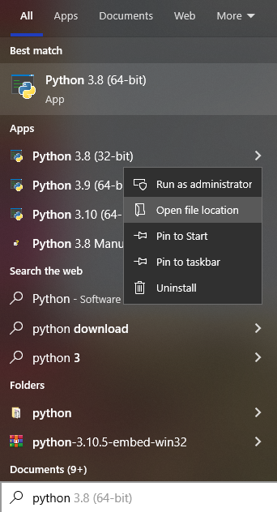
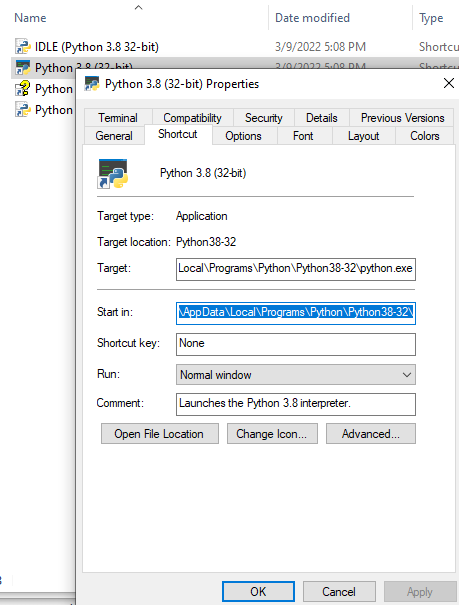

Hello everyone, today we are going to explain how to Install **python libraries** without internet.

Let us assume that we have started working in the IT Ingestion department where is **No internet** connectivity at all or there is restricted internet connectivity for the workstations.

 We could only download files from the internet but this goes through a  **security** scan before allowing us to download the file.

In this situation we couldn’t use the Python default package manager **pip** to get the packages from **PyPI** (Python Package Index) directly and install them in our Python environments.

In the workstation we have installed only **python3** with 32 bits and no more else.

As an example I want to install **pandas without internet** on the terminal.


# On the system that has access to internet


## Step 1: Download the Python Installer binaries

1. Open the [official Python website](https://www.python.org/downloads/windows/) in your web browser. Navigate to the Downloads tab for Windows.
2. Choose the latest Python 3 release. In our example, we choose the latest Python 3.8 version.
3. Click on the link to download **Windows x86 executable installer** if you are using a 32-bit installer.

In this project I will use [Python 3.8](https://www.python.org/ftp/python/3.8.6/python-3.8.6.exe)

## Step 2: Run the Executable Installer

1. Once the installer is downloaded, run the Python installer.
2. We do not need  **Install launcher for all users** check box. Further,we dont need check the **Add Python 3.8 to path**  to include the interpreter in the execution path because we will do mannually


we go the windows bar



and we copy the path where says **Start in**



## Step 3: Install environment


After Python is installed  we  go to the terminal and paste our location from our copied address, for example

```
set path=C:\Users\YOUR_USERNAME\AppData\Local\Programs\Python\Python38-32\Scripts;%path%
```

The above should set your 32 bit to be found before your 64 bit.

We can updating pip type the following command in terminal or cmd or powershell

```
python -m pip install --upgrade pip
```

```
pip install virtualenv
```

we create a folder called win32

```
mkdir win32
```

```
virtualenv internet
```

you activate the new  environment

```
cd internet/Scripts/
activate
cd ..
cd ..
```

if you are in linux is simply

```
source yesinternet/Scripts/activate
```

```
pip install pandas
```

we create a file requirements.txt

```
pip list --format=freeze > requirements.txt
```

```
mkdir dependencies
```

```
pip download -r requirements.txt -d "./dependencies"
```

```
 tar cvfz dependencies.tar.gz dependencies
```

```
pip download -r requirements.txt -d "./dependencies"
```

```
tar cvfz dependencies.tar.gz dependencies
```

# On the system that has NO access to internet

## Step 4: Install  Python libraries

Once you transfer the dependencies.tar.gz to the machine which does not have internet you would do:

First we need to create an environment

```
python3 -m venv c:\myenv
```

then activate

```
c:\myenv\Scripts\activate.bat
```

```
tar zxvf dependencies.tar.gz
```

```
cd dependencies 
```

( in linux)

```
pip install * -f ./ --no-index  
```

( in windows)

```
for %x in (*.whl) do python -m pip install %x    
```

or 

```
for %x in (*.whl) do pip install --no-index --find-links . %cd%\%x   
```


**Congratulations!**  You have learned how to install Python libraries without internet.