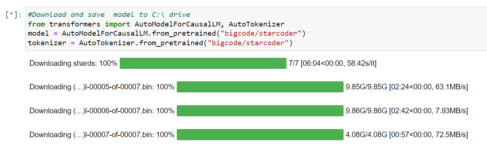

Hello everyone today we are going to  save **Huggingface** model locally inside your working directory or custom folder path.

Deep learning models are gaining popularity at a rapid pace in today's world. We seek deep learning model-based solutions for various tasks. However, training these models requires high-end computing machines, which are not easily accessible to most individuals. Fortunately, **Huggingface** and TF Hub come to our rescue by offering numerous pre-trained models catering to a wide range of tasks, ranging from computer vision to NLP.

By simply executing two lines of Python script, you can effortlessly download any pre-trained model from these model hubs. However, there lies a challenge - these models are saved in your `C:\ `drive by default. This becomes problematic if, like me, you possess a system with limited memory in the `C:\ `drive. Therefore, it becomes crucial to find an alternative solution to store these pre-trained models (from **Huggingface** or TF Hub) locally, either in your` D:\` drive, working directory, or any desired custom folder path. In this post, we will delve into various methods to achieve this.

## Download Huggingface model locally

To download Huggingface model using Python script, we need to install a library named “transformers“. It is the python library provided by Hogging to access their models from Python.

To install transformers you need to have Python version 3.7.0 or higher. Use below command to install it.

```
pip install transformers==4.28.1
huggingface-cli login
```

After successful installation, we can download any **Huggingface** model through Python. For this tutorial, I am going to download  **startcoder** model from **huggingface**. You can check the official model by going to this hugging face link.
Below Python code is to download and save huggingface model and tokenizer.

```
#Download and save  model to C:\ drive
from transformers import AutoModelForCausalLM, AutoTokenizer
model = AutoModelForCausalLM.from_pretrained("bigcode/starcoderbase")
tokenizer = AutoTokenizer.from_pretrained("bigcode/starcoderbaser")
```




If you execute above Python code, starcoder Huggingface model and tokenizer will be saved locally inside your C:\ drive.
For me, the saved model location was 

```
C:\Users\ruslanmv\.cache\huggingface\hub
```

 This is the default cache path for hugging face model. There are primarily two methods to store or save this downloaded model to another disk such as D:\ drive or your local working directory.

## Method 1: Save model to custom folder path

In this way, you can copy the downloaded model to any custom folder path. Below is the Python code to save huggingface model to any disk or directory.

```
# Save huggingface model files to working directorty
from transformers import AutoModelForCausalLM, AutoTokenizer
model.save_pretrained('D:/huggingface_cache')
tokenizer.save_pretrained('D:/huggingface_cache')
```


This code is to copy the model files from this location `(C:\Users\rusla\.cache\huggingface\hub)` to this location `(D:/huggingface_cache)`

## Method 2: Save model to custom cache directory

In this way, you can directly change the default cache location of Huggingface. So that model files will directly be downloaded to that custom folder path.

```
#Download model to custom cache directory
model = AutoModelForCausalLM.from_pretrained("bigcode/starcoderbase",cache_dir="D:/huggingface_cache/")
tokenizer = AutoTokenizer.from_pretrained("bigcode/starcoderbase",cache_dir="D:/huggingface_cache/")
```

In the provided Python code, we are creating a custom cache path `(D:/huggingface_cache/)` for the hugging face model. This allows the model to be downloaded and stored in the specified folder location. Please note that the default cache location for huggingface was previously set to `C:\Users\ruslanmv\.cache\huggingface\hub`

Initially, **Huggingface** models were being saved in the `C:\ `drive, which presented an issue as my system does not have available storage space. Consequently, I had to devise a solution to store these models in the D:\ drive.

**Congratulations!** We have saved our Hugging Face models on a custom path.