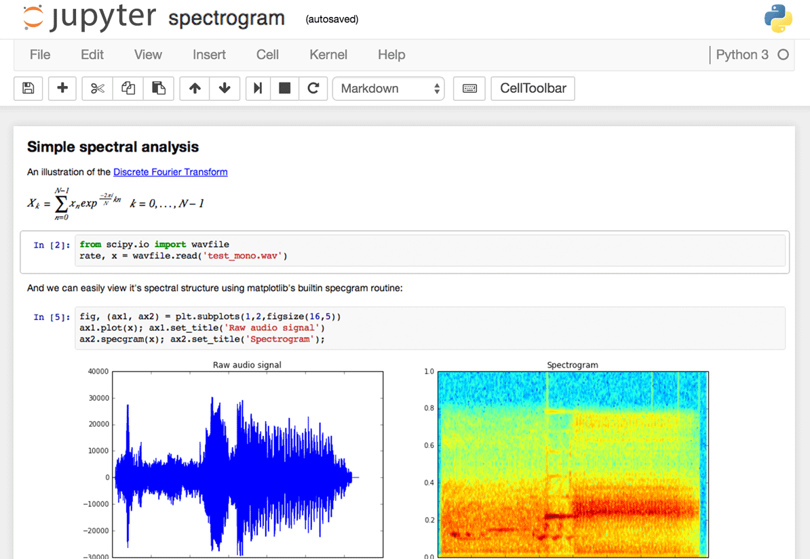
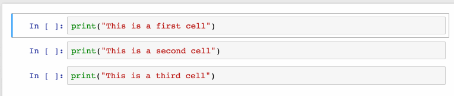
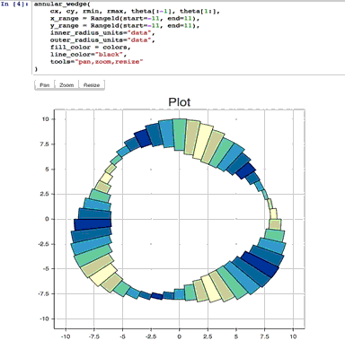
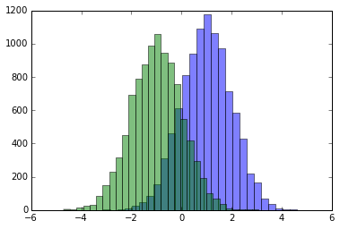
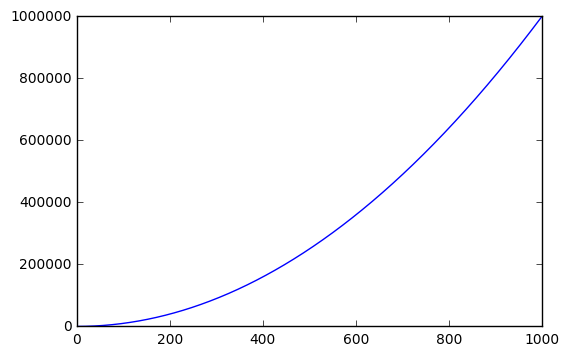
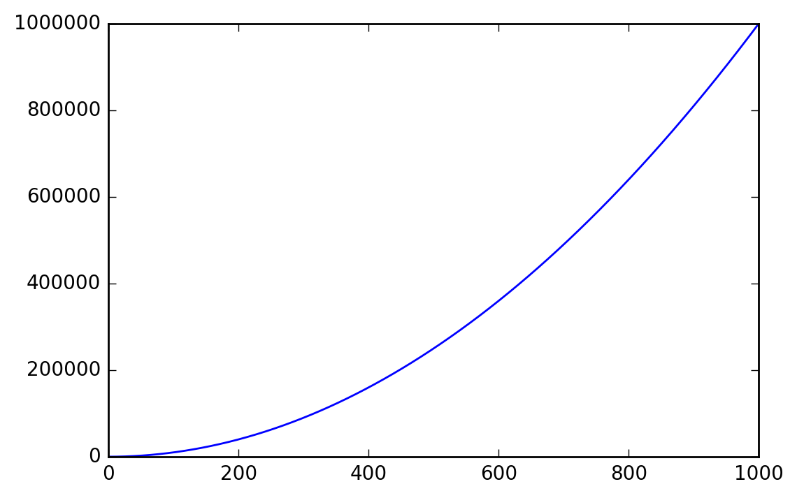
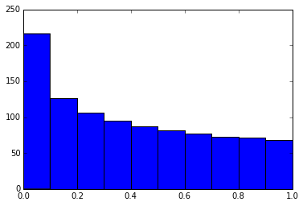
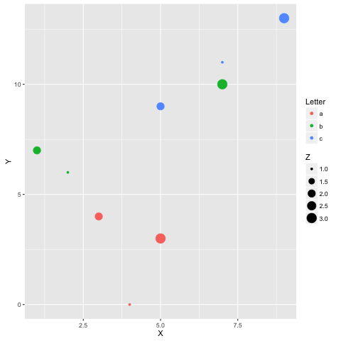
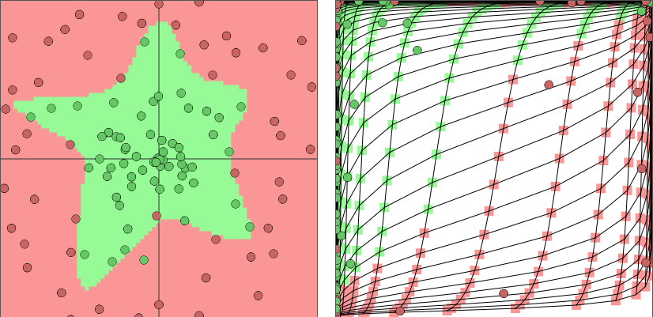
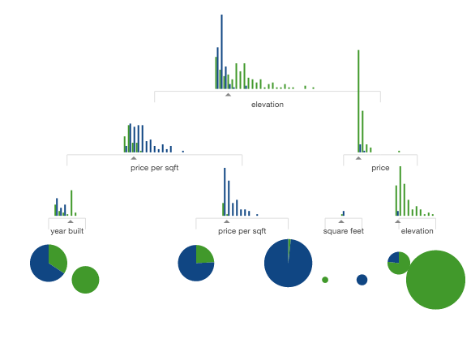

This post is based on a post that originally appeared on [Alex Rogozhnikov’s blog, ‘Brilliantly Wrong’](https://arogozhnikov.github.io/2016/09/10/jupyter-features.html).   I will extend this post to things that are really needed to work better.

Jupyter notebook, formerly known as the IPython notebook, is a flexible tool that helps you create readable analyses, as you can keep code, images, comments, formulae and plots together. In this post, we’ve collected some of the top Jupyter notebook tips to quickly turn you into a Jupyter power user!


Jupyter is quite extensible, supports many programming languages and is easily hosted on your computer or on almost any server — you only need to have ssh or http access. Best of all, it’s completely free. Now let’s dive in to our list of 28 (and counting!) Jupyter notebook tips!



*The Jupyter interface.*

Project Jupyter was born out of the IPython project as the project evolved to become a notebook that could support multiple languages – hence its historical name as the IPython notebook. The name Jupyter is an indirect acronyum of the three core languages it was designed for: **JU**lia, **PYT**hon, and **R** and is inspired by the planet Jupiter.

When working with Python in Jupyter, the IPython kernel is used, which gives us some handy access to IPython features from within our Jupyter notebooks (more on that later!)

We’re going to show you 28 tips and tricks to make your life working with Jupyter easier.


## 1. Keyboard Shortcuts

As any power user knows, keyboard shortcuts will save you lots of time. Jupyter stores a list of keybord shortcuts under the menu at the top: `Help > Keyboard Shortcuts`, or by pressing `H` in command mode (more on that later). It’s worth checking this each time you update Jupyter, as more shortcuts are added all the time.

Another way to access keyboard shortcuts, and a handy way to learn them is to use the command palette: `Cmd + Shift + P` (or `Ctrl + Shift + P` on Linux and Windows). This dialog box helps you run any command by name – useful if you don’t know the keyboard shortcut for an action or if what you want to do does not have a keyboard shortcut. The functionality is similar to Spotlight search on a Mac, and once you start using it you’ll wonder how you lived without it!


*The command palette.*

Some of my favorites:

- `Esc` will take you into command mode where you can navigate around your notebook with arrow keys.
- While in command mode:
  - `A` to insert a new cell above the current cell, `B` to insert a new cell below.
  - `M` to change the current cell to Markdown, `Y` to change it back to code
  - `D + D` (press the key twice) to delete the current cell
- `Enter` will take you from command mode back into edit mode for the given cell.
- `Shift + Tab` will show you the Docstring (documentation) for the the object you have just typed in a code cell – you can keep pressing this short cut to cycle through a few modes of documentation.
- `Ctrl + Shift + -` will split the current cell into two from where your cursor is.
- `Esc + F` Find and replace on your code but not the outputs.
- `Esc + O` Toggle cell output.
- Select Multiple Cells:
  - `Shift + J` or `Shift + Down` selects the next sell in a downwards direction. You can also select sells in an upwards direction by using `Shift + K` or `Shift + Up`.
  - Once cells are selected, you can then delete / copy / cut / paste / run them as a batch. This is helpful when you need to move parts of a notebook.
  - You can also use `Shift + M` to merge multiple cells.



*Merging multiple cells.*

## 2. Pretty Display of Variables

The first part of this is pretty widely known. By finishing a Jupyter cell with the name of a variable or unassigned output of a statement, Jupyter will display that variable without the need for a print statement. This is especially useful when dealing with Pandas DataFrames, as the output is neatly formatted into a table.

What is known less, is that you can alter a modify the `ast_note_interactivity` kernel option to make Jupyter do this for any variable or statement on its own line, so you can see the value of multiple statements at once.

```python
from IPython.core.interactiveshell import InteractiveShell
InteractiveShell.ast_node_interactivity = "all"
from pydataset import data
quakes = data('quakes')
quakes.head()
quakes.tail()
```

| lat  | long   | depth  | mag  | stations |      |
| ---- | ------ | ------ | ---- | -------- | ---- |
| 1    | -20.42 | 181.62 | 562  | 4.8      | 41   |
| 2    | -20.62 | 181.03 | 650  | 4.2      | 15   |
| 3    | -26.00 | 184.10 | 42   | 5.4      | 43   |
| 4    | -17.97 | 181.66 | 626  | 4.1      | 19   |
| 5    | -20.42 | 181.96 | 649  | 4.0      | 11   |

| lat  | long   | depth  | mag  | stations |      |
| ---- | ------ | ------ | ---- | -------- | ---- |
| 996  | -25.93 | 179.54 | 470  | 4.4      | 22   |
| 997  | -12.28 | 167.06 | 248  | 4.7      | 35   |
| 998  | -20.13 | 184.20 | 244  | 4.5      | 34   |
| 999  | -17.40 | 187.80 | 40   | 4.5      | 14   |
| 1000 | -21.59 | 170.56 | 165  | 6.0      | 119  |

If you want to set this behaviour for all instances of Jupyter (Notebook and Console), simply create a file `~/.ipython/profile_default/ipython_config.py` with the lines below.

```python
c = get_config()

# Run all nodes interactively
c.InteractiveShell.ast_node_interactivity = "all"
```

## 3. Easy links to documentation

Inside the `Help` menu you’ll find handy links to the online documentation for common libraries including NumPy, Pandas, SciPy and Matplotlib.

Don’t forget also that by prepending a library, method or variable with `?`, you can access the Docstring for quick reference on syntax.

```python
?str.replace()
Docstring:
S.replace(old, new[, count]) -> str

Return a copy of S with all occurrences of substring
old replaced by new.  If the optional argument count is
given, only the first count occurrences are replaced.
Type:      method_descriptor
```

## 4. Plotting in notebooks

There are many options for generating plots in your notebooks.

- [matplotlib](https://matplotlib.org/) (the de-facto standard), activated with `%matplotlib inline` – Here’s a Dataquest [Matplotlib Tutorial](https://www.dataquest.io/blog/matplotlib-tutorial/).
- `%matplotlib notebook` provides interactivity but can be a little slow, since rendering is done server-side.
- [Seaborn](https://seaborn.pydata.org/) is built over Matplotlib and makes building more attractive plots easier. Just by importing Seaborn, your matplotlib plots are made ‘prettier’ without any code modification.
- [mpld3](https://github.com/mpld3/mpld3) provides alternative renderer (using d3) for matplotlib code. Quite nice, though incomplete.
- [bokeh](https://bokeh.pydata.org/en/latest/) is a better option for building interactive plots.
- [plot.ly](https://plot.ly/) can generate nice plots – this used to be a paid service only but was recently open sourced.
- [Altair](https://github.com/altair-viz/altair) is a relatively new declarative visualization library for Python. It’s easy to use and makes great looking plots, however the ability to customize those plots is not nearly as powerful as in Matplotlib.




## 5. IPython Magic Commands

The `%matplotlib inline` you saw above was an example of a *IPython Magic* command. Being based on the IPython kernel, Jupyter has access to all the Magics from the IPython kernel, and they can make your life a lot easier!

```
# This will list all magic commands
%lsmagic
```

```
Available line magics:
%alias %alias_magic %autocall %automagic %autosave %bookmark %cat %cd %clear %colors %config %connect_info %cp %debug %dhist %dirs %doctest_mode %ed %edit %env %gui %hist %history %killbgscripts %ldir %less %lf %lk %ll %load %load_ext %loadpy %logoff %logon %logstart %logstate %logstop %ls %lsmagic %lx %macro %magic %man %matplotlib %mkdir %more %mv %notebook %page %pastebin %pdb %pdef %pdoc %pfile %pinfo %pinfo2 %popd %pprint %precision %profile %prun %psearch %psource %pushd %pwd %pycat %pylab %qtconsole %quickref %recall %rehashx %reload_ext %rep %rerun %reset %reset_selective %rm %rmdir %run %save %sc %set_env %store %sx %system %tb %time %timeit %unalias %unload_ext %who %who_ls %whos %xdel %xmode 
Available cell magics:%%! %%HTML %%SVG %%bash %%capture %%debug %%file %%html %%javascript %%js %%latex %%perl %%prun %%pypy %%python %%python2 %%python3 %%ruby %%script %%sh %%svg %%sx %%system %%time %%timeit %%writefile 
Automagic is ON, % prefix IS NOT needed for line magics.
```

I recommend browsing [the documentation for all IPython Magic commands](https://ipython.readthedocs.io/en/stable/interactive/magics.html) as you’ll no doubt find some that work for you. A few of my favorites are below:

## 6. IPython Magic – %env: Set Environment Variables

You can manage environment variables of your notebook without restarting the jupyter server process. Some libraries (like theano) use environment variables to control behavior, %env is the most convenient way.

```
# Running %env without any arguments
# lists all environment variables# The line below sets the environment
# variable
%env OMP_NUM_THREADS%env OMP_NUM_THREADS=4
env: OMP_NUM_THREADS=4
```

## 7. IPython Magic – %run: Execute python code

`%run` can execute python code from .py files – this is well-documented behavior. Lesser known is the fact that it can also execute other jupyter notebooks, which can quite useful.

Note that using `%run` is not the same as importing a python module.

```
# this will execute and show the output from
# all code cells of the specified notebook
%run ./two-histograms.ipynb
```



## 8. IPython Magic – %load: Insert the code from an external script

This will replace the contents of the cell with an external script. You can either use a file on your computer as a source, or alternatively a URL.

```
# Before Running
%load ./hello_world.py
# After Running
# %load ./hello_world.py
if __name__ == "__main__":
 print("Hello World!")
Hello World!
```

## 9. IPython Magic – %store: Pass variables between notebooks.

The `%store` command lets you pass variables between two different notebooks.

```
data = 'this is the string I want to pass to different notebook'
%store data
del data # This has deleted the variable
Stored 'data' (str)
```

Now, in a new notebook…

```
%store -r data
print(data)
this is the string I want to pass to different notebook
```

## 10. IPython Magic – %who: List all variables of global scope.

The `%who` command without any arguments will list all variables that existing in the global scope. Passing a parameter like `str` will list only variables of that type.

```
one = "for the money"
two = "for the show"
three = "to get ready now go cat go"
%who str
one three two
```

## 11. IPython Magic – Timing

There are two IPython Magic commands that are useful for timing – `%%time` and `%timeit`. These are especially handy when you have some slow code and you’re trying to indentify where the issue is.

`%%time` will give you information about a single run of the code in your cell.

```
%%time
import time
for _ in range(1000):
 time.sleep(0.01) # sleep for 0.01 seconds
CPU times: user 21.5 ms, sys: 14.8 ms, total: 36.3 ms Wall time: 11.6 s
```

`%%timeit` uses the Python [timeit module](https://docs.python.org/3.5/library/timeit.html) which runs a statement 100,000 times (by default) and then provides the mean of the fastest three times.

```
import numpy
%timeit numpy.random.normal(size=100)
The slowest run took 7.29 times longer than the fastest. This could mean that an intermediate result is being cached.
100000 loops, best of 3: 5.5 µs per loop
```

## 12. IPython Magic – %%writefile and %pycat: Export the contents of a cell/Show the contents of an external script

Using the `%%writefile` magic saves the contents of that cell to an external file. `%pycat` does the opposite, and shows you (in a popup) the syntax highlighted contents of an external file.

```
%%writefile pythoncode.py 
import numpy
def append_if_not_exists(arr, x):
 if x not in arr:
 arr.append(x)def some_useless_slow_function():
 arr = list()
    for i in range(10000):
        x = numpy.random.randint(0, 10000)
    append_if_not_exists(arr, x)
Writing pythoncode.py
%pycat pythoncode.py
import numpy
def append_if_not_exists(arr, x):
 if x not in arr:
 arr.append(x)def some_useless_slow_function():
 arr = list()
 for i in range(10000):
 x = numpy.random.randint(0, 10000)
 append_if_not_exists(arr, x)
```

## 13. IPython Magic – %prun: Show how much time your program spent in each function.

Using `%prun statement_name` will give you an ordered table showing you the number of times each internal function was called within the statement, the time each call took as well as the cumulative time of all runs of the function.

```
%prun some_useless_slow_function()
26324 function calls in 0.556 seconds 
Ordered by: internal time 
ncalls tottime percall cumtime percall filename:lineno(function)
10000 0.527 0.000 0.528 0.000 :2(append_if_not_exists)
10000 0.022 0.000 0.022 0.000 {method 'randint' of 'mtrand.RandomState' objects}
1 0.006 0.006 0.556 0.556 :6(some_useless_slow_function)
6320 0.001 0.000 0.001 0.000 {method 'append' of 'list' objects}
1 0.000 0.000 0.556 0.556 :1()
1 0.000 0.000 0.556 0.556 {built-in method exec}
1 0.000 0.000 0.000 0.000 {method 'disable' of '_lsprof.Profiler' objects}
```

## 14. IPython Magic – Debugging with %pdb

Jupyter has own interface for [The Python Debugger (`pdb`)](https://docs.python.org/3.5/library/pdb.html). This makes it possible to go inside the function and investigate what happens there.

You can view [a list of accepted commands for `pdb` here](https://docs.python.org/3.5/library/pdb.html#debugger-commands).

```
%pdb 
def pick_and_take():
 picked = numpy.random.randint(0, 1000)
 raise NotImplementedError()
pick_and_take()
Automatic pdb calling has been turned ON
--------------------------------------------------------------------
NotImplementedError Traceback (most recent call last)
in ()
5 raise NotImplementedError()
6
----> 7 pick_and_take()
in pick_and_take()
3 def pick_and_take():
4 picked = numpy.random.randint(0, 1000)
----> 5 raise NotImplementedError()
6
7 pick_and_take()
NotImplementedError:
> (5)pick_and_take()
3 def pick_and_take():
4 picked = numpy.random.randint(0, 1000)
----> 5 raise NotImplementedError()
6
7 pick_and_take()
ipdb>
```

## 15. IPython Magic – High-resolution plot outputs for Retina notebooks

One line of IPython magic will give you double resolution plot output for Retina screens, such as the more recent Macbooks. *Note: the example below won’t render on non-retina screens*

```
x = range(1000)
y = [i ** 2 for i in x]
plt.plot(x,y)
plt.show();
%config InlineBackend.figure_format ='retina'
plt.plot(x,y)
plt.show();
```





## 16. Suppress the output of a final function.

Sometimes it’s handy to suppress the output of the function on a final line, for instance when plotting. To do this, you just add a semicolon at the end.

```
%matplotlib inline
from matplotlib import pyplot as plt
import numpyx = numpy.linspace(0, 1, 1000)**1.5
# Here you get the output of the function
plt.hist(x)
(array([ 216., 126., 106., 95., 87., 81., 77., 73., 71., 68.]), array([ 0. , 0.1, 0.2, 0.3, 0.4, 0.5, 0.6, 0.7, 0.8, 0.9, 1. ]),
<a list of 10 Patch objects>)
# By adding a semicolon at the end, the output is suppressed.plt.hist(x);
```




## 17. Executing Shell Commands

It’s easy to execute a shell command from inside your notebook. You can use this to check what datasets are in available in your working folder:

```
!ls *.csv
nba_2016.csv titanic.csv pixar_movies.csv whitehouse_employees.csv
```

Or to check and manage packages.

```
!pip install numpy !pip list | grep pandas
Requirement already satisfied (use --upgrade to upgrade): numpy in /Library/Frameworks/Python.framework/Versions/3.4/lib/python3.4/site-packages pandas (0.18.1)
```

## 18. Using LaTeX for forumlas

When you write [LaTeX](https://www.latex-project.org/) in a Markdown cell, it will be rendered as a formula using MathJax.

This:

```
$P(A \mid B) = \frac{P(B \mid A)P(A)}{P(B)}$
```

Becomes this:


Markdown is an important part of notebooks, so don’t forget to use its expressiveness!

## 19. Run code from a different kernel in a notebook

If you want to, you can combine code from multiple kernels into one notebook.

Just use IPython Magics with the name of your kernel at the start of each cell that you want to use that Kernel for:

- `%%bash`
- `%%HTML`
- `%%python2`
- `%%python3`
- `%%ruby`
- `%%perl`

```
%%bash
for i in {1..5}
do echo "i is $i"
done
i is 1
i is 2
i is 3
i is 4
i is 5
```

## 20. Install other kernels for Jupyter

One of the nice features about Jupyter is ability to run kernels for different languages. As an example, here is how to get and R kernel running.

### Easy Option: Installing the R Kernel Using Anaconda

If you used Anaconda to set up your environment, getting R working is extremely easy. Just run the below in your terminal:

```
conda install -c r r-essentials
```

### Less Easy Option: Installing the R Kernel Manually

If you are not using Anaconda, the process is a little more complex. Firstly, you’ll need to install R from [CRAN](https://cloud.r-project.org/) if you haven’t already.

Once that’s done, fire up an R console and run the following:

```
install.packages(c('repr', 'IRdisplay', 'crayon', 'pbdZMQ', 'devtools'))
devtools::install_github('IRkernel/IRkernel')
IRkernel::installspec() # to register the kernel in the current R installation
```

## 21. Running R and Python in the same notebook.

The best solution to this is to install [rpy2](https://rpy2.bitbucket.org/) (requires a working version of R as well), which can be easily done with `pip`:

```
pip install rpy2
```

You can then use the two languages together, and even pass variables inbetween:

```
%load_ext rpy2.ipython
%R require(ggplot2)
array([1], dtype=int32)
import pandas as pd df = pd.DataFrame({
'Letter': ['a', 'a', 'a', 'b', 'b', 'b', 'c', 'c', 'c'],
'X': [4, 3, 5, 2, 1, 7, 7, 5, 9],
'Y': [0, 4, 3, 6, 7, 10, 11, 9, 13],
'Z': [1, 2, 3, 1, 2, 3, 1, 2, 3]
})
%%R -i df ggplot(data = df) + geom_point(aes(x = X, y= Y, color = Letter, size = Z))
```



*Example courtesy [Revolutions Blog](https://blog.revolutionanalytics.com/2016/01/pipelining-r-python.html)*

## 22. Writing functions in other languages

Sometimes the speed of numpy is not enough and I need to write some fast code.
In principle, you can compile function in the dynamic library and write python wrappers…

But it is much better when this boring part is done for you, right?

You can write functions in cython or fortran and use those directly from python code.

First you’ll need to install:

```
!pip install cython fortran-magic
%load_ext Cython
%%cython
def myltiply_by_2(float x):
return 2.0 * x
myltiply_by_2(23.)
```

Personally I prefer to use fortran, which I found very convenient for writing number-crunching functions. More details of usage can be found [here](https://arogozhnikov.github.io/2015/11/29/using-fortran-from-python.html).

```
%load_ext fortranmagic
%%fortran subroutine compute_fortran(x, y, z)
real, intent(in) :: x(:), y(:)
real, intent(out) :: z(size(x, 1))
z = sin(x + y)
end subroutine compute_fortran
compute_fortran([1, 2, 3], [4, 5, 6])
```

There are also different jitter systems which can speed up your python code. More examples [can be found here](https://arogozhnikov.github.io/2015/09/08/SpeedBenchmarks.html).

## 23. Multicursor support

Jupyter supports mutiple cursors, similar to Sublime Text. Simply click and drag your mouse while holding down `Alt`.


*Multicursor support.*

## 24. Jupyter-contrib extensions

[Jupyter-contrib extensions](https://github.com/ipython-contrib/jupyter_contrib_nbextensions) is a family of extensions which give Jupyter a lot more functionality, including e.g. `jupyter spell-checker` and `code-formatter`.

The following commands will install the extensions, as well as a menu based configurator that will help you browse and enable the extensions from the main Jupyter notebook screen.

```
!pip install https://github.com/ipython-contrib/jupyter_contrib_nbextensions/tarball/master !pip install jupyter_nbextensions_configurator !jupyter contrib nbextension install --user !jupyter nbextensions_configurator enable --user
```


*The nbextension configurator.*

## 25. Create a presentation from a Jupyter notebook.

Damian Avila’s [RISE](https://github.com/damianavila/RISE) allows you to create a powerpoint style presentation from an existing notebook.

You can install RISE using conda:

```
conda install -c damianavila82 rise
```

Or alternatively pip:

```
pip install RISE
```

And then run the following code to install and enable the extension:

```
jupyter-nbextension install rise --py --sys-prefix jupyter-nbextension enable rise --py --sys-prefix
```

## 26. The Jupyter output system

Notebooks are displayed as HTML and the cell output can be HTML, so you can return virtually anything: video/audio/images.

In this example I scan the folder with images in my repository and show thumbnails of the first 5:

```
import os
from IPython.display import display, Image names = [f for f in os.listdir('../images/ml_demonstrations/') if f.endswith('.png')]
for name in names[:5]:
 display(Image('../images/ml_demonstrations/' + name, width=100))
```








We can create the same list with a bash command, because magics and bash calls return python variables:

```
names = !ls ../images/ml_demonstrations/*.png names[:5]
['../images/ml_demonstrations/colah_embeddings.png',
'../images/ml_demonstrations/convnetjs.png',
'../images/ml_demonstrations/decision_tree.png',
'../images/ml_demonstrations/decision_tree_in_course.png',
'../images/ml_demonstrations/dream_mnist.png']
```

## 27. Big data analysis

A number of solutions are available for querying/processing large data samples:

- [ipyparallel (formerly ipython cluster)](https://github.com/ipython/ipyparallel) is a good option for simple map-reduce operations in python. We use it in [rep](https://github.com/yandex/rep) to train many machine learning models in parallel
- [pyspark](https://www.cloudera.com/documentation/enterprise/5-5-x/topics/spark_ipython.html)
- spark-sql magic [%%sql](https://github.com/jupyter-incubator/sparkmagic)

## 28. Sharing notebooks

The easiest way to share your notebook is simply using the notebook file (.ipynb), but for those who don’t use Jupyter, you have a few options:

- Convert notebooks to html files using the `File > Download as > HTML` Menu option.

- Upload your .ipynb file to [Google Colab](https://colab.research.google.com/notebooks/intro.ipynb).

- Share your notebook file with

   

  gists

   

  or on github, both of which render the notebooks. See

  this example

  - If you upload your notebook to a github repository, you can use the handy [mybinder](https://mybinder.org/) service to allow someone half an hour of interactive Jupyter access to your repository.

- Setup your own system with [jupyterhub](https://github.com/jupyterhub/jupyterhub), this is very handy when you organize mini-course or workshop and don’t have time to care about students machines.

- Store your notebook e.g. in dropbox and put the link to [nbviewer](https://nbviewer.jupyter.org/). nbviewer will render the notebook from whichever source you host it.

- Use the `File > Download as > PDF` menu to save your notebook as a PDF. If you’re going this route, I highly recommend reading Julius Schulz’s excellent article [Making publication ready Python notebooks](https://blog.juliusschulz.de/blog/ultimate-ipython-notebook).

  