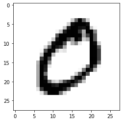
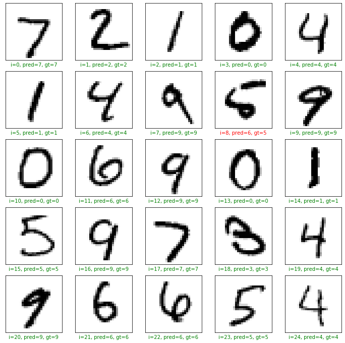
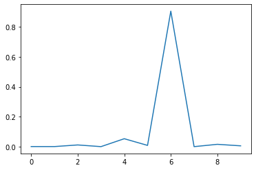

## Tensorflow image classification with Keras

Today I would like discuss a little bit about **Image Classification with TensorFlow**. 

We are going to  build a neural network model to solve a basic image classification problem.


#  Introduction

This graph describes the problem that we are trying to solve visually. We want to create and train a model that takes an image of a hand written digit as input and predicts the class of that digit, that is, it predicts the digit or it predicts the class of the input image.


In the basic image classification project that we just completed, we used the Keras API with TensorFlow as its back-end. While Keras can use Theano or CNTK as back-end as well, we used the TensorFlow implementation of the Keras API.

### Import TensorFlow


```python
import tensorflow as tf

print('Using TensorFlow version', tf.__version__)
```

    Using TensorFlow version 2.3.0


# The Dataset

### Import MNIST


```python
from tensorflow.keras.datasets import mnist
(x_train, y_train), (x_test, y_test)=mnist.load_data()
```

### Shapes of Imported Arrays


```python
print('x_train shape:', x_train.shape)
print('y_train shape:', y_train.shape)
print('x_test shape:', x_test.shape)
print('y_test shape:', y_test.shape)
```

    x_train shape: (60000, 28, 28)
    y_train shape: (60000,)
    x_test shape: (10000, 28, 28)
    y_test shape: (10000,)


The first component  represent the number of examples in the array , and for each example there are an squared array of number of  pixels, in this case for the train case, there are 60000 image examples and for each image there are a matrix of the size of 28x28 pixels. There is no color information in the MNIST dataset

### Plot an Image Example


```python
from matplotlib import pyplot as plt
%matplotlib inline

plt.imshow(x_train[1], cmap='binary')
plt.show()

```





### Display Labels


```python
y_train[1]
```


    0


```python
print(set(y_train))
```

    {0, 1, 2, 3, 4, 5, 6, 7, 8, 9}


 The integer classes are from 0 to 9 - i.e. a total of 10 classes.

#  One Hot Encoding

After this encoding, every label will be converted to a list with 10 elements and the element at index to the corresponding class will be set to 1, rest will be set to 0:

| original label | one-hot encoded label          |
| -------------- | ------------------------------ |
| 5              | [0, 0, 0, 0, 0, 1, 0, 0, 0, 0] |
| 7              | [0, 0, 0, 0, 0, 0, 0, 1, 0, 0] |
| 1              | [0, 1, 0, 0, 0, 0, 0, 0, 0, 0] |

### Encoding Labels

 Each label's one hot encoded representation will be a 10 dimensional vector. 


```python
from tensorflow.keras.utils import to_categorical

y_train_encoded = to_categorical(y_train)
y_test_encoded = to_categorical(y_test)

```

### Validated Shapes


```python
print('y_train_encoded shape:', y_train_encoded.shape)
print('y_test_encoded shape:', y_test_encoded.shape)
```

    y_train_encoded shape: (60000, 10)
    y_test_encoded shape: (10000, 10)


### Display Encoded Labels


```python
y_train_encoded[1]
```


    array([1., 0., 0., 0., 0., 0., 0., 0., 0., 0.], dtype=float32)


#  Neural Networks

### Linear Equations


The above graph simply represents the equation:


Where the `w1, w2, w3` are called the weights and `b` is an intercept term called bias. The equation can also be *vectorised* like this:


Where `X = [x1, x2, x3]` and `W = [w1, w2, w3].T`. The .T means *transpose*. This is because we want the dot product to give us the result we want i.e. `w1 * x1 + w2 * x2 + w3 * x3`. This gives us the vectorised version of our linear equation.

A simple, linear approach to solving hand-written image classification problem - could it work?


### Neural Networks


This model is much more likely to solve the problem as it can learn more complex function mapping for the inputs and outputs in our dataset.

#  Preprocessing the Examples

### Unrolling N-dimensional Arrays to Vectors


```python
import numpy as np

x_train_reshaped = np.reshape(x_train, (60000,784))
x_test_reshaped = np.reshape(x_test,(10000,784))

print('x_train_reshaped shape:', x_train_reshaped.shape)
print('x_test_reshaped shape:', x_test_reshaped.shape)
```

    x_train_reshaped shape: (60000, 784)
    x_test_reshaped shape: (10000, 784)


Each element or exmaple is 784, each value of the pixel correspond one pixel

### Display Pixel Values


```python
print(set(x_train_reshaped[0]))
```

    {0, 1, 2, 3, 9, 11, 14, 16, 18, 23, 24, 25, 26, 27, 30, 35, 36, 39, 43, 45, 46, 49, 55, 56, 64, 66, 70, 78, 80, 81, 82, 90, 93, 94, 107, 108, 114, 119, 126, 127, 130, 132, 133, 135, 136, 139, 148, 150, 154, 156, 160, 166, 170, 171, 172, 175, 182, 183, 186, 187, 190, 195, 198, 201, 205, 207, 212, 213, 219, 221, 225, 226, 229, 238, 240, 241, 242, 244, 247, 249, 250, 251, 252, 253, 255}


### Data Normalization

In order to normalize our input features (pixel values of the image examples), we used the numpy package (represented here as np). 

We normalized pixel values by subtracting the mean M from each pixel value and then dividing the output by standard deviation S


```python
x_mean = np.mean(x_train_reshaped)
x_std = np.std(x_train_reshaped)

epsilon = 1e-10

x_train_norm = (x_train_reshaped - x_mean)/(x_std + epsilon)
x_test_norm = (x_test_reshaped - x_mean) / (x_std + epsilon)

```

### Display Normalized Pixel Values


```python
print(set(x_train_norm[1]))
```

    {0.2632332858605251, 1.5996639141274305, 2.7960875241949457, 2.6051688630139593, 2.7833596134495466, 2.5924409522685603, 2.465161844814569, 2.6178967737593584, 2.5415293092869637, 2.426978112578372, 1.7142151108360224, 2.668808416740955, 2.057868700961798, 1.421473163691843, 1.1287312165476637, 0.059586713934139515, 2.7451758812133495, 2.1087803439433945, 0.5432473222593053, 0.2250495536243278, -0.18224359022844336, 1.2305545025108566, 2.5033455770507667, 0.3014170180967224, 2.31242691586978, 1.676031378599825, -0.4240738943910262, 0.18686582138813052, -0.05496448277445237, -0.33497851917323257, -0.29679478693703526, 2.070596611707197, 2.706992148977152, 2.4142502018329726, 1.7778546645630178, 1.4342010744372422, 1.2432824132562557, 2.2233315406519862, 1.294194056237852, 0.6577985189678972, 1.9815012364894034, 1.0014521090936728, 1.6378476463636278, -0.27133896544623703, 0.7978055371672873, 0.4796077685323098, 0.5305194115139061, 0.6450706082224981, 2.477889755559968, 2.8215433456857437, 1.8414942182900134, 1.2050986810200583, 1.943317504253206, 0.6705264297132962, 1.6505755571090268, 1.9942291472348024, 2.6306246845047574, 0.377784482569117, 1.7014872000906232, -0.15678776873764516, 0.2886891073513233, 0.04685880318874042, 2.096052433197995, 1.1160033058022647, 1.4596568959280403, 2.1469640761795916, 2.439706023323771, 2.490617666305367, -0.10587612575604877, 1.8542221290354124, 0.2123216428789287, 0.1741379106427314, 0.5814310544955026, -0.34770642991863165, -0.06769239351985147, 0.3396007503329197, 1.026907930584471, 1.3705615207102466}


#  Creating a Model

### Creating the Model


```python
from tensorflow.keras.models import Sequential
from tensorflow.keras.layers import Dense
model = Sequential([
    Dense(128, activation='relu', input_shape=(784,)),
    Dense(128, activation='relu'),
    Dense(10, activation='softmax')  
    
])
```


```python

```

We initialize a  sequential mode, with two  hidden layers, each one  with 128 units, and activation functions for each hidden layer. We only used two layers in between the input and the output layers. In sequential class, your input layer are the input examples, you dont neet to write them expliclty, the input shape has 784 features. 


### Activation Functions


The purpose of the activation functions is to help neural networks find non-linearity  in the given data.
If we simply cascaded linear functions with each other without using activation functions, the overall output would still be a linear function model

The first step in the node is the linear sum of the inputs:


The second step in the node is the activation function output:


Graphical representation of a node where the two operations are performed:


Since activation function gives us probability scores for all the classes, it is suitable to be used as an output activation function for classification problems.

The softmax activation gives us probability scores for all the classes which sum up to a total of 1. The class with the highest probability score is then used as our final prediction.

### Compiling the Model


```python
model.compile(
    optimizer = 'sgd',
    loss='categorical_crossentropy',
    metrics=['accuracy']
)
model.summary()
```

    Model: "sequential"
    _________________________________________________________________
    Layer (type)                 Output Shape              Param #   
    =================================================================
    dense (Dense)                (None, 128)               100480    
    _________________________________________________________________
    dense_1 (Dense)              (None, 128)               16512     
    _________________________________________________________________
    dense_2 (Dense)              (None, 10)                1290      
    =================================================================
    Total params: 118,282
    Trainable params: 118,282
    Non-trainable params: 0
    _________________________________________________________________


The architecture of our model was shown in the table.
The loss should be minimized to have a good model, for all our examples in the dataset.

#  Training the Model

### Training the Model


```python
model.fit(x_train_norm, y_train_encoded,epochs=3)
```

    Epoch 1/3
    1875/1875 [==============================] - 1s 721us/step - loss: 0.3811 - accuracy: 0.8894
    Epoch 2/3
    1875/1875 [==============================] - 1s 707us/step - loss: 0.1890 - accuracy: 0.9448
    Epoch 3/3
    1875/1875 [==============================] - 1s 745us/step - loss: 0.1432 - accuracy: 0.9577


    <tensorflow.python.keras.callbacks.History at 0x6684e46d0>


### Evaluating the Model


```python
loss, accuracy = model.evaluate(x_test_norm,y_test_encoded)
print('Test set accuracy', accuracy * 100)

```

    313/313 [==============================] - 0s 563us/step - loss: 0.1316 - accuracy: 0.9611
    Test set accuracy 96.10999822616577


#  Predictions

### Predictions on Test Set


```python
preds = model.predict(x_test_norm)
print('Shape of pred:', preds.shape)
```

    Shape of pred: (10000, 10)


The epochs are like the interation of all the examples trough the model

### Plotting the Results

In order to get a predicted class name ( or integer from 0 to 9) we use np.argmax() function on the predictions . This is because the predictions are 10 dimensional vectors and we want to use the class with the highest probability as our final prediction.


```python
plt.figure(figsize=(12,12))
start_index =0

for i in range(25):
    plt.subplot(5, 5, i+1)
    plt.grid(False)
    plt.xticks([])
    plt.yticks([])
    
    pred = np.argmax(preds[start_index+i])
    gt = y_test[start_index+i ]
    
    col = 'g'
    if pred != gt:
        col = 'r'
    plt.xlabel('i={}, pred={}, gt={}'.format(start_index+i, pred, gt),color=col)
    plt.imshow(x_test[start_index+i],cmap='binary')
plt.show()
    
    
```





```python
#The softmax probabilities outputs 
plt.plot(preds[8])
plt.show()
```




The probability scores for the 10 classes will sum up to 1 and the class with the highest probability score is used as the final predicted class. The final predictions are 10 dimensional vectors with probability scores for each possible class. We used the class with the highest probability score as our final prediction


**Congratulations!**  We have applied  Neural Networks in Tensorflow to classify handwritten images. 