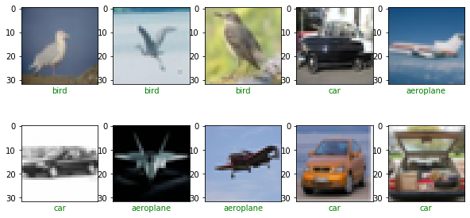
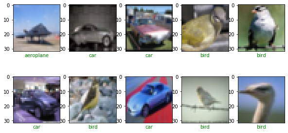
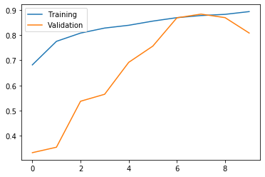
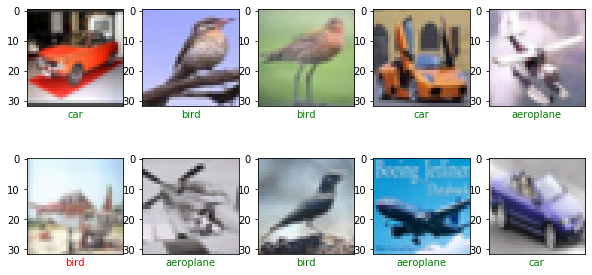

Today we are going to discuss a bit of  **convolutional neural network** (**CNN**,) and we perform a Classification by using Keras and Tensorflow like backend.

## Introduction 

CNNs are regularized versions of multilayer perceptrons, that usually mean fully connected networks, that is, each neuron in one layer is connected to all neurons in the next layer. 

The "fully-connectedness" of these networks makes them prone to  overfitting data. 

Typical ways of regularization include adding some form of magnitude measurement of weights to the loss function. 

CNNs take a different approach towards regularization: they take advantage of the hierarchical pattern in data and assemble more complex patterns using smaller and simpler patterns. 


Neurons of a convolutional layer (blue), connected to their receptive field (red)

### Convolutional layer

The convolutional layer is the core building block of a CNN. The layer's parameters consist of a set of learnable filters, which have a small receptive field, but extend through the full depth of the input volume. 

During the forward pass, each filter is convolved across the width and height of the input volume, computing the dot product between the entries of the filter and the input and producing a 2-dimensional activation map of that filter. 

As a result, the network learns filters that activate when it detects some specific type of feature at some spatial position in the input.

Stacking the activation maps for all filters along the depth dimension forms the full output volume of the convolution layer.

 Every entry in the output volume can thus also be interpreted as an output of a neuron that looks at a small region in the input and shares parameters with neurons in the same activation map.

#### Local connectivity


Typical CNN architecture

When dealing with high-dimensional inputs such as images, it is impractical to connect neurons to all neurons in the previous volume because such a network architecture does not take the spatial structure of the data into account.

 Convolutional networks exploit spatially local correlation by enforcing a sparse local connectivity pattern between neurons of adjacent layers: each neuron is connected to only a small region of the input volume.


Lets see an example , we us CNN to classify images by using Keras, We will take the  **CIFAR-10 dataset**  that consists of 60000 32x32 colour images in 10 classes, with 6000 images per class. There are 50000 training images and 10000 test images.


#  Import Libraries


```python
import tensorflow as tf
import os
import numpy as np

from matplotlib import pyplot as plt
%matplotlib inline

if not os.path.isdir('models'):
    os.mkdir('models')
    
print('TensorFlow version:', tf.__version__)
print('Is using GPU?', tf.test.is_gpu_available())
```

    TensorFlow version: 2.3.0


# Preprocess Data


```python
def get_three_classes(x, y):
    indices_0, _ = np.where(y == 0.)
    indices_1, _ = np.where(y == 1.)
    indices_2, _ = np.where(y == 2.)

    indices = np.concatenate([indices_0, indices_1, indices_2], axis=0)
    
    x = x[indices]
    y = y[indices]
    
    count = x.shape[0]
    indices = np.random.choice(range(count), count, replace=False)
    
    x = x[indices]
    y = y[indices]
    
    y = tf.keras.utils.to_categorical(y)
    
    return x, y
```


```python
(x_train, y_train), (x_test, y_test) = tf.keras.datasets.cifar10.load_data()
x_train, y_train = get_three_classes(x_train, y_train)
x_test, y_test = get_three_classes(x_test, y_test)

print(x_train.shape, y_train.shape)
print(x_test.shape, y_test.shape)
```

    (15000, 32, 32, 3) (15000, 3)
    (3000, 32, 32, 3) (3000, 3)


There are 15000 examples in the training set and 3000 in the test set, there are 3 channels and each picture has a size of 32 times 32 pixels

#  Visualize Examples


```python
class_names = ['aeroplane', 'car', 'bird']


def show_random_examples(x,y,p):
    indices = np.random.choice(range(x.shape[0]),10, replace=False)
    
    x = x[indices]
    y = y[indices]
    p = p[indices]
    
    plt.figure(figsize=(10,5))
    for i in range(10):
        plt.subplot(2,5,1+i)
        plt.imshow(x[i])
        plt.xticks([])
        plt.xticks([])
        col = 'green' if np.argmax(y[i]) == np.argmax(p[i]) else 'red'
        plt.xlabel(class_names[np.argmax(p[i])], color=col)
    plt.show()

show_random_examples(x_train, y_train, y_train)
        
    
```





```python
show_random_examples(x_test, y_test, y_test)
```





#  Create Model


```python
from tensorflow.keras.layers import Conv2D, MaxPooling2D, BatchNormalization
from tensorflow.keras.layers import Dropout, Flatten, Input, Dense

def create_model():
    def add_conv_block(model, num_filters):
        model.add(Conv2D(num_filters,3, activation = 'relu', padding = 'same'))#convolution layers
        model.add(BatchNormalization())#Regularization , assures low variance of the previous layes
        model.add(Conv2D(num_filters,3,activation='relu'))# another filter, 
        model.add(MaxPooling2D(pool_size=2))#reduce the rows and columns half of the original value
        model.add(Dropout(0.5))
        return model
    
    model = tf.keras.models.Sequential()
    model.add(Input(shape=(32,32,3)))
    
    model = add_conv_block(model, 32)
    model = add_conv_block(model,64)
    model = add_conv_block(model, 128)
    
    model.add(Flatten())
    model.add(Dense(3,activation='softmax'))
    
    model.compile(
        loss='categorical_crossentropy',
        optimizer ='adam', metrics=['accuracy']
    )
    return model
model = create_model()
model.summary()
    


```

    Model: "sequential_1"
    _________________________________________________________________
    Layer (type)                 Output Shape              Param #   
    =================================================================
    conv2d_6 (Conv2D)            (None, 32, 32, 32)        896       
    _________________________________________________________________
    batch_normalization_3 (Batch (None, 32, 32, 32)        128       
    _________________________________________________________________
    conv2d_7 (Conv2D)            (None, 30, 30, 32)        9248      
    _________________________________________________________________
    max_pooling2d_3 (MaxPooling2 (None, 15, 15, 32)        0         
    _________________________________________________________________
    dropout_3 (Dropout)          (None, 15, 15, 32)        0         
    _________________________________________________________________
    conv2d_8 (Conv2D)            (None, 15, 15, 64)        18496     
    _________________________________________________________________
    batch_normalization_4 (Batch (None, 15, 15, 64)        256       
    _________________________________________________________________
    conv2d_9 (Conv2D)            (None, 13, 13, 64)        36928     
    _________________________________________________________________
    max_pooling2d_4 (MaxPooling2 (None, 6, 6, 64)          0         
    _________________________________________________________________
    dropout_4 (Dropout)          (None, 6, 6, 64)          0         
    _________________________________________________________________
    conv2d_10 (Conv2D)           (None, 6, 6, 128)         73856     
    _________________________________________________________________
    batch_normalization_5 (Batch (None, 6, 6, 128)         512       
    _________________________________________________________________
    conv2d_11 (Conv2D)           (None, 4, 4, 128)         147584    
    _________________________________________________________________
    max_pooling2d_5 (MaxPooling2 (None, 2, 2, 128)         0         
    _________________________________________________________________
    dropout_5 (Dropout)          (None, 2, 2, 128)         0         
    _________________________________________________________________
    flatten_1 (Flatten)          (None, 512)               0         
    _________________________________________________________________
    dense_1 (Dense)              (None, 3)                 1539      
    =================================================================
    Total params: 289,443
    Trainable params: 288,995
    Non-trainable params: 448
    _________________________________________________________________


# Train the Model


```python
h = model.fit(
    x_train/255., y_train,
    validation_data=(x_test/255., y_test),
    epochs=10, batch_size=128,
    callbacks=[
        tf.keras.callbacks.EarlyStopping(monitor='val_accuracy',  patience =3),
        tf.keras.callbacks.ModelCheckpoint(
            'models/model_{val_accuracy:.3f}.h5',
             save_best_only=True, save_weights_only=False,
             monitor='val_accuracy'
                    
         )
        
        
    ]
)
```

    Train on 15000 samples, validate on 3000 samples
    Epoch 1/10
    15000/15000 [==============================] - 137s 9ms/sample - loss: 0.8714 - accuracy: 0.6817 - val_loss: 3.1173 - val_accuracy: 0.3333
    Epoch 2/10
    15000/15000 [==============================] - 131s 9ms/sample - loss: 0.5483 - accuracy: 0.7750 - val_loss: 2.2622 - val_accuracy: 0.3550
    Epoch 3/10
    15000/15000 [==============================] - 131s 9ms/sample - loss: 0.4840 - accuracy: 0.8077 - val_loss: 1.7752 - val_accuracy: 0.5373
    Epoch 4/10
    15000/15000 [==============================] - 131s 9ms/sample - loss: 0.4407 - accuracy: 0.8277 - val_loss: 1.2938 - val_accuracy: 0.5650
    Epoch 5/10
    15000/15000 [==============================] - 134s 9ms/sample - loss: 0.4049 - accuracy: 0.8387 - val_loss: 0.8936 - val_accuracy: 0.6917
    Epoch 6/10
    15000/15000 [==============================] - 134s 9ms/sample - loss: 0.3730 - accuracy: 0.8553 - val_loss: 0.7478 - val_accuracy: 0.7560
    Epoch 7/10
    15000/15000 [==============================] - 133s 9ms/sample - loss: 0.3395 - accuracy: 0.8689 - val_loss: 0.3435 - val_accuracy: 0.8683
    Epoch 8/10
    15000/15000 [==============================] - 136s 9ms/sample - loss: 0.3149 - accuracy: 0.8773 - val_loss: 0.3093 - val_accuracy: 0.8830
    Epoch 9/10
    15000/15000 [==============================] - 136s 9ms/sample - loss: 0.2983 - accuracy: 0.8821 - val_loss: 0.3287 - val_accuracy: 0.8690
    Epoch 10/10
    15000/15000 [==============================] - 136s 9ms/sample - loss: 0.2788 - accuracy: 0.8930 - val_loss: 0.6321 - val_accuracy: 0.8080


# Final Predictions


```python
accs = h.history['accuracy']
val_accs = h.history['val_accuracy']

plt.plot(range(len(accs)), accs, label='Training')
plt.plot(range(len(accs)),val_accs, label='Validation')
plt.legend()
plt.show()
```





```python
model = tf.keras.models.load_model('models/model_0.883.h5')
```


```python
preds = model.predict(x_test/255.)
```


```python
show_random_examples(x_test,y_test,preds)
```





**Congratulations!**  We have applied  Neural Networks in Tensorflow with CNN to classify images. 