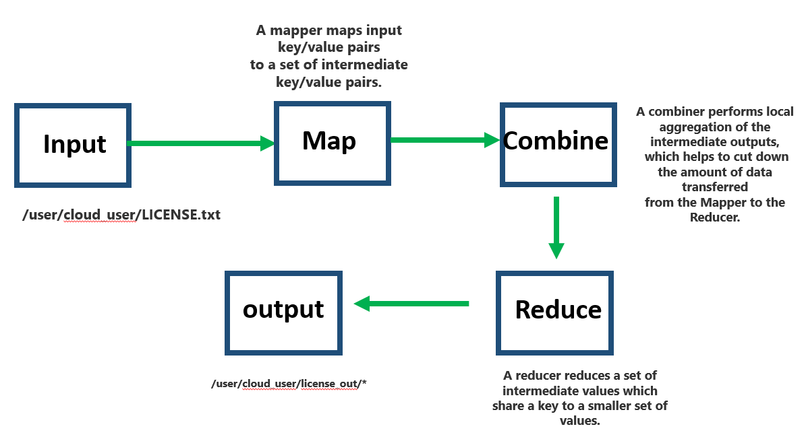

Hello today we are going to discuss Hadoop, we install and develop Hadoop into a cloud server.

## Introduction

Hadoop has become a staple technology in the big data industry by enabling the storage and analysis of datasets so big that it would be otherwise impossible with traditional data systems.


We are going to deploy and configure a single-node pseudo-distributed Hadoop cluster. Then, after we spin it all up, we will execute a MapReduce job using the pre-packaged sample MapReduce applications. 


## Installation and Configuration


In ordering to show how to use Hadoop, we are going to use three cloud servers by using  CentOS7. 


#### Task 1 Install Java

First we have to find the java version which we have to install.

```
[cloud_user@498069248d1c ~]$ yum search jdk
```

and we type

```
sudo yum install java-1.8.0-openjdk -y
```

we check if was installed

```
[cloud_user@498069248d1c ~]$ java -version
openjdk version "1.8.0_262"
OpenJDK Runtime Environment (build 1.8.0_262-b10)
OpenJDK 64-Bit Server VM (build 25.262-b10, mixed mode)
```

#### Task 2  Setup ssh credentials

We need to  to install our ssh pass


```
[cloud_user@498069248d1c ~]$ ssh-keygen
Generating public/private rsa key pair.
Enter file in which to save the key (/home/cloud_user/.ssh/id_rsa):    
Enter passphrase (empty for no passphrase): 
Enter same passphrase again: 
Your identification has been saved in /home/cloud_user/.ssh/id_rsa.
Your public key has been saved in /home/cloud_user/.ssh/id_rsa.pub
```

we can enter to our folder of ssh

```
[cloud_user@498069248d1c ~]$ cd .ssh
[cloud_user@498069248d1c .ssh]$ ls
authorized_keys  id_rsa  id_rsa.pub
```

In ordering to authorize enter to this node by using our public key we  add the public key to the authorized key

```
[cloud_user@498069248d1c .ssh]$ cat id_rsa.pub >> authorized_keys 
```

and then we enter 

```
[cloud_user@498069248d1c .ssh]$ ssh localhost
The authenticity of host 'localhost (::1)' can't be established.
ECDSA key fingerprint is SHA256:058tWZxfDfNI+dkPSFBp5jZ7OqieG1+ctM5yJtkiv1I.
ECDSA key fingerprint is MD5:67:93:60:ca:e3:77:b9:91:45:e8:86:a5:73:33:1f:d8.
Are you sure you want to continue connecting (yes/no)? yes
Warning: Permanently added 'localhost' (ECDSA) to the list of known hosts
```

```
[cloud_user@498069248d1c ~]$ exit
logout
Connection to localhost closed.
[cloud_user@498069248d1c .ssh]$ ssh 127.0.0.1
The authenticity of host '127.0.0.1 (127.0.0.1)' can't be established.
ECDSA key fingerprint is SHA256:058tWZxfDfNI+dkPSFBp5jZ7OqieG1+ctM5yJtkiv1I.
ECDSA key fingerprint is MD5:67:93:60:ca:e3:77:b9:91:45:e8:86:a5:73:33:1f:d8.
Are you sure you want to continue connecting (yes/no)? yes
Warning: Permanently added '127.0.0.1' (ECDSA) to the list of known hosts.
[cloud_user@498069248d1c ~]$ ssh 127.0.0.1
[cloud_user@498069248d1c ~]$ exit
logout
Connection to 127.0.0.1 closed.
```


Now we have the password ssh configured in our localhost with the ip 127.0.0.1

#### Task 3. Download and Deploy Hadoop


The General Architecture of Hadoop has one at leas Namenode and then one or more Datanode.

Name nodes manage the file system and regulate access to files by clients.

Datanodes store and manage data files which are split into blocks.  Blocks can be replicated for allow for fault tolerance.


 														Fig 1.0 General Architecture HDFS


We install Hadoop in sudo distributed mode, this method works also for one one node or multi one.

To get mirrors to download we can enter to this link

http://www.apache.org/dyn/closer.cgi/hadoop/common/


```
[cloud_user@498069248d1c ~]$ curl -O https://downloads.apache.org/hadoop/common/hadoop-2.9.2/hadoop-2.9.2.tar.gz
```


we extract the files

```
[cloud_user@498069248d1c ~]$ tar -xzf hadoop-2.9.2.tar.gz
```

we check the unpacked directory


```linux
[cloud_user@498069248d1c ~]$ ll
total 357868
drwxr-xr-x. 2 cloud_user cloud_user         6 Oct 15  2018 Desktop
drwxrwxr-x. 2 cloud_user cloud_user      4096 Mar  8  2019 Documents
drwxr-xr-x. 9 cloud_user cloud_user      4096 Nov 13  2018 hadoop-2.9.2
-rw-rw-r--. 1 cloud_user cloud_user 366447449 Oct  4 10:02 hadoop-2.9.2.tar.gz
```

we don't need anymore the tar file

```
[cloud_user@498069248d1c ~]$ rm hadoop-2.9.2.tar.gz
```

let us rename the folder

```
[cloud_user@498069248d1c ~]$ mv hadoop-2.9.2  hadoop
```


```
[cloud_user@498069248d1c ~]$ cd hadoop/
[cloud_user@498069248d1c hadoop]$ ll
total 136
drwxr-xr-x. 2 cloud_user cloud_user   4096 Nov 13  2018 bin
drwxr-xr-x. 3 cloud_user cloud_user     19 Nov 13  2018 etc
drwxr-xr-x. 2 cloud_user cloud_user    101 Nov 13  2018 include
drwxr-xr-x. 3 cloud_user cloud_user     19 Nov 13  2018 lib
drwxr-xr-x. 2 cloud_user cloud_user   4096 Nov 13  2018 libexec
-rw-r--r--. 1 cloud_user cloud_user 106210 Nov 13  2018 LICENSE.txt
-rw-r--r--. 1 cloud_user cloud_user  15917 Nov 13  2018 NOTICE.txt
-rw-r--r--. 1 cloud_user cloud_user   1366 Nov 13  2018 README.txt
drwxr-xr-x. 3 cloud_user cloud_user   4096 Nov 13  2018 sbin
drwxr-xr-x. 4 cloud_user cloud_user     29 Nov 13  2018 share


[cloud_user@498069248d1c hadoop]$ which java
/bin/java
```


What Hadoop wants to java home is the alternative java.

```
[cloud_user@498069248d1c hadoop]$ ll /bin/java
lrwxrwxrwx. 1 root root 22 Oct  4 08:42 /bin/java -> /etc/alternatives/java
[cloud_user@498069248d1c hadoop]$ ll /etc/alternatives/java
lrwxrwxrwx. 1 root root 73 Oct  4 08:42 /etc/alternatives/java -> /usr/lib/jvm/java-1.8.0-openjdk-1.8.0.262.b10-0.el7_8.x86_64/jre/bin/java
```


in our case the directory */usr/lib/jvm/java-1.8.0-openjdk-1.8.0.262.b10-0.el7_8.x86_64/jre*


```
[cloud_user@498069248d1c hadoop]$ ll /usr/lib/jvm/java-1.8.0-openjdk-1.8.0.262.b10-0.el7_8.x86_64/jre
total 8
drwxr-xr-x.  2 root root 4096 Oct  4 08:43 bin
drwxr-xr-x. 10 root root 4096 Oct  4 08:42 lib
```

This is what  Hadoop wants to java home to be.


So, in ordering to specify to Hadoop this directory we  have to modify the hadoop-env.sh file


```
[cloud_user@498069248d1c hadoop]$ vim  etc/hadoop/hadoop-env.sh 
```


#### Task 4 Configure Hadoop


```
vim etc/hadoop/core-site.xml 
```

and we add the following

```
<configuration>
 <property>
  <name>fs.defaultFS</name>
  <value>hdfs://localhost:9000</value>
 </property>
</configuration>
```


#### Task 5 Configure HDFS

We want to use one one  so, we modify the  file hdfs-site.xml 


```
[cloud_user@498069248d1c hadoop]$ vim etc/hadoop/hdfs-site.xml 
```

with the following setting:

```
<configuration>
 <property>
  <name>dfs.replication</name>
  <value>1</value>
 </property>
</configuration>
```


```
[cloud_user@498069248d1c hadoop]$ ./bin/hdfs  namenode -format
```


As we have Hadoop downloaded and installed, and   HDFS cluster configured in sudo distributed mode, so go ahead,  get things stored up


### Execution

#### Task 5 Start Services

```
[cloud_user@498069248d1c hadoop]$ ./sbin/start-dfs.sh
Starting namenodes on [localhost]
localhost: starting namenode, logging to /home/cloud_user/hadoop/logs/hadoop-cloud_user-namenode-498069248d1c.mylabserver.com.out
localhost: starting datanode, logging to /home/cloud_user/hadoop/logs/hadoop-cloud_user-datanode-498069248d1c.mylabserver.com.out
Starting secondary namenodes [0.0.0.0]
The authenticity of host '0.0.0.0 (0.0.0.0)' can't be established.
ECDSA key fingerprint is SHA256:058tWZxfDfNI+dkPSFBp5jZ7OqieG1+ctM5yJtkiv1I.
ECDSA key fingerprint is MD5:67:93:60:ca:e3:77:b9:91:45:e8:86:a5:73:33:1f:d8.
Are you sure you want to continue connecting (yes/no)? yes
0.0.0.0: Warning: Permanently added '0.0.0.0' (ECDSA) to the list of known hosts.
0.0.0.0: starting secondarynamenode, logging to /home/cloud_user/hadoop/logs/hadoop-cloud_user-secondarynamenode-498069248d1c.mylabserver.com.out
[cloud_user@498069248d1c hadoop]$
```

We can check if is running

```
[cloud_user@498069248d1c hadoop]$ ./bin/hdfs dfs -ls /
```

If there is nothing in output is ok, now is running our hdfs and we need to configure mar reduce.

#### Task 6 Configure MapReduce




We create a directory

```
[cloud_user@498069248d1c hadoop]$ ./bin/hdfs dfs -mkdir -p /user/cloud_user
[cloud_user@498069248d1c hadoop]$ ./bin/hdfs dfs -ls /
Found 1 items
drwxr-xr-x   - cloud_user supergroup          0 2020-10-04 13:03 /user
```


we copy the LICENSE.txt in the hdfs


```
[cloud_user@498069248d1c hadoop]$ ./bin/hdfs dfs -put LICENSE.txt  LICENSE.txt 
[cloud_user@498069248d1c hadoop]$ ./bin/hdfs dfs -ls /user/cloud_user
Found 1 items
-rw-r--r--   1 cloud_user supergroup     106210 2020-10-04 13:05 /user/cloud_user/LICENSE.txt
```


#### Task 7 Run a MapReduce 


Let us take as an example 

```
[cloud_user@498069248d1c hadoop]$ ll share/hadoop/mapreduce/hadoop-mapreduce-examples-2.9.2.jar 
-rw-r--r--. 1 cloud_user cloud_user 303323 Nov 13  2018 share/hadoop/mapreduce/hadoop-mapreduce-examples-2.9.2.jar
[cloud_user@498069248d1c hadoop]$ 
```

to execute any jar map reduce

```
[cloud_user@498069248d1c hadoop]$ ./bin/hadoop jar share/hadoop/mapreduce/hadoop-mapreduce-examples-2.9.2.jar
```


we can see the several options that we can proceed with mapreduce:

```
Valid program names are:
  aggregatewordcount: An Aggregate based map/reduce program that counts the words in the input files.
  aggregatewordhist: An Aggregate based map/reduce program that computes the histogram of the words in the input files.
  bbp: A map/reduce program that uses Bailey-Borwein-Plouffe to compute exact digits of Pi.
  dbcount: An example job that count the pageview counts from a database.
  distbbp: A map/reduce program that uses a BBP-type formula to compute exact bits of Pi.
  grep: A map/reduce program that counts the matches of a regex in the input.
  join: A job that effects a join over sorted, equally partitioned datasets
  multifilewc: A job that counts words from several files.
  pentomino: A map/reduce tile laying program to find solutions to pentomino problems.
  pi: A map/reduce program that estimates Pi using a quasi-Monte Carlo method.
  randomtextwriter: A map/reduce program that writes 10GB of random textual data per node.
  randomwriter: A map/reduce program that writes 10GB of random data per node.
  secondarysort: An example defining a secondary sort to the reduce.
  sort: A map/reduce program that sorts the data written by the random writer.
  sudoku: A sudoku solver.
  teragen: Generate data for the terasort
  terasort: Run the terasort
  teravalidate: Checking results of terasort
  wordcount: A map/reduce program that counts the words in the input files.
  wordmean: A map/reduce program that counts the average length of the words in the input files.
  wordmedian: A map/reduce program that counts the median length of the words in the input files.
  wordstandarddeviation: A map/reduce program that counts the standard deviation of the length of the words in the input files.
```

Let us select

**wordmean: A map/reduce program that counts the average length of the words in the input files.** as example


```
[cloud_user@498069248d1c hadoop]$ ./bin/hadoop jar share/hadoop/mapreduce/hadoop-mapreduce-examples-2.9.2.jar wordmean LICENSE.txt license_wordmean_output
```

we obtain  the mean

```
The mean is: 5.761225944404846
```

which is saved in our directory


```
[cloud_user@498069248d1c hadoop]$ ./bin/hdfs dfs -ls /user/cloud_user
Found 2 items
-rw-r--r--   1 cloud_user supergroup     106210 2020-10-04 13:05 /user/cloud_user/LICENSE.txt
drwxr-xr-x   - cloud_user supergroup          0 2020-10-04 13:17 /user/cloud_user/license_wordmean_output
```


we can see them

```
[cloud_user@498069248d1c hadoop]$ ./bin/hdfs dfs -cat license_wordmean_output/*
count   15433
length  88913
```

Another example should be use

**pi: A map/reduce program that estimates Pi using a quasi-Monte Carlo method.**

```
[cloud_user@498069248d1c hadoop]$ ./bin/hadoop jar share/hadoop/mapreduce/hadoop-mapreduce-examples-2.9.2.jar pi 10 100
```

and we obtain

```
Job Finished in 2.999 seconds
Estimated value of Pi is 3.14800000000000000000
```

This is a general example of how to execute **MapReduce** job.

#### Task 8 Stop Services

```
[cloud_user@498069248d1c hadoop]$ ./sbin/stop-dfs.sh 
Stopping namenodes on [localhost]
localhost: stopping namenode
localhost: stopping datanode
Stopping secondary namenodes [0.0.0.0]
0.0.0.0: stopping secondarynamenode
[cloud_user@498069248d1c hadoop]$ 
```


Thank you we have deployed and Configured a  **Hadoop Cluster**.


Credits to LinuxAcademy