Today we are going to discuss a bit about how to deploy a Python(Flask) Web Application on AWS Cloud by using AWS Elastic Beanstalk.


We are going to  build, deploy & launch a Python(Flask) Web Application into AWS cloud servers using AWS Elastic Beanstalk Management Console. We will accomplish it in by completing each task in the project:

- Create a Flask(Python) web application

- Launch an AWS EC2 instance(Virtual Server) using AWS Elastic Beanstalk

- Deploy your Flask(Python) web application to AWS virtual servers

  


## Introduction


- **Flask** is a micro web framework written in Python. It is classified as a microframework because of its minimal structure that provides an ecosystem of external components such as form validation, upload handling, authentications, etc., that can be mixed and matched as needed, focusing on including only what you need instead of providing a complete toolset. Companies that use the Flask framework include Pinterest and LinkedIn.


- **Amazon Web Services (AWS)** is a subsidiary of Amazon providing on-demand cloud computing platforms and APIs to individuals, companies, and governments, on a metered pay-as-you-go basis. These cloud computing web services provide a variety of basic abstract technical infrastructure and distributed computing building blocks and tools.

- **Amazon Elastic Compute Cloud (Amazon EC2)**, which provides secure, resizable compute capacity in the cloud. In simple terms cloud servers.


The environment is the heart of the application. In the diagram, the environment is shown within the top-level solid line. When you create an environment, Elastic Beanstalk provisions the resources required to run your application. AWS resources created for an environment include one elastic load balancer (ELB in the diagram), an Auto Scaling group, and one or more Amazon Elastic Compute Cloud (Amazon EC2) instances.


In the following sections we are going to setup our local computer and the Ec2 instances to deploy  Flask.


## Flask Installation

In our local computer, first we need to install flask.

```
pip3 install Flask
```

We are going to use Visual Studio Code, you can download in the following link

https://code.visualstudio.com/download


We create a folder where we are going to write our code and there we create a file called application.py

```
mkdir myproject
cd myproject
code application.py
```

and we write a test program of Hello World

```python
from flask import Flask
application = Flask(__name__)

@application.route('/')
def hello_world():
    return "Hello World"

if __name__ == '__main__':
    application.run()
```


we install flask 

```
pip3 install Flask
```

and we test our program

```
python3 applycation.py
```

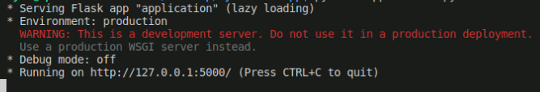

We have successfully installed Flask

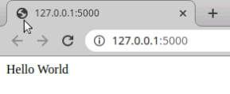


## AWS Elastic Beanstalk Setup - Part 1


We login to our AWS credentials and we select the service Elastic Beanstalk

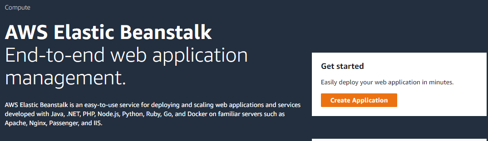

And we click on create application and we call ``myFlaskWebAPP``

 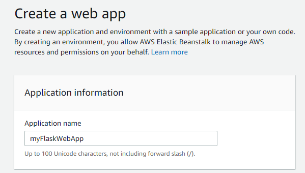

then we choose the platform  ``Python`` 

and we click ``Create application``. 

We wait  until the Ec2 instance is created.

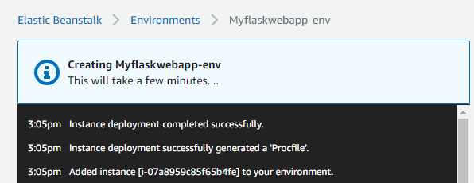

we have created an environment.

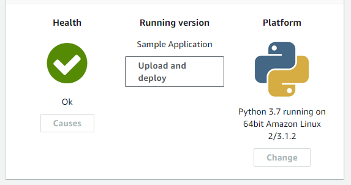


## Getting the libraries

In ordering to execute our application on aws server we require install all the dependencies needed

to execute our program.

Fortunately this can be done by using pip, so by going to our terminal  located in our local machine

we create the file with all the requirements needed.

```
pip3 freeze > requirements.txt
```

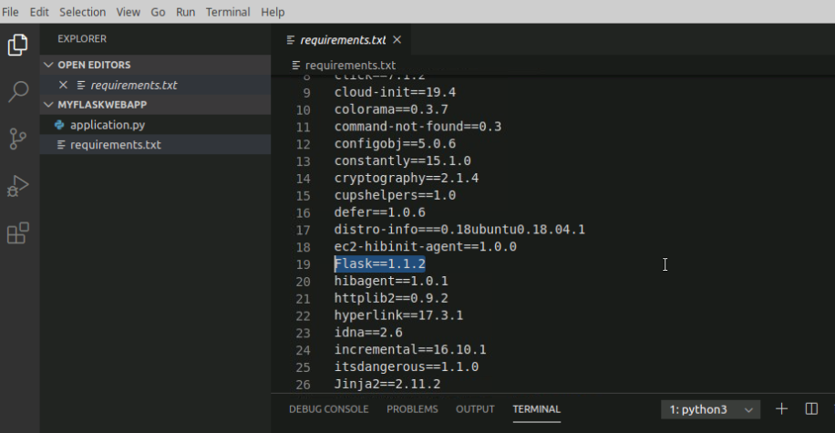


we are interested only on the Flask dependency, so we choose only this one and we remove the others.

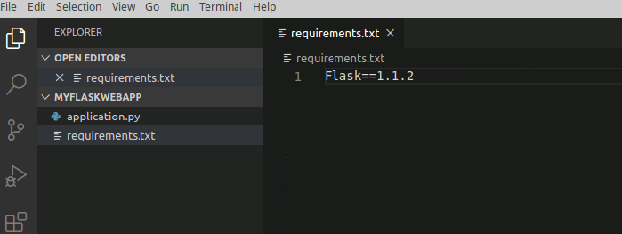


The next step is zip the ``application.py``  and ``requirements.txt`` files 

```
zip version_1.zip application.py requirements.txt 
```

This file will be used  on AWS.


## AWS Elastic Beanstalk Setup Part 2

We return back to the AWS console and we go to the Elastic Beanstalk

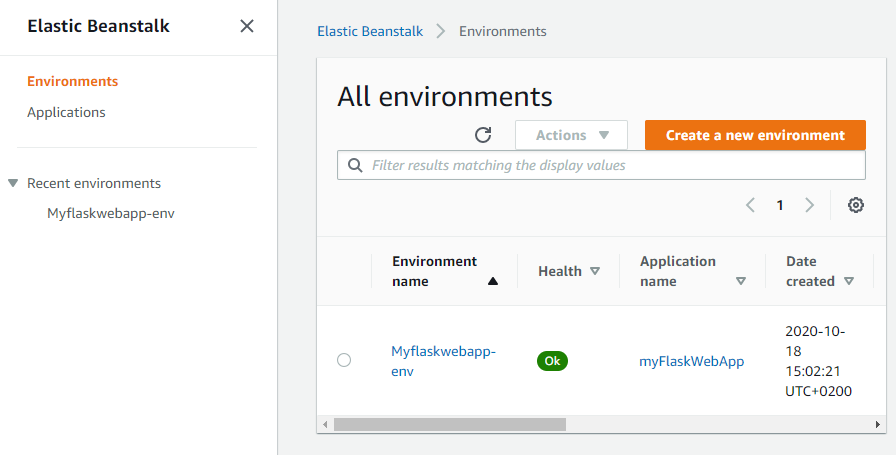

we click on the Enviroment ``Myflaskwebapp-env`` then we click ``upload and deploy``

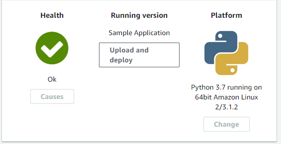

and then we select our file ``version_1.zip``  and we add the label  ``version_1``

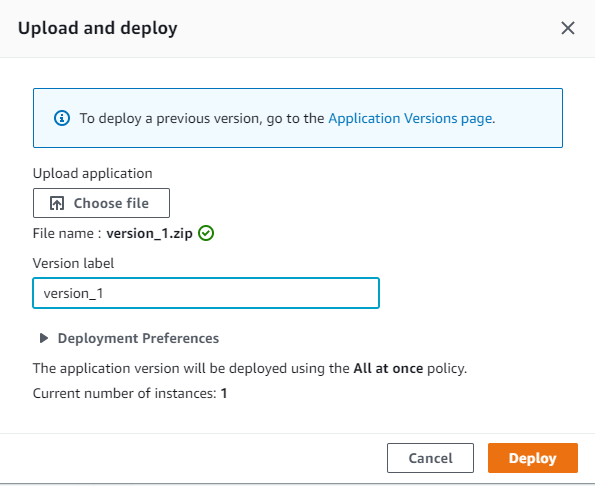

and finally we click ``deploy``. 


After it is deployed we click on the link of our enviroment

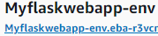

and its open our application from AWS cloud.

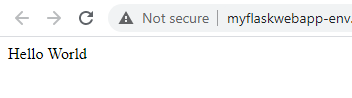

**Congratulations!**  we could execute our first Hello World web app on AWS.

