Today we are going to deploy a web application on the AWS cloud that perform a regression and plot the results on the web browser. This method can be used to deploy different Machine Learning models. 


## Introduction


**Amazon Elastic Compute Cloud (Amazon EC2)** is a web service that provides secure, resizable compute capacity in the cloud. It is designed to make web-scale cloud computing easier for developers. Amazon EC2’s simple web service interface allows you to obtain and configure capacity with minimal friction. It provides you with complete control of your computing resources and lets you run on Amazon’s proven computing environment.

Amazon EC2 offers the broadest and deepest compute platform with choice of processor, storage, networking, operating system, and purchase model. 


**Flask** is a lightweight [WSGI](https://wsgi.readthedocs.io/) web application framework. It is designed to make getting started quick and easy, with the ability to scale up to complex applications. It began as a simple wrapper around [Werkzeug](https://palletsprojects.com/p/werkzeug) and [Jinja](https://palletsprojects.com/p/jinja) and has become one of the most popular Python web application frameworks.


## EC2 Instance Setup

First we need to enter to the AWS Management Console

[https://aws.amazon.com/it/console/](https://aws.amazon.com/it/console/)


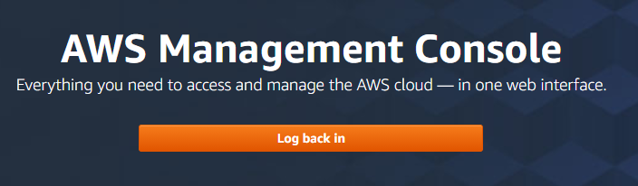


 We enter with our credentials and we enter to the EC2 service


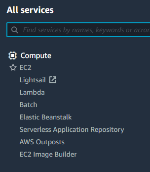

 We launch an instance


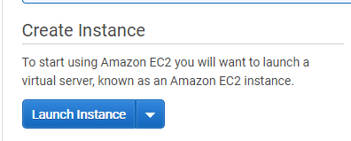


 We Select **Amazon Linux 2 AMI (HVM), SSD Volume Type**   with the default settings

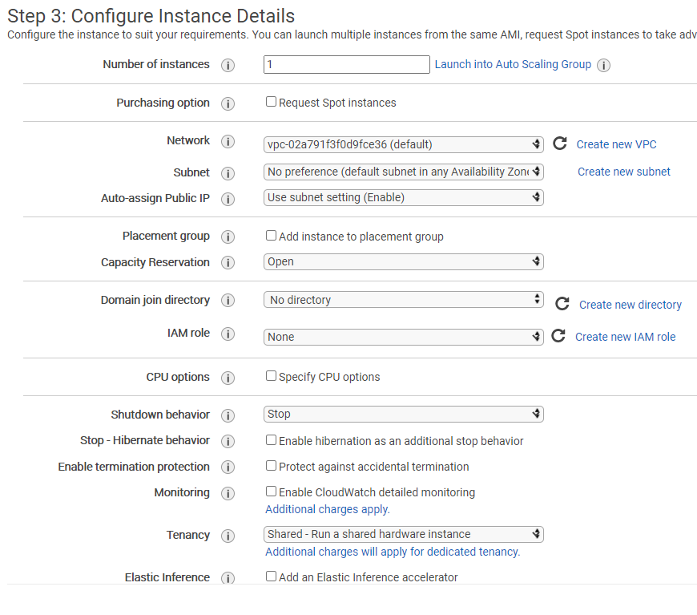


We add  the tag,  ``Name`` with the value  ``WebApplication``

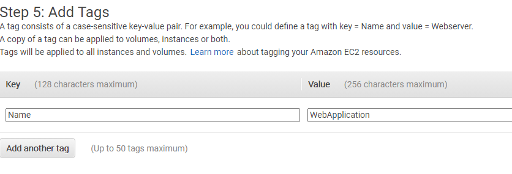


For the Security Group, for this example, we  assign open the port 22 TCP and the Custom 5000 for the Flask application.

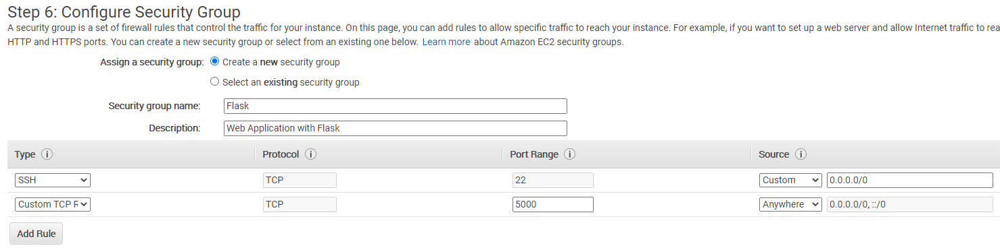

For the key pair , we can create  new key pair or use your key pair.

If you don't have your keypair you have create and download.

Because you will use  in order to enter to the server.


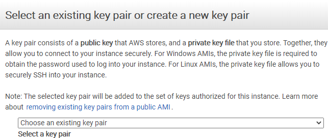


Finally we launch our EC2 Instance.

We return back to the EC2 Dashboard and we copy the ``IPv4 Public IP`` 

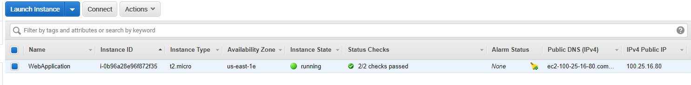

10. We go to our terminal and with our ``IPv4 Public IP``  that should be different to mine

    you type

```
ssh ec2-user@100.25.16.80 -i MyKey.pem
```

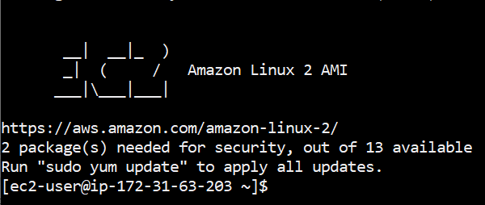

we apply all updates


```
sudo yum update -y
```

there are two ways to run the Flask Application,


a) Docker with Flask

b) Flask without Docker

Both options are good but if you use docker you have the advantage to install in different platforms.

I prefer use Docker but I going to install Python and Flask on the EC2 Instances to have both options.

## Docker Installation on EC2

```
sudo amazon-linux-extras install docker
```

we start the docker daemon

```
 sudo service docker start
```

We want add the privilege to the ec2-user to use docker 


```
sudo usermod -a -G docker ec2-user
```

## Python Installation on EC2

In addition to Docker, and have the opportunity to execute in natural way the python programs we install python on the EC2 Instance

```
sudo yum install python37
```

we check if was installed

```
python --version
```

```
sudo yum install python37
```

```
python3 --version
```

We want to install pip, on EC2 instance, so we execute this script

```
 curl -O https://bootstrap.pypa.io/get-pip.py
```

```
python3 get-pip.py --user
```

```
pip --version
```

If everything was done correctly

we got

```
[ec2-user@ip-172-31-63-203 ~]$ pip --version
pip 20.2.4 from /home/ec2-user/.local/lib/python3.7/site-packages/pip (python 3.7)
```

we can remove the downloaded file

```
rm get-pip.py
```

Finally we can exit and start with everything running properly.

```
exit
```


## Web Application Installation

We enter again to our EC2 server

```
ssh ec2-user@100.25.16.80 -i MyKey.pem
```

We check if now we can  run docker

```
docker info
```


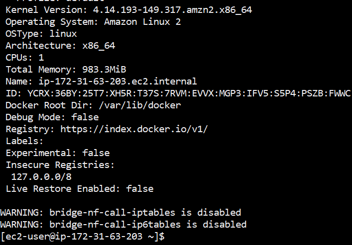


Now we can do a test, by running the ``hello-world``


```
 docker run hello-world
```

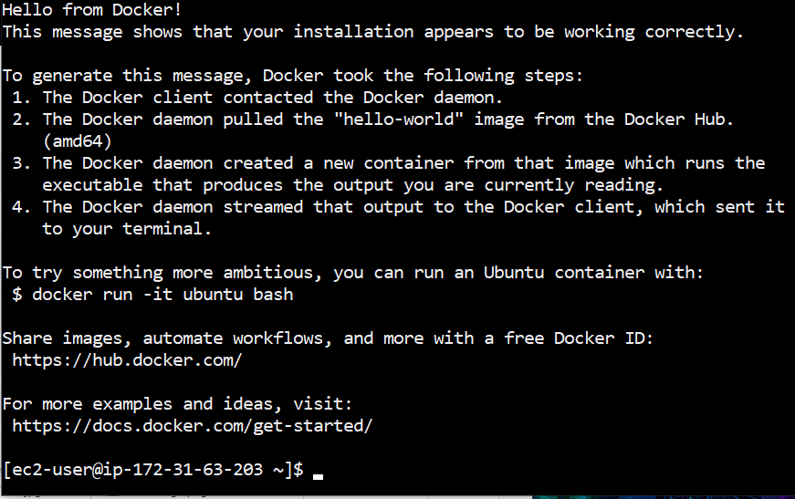

It is possible list the active Docker containers	

```
docker ps -a
```


Let us remove the hello-world container, lets copy the ``CONTANIER ID`` and delete

```
docker rm 0d69fdc5d8e1
```

there is not any  running container

```
docker ps -a
```

## Docker Container Installation

First we create the folder where we want to install the webapp

```
mkdir DockerContainer
```

and we enter there

```
cd DockerContainer/
```

We choose a dataset that we want to perform the regression,

```
curl -o ./tempYearly.csv -k https://raw.githubusercontent.com/ruslanmv/DockerContainer/master/tempYearly.csv
```

 we download the docker file

```
curl -o ./Dockerfile -k https://raw.githubusercontent.com/ruslanmv/DockerContainer/master/Dockerfile
```

and the dependencies of our webapp

```
curl -o ./requirements.txt -k https://raw.githubusercontent.com/ruslanmv/DockerContainer/master/requirements.txt
```

and we create the folder where we will put the python codes

```
mkdir app
```

```
cd app
```

Those file are already used in previous posts. https://ruslanmv.com/blog/creation-of-container

```
curl -o ./app.py -k https://raw.githubusercontent.com/ruslanmv/DockerContainer/master/app/app.py
```

```
curl -o ./plotdata.py -k https://raw.githubusercontent.com/ruslanmv/DockerContainer/master/app/plotdata.py
```

```
cd ..
```

## Building the Docker  WebApp

```
docker build --tag flask-plotting-app . 
```

this create the container  ``flask-plotting-app:latest``

```
Successfully tagged flask-plotting-app:latest
```


## Execution of the WebApp

We can execute the container by the following command

```
docker run -i -t --name flaskpltapp -p5000:5000 flask-plotting-app:latest
```

if everthing was done well you will get the following message

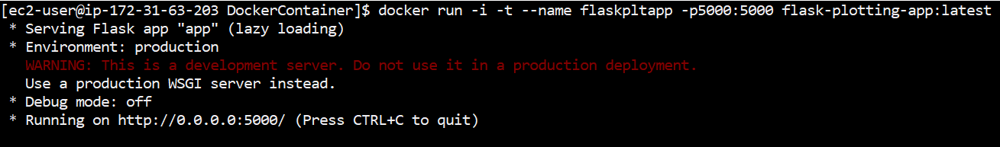


## Run the WebApp on the Browser

We copy our public IP of the EC2 Instance

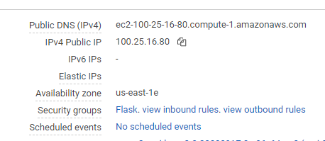


and  you write  you IP following by the port 5000 , for example : `` http://100.25.16.80:5000/`` on your web browser  and finally you got the regression plot

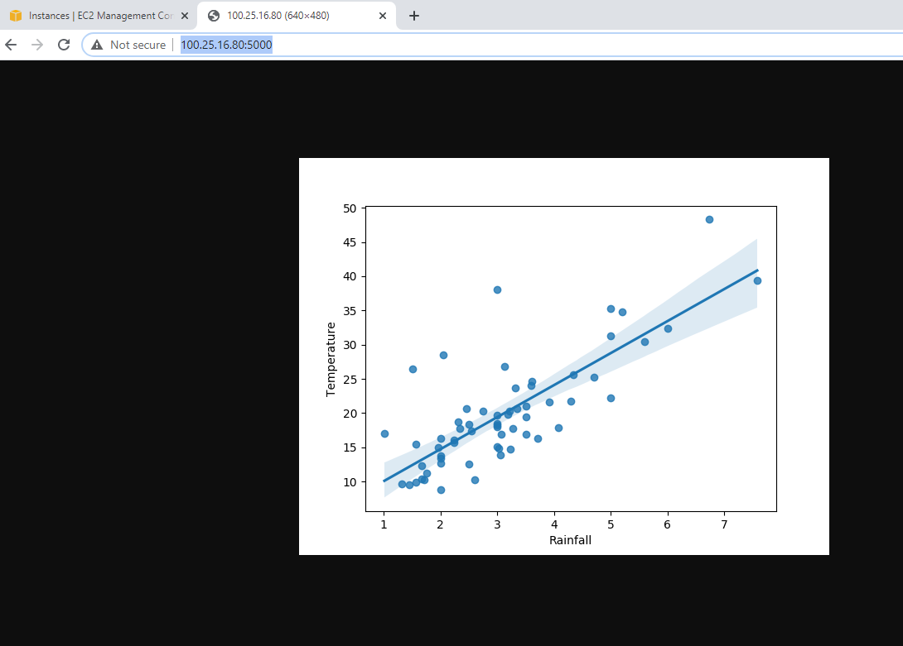


also you can use the  public  DNS `` http://ec2-100-25-16-80.compute-1.amazonaws.com:5000/`` 


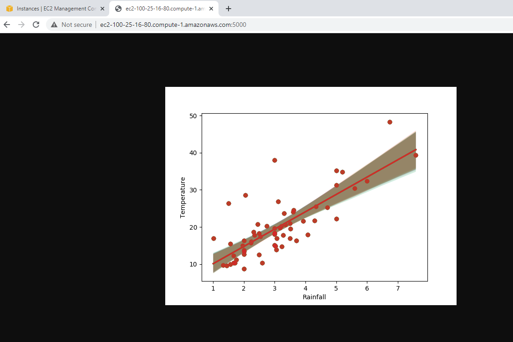

each time you execute you python program, you can visualize on the terminal, the logs of that.


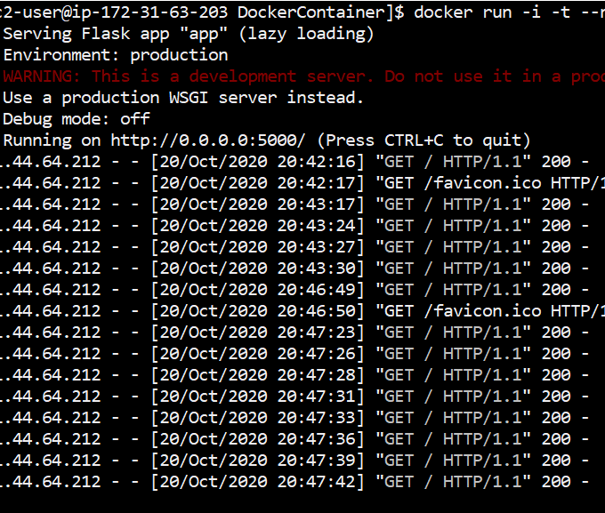


you can close the application by using CTRL+C to quit.

## Web Application without Docker

The second method simpler, consists in the installation of all dependencies of your webapp by using pip3.

go to your terminal there 

```
pip3 install -r requirements.txt
```

and to run your application just execute them as


```
python3 ./app/app.py
```


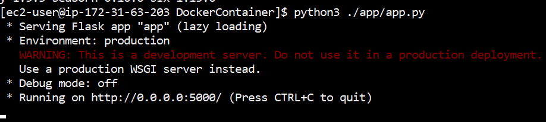

and wualaaa


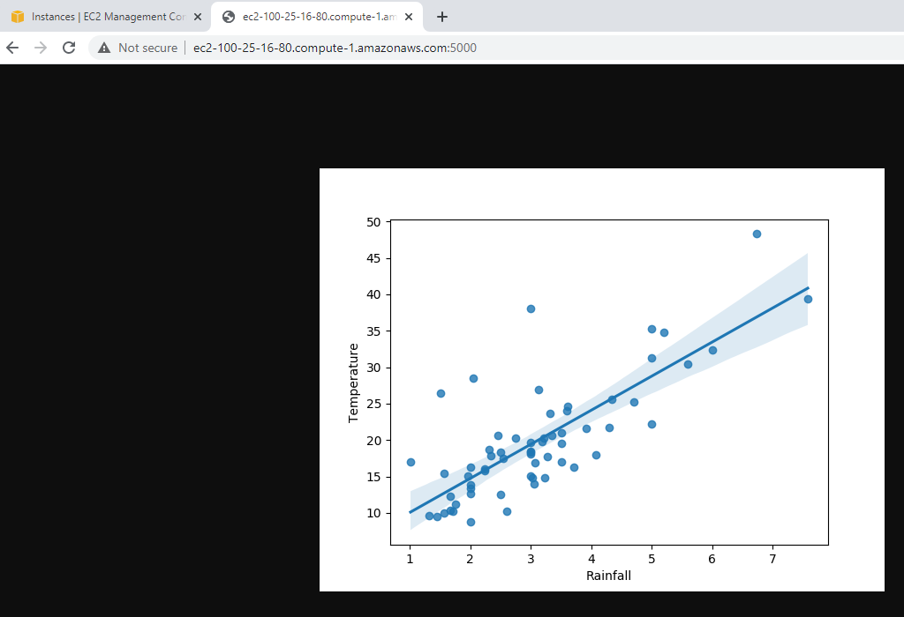

again you go the plot , but now without the docker. Finally, in order to avoid costs on AWS, don't forget ``terminate`` our instance.


**Congratulations!**  we could  perform a Regression Plot with our web app on AWS.