Hello, today we are going to create a model to predict a forecast from a dataset from Intellisense.io. 


IntelliSense.io a Market Leader in the Industrial Internet of Things and Artificial Intelligence .IntelliSense.io a Cambridge (UK) based provider of Optimisation as a Service (OaaS) applications for the Natural Resources Industries. 

The company’s applications are delivered from their Industrial Internet of Things (IIoT) and Artificial Intelligence (AI) powered real-time decision-making platform (Brains.app), through a No Capital Expenditure model. 

These applications have been deployed in the Mining industry across Latin America and Kazakhstan for base and precious metal mining operations. IntelliSense.io is a privately-held company based in Cambridge, UK, with offices in Almaty, Kazakhstan, Barcelona, Spain and Santiago, Chile. 


**Introduction**

The goal of the project is to devise and implement a prototype data-driven
prediction model of a Semi-autogenous (SAG) Mill.


 Semi-autogenous (SAG) mills are central pieces of equipment for large mining
operations. They are commonly used in the secondary crushing stage to break
down larger rocks from the pit for further processing. As a very rough analogy,
a SAG mill works like a giant washing machine for rocks and steel balls.


**Description of the problem**

IntelliSense.io provides one year of data based on real measurements
from a client SAG mill. 

Types of data tracked include performance variables,
which are used to monitor the operation of the mill.


We are interested to predict: 


1. **Power Draw (MW)** — Power drawn by the mill motor
2. **Bearing Pressure (kPa)** — Pressure on the mill supports. Can be
   thought of as the weight of the mill.


By using the data as an input: 

1. Speed (RPM) — Rotation speed of the mill
2. Conveyor Belt Feed Rate (t/h) — Mass flow rate of material into the
   mill
3. Dilution Flow Rate (m³/h) — Volume flow rate of water into the mill
4. Conveyor Belt Fines (%) — Percent of material in the feed
   classified as "fine"


For this project I need the libraries:


```python
from numpy import concatenate
from matplotlib import pyplot
from pandas import read_csv
from pandas import DataFrame
from pandas import concat
from sklearn.preprocessing import MinMaxScaler
from sklearn.preprocessing import LabelEncoder
from sklearn.metrics import mean_squared_error
from keras.models import Sequential
from keras.layers import Dense
from keras.layers import LSTM
```


```python
import numpy as np
import pandas as pd
import matplotlib.pyplot as plt
```


```python
import scipy.stats as stats
```


```python
from pandas import read_csv
from datetime import datetime
import pandas as pd
from pandas import read_csv
from matplotlib import pyplot
from pandas import read_csv
from matplotlib import pyplot
```


```python

```

#### Load and inspect data


```python
data= pd.read_csv("data/sag_data_train.csv", index_col="Time", parse_dates=True)
```


```python
data.head()
```


<div>
<style scoped>
    .dataframe tbody tr th:only-of-type {
        vertical-align: middle;
    }


    .dataframe tbody tr th {
        vertical-align: top;
    }
    
    .dataframe thead th {
        text-align: right;
    }

</style>

<table border="1" class="dataframe">
  <thead>
    <tr style="text-align: right;">
      <th></th>
      <th>Bearing Pressure (kPa)</th>
      <th>Power Draw (MW)</th>
      <th>Speed (RPM)</th>
      <th>Dilution Flow Rate (m3/h)</th>
      <th>Conveyor Belt Feed Rate (t/h)</th>
      <th>Conveyor Belt PSD Fines (%)</th>
    </tr>
    <tr>
      <th>Time</th>
      <th></th>
      <th></th>
      <th></th>
      <th></th>
      <th></th>
      <th></th>
    </tr>
  </thead>
  <tbody>
    <tr>
      <th>2015-09-15 00:00:00</th>
      <td>5488.175540</td>
      <td>11.737357</td>
      <td>7.843532</td>
      <td>1030.590108</td>
      <td>2935.660276</td>
      <td>38.641018</td>
    </tr>
    <tr>
      <th>2015-09-15 00:01:00</th>
      <td>5423.930126</td>
      <td>11.543755</td>
      <td>7.681607</td>
      <td>1039.869847</td>
      <td>2928.333772</td>
      <td>45.243656</td>
    </tr>
    <tr>
      <th>2015-09-15 00:02:00</th>
      <td>5502.058523</td>
      <td>11.169525</td>
      <td>7.514173</td>
      <td>1033.237205</td>
      <td>2919.128115</td>
      <td>38.716221</td>
    </tr>
    <tr>
      <th>2015-09-15 00:03:00</th>
      <td>5477.862749</td>
      <td>11.035091</td>
      <td>7.592248</td>
      <td>1035.075573</td>
      <td>2985.500811</td>
      <td>42.860703</td>
    </tr>
    <tr>
      <th>2015-09-15 00:04:00</th>
      <td>5508.013201</td>
      <td>11.418827</td>
      <td>7.784895</td>
      <td>1042.189406</td>
      <td>2905.052105</td>
      <td>50.524544</td>
    </tr>
  </tbody>
</table>

</div>


Before develop any model of machine learning first we analyze the data
Lets find if there is any liner correlation between variables


```python
corr = data.corr()
fig = plt.figure()
ax = fig.add_subplot(111)
cax = ax.matshow(corr,cmap='coolwarm', vmin=-1, vmax=1)
fig.colorbar(cax)
ticks = np.arange(0,len(data.columns),1)
ax.set_xticks(ticks)
plt.xticks(rotation=90)
ax.set_yticks(ticks)
ax.set_xticklabels(data.columns)
ax.set_yticklabels(data.columns)
plt.show()
```

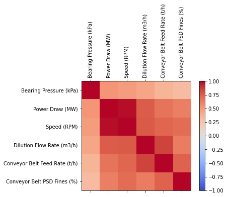


```python
def personserie(df,paraX,paraY):
    df = df[[paraX, paraY]]
    overall_pearson_r = df.corr().iloc[0,1]
    print(f"Pandas computed Pearson r: {overall_pearson_r}")
    r, p = stats.pearsonr(df.dropna()[paraX], df.dropna()[paraY])
    print(f"Scipy computed Pearson r: {r} and p-value: {p}")
    f,ax=plt.subplots(figsize=(14,3))
    df.rolling(window=30,center=True).median().plot(ax=ax)
    
    ax.set(xlabel='Frame',ylabel='Smiling evidence',title=f"Overall Pearson r = {np.round(overall_pearson_r,2)}");
       
```


```python
personserie(data,'Power Draw (MW)','Speed (RPM)')
```

    Pandas computed Pearson r: 0.9804985064390073
    Scipy computed Pearson r: 0.9804985064390568 and p-value: 0.0


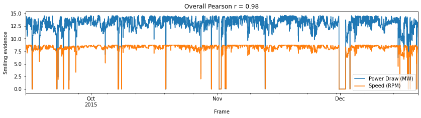


This means that best option to predict the **PowerDraw** should be use a linear regresion and  **Bearing Pressure** by times series forecasting method. The project will be splitted into the following sections:

**Section 1 - Bearing Pressure**

**Section 2 - PowerDraw** 


## Section 1 - Bearing Pressure

Time series forecasting problems must be re-framed as supervised learning problems. From a sequence to pairs of input and output sequences.Technically, in time series forecasting terminology the current time (t) and future times (t+1, t+n) are forecast times and past observations (t-1, t-n) are used to make forecasts. Positive and negative shifts can be used to create a new DataFrame from a time series with sequences of input and output patterns for a supervised learning problem. Further, the shift function also works on so-called multivariate time series problems.  All variates in the time series can be shifted forward or backward to create multivariate input and output sequences.

We will define a new Python function named series_to_supervised() that takes a univariate or multivariate time series and frames it as a supervised learning dataset.
The function takes four arguments:

**data:** Sequence of observations as a list or 2D NumPy array. Required.

**n_in:** Number of lag observations as input (X). Values may be between [1..len(data)] Optional. Defaults to 1.

**n_out:** Number of observations as output (y). Values may be between [0..len(data)-1]. Optional. Defaults to 1.

**dropnan:** Boolean whether or not to drop rows with NaN values. Optional. Defaults to True.
The function returns a single value:

**return:** Pandas DataFrame of series framed for supervised learning.


```python
# convert series to supervised learning
def series_to_supervised(data, n_in=1, n_out=1, dropnan=True):
    n_vars = 1 if type(data) is list else data.shape[1]
    df = DataFrame(data)
    cols, names = list(), list()
    # input sequence (t-n, ... t-1)
    for i in range(n_in, 0, -1):
        cols.append(df.shift(i))
        names += [('var%d(t-%d)' % (j+1, i)) for j in range(n_vars)]
    # forecast sequence (t, t+1, ... t+n)
    for i in range(0, n_out):
        cols.append(df.shift(-i))
        if i == 0:
            names += [('var%d(t)' % (j+1)) for j in range(n_vars)]
        else:
            names += [('var%d(t+%d)' % (j+1, i)) for j in range(n_vars)]
    # put it all together
    agg = concat(cols, axis=1)
    agg.columns = names
    # drop rows with NaN values
    if dropnan:
        agg.dropna(inplace=True)
    return agg
```


```python
# load dataset
df_train = pd.read_csv("data/sag_data_train.csv", index_col="Time", parse_dates=True)
```


```python
#df_train.head()
```

###  DATA PREPARATION

The first step is to prepare the Bearing Pressure (kPa) dataset. This involves framing the dataset as a supervised learning problem and normalizing the input variables.
We will frame the supervised learning problem as predicting the Bearing Pressure at the current time (t) given the Speed (RPM)	Dilution Flow Rate (m3/h)	Conveyor Belt Feed Rate (t/h)	Conveyor Belt PSD Fines (%) measurements at the prior time step.


```python
dataset=df_train
values = df_train.values
```


```python
# specify columns to plot
groups = [0, 1, 2, 3, 4, 5]
i = 1
# plot each column
pyplot.figure()
for group in groups:
    pyplot.subplot(len(groups), 1, i)
    pyplot.plot(values[:, group])
    pyplot.title(dataset.columns[group], y=0.5, loc='right')
    i += 1
pyplot.show()
```

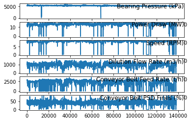


The first step is to prepare the Bearing Pressure (kPa) dataset for the LSTM. This involves framing the dataset as a supervised learning problem and normalizing the input variables.We will frame the supervised learning problem as predicting the Bearing Pressure (kPa) at the current time (t) given the Power Draw (MW),Speed (RPM) Dilution Flow Rate (m3/h) Conveyor Belt Feed Rate (t/h) Conveyor Belt PSD Fines (%)  parameters at the prior time step.

Fortunatelly we dont have Categorical Data on the features, so we dont need Convert Categorical Data to Numerical Data by Integer Encoding or One-Hot Encoding.


```python
# integer encode direction
#encoder = LabelEncoder()
#values[:,number_col] = encoder.fit_transform(values[:,number_col])
```


```python
# ensure all data is float
values = values.astype('float32')
```

Next, all features are normalized, then the dataset is transformed into a supervised learning problem.


```python
# normalize features
scaler = MinMaxScaler(feature_range=(0, 1))
scaled = scaler.fit_transform(values)
```


```python
scaled[0]
```


    array([0.91485214, 0.7853231 , 0.8984538 , 0.62976223, 0.81679434,
           0.45599252], dtype=float32)


**Multivariate Forecasting**

This is where we may have observations of multiple different measures and an interest in forecasting one or more of them. For example, we may have two sets of time series observations obs1 and obs2 and we wish to forecast one or both of these. We can call series_to_supervised() in exactly the same way.


```python
# frame as supervised learning
reframed = series_to_supervised(scaled, 1, 1)
```

printing the new framing of the data, showing an input pattern with one time step for both variables and an output pattern of one time step for both variables. Again, depending on the specifics of the problem, the division of columns into X and Y components can be chosen arbitrarily, such as if the current observation of var1 was also provided as input and only var2 was to be predicted.


```python
#len(reframed)
```


```python
reframed
```


<div>
<style scoped>
    .dataframe tbody tr th:only-of-type {
        vertical-align: middle;
    }


    .dataframe tbody tr th {
        vertical-align: top;
    }
    
    .dataframe thead th {
        text-align: right;
    }

</style>

<table border="1" class="dataframe">
  <thead>
    <tr style="text-align: right;">
      <th></th>
      <th>var1(t-1)</th>
      <th>var2(t-1)</th>
      <th>var3(t-1)</th>
      <th>var4(t-1)</th>
      <th>var5(t-1)</th>
      <th>var6(t-1)</th>
      <th>var1(t)</th>
      <th>var2(t)</th>
      <th>var3(t)</th>
      <th>var4(t)</th>
      <th>var5(t)</th>
      <th>var6(t)</th>
    </tr>
  </thead>
  <tbody>
    <tr>
      <th>1</th>
      <td>0.914852</td>
      <td>0.785323</td>
      <td>0.898454</td>
      <td>0.629762</td>
      <td>0.816794</td>
      <td>0.455993</td>
      <td>0.904073</td>
      <td>0.772450</td>
      <td>0.879906</td>
      <td>0.635433</td>
      <td>0.814756</td>
      <td>0.533909</td>
    </tr>
    <tr>
      <th>2</th>
      <td>0.904073</td>
      <td>0.772450</td>
      <td>0.879906</td>
      <td>0.635433</td>
      <td>0.814756</td>
      <td>0.533909</td>
      <td>0.917181</td>
      <td>0.747567</td>
      <td>0.860727</td>
      <td>0.631380</td>
      <td>0.812195</td>
      <td>0.456880</td>
    </tr>
    <tr>
      <th>3</th>
      <td>0.917181</td>
      <td>0.747567</td>
      <td>0.860727</td>
      <td>0.631380</td>
      <td>0.812195</td>
      <td>0.456880</td>
      <td>0.913122</td>
      <td>0.738628</td>
      <td>0.869670</td>
      <td>0.632503</td>
      <td>0.830662</td>
      <td>0.505788</td>
    </tr>
    <tr>
      <th>4</th>
      <td>0.913122</td>
      <td>0.738628</td>
      <td>0.869670</td>
      <td>0.632503</td>
      <td>0.830662</td>
      <td>0.505788</td>
      <td>0.918181</td>
      <td>0.764143</td>
      <td>0.891737</td>
      <td>0.636850</td>
      <td>0.808278</td>
      <td>0.596227</td>
    </tr>
    <tr>
      <th>5</th>
      <td>0.918181</td>
      <td>0.764143</td>
      <td>0.891737</td>
      <td>0.636850</td>
      <td>0.808278</td>
      <td>0.596227</td>
      <td>0.914700</td>
      <td>0.782284</td>
      <td>0.909612</td>
      <td>0.631457</td>
      <td>0.819966</td>
      <td>0.558852</td>
    </tr>
    <tr>
      <th>...</th>
      <td>...</td>
      <td>...</td>
      <td>...</td>
      <td>...</td>
      <td>...</td>
      <td>...</td>
      <td>...</td>
      <td>...</td>
      <td>...</td>
      <td>...</td>
      <td>...</td>
      <td>...</td>
    </tr>
    <tr>
      <th>138236</th>
      <td>0.888515</td>
      <td>0.902305</td>
      <td>0.994407</td>
      <td>0.586262</td>
      <td>0.794455</td>
      <td>0.500200</td>
      <td>0.881775</td>
      <td>0.913288</td>
      <td>0.997608</td>
      <td>0.576388</td>
      <td>0.800384</td>
      <td>0.593150</td>
    </tr>
    <tr>
      <th>138237</th>
      <td>0.881775</td>
      <td>0.913288</td>
      <td>0.997608</td>
      <td>0.576388</td>
      <td>0.800384</td>
      <td>0.593150</td>
      <td>0.884448</td>
      <td>0.909902</td>
      <td>0.985473</td>
      <td>0.596625</td>
      <td>0.782906</td>
      <td>0.530104</td>
    </tr>
    <tr>
      <th>138238</th>
      <td>0.884448</td>
      <td>0.909902</td>
      <td>0.985473</td>
      <td>0.596625</td>
      <td>0.782906</td>
      <td>0.530104</td>
      <td>0.876622</td>
      <td>0.895403</td>
      <td>0.962863</td>
      <td>0.570117</td>
      <td>0.800633</td>
      <td>0.477679</td>
    </tr>
    <tr>
      <th>138239</th>
      <td>0.876622</td>
      <td>0.895403</td>
      <td>0.962863</td>
      <td>0.570117</td>
      <td>0.800633</td>
      <td>0.477679</td>
      <td>0.873892</td>
      <td>0.876178</td>
      <td>0.943823</td>
      <td>0.581300</td>
      <td>0.801972</td>
      <td>0.565912</td>
    </tr>
    <tr>
      <th>138240</th>
      <td>0.873892</td>
      <td>0.876178</td>
      <td>0.943823</td>
      <td>0.581300</td>
      <td>0.801972</td>
      <td>0.565912</td>
      <td>0.880246</td>
      <td>0.870881</td>
      <td>0.934119</td>
      <td>0.593477</td>
      <td>0.796080</td>
      <td>0.565529</td>
    </tr>
  </tbody>
</table>
<p>138234 rows × 12 columns</p>

</div>


The variables for the time to be predicted (t) are then removed.

It is printed the first 5 rows of the transformed dataset.


```python
# drop columns we don't want to predict
reframed.drop(reframed.columns[[7,8,9,10,11]], axis=1, inplace=True)
print(reframed.head())
```

       var1(t-1)  var2(t-1)  var3(t-1)  var4(t-1)  var5(t-1)  var6(t-1)   var1(t)
    1   0.914852   0.785323   0.898454   0.629762   0.816794   0.455993  0.904073
    2   0.904073   0.772450   0.879906   0.635433   0.814756   0.533909  0.917181
    3   0.917181   0.747567   0.860727   0.631380   0.812195   0.456880  0.913122
    4   0.913122   0.738628   0.869670   0.632503   0.830662   0.505788  0.918181
    5   0.918181   0.764143   0.891737   0.636850   0.808278   0.596227  0.914700


We can see the 6 input variables (input series) and the 1 output variable (Bearing Pressure (kPa) level at the current time).The Power Draw (MW) it is not needed to include as an input because it linear correlated with the Speed (RPM). However in order to develop the model we include them. Also can be removed the outliers. Additionally shold be possible make all series stationary with differencing and seasonal adjustment. But for the current times series we keep as it is. The scope for now is not optimization. Notice that we can choose the inputs in this part and try to identify which inputs are more important by using PCA but the current scope for now is show the method to perform this kind of predictions.

## FITTING PROCEDURE

We will fit an LSTM on the multivariate input data. First, we must split the prepared dataset into train and test sets. 
we will only fit the model  taking the first dataset sag_data_train.csv, the dataset ag_data_test.csv will be used only to test our future models. The standard procedure of splitting is given by the splits the dataset into train 80% of data and for the test the  20% of data, however for the reason we want predict 5 minutes in the future the testing will be considered 25 minutes by a window for the training test, We splits the train and test sets into input and output variables.Finally, the inputs (X) are reshaped into the 3D format expected by LSTMs

Let us know what is the index time of the first row of the traing set 


```python
df_train.index[0]
```


    Timestamp('2015-09-15 00:00:00')


and the final


```python
df_train.index[-1]
```


    Timestamp('2015-12-20 00:00:00')


```python
#df_train.index[138240]
```

So the training set is given between 2015-09-15 -> 2015-12-20


```python
#df_train.shape
```


```python
#df_train.tail(1).index
```


```python
#df_train['2015-09-15 00:00:00':].head(1).index
```

Let us count the number of days


```python
from datetime import date
f_date = date(2015,9,15)
l_date = date(2015,12,20)
delta = l_date - f_date
print('Between the initial date and final day there are',delta.days,'days')
```

    Between the initial date and final day there are 96 days


```python
print('Which converted to minutes is ',delta.days*1440)
print( 'which is ',len(df_train)-1,'rows in our dataframe train')
```

    Which converted to minutes is  138240
    which is  138240 rows in our dataframe test


The stantard procedure take the 80% of training and 20% of testing


```python
print('the training will have',int(delta.days*80/100*1440),'minutes')
print('the test will have',int(delta.days*20/100*1440),'minutes')
```

    the training will have 110592 minutes
    the test will have 27648 minutes


```python
# split into train and test sets
values = reframed.values
n_train_minutes = int(delta.days*80/100*1440)
train = values[:n_train_minutes, :]
#test = values[n_train_minutes:, :]
```

However I would like take a windows to test of 25 min


```python
window=25
test = values[n_train_minutes:n_train_minutes+window, :]
```


```python
len(test)
```


    25


```python
# split into input and outputs
train_X, train_y = train[:, :-1], train[:, -1]
test_X, test_y = test[:, :-1], test[:, -1]
```


```python
# reshape input to be 3D [samples, timesteps, features]
train_X = train_X.reshape((train_X.shape[0], 1, train_X.shape[1]))
test_X = test_X.reshape((test_X.shape[0], 1, test_X.shape[1]))
print(train_X.shape, train_y.shape, test_X.shape, test_y.shape)
```

    (110592, 1, 6) (110592,) (25, 1, 6) (25,)


```python
print('The shape of the train and test input and output sets with about', train_X.shape[0],' minutes of data for training and about',  test_X.shape[0],' minutes for testing, which is great.')
```

    The shape of the train and test input and output sets with about 110592  minutes of data for training and about 25  minutes for testing, which is great.


##  LSTM model

We will define the LSTM with 50 neurons in the first hidden layer and 1 neuron in the output layer for predicting Bearing Pressure. The input shape will be 1 time step with 8 features.We will use the Mean Absolute Error (MAE) loss function and the efficient Adam version of stochastic gradient descent.The model will be fit for 50 training epochs with a batch size of 72.


```python
from tensorflow.keras.models import Sequential
from tensorflow.keras.layers import Dense, LSTM, Dropout, RepeatVector, TimeDistributed
```


```python
# design network
model = Sequential()
model.add(LSTM(50, input_shape=(train_X.shape[1], train_X.shape[2])))
model.add(Dense(1))
model.compile(loss='mae', optimizer='adam')
model.summary()
```

    Model: "sequential"
    _________________________________________________________________
    Layer (type)                 Output Shape              Param #   
    =================================================================
    lstm (LSTM)                  (None, 50)                11400     
    _________________________________________________________________
    dense (Dense)                (None, 1)                 51        
    =================================================================
    Total params: 11,451
    Trainable params: 11,451
    Non-trainable params: 0
    _________________________________________________________________


```python
#from keras.utils.vis_utils import plot_model
#plot_model(model, to_file='model_plot.png', show_shapes=True, show_layer_names=True)
```

Finally, we keep track of both the training and test loss during training by setting the validation_data argument in the fit() function.


```python
# fit network
history = model.fit(train_X, train_y, epochs=50, batch_size=72, validation_data=(test_X, test_y), verbose=2, shuffle=False)
```

    Epoch 1/50
    1536/1536 - 2s - loss: 0.0479 - val_loss: 0.2239
    Epoch 2/50
    1536/1536 - 1s - loss: 0.0131 - val_loss: 0.0215
    Epoch 3/50
    1536/1536 - 1s - loss: 0.0110 - val_loss: 0.0024
    Epoch 4/50
    1536/1536 - 1s - loss: 0.0108 - val_loss: 8.6463e-04
    Epoch 5/50
    1536/1536 - 1s - loss: 0.0105 - val_loss: 0.0019
    Epoch 6/50
    1536/1536 - 1s - loss: 0.0103 - val_loss: 0.0037
    Epoch 7/50
    1536/1536 - 1s - loss: 0.0106 - val_loss: 0.0029
    Epoch 8/50
    1536/1536 - 1s - loss: 0.0103 - val_loss: 0.0023
    Epoch 9/50
    1536/1536 - 1s - loss: 0.0101 - val_loss: 7.4642e-04
    Epoch 10/50
    1536/1536 - 1s - loss: 0.0101 - val_loss: 5.3502e-04
    Epoch 11/50
    1536/1536 - 1s - loss: 0.0098 - val_loss: 0.0019
    Epoch 12/50
    1536/1536 - 1s - loss: 0.0098 - val_loss: 0.0089
    Epoch 13/50
    1536/1536 - 1s - loss: 0.0096 - val_loss: 0.0077
    Epoch 14/50
    1536/1536 - 1s - loss: 0.0095 - val_loss: 0.0084
    Epoch 15/50
    1536/1536 - 1s - loss: 0.0094 - val_loss: 0.0080
    Epoch 16/50
    1536/1536 - 1s - loss: 0.0093 - val_loss: 0.0128
    Epoch 17/50
    1536/1536 - 1s - loss: 0.0092 - val_loss: 0.0051
    Epoch 18/50
    1536/1536 - 1s - loss: 0.0091 - val_loss: 0.0118
    Epoch 19/50
    1536/1536 - 1s - loss: 0.0090 - val_loss: 0.0126
    Epoch 20/50
    1536/1536 - 1s - loss: 0.0089 - val_loss: 0.0125
    Epoch 21/50
    1536/1536 - 1s - loss: 0.0089 - val_loss: 0.0016
    Epoch 22/50
    1536/1536 - 1s - loss: 0.0089 - val_loss: 0.0018
    Epoch 23/50
    1536/1536 - 1s - loss: 0.0088 - val_loss: 8.1201e-04
    Epoch 24/50
    1536/1536 - 1s - loss: 0.0087 - val_loss: 0.0117
    Epoch 25/50
    1536/1536 - 1s - loss: 0.0088 - val_loss: 0.0091
    Epoch 26/50
    1536/1536 - 1s - loss: 0.0089 - val_loss: 0.0090
    Epoch 27/50
    1536/1536 - 1s - loss: 0.0087 - val_loss: 0.0111
    Epoch 28/50
    1536/1536 - 1s - loss: 0.0085 - val_loss: 2.9275e-04
    Epoch 29/50
    1536/1536 - 1s - loss: 0.0086 - val_loss: 0.0062
    Epoch 30/50
    1536/1536 - 1s - loss: 0.0085 - val_loss: 0.0055
    Epoch 31/50
    1536/1536 - 1s - loss: 0.0085 - val_loss: 0.0099
    Epoch 32/50
    1536/1536 - 1s - loss: 0.0088 - val_loss: 0.0051
    Epoch 33/50
    1536/1536 - 1s - loss: 0.0084 - val_loss: 0.0102
    Epoch 34/50
    1536/1536 - 1s - loss: 0.0086 - val_loss: 0.0047
    Epoch 35/50
    1536/1536 - 1s - loss: 0.0086 - val_loss: 0.0131
    Epoch 36/50
    1536/1536 - 1s - loss: 0.0089 - val_loss: 6.6564e-04
    Epoch 37/50
    1536/1536 - 1s - loss: 0.0086 - val_loss: 0.0144
    Epoch 38/50
    1536/1536 - 1s - loss: 0.0089 - val_loss: 0.0100
    Epoch 39/50
    1536/1536 - 1s - loss: 0.0088 - val_loss: 0.0015
    Epoch 40/50
    1536/1536 - 1s - loss: 0.0086 - val_loss: 0.0081
    Epoch 41/50
    1536/1536 - 1s - loss: 0.0085 - val_loss: 0.0115
    Epoch 42/50
    1536/1536 - 1s - loss: 0.0087 - val_loss: 0.0102
    Epoch 43/50
    1536/1536 - 1s - loss: 0.0087 - val_loss: 0.0129
    Epoch 44/50
    1536/1536 - 1s - loss: 0.0086 - val_loss: 0.0030
    Epoch 45/50
    1536/1536 - 1s - loss: 0.0083 - val_loss: 0.0132
    Epoch 46/50
    1536/1536 - 1s - loss: 0.0085 - val_loss: 0.0043
    Epoch 47/50
    1536/1536 - 1s - loss: 0.0082 - val_loss: 0.0127
    Epoch 48/50
    1536/1536 - 1s - loss: 0.0083 - val_loss: 0.0077
    Epoch 49/50
    1536/1536 - 1s - loss: 0.0084 - val_loss: 0.0132
    Epoch 50/50
    1536/1536 - 1s - loss: 0.0083 - val_loss: 0.0062


 At the end of the run both the training and test loss are plotted.


```python
# plot history
pyplot.plot(history.history['loss'], label='train - loss')
pyplot.plot(history.history['val_loss'], label='test- val_loss')
pyplot.legend()
pyplot.show()
```


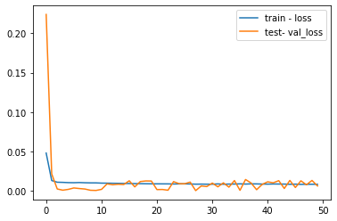


In machine learning and deep learning there are basically three cases:

1) Underfitting
This is the only case where loss > validation_loss, but only slightly, if loss is far higher than validation_loss, please post your code and data so that we can have a look at

2) Overfitting
loss << validation_loss
This means that your model is fitting very nicely the training data but not at all the validation data, in other words it's not generalizing correctly to unseen data

3) Perfect fitting
loss == validation_loss
If both values end up to be roughly the same and also if the values are converging (plot the loss over time) then chances are very high that you are doing it right


```python
# make a prediction
yhat = model.predict(test_X)
test_X = test_X.reshape((test_X.shape[0], test_X.shape[2]))
```


```python
# invert scaling for forecast
inv_yhat = concatenate((yhat, test_X[:, 1:]), axis=1)
```


```python
inv_yhat = scaler.inverse_transform(inv_yhat)
```


```python
inv_yhat = inv_yhat[:,0]
```


```python
# invert scaling for actual
test_y = test_y.reshape((len(test_y), 1))
inv_y = concatenate((test_y, test_X[:, 1:]), axis=1)
inv_y = scaler.inverse_transform(inv_y)
inv_y = inv_y[:,0]
```


```python
from math import sqrt
```


```python
# calculate RMSE
rmse = sqrt(mean_squared_error(inv_y, inv_yhat))
print('Test RMSE: %.3f' % rmse)
```

    Test RMSE: 37.242


```python

```

## Prediction


```python
%matplotlib inline
import numpy as np
import pandas as pd
import matplotlib.pyplot as plt
plt.style.use("seaborn")
```

With the model created lets take the test data provided and we try to perform a prediction with  our working model


```python
df_test = pd.read_csv("data/sag_data_test.csv", index_col="Time", parse_dates=True)
```

We want to predict the first 5 minutes of the test input


```python
print( 'Starting from ',df_test.index.min(),'  plus 5 minutes')
```

    Starting from  2015-12-21 00:00:00   plus 5 minutes


```python
df_test_5min=df_test['2015-12-21 00:00:00':'2015-12-21 00:05:00']
```


```python
#df_test_5min.plot(subplots=True, layout=(-1, 1), lw=1, figsize=(12, 6))
#plt.tight_layout()
```

In order to use our model, we have to makeup our input as the same way we used in our training datset


```python
values_test=df_test_5min.values
values_test = values_test.astype('float32')
# normalize features
scaler = MinMaxScaler(feature_range=(0, 1))
scaled_test = scaler.fit_transform(values_test)
# frame as supervised learning
reframed_test = series_to_supervised(scaled_test, 1, 1)
# drop columns we don't want to predict
reframed_test.drop(reframed_test.columns[[7,8,9,10,11]], axis=1, inplace=True)
#  test sets
values_test = reframed_test.values
window=5
# reshape input to be 3D [samples, timesteps, features]
test = values_test[:window, :]
#len(test)
test_X, test_y = test[:, :-1], test[:, -1]
test_X = test_X.reshape((test_X.shape[0], 1, test_X.shape[1]))
yhat = model.predict(test_X)
```


```python
test_X = test_X.reshape((test_X.shape[0], test_X.shape[2]))
# invert scaling for forecast
inv_yhat = concatenate((yhat, test_X[:, 1:]), axis=1)
inv_yhat = scaler.inverse_transform(inv_yhat)
inv_yhat = inv_yhat[:,0]
# invert scaling for actual
test_y = test_y.reshape((len(test_y), 1))
inv_y = concatenate((test_y, test_X[:, 1:]), axis=1)
inv_y = scaler.inverse_transform(inv_y)
inv_y = inv_y[:,0]
```


```python
y_actual = pd.DataFrame(inv_y, columns=['Bearing Pressure (kPa)'])
y_hat = pd.DataFrame(inv_yhat, columns=['Predicted Bearing Pressure (kPa)'])
plt.figure(figsize=(11, 6))
plt.plot(y_actual, linestyle='solid', color='r')
plt.plot(y_hat, linestyle='dashed', color='b')
plt.legend(['Actual','Predicted'], loc='best', prop={'size': 14})
plt.title('Bearing Pressure ', weight='bold', fontsize=16)
plt.ylabel('(kPa)', weight='bold', fontsize=14)
plt.xlabel('Minutes Set no.', weight='bold', fontsize=14)
plt.xticks(weight='bold', fontsize=12, rotation=45)
plt.yticks(weight='bold', fontsize=12)
plt.grid(color = 'y', linewidth='0.5')
plt.show()
```


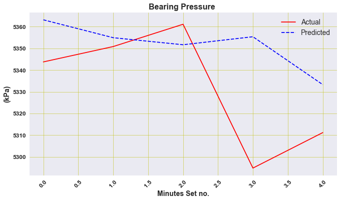


```python
# calculate RMSE
rmse = sqrt(mean_squared_error(inv_y, inv_yhat))
print('Test RMSE: %.3f' % rmse)
```

    Test RMSE: 30.454


```python
errors = inv_y-inv_yhat
```


```python
rmse = (errors**2).mean()**0.5
rmse
```


    30.454036912334175


```python
import seaborn as sns
```


```python
sns.distplot(errors, bins=5, kde=True);
```


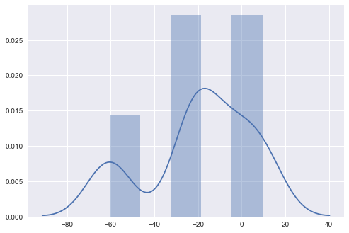


```python

```

## Section 2 PowerDraw

Due to the discussion of the correlations, we requiere simply develop a model to predict the Power Draw from the Speed input parameter

The librararies for the section 2


```python
import pandas as pd
import numpy as np
import matplotlib.pyplot as plt
%matplotlib inline

import seaborn as sns
import scipy.stats as stats
```


```python

```


```python
df_train = pd.read_csv("data/sag_data_train.csv", index_col="Time", parse_dates=True)
df = df_train.iloc[:, 1:3]
df = df.reset_index(drop=True)
```


```python
df.head()
```


<div>
<style scoped>
    .dataframe tbody tr th:only-of-type {
        vertical-align: middle;
    }


    .dataframe tbody tr th {
        vertical-align: top;
    }
    
    .dataframe thead th {
        text-align: right;
    }

</style>

<table border="1" class="dataframe">
  <thead>
    <tr style="text-align: right;">
      <th></th>
      <th>Power Draw (MW)</th>
      <th>Speed (RPM)</th>
    </tr>
  </thead>
  <tbody>
    <tr>
      <th>0</th>
      <td>11.737357</td>
      <td>7.843532</td>
    </tr>
    <tr>
      <th>1</th>
      <td>11.543755</td>
      <td>7.681607</td>
    </tr>
    <tr>
      <th>2</th>
      <td>11.169525</td>
      <td>7.514173</td>
    </tr>
    <tr>
      <th>3</th>
      <td>11.035091</td>
      <td>7.592248</td>
    </tr>
    <tr>
      <th>4</th>
      <td>11.418827</td>
      <td>7.784895</td>
    </tr>
  </tbody>
</table>

</div>


```python
dataset=df
```


```python
dataset.plot(x='Speed (RPM)', y='Power Draw (MW)', style='o')
plt.title('Speed (RPM) vs Power Draw (MW)')
plt.xlabel('Speed (RPM)')
plt.ylabel('Power Draw (MW)')
plt.show()
```


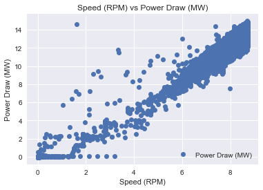


**It is interesting** it seems that there are several outliers that makes us a good model

So I define a function that removes those outliers

I will use interquartile range (IQR), to filter the outiers. In descriptive statistics, the interquartile range (IQR), also called the midspread, middle 50%, or H‑spread, is a measure of statistical dispersion, being equal to the difference between 75th and 25th percentiles, or between upper and lower quartiles.IQR = Q3 −  Q1. In other words, the IQR is the first quartile subtracted from the third quartile; these quartiles can be clearly seen on a box plot on the data. It is a trimmed estimator, defined as the 25% trimmed range, and is a commonly used robust measure of scale.
Source: Wikipedia


```python
def remove_outliers_irq(data,parameterX):
    import seaborn as sns
    Q1 = data[parameterX].quantile(0.25)
    Q3 = data[parameterX].quantile(0.75)
    IQR = Q3 - Q1    #IQR is interquartile range.
    filter = (data[parameterX] >= Q1 - 1.5 * IQR) & (data[parameterX] <= Q3 + 1.5 *IQR)
    newdf=data.loc[filter]  
    return newdf
```

Let see them the outlier in another plot


```python
sns.boxplot(x=dataset['Power Draw (MW)'])
```


    <matplotlib.axes._subplots.AxesSubplot at 0x2afdfd34ac0>


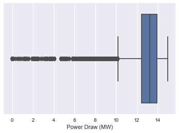


```python
sns.boxplot(x=dataset['Speed (RPM)'])
```


    <matplotlib.axes._subplots.AxesSubplot at 0x2afe179ef10>


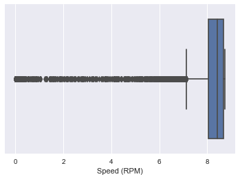


```python
data2=remove_outliers_irq(dataset,'Power Draw (MW)')
```


```python
data3=remove_outliers_irq(data2,'Speed (RPM)')
```


```python
sns.boxplot(x=data3['Power Draw (MW)'])
```


    <matplotlib.axes._subplots.AxesSubplot at 0x2afe17f14f0>


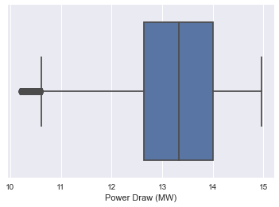


```python
sns.boxplot(x=data3['Speed (RPM)'])
```


    <matplotlib.axes._subplots.AxesSubplot at 0x2afe1cbef10>


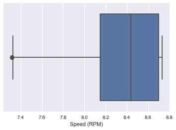


```python
data3.plot(x='Speed (RPM)', y='Power Draw (MW)', style='o')
plt.title('Speed (RPM) vs Power Draw (MW)')
plt.xlabel('Speed (RPM)')
plt.ylabel('Power Draw (MW)')
plt.show()
```


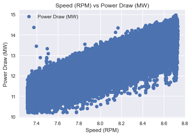


So now the data its a bit better to use develop a model

I would like use the first column as X and Y the second what I want to predict


```python
neworder = ['Speed (RPM)','Power Draw (MW)']
data3=data3.reindex(columns=neworder)
```


```python
dataset=data3
```

We check if our data its okay to use, ( to use regression we have to know that we dont have any NAN or strings, we need numeric data)


```python
dataset.isnull().any()
```


    Speed (RPM)        False
    Power Draw (MW)    False
    dtype: bool


So its **OKAY**


```python
dataset.head()
```


<div>
<style scoped>
    .dataframe tbody tr th:only-of-type {
        vertical-align: middle;
    }


    .dataframe tbody tr th {
        vertical-align: top;
    }
    
    .dataframe thead th {
        text-align: right;
    }

</style>

<table border="1" class="dataframe">
  <thead>
    <tr style="text-align: right;">
      <th></th>
      <th>Speed (RPM)</th>
      <th>Power Draw (MW)</th>
    </tr>
  </thead>
  <tbody>
    <tr>
      <th>0</th>
      <td>7.843532</td>
      <td>11.737357</td>
    </tr>
    <tr>
      <th>1</th>
      <td>7.681607</td>
      <td>11.543755</td>
    </tr>
    <tr>
      <th>2</th>
      <td>7.514173</td>
      <td>11.169525</td>
    </tr>
    <tr>
      <th>3</th>
      <td>7.592248</td>
      <td>11.035091</td>
    </tr>
    <tr>
      <th>4</th>
      <td>7.784895</td>
      <td>11.418827</td>
    </tr>
  </tbody>
</table>

</div>


## FITTING PROCEDURE

I need take the numbers from the dataset


```python
X = dataset.iloc[:, :-1].values
y = dataset.iloc[:, 1].values
```

We use the  sklearn to create the model of LinearRegression


```python
from sklearn.model_selection import train_test_split
X_train, X_test, y_train, y_test = train_test_split(X, y, test_size=0.2, random_state=0)
```


```python
from sklearn.linear_model import LinearRegression
regressor = LinearRegression()
regressor.fit(X_train, y_train)
```


    LinearRegression()


Finally I got the the model


```python
y_pred = regressor.predict(X_test)
```


```python
from sklearn import metrics
print('Mean Absolute Error:', metrics.mean_absolute_error(y_test, y_pred))
print('Mean Squared Error:', metrics.mean_squared_error(y_test, y_pred))
print('Root Mean Squared Error:', np.sqrt(metrics.mean_squared_error(y_test, y_pred)))
```

    Mean Absolute Error: 0.36206541600380093
    Mean Squared Error: 0.2078778493453066
    Root Mean Squared Error: 0.45593623385875637


## Prediction

I repeat the same procedure used for the first section


```python
df_test = pd.read_csv("data/sag_data_test.csv", index_col="Time", parse_dates=True)
df_test_5min=df_test['2015-12-21 00:00:00':'2015-12-21 00:05:00']
dframe=df_test_5min.iloc[1:]
actual_power=dframe['Power Draw (MW)'].values # this  has shape (XXX, ) - It's 1D
input_Speed=dframe['Speed (RPM)'].values.reshape(-1,1) # this  has shape (XXX, 1) - it's 2D
```

I perform the prediction


```python
PowerDraw_prediction = regressor.predict(input_Speed)
y_hat2 = pd.DataFrame(PowerDraw_prediction, columns=['Predicted Power Draw (MW)']) # I create the dataframe of the prediction
```


```python
plt.figure(figsize=(11, 6))
plt.plot(actual_power, linestyle='solid', color='r')
plt.plot(y_hat2, linestyle='dashed', color='b')
plt.legend(['Actual','Predicted'], loc='best', prop={'size': 14})
plt.title('Predicted Power Draw  ', weight='bold', fontsize=16)
plt.ylabel('(MW)', weight='bold', fontsize=14)
plt.xlabel('Minutes Set no.', weight='bold', fontsize=14)
plt.xticks(weight='bold', fontsize=12, rotation=45)
plt.yticks(weight='bold', fontsize=12)
plt.grid(color = 'y', linewidth='0.5')
plt.show()
```


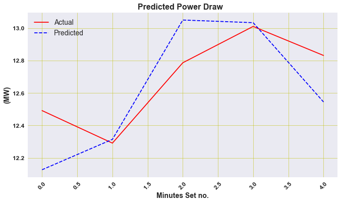


```python
from math import sqrt
from sklearn.metrics import mean_squared_error
# calculate RMSE
rmse = sqrt(mean_squared_error(actual_power, y_hat2))
print('Test RMSE: %.3f' % rmse)
```

    Test RMSE: 0.239


```python
pred_power=y_hat2['Predicted Power Draw (MW)'].values
errors2 = actual_power -  pred_power
rmse = (errors2**2).mean()**0.5
rmse
```


    0.23905494524804163


```python
sns.distplot(errors2, bins=6, kde=True);
```


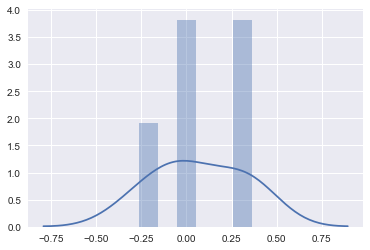


## Conclusion

We have developed two models, one for the prediction of  **Bearing Pressure**  and another **Power Draw** 
For the  Bearing Pressure  we have used as a model a **neural network LSTM** and for Power **Draw LinearRegresor**


For the first five minutes we create a dataframe called result


```python
dframe=df_test_5min.iloc[1:]
```


```python
result = pd.concat([ y_hat,y_hat2,dframe.reset_index()], axis=1, sort=False)
```


```python
result.set_index('Time', inplace=True)
```


```python
result
```


<div>
<style scoped>
    .dataframe tbody tr th:only-of-type {
        vertical-align: middle;
    }


    .dataframe tbody tr th {
        vertical-align: top;
    }
    
    .dataframe thead th {
        text-align: right;
    }

</style>

<table border="1" class="dataframe">
  <thead>
    <tr style="text-align: right;">
      <th></th>
      <th>Predicted Bearing Pressure (kPa)</th>
      <th>Predicted Power Draw (MW)</th>
      <th>Bearing Pressure (kPa)</th>
      <th>Power Draw (MW)</th>
      <th>Speed (RPM)</th>
      <th>Dilution Flow Rate (m3/h)</th>
      <th>Conveyor Belt Feed Rate (t/h)</th>
      <th>Conveyor Belt PSD Fines (%)</th>
    </tr>
    <tr>
      <th>Time</th>
      <th></th>
      <th></th>
      <th></th>
      <th></th>
      <th></th>
      <th></th>
      <th></th>
      <th></th>
    </tr>
  </thead>
  <tbody>
    <tr>
      <th>2015-12-21 00:01:00</th>
      <td>5363.178223</td>
      <td>12.126732</td>
      <td>5343.775163</td>
      <td>12.491533</td>
      <td>7.889129</td>
      <td>1057.823776</td>
      <td>3042.468414</td>
      <td>44.751640</td>
    </tr>
    <tr>
      <th>2015-12-21 00:02:00</th>
      <td>5354.933594</td>
      <td>12.314203</td>
      <td>5350.858199</td>
      <td>12.290888</td>
      <td>7.970280</td>
      <td>1036.836364</td>
      <td>2959.495635</td>
      <td>42.130604</td>
    </tr>
    <tr>
      <th>2015-12-21 00:03:00</th>
      <td>5351.686035</td>
      <td>13.049788</td>
      <td>5361.138694</td>
      <td>12.786268</td>
      <td>8.288696</td>
      <td>1054.944698</td>
      <td>2994.353878</td>
      <td>38.415417</td>
    </tr>
    <tr>
      <th>2015-12-21 00:04:00</th>
      <td>5355.383789</td>
      <td>13.033396</td>
      <td>5294.834751</td>
      <td>13.010269</td>
      <td>8.281600</td>
      <td>1084.639678</td>
      <td>2951.411343</td>
      <td>45.020363</td>
    </tr>
    <tr>
      <th>2015-12-21 00:05:00</th>
      <td>5333.299805</td>
      <td>12.544739</td>
      <td>5311.194279</td>
      <td>12.831332</td>
      <td>8.070073</td>
      <td>1078.903247</td>
      <td>2995.219207</td>
      <td>40.796616</td>
    </tr>
  </tbody>
</table>

</div>


```python
result .plot(subplots=True, layout=(-1, 1), lw=1, figsize=(12, 6))
plt.tight_layout()
```

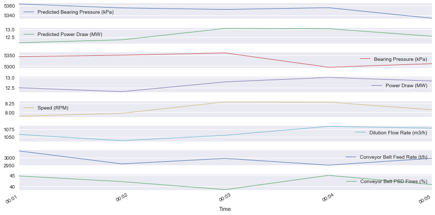


**Congratulations!**  we could develop a forecast by using neural networks LSTM .