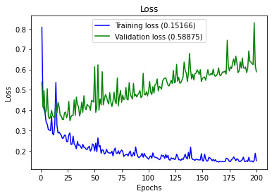
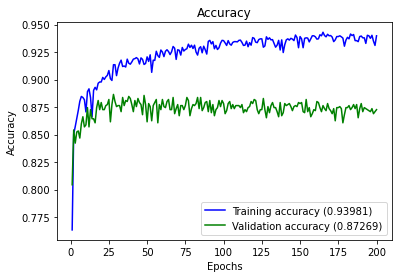
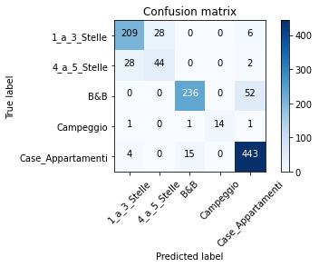

# Multiclass Classification 

by Ruslan Magana Vsevolodovna

Genova November 2020


In this project we are going to classify the accommodations given by some features collected in one dataset.
The target is the classification of the following types of accommodations:

1. Hotel 1-3 stars
2. Hotel 4+ stars
3. Bed & Breakfast
4. Campsites
5. Houses / apartments

The dataset of the accommodations can downloaded from [Github](https://github.com/ruslanmv/Multi-classifcation-Accomodations/blob/main/classification_dataset.csv)


### 1. Libraries


```python
import pandas as pd
```


```python
import numpy as np
import matplotlib.pyplot as plt
import itertools
from sklearn import datasets
from sklearn.preprocessing import LabelEncoder
from sklearn.model_selection import train_test_split, KFold, GridSearchCV
from sklearn.metrics import confusion_matrix, classification_report, accuracy_score
from keras.models import Sequential
from keras.layers import Dense
from keras.utils import to_categorical
from keras.wrappers.scikit_learn import KerasClassifier
```


### 2. Data Wrangling


```python
df=pd.read_csv ('classification_dataset.csv',sep = '\t', )
```

Replace NaN Values with Zeros in Pandas DataFrame
For an entire DataFrame using Pandas:


```python
df=df.fillna(0)
```


```python
df.head()
```


<div>
<style scoped>
    .dataframe tbody tr th:only-of-type {
        vertical-align: middle;
    }


    .dataframe tbody tr th {
        vertical-align: top;
    }
    
    .dataframe thead th {
        text-align: right;
    }

</style>

<table border="1" class="dataframe">
  <thead>
    <tr style="text-align: right;">
      <th></th>
      <th>ID</th>
      <th>PROVINCIA</th>
      <th>COMUNE</th>
      <th>LOCALITA</th>
      <th>CAMERE</th>
      <th>SUITE</th>
      <th>LETTI</th>
      <th>BAGNI</th>
      <th>PRIMA_COLAZIONE</th>
      <th>IN_ABITATO</th>
      <th>...</th>
      <th>ZONA_PERIFERICA</th>
      <th>ZONA_STAZIONE_FS</th>
      <th>ATTREZZATURE_VARIE</th>
      <th>CARTE_ACCETTATE</th>
      <th>LINGUE_PARLATE</th>
      <th>SPORT</th>
      <th>CONGRESSI</th>
      <th>LATITUDINE</th>
      <th>LONGITUDINE</th>
      <th>OUTPUT</th>
    </tr>
  </thead>
  <tbody>
    <tr>
      <th>0</th>
      <td>0</td>
      <td>BS</td>
      <td>PERTICA BASSA</td>
      <td>0</td>
      <td>2</td>
      <td>0</td>
      <td>4</td>
      <td>1</td>
      <td>0</td>
      <td>0.0</td>
      <td>...</td>
      <td>0.0</td>
      <td>0.0</td>
      <td>0</td>
      <td>0</td>
      <td>0</td>
      <td>0</td>
      <td>0</td>
      <td>10.373501</td>
      <td>45.751381</td>
      <td>B&amp;B</td>
    </tr>
    <tr>
      <th>1</th>
      <td>1</td>
      <td>BS</td>
      <td>DESENZANO DEL GARDA</td>
      <td>0</td>
      <td>4</td>
      <td>0</td>
      <td>8</td>
      <td>4</td>
      <td>0</td>
      <td>0.0</td>
      <td>...</td>
      <td>0.0</td>
      <td>0.0</td>
      <td>0</td>
      <td>0</td>
      <td>0</td>
      <td>0</td>
      <td>0</td>
      <td>10.538947</td>
      <td>45.469485</td>
      <td>B&amp;B</td>
    </tr>
    <tr>
      <th>2</th>
      <td>2</td>
      <td>BG</td>
      <td>BERGAMO</td>
      <td>0</td>
      <td>1</td>
      <td>0</td>
      <td>2</td>
      <td>1</td>
      <td>0</td>
      <td>0.0</td>
      <td>...</td>
      <td>0.0</td>
      <td>0.0</td>
      <td>Accettazione animali domestici</td>
      <td>0</td>
      <td>0</td>
      <td>0</td>
      <td>0</td>
      <td>9.665355</td>
      <td>45.704158</td>
      <td>Case_Appartamenti</td>
    </tr>
    <tr>
      <th>3</th>
      <td>3</td>
      <td>MN</td>
      <td>MANTOVA</td>
      <td>BOCCABUSA</td>
      <td>93</td>
      <td>2</td>
      <td>194</td>
      <td>96</td>
      <td>0</td>
      <td>0.0</td>
      <td>...</td>
      <td>0.0</td>
      <td>0.0</td>
      <td>Ascensore,Ristorante,Bar,Accettazione animali ...</td>
      <td>American express,Visa,Master Card,Diners,Maest...</td>
      <td>Inglese,Francese,Spagnolo,Tedesco,Rumeno,Serbo...</td>
      <td>0</td>
      <td>Numero sale congressi 3,Congressi capacita' Mi...</td>
      <td>10.828175</td>
      <td>45.165506</td>
      <td>4_a_5_Stelle</td>
    </tr>
    <tr>
      <th>4</th>
      <td>4</td>
      <td>MI</td>
      <td>MILANO</td>
      <td>0</td>
      <td>2</td>
      <td>0</td>
      <td>4</td>
      <td>1</td>
      <td>0</td>
      <td>0.0</td>
      <td>...</td>
      <td>0.0</td>
      <td>0.0</td>
      <td>0</td>
      <td>0</td>
      <td>0</td>
      <td>0</td>
      <td>0</td>
      <td>9.151637</td>
      <td>45.457177</td>
      <td>Case_Appartamenti</td>
    </tr>
  </tbody>
</table>
<p>5 rows × 25 columns</p>

</div>


There are some features that do not gives important information:
Such as: ID, LOCALITA, LATITUDINE	 LONGITUDINE


```python
del df['ID']
del df['LOCALITA']
del df['LATITUDINE']
del df['LONGITUDINE']
del df['PROVINCIA']
del df['COMUNE']
```


```python
dfa=df
```

One-hot Encoding is a type of vector representation in which all of the elements in a vector are 0, except for one, which has 1 as its value, where 1 represents a boolean specifying a category of the element.


```python
new_df = pd.concat([dfa.drop('ATTREZZATURE_VARIE', 1), dfa['ATTREZZATURE_VARIE'].str.get_dummies(sep=",")], 1)
new_df2 = pd.concat([new_df.drop('CARTE_ACCETTATE', 1), new_df['CARTE_ACCETTATE'].str.get_dummies(sep=",")], 1)
new_df3 = pd.concat([new_df2.drop('LINGUE_PARLATE', 1), new_df2['LINGUE_PARLATE'].str.get_dummies(sep=",")], 1)
new_df4 = pd.concat([new_df3.drop('SPORT', 1), new_df3['SPORT'].str.get_dummies(sep=",")], 1)
new_df5 = pd.concat([new_df4.drop('CONGRESSI', 1), new_df4['CONGRESSI'].str.get_dummies(sep=",")], 1)

```


```python
new_df5.describe()
```


<div>
<style scoped>
    .dataframe tbody tr th:only-of-type {
        vertical-align: middle;
    }


    .dataframe tbody tr th {
        vertical-align: top;
    }
    
    .dataframe thead th {
        text-align: right;
    }

</style>

<table border="1" class="dataframe">
  <thead>
    <tr style="text-align: right;">
      <th></th>
      <th>CAMERE</th>
      <th>SUITE</th>
      <th>LETTI</th>
      <th>BAGNI</th>
      <th>PRIMA_COLAZIONE</th>
      <th>IN_ABITATO</th>
      <th>SUL_LAGO</th>
      <th>VICINO_ELIPORTO</th>
      <th>VICINO_AEREOPORTO</th>
      <th>ZONA_CENTRALE</th>
      <th>...</th>
      <th>Numero sale congressi 17</th>
      <th>Numero sale congressi 2</th>
      <th>Numero sale congressi 21</th>
      <th>Numero sale congressi 3</th>
      <th>Numero sale congressi 4</th>
      <th>Numero sale congressi 5</th>
      <th>Numero sale congressi 6</th>
      <th>Numero sale congressi 7</th>
      <th>Numero sale congressi 8</th>
      <th>Numero sale congressi 9</th>
    </tr>
  </thead>
  <tbody>
    <tr>
      <th>count</th>
      <td>6775.000000</td>
      <td>6775.000000</td>
      <td>6775.000000</td>
      <td>6775.000000</td>
      <td>6775.000000</td>
      <td>6775.000000</td>
      <td>6775.000000</td>
      <td>6775.000000</td>
      <td>6775.000000</td>
      <td>6775.000000</td>
      <td>...</td>
      <td>6775.000000</td>
      <td>6775.000000</td>
      <td>6775.000000</td>
      <td>6775.000000</td>
      <td>6775.00000</td>
      <td>6775.000000</td>
      <td>6775.000000</td>
      <td>6775.000000</td>
      <td>6775.000000</td>
      <td>6775.000000</td>
    </tr>
    <tr>
      <th>mean</th>
      <td>16.261550</td>
      <td>0.455646</td>
      <td>35.002509</td>
      <td>13.620517</td>
      <td>0.101402</td>
      <td>0.083542</td>
      <td>0.052546</td>
      <td>0.000590</td>
      <td>0.027897</td>
      <td>0.099041</td>
      <td>...</td>
      <td>0.000295</td>
      <td>0.008413</td>
      <td>0.000148</td>
      <td>0.004428</td>
      <td>0.00428</td>
      <td>0.001624</td>
      <td>0.001328</td>
      <td>0.001181</td>
      <td>0.000886</td>
      <td>0.000738</td>
    </tr>
    <tr>
      <th>std</th>
      <td>35.859435</td>
      <td>3.592147</td>
      <td>93.538492</td>
      <td>29.174499</td>
      <td>0.301883</td>
      <td>0.276721</td>
      <td>0.223142</td>
      <td>0.024293</td>
      <td>0.164689</td>
      <td>0.298739</td>
      <td>...</td>
      <td>0.017180</td>
      <td>0.091344</td>
      <td>0.012149</td>
      <td>0.066401</td>
      <td>0.06529</td>
      <td>0.040264</td>
      <td>0.036426</td>
      <td>0.034345</td>
      <td>0.029748</td>
      <td>0.027158</td>
    </tr>
    <tr>
      <th>min</th>
      <td>0.000000</td>
      <td>0.000000</td>
      <td>0.000000</td>
      <td>0.000000</td>
      <td>0.000000</td>
      <td>0.000000</td>
      <td>0.000000</td>
      <td>0.000000</td>
      <td>0.000000</td>
      <td>0.000000</td>
      <td>...</td>
      <td>0.000000</td>
      <td>0.000000</td>
      <td>0.000000</td>
      <td>0.000000</td>
      <td>0.00000</td>
      <td>0.000000</td>
      <td>0.000000</td>
      <td>0.000000</td>
      <td>0.000000</td>
      <td>0.000000</td>
    </tr>
    <tr>
      <th>25%</th>
      <td>2.000000</td>
      <td>0.000000</td>
      <td>4.000000</td>
      <td>1.000000</td>
      <td>0.000000</td>
      <td>0.000000</td>
      <td>0.000000</td>
      <td>0.000000</td>
      <td>0.000000</td>
      <td>0.000000</td>
      <td>...</td>
      <td>0.000000</td>
      <td>0.000000</td>
      <td>0.000000</td>
      <td>0.000000</td>
      <td>0.00000</td>
      <td>0.000000</td>
      <td>0.000000</td>
      <td>0.000000</td>
      <td>0.000000</td>
      <td>0.000000</td>
    </tr>
    <tr>
      <th>50%</th>
      <td>4.000000</td>
      <td>0.000000</td>
      <td>8.000000</td>
      <td>3.000000</td>
      <td>0.000000</td>
      <td>0.000000</td>
      <td>0.000000</td>
      <td>0.000000</td>
      <td>0.000000</td>
      <td>0.000000</td>
      <td>...</td>
      <td>0.000000</td>
      <td>0.000000</td>
      <td>0.000000</td>
      <td>0.000000</td>
      <td>0.00000</td>
      <td>0.000000</td>
      <td>0.000000</td>
      <td>0.000000</td>
      <td>0.000000</td>
      <td>0.000000</td>
    </tr>
    <tr>
      <th>75%</th>
      <td>14.000000</td>
      <td>0.000000</td>
      <td>25.000000</td>
      <td>12.000000</td>
      <td>0.000000</td>
      <td>0.000000</td>
      <td>0.000000</td>
      <td>0.000000</td>
      <td>0.000000</td>
      <td>0.000000</td>
      <td>...</td>
      <td>0.000000</td>
      <td>0.000000</td>
      <td>0.000000</td>
      <td>0.000000</td>
      <td>0.00000</td>
      <td>0.000000</td>
      <td>0.000000</td>
      <td>0.000000</td>
      <td>0.000000</td>
      <td>0.000000</td>
    </tr>
    <tr>
      <th>max</th>
      <td>528.000000</td>
      <td>110.000000</td>
      <td>1816.000000</td>
      <td>448.000000</td>
      <td>1.000000</td>
      <td>1.000000</td>
      <td>1.000000</td>
      <td>1.000000</td>
      <td>1.000000</td>
      <td>1.000000</td>
      <td>...</td>
      <td>1.000000</td>
      <td>1.000000</td>
      <td>1.000000</td>
      <td>1.000000</td>
      <td>1.00000</td>
      <td>1.000000</td>
      <td>1.000000</td>
      <td>1.000000</td>
      <td>1.000000</td>
      <td>1.000000</td>
    </tr>
  </tbody>
</table>
<p>8 rows × 308 columns</p>

</div>


Encode The Output Variable The output variable contains different string values.

When modeling multi-class classification problems using neural networks, it is good practice to reshape the output attribute from a vector that contains values for each class value to be a matrix with a boolean for each class value and whether or not a given instance has that class value or not.


```python
new_df6 = pd.concat([new_df5.drop('OUTPUT', 1), new_df5['OUTPUT'].str.get_dummies(sep=",")], 1)
```


```python
new_df6.dtypes
```


    CAMERE               int64
    SUITE                int64
    LETTI                int64
    BAGNI                int64
    PRIMA_COLAZIONE      int64
                         ...  
    1_a_3_Stelle         int64
    4_a_5_Stelle         int64
    B&B                  int64
    Campeggio            int64
    Case_Appartamenti    int64
    Length: 313, dtype: object


We have now all our fetures numeric we can use it.

We have several fetures. we can **REDUCE** the dimensions by using Principal Component Analysis ( **PCA** )but for lack of time, we just show the standard procedure to classify with the current status of the dataset.

## 3. MODEL CREATION


```python
dataset=new_df6.to_numpy()
```


```python
X = dataset[:,0:308].astype(float)
```


```python
len(X)
```


    6775


```python
Y = dataset[:,308:]
```


```python
len(Y)
```


    6775


The Keras library provides wrapper classes to allow you to use neural network models developed with Keras in scikit-learn.

There is a KerasClassifier class in Keras that can be used as an Estimator in scikit-learn, the base type of model in the library. The KerasClassifier takes the name of a function as an argument. This function must return the constructed neural network model, ready for training.

Below is a function that will create a baseline neural network for the Accommodation classification problem. 
It creates a simple fully connected network with one hidden layer that contains 616 neurons.

The hidden layer uses a rectifier activation function which is a good practice. Because we used a one-hot encoding for our  dataset, the output layer must create 5 output values, one for each class. The output value with the largest value will be taken as the class predicted by the model.

The network topology of this simple one-layer neural network can be summarized as:

308 inputs -> [616 hidden nodes] -> 5 outputs

Note that we use a “softmax” activation function in the output layer. This is to ensure the output values are in the range of 0 and 1 and may be used as predicted probabilities.

Finally, the network uses the efficient Adam gradient descent optimization algorithm with a logarithmic loss function, which is called “categorical_crossentropy” in Keras.


```python
seed = 7
```


```python
x_train, x_test, y_train, y_test = train_test_split(X, Y, train_size=0.8, random_state=seed)
```


```python
x_train, x_val, y_train, y_val = train_test_split(x_train, y_train, train_size=0.8, random_state=seed)
```

The hyperparameteres were computed in the optional section by using GridCSV

Best: 0.880295 using {'batch_size': 80, 'epochs': 200}


```python
model = Sequential()
model.add(Dense(616,activation='relu',input_shape = (308,)))
model.add(Dense(5,activation='softmax'))
model.compile(optimizer = 'adam',
             loss='categorical_crossentropy',
             metrics=['accuracy'])

```


```python
history = model.fit(x_train, 
                    y_train,
                    epochs = 200,
                    batch_size = 80,
                    verbose=0,
                    validation_data=(x_val,y_val))
```

## 4. RESULTS

We define some programs to visualize the results
Plot History : plot loss and accuracy from the history 
Full Report : print a full report and plot a confusion matrix 


```python
def plot_history(history):
    loss_list = [s for s in history.history.keys() if 'loss' in s and 'val' not in s]
    val_loss_list = [s for s in history.history.keys() if 'loss' in s and 'val' in s]
    acc_list = [s for s in history.history.keys() if 'acc' in s and 'val' not in s]
    val_acc_list = [s for s in history.history.keys() if 'acc' in s and 'val' in s]
    
    if len(loss_list) == 0:
        print('Loss is missing in history')
        return 
    
    ## As loss always exists
    epochs = range(1,len(history.history[loss_list[0]]) + 1)
    
    ## Loss
    plt.figure(1)
    for l in loss_list:
        plt.plot(epochs, history.history[l], 'b', label='Training loss (' + str(str(format(history.history[l][-1],'.5f'))+')'))
    for l in val_loss_list:
        plt.plot(epochs, history.history[l], 'g', label='Validation loss (' + str(str(format(history.history[l][-1],'.5f'))+')'))
    
    plt.title('Loss')
    plt.xlabel('Epochs')
    plt.ylabel('Loss')
    plt.legend()
    
    ## Accuracy
    plt.figure(2)
    for l in acc_list:
        plt.plot(epochs, history.history[l], 'b', label='Training accuracy (' + str(format(history.history[l][-1],'.5f'))+')')
    for l in val_acc_list:    
        plt.plot(epochs, history.history[l], 'g', label='Validation accuracy (' + str(format(history.history[l][-1],'.5f'))+')')

    plt.title('Accuracy')
    plt.xlabel('Epochs')
    plt.ylabel('Accuracy')
    plt.legend()
    plt.show()
```


```python
def plot_confusion_matrix(cm, classes,
                          normalize=False,
                          cmap=plt.cm.Blues):
    """
    This function prints and plots the confusion matrix.
    Normalization can be applied by setting `normalize=True`.
    """
    if normalize:
        cm = cm.astype('float') / cm.sum(axis=1)[:, np.newaxis]
        title='Normalized confusion matrix'
    else:
        title='Confusion matrix'

    plt.imshow(cm, interpolation='nearest', cmap=cmap)
    plt.title(title)
    plt.colorbar()
    tick_marks = np.arange(len(classes))
    plt.xticks(tick_marks, classes, rotation=45)
    plt.yticks(tick_marks, classes)

    fmt = '.2f' if normalize else 'd'
    thresh = cm.max() / 2.
    for i, j in itertools.product(range(cm.shape[0]), range(cm.shape[1])):
        plt.text(j, i, format(cm[i, j], fmt),
                 horizontalalignment="center",
                 color="white" if cm[i, j] > thresh else "black")

    plt.tight_layout()
    plt.ylabel('True label')
    plt.xlabel('Predicted label')
    plt.show()
    
## multiclass or binary report
## If binary (sigmoid output), set binary parameter to True
def full_multiclass_report(model,
                           x,
                           y_true,
                           classes,
                           batch_size=32,
                           binary=False):

    # 1. Transform one-hot encoded y_true into their class number
    if not binary:
        y_true = np.argmax(y_true,axis=1)
    
    # 2. Predict classes and stores in y_pred
    y_pred = model.predict_classes(x, batch_size=batch_size)
    
    # 3. Print accuracy score
    print("Accuracy : "+ str(accuracy_score(y_true,y_pred)))
    
    print("")
    
    # 4. Print classification report
    print("Classification Report")
    print(classification_report(y_true,y_pred,digits=5))    
    
    # 5. Plot confusion matrix
    cnf_matrix = confusion_matrix(y_true,y_pred)
    print(cnf_matrix)
    plot_confusion_matrix(cnf_matrix,classes=classes)
```

###  Results 


```python
plot_history(history)
```








```python
labels=list(new_df6.columns)[308:] 
```


```python
labels
```


    ['1_a_3_Stelle', '4_a_5_Stelle', 'B&B', 'Campeggio', 'Case_Appartamenti']


```python
full_multiclass_report(model,
                       x_val,
                       y_val,
                       labels
                      )
```

    WARNING:tensorflow:From <ipython-input-30-3b4d949a528c>:47: Sequential.predict_classes (from tensorflow.python.keras.engine.sequential) is deprecated and will be removed after 2021-01-01.
    Instructions for updating:
    Please use instead:* `np.argmax(model.predict(x), axis=-1)`,   if your model does multi-class classification   (e.g. if it uses a `softmax` last-layer activation).* `(model.predict(x) > 0.5).astype("int32")`,   if your model does binary classification   (e.g. if it uses a `sigmoid` last-layer activation).
    Accuracy : 0.8726937269372693
    
    Classification Report
                  precision    recall  f1-score   support
    
               0    0.86364   0.86008   0.86186       243
               1    0.61111   0.59459   0.60274        74
               2    0.93651   0.81944   0.87407       288
               3    1.00000   0.82353   0.90323        17
               4    0.87897   0.95887   0.91718       462
    
        accuracy                        0.87269      1084
       macro avg    0.85804   0.81131   0.83182      1084
    weighted avg    0.87443   0.87269   0.87164      1084
    
    [[209  28   0   0   6]
     [ 28  44   0   0   2]
     [  0   0 236   0  52]
     [  1   0   1  14   1]
     [  4   0  15   0 443]]





## Additional comments

The results can be improved by using PCA and a Grid Search.
GridSearchCV resolve the issue relative to the multiclass models when using custom scoring, find the best hyperparameters.


```python
from keras.models import Sequential
from keras.layers import Dense
from keras.utils import np_utils
from keras.wrappers.scikit_learn import KerasClassifier
import numpy
import pandas as pd
from sklearn.preprocessing import LabelEncoder
from sklearn.model_selection import GridSearchCV
```


```python
def create_model():
    # create model
    model = Sequential()
    model.add(Dense(2*308, input_dim=308, activation='relu'))
    model.add(Dense(5, activation='softmax'))
    # Compile model
    model.compile(loss='categorical_crossentropy', optimizer='adam', metrics=['accuracy'])
    return model

```


```python
# fix random seed for reproducibility
seed = 7
numpy.random.seed(seed)
```


```python
# create model
model = KerasClassifier(build_fn=create_model, verbose=0)
# define the grid search parameters
batch_size = [5, 10, 20, 40, 60, 80, 100]
epochs = [10, 50, 100, 200]
param_grid = dict(batch_size=batch_size, epochs=epochs)
grid = GridSearchCV(estimator=model, param_grid=param_grid, n_jobs=1)
```


```python
from sklearn.utils import shuffle
```


```python
X, Y = shuffle(X, Y)
```


```python
grid_result = grid.fit(X, Y)
```


```python
# summarize results
print("Best: %f using %s" % (grid_result.best_score_, grid_result.best_params_))
means = grid_result.cv_results_['mean_test_score']
stds = grid_result.cv_results_['std_test_score']
params = grid_result.cv_results_['params']
for mean, stdev, param in zip(means, stds, params):
    print("%f (%f) with: %r" % (mean, stdev, param))
```

Best: 0.880295 using {'batch_size': 80, 'epochs': 200}

which are the hyperparameters used before.


**Congratulations!**  we classified with Neural Network the different types of accommodations.

