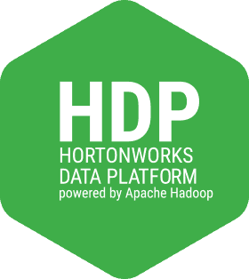
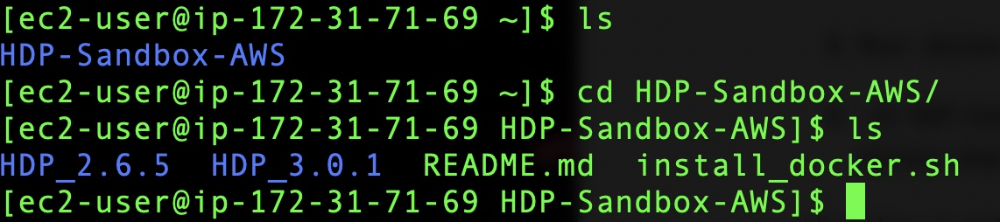

In this tutorial, we will install  the Hortonworks Data Platform (HDP)  HDP 3.0.1/ HDP2.6.5 Sandbox Through Docker on AWS on an single node EC2 Instance. 

Apache Hadoop is a layered structure to process and store massive amounts of data. In our case, Apache Hadoop will be recognized as an enterprise solution in the form of HDP. At the base of HDP exists our data storage environment known as the Hadoop Distributed File System. When data files are accessed by Hive, Pig or another coding language, YARN is the Data Operating System that enables them to analyze, manipulate or process that data. HDP includes various components that open new opportunities and efficiencies in healthcare, finance, insurance and other industries that impact people.

## Steps
1.Login in to the AWS Console and search the EC2 (Virtual Server in the Cloud) services and we launch a service.

[https://aws.amazon.com/it/console/](https://aws.amazon.com/it/console/)

2.Boot an EC2 instance with Amazon Linux 2 AMI:

- Use >= 16GB of RAM (t2.xlarge or above).

   

3.We keep the default settings

- Add >=20GB storage.

4 For the **HDP 3.0.1** we require more than 30 GB storage

5 We addd key tags  key `Name` an value `Hadoop`

- Configure security Group: Add rule for [Type=All TCP, Source=My IP]. 
   It is important to restrict access only to your IP. 

6 We choose our key pair or create new one.

- Keep note the key pair you are using for the EC2 instance.
- Note down the public ip of this instance. 
  This is the IP address you are going to use to access HDP services and web UIs.

7 After the EC2 instance is up and running, select the instance, click `Connect`, select
Specify the path to your key-pair file and connect.  I used to connect via ssh on the terminal.

8 Enter to the EC2 instance via ssh and install git with `sudo yum install -y git`. 

9 Check out the scripts with `git clone https://github.com/ruslanmv/HDP-Sandbox-AWS.git`,
and then `cd HDP-Sandbox-AWS`.

  Enter to the HDP-Sanbox-AWS folder

  

10 Install docker on the EC2 instance with `bash install_docker.sh`. Logout the SSH client and login again 

11 Run `docker info` to confirm docker is working without `sudo`.

####  HDP Installation

12 In the GitHub repository of the installation, that I have here

https://github.com/ruslanmv/HDP-Sandbox-AWS

There are two HDP versions 3.0.1,  and 2.6.5  that we can install on AWS Cloud.

You should choose one, in this tutorial I selected the  2.6.5 because Hive View is not present in HDP 3.0.1 or Ambari 2.7.

a) HDP 3.0.1

 `cd HDP-Sandbox-AWS/HDP_3.0.1` 

Install HDP through docker with `bash docker-deploy-hdp30.sh`.

b) HDP 2.6.5 

 `cd HDP-Sandbox-AWS/HDP_2.6.5` 
Install HDP through docker with `bash docker-deploy-hdp265.sh`. 

 It will take a while to install.

The advantage of the HDP 2.6.5 is that you have Hive View 

When it is finished you will have the following screen

You can check  with the command `docker ps` to see if is running

14 After it finishes, access Ambari through `http://your-ec2-public-ip:8080/` to confirm it is working.

You can see the ip4 public ip and paste it on the web browser

by default the credentials are:

Username  : **maria_dev**

Password: **maria_dev**

Just after  deployed the server the services are starting 

and after few minutes the services should be ready ( something like 7 minutes)

Great finally  is running our server on the AWS Cloud with HDP.

## Hive View 

Just as an example let us  visualize a dataset in Hive

We want to use a datset from the GroupLens which has collected and made available rating data sets from the MovieLens web site ([http://movielens.org](http://movielens.org/)). The data sets were collected over various periods of time, depending on the size of the set.  Just a test we will use the MovieLens 100K movie ratings. Stable benchmark dataset. 100,000 ratings from 1000 users on 1700 movies. Released 4/1998

.[http://files.grouplens.org/datasets/movielens/ml-100k.zip](http://files.grouplens.org/datasets/movielens/ml-100k.zip)

We can extract the all the files of the zip file.

There are two files that we will use, u.data nd u.item

The next step is  open Hive View

We prooceed to upload file from local, 

We specify we click on  settings for the file type and  we choose the Field Delimitar `TAB`

and we select the file `u.data`

And we rename the columns and table name

u  : `ratings`

column1 : `user_id`

column2: `movie_id`

column3: `rating`

column4: `rating_time`

and we click upload table

Now we repeat the same procedure, we click on  settings for the file type and we choose the filed delimiter

and now we choose the file `u.item`

and  rename the columns and table name

u  : `movies_names`

column1 : `movie_id`

column2: `name`

and we upload the table

### Query in Hive

After the tables are uploaded we can open the query editor and execute the following SQL command and execute it.

### Data Visualisation

In addition we can visualize the data easily , we choose the x, y vaiables the columns that we want to visualize.

Great now, we are able to plot features of a dataset by using Hive.

**Important** , after use the aws instance, if you wont use the server,please terminate the instance to avoid charges.

## HDP Sandbox Port Forwards

- 2122  ->  22      HostSSH
- 2200  ->  22      HostSSH2
- 2222  ->  2222    DockerSSH
- 7777  ->  7777    Streaming Analytics Manager
- 8585  ->  8585    Streams Messaging Manager
- 7788  ->  7788    Schema Registry
- 8000  ->  8000    Storm Logviewer
- 9995  ->  9995    Zeppelin1
- 9996  ->  9996    Zeppelin2
- 9088  ->  9088    NiFi Protocol
- 61080 ->  61080   NiFi Registry
- 8886  ->  8886    AmbariInfra
- 61888 ->  61888   Log Search
- 10500 ->  10500   HS2v2
- 4040  ->  4040    Spark
- 4200  ->  4200    AmbariShell
- 8983  ->  8983    SolrAdmin
- 42080 ->  80      Apache
- 42111 ->  42111   nfs
- 8020  ->  8020    HDFS
- 8040  ->  8040    nodemanager
- 8032  ->  8032    RM
- 8080  ->  8080    ambari
- 8443  ->  8443    Knox
- 8744  ->  8744    StormUI
- 1080  ->  1080    Splash Page
- 8993  ->  8993    Solr
- 10000 ->  10000   HS2
- 10001 ->  10001   HS2Http
- 10002 ->  10002   HiveJDBCJar
- 30800 ->  30800   DAS
- 11000 ->  11000   Oozie
- 15000 ->  15000   Falcon
- 19888 ->  19888   JobHistory
- 50070 ->  50070   WebHdfs
- 50075 ->  50075   Datanode
- 50095 ->  50095   Accumulo
- 50111 ->  50111   WebHcat
- 16010 ->  16010   HBaseMaster
- 16030 ->  16030   HBaseRegion
- 60080 ->  60080   WebHBase
- 6080  ->  6080    XASecure
- 18080 ->  18080   SparkHistoryServer
- 8042  ->  8042    NodeManager
- 21000 ->  21000   Atlas
- 8889  ->  8889    Jupyter
- 8088  ->  8088    YARN
- 2181  ->  2181    Zookeeper
- 9090  ->  9090    Nifi
- 4557  ->  4557    NiFi DistributedMapCacheServer
- 6627  ->  6627    Storm Nimbus Thrift
- 9000  ->  9000    HST
- 6667  ->  6667    Kafka
- 9091  ->  9091    NiFi UI HTTPS
- 2202  ->  2202    Sandbox SSH 2
- 8188  ->  8188    YarnATS
- 8198  ->  8198    YarnATSR
- 9089  ->  9089    Druid1
- 8081  ->  8081    Druid2
- 2201  ->  2201    SSH HDP CDA

The default Ambari credential is `raj_ops:raj_ops` and `maria_dev: maria_dev` . The default AmbariShell login credential is `root:hadoop`.

**Congratulations!**  We have installed and executed  Hive visualizations on an EC2 instance using Cloudera HDP Sandbox.

For further information  of  HDP you can follow the official tutorials:

[https://hortonworks.com/tutorial/sandbox-deployment-and-install-guide/section/3/]( https://hortonworks.com/tutorial/sandbox-deployment-and-install-guide/section/3/)

[https://www.cloudera.com/tutorials/getting-started-with-hdp-sandbox/1.html](https://www.cloudera.com/tutorials/getting-started-with-hdp-sandbox/1.html).

[https://hortonworks.com/tutorial/hortonworks-sandbox-guide/section/3/](https://hortonworks.com/tutorial/hortonworks-sandbox-guide/section/3/)

