---

title: "Deploy  Elasticsearch and Kibana in a Cluster"
excerpt: "Deploy  Elasticsearch  and Kibana  in a Cluster"

header:
  image: "../assets/images/posts/2020-11-25-Deploy-Elasticsearch-and-Kibana-in-a-Cluster/foto3.jpg"
  teaser: "../assets/images/posts/2020-11-25-Deploy-Elasticsearch-and-Kibana-in-a-Cluster/foto3.jpg"
  caption: "Access to computers and the Internet has become a basic need for education in our society - Kent Conrad"
  
---

#  Deploy  Elasticsearch in a Cluster


We are going to create a cluster with 3 nodes, 1 master node and 2  data nodes by using CentOS Linux 7 


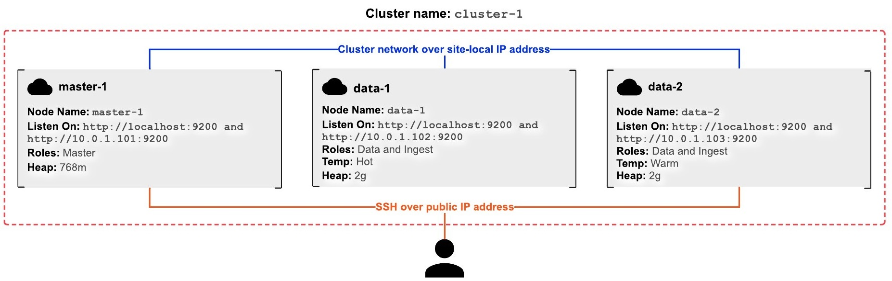


### Master Node Setup

The first computer that we will connect will be the master computer.

Using the Secure Shell (SSH), log in  via the public IP address.

First we enter like a  `root` user with:

```
sudo su -
```

Import the Elastic GPG key:

```
rpm --import https://artifacts.elastic.co/GPG-KEY-elasticsearch
```

Download the Elasticsearch 7.6 RPM:

```
curl -O https://artifacts.elastic.co/downloads/elasticsearch/elasticsearch-7.6.0-x86_64.rpm
```

Install Elasticsearch:

```
rpm --install elasticsearch-7.6.0-x86_64.rpm
```

Configure Elasticsearch to start on system boot:

```
systemctl enable elasticsearch
```

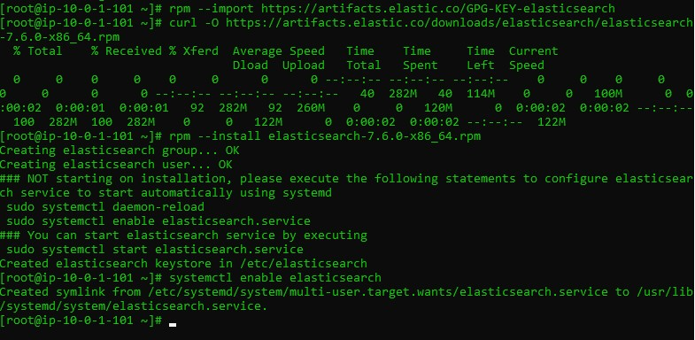

Configure the elasticsearch.yml per instructions.


Open the `elasticsearch.yml` file:

```
vim /etc/elasticsearch/elasticsearch.yml
```

Change the following line:

```
#cluster.name: my-application
```

to

```
cluster.name: cluster-1
```

Press the letter i on your keyboard to enter INSERT mode in vim.


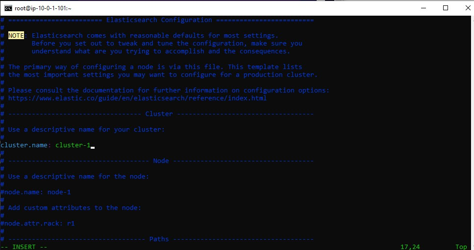

Change the following line on master-1:

```
#node.name: node-1
```

to

```
node.name: master-1
```

Change

```
#network.host: 192.168.0.1
```

to

```
network.host: [_local_,_site_]
```

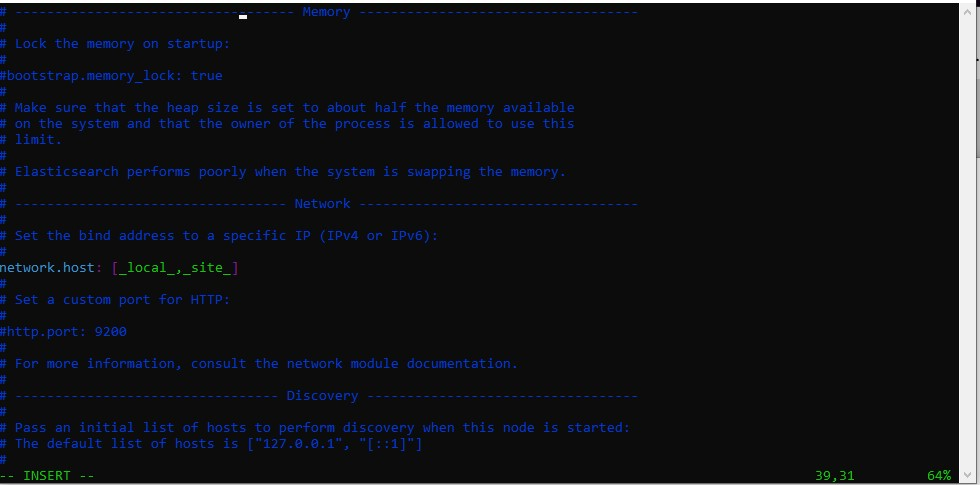

change

```
#discovery.seed_hosts: ["host1", "host2"]
```


to

```
discovery.seed_hosts: ["10.0.1.101"]
```


and change

```
#cluster.initial_master_nodes: ["node-1", "node-2"]
```

to

```
cluster.initial_master_nodes: ["master-1"]
```

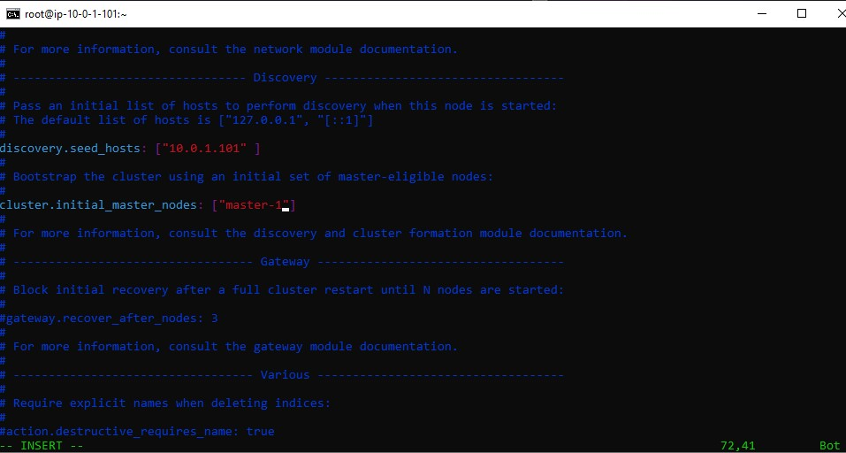


we add the following lines

```
node.master: truenode.data: falsenode.ingest: falsenode.ml: false
```


Then save and quit.

To save the file and exit the editor simultaneously, press `Esc` to switch to normal mode, type `:wq` and hit `Enter`.


###  Node 1  Setup

We conect now the the node 1 again by using the Secure Shell (SSH), log in  via the public IP address.

and we repeate the same steps

Become the `root` user with:

```
sudo su -
```

Import the Elastic GPG key:

```
rpm --import https://artifacts.elastic.co/GPG-KEY-elasticsearch
```

Download the Elasticsearch 7.6 RPM:

```
curl -O https://artifacts.elastic.co/downloads/elasticsearch/elasticsearch-7.6.0-x86_64.rpm
```

Install Elasticsearch:

```
rpm --install elasticsearch-7.6.0-x86_64.rpm
```

Configure Elasticsearch to start on system boot:

```
systemctl enable elasticsearch
```

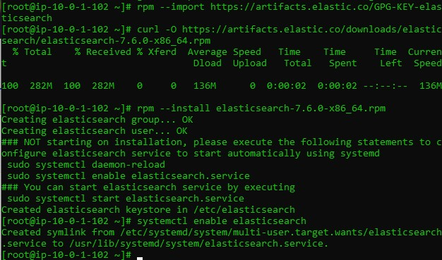


we configure  the  node's elasticsearch.yml per instructions.

Open the `elasticsearch.yml` file:

```
vim /etc/elasticsearch/elasticsearch.yml
```

Change the following line:

```
#cluster.name: my-application
```

to

```
cluster.name: cluster-1
```


Change the following line on data-1:

```
#node.name: node-1
```

to

```
node.name: data-1
```


Change the following line on data-1:

```
#node.attr.rack: r1
```

to

```
node.attr.temp: hot
```


```
node.name: master-1
```

Change

```
#network.host: 192.168.0.1
```

to

```
network.host: [_local_,_site_]
```


change

```
#discovery.seed_hosts: ["host1", "host2"]
```


to

```
discovery.seed_hosts: ["10.0.1.101"]
```


and change

```
#cluster.initial_master_nodes: ["node-1", "node-2"]
```

to

```
cluster.initial_master_nodes: ["master-1"]
```

Add the following lines on data-1:

```
node.master: falsenode.data: truenode.ingest: truenode.ml: false
```


###  Node 2  Setup

We conect now the the node 2 again by using the Secure Shell (SSH), log in  via the public IP address.

and we repeat the same steps

```
sudo su -
```

Import the Elastic GPG key:

```
rpm --import https://artifacts.elastic.co/GPG-KEY-elasticsearch
```

Download the Elasticsearch 7.6 RPM:

```
curl -O https://artifacts.elastic.co/downloads/elasticsearch/elasticsearch-7.6.0-x86_64.rpm
```

Install Elasticsearch:

```
rpm --install elasticsearch-7.6.0-x86_64.rpm
```

Configure Elasticsearch to start on system boot:

```
systemctl enable elasticsearch
```


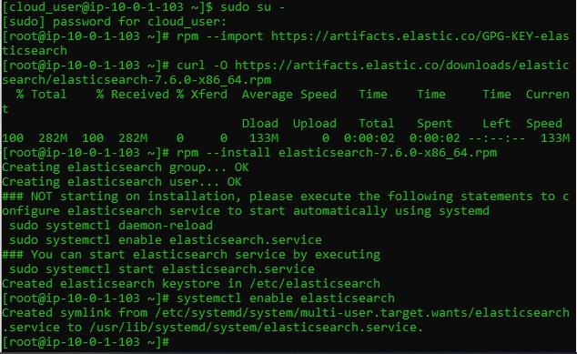


Configure  elasticsearch.yml per instructions.


Log in to each node and become the `root` user:

```
sudo su -
```

Open the `elasticsearch.yml` file:

```
vim /etc/elasticsearch/elasticsearch.yml
```


Change the following line:

```
#cluster.name: my-application
```

to

```
cluster.name: cluster-1
```


Change the following line on data-2:

```
#node.name: node-1
```

to

```
node.name: data-2
```

Change the following line on data-2:

```
#node.attr.rack: r1
```

to

```
node.attr.temp: warm
```


Change

```
#network.host: 192.168.0.1
```

to

```
network.host: [_local_,_site_]
```


change

```
#discovery.seed_hosts: ["host1", "host2"]
```


to

```
discovery.seed_hosts: ["10.0.1.101"]
```


and change

```
#cluster.initial_master_nodes: ["node-1", "node-2"]
```

to

```
cluster.initial_master_nodes: ["master-1"]
```

Add the following lines on data-2:

```
node.master: falsenode.data: truenode.ingest: truenode.ml: false
```


Configure the heap for each node per instructions.

Log in to the master node 

```
sudo su -
```

Open the `jvm.options` file:

```
vim /etc/elasticsearch/jvm.options
```

Change the following lines:

```
-Xms1g-Xmx1g
```

to

```
-Xms768m-Xmx768m
```


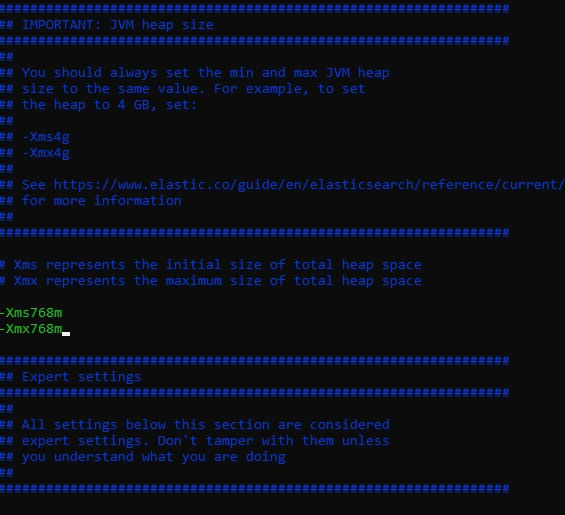


Log in to each data node and become the `root` user:

```
sudo su -
```

Open the `jvm.options` file:

```
vim /etc/elasticsearch/jvm.options
```

Change the following lines:

```
-Xms1g-Xmx1g
```

to

```
-Xms2g-Xmx2g
```

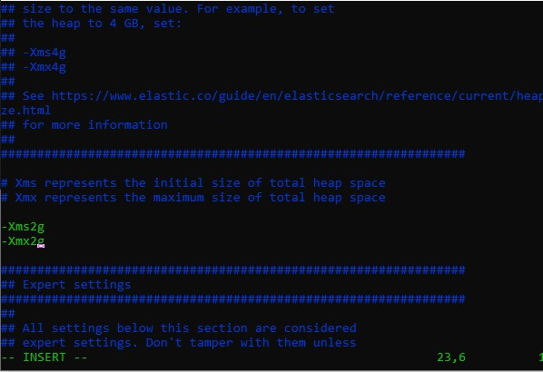


Start Elasticsearch on each node.

```
systemctl start elasticsearch
```

Check the startup process:

```
less /var/log/elasticsearch/cluster-1.log
```

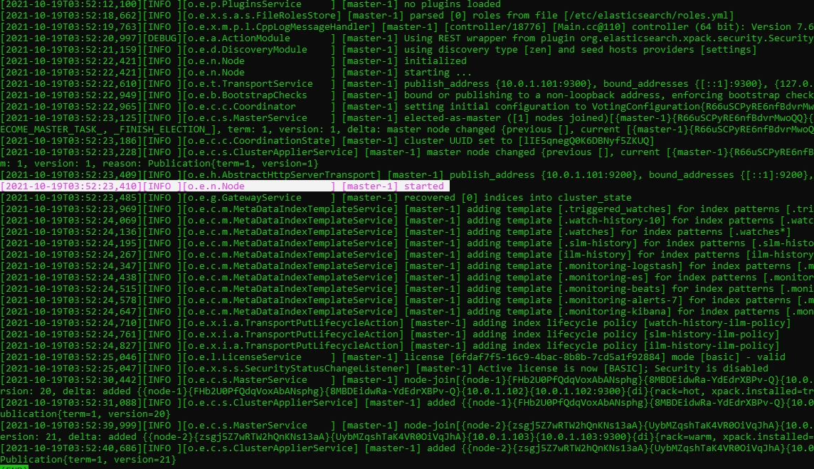

from there we can see

```
[master-1] started
```

and

```
 [master-1] added node-1
```

```
 [master-1] added node-2
```


Check the node configuration:

```
curl localhost:9200
```

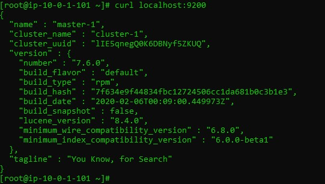

```
curl localhost:9200/_cat/nodes?v
```


to get more information about your cluster  you can use cat to know 

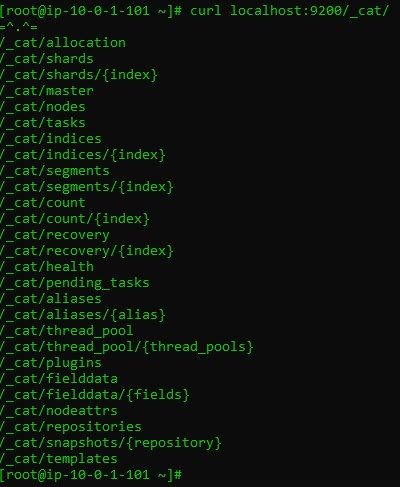


# Configure Kibana for an Elasticsearch Cluster


Install Kibana on the master-1 node.

Using the Secure Shell (SSH), log in to the `master-1` node as `cloud_user` via the public IP address.

Become the `root` user with:

```
sudo su -
```

Download the Kibana 7.6 RPM:

```
curl -O https://artifacts.elastic.co/downloads/kibana/kibana-7.6.0-x86_64.rpm
```

Install Kibana:

```
rpm --install kibana-7.6.0-x86_64.rpm
```

Configure Kibana to start on system boot:

```
systemctl enable kibana
```


Log in to the `master-1` node and become the `root` user with:

```
sudo su -
```

Open the `/etc/kibana/kibana.yml` file:

```
vim /etc/kibana/kibana.yml
```

Change the following line:

```
#server.port: 5601
```

to

```
server.port: 8080
```

Change the following line:

```
#server.host: "localhost"
```

to

```
server.host: "10.0.1.101"
```


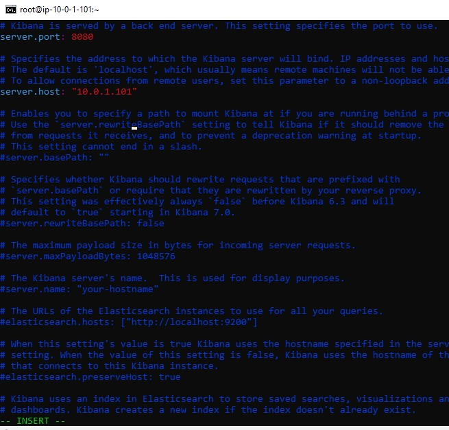


Start Kibana:

```
systemctl start kibana
```


After Kibana has finished starting up, which may take a few minutes navigate to `http://PUBLIC_IP_ADDRESS_OF_MASTER-1:8080` in your web browser 


click `Explore on my own`

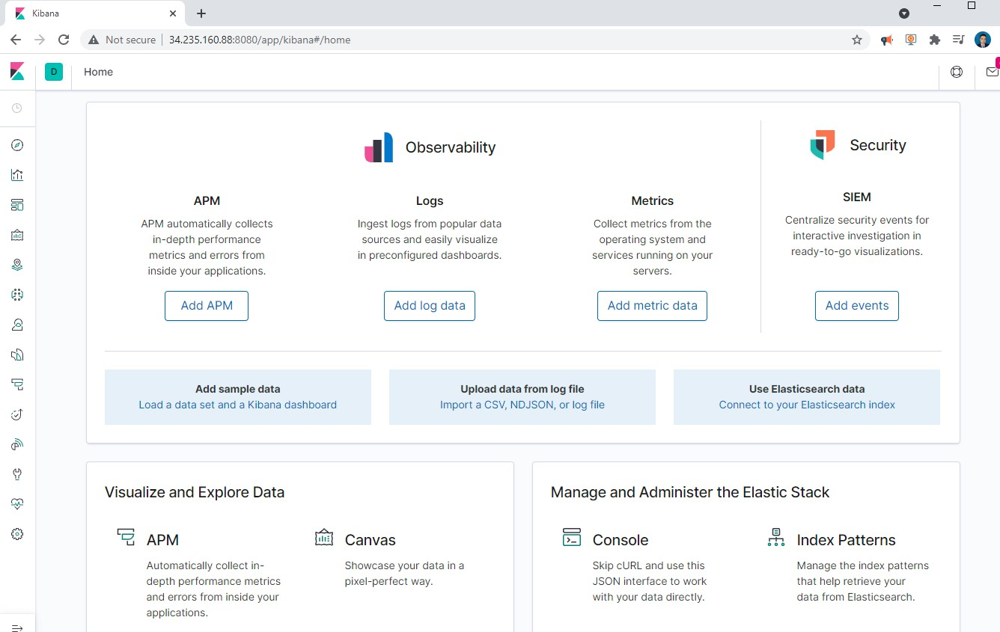


and navigate to **Dev Tools** > **Console**.

Check the node status of the cluster via the console tool with:

```
GET _cat/nodes?v
```


Great, now we can start working on Kibana.

## Deploy  Elasticsearch with Amazon OpenSearch

OpenSearch is a community-driven, open source search and analytics suite derived from Apache 2.0 licensed Elasticsearch 7.10.2 & Kibana 7.10.2. It consists of a search engine daemon, OpenSearch, and a visualization and user interface, OpenSearch Dashboards.

 

We login to our AWS console and then we search for **Opensearch** 

Let us create a cluster in AWS by creating a domain in OpenSearch.


we name the Domain name as `cluster-1`


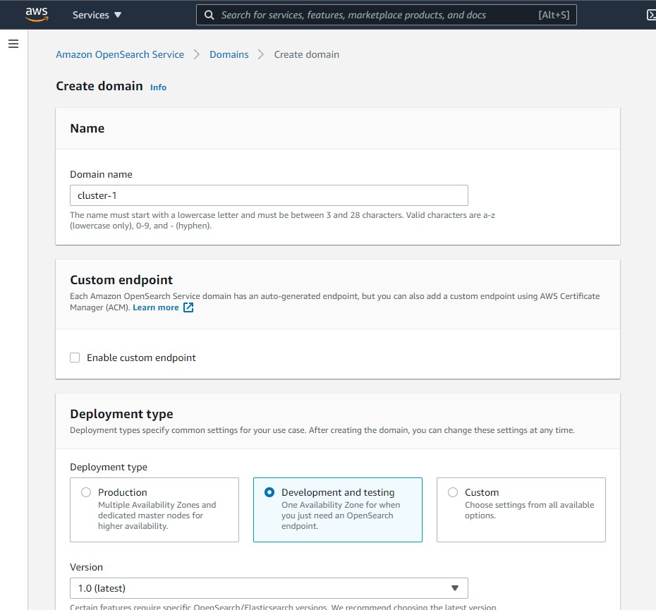


then we select the instance type  `r5.large.search`  and only 1  node, for this test


then in Network we choose `Public access` and without `fine grained` access, for production we should use VPC and Fine grained access control. 

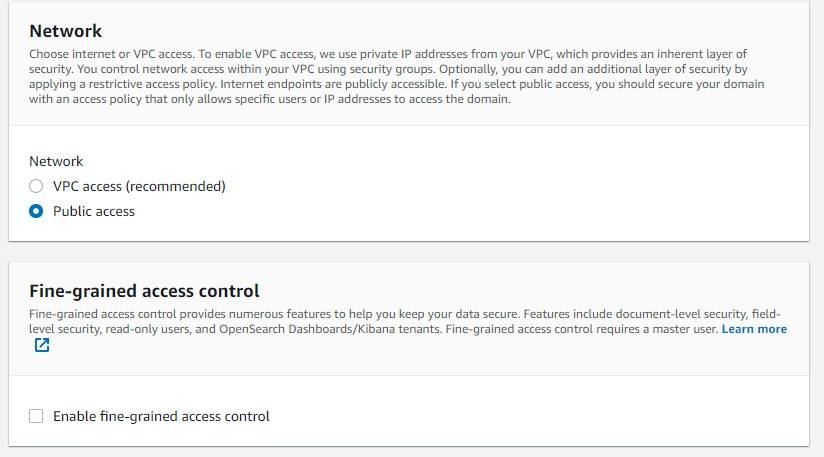

For the access policy we choose configure our level,  we choose our current ip

for exaample [https://www.whatsmyip.org/](https://www.whatsmyip.org/) and copy your address ip and paste in the principal


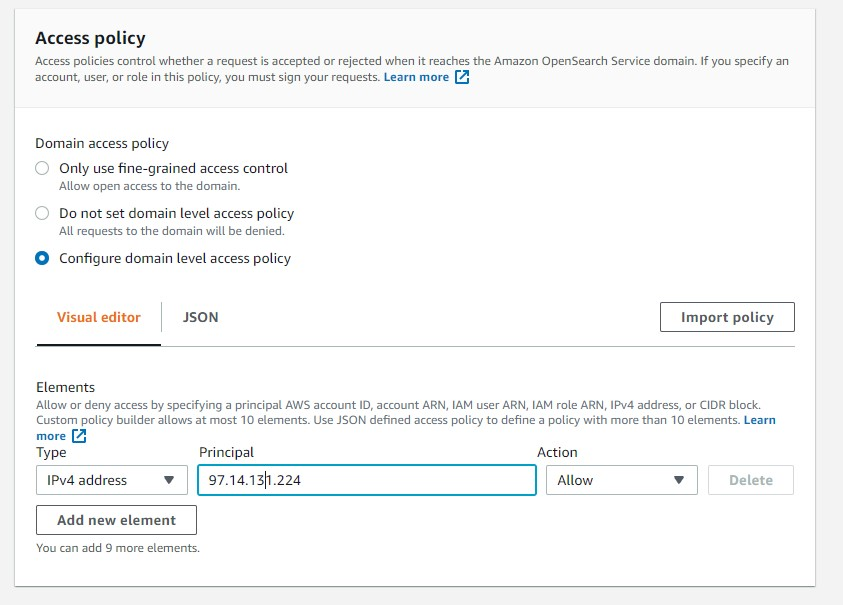

The Access Policy   generated in JSON format  should be something similar like

```json
{
  "Version": "2012-10-17",
  "Statement": [
    {
      "Effect": "Allow",
      "Principal": {
        "AWS": "*"
      },
      "Action": [
        "es:*"
      ],
      "Resource": "arn:aws:es:us-east-1:298039135746:domain/cluster-1/*",
      "Condition": {
        "IpAddress": {
          "aws:SourceIp": [
            "97.14.131.224"
          ]
        }
      }
    }
  ]
}
```

then we create our cluster


we have to wait at least 10 minutes


after a while  the status should be **Active**


Then we go to our terminal, and lets get information about our cluster

we will  use the command `curl -XGET` + `Domain endpoint`   , we copy the Domain endpoint from our AWS console , in my case is `https://search-cluster-1-qtas43cbwk4zwyvjfyfr4ic4ye.us-east-1.es.amazonaws.com/`  you should have something similar, then  type 

```
curl -XGET https://search-cluster-1-qtas43cbwk4zwyvjfyfr4ic4ye.us-east-1.es.amazonaws.com/
```

you will get

```
{
  "name" : "c3812926142472338371572d47cc4d1a",
  "cluster_name" : "298039135746:cluster-1",
  "cluster_uuid" : "OdNhU9BkRou1MT77Ue4jBA",
  "version" : {
    "distribution" : "opensearch",
    "number" : "1.0.0",
    "build_type" : "tar",
    "build_hash" : "unknown",
    "build_date" : "2021-08-20T12:03:05.728738Z",
    "build_snapshot" : false,
    "lucene_version" : "8.8.2",
    "minimum_wire_compatibility_version" : "6.8.0",
    "minimum_index_compatibility_version" : "6.0.0-beta1"
  },
  "tagline" : "The OpenSearch Project: https://opensearch.org/"
}
```

The next step is download a test json to check our cluster.

```
curl -OL https://github.com/ruslanmv/Deploy-Elasticsearch-and-Kibana-in-a-Cluster/raw/master/movies.json
```


The next step is  upload  this json to the cluster by using the command

`curl -XPUT` + `Domain endpoint`  + `/_bulk?pretty --data-binary @movies.json -H 'Content-Type: application/json'`


```
curl -XPUT https://search-cluster-1-qtas43cbwk4zwyvjfyfr4ic4ye.us-east-1.es.amazonaws.com/_bulk?pretty --data-binary @movies.json -H 'Content-Type: application/json'
```

the output will be 


then let us check if was loaded

`curl -XPGET` + `Domain endpoint`  , +`/movies/_search?pretty` 

```
curl   -XGET  https://search-cluster-1-qtas43cbwk4zwyvjfyfr4ic4ye.us-east-1.es.amazonaws.com/movies/_search?pretty 
```

and then output should be 


Finally we can copy address of the the **OpenSearch Dashboard** url and paste in the browser


in th OpenSearch  click **Explore on my own**, we go to **Management Tab**  then  **Stack Management** then **Index Pattern**

Then **Create Index Pattern**


and write `movies*`

Below the index pattern 


we will get


finally you can analyze them


After finished this project, you can Delete the Domain to avoid charges in AWS.

**Congratulations!** We have installed **Elasticsearch** and **Kibana** and **Opensearch** in a Cluster


