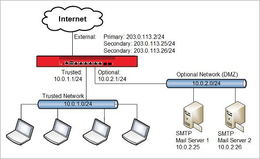
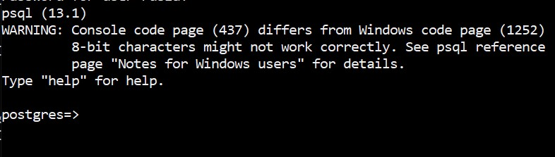

Hello there, today we are going to discuss an amazing procedure to create a private PostgreSQL server  with a dynamic IP and a custom domain by using MacOS and give an example about how to create a table in Python, this is really interesting.


PostgreSQL is a powerful, open source object-relational database system with over 30 years of active development that has earned it a strong reputation for reliability, feature robustness, and performance.

## How to install PostgreSQL server?

There are two methods

a) Install via the installer

[https://www.postgresql.org/download/](https://www.postgresql.org/download/)

and we download the Mac Os version


b)   The second is by using brew.

```
brew update
brew install postgresql
```

In this tutorial I will follow th method a)

In ordert to know where was installed the server files you can 

```
 ps aux | grep postgres | grep -- -D
```

```
postgres         16592   0.0  0.1  4480060   6592   ??  Ss    1:01AM   0:00.05 /Library/PostgreSQL/13/bin/postgres -D /Library/PostgreSQL/13/data
```

Threfore our server is in the folder

```
/Library/PostgreSQL/13
```

## How to start and stop PostgreSQL server?

a) If you installed PostgreSQL via the installer

We can create a database with the command

```
/Library/PostgreSQL/13/scripts/runpsql.sh
```

and we obtain

```
Server [localhost]: localhost
Database [postgres]: postgres
Port [5432]: 5432
Username [postgres]: postgres
Password for user postgres: password
psql (13.1)
Type "help" for help.
postgres=# 
```

We can check in another termial if is running our server by  using

```
ps auxwww | grep postgres
```

And look for a command that looks something like this

 /Library/PostgreSQL/13/bin/psql -h localhost -p 5432 -U postgres postgres

Another way to check if is running is by using the  program **pgAdmin 4**


and you can see


If wee need to stop or restart we can do by using the postgresql account

```
su postgresql
```

If we want to do the things manually we can 

- To start manually:

```
 /Library/PostgreSQL/13/bin/pg_ctl start -D /Library/PostgreSQL/13/data/
```

- To stop manually:

```
/Library/PostgreSQL/13/bin/pg_ctl stop -D /Library/PostgreSQL/13/data/
```

- And stop PostgreSQL:

```
/Library/PostgreSQL/13/bin/pg_ctl restart -D /Library/PostgreSQL/13/data
```

b) If you installed PostgreSQL via Homebrew:

- To start manually:

```
pg_ctl -D /usr/local/var/postgres start
```

- To stop manually:

```
pg_ctl -D /usr/local/var/postgres stop
```

- To start PostgreSQL server now and relaunch at login:

```
brew services start postgresql
```

- And stop PostgreSQL:

```
brew services stop postgresql
```

Good now we have the Postgree Running but now let us connect with our  public  ip.

##  Enable client authentication

We need edit the PostgreSQL configuration file, edit the PostgreSQL configuration file, 

Login as postgres user using su / sudo command, enter:

```
su postgresql
```

```
export PGDATA="/Library/PostgreSQL/13/data"
```

we can see if the server is running

```
/Library/PostgreSQL/13/bin/pg_ctl status
```

you got

```
pg_ctl: server is running (PID: 69)
/Library/PostgreSQL/13/bin/postgres "-D/Library/PostgreSQL/13/data"
```

Now, we can edit the file 

```
nano /Library/PostgreSQL/13/data/pg_hba.conf
```

Append the following configuration lines to give access to all

```
host    postgres        postgres        0.0.0.0/0               md5
```

Just in case  you need any particual range of ip as example 10.10.29.0/24 network

`host all all 10.10.29.0/24 trust` But I will consider all ips.

more information you can see at

[https://www.postgresql.org/docs/current/auth-pg-hba-conf.html](https://www.postgresql.org/docs/current/auth-pg-hba-conf.html)

We should be carefull when we open the ports!

https://postgresql.verite.pro/blog/2019/02/08/open-instances.html

## Allow TCP/IP socket

You need to open PostgreSQL configuration file 

```
nano /Library/PostgreSQL/13/data/postgresql.conf
```

Find configuration line that read as follows:

```
listen_addresses='localhost'
```

Next set IP address(es) to listen on; you can use comma-separated list of addresses; defaults to ‘localhost’, and ‘*’ is all ip address:

```
listen_addresses='*'
```

## Restart PostgreSQL Server

```
/Library/PostgreSQL/13/bin/pg_ctl restart -D /Library/PostgreSQL/13/data
```

#### Remote PostgreSQL connection method

You can use either of the following methods to access your PostgreSQL databases remotely:

- **SSH tunnel:** This is the more secure method. You set up an SSH tunnel that forwards a port on your local computer to the remote PostgreSQL server. The PostgreSQL traffic is encrypted by the SSH tunnel.
- **Direct connection:** You can set up a direct connection between your local computer and the remote PostgreSQL server on port 5432.

For security reasons, the PostgreSQL port cannot be accessed over a public IP address. To connect to PostgreSQL from a different machine, you must open port 5432 for remote access.

IMPORTANT: By default, the database port for the nodes in this solution cannot be accessed over a public IP address. As a result, you will only be able to connect to your database nodes from machines that are running in the same network. For security reasons, we do not recommend making the database port accessible over a public IP address. If you must make it accessible over a public IP address, we recommend restricting access to a trusted list of source IP addresses using firewall rules. For development purposes, you can also use a VPN or SSH tunnel. Refer to the FAQ for information on [accessing restricted ports using an SSH tunnel](https://docs.bitnami.com/virtual-machine/faq/get-started/access-ssh-tunnel/) or [opening ports in the server firewall](https://docs.bitnami.com/virtual-machine/faq/administration/use-firewall/).

Make sure iptables is not blocking communication, [open port 5432](https://www.cyberciti.biz/tips/howto-iptables-postgresql-open-port.html) 

in **MacOs** we proceed with the manual form


and there we activate Remote login


# NAT for Public Access to Servers with Private IP Addresses on the Private Network

Let us consider as an example that we have  two main servers with private IP addresses on the optional network . 

We requiere two routers


The Router 1 has internet from our ISP

and the Second Router 2 is connected with our Router 1 .

We require setup the IP of the Router 2 in a zone DMZ


**How to configure DMZ Host**


**Step 1:** Login to the management page


Open the web browser and type the **IP address**  of the Router 1 of the device in the address bar ( **Press Enter**.


**Step 2:** Configure the DMZ

**What is a DMZ**

A DMZ (demilitarized zone) on a home router refers to a DMZ Host. Strictly speaking, this is not a true DMZ. A home router DMZ host is a host on the internal network that has all UDP and TCP ports open and exposed, except those ports otherwise forwarded. They are often used a simple method to forward all ports to another firewall/[NAT](http://en.wikipedia.org/wiki/Network_address_translation) device.


**Click: Forwarding** > **DMZ** > **Enable/Disable**. We find the the IP of our Router 2 (here takes and we put the we put them  in the DMZ then click **Save**.


## Network Topology

In this use case, the two Servers have private IP addresses and are located behind theoptional network of Router 2



This configuration example demonstrates two different types of NAT configuration that can be used to translate the public IP addresses servers to the corresponding private IP addresses for inbound and outbound traffic

The second step , is we open the ports that we want to use,

in this case we can open the port 22 and 5432 of the Router 2.

Usually is found in the section of Port Forward.

There we write the IP of the Server that we want to use PosgreSQL


In this part we neet open the ports of the WAN

Wide Area Network (WAN) Port - the port on your router, that connects to your modem with an ethernet cable. Local Area Network (LAN) Port - the port on your router that connects you to the home network. WAN is not Wireless Area Network, thats WLAN (Wireless Local Area Network) and not a common term. WAN is the public side of the internet, its assigned a public IP Address. 


LAN is the local side of the internet (home network), and assigned a private IP Addresses, one per device on the network. A router works by intercepting requests from the devices on the LAN, transforming the private IP address to a public one, and then going out to the internet (websites or web servers). Then this process works in reverse when going back to your device; 


The website or web server sends the request back to the router via the public IP, the router transforms the public IP back to a private IP, and forwards the information back to the device that made the request. This process is called Network Address Translation WAN port is only used to connect to the internet, and not to connect to another router. To increase the size of your LAN and your WiFi network, you can connect them via LAN ports. This requires special configuration, refer to the article here:

https://networkingguides.com/connect-two-routers/


If we assume the the PosgreSQL server in MacOS has the IP 10.0.2.25  we need add the following

IP forwarding in the Router 2

10.0.2.25 ssh 22

10.0.2.25 ssh 5432 


Then we need  a dynamic dns installed on our Server Postgre

There are several sites where you can get a free account and install on your

server:

[https://www.noip.com/](https://www.noip.com/)

[https://account.dyn.com/](https://account.dyn.com/)

[https://www.dynu.com/](https://www.dynu.com/)


After installed your dynamic dns , you can  point the

adddres from those sites to the ns servers

#### One domain two name servers

We can rememebr that you can have on domain with one nameservers and a subdomain with another name servers,

For example;

```
*.yourdomain.com   NS dina.ns.cloudflare.com
*.yourdomain.com   NS mike.ns.cloudflare.com
```

And point a subdomain to a name servers of your dynamic ip

```
server.yourdomain.com NS ns1.dynu.com
```


**Subdomain that points to a server name**

I suggest use  create account in Cloudflare for your custom domain

https://[www.cloudflare.com](www.cloudflare.com)/

1. Login to Cloudflare
2. Use the drop-down menu in the upper left of your screen and click your domain that you want the redirect to take place on.
3. Click the DNS icon at the top of the screen.
4. Select `CNAME` using the drop-down options
5. Add the sub domain in `NAME`
6. Add your domain name in `Domain name`
7. Leave TTL as automatic and Cloudclare enabled, click `Add Record` button.
8. Click Page Rules icon
9. Click Create Page Rule button
10. Add `subdomain.yourdomain/*` in the URL match field
11. Click + Add a Setting, find `Forwarding URL` and click it
12. Select the status code `301 - Permanent Redirect`
13. Add the Enter destination URL as `ns servers ofyour_dynamic_dns.com  `
14. Click Save and Deploy button.


# How do I SSH into my server with my domain name instead of the IP address

Public key authentication is a way of logging into an [SSH/SFTP](https://serverpilot.io/docs/getting-started-with-ssh-and-sftp/) account using a cryptographic key rather than a password.

If you use very strong SSH/SFTP passwords, your accounts are already safe from brute force attacks. However, using public key authentication provides many benefits when working with multiple developers. For example, with SSH keys you can

- allow multiple developers to log in as the same system user without having to share a single password between them;
- revoke a single developer's access without revoking access by other developers; and
- make it easier for a single developer to log in to many accounts without needing to manage many different passwords.

## How Public Key Authentication Works

Keys come in pairs of a public key and a private key. Each key pair is unique, and the two keys work together.

These two keys have a very special and beautiful mathematical property: if you have the private key, you can prove you have it without showing what it is. It's like proving you know a password without having to show someone the password.

Public key authentication works like this:

1. Generate a key pair.
2. Give someone (or a server) the public key.
3. Later, anytime you want to authenticate, the person (or the server) asks you to prove you have the private key that corresponds to the public key.
4. You prove you have the private key.

You don't have to do the math or implement the key exchange yourself. The SSH server and client programs take care of this for you.

## Generate an SSH Key Pair

You should generate your key pair on your laptop, not on your server. All Mac and Linux systems include a command called `ssh-keygen` that will generate a new key pair.

If you're using Windows, you can generate the keys on your server. Just remember to copy your keys to your laptop and delete your private key from the server after you've generated it.

We enter to our server where we have Postgre installed.

To generate an SSH key pair, run the command `ssh-keygen`.

```
ssh-keygen
```

It will look like this when you run it:

```
laptop1:~ yourname$ ssh-keygen
Generating public/private rsa key pair.
```

You'll be prompted to choose the location to store the keys. The default location is good unless you already have a key. Press **Enter** to choose the default location.

```
Enter file in which to save the key (/Users/yourname/.ssh/id_rsa):
```

Next, you'll be asked to choose a password. Using a password means a password will be required to use the private key. It's a good idea to use a password on your private key.

```
Enter passphrase (empty for no passphrase):
Enter same passphrase again:
```

After you choose a password, your public and private keys will be generated. There will be two different files. The one named `id_rsa` is your private key. The one named `id_rsa.pub` is your public key.

```
Your identification has been saved in /Users/yourname/.ssh/id_rsa.
Your public key has been saved in /Users/yourname/.ssh/id_rsa.pub.
```

You'll also be shown a fingerprint and "visual fingerprint" of your key. You do not need to save these.

```
The key fingerprint is:
d7:21:c7:d6:b8:3a:29:29:11:ae:6f:79:bc:67:63:53 yourname@laptop1
The key's randomart image is:
+--[ RSA 2048]----+
|                 |
|           . o   |
|      .   . * .  |
|     . .   = o   |
|      o S . o    |
|     . . o oE    |
|    . .oo +.     |
|     .o.o.*.     |
|     ....= o     |
+-----------------+
```


The standard OpenSSH suite of tools contains the `ssh-keygen` utility, which is used to generate key pairs. Run it on your local computer to generate a 2048-bit RSA key pair, which is fine for most uses.The utility prompts you to select a location for the keys. By default, the keys are stored in the `~/.ssh` directory with the filenames `id_rsa` for the private key and `id_rsa.pub` for the public key. Using the default locations allows your SSH client to automatically find your SSH keys when authenticating, so we recommend accepting them by pressing `ENTER`.Once you select a location for the key, you'll be prompted to enter an optional passphrase which encrypts the private key file on disk.


## Configure an SSH/SFTP User for Your Key

Now that you have an SSH key pair, you're ready to configure your app's system user so you can SSH or SFTP in using your private key.

To copy your public key to your server, run the following command. Be sure to replace "x.x.x.x" with your server's IP address and `SYSUSER` with the name of the the system user your app belongs to.

```
ssh-copy-id SYSUSER@x.x.x.x
```


### How to Disable SSH Password Authentication (optional)

As long as you use [strong passwords](https://serverpilot.io/docs/how-to-create-a-strong-password/), it is not necessary to disable SSH password authentication for your server; however, you can disable it if you would like.

Before you proceed, keep these things in mind:

- Disabling password authentication makes it more likely for you to be locked out of your server.
- You can become locked out if you lose your private key or break your `~/.authorized_keys` file.
- If you are locked out, you will no longer be able to access the files of any apps.

You should only disable SSH password authentication if you are *extremely* familiar with public key authentication and understand the potential consequences of locking yourself out of your server.

To disable SSH password authentication, SSH in to your server as `root` to edit this file:

```
/etc/ssh/sshd_config
```

Then, change the line

```
PasswordAuthentication yes
```

to

```
PasswordAuthentication no
```

After making that change, restart the SSH service by running the following command as `root`:

```
sudo launchctl unload /System/Library/LaunchDaemons/ssh.plist
sudo launchctl load -w /System/Library/LaunchDaemons/ssh.plist
```

In linux should be 

```
sudo service ssh restart
```

Be careful! , I suggest disable after add all your clients to your main server otherwise you will have troubles to login to your server.


### HOW TO CONNECT TO THE POSTGRESQL SERVER FROM NON LOCAL NETWORK

There are several ways to connect to the server.   

a) Using python  with direct connection

b) Using python by using ssh tunneling

c)Using the terminal in windows for example

### Direct connection with python


In this example I will use  anaconda with Jupyter Notebook

and we import the following library

```python
import psycopg2
```

if is not installed you can installa

```
conda install -c anaconda psycopg2
```

if does not work you can try

```
!pip install psycopg2
```


We create a connection to the database

```python
try: 
    conn = psycopg2.connect("host=server.yourdomain.com dbname=postgres user=postgres password=yourpassword")
except psycopg2.Error as e: 
    print("Error: Could not make connection to the Postgres database")
    print(e)
```


Here server.yourdomain.com is your  subdomain that is pointing you server PostgreSQL

 Use the connection to get a cursor that can be used to execute queries.

```python
try: 
    cur = conn.cursor()
except psycopg2.Error as e: 
    print("Error: Could not get curser to the Database")
    print(e)
```

Use automactic commit so that each action is commited without having to call conn.commit() after each command. The ability to rollback and commit transactions is a feature of Relational Databases. 

```python
conn.set_session(autocommit=True)
```

Create a database to work in 

I choose create a database called ruslanmv


```python
try: 
    cur.execute("create database ruslanmv")
except psycopg2.Error as e:
    print(e)

```


Close our connection to the default database, reconnect to the ruslanmv database, and get a new cursor.

```python
try: 
    conn.close()
except psycopg2.Error as e:
    print(e)
  
try: 
    conn = psycopg2.connect("host=server.yourdomain.com dbname=postgres user=postgres password=yourpassword")
except psycopg2.Error as e: 
    print("Error: Could not make connection to the Postgres database")
    print(e)
    
try: 
    cur = conn.cursor()
except psycopg2.Error as e: 
    print("Error: Could not get curser to the Database")
    print(e)

conn.set_session(autocommit=True)
```

We will create a Music Library of albums. Each album has a lot of information we could add to the music library table. We will start with album name, artist name, year

```
Table Name: music_library
column 1: Album Name
column 2: Artist Name
column 3: Year
```


Review this document on PostgreSQL datatypes: https://www.postgresql.org/docs/9.5/datatype.html

Translate this information into a Create Table Statement

```python
try: 
    cur.execute("CREATE TABLE IF NOT EXISTS music_library (album_name varchar, artist_name varchar, year int);")
except psycopg2.Error as e: 
    print("Error: Issue creating table")
    print (e)
```

No error was found, but lets check to ensure our table was created. select count(*) which should return 0 as no rows have been inserted in the table

```python
try: 
    cur.execute("select count(*) from music_library")
except psycopg2.Error as e: 
    print("Error: Issue creating table")
    print (e)
    
print(cur.fetchall())
```

```
[(0,)]
```

```
Insert two rows 
```

### Insert two rows 

```python
try: 
    cur.execute("INSERT INTO music_library (album_name, artist_name, year) \
                 VALUES (%s, %s, %s)", \
                 ("Let It Be", "The Beatles", 1970))
except psycopg2.Error as e: 
    print("Error: Inserting Rows")
    print (e)
    
try: 
    cur.execute("INSERT INTO music_library (album_name, artist_name, year) \
                 VALUES (%s, %s, %s)", \
                 ("Rubber Soul", "The Beatles", 1965))
except psycopg2.Error as e: 
    print("Error: Inserting Rows")
    print (e)
```


Validate your data was inserted into the table. The while loop is used for printing the results. If executing queries in the Postgres shell, this would not be required. Note: If you run the insert statement code more than once, you will see duplicates of your data. PostgreSQL allows for duplicates

```python
try: 
    cur.execute("SELECT * FROM music_library;")
except psycopg2.Error as e: 
    print("Error: select *")
    print (e)

row = cur.fetchone()
while row:
   print(row)
   row = cur.fetchone()
```

```
('Let It Be', 'The Beatles', 1970)
('Rubber Soul', 'The Beatles', 1965)
```

Drop the table to avoid duplicates and clean up

```python
try: 
    cur.execute("DROP table music_library")
except psycopg2.Error as e: 
    print("Error: Dropping table")
    print (e)
```


## SSH Tunnels 

Access to important services are usually blocked behind a firewall or router. Since `ssh`, when setup correctly, is quite secure, you can usually get access to a server with `ssh` even when other protocols are blocked. (Though some administrators move `ssh` access to a different port than the default 22.)

You can use `ssh` port forwarding or ‘tunneling’ to gain access to other services through `ssh`.

We want to use Jupyter notebook or the terminal to connect to a remote server Mac (`server.yourdomain.com').`

  PostgreSQL uses the  5432 to connect to a remote Mac.


 Since  have unknown open ports itself is inherently insecure,  the  unknown ports is blocked by many firewalls.

However, I do have `ssh` access to `server.yourdomain.com`. 

So, how do I tell both systems to ‘tunnel’ the  PostgreSQL traffic through `ssh`?

(When you test this, remember to enable either ‘Screen Sharing’ or ‘Remote Management’ (i.e Apple Remote Desktop) access in the ‘Sharing’ pane in System Preferences on the remote Mac.)


The tunnel starts on my local machine and ends on `server.yourdomain.com` at port 5432  (where  PostgreSQL service is listening on the remote Mac.)

The starting point also needs a port number, and I can basically choose freely. Port numbers under 1000 and over 49000 are reserved for the system and require root privileges. 

 I will choose 5431  for the local port.

To connect the local port 5431to port 5432 on the remote Mac use the following command:

```
$ ssh -N -L localhost:5431:localhost:5432  server.yourdomain.com
```


Where

The `-N` option tells `ssh` that we do not want to invoke a remote shell or run a remote command.

The `-L` option creates a local port forwarding setup. This option takes a parameter with three or four parts, separated by colons `:`. The first pair (`localhost:5431`) are the tunnel start point. The second pair (`localhost:5432) are the remote end point of the tunnel.

The second `localhost` is resolved *on the remote host*, so this means port `5432` on the remote host.

The last parameter states the remote host, to connect to, `server.yourdomain.com`.

This commands tell `ssh` to connect to `server.yourdomain.com` and establish a tunnel that transfers traffic from port 5431 on my computer to port 5432 on the remote computer.

Since the origin of my tunnel is usually on my local computer, the first `localhost` can be omitted, so you only see the origin port.

```
$ ssh -N -L 5431:localhost:5432 server.yourdomain.com
```

When you execute the command nothing will happen. You will not even get a new prompt, because the `ssh` process is running until you cancel it with ctrl-C. Don’t cancel it yet, however, since it needs to run to provide the tunnel.

So, when you open PostgreSQL application (from `/Library/PostgreSQL/13/bin`) and connect to `localhost:5431` all traffic will be forwarded by `ssh`to port 5432 on the remote Mac.

### SSH tunneling  connection with python

You need the sshtunel  

```
!pip install sshtunnel
```

```python
import sshtunnel
```

```python
sshtunnel.SSH_TIMEOUT = 5.0
sshtunnel.TUNNEL_TIMEOUT = 5.0

with sshtunnel.SSHTunnelForwarder(
    ('server.yourdomain.com'),
    ssh_username='postgresql', ssh_password='password',
    remote_bind_address=('server.yourdomain.com', 5431)
) as tunnel:
    conn = psycopg2.connect(
        user='postgres', password='password',
        host='server.yourdomain.com', port=5432,
        database='postgres',
    )
    # Do stuff
```


we repeat the previous actions

```python
try: 
    cur = conn.cursor()
except psycopg2.Error as e: 
    print("Error: Could not get curser to the Database")
    print(e)
conn.set_session(autocommit=True)
try: 
    cur.execute("create database ruslanmv")
except psycopg2.Error as e:
    print(e)

    
try: 
    cur = conn.cursor()
except psycopg2.Error as e: 
    print("Error: Could not get curser to the Database")
    print(e)

conn.set_session(autocommit=True)

try: 
    cur.execute("CREATE TABLE IF NOT EXISTS music_library (album_name varchar, artist_name varchar, year int);")
except psycopg2.Error as e: 
    print("Error: Issue creating table")
    print (e)
    
try: 
    cur.execute("select count(*) from music_library")
except psycopg2.Error as e: 
    print("Error: Issue creating table")
    print (e)
    
print(cur.fetchall())

try: 
    cur.execute("INSERT INTO music_library (album_name, artist_name, year) \
                 VALUES (%s, %s, %s)", \
                 ("Let It Be", "The Beatles", 1970))
except psycopg2.Error as e: 
    print("Error: Inserting Rows")
    print (e)
    
try: 
    cur.execute("INSERT INTO music_library (album_name, artist_name, year) \
                 VALUES (%s, %s, %s)", \
                 ("Rubber Soul", "The Beatles", 1965))
except psycopg2.Error as e: 
    print("Error: Inserting Rows")
    print (e)
    
    
try: 
    cur.execute("SELECT * FROM music_library;")
except psycopg2.Error as e: 
    print("Error: select *")
    print (e)

row = cur.fetchone()
while row:
   print(row)
   row = cur.fetchone()
cur.close()
conn.close()
```


```
database "ruslanmv" already exists

[(2,)]
('Let It Be', 'The Beatles', 1970)
('Rubber Soul', 'The Beatles', 1965)
('Let It Be', 'The Beatles', 1970)
('Rubber Soul', 'The Beatles', 1965)
```


### SSH tunneling  connection with Windows on Terminal

If we wont use python to use our server we can install PosgreSQL on our client

Unfortunately there is no real client "only" installer.

What you can do, is to download the ZIP archive of the complete Postgres binaries:

[http://www.enterprisedb.com/products-services-training/pgbindownload](http://www.enterprisedb.com/products-services-training/pgbindownload)

In the server side you should add the user 

#### Creating PostgreSQL users

A default PostgresSQL installation always includes the *postgres* superuser. Initially, you must connect to PostgreSQL as the *postgres* user until you create other users (which are also referred to as *roles*).

To create a PostgreSQL user, follow these steps:

1. At the command line, type the following command as the server's

    

   root user:

   ```
   su - postgres
   ```

2. You can now run commands as the PostgreSQL superuser. To create a user, type the following command:

   ```
   /Library/PostgreSQL/13/bin/createuser --interactive --pwprompt
   ```

3. At the **Enter name of role to add:** prompt, type the user's name.( here is the username that you have in windows  , if you have windows 10  you remove the last letter. Ie.   if the username is  alexa, you create alex)

4. At the **Enter password for new role:** prompt, type a password for the user.

5. At the **Enter it again:** prompt, retype the password.

6. At the **Shall the new role be a superuser?** prompt, type y if you want to grant superuser access. Otherwise, type n.

7. At the **Shall the new role be allowed to create databases?** prompt, type y if you want to allow the user to create new databases. Otherwise, type n.

8. At the **Shall the new role be allowed to create more new roles?** prompt, type y if you want to allow the user to create new users. Otherwise, type n.

9. PostgreSQL creates the user with the settings you specified.

Netx step you are in the client computer with windows for example, and you need start 

Once you have an active SSH tunnel or you opened the port for remote access, you can then connect to PostgreSQL 

To set up an SSH tunnel 


Open a terminal window and type the following command at the command line. 


```
ssh -N -L 5432:localhost:5432 postgresql@server.yourdomain.com
```

and nothing happens, but you keep open this tunnel and open a new terminal

and unzip the file that you downloaded , for example

```
cd C:\Users\yournam\Downloads\pgsql\bin>
```

 and execute the following command

```
 .\psql.exe -h localhost -p 5432 postgres
```



and write your password of the database  user created,


**Congratulation** we have  created a PostgreSQL server with our dynamic ip within a custom domain.


