Today we are going to create  Relational MySQL Database Server in Amazon Web Services and load a database.


## Creation of Relation Database with RDS

Let us first create the Relational Database. Sign in to the AWS Management Console and open the Amazon RDS console at

 [https://console.aws.amazon.com/rds/.](https://console.aws.amazon.com/rds/.)

In the upper-right corner of the Amazon RDS console, choose the AWS Region in which you want to create the DB instance.In the navigation panel, choose **Databases**.

Choose **Create database**.

In **Choose a database creation method**, 

select **Standard create**.

In **Engine options**, we choose MySQL. 

To this project le us choose the Free tier.


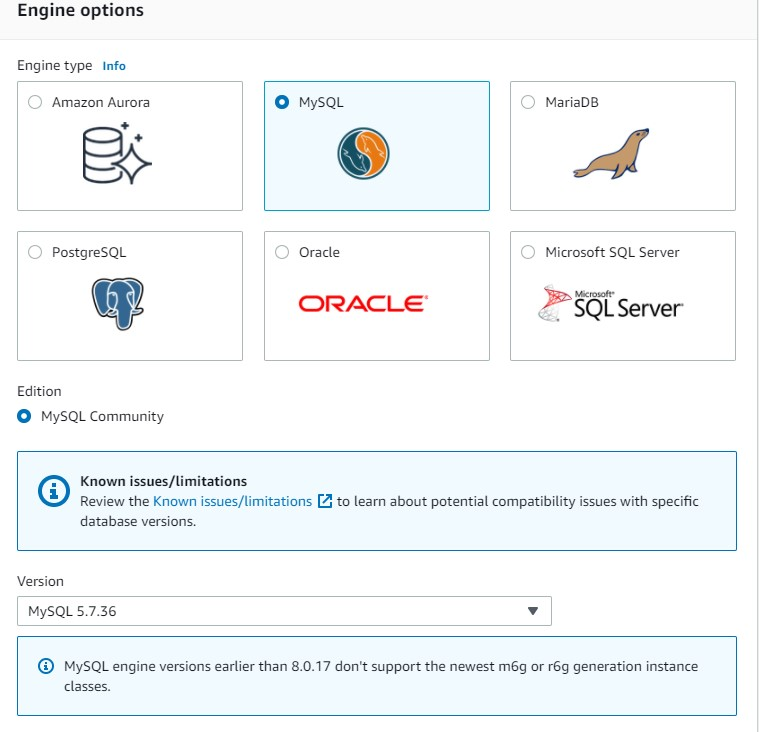

In **Settings** sections we  add the master  password,

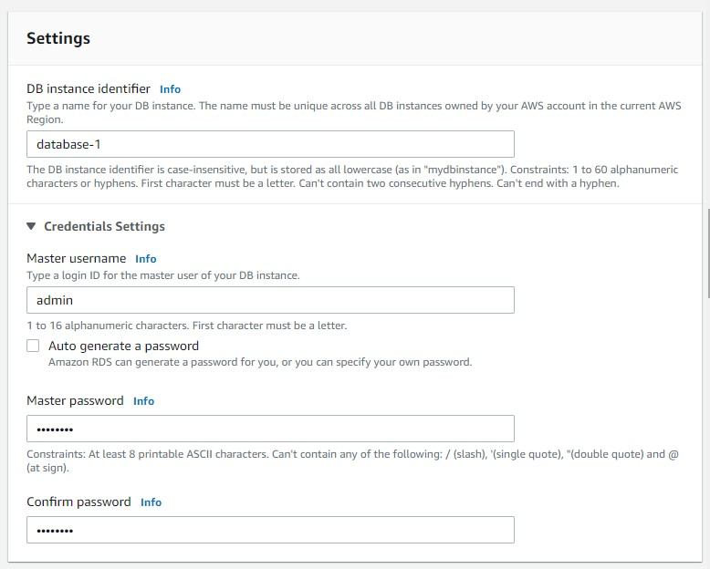

In  **Storage** section we **disable** the storage **autoscaling**, in this example we do not require use this feature


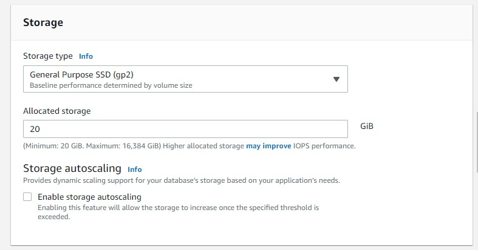


In the **Connectivity** section  we choose for **Public access** Yes


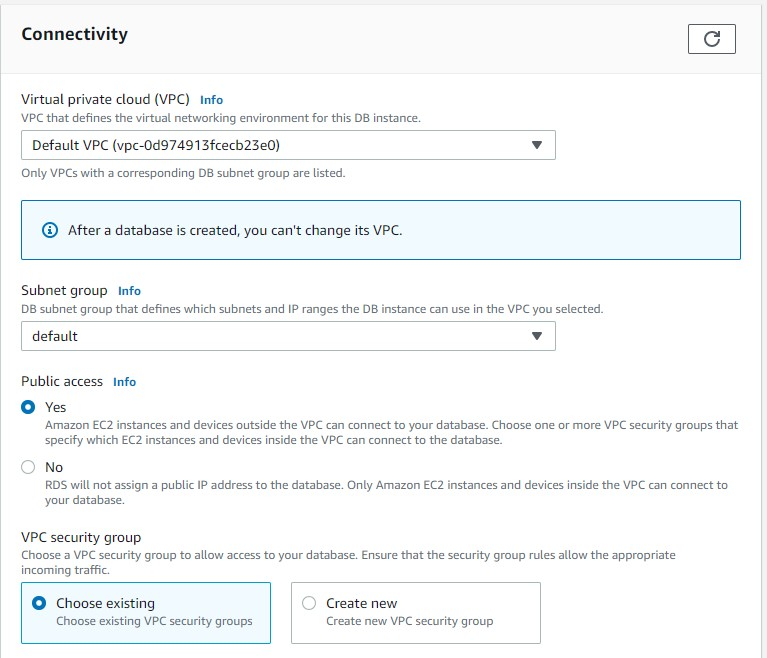

In **Database authentication** section  and we keep the **default settings** and press **Create database**. 

We wait until is created the database.

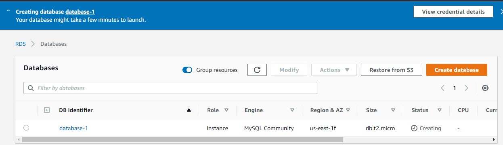


In order to connect to MySQL, you will have to authorize the IP address of the host from which you plan to connect to MySQL. 

You should also revoke access from the CIDR you currently have authorized. If you don’t know your computer’s IP address, you can see it by visiting the site [http://checkip.amazonaws.com/](http://checkip.amazonaws.com/).

 Note that you will have to add “/32” to the end of this to convert the IP address to a CIDR which contains only that IP address. For example, if your IP address is 192.0.2.10, you should authorize access to the CIDR 192.0.2.10/32.

 Go to your **security group**

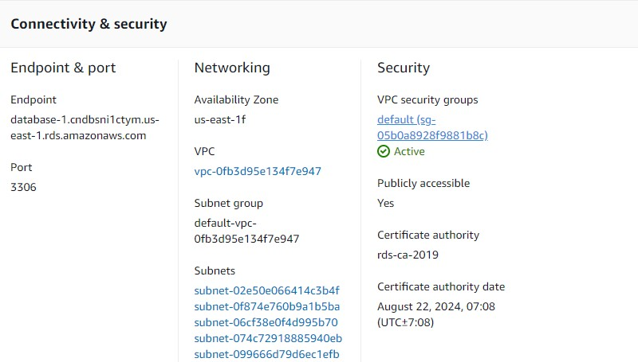

In **Security Groups** click on  Inbound rules 

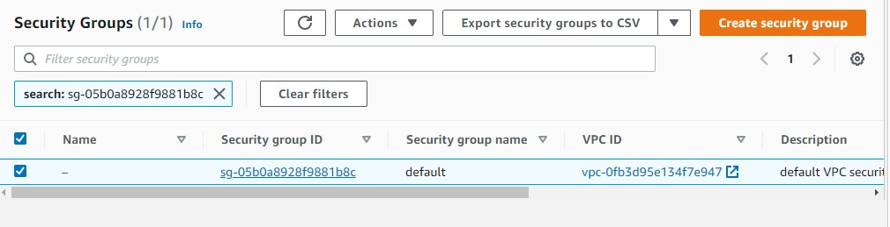

and then edit **inboud rules** and **add rule**

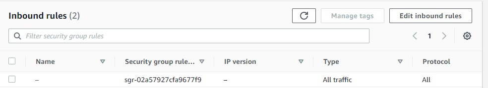

the type we select **MYSQL/Aurora** and for this project let choose as **Source type** **My IP**


and  click **save rules**.

You will have

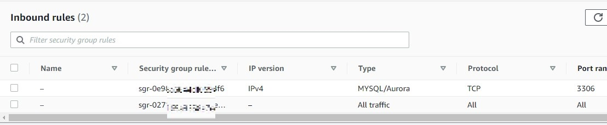

Now is time to connect with our Database.

### Connecting to a DB instance running the MySQL database

After Amazon RDS provisions your DB instance, you can use any standard MySQL client application 


# Connecting  to RDS with  Ubuntu 20.04

Let us create a new  project folder

```
mkdir project
```

```
cd project
```

then type

```
pwd 
```

```
/home/ubuntu/project
```

we will use this folder to download the demo database. 

To install the MySQL command-line client on most DEB-based Linux distributions, run the following command:

```
sudo apt update
```

```
sudo apt-get upgrade
```

```
sudo apt-get install mariadb-client
```

Working with RDSI prefer the MariaDB-client over  `mysql-client-8.0`

To check the version of your MySQL command-line client, run the following command:

```
mysql --version
```

you will get something like

```
ubuntu@ip-132-34-28-92:~/project$ mysql --version
mysql  Ver 15.1 Distrib 10.3.32-MariaDB, for debian-linux-gnu (x86_64) using readline 5.2
```

### Load the Sample Database into MySQL Server

We use the `classicmodels` database as a **MySQL sample database** to help you work with MySQL quickly and effectively. The `classicmodels` database is a retailer of scale models of classic cars database. It contains typical business data such as customers, products, sales orders, sales order line items, etc.

The MySQL sample database schema consists of the following tables:

- **Customers**: stores customer’s data.
- **Products**: stores a list of scale model cars.
- **ProductLines**: stores a list of product line categories.
- **Orders**: stores sales orders placed by customers.
- **OrderDetails**: stores sales order line items for each sales order.
- **Payments**: stores payments made by customers based on their accounts.
- **Employees**: stores all employee information as well as the organization structure such as who reports to whom.
- **Offices**: stores sales office data.

Download the  sample database from to this project

```
wget https://raw.githubusercontent.com/ruslanmv/How-to-create-a-dataframe-in-S3-from-SQL-queries/master/mysqlsampledatabase.sql
```

To get a certificate bundle that contains both the intermediate and root certificates for all AWS Regions, download from https://truststore.pki.rds.amazonaws.com/global/global-bundle.pem

```
wget https://truststore.pki.rds.amazonaws.com/global/global-bundle.pem
```

On the **Connectivity & security** tab, copy the endpoint. Also, note the port number. You need both the endpoint and the port number to connect to the DB instance.


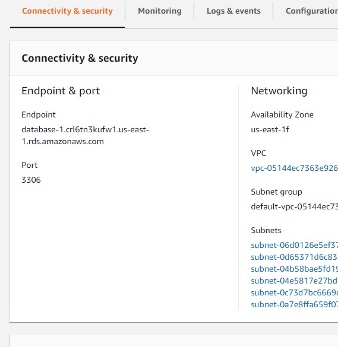

In our **example**

```
Endpoint
database-1.cn1rp959xqj3.us-east-1.rds.amazonaws.com
Port
3306
```

To connect to a DB instance using the MySQL command-line client, enter the following command at a command prompt to connect to a DB instance using the MySQL command-line client.

```
mysql -h database-1.cn1rp959xqj3.us-east-1.rds.amazonaws.com --ssl-ca=global-bundle.pem -P 3306 -u admin -p
```

or

```
mysql -h database-1.cn1rp959xqj3.us-east-1.rds.amazonaws.com -P 3306 -u admin -p
```

 For the **-h** parameter, substitute the DNS name (**endpoint**) for your DB instance. For the **-P** parameter, substitute the **port** for your DB instance. For the **-u** parameter, substitute the **user name** of a valid database user, such as the master user. Enter the master user password when prompted.

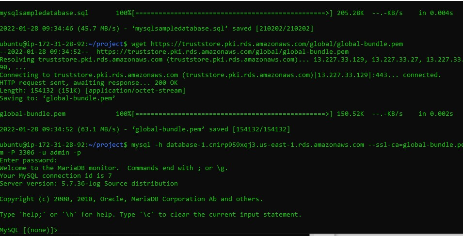


To load to load data into the MySQL Server we can use the `source` command 

```
source /home/ubuntu/project/mysqlsampledatabase.sql
```

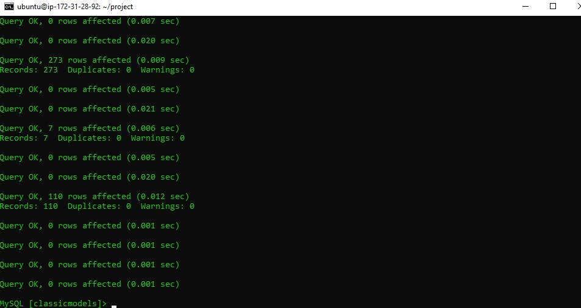


Use the `SHOW DATABASES` command to list all databases in the current server:

```
show databases;
```

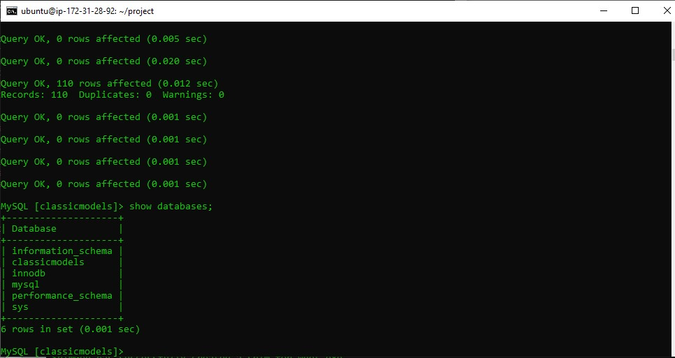

The output will look like the following that includes the newly created `classicmodels` database:

```
+--------------------+
| Database           |
+--------------------+
| classicmodels      |
| information_schema |
| mysql              |
| performance_schema |
| sys                |
+--------------------+
```

```
USE classicmodels;
SELECT * FROM customers;
```

Basically, those statements switch the current database to `classicmodels` and query data from the `customers` table.

 If you see the customer data returned, you have successfully imported the sample database into the MySQL database server.

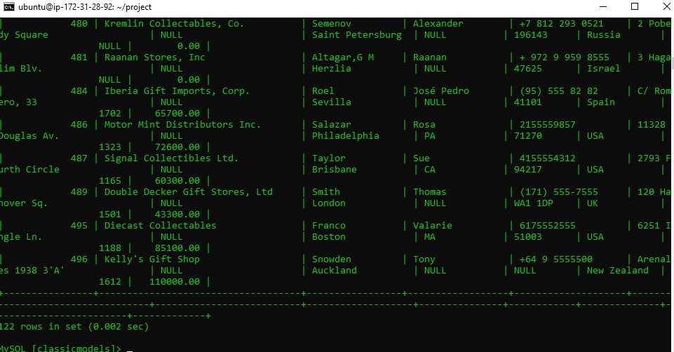

## Connecting to RDS with  Windows 10

We first need to have installed Chocolatey in Windows as explained [here](https://chocolatey.org/install)

Then we open the terminal as admin in windows and we install **wget**

```
choco install wget
```

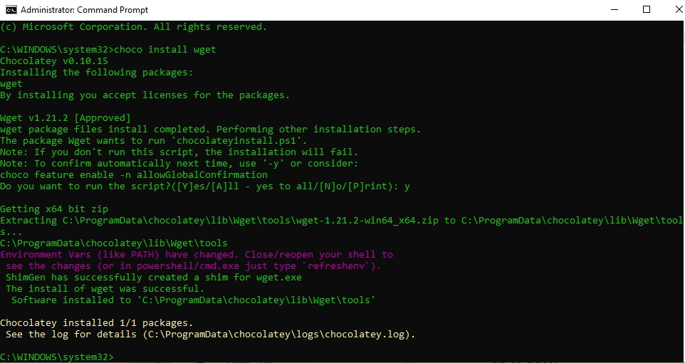

after we installed we can exit from admin and enter again to cmd as normal user and type the following

```
cd \
mkdir project
```

Download the  sample database from to this project

```
wget https://raw.githubusercontent.com/ruslanmv/How-to-create-a-dataframe-in-S3-from-SQL-queries/master/mysqlsampledatabase.sql
```

To get a certificate bundle that contains both the intermediate and root certificates for all AWS Regions, download from https://truststore.pki.rds.amazonaws.com/global/global-bundle.pem

```
wget https://truststore.pki.rds.amazonaws.com/global/global-bundle.pem
```

If you are interes we choose  MySQL Shell on Microsoft Windows using the MSI Installer, so we download the  package from http://dev.mysql.com/downloads/shell/.

When prompted, click Run and follow the steps in the Setup Wizard and finally in the terminal we type

```
mysqlsh -h database-1.cn1rp959xqj3.us-east-1.rds.amazonaws.com -P 3306 -u admin -p
```

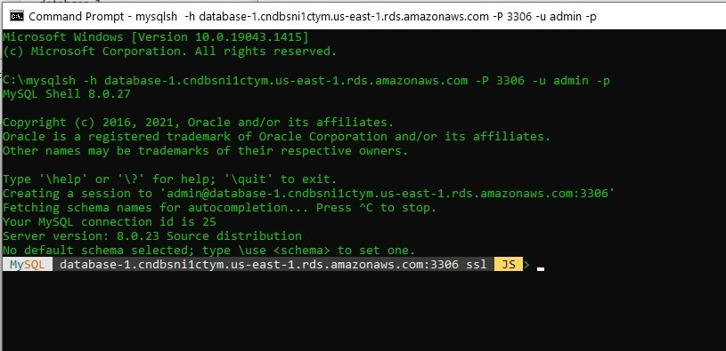

and finally we load to load data into the MySQL Server we can use the `source` command

```
source c:\project\mysqlsampledatabase.sql
```

and to perform actions in SQL format we type

Use the `SHOW DATABASES` command to list all databases in the current server:

```
show databases;
```

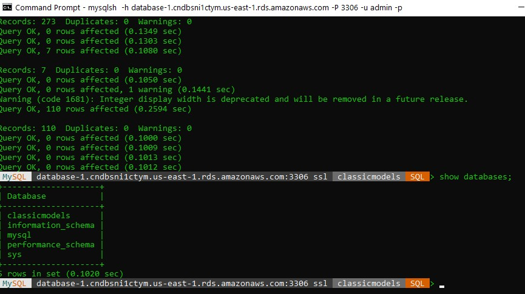

The output will look like the following that includes the newly created `classicmodels` database:

```
+--------------------+
| Database           |
+--------------------+
| classicmodels      |
| information_schema |
| mysql              |
| performance_schema |
| sys                |
+--------------------+
```

```
USE classicmodels;
SELECT * FROM customers;
```

Basically, those statements switch the current database to `classicmodels` and query data from the `customers` table.

 If you see the customer data returned, you have successfully imported the sample database into the MySQL database server.


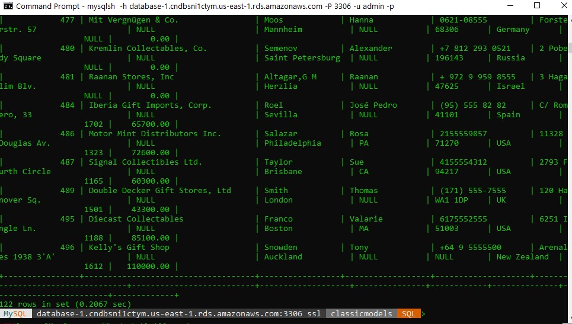

```
SHOW COLUMNS FROM customers;
```

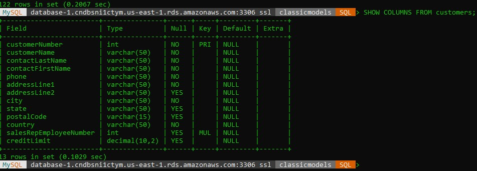

**Congratulations!** We have created a Relational Database and loaded a Database.

