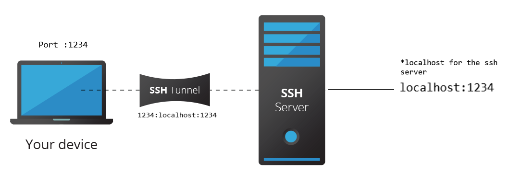
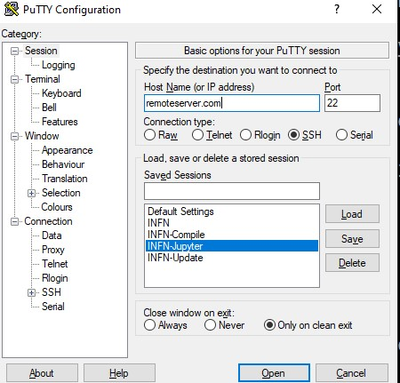
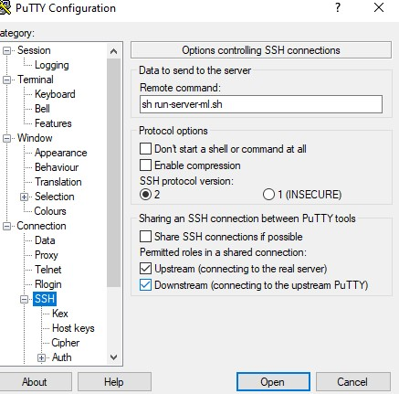
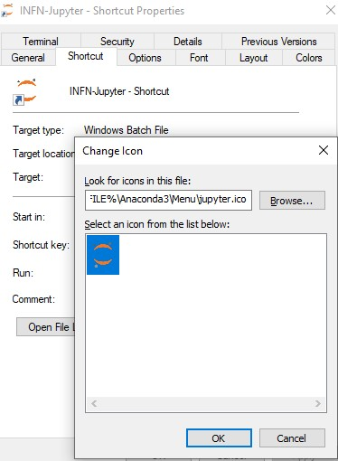

 How to run a  FORTRAN,  program within Python from  Jupyter Notebooks on remote server with SSH?

JupyterLab is a web-based interactive development environment for Jupyter notebooks, code, and data. JupyterLab is flexible: configure and arrange the user interface to support a wide range of workflows in data science, scientific computing, and machine learning. JupyterLab is extensible and modular: write plugins that add new components and integrate with existing ones.

If want to run your old program  FORTRAN code or  C code  within on a remote server without root priviliges in a  Jupyter notebooks . In this post, I will show   to accomplish this. In short, there are  many  ways to access Jupyter Notebooks running on remote server.   We will follow the safest method  by using SSH Tunneling. If you are working on a compute server which runs a linux. The machine is used by several users  and you   don't have and won't get root privileges. And you need  need to install `Keras` which you would normally do by using `pip` , as you know , pip is not installed and the `root` won't install it for us.  Lets try  how  to make an installation of pip that does not try to touch anything outside my local directory.

## Access Server using SSH

Using SSH is the recommended method since it is more secure and easier to setup.  As you may or may not know, when you connect to your remote server and you get the shell access, it is done through ssh. There are two ways general ways to authenticate with the remote server —

- Using password
- Using Pub/Priv Keys

Suppose you have a system on a local or remote network with IP `xx.xx.xx.xx` and you want to connect to it using ssh, the way you do it depends on whether you’re on windows or unix system.

On Unix, you might do something like `ssh username@xx.xx.xx.xx` and then you have to enter a password (password authentication) or you use your private key (which is the more secure method)

 As long as you can connect to your system using SSH, you can run the jupyter notebook there and access it remotely. How? By using SSH Tunneling.

##  SSH Tunneling

This is also known as port forwarding. What this means is that you setup a network tunnel (a connection for data to flow) from a local point to remote point.

Example: `ssh username@xx.xx.xx.xx -NL 1234:localhost:1234` (for Unix)

Look at the above example, `1234:localhost:1234` is the important part. What does it mean? It means that any network request you send to port `1234` in your current system will be automatically forwarded to `localhost:1234` *from the remote system*.



You might have gotten some inkling on how it is possible to use SSH tunneling to access jupyter notebook from the above diagram. Let’s make it clear.

## Anaconda Installation in the Server

The first step is enter to the server via ssh 

```
ssh username@xx.xx.xx.xx
```

where user is your username and xx.xx.xx.xx is your ip or domain of your remote server.

Next step, is create a folder where you will install your  anaconda.

for example

```
mkdir /project/teo/username/
cd  /project/teo/username/
```

Then you can download Anaconda file from this [page](https://www.anaconda.com/download/#linux) using `wget`. You will happily find the file to be a `.sh` file.

Use the following command to install Anaconda (for Python3):

```
wget https://repo.anaconda.com/archive/Anaconda3-2020.11-Linux-x86_64.sh
```

and later you install

```
 bash ./Anaconda3-2020.11-Linux-x86_64.sh
```


then you accep the licesense terms yes

and when it will be asked for the location 

"Anaconda3 will now be installed into this location":

you write the  address

```
/project/teo/username/anaconda3
```


then you select initialize conda with yes

Finally you got


The next step is add the route to  your bash


```
 export PATH="/project/teo/username/anaconda3/bin:$PATH"
```

then you check if is installed

```
$conda --version

conda 4.9.2

```

and you check jupyter

```
$jupyter --version

jupyter core     : 4.6.3
jupyter-notebook : 6.1.4
qtconsole        : 4.7.7
ipython          : 7.19.0
ipykernel        : 5.3.4
jupyter client   : 6.1.7
jupyter lab      : 2.2.6
nbconvert        : 6.0.7
ipywidgets       : 7.5.1
nbformat         : 5.0.8
traitlets        : 5.0.5

```

Great now you have installed Jupyter!!!

#### Conda Activation (Optional)

In such case you forget  to  activate conda you can activate. Manually adding Conda on `$PATH` is no longer recommended as of v4.4.0 (see [Release Notes](https://github.com/conda/conda/releases/tag/4.4.0)). Furthermore, since [Conda v4.6](https://github.com/conda/conda/releases/tag/4.6.0) new functionality to manage shell initialization via the `conda init` command was introduced. Hence, the updated recommendation is to run

```
./project/teo/username/anaconda3/bin/conda init
```

otherwise the manual form you can  see the solution in  [asubuntu.com](https://askubuntu.com/questions/849470/how-do-i-activate-a-conda-environment-in-my-bashrc) or in [stack overflow](https://stackoverflow.com/questions/18675907/how-to-run-conda).

## Installation of Libraries for Python in your Server

You need  need to install `Keras` which you would normally do by using `pip` , as you know , pip is not installed and the `root` .

So you can do this:

Use the following command to install other *software* (SOFTWARE_NAME) by pip:

```py
anaconda3/bin/pip install SOFTWARE_NAME
```

In this case 

```
pip install keras
```


Now we have succesfully installed all our libraries needed in our anaconda server.


## Access Jupyter Notebook


First, make sure you install Jupyter notebook in both remote (working station in your offcie) and local (your home computer).

Whenever you start jupyter notebook, you can access it by going to `localhost:8888` in your browser. But that works because the jupyter is running on *your* `localhost` . What about when the jupyter is running on someone else’s (remote server’s) `localhost` .

So what you need is a way to connect to the remote server’s `localhost`from your local computer. That’s where SSH Tunneling comes into play.

Suppose your server’s IP is `172.26.36.128` as an example. You get shell access to your server using ssh (using any of your preferred method). Then you start the jupyter notebook —


On remote host, open the terminal, change directory to where you have your notebooks and type:

```
jupyter notebook --no-browser --port 8889
```

This will start the jupyter notebook on port `8889` . You will also get a URL with authentication token —


You copy your token, in my case is:

```
ef13dc25b1ce0948a06476de07d86b6258d1e255da53abb7
```

In your local computer,  to start SSH tunneling on unix, open your terminal and enter the following command

```
ssh -N -f -L localhost:8887:localhost:8889 username@172.26.36.128
```

Your terminal will be freeze , don't worry its normal, just  open web browser (google chrome, firefox, ...) and type:

```
localhost:8887
# you will see your Jupyter notebooks asking for a password token
```


Then copy the token  and paste it and login


You will see the Jupyter Notebook running in your browser while the code in the notebook is executed on the remote server. That’s all!


## Run Fortran  Code in Jupyter notebook


There are several ways to run a Fortran code in Jupyter notebook , let us just show two ways.

1. f2py
2. By using the terminal


The purpose of the F2PY –Fortran to Python interface generator– is to provide a connection between Python and Fortran languages. F2PY is a part of [NumPy](https://numpy.org/) (`numpy.f2py`) and also available as a standalone command line tool f2py when numpy is installed that facilitates creating/building Python C/API extension modules that make it possible

- to call Fortran 77/90/95 external subroutines and Fortran 90/95 module subroutines as well as C functions;
- to access Fortran 77 COMMON blocks and Fortran 90/95 module data, including allocatable arrays.

Check out [F2PY's user guide](https://docs.scipy.org/doc/numpy/f2py/) for a more complete reference and installation procedures. From the documentation:

## a) F2PY 

F2PY works by creating an extension module that can be imported in Python using the `import` keyword. The module contains automatically generated wrapper functions that can be called from Python, acting as an interface between Python and the compiled Fortran routines

 First, F2PY reads the Fortran source file and creates a so-called signature file that contains all the necessary information about the Fortran routines needed to make the wrapper functions. The signature file is then read and the source code of the extension module is generated in C, using the Python C API. In the last step, F2PY compiles all the source code and builds the extension module containing the wrappers and the compiled Fortran routines.

Consider a Fortran 77 file `ftype.f`:

Let us copy the following code:

```
C FILE: FTYPE.F
      SUBROUTINE FOO(N)
      INTEGER N
Cf2py integer optional,intent(in) :: n = 13
      REAL A,X
      COMMON /DATA/ A,X(3)
      PRINT*, "IN FOO: N=",N," A=",A," X=[",X(1),X(2),X(3),"]"
      END
C END OF FTYPE.F
```

we open a text file in jupyter


We paste it and we rename


and we have the Fortran code here


We  open a new Terminal in jupyter

and build a wrapper using `f2py -c ftype.f -m ftype`


We create a new jupyter noteebok with python3


Check out [More examples ](https://numpy.org/doc/stable/f2py/python-usage.html#string-arguments) for a more complete reference .


## b) By using the terminal

This is the simples way to run any executable code in a server and stupid, but under situations that there is no way, or time to compile your programs

and your need finish any work on time. Try use this method.

```
#this code can be run using os:
import os
os.system('cmd command')# you can execute any FORTRAN or C compiled program :))
```


## Install Tensorflow in a VAX machine

If you dont have root credentials its a bit hard to compile Tensorflow , because you need to install bazel and Tensorflow source and compile them by using the appropiate version of gcc, if you dont have the control of that is a a really mess.  So there is a trick that fortunatelly worked  to me.

```
conda --version
```

```
conda 4.9.2
```

```
$conda install -c conda-forge tensorflow

```


```
Collecting package metadata (current_repodata.json): done
Solving environment: failed with initial frozen solve. Retrying with flexible solve.
Solving environment: failed with repodata from current_repodata.json, will retry with next repodata source.
Collecting package metadata (repodata.json): done
Solving environment: done

## Package Plan ##

  environment location: /project/teo/ruslan/anaconda3

  added / updated specs:
    - tensorflow


The following packages will be downloaded:

    package                    |            build
    ---------------------------|-----------------
    _tflow_select-2.3.0        |              mkl           2 KB
    absl-py-0.11.0             |   py38h578d9bd_0         169 KB  conda-forge
    aiohttp-3.7.3              |   py38h25fe258_0         619 KB  conda-forge
    astor-0.8.1                |     pyh9f0ad1d_0          25 KB  conda-forge
    astunparse-1.6.3           |             py_0          17 KB
    async-timeout-3.0.1        |          py_1000          11 KB  conda-forge
    blinker-1.4                |             py_1          13 KB  conda-forge
    c-ares-1.17.1              |       h36c2ea0_0         111 KB  conda-forge
    cachetools-4.1.1           |             py_0          12 KB  conda-forge
    conda-4.9.2                |   py38h578d9bd_0         3.0 MB  conda-forge
    gast-0.3.3                 |             py_0          12 KB  conda-forge
    google-auth-1.24.0         |     pyhd3deb0d_0          62 KB  conda-forge
    google-auth-oauthlib-0.4.1 |             py_2          18 KB  conda-forge
    google-pasta-0.2.0         |     pyh8c360ce_0          42 KB  conda-forge
    grpcio-1.33.2              |   py38heead2fc_2         1.9 MB  conda-forge
    keras-preprocessing-1.1.0  |             py_0          33 KB  conda-forge
    libprotobuf-3.13.0.1       |       h8b12597_0         2.3 MB  conda-forge
    markdown-3.3.3             |     pyh9f0ad1d_0          66 KB  conda-forge
    multidict-4.7.5            |   py38h1e0a361_2          71 KB  conda-forge
    oauthlib-3.0.1             |             py_0          82 KB  conda-forge
    opt_einsum-3.3.0           |             py_0          51 KB  conda-forge
    protobuf-3.13.0.1          |   py38hadf7658_1         702 KB  conda-forge
    pyasn1-0.4.8               |             py_0          53 KB  conda-forge
    pyasn1-modules-0.2.7       |             py_0          60 KB  conda-forge
    pyjwt-1.7.1                |             py_0          17 KB  conda-forge
    python_abi-3.8             |           1_cp38           4 KB  conda-forge
    requests-oauthlib-1.3.0    |     pyh9f0ad1d_0          21 KB  conda-forge
    rsa-4.6                    |     pyh9f0ad1d_0          27 KB  conda-forge
    tensorboard-2.4.0          |     pyhd8ed1ab_0         8.8 MB  conda-forge
    tensorboard-plugin-wit-1.7.0|     pyh9f0ad1d_0         664 KB  conda-forge
    tensorflow-2.2.0           |mkl_py38h6d3daf0_0           4 KB
    tensorflow-base-2.2.0      |mkl_py38h5059a2d_0       127.2 MB
    tensorflow-estimator-2.2.0 |     pyh95af2a2_0         281 KB  conda-forge
    termcolor-1.1.0            |             py_2           6 KB  conda-forge
    typing-extensions-3.7.4.3  |                0           8 KB  conda-forge
    yarl-1.6.3                 |   py38h25fe258_0         142 KB  conda-forge
    ------------------------------------------------------------
                                           Total:       146.6 MB

The following NEW packages will be INSTALLED:

```


```
$ conda install -c conda-forge keras
```

```
Collecting package metadata (current_repodata.json): done
Solving environment: done

## Package Plan ##

  environment location: /project/teo/ruslan/anaconda3

  added / updated specs:
    - keras


The following packages will be downloaded:

    package                    |            build
    ---------------------------|-----------------
    keras-2.4.3                |             py_0          30 KB  conda-forge
    ------------------------------------------------------------
                                           Total:          30 KB

The following NEW packages will be INSTALLED:

  keras              conda-forge/noarch::keras-2.4.3-py_0


Proceed ([y]/n)? y
```

after that in the server you type

```
jupyter notebook --no-browser --port 8889
```

and in your local computer

```
ssh -N -f -L localhost:8887:localhost:8889 username@yourremoteserver
```

and later you open your favorite browser and type

```
localhost:8887
```

and you can create a new python noteboook

```
import numpy as np

import tensorflow as tf

import keras

tf.version.VERSION

keras.__version__
msg = tf.constant('Hello, TensorFlow!')
tf.print(msg)
```

and you got something like


## Extra tricks: Automatic Login in Windows


If your local computer is windows and you want shortcut that summarize everything  to do the  automatic login you can. This is a trick that worked to me.

I assume that you have Chrome, Windows 10 and Putty

In your remote computer you create a file, in your home folder

**run-server-ml.sh**  with the lines:

```
jupyter notebook --no-browser --port 8889
```

and in Putty you create  a session which I called INFN-Jupyter





and




You save the session. Then in your local computer you create  batch file called

**INFN-Jupyter.bat**  with :

```
@echo off
title We are starting Jupyter Notebook!
echo Welcome to the  Jupyter Notebook batch!
START C:\"Program Files"\PuTTY\putty.exe -load INFN-Jupyter
echo We are performing the ssh tunnel on your local computer!
ssh -N -f -L localhost:8887:localhost:8889 username@remoteserver.com
cd "C:\Program Files (x86)\Google\Chrome\Application\"
start /d "C:\Program Files (x86)\Google\Chrome\Application\" chrome.exe http://localhost:8887
```


and finally just you create  shortcut to your Desktop with your favorite icon




and **wuallaa** you have your Jupyter notebook linked to your **remote server** in your **local machine**


## Conclusion

This is how you access jupyter notebook from a remote server. Some additional things you can do is run the SSH Tunnel command and Jupyter notebook command in the background. So you can have a jupyter notebook perpetually running on some dedicated port.

Thank you for reading!

**Congratulation** we have  created  SSH Tunnel within Jupiter Notebook compatible with Tensorflow, Keras and Fortran 77.


