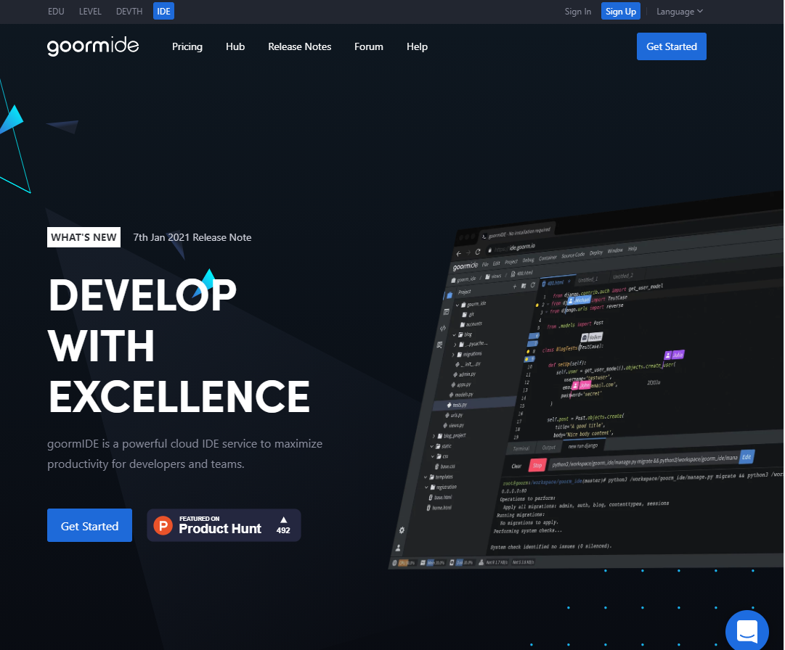
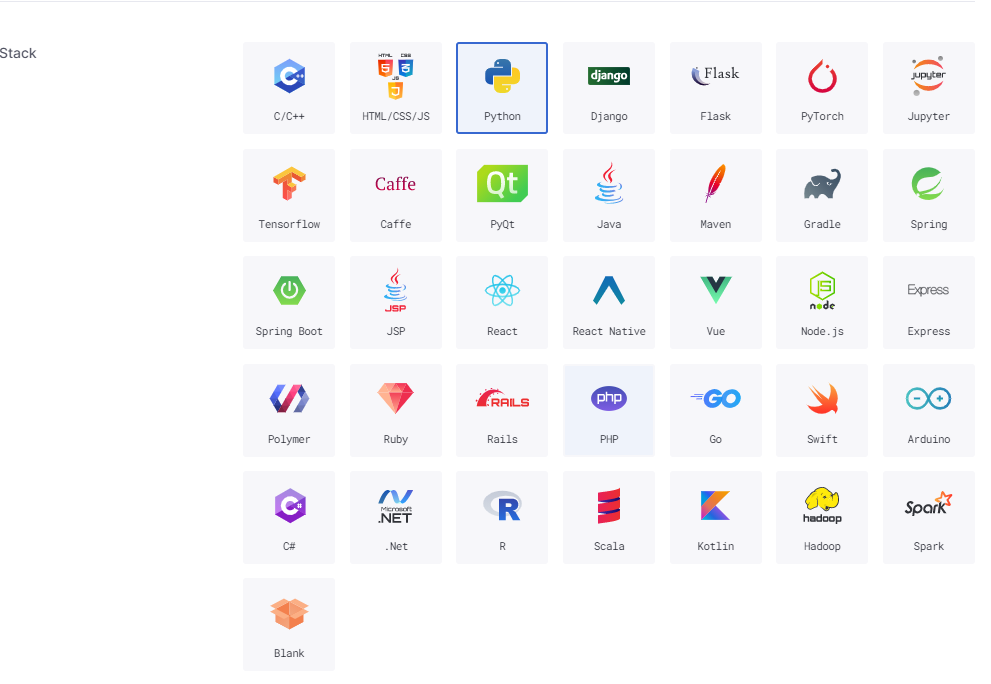
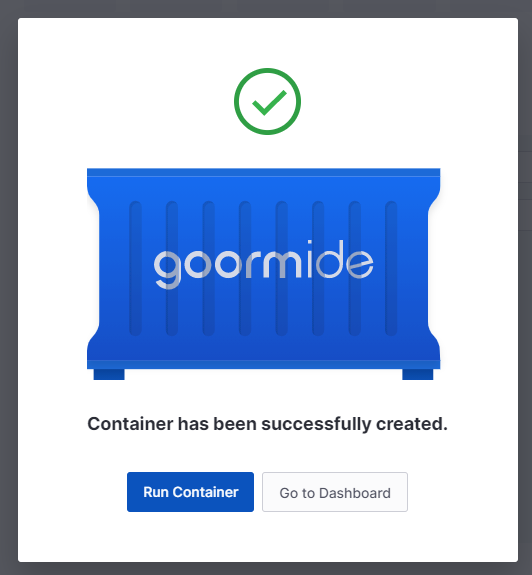
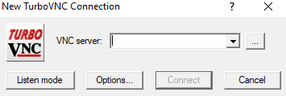
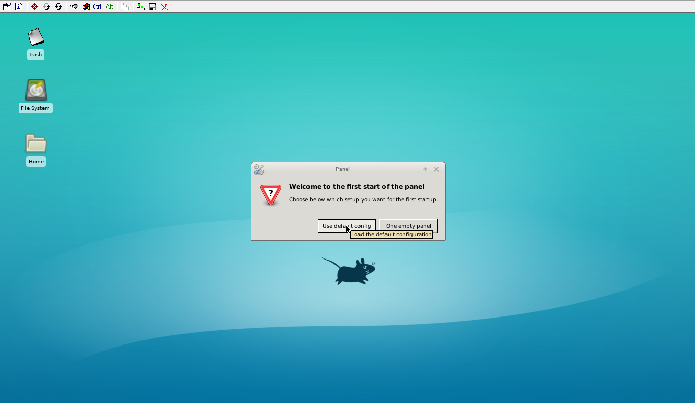

## Sign up to Goormide Platform

Enter to  <a href="https://ide.goorm.io/" target="_blank">Goormide</a> , click “Get Started” button. You will redirect to login page. You can directly login using your Google, Facebook and GitHub or click sign up link. They ask additional information if you want you can skip that.




## Create a Container to Run VPS

After sign in, go to the dashboard and click on “Create new container”. You can create up to 5 contains for your educational purposes. In the new page, type a name and description about your project.


Select a region and set visibility mode as private. if you use it as public anyone can access your VPS so keep it as private.


Leave default settings for template, deployment and GPU. 





Change stack as Python and select preferred OS for you. In this tutorial I use Ubuntu 18.04.


After settings all of these, click “create” button at the top right corner of the page.


Now your container is being ready to deploy. After the container has successfully created, click “Run Container” button.




## Setup Desktop Environment and Stabilized RDP Connection

Goormide is starting now. In this part, carefully watch the video without skip. You will be redirected to Goormide workshop.

First, update list of packages using following command.

```
 sudo apt update
```

Now, install VNC server using this command.

```
sudo apt -y install vnc4server
```

Next, Install Ubuntu desktop environment for RDP use.

```
sudo apt install xfce4 xfce4-goodies -y 
```

Here, selects a region by number for keyboard layout. Type more to get another region as well. Then type the number of the region and press enter. Again, select keyboard layout with language using numbers.

To set a password for VNC server type this code. Then, enter your password and verify it by reentering. It is not visible due to security reason, don’t get confused just type and press enter.

```
vncpasswd
```

Set up VNC viewer resolution using this command line. Now, the process is finished don’t closed the terminal window. You can use **any resolution** for this.

```
sudo vncserver -geometry 1366x768
```

## Setup Port Forwarding and Connect RDP

[Download VNC Viewer](https://sourceforge.net/projects/turbovnc/) Go to the Goormide dashboard using a new tab. Click a setting icon of the container. You will redirect to a new page. Under port forwarding, click “new” button to add a new record. Use custom port type and add internal port as **5901** then click “done” button.


Now copy the server IP under command of the newly added tab. Then open VNC viewer application and enter server IP that you copied, after click “connect” button. 




If you don’t have VNC viewer check the description for download link. Enter your password that you set in step 3.

Now your Ubuntu VPS is finished.




**Congratulation** we have  created a Virtual Server with VNC for free.

Let me thank to  **MineX Tuts**  for the method.