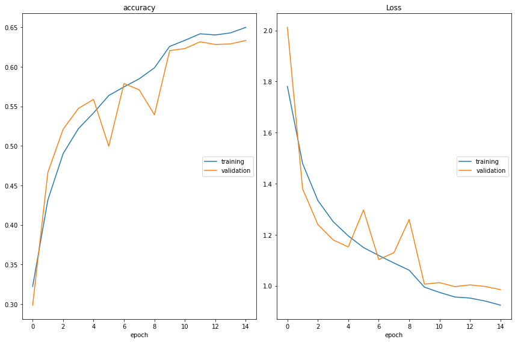
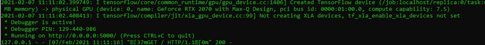
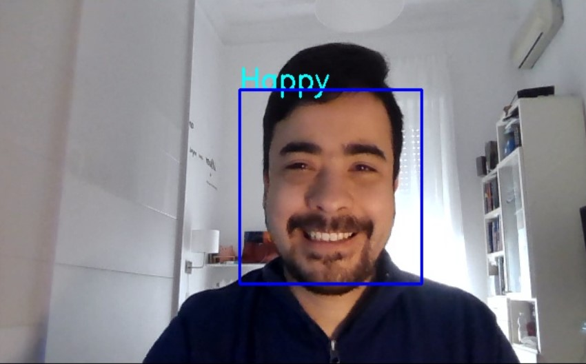
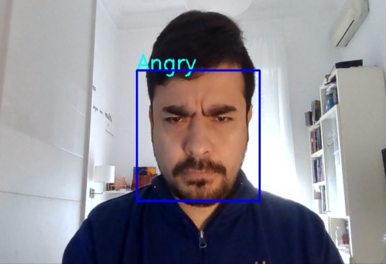
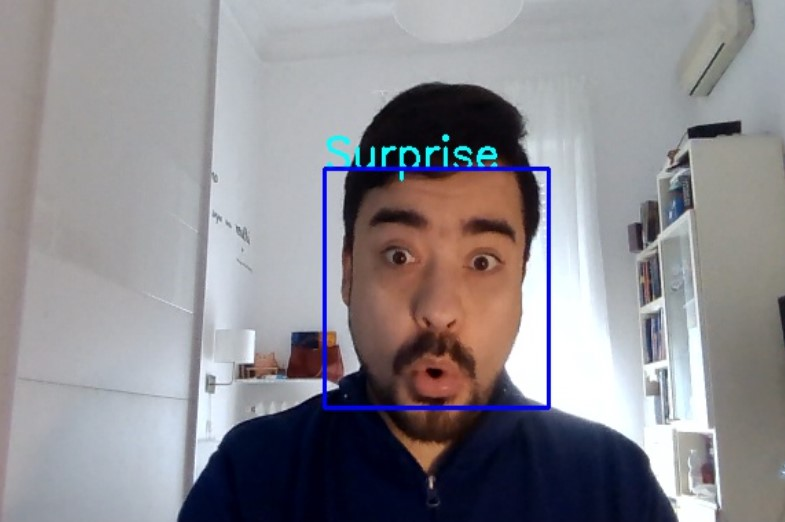

 

Today we are going to present an interesting project to detect the expression in videos in a  camera or movies.


## What is Sentiment Analysis?

Sentiment analysis (also known as opinion mining or emotion AI) refers to the use of natural language processing, text analysis, computational linguistics, and biometrics to systematically identify, extract, quantify, and study affective states and subjective information.


##### Emotion detection

Predictive analytics is an area of statistics that deals with extracting information from data and using it to predict trends and behavior patterns.

### Task 1: Import Libraries


```python
#pip install livelossplot==0.5.2
```


```python
#pip install keras
```


```python
import numpy as np
import seaborn as sns
import matplotlib.pyplot as plt
import utils
import os
%matplotlib inline

from tensorflow.keras.preprocessing.image import ImageDataGenerator
from tensorflow.keras.layers import Dense, Input, Dropout,Flatten, Conv2D
from tensorflow.keras.layers import BatchNormalization, Activation, MaxPooling2D
from tensorflow.keras.models import Model, Sequential
from tensorflow.keras.optimizers import Adam
from tensorflow.keras.callbacks import ModelCheckpoint, ReduceLROnPlateau
from tensorflow.keras.utils import plot_model

from IPython.display import SVG, Image
from livelossplot import PlotLossesKeras
#from livelossplot import PlotLossesTensorFlowKeras
import tensorflow as tf
print("Tensorflow version:", tf.__version__)
```

    Tensorflow version: 2.4.1


```python

```

### Task 2: Plot Sample Image


```python
utils.datasets.fer.plot_example_images(plt).show()
```


​    

​    


```python
for expression in os.listdir("train/"):
    print(str(len(os.listdir("train/"+expression)))+ " "+ expression + " images")
```

    3995 angry images
    436 disgust images
    4097 fear images
    7215 happy images
    4965 neutral images
    4830 sad images
    3171 surprise images


### Task 3: Generate Training and Validation Batches


```python
img_size  = 48
batch_size = 64

datagen_train = ImageDataGenerator(horizontal_flip=True)
train_generator = datagen_train.flow_from_directory("train/",
                                                    target_size=(img_size, img_size),
                                                    color_mode='grayscale',
                                                    batch_size=batch_size,
                                                    class_mode='categorical',
                                                    shuffle=True)

datagen_validation = ImageDataGenerator(horizontal_flip=True)
validation_generator = datagen_train.flow_from_directory("test/",
                                                    target_size=(img_size, img_size),
                                                    color_mode='grayscale',
                                                    batch_size=batch_size,
                                                    class_mode='categorical',
                                                    shuffle=True)
```

    Found 28709 images belonging to 7 classes.
    Found 7178 images belonging to 7 classes.


```python

```

 

### Task 4: Create CNN Model


Inspired by Goodfellow, I.J., et.al. (2013). Challenged in representation learning: A report of three machine learning contests. *Neural Networks*, 64, 59-63. [doi:10.1016/j.neunet.2014.09.005](https://arxiv.org/pdf/1307.0414.pdf)


```python
model = Sequential()

#1 - conv
model.add(Conv2D(64, (3,3), padding = 'same', input_shape=(48,48,1)))
model.add(BatchNormalization())
model.add(Activation('relu'))
model.add(MaxPooling2D(pool_size=(2,2)))
model.add(Dropout(0.25))

#2 - conv layer
model.add(Conv2D(128, (5,5), padding = 'same'))
model.add(BatchNormalization())
model.add(Activation('relu'))
model.add(MaxPooling2D(pool_size=(2,2)))
model.add(Dropout(0.25))


# 3- conv layer
model.add(Conv2D(512, (3,3), padding = 'same'))
model.add(BatchNormalization())
model.add(Activation('relu'))
model.add(MaxPooling2D(pool_size=(2,2)))
model.add(Dropout(0.25))


# 4 - conv layer
model.add(Conv2D(512, (3,3), padding = 'same'))
model.add(BatchNormalization())
model.add(Activation('relu'))
model.add(MaxPooling2D(pool_size=(2,2)))
model.add(Dropout(0.25))

model.add(Flatten())

model.add(Dense(256))
model.add(BatchNormalization())
model.add(Activation('relu'))
model.add(Dropout(0.25))

model.add(Dense(512))
model.add(BatchNormalization())
model.add(Activation('relu'))
model.add(Dropout(0.25))


model.add(Dense(7,activation='softmax'))
opt = Adam(lr=0.0005)
model.compile(optimizer=opt, loss='categorical_crossentropy', metrics=['accuracy'])
model.summary()

```

    Model: "sequential"
    _________________________________________________________________
    Layer (type)                 Output Shape              Param #   
    =================================================================
    conv2d (Conv2D)              (None, 48, 48, 64)        640       
    _________________________________________________________________
    batch_normalization (BatchNo (None, 48, 48, 64)        256       
    _________________________________________________________________
    activation (Activation)      (None, 48, 48, 64)        0         
    _________________________________________________________________
    max_pooling2d (MaxPooling2D) (None, 24, 24, 64)        0         
    _________________________________________________________________
    dropout (Dropout)            (None, 24, 24, 64)        0         
    _________________________________________________________________
    conv2d_1 (Conv2D)            (None, 24, 24, 128)       204928    
    _________________________________________________________________
    batch_normalization_1 (Batch (None, 24, 24, 128)       512       
    _________________________________________________________________
    activation_1 (Activation)    (None, 24, 24, 128)       0         
    _________________________________________________________________
    max_pooling2d_1 (MaxPooling2 (None, 12, 12, 128)       0         
    _________________________________________________________________
    dropout_1 (Dropout)          (None, 12, 12, 128)       0         
    _________________________________________________________________
    conv2d_2 (Conv2D)            (None, 12, 12, 512)       590336    
    _________________________________________________________________
    batch_normalization_2 (Batch (None, 12, 12, 512)       2048      
    _________________________________________________________________
    activation_2 (Activation)    (None, 12, 12, 512)       0         
    _________________________________________________________________
    max_pooling2d_2 (MaxPooling2 (None, 6, 6, 512)         0         
    _________________________________________________________________
    dropout_2 (Dropout)          (None, 6, 6, 512)         0         
    _________________________________________________________________
    conv2d_3 (Conv2D)            (None, 6, 6, 512)         2359808   
    _________________________________________________________________
    batch_normalization_3 (Batch (None, 6, 6, 512)         2048      
    _________________________________________________________________
    activation_3 (Activation)    (None, 6, 6, 512)         0         
    _________________________________________________________________
    max_pooling2d_3 (MaxPooling2 (None, 3, 3, 512)         0         
    _________________________________________________________________
    dropout_3 (Dropout)          (None, 3, 3, 512)         0         
    _________________________________________________________________
    flatten (Flatten)            (None, 4608)              0         
    _________________________________________________________________
    dense (Dense)                (None, 256)               1179904   
    _________________________________________________________________
    batch_normalization_4 (Batch (None, 256)               1024      
    _________________________________________________________________
    activation_4 (Activation)    (None, 256)               0         
    _________________________________________________________________
    dropout_4 (Dropout)          (None, 256)               0         
    _________________________________________________________________
    dense_1 (Dense)              (None, 512)               131584    
    _________________________________________________________________
    batch_normalization_5 (Batch (None, 512)               2048      
    _________________________________________________________________
    activation_5 (Activation)    (None, 512)               0         
    _________________________________________________________________
    dropout_5 (Dropout)          (None, 512)               0         
    _________________________________________________________________
    dense_2 (Dense)              (None, 7)                 3591      
    =================================================================
    Total params: 4,478,727
    Trainable params: 4,474,759
    Non-trainable params: 3,968
    _________________________________________________________________


```python
import tensorflow as tf
tf.__version__

```


    '2.4.1'


```python
import keras
keras.__version__
```


```python
from tensorflow.python.client import device_lib
print(device_lib.list_local_devices())
```

    [name: "/device:CPU:0"
    device_type: "CPU"
    memory_limit: 268435456
    locality {
    }
    incarnation: 12273973991680633869
    , name: "/device:GPU:0"
    device_type: "GPU"
    memory_limit: 6529366361
    locality {
      bus_id: 1
      links {
      }
    }
    incarnation: 9993362731094214836
    physical_device_desc: "device: 0, name: GeForce RTX 2070 with Max-Q Design, pci bus id: 0000:01:00.0, compute capability: 7.5"
    ]


 

### Task 6: Train and Evaluate Model


```python
epochs = 15
steps_per_epoch = train_generator.n//train_generator.batch_size
validation_steps = validation_generator.n//validation_generator.batch_size

checkpoint = ModelCheckpoint("model_weights.h5", monitor = 'val_acccuracy',
                            save_weigths_only=True, mode='max', verbose=1)
reduce_lr = ReduceLROnPlateau(monitor='val_loss', factor = 0.1, patience =2, min_lr=0.00001, model = 'auto')

#callbacks = [PlotLossesCallback(), checkpoint, recduce_lr]
callbacks = [ PlotLossesKeras(), checkpoint, reduce_lr]
history = model.fit(
    x=train_generator,
    steps_per_epoch=steps_per_epoch,
    epochs=epochs,
    validation_data=validation_generator,
    validation_steps=validation_steps,
    callbacks=callbacks
)
```


​    

​    


    accuracy
    	training         	 (min:    0.322, max:    0.650, cur:    0.650)
    	validation       	 (min:    0.299, max:    0.633, cur:    0.633)
    Loss
    	training         	 (min:    0.924, max:    1.781, cur:    0.924)
    	validation       	 (min:    0.985, max:    2.012, cur:    0.985)
    
    Epoch 00015: saving model to model_weights.h5


### Task 7: Represent Model as JSON String


```python
model_json = model.to_json()
with open ("model.json", "w") as json_file:
    json_file.write(model_json)
```


```python
Task 8 we create a Flask application callend main.py
```


```python
from flask import Flask, render_template, Response
from camera import VideoCamera


app = Flask(__name__)

@app.route('/')
def index():
    return render_template('index.html')

def gen(camera):
    while True:
        frame = camera.get_frame()
        yield (b'--frame\r\n'
               b'Content-Type: image/jpeg\r\n\r\n' + frame + b'\r\n\r\n')

@app.route('/video_feed')
def video_feed():
    return Response(gen(VideoCamera()),
                    mimetype='multipart/x-mixed-replace; boundary=frame')

if __name__ == '__main__':
    app.run(host='0.0.0.0', debug=True)

```

Task 9 we setup the video source,

We create a application to read the source:


 #self.video = cv2.VideoCapture("/home/user/Desktop/Project/videos/facial_exp.mkv") # in Linux


#self.video = cv2.VideoCapture(r"C:\Users\user\Desktop\Project\videos\facial_exp.mkv") # in Windows


self.video = cv2.VideoCapture(0) # in with your Webcam


```python
import cv2
from model import FacialExpressionModel
import numpy as np

facec = cv2.CascadeClassifier('haarcascade_frontalface_default.xml')
model = FacialExpressionModel("model.json", "model_weights.h5")
font = cv2.FONT_HERSHEY_SIMPLEX

class VideoCamera(object):
    def __init__(self):
        #self.video = cv2.VideoCapture("/home/user/Desktop/Project/videos/facial_exp.mkv") # in Linux
        #self.video = cv2.VideoCapture(r"C:\Users\user\Desktop\Project\videos\facial_exp.mkv") # in Windows
        self.video = cv2.VideoCapture(0) # in with your Webcam

    def __del__(self):
        self.video.release()

    # returns camera frames along with bounding boxes and predictions
    def get_frame(self):
        _, fr = self.video.read()
        gray_fr = cv2.cvtColor(fr, cv2.COLOR_BGR2GRAY)
        faces = facec.detectMultiScale(gray_fr, 1.3, 5)

        for (x, y, w, h) in faces:
            fc = gray_fr[y:y+h, x:x+w]

            roi = cv2.resize(fc, (48, 48))
            pred = model.predict_emotion(roi[np.newaxis, :, :, np.newaxis])

            cv2.putText(fr, pred, (x, y), font, 1, (255, 255, 0), 2)
            cv2.rectangle(fr,(x,y),(x+w,y+h),(255,0,0),2)

        _, jpeg = cv2.imencode('.jpg', fr)
        return jpeg.tobytes()

```


Task 9 Test your program

We just go to the folder where you have created all your programs and run  the following command

`python main.py`

later you got the following





and later to go to your  web browser 

and put

http://localhost:5000/

and after that you got  your home application with Artificial Intelligence that recognize your  


| Happy                                                        | Angry                                                        |
| ------------------------------------------------------------ | ------------------------------------------------------------ |
|  |  |


| Surprise                                                     | Neutral                                                      |
| ------------------------------------------------------------ | ------------------------------------------------------------ |
|  |  |


**Congratulations!**  We have applied  Neural Networks in Tensorflow to recognize facial expressions