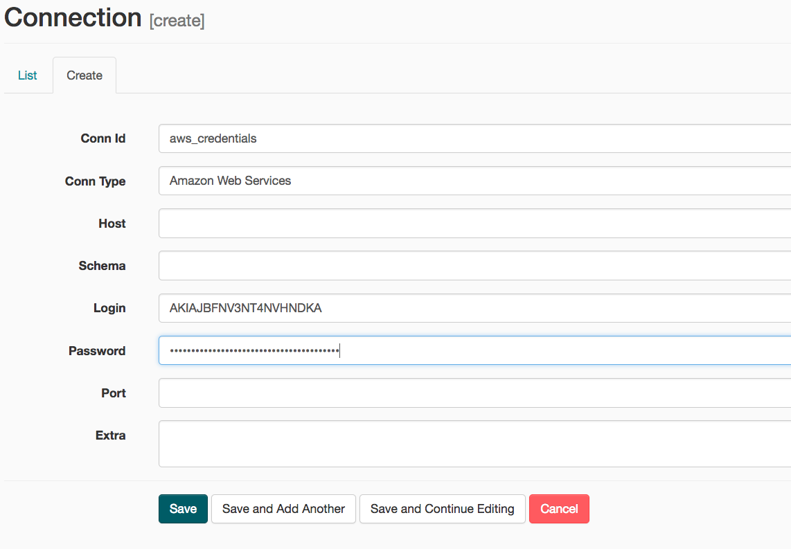
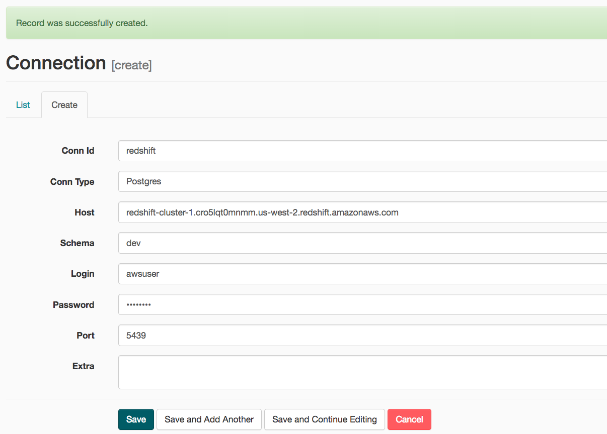

A music streaming company, Sparkify, has decided that it is time to introduce more automation and monitoring to their data warehouse ETL pipelines and come to the conclusion that the best tool to achieve this is Apache Airflow.

They have decided to bring you into the project and expect you to create high grade data pipelines that are dynamic and built from reusable tasks, can be monitored, and allow easy backfills. They have also noted that the data quality plays a big part when analyses are executed on top the data warehouse and want to run tests against their datasets after the ETL steps have been executed to catch any discrepancies in the datasets.

The source data resides in S3 and needs to be processed in Sparkify's data warehouse in Amazon Redshift. The source datasets consist of JSON logs that tell about user activity in the application and JSON metadata about the songs the users listen to.

# Project Overview

This project will introduce you to the core concepts of Apache Airflow. To complete the project, you will need to create your own custom operators to perform tasks such as staging the data, filling the data warehouse, and running checks on the data as the final step.

We have provided you with a project template that takes care of all the imports and provides four empty operators that need to be implemented into functional pieces of a data pipeline. The template also contains a set of tasks that need to be linked to achieve a coherent and sensible data flow within the pipeline.

You'll be provided with a helpers class that contains all the SQL transformations. Thus, you won't need to write the ETL yourselves, but you'll need to execute it with your custom operators.


Example DAG

There are different ways to install **Airflow**, I will present two ways, one is given by the using of containers such **Docker** and the other manual.  

* Airflow automatic  with Container
* Airflow manual with  MacOS

Depending  your purposes I will show both of them.

For the Project of **Udacity** is easier follow the **automatic**  but if you want to keep more control for deployments of your work. You can try the manual.

# Requirements 

* Install [Anaconda](https://www.anaconda.com/products/individual) with  [Python3.7](https://www.python.org/downloads/)
* Install [Docker](https://www.docker.com/)
* Install [Docker Compose](https://docs.docker.com/compose/install/)
* [AWS](https://aws.amazon.com/) account and [Redshift](https://aws.amazon.com/redshift/) cluster 

For this project, you'll be working with two datasets. Here are the s3 links for each:

- Log data: `s3://udacity-dend/log_data`
- Song data: `s3://udacity-dend/song_data`

# Objective

We would like to construct a flow like this


## PART 1 - Airflow installation (automatic)

Follow these steps to install Airflow 

1 - Open a Terminal window.

Navigate to your Desktop in your Terminal. We are going to create a working directory here but you can create anywhere else in your file system if you like.

```
cd Documents
```

2 - Clone repository to local machine

```
git clone https://github.com/ruslanmv/Data-Pipeline-with-Airflow.git
```

3 - Change to Data-Pipeline-with-Airflow directory in your Terminal.

```
cd Data-Pipeline-with-Airflow
```


4  - Create a virtual environment using coda (or any other tool). Install Python 3.7 in your virtual environment. I’m going to call the environment airflow-tutorial.( with Python 3.8 + the current script of docker-compose.yml doesnt work.  )

```
conda create --name airflow-pipeline python=3.7
```

5 -  Activate the virtual environment

```
conda activate airflow-pipeline
```

6 - We  install the dependency needed

```
pip install -r requirements.txt 
```


7 - Print the absolute path to your working directory by typing pwd.

I get `/Users/ruslan/Documents/Data-Pipeline-with-Airflow` but you might get something different. Copy this path

7 - Set the path as the AIRFLOW_HOME environment variable. Note that you have to do this every time you open a new Terminal window and wish to use the Airflow CLI. Alternatively, you can set a permanent environment variable in your bash_profile.

```
export AIRFLOW_HOME=/Users/ruslan/Documents/Data-Pipeline-with-Airflow
```

8-Start Airflow container

Everything is configured in the docker-compose.yml file.
If you are satisfied with the default configurations you can just start the containers.

```
docker-compose up
```


Aftet this step you should wait until your screen says that is ready


9 -Open the Airflow UI

Go to your web browswer and type  http://localhost:8080


Username: **user** 

Password: **password**

Congratulation we have done the Part 1. In the following Part 2 we create the Redshift Cluster on AWS.

If you followed the **automatic** method skip the **manual** installation. and go to Part 2

## PART 1 - Airflow installation (manual)

The first step in the Installation of the Airflow on your local system, I am using Mac OS

Follow these steps to install Airflow on Mac.

1 -  Open a Terminal window.

2 - Navigate to your Desktop in your Terminal. We are going to create a working directory here but you can create anywhere else in your file system if you like.

```
cd Documents
```

3 - Create a working directory here called Data-Pipeline-with-Airflow by clonning the repo

```
git clone https://github.com/ruslanmv/Data-Pipeline-with-Airflow.git
```

4 - Change to Data-Pipeline-with-Airflow directory in your Terminal.

```
cd Data-Pipeline-with-Airflow
```

5 - Create a virtual environment using coda (or any other tool). Install Python 3.7 in your virtual environment. I’m going to call the environment airflow-tutorial.

```
conda create --name airflow-pipeline python=3.7
```

6 - Activate the virtual environment

```
conda activate airflow-pipeline
```

7 - Print the absolute path to your working directory by typing pwd.

I get `/Users/ruslan/Documents/Data-Pipeline-with-Airflow` but you might get something different. Copy this path

8 - Set the path as the AIRFLOW_HOME environment variable. Note that you have to do this every time you open a new Terminal window and wish to use the Airflow CLI. Alternatively, you can set a permanent environment variable in your bash_profile.

```
export AIRFLOW_HOME=/Users/ruslan/Documents/Data-Pipeline-with-Airflow
```

By default, airflow uses ~/airflow as it’s AIRFLOW_HOME directory. We can overwrite this by setting a different path. Airflow will initialize the airflow.cfg file here along with the logs folder. We’ll store our dags and plugins in this directory.

9 - Install Airflow 1.10.10 + extras using pip

```
pip install apache-airflow[gcp,statsd,sentry]==1.10.10
```

```
pip install psycopg2-binary
pip install celery
```

10 - Running Airflow on Mac os Locally

Before starting make sure you set your airflow home variable to the working directory. Validate this by typing `echo $AIRFLOW_HOME` .

```
/Users/ruslan/Documents/Data-Pipeline-with-Airflow
```

We are going to initialize the airflow database using the following command. Make sure you are in the airflow-pipeline working directory.

```
airflow initdb
```


ad the end you will recieve a message of **Done**, now you  can run the webserver by typing `airflow webserver`


Now create a new tab , Don’t forget to again put the Airflow Home variable while

```
export AIRFLOW_HOME=/Users/ruslan/Documents/Data-Pipeline-with-Airflow
cd Documents/Data-Pipeline-with-Airflow
conda activate airflow-pipeline
airflow scheduler
```


Now both our scheduler and webserver is running on `localhost:8080`

# PART 2 - Cluster creation

We enter to the AWS console and we  create cluster on Amazon Reshift cluster


In this project I will use a **Free trial**


With the database configurations

Dabase name:  **dev**

Database port: **5439**

Master username: **awsuser**

Master password:  \****


We should add to the cluster permissions to read S3 buckets


with Iam roles


with Permissions policies  in json:

```json
{
    "Version": "2012-10-17",
    "Statement": [
        {
            "Effect": "Allow",
            "Action": [
                "s3:Get*",
                "s3:List*"
            ],
            "Resource": "*"
        }
    ]
}
```


# PART 3 - Airflow Connections

Here, we'll use Airflow's UI to configure your AWS credentials and connection to Redshift.

1. To go to the Airflow UI:
   - We run Airflow locally, open [http://localhost:8080](http://localhost:8080/) in Google Chrome (other browsers occasionally have issues rendering the Airflow UI).
2. Click on the **Admin** tab and select **Connections**.


1. Under **Connections**, select **Create**.


1. On the create connection page, enter the following values:

   - **Conn Id**: Enter `aws_credentials`.
   - **Conn Type**: Enter `Amazon Web Services`.
   - **Login**: Enter your **Access key ID** from the IAM User credentials you downloaded earlier.
   - **Password**: Enter your **Secret access key** from the IAM User credentials you downloaded earlier.

   Once you've entered these values, select **Save and Add Another**.





1. On the next create connection page, enter the following values:

   - **Conn Id**: Enter `redshift`.
   - **Conn Type**: Enter `Postgres`.
   - **Host**: Enter the endpoint of your Redshift cluster, excluding the port at the end. You can find this by selecting your cluster in the **Clusters** page of the Amazon Redshift console. See where this is located in the screenshot below. IMPORTANT: Make sure to **NOT** include the port at the end of the Redshift endpoint string.
   - **Schema**: Enter `dev`. This is the Redshift database you want to connect to.
   - **Login**: Enter `awsuser`.
   - **Password**: Enter the password you created when launching your Redshift cluster.
   - **Port**: Enter `5439`.

   Once you've entered these values, select **Save**.





Awesome! You're now all configured to run Airflow with Redshift.


## PART 4  Run DAG

#### 

Start the DAG by switching it state from OFF to ON. 


In the DAG, add `default parameters` according to these guidelines

- The DAG does not have dependencies on past runs

- On failure, the task are retried 3 times

- Retries happen every 5 minutes

- Catchup is turned off

- Do not email on retry

  

Refresh the page and click on the awst_redshift_dag to view the current state. It will take time to run the complete DAG


You should be able to execute the DAG successfully, but if you check the logs, you will see only `operator not implemented` messages.


**Congratulations** we have created a Redshift cluster and executed a pipeline with Airflow!

