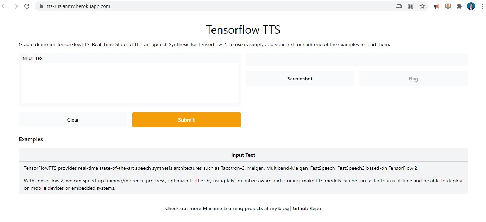

## Text to Speech with TensorFlow  APP

Text-to-Speech TTS To Synthesize Speech That Sounds Like a Real Human Person


In this project we can Synthesize Speech with TensorFlowTTS 

<iframe width="100%" height="166" scrolling="no" frameborder="no" allow="autoplay" src="https://w.soundcloud.com/player/?url=https%3A//api.soundcloud.com/tracks/1110876514&color=%23ff5500&auto_play=false&hide_related=false&show_comments=true&show_user=true&show_reposts=false&show_teaser=true"></iframe><div style="font-size: 10px; color: #cccccc;line-break: anywhere;word-break: normal;overflow: hidden;white-space: nowrap;text-overflow: ellipsis; font-family: Interstate,Lucida Grande,Lucida Sans Unicode,Lucida Sans,Garuda,Verdana,Tahoma,sans-serif;font-weight: 100;"><a href="https://soundcloud.com/ruslanmv" title="Ruslan Magana Vsevolodovna" target="_blank" style="color: #cccccc; text-decoration: none;">Ruslan Magana Vsevolodovna</a> · <a href="https://soundcloud.com/ruslanmv/tensorflowtts" title="TensorFlowTTS" target="_blank" style="color: #cccccc; text-decoration: none;">TensorFlowTTS</a></div>


This tutorial will have you deploying a Python app (a simple Gradio app) in minutes.

by using Google Colaboratory and Heroku. TensorflowTTS Notebook is used to launch **TensorflowTTS** on browser using Gradio in Google Colaboratory which gives you better way to interact Text-to-Speech TTS To Synthesize Speech. 

[![Open in Colab][Colab Badge]](https://colab.research.google.com/github/ruslanmv/TensorflowTTS/blob/master/TensorflowTTS.ipynb)


## Introduction

TensorFlowTTS provides real-time state-of-the-art speech synthesis architectures such as Tacotron-2, Melgan, Multiband-Melgan, FastSpeech, FastSpeech2 based-on TensorFlow 2. With Tensorflow 2, we can speed-up training/inference progress, optimizer further by using fake-quantize aware and pruning, make TTS models can be run faster than real-time and be able to deploy on mobile devices or embedded systems


The tutorial assumes that you have a free [Heroku account](https://signup.heroku.com/signup/dc) and Google Account Colab.

In this step you’ll install the Heroku Command Line Interface (CLI). You use the CLI to manage and scale your applications, provision add-ons, view your application logs, and run your application locally.

Download and run the installer for your platform: macOS

[Download the installer](https://cli-assets.heroku.com/heroku.pkg)

Also available via Homebrew:

```term
$ brew install heroku/brew/heroku
```

Windows

Download the appropriate installer for your Windows installation:

[64-bit installer](https://cli-assets.heroku.com/heroku-x64.exe)

[32-bit installer](https://cli-assets.heroku.com/heroku-x86.exe)

Ubuntu 

Run the following from your terminal:

```term
$ sudo snap install heroku --classic
```

Once installed, you can use the `heroku` command from your command shell.


Install environment with Anaconda


```
conda create -n tts python==3.6
```

We have selected python 3.6 because it is compatible with Tensorflow 2.0, and this version of tensor flow is smaller in size with respect to Tensor flow 2.6 that is compatible with python 3.7


```
conda activate tts
```

```
conda install ipykernel
```

```
python -m ipykernel install --user --name tts --display-name "Python (tts)"
```

```
conda install -c conda-forge ipywidgets
jupyter nbextension enable --py widgetsnbextension
```

we create a file called requirements.txt

```
TensorFlowTTS
gradio 
numpy
SoundFile
git+https://github.com/repodiac/german_transliterate
tensorflow-cpu
```


Notice that we have selected `tensorflow-cpu` instead  `tensorflow-gpu` because the free version of Heroku does not support gpu.  In case you will requiere use GPU, you need first install [Cuda 11](https://developer.download.nvidia.com/compute/cuda/11.4.1/local_installers/cuda_11.4.1_471.41_win10.exe)  and  [Cudnn](https://developer.nvidia.com/compute/machine-learning/cudnn/secure/8.1.0.77/11.2_20210127/cudnn-11.2-windows-x64-v8.1.0.77.zip), for further versions you can check the nvidia [site.](https://developer.nvidia.com/cuda-downloads)

It is installed the libraries by typing the following 

```
pip install -r requirements.txt
```

we create a file app.py

```python
import numpy as np
import soundfile as sf
import yaml

import tensorflow as tf

from tensorflow_tts.inference import TFAutoModel
from tensorflow_tts.inference import AutoProcessor
import gradio as gr

# initialize fastspeech2 model.
fastspeech2 = TFAutoModel.from_pretrained("tensorspeech/tts-fastspeech2-ljspeech-en")


# initialize mb_melgan model
mb_melgan = TFAutoModel.from_pretrained("tensorspeech/tts-mb_melgan-ljspeech-en")


# inference
processor = AutoProcessor.from_pretrained("tensorspeech/tts-fastspeech2-ljspeech-en")

def inference(text):
  input_ids = processor.text_to_sequence(text)
  # fastspeech inference
  
  mel_before, mel_after, duration_outputs, _, _ = fastspeech2.inference(
      input_ids=tf.expand_dims(tf.convert_to_tensor(input_ids, dtype=tf.int32), 0),
      speaker_ids=tf.convert_to_tensor([0], dtype=tf.int32),
      speed_ratios=tf.convert_to_tensor([1.0], dtype=tf.float32),
      f0_ratios =tf.convert_to_tensor([1.0], dtype=tf.float32),
      energy_ratios =tf.convert_to_tensor([1.0], dtype=tf.float32),
  )

  # melgan inference
  audio_before = mb_melgan.inference(mel_before)[0, :, 0]
  audio_after = mb_melgan.inference(mel_after)[0, :, 0]
  
  # save to file
  sf.write('./audio_before.wav', audio_before, 22050, "PCM_16")
  sf.write('./audio_after.wav', audio_after, 22050, "PCM_16")
  return './audio_after.wav'
  
inputs = gr.inputs.Textbox(lines=5, label="Input Text")
outputs =  gr.outputs.Audio(type="file", label="Output Audio")


title = "Tensorflow TTS"
description = "Gradio demo for TensorFlowTTS: Real-Time State-of-the-art Speech Synthesis for Tensorflow 2. To use it, simply add your text, or click one of the examples to load them."
article = "<p style='text-align: center'><a href='https://ruslanmv.com/'> Check out more Machine Learning projects at my blog </a> | <a href='https://github.com/ruslanmv/TensorFlowTTS'>Github Repo</a></p>"

examples = [
 ["TensorFlowTTS provides real-time state-of-the-art speech synthesis architectures such as Tacotron-2, Melgan, Multiband-Melgan, FastSpeech, FastSpeech2 based-on TensorFlow 2."],
 ["With Tensorflow 2, we can speed-up training/inference progress, optimizer further by using fake-quantize aware and pruning, make TTS models can be run faster than real-time and be able to deploy on mobile devices or embedded systems."]   
]

gr.Interface(inference, inputs, outputs, title=title, description=description, article=article, examples=examples).launch()
```


we create a file called runtime.txt

```
python-3.6.14
```

we create a file called setup.sh

```
export GRADIO_SERVER_NAME=0.0.0.0 
export GRADIO_SERVER_PORT="$PORT"
```

we create a file Procfile

```
web: source setup.sh && python app.py
```


In this step you’ll install the Heroku Command Line Interface (CLI). You use the CLI to manage and scale your applications, provision add-ons, view your application logs, and run your application locally.

#### Install the Heroku CLI

Download and install the [Heroku CLI](https://devcenter.heroku.com/articles/heroku-command-line).

If you haven't already, log in to your Heroku account and follow the prompts to create a new SSH public key.

```
$ heroku login
```


If you haven’t already added these files to a git repo, do it by running the following in your terminal:

```
git init
git add -A
git commit -am "commit message here"
```

We just need to push this to a Heroku dyno. First, let’s allocate a Heroku dyno for our app by running:


## Deploy the app

In this step you will deploy the app to Heroku.

Create an app on Heroku, which prepares Heroku to receive your source code:

```term
heroku create tts-ruslanmv
```

if we type only  `heroku create`   it is automatically generated instance name plus the Heroku domain.

When you create an app, a git remote (called `heroku`) is also created and associated with your local git repository.

Heroku generates a random name (in this case `ruslanmv-tts`) for your app, or you can pass a parameter to specify your own app name.


Configure your application to use two buildpacks:

```py
heroku buildpacks:set heroku/python
heroku buildpacks:add --index 1 heroku-community/apt
heroku buildpacks
# Should show apt first, then python
```

Add an [`Aptfile`](https://github.com/heroku/heroku-buildpack-apt#aptfile) listing Ubuntu packages to be installed:


Create an 'Aptfile' and add the following lines:


```
libsndfile-dev
```

Now deploy your code:

```
git push heroku master
```

Give this a few minutes to install all of the dependencies on your dyno. It’s possible to run into dependency issues here, which you can resolve by reading the error messages and installing the right version of each library (*see my note above about Heroku’s size limits*). If you don’t see any errors, then you should be able to open up your app by running:

```
heroku ps:scale web=1
```

The application is now deployed. Ensure that at least one instance of the app is running

Now visit the app at the URL generated by its app name. As a handy shortcut, you can open the website as follows:

```
heroku open
```

 You’ll notice the web address is  [https://tts-ruslanmv.herokuapp.com/]( https://tts-ruslanmv.herokuapp.com/) . If you enter, you should wait at least one minute to initialize the application. 

[](https://tts-ruslanmv.herokuapp.com/)

To get a better performance of this program we have  created a Colab notebook version that runs much faster than the Heroku version.

[![Open in Colab][Colab Badge]](https://colab.research.google.com/github/ruslanmv/TensorflowTTS/blob/master/TensorflowTTS.ipynb)


**Congratulations**!, we have created  a web app, with TensorFlowTTS.


[Colab Badge]:          https://colab.research.google.com/assets/colab-badge.svg
[Code Issues]:          https://img.shields.io/github/issues/ruslanmv/TensorflowTTS/label=Issues

