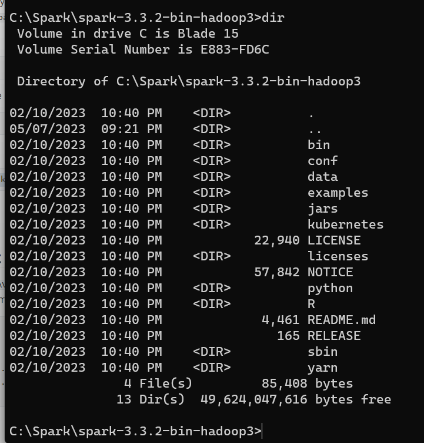
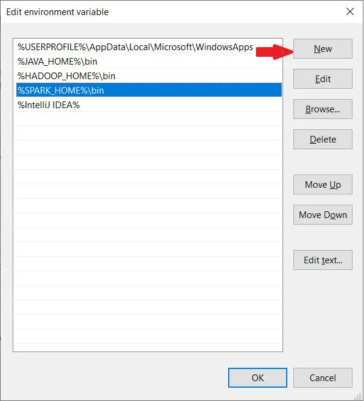
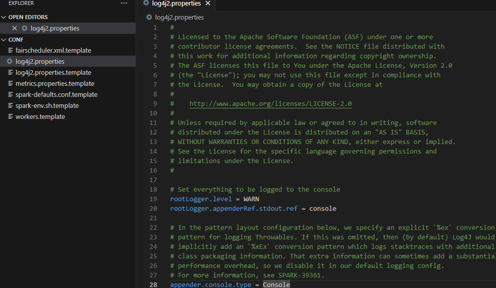
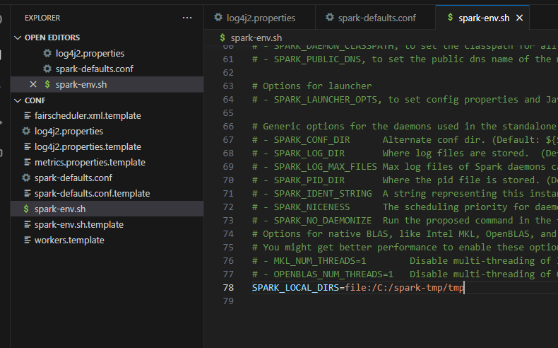
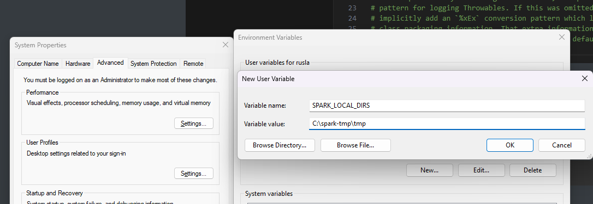

Hello everyone, today we are going to install Spark on Windows 11.

Apache Spark is an open-source unified analytics engine for large-scale data processing. Spark provides an interface for programming clusters with implicit data parallelism and fault tolerance.


## Prerequisites

1. Java 8 runtime environment (JRE) 
2. Apache Spark 3.3.0


## Step 1 - Install **Java 8** or Later

To install Apache Spark on windows, you would need Java 8 or the latest version hence download the Java version from [Oracle](https://www.oracle.com/technetwork/java/javase/downloads/jdk8-downloads-2133151.html) and install it on your system. If you wanted OpenJDK you can download it from [here](https://adoptopenjdk.net/).


You can install Java 8 from the following link [here](https://javadl.oracle.com/webapps/download/AutoDL?BundleId=247948_0ae14417abb444ebb02b9815e2103550).

After finishing the file download we open a new command prompt, we should unpack the package

```
cd Downloads 
```

Because I am installing Java in folder Java of my C drive (C:\Java) 

we create the the directory

```
mkdir C:\Java
```

then run the following command to unzip:

```
tar -xvzf  jre-8u361-windows-x64.tar.gz -C C:\Java\
```


**Note:** This article explains Installing Apache Spark on Java 8, same steps will also work for Java 11 and 13 versions.

## Step 2 - Download packages

Apache Spark comes in a compressed tar/zip files hence installation on windows is not much of a deal as you just need to download and untar the file. 

For this tutorial we are going to install **Apache Spark 3.3.2** with Pre-built Apache **Hadoop 3.3**

Download Apache spark by accessing the [Spark Download page](https://spark.apache.org/downloads.html) and select the link from “Download Spark ”.


We download the following file:

[https://www.apache.org/dyn/closer.lua/spark/spark-3.3.2/spark-3.3.2-bin-hadoop3.tgz](https://www.apache.org/dyn/closer.lua/spark/spark-3.3.2/spark-3.3.2-bin-hadoop3.tgz)


After download, untar the binary using [7zip](https://www.7-zip.org/download.html) or any zip utility to extract the zip file and copy the extracted directory `spark-3.3.2-bin-hadoop3.tgz` to `c:\Hadoop\spark-3.3.2-bin-hadoop3`

Let us open a terminal and we create the the directory

```
mkdir C:\Spark
```

then we go to the directory where was Downloaded the file 

```
cd Downloads
```

run the following command to unzip:

```
tar -xvzf  spark-3.3.2-bin-hadoop3.tgz -C C:\Spark\
```

The extracted files are in the directory `C:\Spark\spark-3.3.2-bin-hadoop3`

```
cd C:\Spark\spark-3.3.2-bin-hadoop3
dir
```





## Step 3 - Edit Spark Environment Variables


Now we've downloaded and unpacked all the artefacts we need to configure two important environment variables.

First you click the windows button and type environment


### a) Configure  Environment variables

We configure **JAVA_HOME** environment variable

by adding new  environment variable:

Variable name : `JAVA_HOME`
Variable value:  `C:\Java\jre1.8.0_361`

Follow the below steps if you are not aware of how to add or edit environment variables on windows.

1. Open System Environment Variables window and select **Environment Variables**.
2. On the following Environment variable screen, add `SPARK_HOME`, `HADOOP_HOME`, `JAVA_HOME` by selecting the **New** option.
3. This opens up the **New User Variables** window where you can enter the variable name and value


the same with  **SPARK_HOME** environment variable:

Variable name : `SPARK_HOME`
Variable value:  `C:\Spark\spark-3.3.2-bin-hadoop3`

and finally with  **HADOOP_HOME** environment variable:

Variable name : `HADOOP_HOME`
Variable value:  `C:\Hadoop\hadoop-3.3.0`

###  b) Configure PATH environment variable


Once we finish setting up the above two environment variables, we need to add the bin folders to the PATH environment variable.  On **Edit** the **PATH** variable


If PATH environment exists in your system, you can also manually add the following two paths to it:

```
%JAVA_HOME%/bin
%SPARK_HOME%/bin
%HADOOP_HOME%/bin
```


 Add Spark, Java, and Hadoop bin location by selecting **New** option.




## c) Spark with winutils.exe on Windows

To run Apache Spark on windows, you need `winutils.exe` as it uses POSIX like file access operations in windows using windows API.

winutils.exe enables Spark to use Windows-specific services including running shell commands on a windows environment.

We create the folder

```
mkdir C:\Hadoop\hadoop-3.3.0\
```

[Download winutils.exe for Hadoop 3.3](https://github.com/ruslanmv/How-to-install-Hadoop-on-Windows/raw/master/winutils/hadoop-3.3.0/bin/winutils.exe) and copy it to `%HADOOP_HOME%\bin` folder. 

```
cd Downloads
copy winutils.exe C:\Hadoop\hadoop-3.3.0\bin
```

### Verification of Installation

Once you complete the installation, Close your terminal window and open a new one and please run the following command  to verify:

```
java -version
```

you will have 

```
java version "1.8.0_361"
Java(TM) SE Runtime Environment (build 1.8.0_361-b09)
Java HotSpot(TM) 64-Bit Server VM (build 25.361-b09, mixed mode)
```

You should also be able to run the following command:

```
spark-shell 
```

```
Microsoft Windows [Version 10.0.22621.1555]
(c) Microsoft Corporation. All rights reserved.

C:\Users\ruslanmv>spark-shell
Setting default log level to "WARN".
To adjust logging level use sc.setLogLevel(newLevel). For SparkR, use setLogLevel(newLevel).
Spark context Web UI available at http://192.168.1.207:4040
Spark context available as 'sc' (master = local[*], app id = local-1683488208402).
Spark session available as 'spark'.
Welcome to
      ____              __
     / __/__  ___ _____/ /__
    _\ \/ _ \/ _ `/ __/  '_/
   /___/ .__/\_,_/_/ /_/\_\   version 3.3.2
      /_/

Using Scala version 2.12.15 (Java HotSpot(TM) 64-Bit Server VM, Java 1.8.0_361)
Type in expressions to have them evaluated.
Type :help for more information.

scala> 23/05/07 21:37:04 WARN ProcfsMetricsGetter: Exception when trying to compute pagesize, as a result reporting of ProcessTree metrics is stopped
```

spark-shell is a CLI utility that comes with Apache Spark distribution.

Spark-shell also creates a [Spark context web UI](https://sparkbyexamples.com/spark/spark-web-ui-understanding/) and by default, it can access from [http://localhost:4041](http://localhost:4041/).

## Testing Spark

Open a new terminal and type

```
spark-shell
```

On spark-shell command line, you can run any Spark statements like creating an RDD, getting Spark version e.t.c

```
spark.version
```

you will get

```
res0: String = 3.3.2
```

let us try type

```
val rdd = sc.parallelize(Array(1,2,3,4,5,6,7,8,9,10))
```

you get

```bash
scala> val rdd = sc.parallelize(Array(1,2,3,4,5,6,7,8,9,10))
rdd: org.apache.spark.rdd.RDD[Int] = ParallelCollectionRDD[0] at parallelize at <console>:23

```

## Cleaning Logs of Spark

When you are running programs with spark you can see that you have too many logs.  You can choose the type of logs that  you want to see during the spark execution.

Go to your Spark directory

```
cd %SPARK_HOME%/conf
```

then we copy the following file

```
copy log4j2.properties.template log4j2.properties
```

```
code log4j2.properties
```

and change the variable `rootLogger.level = info` to `WARN`

```
# Set everything to be logged to the console
rootLogger.level = WARN
```



then save and each time you run spark you will see only the warnings and errors.

## Changing Temp Directory

When you are worsking in windows I suggest change the temporary directory spark , for example, we create a temporary folder  `spark-tmp`

```
mkdir C:\spark-tmp
```

then we create a file of configuration of spark by typing

```
copy  %SPARK_HOME%\conf\spark-defaults.conf.template %SPARK_HOME%\conf\spark-defaults.conf
```

we edit the file and we add the following lines

```
spark.eventLog.enabled           true
spark.eventLog.dir               file:/C:/spark-tmp/log
spark.local.dir                  file:/C:/spark-tmp/tmp
```

then  create another conffile

```
copy  %SPARK_HOME%\conf\spark-env.sh.template %SPARK_HOME%\conf\spark-env.sh
```

we edit the file

```
code %SPARK_HOME%\conf\spark-env.sh
```

we add the following line

```
SPARK_LOCAL_DIRS=file:/C:/spark-tmp/tmp
```

and save.



we save and finally on windows you will have to make those environment variables by adding the key value pair 

```
SPARK_LOCAL_DIRS -> C:\spark-tmp\tmp
```



and click ok.

You can check by typing spark-shell


**Congratulations!** You have installed Apache Spark on **Windows 11.**