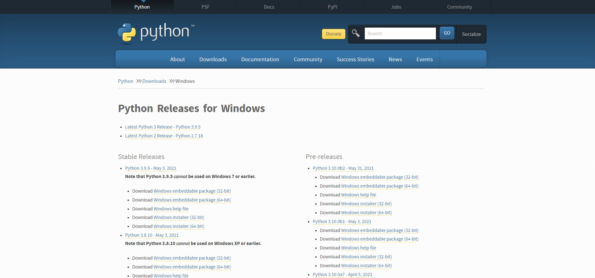
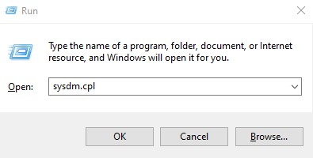
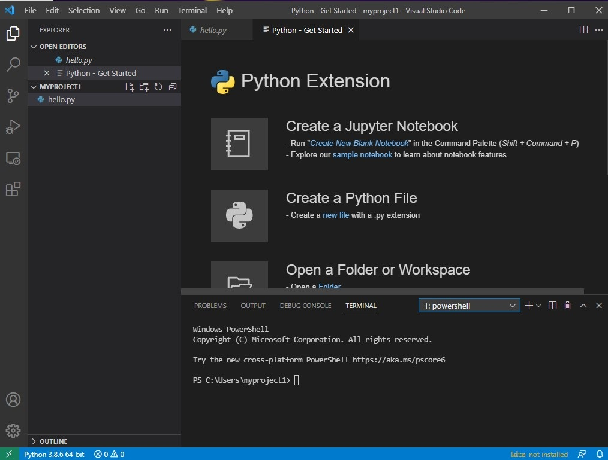
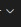
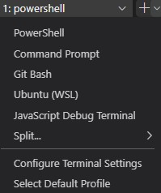

In this blog post, we'll see how to Install Python 3 in  Windows Subsystem for Linux Ubuntu and Windows 10 and how to Set Up a Programming Environment with Visual Studio Code.

 

 If you want to run distros of Linux on Windows 10, you must first enable the Windows Subsystem for Linux feature before you can download and install the flavor of Linux that you want to use.

### Enabling Windows Subsystem for Linux using Settings

To install WSL using Setting on Windows 10, use these steps:

1. Open **Settings**.

2. Click on **Apps**.

3. Under the "Related settings" section, click the **Programs and Features** option.

   

4. Click the **Turn Windows features on or off** option from the left panel

5. Check the **Windows Subsystem for Linux** option.

   

6. Click the **OK** button.

7. Click the **Restart now** button.

There are two ways to install Ubuntu: Using Microsoft store or using PowerShell

### Installing Linux distros using Microsoft Store

To install a distribution of Linux on Windows 10, use these steps:

1. Open **Microsoft Store**.
2. Search for the Linux distribution that you want to install, in this case we choose ubuntu.
3. We select and Install
4. Click the **Launch** button.
5. Create a username for the Linux distro and press **Enter**.
6. Specify a password for the distro and press **Enter**.


### Installing Linux distros using PowerShell
You can now install everything you need to run Windows Subsystem for Linux (WSL) by entering this command in an administrator PowerShell or Windows Command Prompt and then restarting your machine.
**PowerShellCopy**

```powershell
wsl --install
```

This command will enable the required optional components, download the latest Linux kernel, set WSL 2 as your default, and install a Linux distribution for you *(Ubuntu by default).

The first time you launch a newly installed Linux distribution, a console window will open and you'll be asked to wait for files to de-compress and be stored on your machine. All future launches should take less than a second.


## Setting Up Python 3 in Windows Subsystem for Linux (WSL)

We open the Command Prompt 

and we type  **bash.exe**


```
Microsoft Windows [Version 10.0.19042.985]
(c) Microsoft Corporation. All rights reserved.

C:\Users\ruslanmv>bash.exe
ruslanmv@Blade:/mnt/c/Users/ruslanmv$

```

 let’s update and upgrade the system

```bash
sudo apt update
sudo apt -y upgrade
```

The `-y` flag will confirm that we are agreeing for all items to be installed, but depending on your version of Linux, you may need to confirm additional prompts as your system updates and upgrades. Once the process is complete, we check if installed python

```bash
python3 -V
```

To manage software packages for Python, let’s install **pip**, a tool that will install and manage programming packages we may want to use in our development projects. 

```bash
sudo apt install -y python3-pip
```


Python packages can be installed by typing:

```bash
pip3 install package_name
```

Here, `package_name` can refer to any Python package or library, such as Pandas for Data Science development or NumPy for scientific computing. So if you would like to install NumPy, you can do so with the command `pip3 install numpy`.

There are a few more packages and development tools to install to ensure that we have a robust setup for our programming environment:

```bash
sudo apt install -y build-essential libssl-dev libffi-dev python3-dev
```

Once Python is set up, and pip and other tools are installed, we can set up a virtual environment for our development projects.

## How to setup Virtual Environment in Windows Subsystem for Linux (WSL)

Virtual environments enable you to have an isolated space on your server for Python projects, ensuring that each of your projects can have its own set of dependencies that won’t disrupt any of your other projects.

Setting up a programming environment provides greater control over Python projects and over how different versions of packages are handled. This is especially important when working with third-party packages.

You can set up as many Python programming environments as you would like. Each environment is basically a directory or folder on your server that has a few scripts in it to make it act as an environment.

While there are a few ways to achieve a programming environment in Python, we’ll be using the **venv** module here, which is part of the standard Python 3 library. 


Let’s install venv by typing:

```bash
sudo apt install -y python3-venv
```

 With this installed, we are ready to create environments. Let’s either choose which directory we would like to put our Python programming environments in, or create a new directory with `mkdir`, as in:

```bash
mkdir environments
cd environments
```

Once you are in the directory where you would like the environments to live, you can create an environment by running the following command:

```bash
python3 -m venv frameworkenv
```

Essentially, `pyvenv` sets up a new directory that contains a few items which we can view with the `ls` command:

```bash
ls frameworkenv
```

```
ruslanmv@Blade:/mnt/c/Users/ruslanmv/environments$ ls frameworkenv
bin  include  lib  lib64  pyvenv.cfg  share
```

Together, these files work to make sure that your projects are isolated from the broader context of your server, so that system files and project files don’t mix. This is good practice for version control and to ensure that each of your projects has access to the particular packages that it needs. Python Wheels, a built-package format for Python that can speed up your software production by reducing the number of times you need to compile

To use this environment, you need to activate it, which you can achieve by typing the following command that calls the **activate** script:

```bash
source frameworkenv/bin/activate
```

Your command prompt will now be prefixed with the name of your environment, in this case it is called **frameworkenv**. Depending on what version of Debian Linux you are running, your prefix may appear somewhat differently, but the name of your environment in parentheses should be the first thing you see on your line:

```bash
(frameworkenv) ruslanmv@Blade:/mnt/c/Users/ruslanmv/environments$
```

 

This prefix lets us know that the environment **frameworkenv** is currently active, meaning that when we create programs here they will use only this particular environment’s settings and packages.


### How to install Visual Studio Code in in Windows Subsystem for Linux (WSL)

Following the previous steps just we type

```
code
```

and it will ne installed

```
(frameworkenv) ruslanmv@Blade:/mnt/c/Users/ruslanmv/environments$ code
Installing VS Code Server for x64 (054a9295330880ed74ceaedda236253b4f39a335)
Downloading: 100%
Unpacking: 100%
Unpacked 1952 files and folders to /home/ruslanmv/.vscode-server/bin/054a9295330880ed74ceaedda236253b4f39a335.
```

Now we can Setup our first project.

```
cd ..
mkdir myproject1
```

we create our first python program

```
touch hello.py
```

and  we type

```
code .
```


we select the hello.py file

and we write

```python
print("Hello World from Ubuntu in Windows")
```

and then save  ( ctrl+s)


then we go to click on **terminal** then **new terminal**


and there we write

```
source "../environments/frameworkenv/bin/activate"
```

then

```
(frameworkenv) ruslanmv@Blade:/mnt/c/Users/ruslanmv/myproject1$ source "../environments/frameworkenv/bin/activate"
(frameworkenv) ruslanmv@Blade:/mnt/c/Users/ruslamv/myproject1$ python3 hello.py 
Hello World from Ubuntu in Windows
(frameworkenv) ruslanmv@Blade:/mnt/c/Users/ruslamv/myproject1$ 
```


**Congratulations !** Now  we can work on VS code with your custom python environment.

The the next sections we will repeat the same but now by using only **Windows 10**.


## How install Python 3  and setup Virtual Environment in Windows 


If you need to setup your Python 3 in your windows and setup Virtual Environment you can  download python from this Website [link](https://www.python.org/downloads/windows/).

it will take you to the Python official download website. 

 



 


 

If you need Python 3.8.0. from this [link](https://www.python.org/ftp/python/3.8.0/python-3.8.0-amd64.exe)  and start to download.

Next, right click the mouse button you will see open button click to open.

 

Here is very important step

**Enable to add Python 3.9 to path** and select Customize Installation


 


 


 


**Select Install for all users**  and modify the Customize location choose

```
C:\Python39
```

if you have installed a previous version choose that the last two digits ends to the  first two digits of the version. for example, 3.8.0  `C:\Python38`


Wait a few minutes and display setup was successful. Next you will click the close button.


#### Manual verification of Path ( optional)

If we want to add the path to the **python.exe** file to the Path variable, start the **Run** box


 and enter **sysdm.cpl**:





This should open up the **System Properties** window. Go to the **Advanced** tab and click the **Environment Variables** button:


In the **System variable** window, find the **Path** variable and click **Edit**:


In the case the installation was done by **adding the PATH**  we don't  need to do something else. JUST in case something goes wrong you have to be sure that the System Variable has Python, otherwise  at the end of the **Variable** **value** line and add the path to the **python.exe** file, preceeded with the semicolon character (**;**). In our example  we have **;C:\Python38** 

Close all windows.  Now you can open cmd   

```
Microsoft Windows [Version 10.0.19042.985]
(c) Microsoft Corporation. All rights reserved.

C:\Users\ruslanmv>python --version
Python 3.8.0

C:\Users\ruslamv>

```

**Possible Issues with Windows 10**

"Python was not found; run without arguments to install from the Microsoft Store, or disable this shortcut from Settings > Manage App Execution Aliases."

1.Check your python version

2.Check the path variables

3.Go to -> "start" and type "Manage App Execution Aliases" .Go to it and turn off "python"


###  How to setup Virtual Environment in Windows 


There are two ways

The first method is , first enter to **cmd**

```
python -m pip install virtualenv
```

or

```
pip install virtualenv
```

Let us assume that we want to create our virtual environment  called `frameworkenv`  in the folder   `venvs`

so you go to your terminal type

```
virtualenv  %USERPROFILE%\venvs\frameworkenv
```


the second method is go to your folder of python38, so you type

```
cd C:\Python38
```

and there type 

```
python.exe -m venv %USERPROFILE%\venvs\frameworkenv
```

then you go to your environment 

```
cd %USERPROFILE%\venvs\frameworkenv
```

and there go to scripts

```
cd Scripts
```

and activate your environment by typing

```
activate.bat
```

for example in my case

```
C:\Users\rusla\venvs\frameworkenv\Scripts>dir
 Volume in drive C is Blade 15
 Volume Serial Number is E883-FD8C

 Directory of C:\Users\ruslanmv\venvs\frameworkenv\Scripts

05/06/2021  15:48    <DIR>          .
05/06/2021  15:48    <DIR>          ..
05/06/2021  15:48             2.309 activate
05/06/2021  15:48               978 activate.bat
05/06/2021  15:48            18.147 Activate.ps1
05/06/2021  15:48               368 deactivate.bat
05/06/2021  15:48           103.303 easy_install-3.8.exe
05/06/2021  15:48           103.303 easy_install.exe
05/06/2021  15:48           103.285 pip.exe
05/06/2021  15:48           103.285 pip3.8.exe
05/06/2021  15:48           103.285 pip3.exe
05/06/2021  15:48           524.872 python.exe
05/06/2021  15:48           523.848 pythonw.exe
              11 File(s)      1.586.983 bytes
               2 Dir(s)  51.987.955.712 bytes free

C:\Users\ruslanmv\venvs\frameworkenv\Scripts>activate

(frameworkenv) C:\Users\ruslanmv\venvs\frameworkenv\Scripts>
```

I am in the  **(frameworkenv)** created


to exit from my environment just type wherever your are

```
deactivate
```


### How install Visual Studio Code  with your Virtual Environment 

First you need is to install VScode from this [link](https://code.visualstudio.com/download)


after you installed you can return back to your cmd terminal

enter to your folder of your project you want to work

```
cd myproject1
```

and type 

```
code.
```


```
Microsoft Windows [Version 10.0.19042.985]
(c) Microsoft Corporation. All rights reserved.
C:\Users\ruslanmv>cd myproject1
C:\Users\ruslamv\myproject1>code .
C:\Users\ruslamv\myproject1>
```





by default the terminal is **PowerShell** but you need to change it , in terminal, you have two buttons that seems to be one


the button


and



you click this last one, and appears



otherwise you just duplicate the terminals, and you select **CommandPromt**, and just type

```
%USERPROFILE%\venvs\frameworkenv\Scripts\activate
```

you enter with your custom environment , for example 

```
C:\Users\ruslanmv\myproject1>%USERPROFILE%\venvs\frameworkenv\Scripts\activate
(frameworkenv) C:\Users\ruslanmv\myproject1>
```

and then  in the vscode , add the following line in the hello.py file

```
print("Hello World From my Virtual Enviroment")
```

and in the terminal type

```
python hello.py
```

and you get 


## How to export your enviroment by using pip
If you want to to export your enviroment by using pip, you type
```
pip freeze > requirements.txt
```
Then use the resulting requirements.txt to create a pip virtual environment:
```
python3 -m venv env
source env/bin/activate
pip install -r requirements.txt
```
## How to create requirements.txt for pip3 from conda

If you want to export your enviroment from conda to conda you type
```
conda list -e > requirements.txt
```
can be used to create a conda virtual environment with

```
conda create --name <env> --file requirements.txt
```

If you want a file which you can use to create a pip virtual environment 
you can install pip within the conda environment, the use pip to create requirements.txt.
```
conda activate <env>
conda install pip
pip list --format=freeze > requirements.txt

```
Then use the resulting requirements.txt to create a pip virtual environment:
```
python3 -m venv env
source env/bin/activate
pip install -r requirements.txt
```
**Congratulations!**  you have installed Python 3 , VS Code in Windows Subsystem for Linux  and and created  Virtual Environments of python for your future projects.
