Hello everyone, today we are going to Install **Jupyter Notebook** with Support of **Visual Studio Code**.


### Step 1 - Installation of Python in Windows 

We assume you have installed Python from [here](https://www.python.org/downloads/windows/)  on your computer, you can follow this [tutorial]( https://ruslanmv.com/blog/Python3-in-Windows-with-Ubuntu).  We will use Visual Studio Code to run Jupyter Notebook. 

### Step 2- Installation Visual Studio 

Download the Visual Studio Code installer for Windows [here](https://go.microsoft.com/fwlink/?LinkID=534107)
Once it is downloaded, run the installer. This will only take a minute. By default, VS Code is installed under 

`C:\Users\{Username}\AppData\Local\Programs\Microsoft VS Code`.

Alternatively, you can also download a Zip archive, extract it and run Code from [here](https://code.visualstudio.com/docs/?dv=winzip).

### Step 3 - Creation of Project

We create a project folder for example `myproject`, we open a terminal and type:

```
cd \
```

and we create folder called `myproject`

```
mkdir myproject
```

### Step 4 - Open Visual Studio Code

Navigate to / open your project folder 

```
cd myproject
```

and  open Visual Studio Code by typing

```
code .
```

### Step 5. Create, activate & select your virtual environment

Navigate to terminal and click New terminal
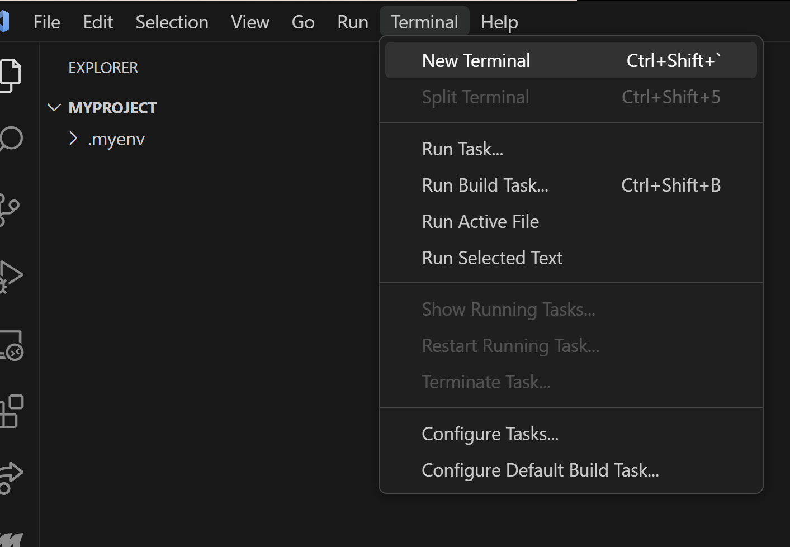

then we choose Command Prompt as our default terminal
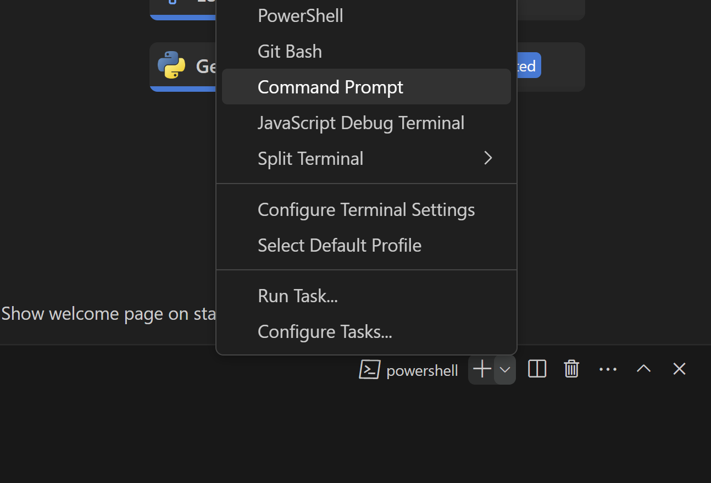


then inside  of the terminal Command Prompt we create a virtual environment by typing

```
python -m venv .myenv
```

that would create a virtual environment named '.myenv'.


Now activate the virtual environment 

```
.myenv\Scripts\activate.bat
```

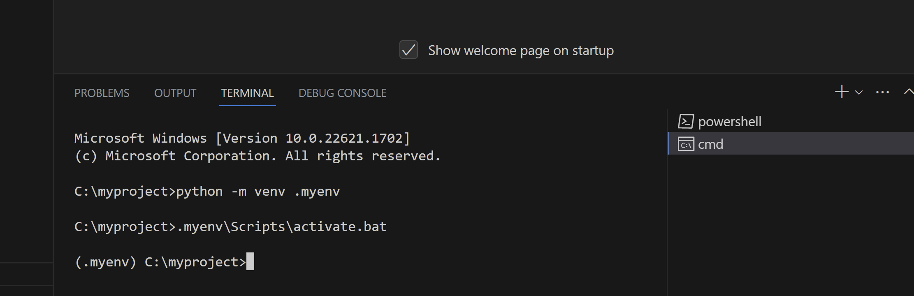


in Linux usually can use  `source .myenv/bin/activate`, to deactivate you can simply type `deactivate `.
If Visual Studio Code prompts you to set it as default for the project, we cab hit yes.

### Step 6. Install ipykernel

Now that your virtual environment is activated, install ipykernel

```
pip install ipykernel
```

###  Step 7. Create new kernel

Now you can create a new kernel to be used for your project:

```
python -m ipykernel install --user --name=myproject
```

That would create a kernel named 'myproject'.


###  Step 8. Installation of Jupyter Notebooks

To work with Python in Jupyter Notebooks,we have to be  activated the Python environment in which we have installed the Jupyter package.

```
pip install notebook
```

That would create jupyter notebook
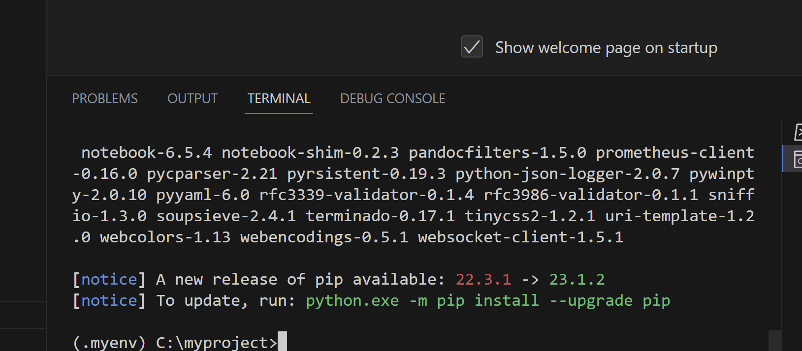


### Step 9. Install a Jupyter Notebook Extension

We install  a Jupyter Notebook Extension by installing
Jupyter, in the Command Palette (Ctrl+Shift+X) and type

```
Jupyter
```

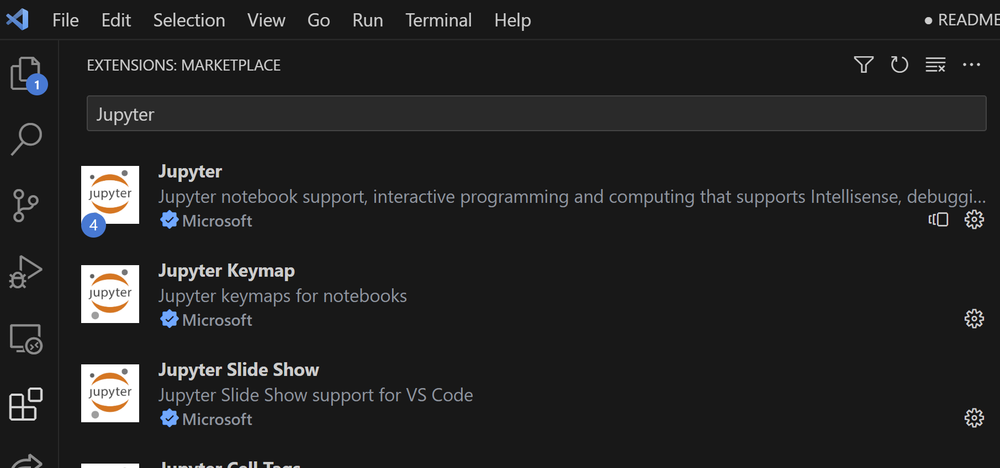
and we click install

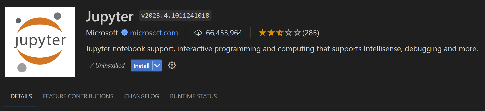

### Step 10 Create a Jupyter Notebook

We create a Jupyter Notebook by running the Create: New Jupyter Notebook command from the Command Palette (Ctrl+Shift+P) 

```
Create:New Jupyter Notebook
```

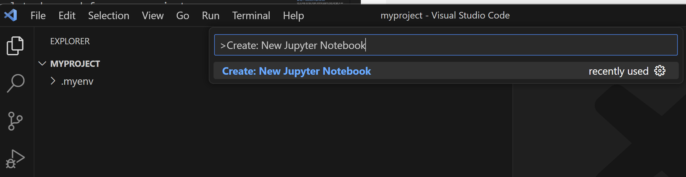

then we create a new .ipynb file in your workspace.

### Step 11 Select a kernel 

Next, select a kernel using the kernel picker in the top right. 

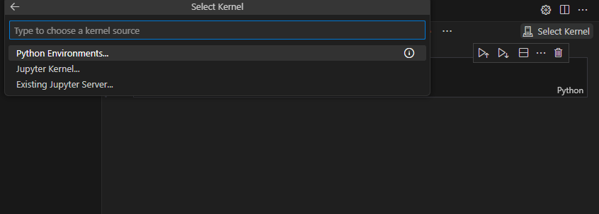

After selecting a kernel, the language picker located in the bottom right of each code cell will automatically update to the language supported by the kernel.
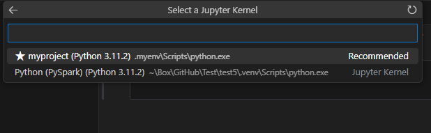
you can see your enviroment installed here
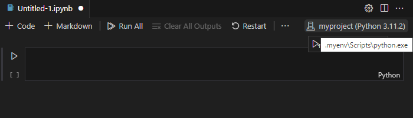

If you have an existing Jupyter Notebook, you can open it by right-clicking on the file and opening with VS Code, or through the VS Code File Explorer.

### Step 12. Test installation of jupyter

We can test by tping the folowing code in the cell and press shift + enter

```
!jupyter --version
```

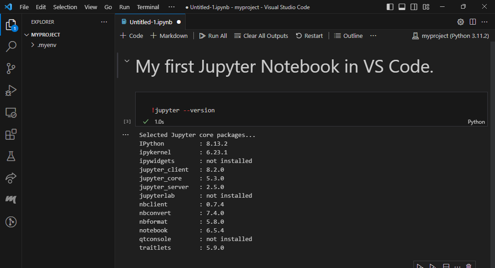

**Congratulation!** We have installed Visual Studio Code with support of Jupyter Notebook.