---

title: "What data scientist should know? "
excerpt: "What do you learn in data science?"

header:
  image: "../assets/images/posts/2021-06-06-What-all-should-a-data-scientist-know/nexi-mod2_high.jpg"
  teaser: "../assets/images/posts/2021-06-06-What-all-should-a-data-scientist-know/nexi-mod2_low.jpg"
  caption: " AWS Solutions | Connect your business in the cloud"
---

In this blog post,  I will try to give you the first  **10 things** to become a **Data Scientist** .

For sure, depending of your background, you should learn many others things needed to become a great Data Scientist.

This is my personal list of the things that as data scientist should know:

### Table of Contents

- [Section 1: Python for Data Science](#section-1)
- [Section 2: Importing Data](#section-2)
- [Section 3: Data Wrangling with Pandas ](#section-3)
- [Section 4:   Data Analysis with Numpy](#section-4)
- [Section 5:   Data Visualization with Matplotlib](#section-5)
- [Section 6:  Queries in SQL ](#section-6)
- [Section 7:   Machine Learning with Scikit-Learn](#section-7)
- [Section 8:  SciPy ](#section-8)
- [Section 9:  Neural Networks with Keras ](#section-9)
- [Section 10:  PySpark & Spark SQL](#section-10)

I should remark that I am **missing** many other import programming languages that can be used in **Data Science** such as **R, Spark, Scala, Ruby , JavaScript, Go and Swift** and tools of ingestion of Data such as **Apache Kafka**  and  creation of the Cloud Infrastructure such as     **Terraform** with **Terragrunt** and for the automatization of the **ETL** ,  **Airflow** and **Jenkins** and for sure  the CLI   in Linux and the use of  **Git** and **Unit test** to check your programs.  In addition I am skipping all the part of **Deep Learning**  in details and Machine Learning in the Cloud that will be subject of future posts.

I know there are a toons of things that is needed to know to become a great Data Scientist but I will introduce only the essential topics  based on **Python** and a little of **SQL** to manage the data from **Cloud Databases**. 

You  have also to know basis of **Data Engineering** such as in the previous post [here](https://ruslanmv.com/blog/Top-questions-Data-Engineer) and a little of **Mathematics** to understand how to solve the problems first by creating your algorithms which solves what you want to produce and analyze. 

 I have collected the information from different sources among them:  [Google](https://www.google.com/) , [Udemy](https://www.udemy.com/) , [Coursera](https://www.coursera.com/), [DataCamp](https://www.datacamp.com/) , [Pluralsight](https://www.pluralsight.com/) and [EdX](https://www.edx.org/).


# Section 1 
# Python for Data Science


**Python Operator Precedence**

From Python documentation on [operator precedence](http://docs.python.org/reference/expressions.html) (Section 5.15) 

Highest precedence at top, lowest at bottom.
Operators in the same box evaluate left to right.

| **Operator**                                     | **Description**                     |
| ------------------------------------------------ | ----------------------------------- |
| ()                                               | Parentheses (grouping)              |
| *f*(args...)                                     | Function call                       |
| *x*[index:index]                                 | Slicing                             |
| *x*[index]                                       | Subscription                        |
| *x.attribute*                                    | Attribute reference                 |
| **                                               | Exponentiation                      |
| ~*x*                                             | Bitwise not                         |
| +*x*, -*x*                                       | Positive, negative                  |
| *, /, %                                          | Multiplication, division, remainder |
| +, -                                             | Addition, subtraction               |
| <<, >>                                           | Bitwise shifts                      |
| &                                                | Bitwise AND                         |
| ^                                                | Bitwise XOR                         |
| \|                                               | Bitwise OR                          |
| in, not in, is, is not, <, <=, >, >=, <>, !=, == | Comparisons, membership, identity   |
| not *x*                                          | Boolean NOT                         |
| and                                              | Boolean AND                         |
| or                                               | Boolean OR                          |
| lambda                                           | Lambda expression                   |

##  Types and Type Conversion

```python
str()
'5', '3.45', 'True' #Variables to strings

int() 
5, 3, 1 #Variables to integers 

float() 
5.0, 1.0 #Variables to floats 

bool()  
True True True , , #Variables to boolean
```

### Libraries

Data analysis -> **pandas**

Scientific computing -> **numpy**

2D plotting -> **matplotlib**

Machine learning -> **Scikit-Learn**

### Import Libraries

```python
import numpy
import numpy as np
```

### Selective import

```python
from math import pi
```

### Strings

```python
 my_string = 'thisStringisAwesome'
 my_string
'thisStringisAwesome'

```

**String Operation**

```python
 my_string * 2
'thisStringisAwesomethisStringisAwesome'
 my_string +'Innit'
'thisStringisAwesomeinnit'
 'm' in  my_string
True
```

**String** **Indexing** 

Index starts at 0

```python
 my_string[3]
 my_string[4:9]
```

**String Methods**

```python
 my_string.upper() #String to uppercase
 my_string.lower() #String to lowercase
 my_string.count('w') #Count String elements
 my_string.replace('e','i') #Replace String elements
 my_string.strip() #Strip whitespoces
```

### Lists

```python
 my_list = [1, 2, 3, 4]
 my_array = np.array(my_list)
 my_2darray = np.array([[1,2,3],[4,5,6]])

```

**Selecting Numpy Array Elements**

Index starts at 0

```python
Subset
 my_array[1] #Select item at index 1
2
Slice
 my_array[ 0:2]#Select items at index 0 and 1
array([1, 2])
Subset 2D Numpy arrays
 my_2darray[:,0]#my_2darroy[rows, columns]
array([1, 4])
```

**Numpy Array Operations**

```python
 my_array > 3
array([False, False, False, True], dtype=bool)
 my_array *  2
array([2, 4, 6, 8])
 my_array + np.array([5, 6, 7, 8])
array([6, 8, 10, 12])
```

**Numpy Array Functions**

```python
 my_array.shape #Get the dimensions of the array
 np.append(other_array) #Append items to on array
 np.insert( my_array, 1, 5) #Insert items in on array
 np.delete( my_array,[1]) #Delete items in on array
 np.mean(my_array) #Mean of the array
 np.median(my_array) #Median of the array
 my_array.corrcoef() #Correlation coefficient
 np.std( my_array) #Standard deviation
```

### Lists

```python
 a  =  'is'
 b  =  'nice'
 my_list = ['my','list', a, b]
 my_list2=[[4,5,6,7],[3,4,5,6]]
```

**Selecting List Elements**

Index starts at 0

```python
Subset
 my_list[1] #Select item at index 1
 my_list[-3] #Select 3rd last item
Slice
 my_list[1:3] #Select items at index 1 and 2
 my_list[1:] #Select items after index 0
 my_list[:3] #Select items before index 3
 my_list[:] #Copy my_list
Subset Lists of Lists
 my_list2[1][0] #my_list[list][itemOfList]
 my_list2[1][:2]

```

**List Operations**

```python
 my_list + my_list
    ['my','list','is','nice','my','list','is','nice']
 2*my_list 
    ['my','list','is','nice','my','list','is','nice']
```

**List Methods**

```python
 my_list.index(a) #Get the index of an item
2
 my_list.count(a) #Count on item
1
 my_list.append( '!') #Append on item ot a time
['my','list','is','nice','!']
 my_list.remove( '!' ) #Remove  on  item
 del(my_list[0:1]) #Remove an item
['list','is','nice']
 my_list.reverse() #Reverse the list
['nice','is','list','my']
 my_list.extend('!') #Append on item
 my_list.pop(-1) #Remove on item
 my_list.insert(0, '!') #Insert on item
 my_list.sort() #Sort the list
```

**Asking For Help**

```python
 help(str)
```

# Section 2

### **Importing Data** 

**Most of the time, you'll use either NumPy or pandas to import your data:**

```
 import numpy as np
 import pandas as pd
```

**Help**

```
 np.info(np.ndarray.dtype)
 help(pd.read_csv)
```

### Text Files

**Plain Text Files**

```python
filename= 'huck_finn.txt'
file= open(filename, mode= 'r' ) #Open the file for reading
text= file.read() #Reado file's contents
 print(file.closed) #Check whether file is closed
 file.close() #Close file
 print(text)
```

```
 with open('huck_finn.txt', 'r' ) as file:
    print(file.readline()) #Read single line 
    print(file.readline()) 
    print(file.readline())
```


## Table Data: Flat Files

**Importing Flat Files with NumPy**

```python
filename= 'huck_finn.txt'
file= open(filename, mode= 'r' ) #Open the file for reading
text= file.read() #Reado file's contents
 print(file.closed) #Check whether file is closed
 file.close() #Close file
 print(text)
```

**Files with one data type**

```python
filename= 'mnist.txt'
data= np.loadtxt(filename,
					delimiter=',' , #String used to separate values 
                    skiprows=2, #Skip the first 2 lines 
                    usecols=[0,2], #Read the 1st and 3rd column 
                    dtype=str) #The type of the resulting array
```

**Files with mixed data type**

```python
filename= 'titanic.csv'
data= np.genfromtxt(	filename,
					   	delimiter = ',',
					   	names=True, #Look for column header
						dtype=None)
 data_array = np.recfromcsv(filename)
#The default dtype of the np.recfromcsv() function is None
```

### Importing Flat Files with Pandas

```python
filename= 'winequality-red.csv'
data= pd.read_csv(filename,
					 nrows=5, #Number of rows of file to read 
                     header=None, #Row number to use as col names 
                     sep='\t', #Delimiter to use
					 comment='#', #Character to split comments
					 na _values=[""]) #String to recognize as NA/NaN

```

## Exploring  Your Data

**NumPy Arrays**

```python
 data_array.dtype #Data type of array elements
 data_array.shape #Array dimensions
 len(data_array) #Length of array
```

**Pandas DataFrames**

```python
 df.head() #Return first DataFrame rows
 df.tail() #Return last OataFrame rows
 df.index #Describe index
 df.columns #Describe OataFrame columns
 df.info() #Info an DataFrame
 data_array = data.values #Convert a DataFrame to an a NumPy array

```

**SAS File**

```python
 from sas7bdat import SAS7BDAT
 with SAS7BDAT( 'urbanpop .sas7bdat') as file: 
		df_sas = file.to_da ta_frame()
```

**Stata File**

```
data= pd.read_stata('urbanpop .dta')
```

**Excel Spreadsheets**

```python
file= 'urbanpop.xlsx'
data= pd.ExcelFile(file)
 df_sheet2 = data.parse('1960-1966',
				skiprows=[0], names=['Country',
					'AAM: War(2002)'])
 df_sheetl = data.parse(0,
				parse_cols=[0], skiprows=[0],
				name s=['Country'])
```

To access the sheet names, use the sheet_names attribute:

```python
 data.sheet_names
```

### Relational Databases

```python
 from sqlalchemy import create _engine
engine= create_engine('sq lite://Northwind.sqlite')
```

Use the table_name s() method to fetch a list of table names:

```
table_names = engine.table_names()
```

**Querying Relational Databases**

```python
con= engine.connect()
 rs= con.execute('SELECT* FROM Order s')
 df = pd.DataFrame(rs.fetchall())
 df.columns = rs.keys()
 con.close()
```

Using the context manager with

```python
 with engine.connect() as con:
rs= con.execute('SELEC T OrderID FROM Order s')
                df = pd.DataFrame(rs.fetchmany(size=5)) 
                df.columns = rs.keys()
```

**Querying relational databases with pandas**

```
 df = pd.read_sql_query( ''SELECT*  FROM Orders'', engine)
```

Pickled File

```python
 import pickle
 with open('pickled_fruit.pkl', 'rb' ) as file: pickled_data = pickle.load(file)
```

Matlab File

```
 import scipy.io
filename= 1 workspace.m at 1
mat= scipy.io.loadmat(filename)
```

HDF5 Files

```python
 import h5py
filename= 'file.hdf5'
data= h5py.File(filename, 'r' )
```

## Exploring Dictionaries

**Querying relational databases with pandas**

```python
 print(mat.keys()) #Print dictionary keys
 for key in data.keys(): #Print dictionary keys
print(key)
meta quality strain
 pickled_data.values() #Return dictionary values
 print(mat.items()) #Returns items in list format of (key, value) tuple pairs
```

**Accessing Data Items with Keys**

```python
 for key in data['meta'].keys() #Explore the HOF5
structure
print(key) Description DescriptionURL Detector
Duration GPSstart Observatory Type UTCstart
#Retrieve the value for a key
 print(data['meta']['Description'].value)
```

### Navigating Your FileSystem

**Magic Commands**

```python
!ls #List directory contents of files and directories
%cd .. #Change current working directory
%pwd #Return the current working directory path
```

**OS Library**

```python
 import os
 path = "/usr/tmp"
 wd = os.getcwd() #Store the name of current directory in a string
 os.listdir(wd) #Output contents of the directory in a list
 os.chdir(path) #Change current working directory
 os.rename( "testl.txt", #Rename a file
 				"test2.txt" )
 os.remove( "test1. txt") #Oelete an existing file
 os.mkdir( "newdir") #Create a new directory
```

**Pivot**

```python
 df3= df2.pivot(inde x='Date', #Spread rows into columns
col umns= 'Type' ,
values='Value' )
```

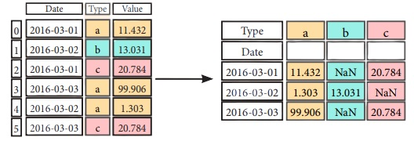

**Pivot Table**

```python
 df4 = pd.pivot_table(df2, #Spread rows into
columns values='Value', index='Date', columns='Type'])
```

**Stack** / **Unstack**

```python
stacked= df5.stack() #Pivot o level of column labels
 stacked.unstack() #Pivot o level of index labels
```

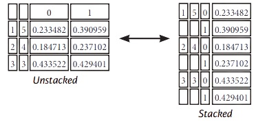

**Melt**

```python
 pd.melt(df2, #Gather columns into rows
		id _vars=[°Date°],     
		value_var s=['Type','Value'], 
		value name=''Observations'')
```

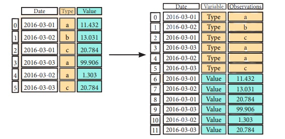

### Iteration

```python
 df.iteritems() #{Column-index, Series) pairs
 df.iterrows() #{Row-index, Series) pairs

```

### Missing Data

```python
 df.dropna() #Drop NaN values
 df3.fillna(df3.mean()) #Fill NaN values with o predetermined value
 df2.replace("a" , "f") #Replace values with others

```

### Advanced Indexing

**Selecting**

```python
 df3.loc[:,(df3>1).any()] #Select cols with any vols >1
 df3.loc[:,(df3>1).all()] #Select cols with vols> 1
 df3.loc[:,df3.isnull().any()] #Select cols with NaN
 df3.loc[:,df3.notnull().all()] #Select cols without NaN
```

**Indexing With** isin ()

```python
 df[(df.Country.isin(df2.Type))] #Find some elements
 df3.filter(iterns="a","b"]) #Filter on values
 df.select(lambda x: not x%5) #Select specific elements
```

**Where**

```python
 s.where(s > 0) #Subset the data
```

**Query**

```python
 df6.query('second > first') #Query DataFrame
```

**Setting/Resetting Index**

```python
 df.set_index('Country' ) #Set the index
 df4 = df.reset_index() #Reset the index
 df = df.rename(index=str, #Rename
			DataFrame columns={	"Country":"cntry",
								"Capital':"cptl",
								"Population":pplt})
```

**Reindexing**

```python
s2=s.reindex(['a','c','d','e','b'])
```

**Forward Filling**

```python
 df.reindex(	range(4),
				method= 'ffill')
```

```
	Country	Capital		Population	
0	Belgium	Brussels	11190846	
1	India	New Delhi	1303171035	
2	Brazil	Brasilia	207847528	
3	Brazil	Brasilia	207847528
```


**Backward Filling**

```python
 s3 = s.reindex(	range(5),
					method= 'bfill')
```

```
0	3
1	3
2	3
3	3
4	3
```

**Multilndexing**

```python
arrays= [np.array([l,2,3]),
np.array([5,4,3])]
 df5 = pd.DataFrame(np.random.rand(3, 2), index=arrays)
tuples= list(zip(*arrays))
index= pd.Multilndex.from_tuples(tuples,
names= [ 'first' , 'second' ])
 df6 = pd.DataFrame(np.random.rand(3, 2), index=index)
 df2.set_index([ "Date", "Type"])
```


### Duplicate Data

```python
 s3.unique() #Return unique values
 df2.duplicated('Type') #Check duplicates
 df2.drop_dup licates( 'Type', keep='last') #Drop duplicates
 df.index.duplicated() #Check index duplicates
```

### Grouping Data

**Aggregation**

```python
 df2.groupby(by=['Date','Type']).mean()
 df4.groupby(level=0).sum()
 df4.groupby(level=0).agg({ 'a':lambda x:sum(x)/len (x), 'b': np.sum})
```

**Transformation**

```python
 customSum = lambda x: (x+x%2)
 df4.groupby(level=0).transform(customSum)
```

## Combining Data

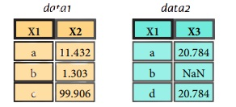

**Merge**

```python
 pd.merge(data1,
            data2,
            how = 'left' ,
            on='X1')
```

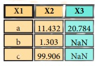

```python
 pd.merge(data1,
            data2,
            how = 'right' ,
            on='X1')
```

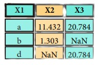

```python
 pd.merge(data1,
            data2,   
            how='inner',
            on='X1')
```

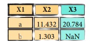

```python
 pd.merge(data1,
			data2,    
             how='outer',
             on='X1')
```

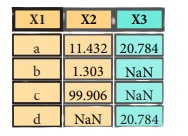

**Join**

```python
 datal.join(data2, ho w='righ t')
```

**Concatenate**

**Vertical**

```
 s.append(s2)
```

**Horizontal/Vertical**

```python
 pd.concat([s,s2],axis=l, keys=['One' ,'Two'])
 pd.concat([data1, data2], axis=l, join='inner')
```

### Dates

```python
 df2['Date']= pd.to_da tetime(d f2['Date'])
 df2['Date']= pd.da te_range( '2000-1-1',
periods=6, freq='M' )
dates= [datetime(2012,5,1), datetime(2012,5,2)]
index= pd.Datetimelndex(dates)
index= pd.date_range(datetime(2012,2,1), end, freq='BM' )

```

### Visualization

```python
 import matplotlib.pyplot as plt
 s.plot()
 plt.show()
```


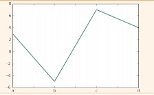

```python
df2.plot()
 plt.show()
```

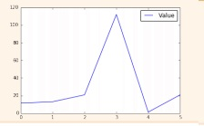

# Section 3

# Data Wrangling with Pandas 


The **Pandas** library is built on NumPy and provides easy-to-use **data structures** and **data analysis** tools for the Python programming language.

 **Use the following import convention:**

```python
 import pandas as pd
```


### Pandas Data Structure


**Series**

A **one-dimensional** labeled array

capable of holding any data type

```python
  s = pd.Series([3,-5,7, s], index=['a','b','c','d'])
```

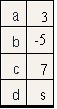


**Dataframe**

A **two-dimensional** labeled data structure with columns of potentially different types

```
 data = { 'Country' : ['Belgium' ,'India ',' Brazil'  ] ,
			  'Capital': ['Brussels','New Delhi','Brasilia'] ,
			'Population': [111908s6, 1303171035, 207847528]}
 df = pd.DataFrame(data,columns=[ 'Country' , 'Capital' , 'Population' ])

```

**Dropping**

```python
 s.drop(['a', 'c']) #Drop values from rows (axis=B)
 df.drop( 'Country', axis=l) #Drop values from columns(axis=l)
```

**Sort & Rank**

```python
 df.sort_index() #Sort by labels along an axis
 df.sort_values( by='Country') #Sort by the values along on axis
 df.rank() #Assign ranks to entries
```

### I/O

**Read and Write to CSV**

```python
 pd.read_csv('file.csv', header=None, nrows=5)
 df.to_csv('myDataFrame.csv')
```

**Read and Write to Excel**

```python
 pd.read_excel( 'file.xlsx')
 df.to_excel('dir/myDataFrame.x lsx', sheet_name= 'Sheet1')
```

Read multiple sheets from the same file

```python
 xlsx = pd.ExcelFile('file.xls')
 df = pd.read_excel(xlsx, 'Sheet1')
```

**Read and Write to SQL Query or Database Table**

```python
 from sqlalchemy import create_engine
 engine = create_eng ine('sqlite:///:memory:' )
 pd.read_sql( "SELECT* FROM my_tabl e;", engine)
 pd.read_sql_ tabl e('my_ tabl e', engine)
 pd.read_sql_query( "SELECT * FROM my_table;", engine)

```

read_sql() is a convenience wrapper around read_sql_table() and read_sql_query()

```
 df.to_sql('myDf',engine)
```

### Selection

**Getting**

```python
 s['b'] #Get one element
-5
```

```python
 df[l:] #Get subset of a DataFrome
Country Capital Population 1 India New Delhi 1303171035
2 Brazil Brasilia 207847528
```

**Selecting, Boolean Indexing** & **Setting**

**By Position**

```python
 df.iloc[[0],[0]] #Select single value by row & column
'Belgium'
 df.iat([0],[0])
'Belgium'
```

**By Label**

```python
 df.loc[[0], [ 'Country']] #Select single value by row & column labels 'Belgium'
 df.at([0], [ 'Country ']) 'Belgium'
```

**By Label/Position**

```python
 df.ix[2] #Select single row of subset of rows
Country Brazil Capital Brasilia Population 207847528
 df.ix[:,'Capital'] #Select a single column of subset of columns
0	Brussels
1	New Delhi
2	Brasilia
 df.ix[1,'Capital'] #Select rows and columns 'New Delhi'
```

**Boolean Indexing**

```py
 s[N(s > 1)] #Series s where value is not >l
 s[(s < -1) I (s > 2)] #s where value is f-1 or >2
 df[df['Population']>1200000000] #Use filter to adjust DataFrame
```

**Setting**

```python
 s['a'] = 6 #Set index a of Series s to 6
```

### Retrieving Series/DataFrame Information

**Basic Information**

```python
 df.shape #(rows,columns)
 df.index #Describe index
 df.columns #Describe DataFrame columns
 df.info() #Info on DataFrame
 df.count() #Number of non-NA values
```

**Summary**

```python
 df.sum() #Sum of values
 df.cumsum() #Cummulative sum of values
 df.min() /df.max() #11inimum/maximum values
 df.idxmin()/df.idxmax() #Minimum/Maximum index value
 df.describe() #Summary statistics
 df.mean() #11ean of values
 df.median() #Median of values
```

### Applying Functions

```python
 f = lambda x: X*2
 df.apply(f) #Apply function
 df.applymap(f) #Apply function element-wise
```

**Data Alignment**

**Internal Data Alignment**

```python
 s3 = pd.Series([7, -2, 31, index= ['a','c' ,'d'])
 s + s3
a 10.0
b NaN
C 5.0
d 7.0
```

**Arithmetic Operations with Fill Methods**

**You can also do the internal data alignment yourself with the help of the fill methods:**

```python
 s.add(s3, fill_values=0) a 10.0
b -5. 0
C 5.0
d 7.0
 s.sub(s3, fill_value=2)
 s.div(s3, fill_value=4)
 s.mul(s3, fill_value=3)
```

# Section 4

## Data Analysis with Numpy


The NumPy library is the  core library  for scientific computing in Python.  It provides a high performance multidimensional array object , and tools  for  working  with these arrays

**Use the  following import convention**

```py
import numpy as np
```

**Creating Array**

```python
 a = np.array([l,2,3])
 b = np.array([(l.5,2,3), (4,5,6)], dtype = float)
 c = np.array([[(l.5,2,3), (4,5,6)],[(3,2,1), (4,5,6)]], dtype = float)
```


**Initial Placeholders**

```python
 np.zeros((3,4)) #Create an array af zeros
 np.ones((2,3,4),dtype=np.int16) #Create an array of ones
 d = np.arange(10,25,5) #Create an array of evenly spaced values (step value)
 np.linspace(0,2,9) #Create an array of evenly spaced values (number of samples)
 e = np.full((2,2),7) #Create a constant array
 f = np.eye(2) #Create a 2X2 identity matrix
 np.random.random((2,2)) #Create an array with random values
 np.empty((3,2)) #Create an empty array

```

### **I/O**

**Saving** **&** **Loading On Disk**

```python
 np.save('my_array',a)
 np.save('array.npz',a, b)
 np.load('my_array.npy ')
```

**Saving & Loading Text Files**

```python
 np.loadtxt("myfile.txt")
 np.genfromtxt("my_file.csv", delimiter=',' )
 np.savetxt("myarray.txt" , a, delimiter=" " )
```

### Inspecting  Your Array

```python
 a.shape #Array dimensions
 len(a) #Length of array
 b.ndim #Number of array dimensions
 e.size #Number of array elements
 b.dtype #Data type of array elements
 b.dtype.name #Name of data type
 b.astype(int) #Convert an array to a different type
```

**Data Type**

```python
 np.int64 #Signed 64-bit integer types
 np.flaat32 #Standard double-precision floating paint
 np.complex #Complex numbers represented by 128 floats
 np.baol #Boolean type storing TRUE and FALSE values
 np.object #Python object type
 np.string _ #Fixed-length string type
 np.unicode_ #Fixed-length unicode type
```


## Array  Mathematics

**Arithmetic Operations**

```python
 g = a - b #Subtraction
array([[-0.5,0. , 0. ],
		[-3. , -3. , -3. ]])
 np.subtract(a,b) #Subtraction
 b + a #Addition
array([[ 2.5, 4. , 6. ],
		[5.,7.,9.]])
 np.add(b,a) Addition
 a / b #Division
array([[ 0.66666667, 1., 1.],
		[ 0.25 , 0.4 , 0.5 ]])
 np.divide(a,b) #Division
 a * b #Multiplication
array([[ 1.5, 4. , 9. ],
	[ 4. , 10. , 18. ]])
 np.multiply(a,b) #Multiplication
 np.exp(b) #Exponentiation
 np.sqrt(b) #Square root
 np.sin(a) #Print sines of an array
 np.cos(b) #Element-wise cosine
 np.log(a) #Element-wise natural logarithm
 e.dot(f) #Dot product
array([[ 7., 7.],
```

**Comparison**

```python
a == b #Element-wise comparison
array([[False, True , True],
[ False, False, False]], dtype=bool)
 a < 2 #Element-wise comparison
array([True , False, False], dtype=bool)
 np.array_equal(a, b) #Array-wise comparison
```

**Aggregate Functions**

```python
 a.sum() #Array-wise sum
 a.min() #Array-wise minimum value
 b.max(axis=0) #Maximum value of an array row
 b.cumsum(axis=l) #Cumulative sum of the elements
 a.mean() #Mean
 b.median() #Median
 a.corrcaef() #Correlation coefficient
 np.std(b) #Standard deviation
```

### Copying Array

```python
 h = a.view() #Create a view af the array with the some data
 np.capy(a) #Create a copy of the array
 h = a.copy() #Create a deep copy of the array
```

### Sorting Array

**Subsetting**

```python
 a[2] #Select the element at the 2nd index
3
```

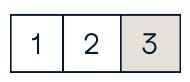

```python
 b[1,2] #Select the element at row 1 column 2 (equivalent to b[1][2])
6.0
```

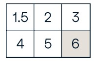

**Slicing**

```python
 a[0:2] #Select items at index 0 and 1
array([1, 2])
```

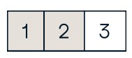

```python
 b[0:2,1] #Select items at rows 0 and 1 in column 1
array([ 2., 5.])
```

```python
 b[:1] #Select all items at row 0 (equivalent to b[0:1, :])
array([[1.5, 2., 3.]])
```

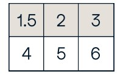

```python
 c[1,... ] #Same as [1,:,:]
array([[[ 3., 2., 1.],
[  4., 5.,	6.]]])
 a[: :-1] #Reversed array a array([3, 2, 1])
```

**Boolean Indexing**

```python
 a[a<2] #Select elements from a less than 2
array([1])
```

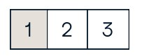

**Fancy Indexing**

```python
 b[[l, 0, 1, 0],[0, 1, 2, 0]] #Select elements (1,0),(0,1),(1,2) and (0,0)
array([ 4. , 2. , 6. , 1.5])
 b[[l, 0, 1, 0]][:,[0,1,2,0]] #Select a subset of the matrix's rows and columns array([[ 4. ,5. , 6. , 4. ],
            [ 1.5, 2.3,	1.5],
```


### Array  Manipulation

**Transposing Array**

```python
 i = np.transpose(b) #Permute array dimensions
 i.T #Permute array dimensions
```

**Changing Array Shape**

```python
 b.ravel() #Flatten the array
 g.reshape(3,-2) #Reshape, but don't change data
```

**Adding/Removing Elements**


```python
 h.resize((2,6)) #Return a new array with shape (2,6)
 np.append(h,g) #Append items to an array
 np.insert(a, 1, 5) #Insert items in an array
 np.delete(a,[1]) #Delete items from an array
```

**Combining Arrays**

```python
 np.concatenate((a,d),axis=0) #Concatenate arrays array([ 1, 2, 3, 10, 15, 20])
 np.vstack((a,b)) #Stack arrays vertically (row-wise)
array([[ 1. , 2.	3. ],
        [ 1.5, 2. , 3. ],
        [   4.    ,   5.    ,   6.    ]])
 np.r_[e,f] #Stack arrays vertically (row -wise)
 np.hstack((e,f)) #Stack arrays horizontally (col umn-wise)
array([[ 7., 7., 1., 0.],
    [ 7., 7., 0., 1.]])
 np.column_stack((a,d)) #Create stacked column-wise arrays
array([[ 1, 10],
    [ 2,  15],
    [ 3, 20]])
 np.c_[a ,d] #Create stacked column-wise arrays

```

**Splitting Arrays**

```python
 np.hsplit(a,3) #Split the array horizontally at the 3rd index
[array([1]),array([2]),array([3])]
 np.vsplit(c,2) #Split the array vertically at the 2nd index
[array([[[ 1.5, 2. , 1. ],
        [ 4. , 5. , 6. ]]]),
array([[[ 3., 2., 3.],
        [  4.,	5.,	6.]]])]
```

# Section 5

## Data Visualization with Matplotlib

Matplotlib is a Python 2D plotting library which produces publication-quality figures in a variety of hardcopy formats and interactive environments across platforms.

**1D Data**

```
 import numpy as np
 X = np.linspace(0, 10, 100)
 y = np.cos(x)
 z = np.sin(x)

```

**2D Data or Images**

```python
 data= 2 * np.random.random((10, 10))
 data2 = 3 * np.random.random((10, 10))
 Y, X = np.mgrid[-3:3:100j, -3:3:100j]
 U = -1 - X**2 + Y
 V = 1 +  X - Y**2
 from matplotlib.cbook import get_sample_data
 img = np.load(g et_sample_data('axes_gr id/bivar iate_normal.npy '))
```

### Create Plot

```
import matplotlib.pyplot as plt
```

**Figure**

```python
 fig = plt.figure()
 fig2 = plt.figure(figsize=plt.figaspect(2.0))
```

**Axes**

ll plotting is done with respect to an Axes. In most cases, a subplot will fit your needs.  A subplot is an axes on a grid system.

```
 fig.add_axes()
 ax1 = fig.add_subplot(221)#row-col-num
 ax3 = fig.add_subplot(212)
 fig3, axes= plt.subplots(nrows=2,ncols=2)
 fig4, axes2 = plt.subplots(ncols=3)
```

**Save Plot**

```
 plt.savefig( 'foe.png' J #Save figures
 plt.savefig( 'foo.png',transparent=True) #Save transparent figures
```

**Show Plot**

```
 plt.show()
```

### Plotting Routines

**1D Data**

```python
 fig, ax= plt.subp lots()
lines= ax.plot(x,y) #Draw points with lines or markers connecting them
 ax.scatter(x,y) #Draw unconnected points, scaled or colored
 axes[0,0].bar([l,2,3],[3,4,5]) #Plot vertical rectangles (constant width)
 axes[l,0].barh([0.5,1,2.5],[0,1,2]) #Plot horiontol rectangles (constant height)
 axes[l,1].axhline(0.s5) #Draw a horizontal line across axes
 axes[0,1].axvline(0.65) #Draw a vertical line across axes
 ax.fill(x,y,color='blue') #Drow filled polygons
 ax.fill_between(x,y,color='yellow') #Fill between y-values and 0

```

**2D Data**


```
 fig, ax= plt.subplots()
 im = ax.imshow(img, #Colormapped or RGB arrays
            cmap= 1 gist_ear th 1 ,
            interpolation= 1 neare st',
            vmin=-2,
            vmax =2)
 axes2[0].pcolor(data2) #Pseudocolor plot of 2D array
 axes2[0].pcolormesh(data) #Pseudocolor plot of 2D array
CS= plt.contour(Y,X,U) #Plot contours
 axes2[2].contourf(datal) #Plot filled contours
 axes2[2]= ax.clabel(CS) #Lobel a contour plot

```

**Vector Fields**

```
 axes[0,1].arrow(0,0,0.5,0.5) #Add an arrow to the axes
 axes[l,l].quiver(y,z) #Plot a 2D field of arrows
 axes[0,1].streamplot(X,Y,U,V) #Plot a 2D field of arrows

```

**Data Distributions**

```
 axl.hist(y) #Plot a histogram
 ax3.boxplot(y) #Make a box and whisker plot
 ax3.violinplot(z) #Make a violin plot

```

### Plot Anatomy

The basic steps to creating plots with matplotlib are:

**1** Prepare Data **2** Create Plot **3** Plot **4** Customized Plot **5** Save Plot **6** Show Plot


```python
 import matplotlib.pyplot as plt
 x = [1,2,3,s] #Step 1
 y = [ 10,20,25,30]
fig= plt.figure() #Step 2
ax= fig.add_subp lot(lll) #Step 3
 ax.plot(x, y, color='lightb lue', linewidth=3) #Step 3, 4
 ax.scatter([2,4,6],
                [5,15,25],
                color='darkgreen ', 
                marker='^')
 ax.set_xlim(l, 6.5)
 plt.savefig('foo.png' ) #Step 5
 plt.show() #Step 6
```

**Close and Clear**

```python
 plt.cla() #Clear on axis
 plt.clf() #Clear the entire figure
 plt.close() #Close a window
```


### Plotting Cutomize Plot

**Colors, Color Bars & Color Map**

```python
 plt.plot(x, x, x, X**2, x, X**3)
 ax.plot(x, y, alpha = 0.s)
 ax.plot(x, y, c='k' )
 fig.colorbar(im, orientation= 'horizontal')
 im = ax.imshow(img,cmap=  'seismic'  )

```

**Markers**

```
 fig, ax= plt.subplots()
 ax.scatter(x,y,marker="."   )
 ax.plot(x,y ,marker="o")
```

​	**Linestyles**

```python
 plt.plot(x,y,linewidth=4.0)
 plt.plot(x,y,ls='solid')
 plt.plot(x,y,ls='--' )
 plt.plot(x, y,'-- 1 ,X**2,Y** 2, '-.')
 plt.setp(lines,color='r',linewidth= 4.0)
```

**Text** & **Annotations**

```
 ax.text(1,-2.1,'Example Graph' , style='italic')
 ax.annotate("Sine",
                xy=(8, 0),
                xycoords= 'data', 
                xytext=(10.5, 0), 
                textcoords= 1 data', 
                arrowprops=dict(arrowstyle= "->" connectionstyle="arc3"),)
```

**Mathtext**

```
 plt.title(r'$sigma_ i=15$', fontsize=20)
```

**Limits, Legends and Layouts**

Limits & Autoscaling

```python
 ax.margins(x=0.0,y=0.1) #Add padding to a plot
 ax.axis('equa l') #Set the aspect ratio of the plot to 1
 ax.set(xlim=[0,10.5],ylim=[-1.5,l.5]) #Set limits for x-and y-axis
 ax.set_xlim(0,10.5) #Set limits for x-axis
```

**Legends**


```python
 ax.set(	title='An Example Axe s', #Set a title and x-ond y-axis labels 
           ylabel='Y-Axis',
           xlabel='X-Axis')
 ax.legend( loc='best') #No overlapping plot elements
```

**Ticks**

```python
 ax.xaxis.set(ticks=range(l,5), #Manually set x-ticks
ticklabels=[3,100,-12,"foo']')
     #Makey-ticks longer and go in and out 
 ax.tick_param s(axis='y',direction='inout ',length=10)
     
```

**Subplot Spacing**

```python
 fig3.subplots_ad just(wspace=0.5, #Adjust the spacing between subplots
hspace=0.3, left=0.125, right=0.9, top=0.9, bottom=0.1)
 fig.tight_layout() #Fit subplot(s) in to the figure area
```

**Axis Spines**

```python
 axl.spines['top'].set_visible(False)
#Make the top axis line for a plot invisible
 axl.spines['bottom'].set_po sition(('outward' ,10))
#Move the bottom axis line outward
```

# Section 6

# Queries in SQL 


## **Querying** data **from a table**

Query data in columns c1, c2 from a table

```sql
SELECT c1, c2 FROM t;
```

Query all rows and columns from a table

```sql
SELECT * FROM t;
```

Query data and filter rows with a condition

```sql 
SELECT c1, c2 FROM t
WHERE condition;
```

Query distinct rows from a table

```sql
SELECT DISTINCT c1 FROM t
WHERE condition;
```

Sort the result set in ascending or descending order

```sql
SELECT c1, c2 FROM t
ORDER BY c1 ASC [DESC];
```

Skip *offset* of rows and return the next n rows

```sql
SELECT c1, c2 FROM t
ORDER BY c1 
LIMIT n OFFSET offset;
```

Group rows using an aggregate function

```sql
SELECT c1, aggregate(c2)
FROM t
GROUP BY c1;
```

Filter groups using HAVING clause

```sql
SELECT c1, aggregate(c2)
FROM t
GROUP BY c1
HAVING condition;
```

## **Querying** from **multiple tables**

Inner join t1 and t2

```sql
SELECT c1, c2 
FROM t1
INNER JOIN t2 ON condition;
```

Left join t1 and t1

```sql
SELECT c1, c2 
FROM t1
LEFT JOIN t2 ON condition;
```

Right join t1 and t2

```sql
SELECT c1, c2 
FROM t1
RIGHT JOIN t2 ON condition;
```

Perform full outer join

```sql
SELECT c1, c2 
FROM t1
FULL OUTER JOIN t2 ON condition;
```

Produce a Cartesian product of rows in tables

```sql
SELECT c1, c2 
FROM t1
CROSS JOIN t2;
```

Another way to perform cross join

```sql
SELECT c1, c2 
FROM t1, t2;
```

Join t1 to itself using INNER JOIN clause

```sql
SELECT c1, c2
FROM t1 A
INNER JOIN t1 B ON condition;
```

## Using SQL Operators

Combine rows from two queries

```sql
SELECT c1, c2 FROM t1
UNION [ALL]
SELECT c1, c2 FROM t2;
```

Return the intersection of two queries

```sql
SELECT c1, c2 FROM t1
INTERSECT
SELECT c1, c2 FROM t2;
```

Subtract a result set from another result set

```sql
SELECT c1, c2 FROM t1
MINUS
SELECT c1, c2 FROM t2;
```

Query rows using pattern matching %, _

```sql
SELECT c1, c2 FROM t1
WHERE c1 [NOT] LIKE pattern;
```

Query rows in a list

```sql
SELECT c1, c2 FROM t
WHERE c1 [NOT] IN value_list;
```

Query rows between two values

```sql
SELECT c1, c2 FROM t
WHERE  c1 BETWEEN low AND high;
```

Check if values in a table is NULL or not

```sql
SELECT c1, c2 FROM t
WHERE  c1 IS [NOT] NULL;
```

## Managing tables

Create a new table with three columns

```sql
CREATE TABLE t (
     id INT PRIMARY KEY,
     name VARCHAR NOT NULL,
     price INT DEFAULT 0
);
```

Delete the table from the database

```sql
DROP TABLE t ;
```

Add a new column to the table

```sql
ALTER TABLE t ADD column;
```

Drop column c from the table

```sql
ALTER TABLE t DROP COLUMN c ;
```

Add a constraint

```sql
ALTER TABLE t ADD constraint;
```

Drop a constraint

```sql
ALTER TABLE t DROP constraint;
```

Rename a table from t1 to t2

```sql
ALTER TABLE t1 RENAME TO t2;
```

Rename column c1 to c2

```sql
ALTER TABLE t1 RENAME c1 TO c2 ;
```

Remove all data in a table

```sql
TRUNCATE TABLE t;
```

## **Using** **SQL** constraints

Set c1 and c2 as a primary key

```sql
CREATE TABLE t(
    c1 INT, c2 INT, c3 VARCHAR,
    PRIMARY KEY (c1,c2)
);
```

Set c2 column as a foreign key

```sql
CREATE TABLE t1(
    c1 INT PRIMARY KEY,  
    c2 INT,
    FOREIGN KEY (c2) REFERENCES t2(c2)
);
```

Make the values in c1 and c2 unique

```sql
CREATE TABLE t(
    c1 INT, c1 INT,
    UNIQUE(c2,c3)
);
```

Ensure c1 > 0 and values in c1 >= c2

```sql
CREATE TABLE t(
  c1 INT, c2 INT,
  CHECK(c1> 0 AND c1 >= c2)
);
```

Set values in c2 column not NULL

```sql
CREATE TABLE t(
     c1 INT PRIMARY KEY,
     c2 VARCHAR NOT NULL
);
```

## Modifying **Data**

Insert one row into a table

```sql
INSERT INTO t(column_list)
VALUES(value_list);
```

Insert multiple rows into a table

```sql
INSERT INTO t(column_list)
VALUES (value_list), 
       (value_list), …;
```

Insert rows from t2 into t1

```sql
INSERT INTO t1(column_list)
SELECT column_list
FROM t2;
```

Update new value in the column c1 for all rows

```sql
UPDATE t
SET c1 = new_value;
```

Update values in the column c1, c2 that match the condition

```sql
UPDATE t
SET c1 = new_value, 
        c2 = new_value
WHERE condition;
```

Delete all data in a table

```sql
DELETE FROM t;
```

Delete subset of rows in a table

```sql
DELETE FROM t
WHERE condition;
```

## Managing Views

Create a new view that consists of c1 and c2

```sql
CREATE VIEW v(c1,c2) 
AS
SELECT c1, c2
FROM t;
```

Create a new view with check option

```sql
CREATE VIEW v(c1,c2) 
AS
SELECT c1, c2
FROM t;
WITH [CASCADED | LOCAL] CHECK OPTION;
```

Create a recursive view

```sql
CREATE RECURSIVE VIEW v 
AS
select-statement -- anchor part
UNION [ALL]
select-statement; -- recursive part
```

Create a temporary view

```sql
CREATE TEMPORARY VIEW v 
AS
SELECT c1, c2
FROM t;
```

Delete a view

```sql
DROP VIEW view_name;

```

## **Managing indexes**

Create an index on c1 and c2 of the t table

```sql
CREATE INDEX idx_name 
ON t(c1,c2);

```

Create a unique index on c3, c4 of the t table

```sql
CREATE UNIQUE INDEX idx_name
ON t(c3,c4)

```

Drop an index

```sql
DROP INDEX idx_name;

```

## **Managing** triggers

Create or modify a trigger

```sql
CREATE OR MODIFY TRIGGER trigger_name
WHEN EVENT
ON table_name TRIGGER_TYPE
EXECUTE stored_procedure;

```

**WHEN**

- **BEFORE** – invoke before the event occurs
- **AFTER** – invoke after the event occurs

**EVENT**

- **INSERT** – invoke for INSERT
- **UPDATE** – invoke for UPDATE
- **DELETE** – invoke for DELETE

**TRIGGER_TYPE**

- **FOR EACH ROW**
- **FOR EACH STATEMENT**

Delete a specific trigger

```sql
DROP TRIGGER trigger_name;

```

# Section 7 

# Machine Learning with Scikit-Learn

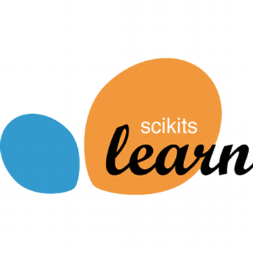

Scikit-learn is an open source Python library that implements a range of machine learning, preprocessing, cross-validation and visualization algorithms using a unified interface.

**Example**

```python
 from sklearn import neighbors, datasets, preprocessing
 from sklearn.model_selection import train_test_split
 from sklearn.metrics import accuracy_score
iris= datasets.load_iris()
 X, y = iris.data[:, :2], iris.target
 X_train, X_test, y_train, y_test = train_test_split(X, y, random_state=33)
scaler= preprocessing.StandardScaler().fit(X_train)
 X_train = scaler.transform(X_train)
 X_test = scaler.transform(X_test)
 knn = neighbors.KNeighborsClassifier(n_neighbors=5)
 knn.fit(X_train, y_train)
 y_pred = knn.predict(X_test)
 accuracy_score(y _test, y_pred)
```

### Loading The Data

**Your data needs to be numeric and stored as NumPy arrays or SciPy sparse matrices. Other types that are convertible to numeric arrays, such as Pandas DataFrame, are also acceptable**

```python
 import numpy as np
 X = np.random.random((10,5))
 Y = np. array (['M', 'M' ,'F','F','M','F','M','M','F','F','F'])
 X[X < 0.7] = 0
```

### Training And Test Data

```python
 from sklearn.model_selection import train_test_split
 X_train, X_test, y_train, y_test = train_test_split(X,y, random_state=0)

```

### Model Fitting

**Supervised learning**

```python
 lr.fit(X, y) #Fit the model to the data
 knn.fit(X_train, y_train)
 svc.fit(X_train, y_train)
```


**Unsupervised Learning**

```python
 k_mean s.fit(X_train) #Fit the model to the data
 pca_model = pca.fit_transform(X_train) #Fit to data, then transform it
```


### Prediction

**Supervised Estimators**

```python
 y_pred = svc.predict(np.random.random((2,5))) #Predict labels
 y_pred = lr.predict(X_test) #Predict labels
 y_ pred = knn.predict_proba(X_test) #Estimate probability of a label
```

**Unsupervised Estimators**

```python
 y_pred = k_means.predict(X_test) #Predict labels in clustering algos
```

### Preprocessing The Data

**Standardization**

```python
 from sklearn.preprocessing import StandardScaler
 scaler= StandardScaler().fit(X_train)
 standardized_X = scaler.transform(X_train)
 standardized_X_test= scaler.transform(X _test)
```


**Normalization**

```python
 from sklearn.preprocessing import Normalizer
scaler= Normalizer().fit(X_train)
 normalized_X = scaler.transform(X _train)
 normalized_X_test = scaler.transform(X_test)
```

**Binarization**

```python
 from sklearn.preprocessing import Binarizer
 binarizer = Binarizer(threshold=0.0).fit(X)
 binary_X = binarizer.transform(X)

```

**Encoding Categorical Features**

```python
 from sklearn.preprocessing import LabelEncoder
enc= LabelEncoder()
 y = enc.fit_transform(y)
```

**Imputing Missing Values**

```python
 from sklearn.preprocessing import Imputer
imp= Imputer(missing_values=0, strategy='mean ', axis=0)
 imp.fit_transform(X_train)
```

**Generating Polynomial Features**

```python
 from sklearn.preprocessing import PolynomialFeatures
poly= PolynomialFeatures(5)
 poly.fit_transform(X)
```

## Create Your Model

### Supervised Learning Estimators

**Linear Regression**

```python
 from sklearn. linear m_ odel import LinearRegression
 lr = LinearRegression(normalize=True)
```

**Support Vector Machines (SVM)**

```python
 from sklearn.svm import SVC
SVC= SVC(kernel='linear')
```

**Naive Bayes**

```python
 from sklearn.naive_bayes import GaussianNB
 gnb = GaussianNB()
```

**KNN**

```python
 from sklearn import neighbors
 knn = neighbors.KNeighborsClassifier(n_neighbors=5)
```

### Unsupervised Learning Estimators

**Principal Component Analysis (PCA)**

```python
 from sklearn.decomposition import PCA
pea= PCA(n_components=0.95)
```

**K Means**

```python
 from sklearn.cluster import KMeans
 k_means = KMeans(n_clusters=3, random_state=0)
```

## Evaluate Your Model’s Performance

### **Classification Metrics**

**Accuracy Score**

```python
 knn.score(X_test, y_test) #Estimator score method
 from sklearn.metrics import accuracy_score #Metric scoring functions
 accuracy_score(y_test, y_pred)
```

**Classification Report**

```python
 from sklearn.metrics import classification_report #Precision, recall, fl-score and support
 print(classification_report(y_test, y_pred))
```


**Confusion Matrix**

```python
 from sklearn.metrics import confusion_matrix
 print(confusion_matrix(y_test.y_pred))
```


### Regression Metrics

**Mean Absolute Error**

```python
 from sklearn.metrics import mean_absolute_error
 y_true = [3, -0.5,2]
 mean_absolute_error(y_true, y_pred)

```

**Mean Squared Error**

```python
 from sklearn.metrics import mean_squared_error
 mean_squared _error(y_test, y_ pred)
```

**R2 Score**

```python
 from sklearn.metrics import r2_score
 r2_score(y_true, y_ pred)
```


### Clustering Metrics

**Adjusted Rand Index**

```python
 from sklearn.metrics import adjusted_rand_score
 adjusted_rand_score(y_true, y_pred)

```

**Homogeneity**

```python
 from sklearn.metrics import homogeneity_score
 homogeneity_score(y_true, y_pred)
```

**V-measure**

```python
 from sklearn.metrics import v_measure_score
metrics.v_measure_score(y_true , y_pred)
```

### Cross-Validation

```python
 from sklearn.cross_validation import cross_val_score
 print(cross_val_score(knn, X_train, y_train, cv=4))
 print(cross_val_score(lr, X, y, cv=2))
```

## Tune Your Model


### **Grid Search**

```python
 from sklearn.grid_search import GridSearchCV
 params = {"n_neighbors "  : np.arange(l,3),
				"metric "	 : [ "euclidean" , "cityblock "] }
grid= GridSearchCV(estimator=knn,
					param_grid=params)
 grid.fit(X_train, y_train)
 print(grid.best_score_)
 print(grid.best_estimator_.n_neighbors)
```

**Randomized Parameter Optimization**

```python
 from sklearn.grid _search import RandomizedSearchCV
 params = { "n_neighbors":range(l,5), "weights": ["unifomr","distance"]}
 rsearch = RandomizedSearchCV(estimator=knn, param_distributions=params,
                                cv=4, n_iter=S, random_state=5)
 rsearch.fit(X_train, y_train)
 print(rsearch.best_score_)
```

# Section 8

## SciPy


**The SciPy library is one of the core packages for scientific computing that provides mathematical algorithms and convenience functions built on the NumPy extension of Python.**

```python
 import numpy as np
 a= np.array([1,2,3])
 b = np.array([(1+5j,2j,3j), (4j,5j,6j)])
 c = np.array([[(1.5,2,3), (4,5,6)], [(3,2,1), (4,5,6)]])
```

**Index Tricks**

```python
 np.mgrid[0:5,0:5] #Create a dense meshgrid
 np.ogrid[0:2,0:2] #Create an open meshgrid
 np.r_[[3,[0]*5,-1:1:10j] #Stack arrays vertically (row-wise)
 np.c_[b,c] #Create stocked column-wise arrays
```

**Shape Manipulation**

```python
 np.transpose(b) #Permute array dimensions
 b.flatten() #Flatten the array
 np.hstack((b,c)) #Stack arrays horizontally (column-wise)
 np.vstack((a,b)) #Stack arrays vertically (row-wise)
 np.hsplit(c,2) #Split the array horizontally at the 2nd index
 np.vpslit(d,2) #Split the array vertically at the 2nd index
```

**Polynomials**

```python
 from numpy import polyld
 p = poly1d([3,4,5]) #Create a polynomial object
```

**Vectorizing Functions**

```
 def myfunc(a): if a< 0:
        return a*2
        else:
        return a/2
 np.vectorize(myfunc) #Vectorize functions

```

**Type Handling**

```python
 np.real(c) #Return the real part of the array elements
 np.imag(c) #Return the imaginary part of the array elements
 np.real_if_close(c,tol=1000) #Return a real array if complex parts close to 0
 np.cast['f'](np.pi) #Cast object to a data type
```

**Other Useful Functions**

```python
 np.angle(b,d eg=True) #Return the angle of the complex argument
 g = np.linspace(0,np.pi,num=5) #Create an array of evenly spaced values(number of samples)
 g [3:] += np.pi
 np.unwrap(g) #Unwrap
 np.logspace(0,10,3) #Create an array of evenly spaced values (log scale)
 np.select([c<li],[c*2]) #Return values from a list of arrays depending on conditions
 misc.factorial(a) #Factorial
 misc.comb( 10,3,exact=True) #Combine N things taken at k time
 misc.central_diff_weights(3) #Weights for Np-point central derivative
 misc.derivative(myfunc,1.0) #Find then-th derivative of a function at a point

```


### Linear Algebra

You'll use the **linalg** and sparse modules. Note that **scipy. linalg** contains and expands on **numpy. linalg.**

```python
 from scipy import linalg, sparse
```

**Creating Matrices**

```python
 A = np.matrix(np.random.random((2,2)))
 B = np.asmatrix(b)
 C = np.mat(np.random.random((10,5)))
 D = n p.mat([[3,Ii],  [5,6]])
```

**Basic Matrix Routines**

```
 A.I #Inverse
 linalg.inv(A)  #Inverse
 A.T #Tranpose matrix
 A.H #Conjugate transposition
 np.trace(A) #Trace
```

**Norm**

```
 linalg.norm(A) #Frobenius norm
 linalg.norm(A,1) #Ll norm (max column sum)
 linalg.norm(A,np.inf) #L inf norm (max row sum)
```

**Rank**

```
 np.linalg.matrix_rank(C) #Matrix rank
```

**Determinant**

```
 linalg.det(A) #Determinant
```

**Solving linear problems**

```
 linalg.solve(A,b) #Solver for dense matrices
 E = np.mat(a).T #Solver for dense matrices
 linalg.lstsq(D,E) #Le ast-squares solution to linear matrix equation
```

**Generalized inverse**

```
 linalg.pinv(C) #Compute the pseudo-inverse of a matrix (least-squares solver)
 linalg. pinv2(C) #Compute the pseudo-inverse of a matrix (SVD)
```

### **Creating Sparse Matrices**

```
 F = np.eye(3, k=l) #Create a 2X2 identity matrix
 G = np.mat(np.identity(2)) #Create a 2x2 identity matrix
 C[C > 0.5] = 0
 H = sparse.csr_matrix(C) #Compressed Sparse Row matrix
 I=	sparse.csc_matrix(D) #Compressed Sparse Column matrix
 J = sparse.dok_matrix(A) #Dictionary Of Keys matrix
 E.tadense() #Sparse matrix to full matrix
 sparse.isspmatrix_csc(A) 
```

**Sparse Matrix Routines**

**Inverse**

```
 sparse.linalg.inv(I) #Inverse
```

**Norm**

```
 sparse.linalg.norm(I) #Norm
```

**Solving linear problems**

```
 sparse.linalg.spsolve(H,I) #Solver for sparse matrices
```

**Sparse Matrix Functions**

```
 sparse.linalg.expm(I) #Sparse matrix exponential
```

**Sparse Matrix Decompositions**

```
 la, v = sparse.linalg.eigs(F,1) #Eigenvalues and eigenvectors
 sparse.linalg.svds(H, 2) #SVD
```

## Matrix Function

**Addition**

```
 np.add(A,D) #Addition
```

**Subtraction**

```
 np.subtract(A,D) #Subtraction
```

**Division**

```
 np.divide(A,D) #Division
```

**Multiplication**

```python
 np.multiply(D,A) #Multiplication
 np.dot(A,D) #Dot product
 np.vdot(A,D) #Vector dot product
 np.inner(A,D) #Inner product
 np.outer(A,D) #Outer product
 np.tensardat(A,D) #Tensor dot product
 np.kron(A,D) #Kronecker product
```

**Exponential Functions**

```python
 linalg.expm(A) #Matrix exponential
 linalg.expm2(A) #Matrix exponential (Taylor Series)
 linalg.expm3(D) #Matrix exponential (eigenvalue decomposition)
```

**Logarithm Function**

```
 linalg.lagm(A) #Matrix logarithm
```

**Trigonometric Functions**

```
 linalg.sinm(D) Matrix sine
 linalg.cosm(D) Matrix cosine
 linalg.tanm(A) Matrix tangent
```

Hyperbolic Trigonometric Functions

```
 linalg.sinhm(D) #Hypberbolic matrix sine
 linalg.coshm(D) #Hyperbolic matrix cosine
 linalg.tanhm(A) #Hyperbolic matrix tangent
```

**Matrix Sign Function**

```
 np.sigm(A) #Matrix sign function
```

Matrix Square Root

```
 linalg.sqrtm(A) #Matrix square root
```

**Arbitrary Functions**

```
 linalg.funm(A, lambda x: X*X) #Evaluate matrix function
```

**Eigenvalues and Eigenvectors**

```
 la, v = linalg.eig(A) #Solve ordinary or generalized eigenvalue problem for square matrix
 l1, l2 = la #Unpack eigenvalues
 v[:,0] #First eigenvector
 v[:,1] #Second eigenvector
 linalg.eigvals(A) #Unpack eigenvalues
```

**Singular Value Decomposition**

```
 U,s,Vh = linalg.svd(B) #Singular Value Decomposition (SVD)
 M,N = B.shape
Sig= linalg.diagsvd(s,M,N) #Construct sigma matrix in SVD
```

**LU Decomposition**

```
 P,L,U = linalg.lu(C) #LU Decomposition
```


# Section 9 

##  Neural Networks with Keras


**Keras is a powerful and easy-to-use deep learning library for Theano and TensorFlow that provides a high-level neural networks API to develop and evaluate deep learning models.**

**A Basic Example**

```python
 import numpy as np
 from keras.models import Sequential
 from keras.layers import Dense
data= np.random.random((1000,100))
labels= np.random.randint(2,size=(1000,1))
model= Sequential()
 model.add(Dense(32,
                	activation='relu', input_dim=100))
 model.add(Oense(1, activation='sigmoid'))
 model.compile(optimizer='rmsprop' ,
					loss='binary_crossentropy', 
					metrics=['accuracy' ])
 model.fit(data,labels,epochs=10,batch_size=32)
 predictions= model.predict(data)
```

### Data

Your data needs to be stored as NumPy arrays or as a list of NumPy arrays. Ideally, you split the data in training and test sets, for which you can also resort to the train_test_split module of sklearn. cross_ validation.

**Keras Data Sets**

```python
 from keras.datasets import boston_housing, mnist, cifar10, imdb
 (x_train,y_train),(x_test,y_test) = mnist.load _data()
 (x_train2,y_train2),(x_test2,y_test2) = boston_housing.load_data()
 (x_train3,y_train3),(x_test3,y_test3) = cifar10.load_data()
 (x_train4,y_train4),(x_test4,y_test4) = imdb.load_data(num_words=20000)
 num_classes = 10
```

**Other**

```python
 from urllib.request import urlopen
 data =
np.loadtxt(urlopen( "http://archive.ics.uci.edu/ml/machine-learning-databa ses/pima-indians-dibetes/pima-indians-d iabetes.data')',delimiter=",")
 X = data[:,0:8]
 y = data [:,8]
```

### Preprocessing

**Sequence Padding**

```python
 from keras.preprocessing import sequence
 x_train4 = sequence.pad_sequences(x _train4,maxlen=80)
 x test4 = sequence.pad_sequences(x_test4,maxlen=80)
```

**One-Hot Encoding**

```python
 from keras.utils import to_categorical
>>Y_train = to_categorical(y_train,num_classes)
 Y_test = to_categorical(y_test,num_classes)
 Y_train3 = to_categorical(y_train3,num_classes
 Y_test3 = to_categorical(y_test3,num_classes)
```

### Model Architecture

**Sequential Model**

```python
 from keras.models import Sequential
 model= Sequential()
 model2 = Sequential()
 model3 = Sequential()
```

### **Multilayer Perceptron (MLP)**

**Binary Classification**

```python
 from keras.layers import Dense
 model.add(Dense(12,
					input _dim=8, 
					kernel_initializer='uniform',
            		activation='relu') )
 model.add(Dense(8,kernel_initialiezr='uniform',activation='relu'))
 model.add(Dense(l,kernel_initialiezr='uniform',activation='sigmoid'))
```

**Multi-Class Classification**

```python
 from keras.layers import Dropout
 model.add(Dense(512,activation='relu',input_shape=(784,)))
 model.add(Dropout(0.2))
 model.add(Dense(512,activation='relu'))
 model.add(Dropout(0.2))
 model.add(Dense(10,activation='softmax' ))

```

**Regression**

```python
 model.add(Dense(64,activation='relu',input_dim=train_data.shape[1]))
 model.add(Dense(1))
```

## **Convolutional Neural Network (CNN)**

```python
 from keras.layers import Activation,Conv2D,MaxPooling20,Flatten
 model2.add(Conv20(32,(,3),padding= 'same',input _shape=x _train.shape[1:]))
 model2.add(Activation('relu'))
 model2.add(Conv20(32,(3,3)))
 model2.add(Activation('relu'))
 model2.add(MaxPooling2D( pool_size=(2,2)))
 model2.add(Dropout(0.25))
 model2.add(Conv20(64,(3,3), padding= 'same'))
 model2.add(Activation('relu'))
 model2.add(Conv20(64,(3, 3)))
 model2.add(Activation('relu'))
 model2.add(MaxPooling2D( pool_size=(2,2)))
 model2.add(Dropout(0.25))
 model2.add(Flatten())
 model2.add(Dense(512))
 model2.add(Activation('relu'))
 model2.add(Dropout(0.5))
 model2.add(Dense(num_classes))
 model2.add(Activation('softmax'))

```

### **Recurrent Neural Network (RNN)**

```python
 from keras.klayers import Embedding,LSTM
 model3.add(Embedding(20000,128))
 model3.add(LSTM(128,dropout =0.2,recurrent_dropout=0.2))
 model3.add(Dense(l,activation='sigmoid'))
```

### Prediction

```python
 model3.predict(x_test4, ba tch_size=32)
 model3.predict_classes(x_test4,batch _size=32)
```

**Train and Test Sets**

```python
 from sklearn.mode l_selection import train_test_split
 X_train5,X_test5,y_train5,y_test5 = train_test_split(X, y,
														test_size=0.33, random_state=42)
```

**Standardization/Normalization**

```python
 from sklearn.preprocessing import StandardScaler
 scaler= StandardScaler().fit(x_train2)
 standa rdized_X = scaler.transform(x _train2)
 standardized X test= scaler.transform(x_test2
```

###  Inspect Model

```python
 model.output_shape #Model output shape
 model.summary() #Model summary representation
 model.get_config() #Model configuration
 model.get_weights()#List all weight tensors in the model
```

### **Compile Model**

**MLP: Binary Classification**

```python
 model.compile(optimizer='adam' ,
				  loss= 'binary_crossentropy',
                  metrics=['accuracy'])
```

**MLP: Multi-Class Classification**

```python
 model.compile(optimizer='rmsprop',
				loss='categorical_crossentropy   ,
				metrics=[ 'accuracy'])
```

**MLP: Regression**

```python
 model.compile(optimizer='rmsprop',
					loss= 'mse,' metrics=['mae'])
```

**Recurrent Neural Network**

```python
model3.compile(loss='binary_crossentropy ',
				optimizer='adam', 
				metrics=['accuracy'])
```

**Model Training**

```python
model3.fit(x_train4,
           y_train4, 
		   batch_size=32,
		   epochs=15, 
		   verbose=1,
		   validation_data=(x_test4,y_test4))
```

**Evaluate Your Model's Performance**

```python
score = model3.evaluate(x_test,
                         y_test,
                         batch_size=32)
```

**Save/ Reload Models**

```python
 from keras.models import load_model
 model3.save( )
 my_model = load_model( )
```

**Model Fine-tuning**

Optimization Parameters

```python
from keras.optimizers import RMSprop
 opt = RMSprop(lr=0.0001, decay=1e-6)
 model2.compile(loss= , 'categorical_crossentropy'
                 optimizer=opt,
                 metrics=[ 'accuracy'])
```

**Early Stopping**

```python
 from keras.callbacks import EarlyStopping
 early_stopping_monitor = EarlyStopping(patience=2)
 model3.fit(x_train4,
 y_train4,
 batch_size=32,
 epochs=15,
 validation_data=(x_test4,y_test4),
 callbacks=[early_stopping_monitor])
```

# Section 10

# PySpark & Spark SQL


**What is PySpark?**

PySpark is an Apache Spark interface in Python. It is used for collaborating with Spark using APIs written in Python. It also supports Spark’s features like Spark DataFrame, Spark SQL, Spark Streaming, Spark MLlib and Spark Core.


**What is PySpark SparkContext?**

PySpark SparkContext is an initial entry point of the spark functionality. It also represents Spark Cluster Connection and can be used for creating the Spark RDDs (Resilient Distributed Datasets) and broadcasting the variables on the cluster.


```
 from pyspark.sql import SparkSession
 spark = SparkSession \
 .builder \
 .appName( ) \
 .config( , ) \
 .getOrCreate()

```

**What is spark-submit?**

Spark-submit is a utility to run a pyspark application job by specifying options and configurations.
```
spark-submit \
--master <master-url> \
--deploy-mode <deploy-mode> \
--conf <key<=<value> \
--driver-memory <value>g \
--executor-memory <value>g \
--executor-cores <number of cores> \
--jars <comma separated dependencies> \
--packages <package name> \
--py-files \
<application> <application args>
```
where

--master : Cluster Manager (yarn, mesos, Kubernetes, local, local(k))\
--deploy-mode: Either cluster or client\
--conf: We can provide runtime configurations, shuffle parameters, application configurations using –conf.
Ex: --conf spark.sql.shuffle.partitions = 300\
--driver-memory : Amount of memory to allocate for a driver (Default: 1024M).\
--executor-memory : Amount of memory to use for the executor process.\
--executor cores : Number of CPU cores to use for the executor process.


**What are RDDs in PySpark?**

RDDs expand to Resilient Distributed Datasets. These are the elements that are used for running and operating on multiple nodes to perform parallel processing on a cluster. Since RDDs are suited for parallel processing, they are immutable elements. This means that once we create RDD, we cannot modify it. RDDs are also fault-tolerant which means that whenever failure happens, they can be recovered automatically. Multiple operations can be performed on RDDs to perform a certain task.

- Data Representation: RDD is a distributed collection of data elements without any schema
- Optimization: No in-built optimization engine for RDDs
- Schema: we need to define the schema manually.
- Aggregation Operation: RDD is slower than both Dataframes and Datasets to perform simple operations like grouping the data


**Creation of  RDD using textFile API**
```
rdd = spark.sparkContext.textFile('practice/test')
rdd.take(5)
for i in rdd.take(5): print(i)
```
**Get the Number of Partitions in the RDD**

```
rdd.getNumPartitions()
```
**Get the Number of elements in each partition**
```
rdd.glom().map(len).collect()
```
**Create RDD using textFile API and a defined number of partitions**
```
rdd = spark.sparkContext.textFile('practice/test',10)
```
**Create a RDD from a Python List**
```
lst = [1,2,3,4,5,6,7]
rdd = spark.sparkContext.parallelize(lst)
for i in rdd.take(5) : print(i)
```

**Create a RDD from a Python List**
```
lst = [1,2,3,4,5,6,7]
rdd = spark.sparkContext.parallelize(lst)
for i in rdd.take(5) : print(i)
```
**Create a RDD from local file**
```
lst = open('/staging/test/sample.txt').read().splitlines()
lst[0:10]
rdd = spark.sparkContext.parallelize(lst)
for i in rdd.take(5) : print(i)
```
**Create RDD from range function**
```
lst1 = range(10)
rdd = spark.sparkContext.parallelize(lst1)
for i in rdd.take(5) : print(i)
```
**Create RDD from a DataFrame**
```
df=spark.createDataFrame(data=(('robert',35),('Mike',45)),schema=('name','age'))
df.printSchema()
df.show()
rdd1= df.rdd
type(rdd1)
for i in rdd1.take(2) : print(i)
```

**What are Dataframes?**

It was introduced first in Spark version 1.3 to overcome the limitations of the Spark RDD. Spark Dataframes are the distributed collection of the data points, but here, the data is organized into the named columns

- Data Representation:It is also the distributed collection organized into the named columns
- Optimization: It uses a catalyst optimizer for optimization.
- Schema: It will automatically find out the schema of the dataset.
- Aggregation Operation: It performs aggregation faster than both RDDs and Datasets.


**What are Datasets?**

Spark Datasets is an extension of Dataframes API with the benefits of both RDDs and the Datasets. It is fast as well as provides a type-safe interface. 

- Data Representation:It is an extension of Dataframes with more features like type-safety and object-oriented interface.
- Optimization:It uses a catalyst optimizer for optimization.
- Schema: It will automatically find out the schema of the dataset.
- Aggregation Operation:Dataset is faster than RDDs but a bit slower than Dataframes.

**What type of operation has Pyspark?**

The operations can be of 2 types, actions and transformation.

**What is Transformation in Pyspark?**

Transformation: These operations when applied on RDDs result in the creation of a new RDD. Some of the examples of transformation operations are filter, groupBy, map.
Let us take an example to demonstrate transformation operation by considering filter() operation:

```python
from pyspark import SparkContext
sc = SparkContext("local", "Transdormation Demo")
words_list = sc.parallelize (
  ["pyspark", 
  "interview", 
  "questions"]
)
filtered_words = words_list.filter(lambda x: 'interview' in x)
filtered = filtered_words.collect()
print(filtered)
```
The output of the above code would be:
```
[
  "interview"
]
```
**What is Action in Pyspark?**

Action: These operations instruct Spark to perform some computations on the RDD and return the result to the driver. It sends data from the Executer to the driver. count(), collect(), take() are some of the examples.
Let us consider an example to demonstrate action operation by making use of the count() function.

```python
from pyspark import SparkContext
sc = SparkContext("local", "Action Demo")
words = sc.parallelize (
  ["pyspark", 
  "interview", 
  "questions"]
)
counts = words.count()
print("Count of elements in RDD -> ",  counts)
```
we count the number of elements in the spark RDDs. The output of this code is Count of elements in RDD -> 3
## Creating DataFrame


**From RDDs**

```
 from pyspark.sql.types import*
```

**Infer Schema**

```python
sc = spark.sparkContext
 lines = sc.textFile("people.txt" )
 parts = lines.map(lambda l: l.split(","))
 people = parts.map(lambda p: Row(name=p[0],age=int(p[1])))
 peopledf = spark.createDataFrame(people)
```

**Specify Schema**

```python
 people = parts.map(lambda p: Row(name=p[0],
 						age=int(p[1].strip())))
 schemaString = "name age"
 fields = [StructField(field_name, StringType(), True) for
field_name in schemaString.split()]
 schema = StructType(fields)
 spark.createDataFrame(people, schema).show()
```

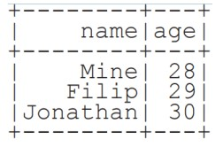


**From Spark Data Sources**

**JSON**

```
 df = spark.read.json( "customer.json")			 
 df.show()
```

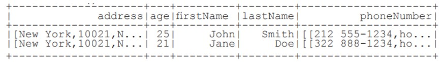

```python
 df2 = spark.read.load( "people.json" , format= "json")
```

**Parquet files**

```python
 df3 = spark.read.load("people.parquet" )
```

**TXT files**

```
 df4 = spark.read.text( "people.txt")
```

### Filter

Filter entries of age, only keep those records of which the values are >24

```
 df.filter(df["age"] >24).show() 
```

Duplicate Values

```
 df = df.dropDuplicates()
```

### Queries


**What is PySpark SQL?**
PySpark SQL is the most popular PySpark module that is used to process structured columnar data. Once a DataFrame is created, we can interact with data using the SQL syntax. Spark SQL is used for bringing native raw SQL queries on Spark by using select, where, group by, join, union etc. For using PySpark SQL, the first step is to create a temporary table on DataFrame by using createOrReplaceTempView()


```
 from pyspark.sql import functions as F
```
**Select**

```python
 df.select( "firstName").show() #Show all entries in firstNome column
 df.select( "firstName","lastName") \
	   .show()
 df.select( "firstName", #Show all entries in firstNome, age and type
				"age" ,
				explode(''phoneNumber'') \
				.alias(''contactlnfo')') \
		.select("contactlnfo.type",
				"firstName",
				"age" ) \
		.show()
 df.select(df["firstName",df[ "age" ]+ 1)  #Show all entries in firstName and age,
	   .show()	#add 1 to the entries of age            
 df.select(df['age'] > 24).show() #Show all entries where age >24

```

**When**

```python
 df.select( "firstName", #Show firstName and 0 or 1 depending on age >30 
				F.when(df.age > 30, 1) \
		.otherwise(0)) \
		.show()
     df[ df.firstName.isin( "Jane" ,"Boris") ] #Show firstName if in the given options
					.collect()
```

**Like**

```python
#Show firstName, and lastName is TRUE if lastName is like Smith
 df.select( "firstName",
				df.lastName .like(''Smith')') \
	  .show()
```

**Startswith** - **Endswith**

```
 df.select( "firstName", #Show firstName, and TRUE if lastName starts with Sm
df.lastName \
	.startswith("Sm")) \
	.show()
 df.select(df.lastName.endswith("th"))\ #Show last names ending in th
	.show()

```

**Substring**

```
 df.select(df.firstName.substr(l, 3) \ #Return substrings of firstName
	  .alias(''name')') \
	  .collect()

```

**Between**

```
 df.select(df.age.between(22, 2s)) \ #Show age: values are TRUE if between 22 and 24
```

### Add, Update & Remove Columns

**Adding Columns**

```
 df = df.withColumn( 'city',df.address.city) \
            .withColumn( 'postalCade',df.address.pastalCode) \
            .withCalumn( 'state',df.address.state) \
            .withColumn( 'streetAddress',df.address.streetAddress) \
            .withColumn( 'telePhoneNumber ',explode(df.phoneNumber.number)) \
            .withColumn( 'telePhone Type',explode(df.phoneNumber.type))

```

**Updating Columns**

```
 df=df.withColumnRenamed('telePhoneNumber ','phoneNumber' )
```

**Removing Columns**

```
 df = df.drop ("address","phoneNumber")
 df = df.drop(df.address).drop(df.phoneNumber)
```

### Missing & Replacing Values

```python
 df.na.fill(50).show() #Replace null values
 df.na.drop().shaw() #Return new df omitting rows with null values
 df.na \ #Return new df replacing one value with another
      .replace(10, 20) \
      .show()
```

### GroupBy

```python
 df.groupBy("age")\ #Group by age, count the members in the groups
      .count() \
      .show()
```

### Sort

```python
 peopledf.sort(peopledf.age.desc()).collect()
 df.sort("age" , ascending=False).collect()
 df.orderBy([ "age", "city" ],ascending=[0,1])\
 	  .collect()
```

### Repartitioning

```python
 df.repartitian(10)\ #df with 10 partitions
	  .rdd \
	  .getNumPartitions()
 df.coalesce(1).rdd.getNumPartitions() #df with 1 partition
```

### Running Queries Programmatically

```
 peopledf.createGlobalTempView( "people")
 df.createTempView ("customer") 
 df.createOrReplaceTempView( "customer")
```

**Query Views**

```python
 df5 = spark.sql("SELECT * FROM customer").show()
 peopledf2=spark.sql( "SELEC T* FROM global_ temp.people")\
				    .show()
```

### **Inspect Data**

```python
 df.dtypes #Return df column names and data types
 df.show() #Display the content of df
 df.head() #Return first n raws
 df.first() #Return first row
 df.take(2) #Return the first n rows 
 df.schema Return the schema of df
 df.describe().show() #Compute summary statistics
 df.columns Return the columns of df
 df.count() #Count the number of rows in df
 df.distinct().count() #Count the number of distinct rows in df
 df.printSchema() #Print the schema of df
 df.explain() #Print the (logical and physical) plans
```

### Output

**Data Structures**

```
 rddl = df.rdd #Convert df into an ROD
 df.taJSON().first() #Convert df into a ROD of string
 df.toPandas() #Return the contents of df as Pandas DataFrame
```

**Write** & **Save to Files**

```python
 df.select( "firstName", "city")\
 .write \
 .save("nameAndCity.parquet" )
 df.select("firstName", "age") \
 .write \
 .save( "namesAndAges.json",format="json")
```

### **Stopping SparkSession**

```
spark.stop()
```

## **PySpark RDD** 

PySpark is the Spark Python API that exposes the Spark programming model to Python.

**Inspect SparkContext**

```python
 sc.version #Retrieve SparkContext version
 sc.pythonVer #Retrieve Python version
 sc.master #Master URL to connect to
 str(sc.sparkHome) #Path where Spark is installed an worker nodes
 str(sc.sparkUser()) #Retrieve name of the Spark User running SparkContext
 sc.appName #Return application name
 sc.applicationld #Retrieve application ID
 sc.defaultParallelism #Return default level of parallelism
 sc.defaultMinPartitions #Default minimum number of partitions for RDDs

```
**Configuration**
```
 from pyspark import SparkConf, SparkContext
 conf = (SparkConf()
            .setMaster("local")
            .setAppName("My app")
            .set("spark.executor.memory","1g" ) )
 sc = SparkContext(conf = conf)
```

**Using The Shell**

In the PySpark shell, a special interpreter aware SparkContext is already created in the variable called sc.

```
$ ./bin/spark shell --master local[2]
$ ./bin/pyspark --master local[4] --py files code.py
```

Set which master the context connects to with the --master argument, and add Python **.zip, .egg** or **.py** files to the  runtime path by passing a comma separated list to --py-files

### Loading Data

**Parallelized Collections**

```python
 rdd = sc.parallelize([('a',7),('a',2),('b',2)])
 rdd = sc.parallelize([('a',2),('d',1),('b',1)])
 rdd3 = sc.parallelize(range(100))
 rdd4 = sc.parallelize([("a",["x","y","z"]),
                            ("b",["p","r"])]
```

**External Data**

Read either one text file from HDFS.a local file system or or any Hadoop-supported file system URI with textFile(). or read in a directory of text files with wholeTextFiles()

```python
 textFile = sc.textFile("/my/directory/*.txt")
 textFile2 = sc.wholeTextFiles( "/my/directory/")
```

### Retrieving RDD Information

**Basic Information**

```python
 rdd.getNumPartitions() #List the number of partitions
 rdd.count() #Count ROD instances 3
 rdd.countByKey() #Count ROD instances by key
defaultdict(<type 'int'>,{'a':2,'b' :1})
 rdd.countByValue() #Count ROD instances by value
defaultdict(<type 'int'>,{('b',2):1,'(a',2):1,('a',7):1})
 rdd.collectAsMap() #Return (key,value) pairs as a dictionary
{'a':2,1b':2}
 rdd3.sum() #Sum of ROD elements 4950
 sc.parallelize([]).isEmpty() #Check whether ROD is empty
True

```

**Summary**

```python
 rdd3.max() #Maximum value of ROD elements 99
 rdd3.min() #Minimum value of ROD elements
0
 rdd3.mean() #Mean value of ROD elements
,9.5
 rdd3.stdev() #Standard deviation of ROD elements 2a.8660700s772211a
 rdd3.variance() #Compute variance of ROD elements 833.25
 rdd3.histogram(3) #Compute histogram by bins
([0,33,66,991,[33,33,3,])
 rdd3.stats() #Summary statistics (count, mean, stdev, max & min)

```

### Applying Functions

```python
#Apply a function to each ROD element
 rdd.map(lambda x: x+(x[l],x[0])).callect()
[('a',7,7,'a'),('a',2,2,'a'),('b',2,2,'b')]
#Apply a function to each ROD element and flatten the result
 rdd5 = rdd.flatMap(lambda x: x+(x[l],x[0]))
 rdd5.collect()
['a',7,7'a','a',2,2'a','b',2,2'b']
#Apply a flatMap function to each (key,value) pair of rdd4 without changing the keys
 rdds.flatMapValues(lambda x: x).callect()
[('a','x'),('a','y'),('a','z'),('b','p'),('b','r')]

```

### Selecting Data


**Getting**

```python
 rdd.collect() #Return a list with all ROD elements
[('a',7),('a',2),('b',2)]
 rdd.take(2) #Take first 2 ROD elements 
[('a',7),('a',2)]
 rdd.first() #Toke first ROD element
[('a',7),('a',2)]
 rdd.top(2) #Take top 2 ROD elements
[('b',2),('a',7)]
```

**Sampling**

```python
 rdd3.sample(False, 0.15, 81).collect() #Return sampled subset of rdd3
 [3,4,27,31,40,41,42,43,60,76,79,80,86,97]
```

**Filtering**

```python
 rdd.filter(lambda x: "a" in x).collect() #Filter the ROD
[( 'a',7),('a',2)]
 rdd5.distinct().callect() #Return distinct ROD values
['a',2,'b',7]
 rdd.keys().collect() #Return (key,value) RDD's keys
['a','a','b']

```

```python
 def g(x): print(x)
 rdd.foreach(g) #Apply a function to all ROD elements
('a',7)
('b',2)
('a',2)

```

### Reshaping Data

**Reducing**

```
 rdd.reduceByKey(lambda x,y : x+y).callect() #Merge the rdd values for each key
 [('a',9),('b',2)]
 rdd.reduce(lambda a, b: a+	b) #Merge the rdd values
('a',7,'a',2,'b',2)

```

**Grouping by**

```python
 rdd3.groupBy(lambda x: x % 2) 
 .mapValues(list)
 .collect()
 rdd.groupByKey() 
 .mapValues(list)
 .collect()
[('a',[7,2]),('b',[2])]
```

**Aggregating**

```python
 seqOp = (lambda x,y: (x[0]+y,x[1]+1))
 combOp = (lambda x,y:(x[0]+y[0],x[1]+y[1]))
#Aggregate RDD elements of each partition and then the results
 rdd3.aggregate((0,0),seqOp,combOp) 
 (4950,100) 
 #Aggregate values of each RDD key
 rdd.aggregateByKey((0,0),seqop,combop).collect()
 [('a',(9,2)),('b',(2,1))]
#Aggregate the elements of each partition, and then the results
 rdd3.fold(0,add) 
 4950 
#Merge the values for each key
 rdd.foldByKey(0, add).collect()
[('a',9),('b',2)]
#Create tuples of RDD elements by applying a function
 rdd3.keyBy(lambda x: x+x).collect() 
```

### Mathematical Operations

```
 rdd.subtract(rdd2).collect() #Return each rdd value not contained in rdd2
[('b',2),('a',7)]
#Return each (key,value) pair of rdd2 with no matching key in rdd
 rdd2.subtractByKey(rdd).collect()
[('d',1)l
 rdd.cartesian(rdd2).callect() #Return the Cartesian product of rdd and rdd2
```

**Sort**

```
 rdd2.sortBy(lambda x: x[l]).collect() #Sort ROD by given function
[('d',1),('b',1),('a',2)]
 rdd2.sartByKey().collect() #Sort (key, value) ROD by key
[('a',2),('b',1),('d',1)]
```

**Repartitioning** 

```python
 rdd.repartitian(4) #New ROD with 4 partitions
 rdd.caalesce(1) #Decrease the number of partitions in the ROD to 1

```

**Saving**

```python
 rdd .saveA sTextFile("rdd.txt")
 rdd.saveAsHadaapFile("hdfs://namenadehost/parent/child",
						  ’org.apache.hadoop.mapred.TextOutputFormat')

```

**Execution**

```
$ ./bin/spark submit examples/src/main/python/pi.py
```

**Does PySpark provide a machine learning API?**

Similar to Spark, PySpark provides a machine learning API which is known as MLlib that supports various ML algorithms like:

- mllib.classification − This supports different methods for binary or multiclass classification and regression analysis like Random Forest, Decision Tree, Naive Bayes etc.
- mllib.clustering − This is used for solving clustering problems that aim in grouping entities subsets with one another depending on similarity.
- mllib.fpm − FPM stands for Frequent Pattern Matching. This library is used to mine frequent items, subsequences or other structures that are used for analyzing large datasets.
- mllib.linalg − This is used for solving problems on linear algebra.
- mllib.recommendation − This is used for collaborative filtering and in recommender systems.
- spark.mllib − This is used for supporting model-based collaborative filtering where small latent factors are identified using the Alternating Least Squares (ALS) algorithm which is used for predicting missing entries.
- mllib.regression − This is used for solving problems using regression algorithms that find relationships and variable dependencies.
- 
**Is PySpark faster than pandas?**

PySpark supports parallel execution of statements in a distributed environment, i.e on different cores and different machines which are not present in Pandas. This is why PySpark is faster than pandas.

**What is Broadcast Variables?**

Broadcast variables: These are also known as read-only shared variables and are used in cases of data lookup requirements. These variables are cached and are made available on all the cluster nodes so that the tasks can make use of them. The variables are not sent with every task. They are rather distributed to the nodes using efficient algorithms for reducing the cost of communication. When we run an RDD job operation that makes use of Broadcast variables, the following things are done by PySpark:

The job is broken into different stages having distributed shuffling. The actions are executed in those stages.
The stages are then broken into tasks.
The broadcast variables are broadcasted to the tasks if the tasks need to use it.
Broadcast variables are created in PySpark by making use of the broadcast(variable) method from the SparkContext class. The syntax for this goes as follows:
```
broadcastVar = sc.broadcast([10, 11, 22, 31])
broadcastVar.value    # access broadcast variable
```

An important point of using broadcast variables is that the variables are not sent to the tasks when the broadcast function is called. They will be sent when the variables are first required by the executors.


**What is Accumulator variable?**

Accumulator variables: These variables are called updatable shared variables. They are added through associative and commutative operations and are used for performing counter or sum operations. PySpark supports the creation of numeric type accumulators by default. It also has the ability to add custom accumulator types. The custom types can be of two types:

**What is PySpark Architecture?**

PySpark similar to Apache Spark works in master-slave architecture pattern. Here, the master node is called the Driver and the slave nodes are called the workers. When a Spark application is run, the Spark Driver creates SparkContext which acts as an entry point to the spark application. All the operations are executed on the worker nodes. The resources required for executing the operations on the worker nodes are managed by the Cluster Managers

**What is the common workflow of a spark program?**

The most common workflow followed by the spark program is:
The first step is to create input RDDs depending on the external data.
Data can be obtained from different data sources.
Post RDD creation, the RDD transformation operations like filter() or map() are run for creating new RDDs depending on the business logic.
If any intermediate RDDs are required to be reused for later purposes, we can persist those RDDs.
Lastly, if any action operations like first(), count() etc are present then spark launches it to initiate parallel computation.


**Congratulations!**    You have read an small summary about important things in **Data Science**.

