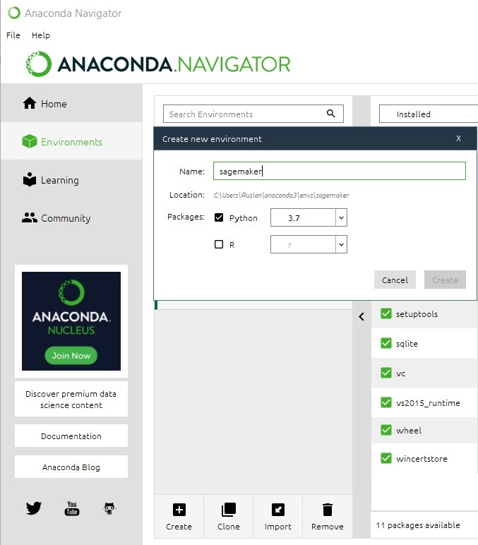
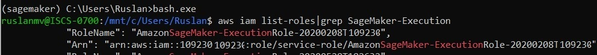
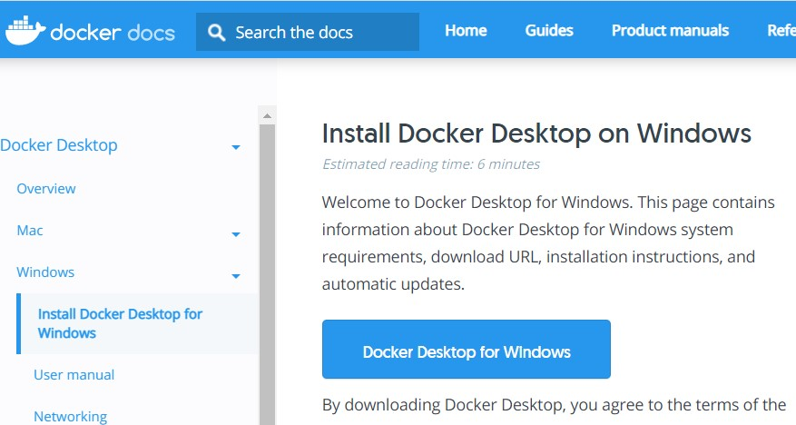
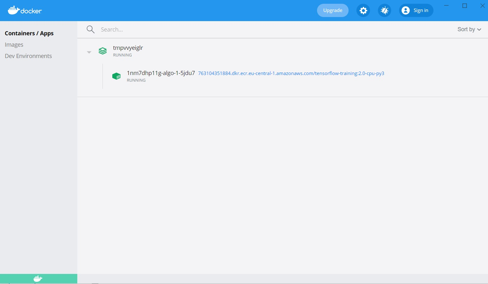

Hello, today I will teach you how to create your own **SageMaker Notebook** on your local-machine.

**Contents**

1. Introduction 
2. Installation of Conda
3. Set region
4. IAM role
5. Local data
6. Local instance type
7. Docker

## **Introduction**

Build , Train and  Deploy AWS Machine Learning Models  may be become expensive.

So if  you don't want to be worried about the monthly costs about your notebooks  like here

[https://aws.amazon.com/sagemaker/pricing/](https://aws.amazon.com/sagemaker/pricing/ ) 


In this blog post I will show you how to install **Sagemaker** on your **local machine** and train  for hours that you need without need to pay something.

## Installation of Conda

First you need to install anaconda at this [link](https://www.anaconda.com/products/individual) 


After you install , check that your terminal , recognize **conda**

```
C:\conda --version
conda 4.10.1
```

If says 'conda' is not recognized as an internal or external command,

Yu can tray this: for me, I installed anaconda3 into `C:\Users\Ruslan\anaconda3`. Therefore you need to add `C:\Users\Ruslan\anaconda3` as well as `C:\Users\Ruslan\anaconda3\Scripts\` to your path variable, e.g. `set PATH=%PATH%;C:\Users\Ruslan\anaconda3;C:\Users\Ruslan\anaconda3\Scripts\`.

The  environments supported that I will consider is Python 3.7, Keras 2.2.0 and TensorFlow 2.2

| Framework      | Description                                   | Docker Image                                                 | Packages and Nvidia Settings                                 |
| :------------- | :-------------------------------------------- | :----------------------------------------------------------- | :----------------------------------------------------------- |
| TensorFlow 2.2 | TensorFlow 2.2.0 + Keras 2.3.1 on Python 3.7. | [floydhub/tensorflow](https://hub.docker.com/r/floydhub/tensorflow/) | [TensorFlow-2.2](https://docs.floydhub.com/guides/tensorflow/#tensorflow-22) |

```
conda create -n sagemaker python==3.7
```

```
conda activate sagemaker
```

another way to perform the same is go to your Anaconda Navigator then go  Environments and create new called sagemaker




then in your terminal  type the following commands:

```
conda install ipykernel
```

```
python -m ipykernel install --user --name sagemaker --display-name "Python (SageMaker)"
```

```
conda install pip pandas
conda install sqlite
```

Then we install the correct versions of the the **Tensorflow**, if you will use only CPU

```
pip install tensorflow==2.2.0  
```

If you will use GPU

```
pip install tensorflow-gpu==2.0.0
```

```
pip install keras==2.3.1
```

```
pip install sagemaker==2.35.0
```

```
pip  install boto3
```

optional libraries that I suggest install are:

```
pip install awswrangler==2.7.0
pip install seaborn==0.11.0
pip install matplotlib===3.3.3
```


Then download the following file and local_sagemaker.ipynb 

 then open the Jupyter notebook with the command

```
jupyter notebook&
```

and find the file that you downloaded [local_sagemaker.ipynb](https://github.com/ruslanmv/SageMaker-On-Local-Machine/raw/master/local_sagemaker.ipynb) and open it.


## Local SageMaker


```python
import tensorflow
import boto3
import sagemaker
import keras
import os
import numpy as np
from keras.datasets import fashion_mnist
```

We check the versions


```python
print(tensorflow.__version__)
```

    2.2.0

```python
print(keras.__version__)
```

    2.3.1


### Set region 

The next step is select the region, that was defined previously by using AWS CLI

```
sess = sagemaker.Session()  # Use the AWS region configured with the AWS CLI
```

if you want to change it 

```
sess = sagemaker.Session(boto3.session.Session(region_name='eu-west-1'))
```


## IAM role


The next step to do is take care of the role because when we work in  SageMaker Studioor  SageMaker Notebook Instance we do this, we call that get execution roll API which returns the I am role associated to the notebook instance or to studio obviously here we working locally so your local machine does not have an I AM role and if you try and call this API it's gonna faill. The solution is very simple, you  have to pass the ARN of your I am role the one you are using with Sage Maker. Make sure you pass the full ARN

Go to your terminal

```
aws iam list-roles|grep SageMaker-Execution
```

For example in windows you can use bash.exe



you should copy the role.

if you did not installed before the aws AWS CLI  you can just type

```
$ sudo apt-get update.
$ sudo apt-get install awscli.
$ aws --version.
$ aws configure
```

and insert your credentials.

Just in case you have some buckets in S3, you can check if your AWS CLI works by typing `$ aws s3 ls`

Now that it works everything you can terun back to you **Notebook** and replace 'YOUR _ROLE' with your personal role for example

`role = 'arn:aws:iam::101234560835:role/service-role/AmazonSageMaker-ExecutionRole-20200608T161888'`

```python
# This doesn't work on your local machine because it doesn't have an IAM role :)
# role = sagemaker.get_execution_role()
# This is the SageMaker role you're already using, it will work just fine
role = 'YOUR_ROLE'
```


```python
(x_train, y_train), (x_val, y_val) = fashion_mnist.load_data()
```

    Downloading data from http://fashion-mnist.s3-website.eu-central-1.amazonaws.com/train-labels-idx1-ubyte.gz
    32768/29515 [=================================] - 0s 1us/step
    Downloading data from http://fashion-mnist.s3-website.eu-central-1.amazonaws.com/train-images-idx3-ubyte.gz
    26427392/26421880 [==============================] - 3s 0us/step
    Downloading data from http://fashion-mnist.s3-website.eu-central-1.amazonaws.com/t10k-labels-idx1-ubyte.gz
    8192/5148 [===============================================] - 0s 0us/step
    Downloading data from http://fashion-mnist.s3-website.eu-central-1.amazonaws.com/t10k-images-idx3-ubyte.gz
    4423680/4422102 [==============================] - 1s 0us/step

## Local data

```python
os.makedirs("./data", exist_ok = True)
np.savez('./data/training', image=x_train, label=y_train)
np.savez('./data/validation', image=x_val, label=y_val)
```


```python
# Train on local data. S3 URIs would work too.
training_input_path   = 'file://data/training.npz'
validation_input_path = 'file://data/validation.npz'
# Store model locally. A S3 URI would work too.
output_path           = 'file:///tmp/model/'
```

## Local instance type


The notebook supports three different versions of the Keras script

* mnist_keras_tf.py: Keras in symbolic mode with TensorFlow 1.15
* mnist_keras_tf20_compat.py: Keras in symbolic mode with TensorFlow 2.0 
* mnist_keras_tf20_eager.py: Keras in eager mode with TensorFlow 2.0

You can create a file called **mnist_keras_tf20_compat.py** with the following code:

```python
#mnist_keras_tf20_compat.py
import argparse, os
import numpy as np

import tensorflow as tf

tf.compat.v1.disable_eager_execution()

from keras import backend as K
from tensorflow.keras.models import Sequential
from tensorflow.keras.layers import Dense, Dropout, Activation, Flatten, BatchNormalization, Conv2D, MaxPooling2D
from tensorflow.keras.optimizers import SGD
from tensorflow.keras.losses import categorical_crossentropy
from tensorflow.keras.callbacks import Callback, EarlyStopping
from tensorflow.keras.preprocessing.image import ImageDataGenerator
from tensorflow.keras.utils import multi_gpu_model, to_categorical

import subprocess
import sys

# Script mode doesn't support requirements.txt
# Here's the workaround ;)
def install(package):
    subprocess.call([sys.executable, "-m", "pip", "install", package])

if __name__ == '__main__':
    
    # Keras-metrics brings additional metrics: precision, recall, f1
    install('keras-metrics')
    import keras_metrics
    
    parser = argparse.ArgumentParser()

    parser.add_argument('--epochs', type=int, default=10)
    parser.add_argument('--learning-rate', type=float, default=0.01)
    parser.add_argument('--batch-size', type=int, default=128)
    parser.add_argument('--dense-layer', type=int, default=512)
    parser.add_argument('--dropout', type=float, default=0.2)

    parser.add_argument('--gpu-count', type=int, default=os.environ['SM_NUM_GPUS'])
    parser.add_argument('--model-dir', type=str, default=os.environ['SM_MODEL_DIR'])
    parser.add_argument('--training', type=str, default=os.environ['SM_CHANNEL_TRAINING'])
    parser.add_argument('--validation', type=str, default=os.environ['SM_CHANNEL_VALIDATION'])
    
    args, _ = parser.parse_known_args()
    
    epochs     = args.epochs
    lr         = args.learning_rate
    batch_size = args.batch_size
    dense_layer = args.dense_layer
    dropout    = args.dropout
    
    gpu_count  = args.gpu_count
    model_dir  = args.model_dir
    training_dir   = args.training
    validation_dir = args.validation
    
    x_train = np.load(os.path.join(training_dir, 'training.npz'))['image']
    y_train = np.load(os.path.join(training_dir, 'training.npz'))['label']
    x_val  = np.load(os.path.join(validation_dir, 'validation.npz'))['image']
    y_val  = np.load(os.path.join(validation_dir, 'validation.npz'))['label']
    
    # input image dimensions
    img_rows, img_cols = 28, 28

    # Tensorflow needs image channels last, e.g. (batch size, width, height, channels)
    if K.image_data_format() == 'channels_last':
        x_train = x_train.reshape(x_train.shape[0], img_rows, img_cols, 1)
        x_val = x_val.reshape(x_val.shape[0], img_rows, img_cols, 1)
        input_shape = (img_rows, img_cols, 1)
        batch_norm_axis=-1
    else:
        # Keras is configured with channels first (Apache MXNet backend)
        print('Channels first, exiting')
        exit(-1)
        
    print('x_train shape:', x_train.shape)
    print(x_train.shape[0], 'train samples')
    print(x_val.shape[0], 'test samples')
    
    # Normalize pixel values
    x_train  = x_train.astype('float32')
    x_val    = x_val.astype('float32')
    x_train /= 255
    x_val   /= 255
    
    # Convert class vectors to binary class matrices
    num_classes = 10
    y_train = to_categorical(y_train, num_classes)
    y_val   = to_categorical(y_val, num_classes)
    
    model = Sequential()
    
    # 1st convolution block
    model.add(Conv2D(64, kernel_size=(3,3), padding='same', input_shape=input_shape))
    model.add(BatchNormalization(axis=batch_norm_axis))
    model.add(Activation('relu'))
    model.add(MaxPooling2D(pool_size=(2,2), strides=2))
    
    # 2nd convolution block
    model.add(Conv2D(128, kernel_size=(3,3), padding='valid'))
    model.add(BatchNormalization(axis=batch_norm_axis))
    model.add(Activation('relu'))
    model.add(MaxPooling2D(pool_size=(2,2), strides=2))

    # Fully connected block
    model.add(Flatten())
    model.add(Dense(dense_layer))
    model.add(Activation('relu'))
    model.add(Dropout(dropout))

    # Output layer
    model.add(Dense(num_classes, activation='softmax'))
    
    print(model.summary())

    if gpu_count > 1:
        model = multi_gpu_model(model, gpus=gpu_count)
                    
    model.compile(loss=categorical_crossentropy,
                  optimizer=SGD(lr=lr, decay=1e-6, momentum=0.9, nesterov=True),
                  metrics=['accuracy',
                  keras_metrics.precision(), 
                  keras_metrics.recall(),
                  keras_metrics.f1_score()])
    
    # Use image augmentation
    # Not useful for this data set, but this is how to set it up
    # datagen = ImageDataGenerator(
    # rotation_range=20,
    # width_shift_range=0.2,
    # height_shift_range=0.2,
    # horizontal_flip=True)

    #datagen.fit(x_train)
    #model.fit_generator(datagen.flow(x_train, y_train, batch_size=batch_size),
    #                validation_data=(x_val, y_val), 
    #                epochs=epochs,
    #                steps_per_epoch=len(x_train) / batch_size,
    #                verbose=1)
    
    sess = tf.compat.v1.Session()
    sess.run(tf.compat.v1.local_variables_initializer())  
    
    model.fit(x_train, y_train, batch_size=batch_size,
                    validation_data=(x_val, y_val), 
                    epochs=epochs)
    
    score = model.evaluate(x_val, y_val, verbose=0)
    print('Validation loss    :', score[0])
    print('Validation accuracy:', score[1])
    
    # save Keras model in SavedModel format for Tensorflow Serving
    sess = tf.compat.v1.keras.backend.get_session()    
    tf.compat.v1.saved_model.simple_save(
        sess,
        os.path.join(model_dir, 'model/1'),
        inputs={'inputs': model.input},
        outputs={t.name: t for t in model.outputs})
    
```


Then you return back to your Notebook  a and  set the correct TensorFlow version when configuring the TensorFlow estimator.

```python
from sagemaker.tensorflow import TensorFlow
tf_estimator = TensorFlow(entry_point='mnist_keras_tf20_compat.py',
                          role=role,
                          instance_count=1, 
                          instance_type='local',   # Train on the local CPU ('local_gpu' if it has a GPU)
                          framework_version='2.0', 
                          py_version='py3',
                          hyperparameters={'epochs': 1},
                          output_path=output_path
                         )
```


## Docker

You should download and install docker and docker-compose [here](https://docs.docker.com/docker-for-windows/install/) 




Now you can return back to you **Notebook** and  start train by using the following command:


```python
# Train! This will pull (once) the SageMaker CPU/GPU container for TensorFlow to your local machine.
# Make sure that Docker is running and that docker-compose is installed

tf_estimator.fit({'training': training_input_path, 'validation': validation_input_path})
```

    Creating network "sagemaker-local" with the default driver
    Creating 1nm7dhp11g-algo-1-5jdu7 ... 
    Creating 1nm7dhp11g-algo-1-5jdu7 ... done
    Docker Compose is now in the Docker CLI, try `docker compose up`
    
    Attaching to 1nm7dhp11g-algo-1-5jdu7
    1nm7dhp11g-algo-1-5jdu7 | 2021-06-26 09:55:54,141 sagemaker-training-toolkit INFO     Imported framework sagemaker_tensorflow_container.training
    
    .
    1nm7dhp11g-algo-1-5jdu7 | 2021-06-26 09:57:38,772 sagemaker-training-toolkit INFO     Reporting training SUCCESS
    1nm7dhp11g-algo-1-5jdu7 exited with code 0
    Aborting on container exit...
    ===== Job Complete =====

You can check how is going  on your training on Docker Desktop



We can check

```python
!docker images 
```

    REPOSITORY                                                            TAG           IMAGE ID       CREATED        SIZE
    763104351884.dkr.ecr.eu-central-1.amazonaws.com/tensorflow-training   2.0-cpu-py3   a19ddacd606a   3 months ago   1.97GB

And save our models

```python
!tar tvfz /tmp/model/model.tar.gz
```

    drwxrwxrwx  0 0      0           0 Jun 26 11:57 model/
    drwxrwxrwx  0 0      0           0 Jun 26 11:57 model/1/
    -rw-rw-rw-  0 0      0      240772 Jun 26 11:57 model/1/saved_model.pb
    drwxrwxrwx  0 0      0           0 Jun 26 11:57 model/1/variables/
    -rw-rw-rw-  0 0      0    19520132 Jun 26 11:57 model/1/variables/variables.data-00000-of-00001
    -rw-rw-rw-  0 0      0        1500 Jun 26 11:57 model/1/variables/variables.index

**Congratulations** we have trained our Neural Network with Sagemaker by using Docker on our local machine.


Credits: Demo for AIM410R/R1 session at AWS **re:Invent 2019**