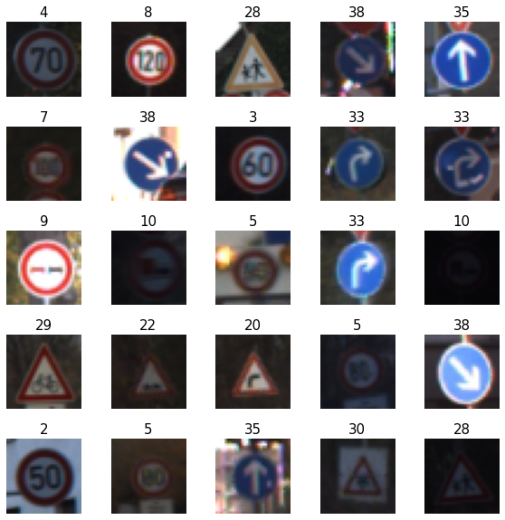
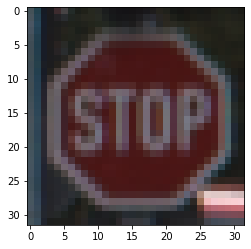
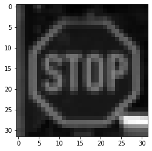
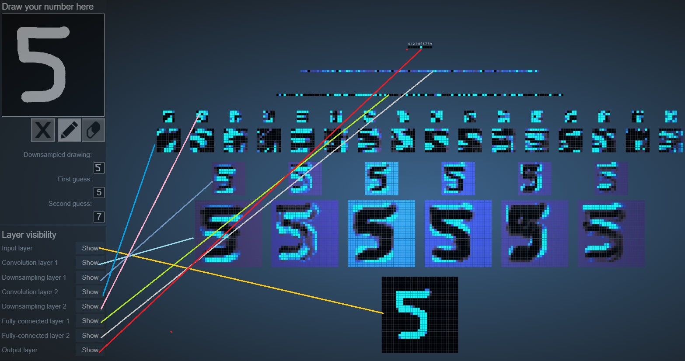
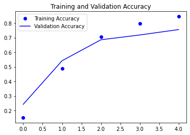
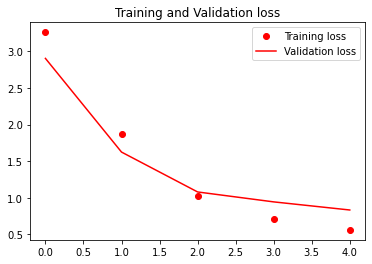
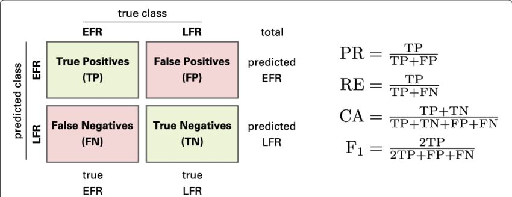
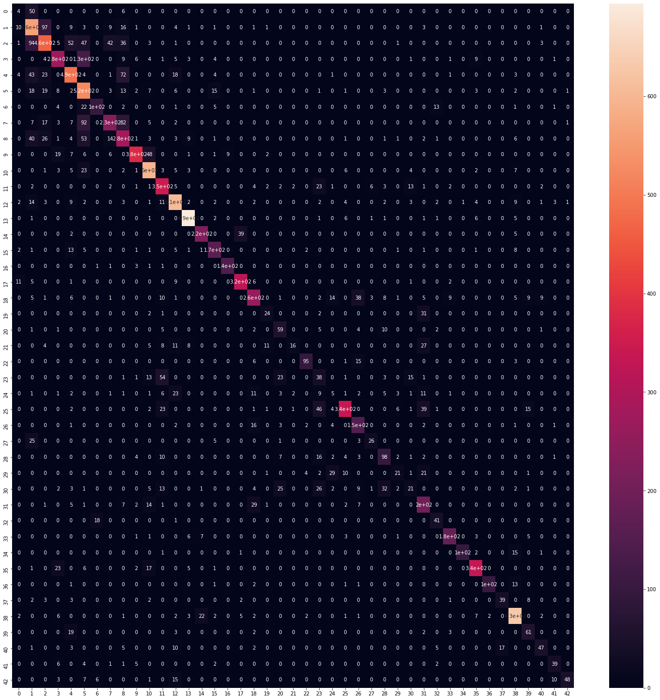
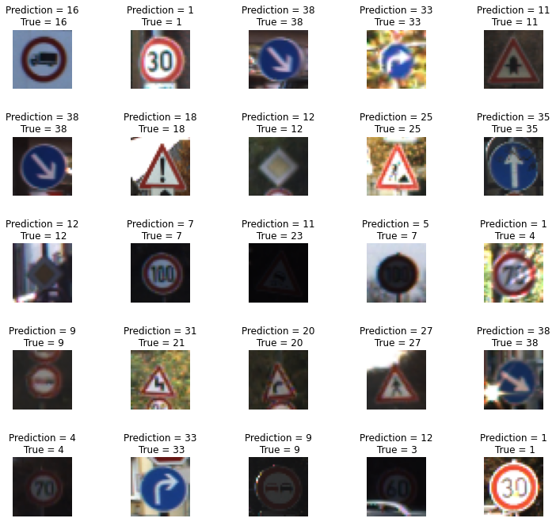

## A multi-class classification with Neural Networks  by using CNN

Hello, today we are interested to classify  43 different classes  of images that are 32 x 32 pixels, colored images  and consist of 3 RGB channels for red, green, and blue colors.

In this project we will train **Convolutional Neural Network CNN.**

The reference that I will use is
J. Stallkamp, The German Traffic Sign Recognition Benchmark: A multi-class classification competition.  [https://doi.org/10.1109/IJCNN.2011.6033395]( https://doi.org/10.1109/IJCNN.2011.6033395)

Let us first create a notebook and we import the following libraries:


```python
import matplotlib.pyplot as plt
import numpy as np
import tensorflow as tf
import pandas as pd
import seaborn as sns
import pickle
import random
```

We open the files


```python
with open("./traffic-signs-data/train.p", mode='rb') as training_data:
    train = pickle.load(training_data)
with open("./traffic-signs-data/valid.p", mode='rb') as validation_data:
    valid = pickle.load(validation_data)
with open("./traffic-signs-data/test.p", mode='rb') as testing_data:
    test = pickle.load(testing_data)
```

we split the data


```python
X_train, y_train = train['features'], train['labels']
X_validation, y_validation = valid['features'], valid['labels']
X_test, y_test = test['features'], test['labels']
```


```python
X_train.shape
```


    (34799, 32, 32, 3)


```python
y_train.shape
```


    (34799,)

IMAGES VISUALIZATION


```python
i = np.random.randint(1, len(X_train))
plt.imshow(X_train[i])
y_train[i]
```


    14


```python
# Let's view more images in a grid format
# Define the dimensions of the plot grid
W_grid = 5
L_grid = 5
# fig, axes = plt.subplots(L_grid, W_grid)
# subplot return the figure object and axes object
# we can use the axes object to plot specific figures at various locations

fig, axes = plt.subplots(L_grid, W_grid, figsize = (10,10))

axes = axes.ravel() # flaten the 15 x 15 matrix into 225 array

n_training = len(X_train) # get the length of the training dataset

# Select a random number from 0 to n_training
for i in np.arange(0, W_grid * L_grid): # create evenly spaces variables

    # Select a random number
    index = np.random.randint(0, n_training)
    # read and display an image with the selected index    
    axes[i].imshow( X_train[index])
    axes[i].set_title(y_train[index], fontsize = 15)
    axes[i].axis('off')

plt.subplots_adjust(hspace=0.4)


```


​    

​    

We perform some transformations: Gray-scaled images consists of 1 channel while colored images consists of 3 channels indicating Red, Green and Blue


```python
from sklearn.utils import shuffle
X_train, y_train = shuffle(X_train, y_train)
```


```python
X_train_gray = np.sum(X_train/3, axis = 3, keepdims = True)
X_test_gray = np.sum(X_test/3, axis = 3, keepdims = True)
X_validation_gray = np.sum(X_validation/3, axis = 3, keepdims = True)
```


```python
X_train_gray.shape

```


    (34799, 32, 32, 1)


```python
X_test_gray.shape

```


    (12630, 32, 32, 1)

X_validation_gray.shape

```python
X_train_gray_norm = (X_train_gray - 128)/128
X_test_gray_norm = (X_test_gray - 128)/128
X_validation_gray_norm = (X_validation_gray - 128)/128
```


```python
#X_train_gray_norm
```

The  X_train_gray_norm is simply an arrays, let us print


```python
i = random.randint(1, len(X_train_gray))
plt.imshow(X_train_gray[i].squeeze(), cmap = 'gray')
plt.figure()
plt.imshow(X_train[i])
plt.figure()
plt.imshow(X_train_gray_norm[i].squeeze(), cmap = 'gray')
```


    <matplotlib.image.AxesImage at 0x1a4b7c0cd0>








# NEURAL NETWORKS

Artificial Neural Networks (ANNs) are information processing models that work by trying to mimic human biological neurons. ANNs can be modeled as follows

output = Ax + b.

Weight and bias are the parameters that can be optimized while training and they play a major role in the performance of the mode

If you want to see a cartoon of how the Neural Network works you can visit this

page 

[https://ruslanmv.com/assets/tensorspace/html/playground/lenet.html](https://ruslanmv.com/assets/tensorspace/html/playground/lenet.html)
or
[https://www.cs.ryerson.ca/~aharley/vis/conv/](https://www.cs.ryerson.ca/~aharley/vis/conv/flat.html)

You can draw the number 5 for example and see the stages of the evolution of the

neural network.





 Neurons develop co-dependency amongst each other during training.

 Dropout is a regularization technique for reducing overfitting in neural networks.

 Dropout refers to dropping out units in a neural network.

 Improve accuracy by adding dropout.

BUILD DEEP CONVOLUTIONAL NEURAL NETWORK MODEL


```python
from tensorflow.keras import datasets, layers, models

CNN = models.Sequential()

CNN.add(layers.Conv2D(6, (5,5), activation = 'relu', input_shape = (32,32,1)))
CNN.add(layers.AveragePooling2D())

#CNN.add(layers.Dropout(0.2))

CNN.add(layers.Conv2D(16, (5,5), activation = 'relu'))
CNN.add(layers.AveragePooling2D())

CNN.add(layers.Flatten())

CNN.add(layers.Dense(120, activation = 'relu'))

CNN.add(layers.Dense(84, activation = 'relu'))

CNN.add(layers.Dense(43, activation = 'softmax'))
CNN.summary()
```

    Model: "sequential"
    _________________________________________________________________
    Layer (type)                 Output Shape              Param #   
    =================================================================
    conv2d (Conv2D)              (None, 28, 28, 6)         156       
    _________________________________________________________________
    average_pooling2d (AveragePo (None, 14, 14, 6)         0         
    _________________________________________________________________
    conv2d_1 (Conv2D)            (None, 10, 10, 16)        2416      
    _________________________________________________________________
    average_pooling2d_1 (Average (None, 5, 5, 16)          0         
    _________________________________________________________________
    flatten (Flatten)            (None, 400)               0         
    _________________________________________________________________
    dense (Dense)                (None, 120)               48120     
    _________________________________________________________________
    dense_1 (Dense)              (None, 84)                10164     
    _________________________________________________________________
    dense_2 (Dense)              (None, 43)                3655      
    =================================================================
    Total params: 64,511
    Trainable params: 64,511
    Non-trainable params: 0
    _________________________________________________________________

If  you train an artificial neural network to perform multi-class classification.  After model training and validation, you find that your model is overfitting the training data.

Then to avoid overfitting,to improve the model generalization, adding dropout layer is the correct option. Dropout layer, switches off random neurons while training, therefore enabling the model to generalize well

COMPILE AND TRAIN DEEP CNN MODEL


```python
CNN.compile(optimizer = 'Adam', loss = 'sparse_categorical_crossentropy', metrics = ['accuracy'])
```


```python
history = CNN.fit(X_train_gray_norm,
                 y_train,
                 batch_size = 500,
                 epochs = 5,
                 verbose = 1,
                 validation_data = (X_validation_gray_norm, y_validation))
```

    Epoch 1/5
    70/70 [==============================] - 10s 136ms/step - loss: 3.2605 - accuracy: 0.1511 - val_loss: 2.9034 - val_accuracy: 0.2420
    Epoch 2/5
    70/70 [==============================] - 7s 95ms/step - loss: 1.8742 - accuracy: 0.4867 - val_loss: 1.6242 - val_accuracy: 0.5413
    Epoch 3/5
    70/70 [==============================] - 7s 104ms/step - loss: 1.0294 - accuracy: 0.7047 - val_loss: 1.0794 - val_accuracy: 0.6853
    Epoch 4/5
    70/70 [==============================] - 7s 99ms/step - loss: 0.7127 - accuracy: 0.7977 - val_loss: 0.9439 - val_accuracy: 0.7181
    Epoch 5/5
    70/70 [==============================] - 7s 101ms/step - loss: 0.5610 - accuracy: 0.8451 - val_loss: 0.8330 - val_accuracy: 0.7553


We have 85% training accuracy and  75% of validation accuracy , is not bad result.

#### **Interesting issues:**

**Underfitting**

If you have for example a training accuracy is 70% and validation accuracy is 55%
Underfitting occurs when the model is too simple that it cannot reflect the complexity of the training dataset. Whenever both the training and validation accuracy are low, it usually mean that the model is underfitting.  

**Overfitting**

On the other side if your training accuracy is 96% and the validation accuracy is 80%
You may have overfitting since the training accuracy is very high and the validation score is low, it means that the model has overfitted the training data and it did not generalize well.  

 **Early stopping**

When you are training a  CNN image classifier and you have initially observed around 40th epoch that the model's validation score and training accuracy were both 94%. As the training continued, at 90th epoch, the training accuracy went up to 98% and validation score went down to 87% so the model is is overfitting the training data and we should use early stopping to avoid such condition.


ASSESS TRAINED CNN MODEL PERFORMANCE


```python
score = CNN.evaluate(X_test_gray_norm, y_test)
print('Test Accuracy: {}'.format(score[1]))
```

    395/395 [==============================] - 1s 2ms/step - loss: 1.1057 - accuracy: 0.7439
    Test Accuracy: 0.7438638210296631

```python
history.history.keys()
```


    dict_keys(['loss', 'accuracy', 'val_loss', 'val_accuracy'])


```python
accuracy = history.history['accuracy']
val_accuracy = history.history['val_accuracy']
loss = history.history['loss']
val_loss = history.history['val_loss']
```


```python
epochs = range(len(accuracy))

plt.plot(epochs, accuracy, 'bo', label='Training Accuracy')
plt.plot(epochs, val_accuracy, 'b', label='Validation Accuracy')
plt.title('Training and Validation Accuracy')
plt.legend()
```


    <matplotlib.legend.Legend at 0x1a4c788650>





```python
plt.plot(epochs, loss, 'ro', label='Training loss')
plt.plot(epochs, val_loss, 'r', label='Validation loss')
plt.title('Training and Validation loss')
plt.legend()
```


    <matplotlib.legend.Legend at 0x1a4cd3fcd0>



​    


```python
predicted_classes = CNN.predict_classes(X_test_gray_norm)
y_true = y_test
```

 Exemplified Confusion matrix with the formulas of **precision** (PR), **recall** (RE), accuracy (CA), and **F 1-measure**




We can print the confusion matrix:

```python
from sklearn.metrics import confusion_matrix
cm = confusion_matrix(y_true, predicted_classes)
plt.figure(figsize = (25, 25))
sns.heatmap(cm, annot = True)
```





We see that is diagonal almost, so its okay.


Let us print the results.

```python
L = 5
W = 5

fig, axes = plt.subplots(L, W, figsize = (12, 12))
axes = axes.ravel()

for i in np.arange(0, L*W):
    axes[i].imshow(X_test[i])
    axes[i].set_title('Prediction = {}\n True = {}'.format(predicted_classes[i], y_true[i]))
    axes[i].axis('off')

plt.subplots_adjust(wspace = 1)    
```


​    

​    


**Congratulation!** We have trained a multi-class classification with Neural Networks  by using CNN
