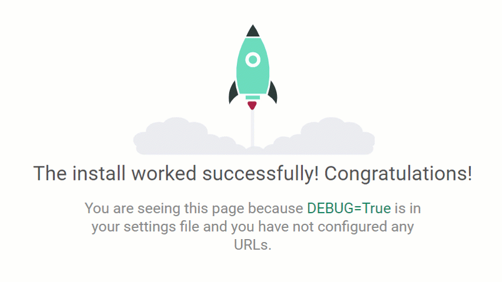
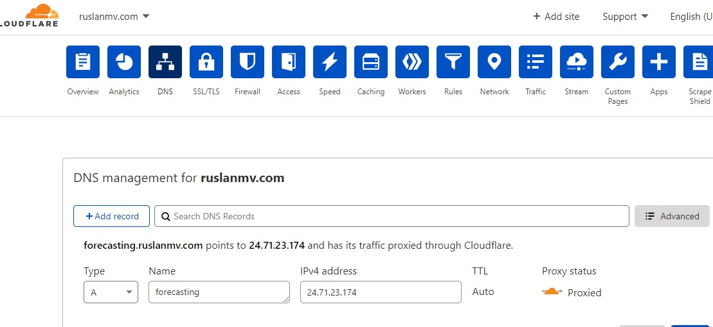
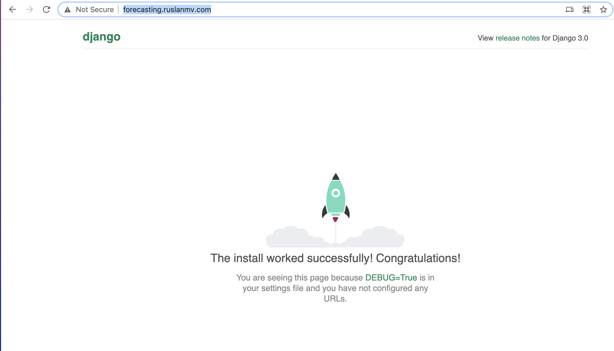
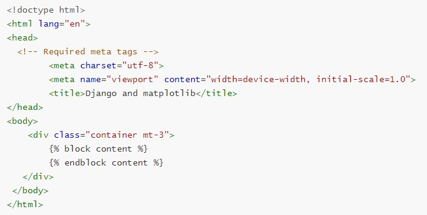
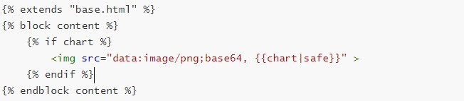
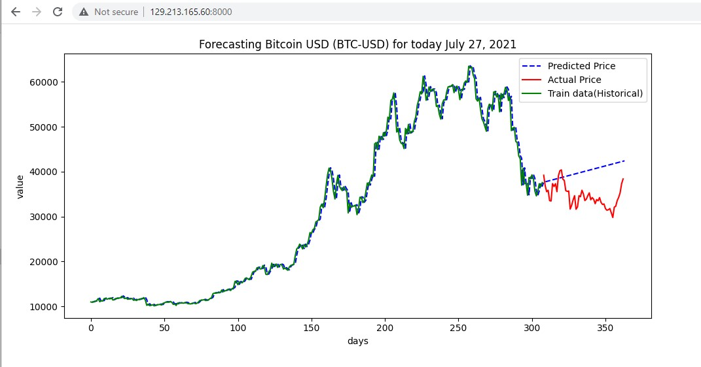
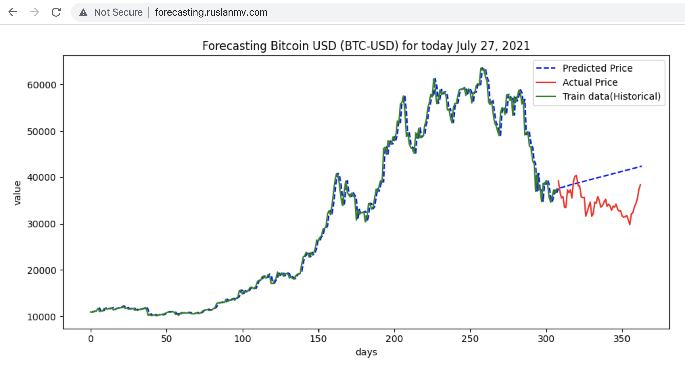

## Bitcoin Forecasting with Django in Production


In this blog tutorial, we are going to predict the **Bitcoin,**  by using  the ARIMA method by creating a webserver on **Oracle Cloud** and make a simple prediction with  **Machine Learning** and **Django** as a API.

What we will explain is how to perform a Forecast of the bitcoin having one year of data and we predict in **real time**.  

[http://forecasting.ruslanmv.com/](http://forecasting.ruslanmv.com/)


## Step 1 — Setting Up the Project

Installing Django is like installing any other Python library:

You need to **ssh** into your **VPS**  instance, so make sure you have port **22, 80** and **8000** open for your instance and then do an update/upgrade.

```bash
ssh -i path-to-your-key.pem ubuntu@your-aws-instance-public-ipsudo apt-get update && sudo apt-get upgrade -y
```

### Installing Python3.7.x on  (ubuntu 20.04):

We will download the tar.xz file from the official site and then manually install it. Before that we need to install some required dependencies.

Building and installing dependencies

```bash
sudo apt install build-essential checkinstallsudo apt install libreadline-gplv2-dev libncursesw5-dev libssl-dev libsqlite3-dev tk-dev libgdbm-dev libc6-dev libbz2-dev libffi-dev
```

Downloading & manually installing required Python version

```bash
cd /opt && sudo wget https://www.python.org/ftp/python/3.7.0/Python-3.7.0.tar.xz
sudo tar -xvf Python-3.7.0.tar.xz
cd Python-3.7.0
sudo make && sudo make install
cd /home/ubuntu/
```

Check Python version

```
python3 -V
```

## Step 2 — Starting a Django Project

Create Directory for sample application

```bash
mkdir django && cd django
```

Create and activate virtual environment

```bash
python3.7 -m venv .
source bin/activate
```

Virtual env activated

Your environment is now activated and you can proceed to install Django inside it.

Let us install the firewalld

```
sudo apt-get install firewalld
```

ext, start firewalld and enable it to auto-start at system boot, then check its status.

```
sudo systemctl start firewalld
```

```
sudo systemctl enable firewalld
```

```
sudo systemctl status firewalld
```

```
 sudo firewall-cmd --permanent --zone=public --add-service=http
```

```
sudo firewall-cmd --permanent --zone=public --add-service=https
```

```
sudo firewall-cmd --reload
```

```
sudo firewall-cmd --list-all
```

django used by default 8000 Port communication

```
sudo firewall-cmd --zone=public --add-port=8000/tcp --permanent
```

```
sudo firewall-cmd --reload
```

```
sudo firewall-cmd --list-all
```

```
public
  target: default
  icmp-block-inversion: no
  interfaces:
  sources:
  services: dhcpv6-client http https ssh
  ports: 8000/tcp
  protocols:
  masquerade: no
  forward-ports:
  source-ports:
  icmp-blocks:
  rich rules:
```

```
pip install Django==3.0
```

Your environment with Django should be ready to use. Go ahead and create an empty Django project.

```
django-admin.py startproject forecasting
```

Create empty Django Project

- Test Sample Application

You can test it by running the development server. You can ignore warnings.

```
cd forecasting
python manage.py runserver 0.0.0.0:8000
```

copy you IP public of your vps and add the port, and paste into your browser

for example 

http://29.213.165.60:8000/




 press **crtl + c** to close development server.

Go to **hello/settings.py** in **ALLOWED_HOSTS** add “*****” in the list as shown in the image below.

Run your server again and you should see the Django power page again.


## Step 4 — Setup Gunicorn

In production we won’t be using Django’s single-threaded development server, but a dedicated application server called [***Gunicorn\***](https://gunicorn.org/).

- Install gunicorn in your application’s virtual environment

```
pip install gunicorn
```

- Test Sample Application with Gunicorn Server

Now that you have gunicorn, you can test whether it can serve your Django application by running the following command:

```
gunicorn forecasting.wsgi:application --bind 0.0.0.0:8000
```


```
[2021-07-27 08:54:01 +0000] [155944] [INFO] Starting gunicorn 20.1.0
[2021-07-27 08:54:01 +0000] [155944] [INFO] Listening at: http://0.0.0.0:8000 (155944)
[2021-07-27 08:54:01 +0000] [155944] [INFO] Using worker: sync
[2021-07-27 08:54:01 +0000] [155947] [INFO] Booting worker with pid: 155947
^C[2021-07-27 08:54:33 +0000] [155944] [INFO] Handling signal: int
[2021-07-27 08:54:33 +0000] [155947] [INFO] Worker exiting (pid: 155947)
[2021-07-27 08:54:33 +0000] [155944] [INFO] Shutting down: Master
```

## Cloudflare setup


You insert the IP address of your public  VPS 




## Running Django with Gunicorn

Change the permissions for the user and group to your username and the group www-data.

```
sudo chown -R $USER:www-data /home/ruslanmv/django/forecasting
```

```
sudo nano /etc/systemd/system/forecasting.service
```

```
[Unit]
Description=forecasting.service - A django application run with Gunicorn.
After=network.target
[Service]
User=ruslanmv
Group=www-data
WorkingDirectory=/home/ruslanmv/django/forecasting
ExecStart=/home/ruslanmv/django/bin/gunicorn --access-logfile - --workers 1 --bind unix:/home/ruslanmv/django/forecasting/forecasting.sock forecasting.wsgi:>[Install]
WantedBy=multi-user.target
```


```
sudo nano  /etc/nginx/sites-available/forecasting.ruslanmv.com
```


```
server {
        listen 80;
        server_name forecasting.ruslanmv www.forecasting.ruslanmv;
        access_log /var/log/nginx/forecasting.access.log;
        error_log /var/log/nginx/forecasting.error.log;
        location / {
                include proxy_params;
                proxy_pass http://unix:/home/ruslanmv/django/forecasting/forecasting.sock;
        }
}
```


```
sudo ln -s /etc/nginx/sites-available/forecasting.ruslanmv.com /etc/nginx/sites-enabled/
```

```
ls -l /etc/nginx/sites-enabled/ | grep forecasting.ruslanmv.com
```

```
sudo systemctl daemon-reload
sudo systemctl restart nginx
sudo systemctl start forecasting.service
```

```
 sudo systemctl enable forecasting
```

Finally, we need to open up our firewall to normal traffic on port 80.


Open  in your browser. If you see this awesome rocket, then everything is fine:




## Step 5 — Logging into the Admin Dashboard

Next, you will log in to the admin dashboard Django gives you. To accomplish that, first, you have to *migrate* your database, which means Django will create the pre-defined tables that are needed for the default apps.

First, you need to stop the server. Depending on your environment this can be accomplished with the keyboard command `CONTROL+C` or `CTRL+C`.

Next, run the `migrate` command in your Terminal:

```bash
python manage.py migrate
```

By running that command, Django has created a SQLite database for you, the default database in the settings, and it has added several tables to that database. You will know if the database was created if you see a new `db.sqlite3` file in your project directory.

To create an admin user, you’ll run the `createsuperuser` command in your Terminal:

```bash
python manage.py createsuperuser
```

Follow the instructions by providing a username, email address, and password for your admin user. 

```bash
pip install pandas
pip install matplotlib
pip intstall pmdarima
pip install matplotlib
pip install pmdarima
pip install yfinance
```


## Step 6 — Creating the App

In Django, you can separate functionality in your project by using *apps*. In the case of Django, app refers to a specific piece of functionality in your project.

For example, if you look at the `settings.py` file, you’ll see the `INSTALLED_APPS` list.

The first of the installed apps - `django.contrib.admin` - is what you just used. It handles all the admin functionality and nothing else. Another app in your project by default is `django.contrib.auth`, which allowed you to log into your admin dashboard.

In your case, you need to create a new app to handle everything related to showing the forecasting First, you need to stop the server.

Next, create a new app in your project. Let’s name it `forecast`:

```
python manage.py startapp forecast
```

By running `startapp`, Django has added a new directory and more files to your project.

With the latest files generated, let’s create a new file called `urls.py` in your `forecast` app directory.

First, go to the `INSTALLED_APPS` list in `settings.py` and add `forecast` to the list:


```
nano settings.py
```

```
...
INSTALLED_APPS = [
    'django.contrib.admin',
    'django.contrib.auth',
    'django.contrib.contenttypes',
    'django.contrib.sessions',
    'django.contrib.messages',
    'django.contrib.staticfiles',
    'forecast'
]
...
```

This lets Django know you want to use the `forerecast` app in your project. By doing this, Django will know where to look for migrations and the URLs.

Next, you need to modify the original `urls.py` to point to your app `urls.py` file. To accomplish that, you add a line under the existing path for the admin dashboard. You also need to import `include` so you can point to your app `urls.py` file.

```python
from django.contrib import admin
from django.urls import path
from forecast.views import main_view

urlpatterns = [
    path('admin/', admin.site.urls),
    path('',main_view,name='main-view'),
]

```

The empty string means that you do not need to use an endpoint for the entry point to your app and just check our model.py 

```
nano models.py
```

```python
# Create your models here.
from django.db import models

class Sale(models.Model):
    item = models.CharField(max_length=50)
    price = models.FloatField()

    def __str__(self):
        return str(self.item)
```

```
nano apps.py
```

```
from django.apps import AppConfig


class ForecastConfig(AppConfig):
    name = 'forecast'

```

## Step 7 — Adding the Template and View

Now, you need to add the template to your project.

A *template* in Django is an HTML file that allows for extra syntax that makes the template dynamic. You will be able to handle functionality like add variables, `if` statements, and loops.

In your Terminal, navigate to the `forecast` app directory:

```
cd forecast
```

Next, make the `templates` directory:

```
mkdir templates
```

And navigate into it:

```
cd templates
```

You will also create another directory with the same name as your app. This is because Django combines all the template directories from the various apps you have. To prevent filenames from being duplicated, you can use the name of your app to prevent the duplicates:

```
mkdir forecast
```

Inside of this `forecast` directory, create a new file called `base.html`. This will be your main template., we are in `forecasting/forecast/templates/forecast/base.html`

```
nano base.html
```



we create another folder

```
mkdir forecast
```

 and we creather another file called main.html

```
nano main.html
```




Now that you have your template created, let’s create a view and URL combination so you can actually see this in your app.

*Views* in Django are either functions or classes. In this case, since you’re creating a simple view, you’ll create a function. 

The Yahoo Finance API provides access to the information about:

- finance summaries like earnings, balance sheet.
- stocks historical prices.
- stock actions (including splits and dividends).

All this information is from the Yahoo Finance official website.

 To install yfinance before you use it.

```
pip install yfinance
```


**Rate Limitation**

There’re some limitations by making the call to Yahoo Finance API:

- Using the Public API (without authentication), you are limited to 2,000 requests per hour per IP (or up to a total of 48,000 requests a day).


### Step 8 — Adding the forecasting method

ARIMA is a method for forecasting or predicting future outcomes based on a historical time series. It is based on the statistical concept of serial correlation, where past data points influence future data points.

ARIMA combines autoregressive features with those of moving averages. An AR(1) autoregressive process, for instance, is one in which the current value is based on the immediately preceding value, while an AR(2) process is one in which the current value is based on the previous two values. A moving average is a calculation used to analyze data points by creating a series of averages of different subsets of the full data set in order to smooth out the influence of outliers. As a result of this combination of techniques, ARIMA models can take into account trends, cycles, seasonality, and other non-static types of data when making forecasts.


ARIMA forecasting is achieved by plugging in time series data for the variable of interest. Statistical software will identify the appropriate number of lags or amount of differencing to be applied to the data and check for stationarity. It will then output the results, which are often interpreted similarly to that of a multiple linear regression model.


Add this function to your `views.py` file:

```
nano views.py
```

```python
# Create your views here.
from django.shortcuts import render
from .models import Sale
from .utils import get_plot
from pmdarima import auto_arima
import time
from statsmodels.tsa.arima_model import ARIMA
import yfinance as yf
import pandas as pd
def main_view(request):
    df = yf.download("BTC-USD", period="1y")
    df.to_csv("Bitcoin-last.csv")
    #df = pd.read_csv("Bitcoin-last.csv")
    df=df.dropna()
    best_order = auto_arima(df['Close'], trace = True)
    order=best_order.order
    columns = ['Close']
    df=pd.DataFrame(df, columns=columns)
    df=df.reset_index(drop=True)
    train, test = df[0:int(len(df)*0.85)], df[int(len(df)*0.85):]
    model = ARIMA (train, order=order)
    model = model.fit()
    start=1
    end=len(df)
    pred=model.predict(start=start,end=end,typ='levels').rename('ARIMA Predictions')
    y=pred
    x=range(0, len(df))
    z=test['Close']
    w=train['Close']
    chart = get_plot(x,y,z,w)
    return render(request, 'forecast/main.html',{'chart':chart})

```


You are naming your view `main_view` because it will be at the main of your app, which is the root URL. 

To have the template render, you return `request`, which is necessary for the `render` function, and the name of the template file you want to render, in this case, `forecast/main.html`.

## Step 9 — Plotting setup

We are going to use matplotlib to plot our forecasting.

we create a utils.py file

```bash
nano utils.py
```

```python
import matplotlib.pyplot as plt
import base64
from io import BytesIO
from datetime import date
def get_graph():
    buffer = BytesIO()
    plt.savefig(buffer, format='png')
    buffer.seek(0)
    image_png =buffer.getvalue()
    graph =base64.b64encode(image_png)
    graph = graph.decode('utf-8')
    buffer.close()
    return graph

def get_plot(x,y,test,train):
    plt.switch_backend('AGG')
    plt.figure(figsize=(10,5))
    # Textual month, day and year
    today = date.today()
    d2 = today.strftime("%B %d, %Y")
   # print("d2 =", d2)

    plt.title('Forecasting Bitcoin USD (BTC-USD) for today '+ str(d2))
    #plt.plot(x,y)
    plt.xticks(rotation=45)
    plt.xlabel('days')
    plt.ylabel('value')
    y.plot(legend=True,color='blue', linestyle='dashed',label='Predicted Price')
    test.plot(legend=True,color='red', label='Actual Price')
    train.plot(legend=True,color='green', label='Train data(Historical)')
    plt.tight_layout()
    graph=get_graph()
    return graph

```


```bash
sudo systemctl stop forecasting.service
```

```bash
gunicorn forecasting.wsgi:application --bind 0.0.0.0:8000
```



 press **crtl + c** to close development server.

 Since we no longer need access to the development server, we can remove the rule to open port 8000 as well:

```bash
sudo firewall-cmd --zone=public --remove-port=8000/tcp
sudo firewall-cmd --runtime-to-permanent
sudo firewall-cmd --reload 
```


```bash
sudo systemctl daemon-reload
sudo systemctl restart nginx
sudo systemctl start forecasting.service
sudo systemctl status forecasting.service
```

now you can enter to 

[http://forecasting.ruslanmv.com/](http://forecasting.ruslanmv.com/)


and you see




# **Congratulations!**

You have successfully run **Bitcoin Forecasting**  for production ready.