In this blog post we will install  **MySQL Server 8**  in virtual machine in  windows and connect it  via terminal.

# Section 1. Ubuntu as a virtual machine on Windows

To install Ubuntu as a virtual machine on Windows 10:

1. [Download VirtualBox](https://www.virtualbox.org/) for Windows and install it on your computer. 

   

2. Download the Ubuntu ISO file you want to install from the [Ubuntu download page](https://ubuntu.com/download/desktop).


1. Open VirtualBox and select **New** in the top taskbar.

2. Give your VM a name, choose **Linux** as the **Type**, then choose **Ubuntu** as the **Version** and select **Next**.

3. Choose how much RAM you want to assign to the virtual machine and select **Next**. The recommended minimum is 1024  MB .  I will use **4096 MB**

   The amount of memory you set aside is only used while the virtual machine is running.

4. Choose **Create a virtual hard disk now** and select **Create**.

   You must create a virtual hard drive to save the changes you make in Ubuntu.

5. Choose **VDI** (VirtualBox Disk Image) and select **Next**.

6. Choose **Dynamically allocated** or **Fixed size** for the storage type and select **Next**.

   A fixed size disk performs better because the virtual machine doesn't have to increase the file size as you install software.

   Choose at least **20GB** of size. I suggest **40 GB** to avoid issues in the future.

7. The name of your virtual machine will now appear on the left side of the VirtualBox manager. Select **Start** in the toolbar to launch your VM.

8. This is the point where you need to choose the Ubuntu ISO file you downloaded earlier.

9. Select **Add** in the window that pops up.

10. Choose your Ubuntu disk image and select **Open**.

11. Select **Choose**.

12. Select **Start**.

13. Your VM will now boot into a live version of Ubuntu. Choose your language and select **Install Ubuntu**.

    If you select **Try Ubuntu**, you can run the installer later by double-clicking **Install Ubuntu** on the desktop.

14. Choose your keyboard layout and select **Continue**.

15. Choose **Normal installation** or **Minimal installation**, then select **Continue**.

    Check the boxes under **Other Options** to download updates.

16. Choose **Erase disk and install Ubuntu** and select **Install Now**, then select **Continue** to ignore the warning.

    This step will not erase your computer's physical hard drive; it only applies to the virtual machine.

17. Choose your time zone on the map, then select **Continue**.

18. Set up your user account, your computer we select `aws` and select **Continue**. 

19. Select **Restart Now** and press enter. After restart you will have something like

    

    

20. To enable the shared clipboard in VirtualBox , go to Oracle VM Virtual Box Manager and our image called ubuntu click settings  then General>Advanced>Shared Clipboard we change to **Bidirectional**   and then click **OK**

    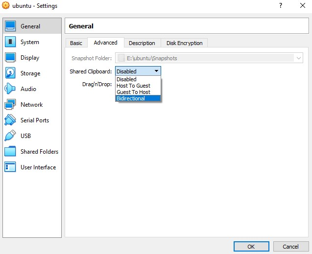

21. Hide the Dock (optional) 

    Due to we will going to code, we need work with a **clean screen.** so Let us to clear the screen in ubuntu by removing the left panel of ubuntu while we are coding.

    Press the **Win key** on your keyboard and type “dock” to filter the app list down to the sub-page you need in “Appearance Settings.” Select the Settings entry that appears to open that page.

    

    Enable the toggle next to “Auto-hide the Dock.”

    

    

22. Then return back to your terminal in Ubuntu , open a new terminal,

     

23. and type the following

    ```
    sudo apt-get update
    ```

    ```
    sudo apt upgrade
    ```

    ```
    sudo apt install virtualbox-guest-x11
    ```

    ```
    sudo VBoxClient --clipboard
    ```

    then Shared Clipboard should be work.   Copy the following text

    ```
    echo 'Your VM is Ready!'
    ```

    and paste it with `ctrl` + `shift` +`v`  and then press enter.


## Section 2 Install MySQL on Ubuntu 20.04

MySQL team provides official MySQL PPA for Ubuntu operating systems.  Run below command to enable PPA.

```
wget https://dev.mysql.com/get/mysql-apt-config_0.8.20-1_all.deb
```

```
sudo dpkg -i mysql-apt-config_0.8.20-1_all.deb
```

The installer will prompt you to set default repository for the MySQL version.  Select **MySQL 8 server** when you are prompted which MySQL product you want to install. Click **OK** to confirm.

​	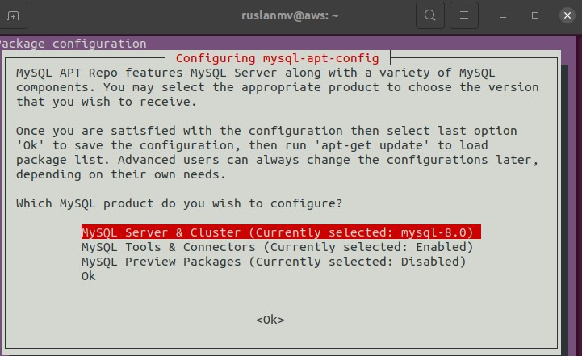


Select **MySQL 8 server** when you are prompted which MySQL product you want to install. Click **OK** to confirm.

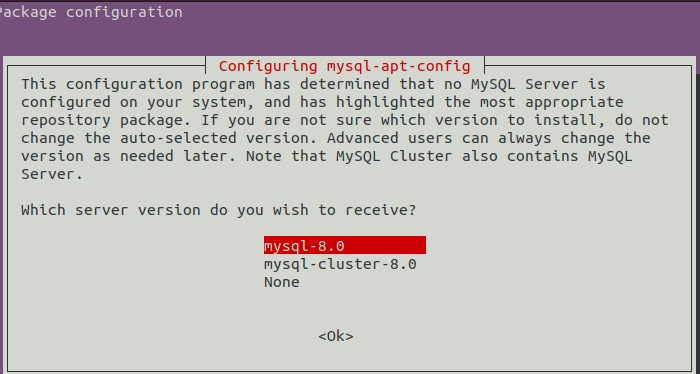


In case you select wrong version. Execute `dpkg-reconfigure mysql-apt-config `command after package installation to get this window again.

 We can check  if our setup was done correctly

```
cat /etc/apt/sources.list.d/mysql.list
```

```
### THIS FILE IS AUTOMATICALLY CONFIGURED #### You may comment out entries below, but any other modifications may be lost.# Use command 'dpkg-reconfigure mysql-apt-config' as root for modifications.deb http://repo.mysql.com/apt/ubuntu/ focal mysql-apt-configdeb http://repo.mysql.com/apt/ubuntu/ focal mysql-8.0deb http://repo.mysql.com/apt/ubuntu/ focal mysql-tools#deb http://repo.mysql.com/apt/ubuntu/ focal mysql-tools-previewdeb-src http://repo.mysql.com/apt/ubuntu/ focal mysql-8.0
```

Execute below command to update apt cache on your system.

```
sudo apt update  
```

 After successfully updating the package repository, install MySQL Server by running the following command:

```
sudo apt install mysql-server
```

 

When asked if you want to continue with the installation, answer **`Y`** and hit **ENTER**.

You will be prompted the following questions during the configuration:


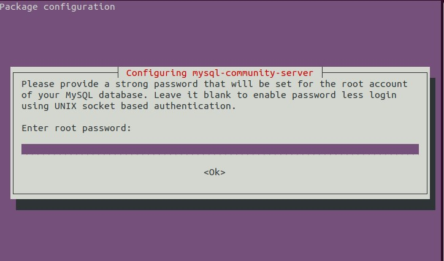

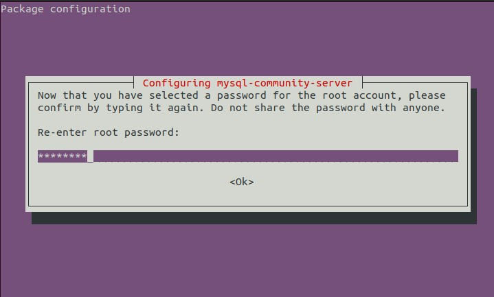

select tab and enter ok

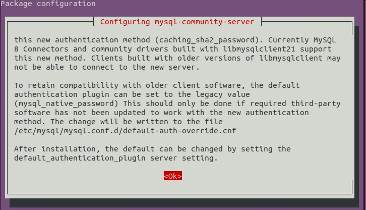


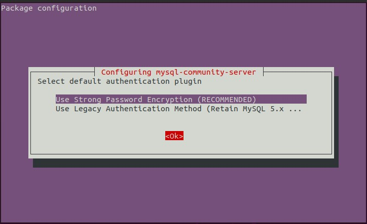

```
mysql --version
```

you will get

```
mysql  Ver 8.0.27 for Linux on x86_64 (MySQL Community Server - GPL)
```

**Good!** Now is time  add a little more of security. The MySQL instance on your machine is **insecure** immediately after installation.

### Securing MySQL

Secure your MySQL user account with password authentication by running the included security script:

```
sudo mysql_secure_installation
```

Enter your password and answer **`Y`**  and you will get the following questions:

When it ask Disallow root login remotely?  use N

```
Securing the MySQL server deployment.

Connecting to MySQL using a blank password.

VALIDATE PASSWORD COMPONENT can be used to test passwords
and improve security. It checks the strength of password
and allows the users to set only those passwords which are
secure enough. Would you like to setup VALIDATE PASSWORD component?

Press y|Y for Yes, any other key for No: Y <-- Type y or Y and press Enter to confirm

There are three levels of password validation policy:

LOW    Length >= 8
MEDIUM Length >= 8, numeric, mixed case, and special characters
STRONG Length >= 8, numeric, mixed case, special characters and dictionary file

Please enter 0 = LOW, 1 = MEDIUM and 2 = STRONG: 2 <-- Enter 2 to force strong passwords with a password length >= 8, numeric, mixed case, special characters and validation against a dictionary file

Please set the password for root here.

New password: <-- Enter your strong password
Re-enter new password: <-- Repeat your password

Estimated strength of the password: 50
Do you wish to continue with the password provided?(Press y|Y for Yes, any other key for No) : Y <-- MySQL has evaluated the strengh of your password in the line above. If you wish to continue with the password provided, type y or Y and confirm by pressing Enter.

By default, a MySQL installation has an anonymous user,
allowing anyone to log into MySQL without having to have
a user account created for them. This is intended only for
testing, and to make the installation go a bit smoother.
You should remove them before moving into a production
environment.

Remove anonymous users? (Press y|Y for Yes, any other key for No) : Y <-- Type y or Y to remove anonymous users from the MySQL server
Success.

Normally, root should only be allowed to connect from
'localhost'. This ensures that someone cannot guess at
the root password from the network.

Disallow root login remotely? (Press y|Y for Yes, any other key for No) : N <-- Type y our Y and press Enter to restrict connections to the database server from localhost. If you have need to access your database from a remote machine, enter any other key before confirming by pressing Enter.

Success.

By default, MySQL comes with a database named 'test' that
anyone can access. This is also intended only for testing,
and should be removed before moving into a production
environment.

Remove test database and access to it? (Press y|Y for Yes, any other key for No) : Y <-- Type y or Y to remove the MySQL test database then confirm by pressing Enter.
- Dropping test database...
Success.

- Removing privileges on test database...
Success.

Reloading the privilege tables will ensure that all changes
made so far will take effect immediately.

Reload privilege tables now? (Press y|Y for Yes, any other key for No) : Y <-- Type y or Y to reload the MySQL privilege table to ensure all changes made so far will take effect. Confirm by pressing Enter.

All done!
```


##  Allowing Remote Access to MySQL 8

MySQL instance is only configured to listen for local connections. This is MySQL’s default setting, but it won’t work for a remote database setup since MySQL must be able to listen for an *external* IP address where the server can be reached. 

**1) Allow access from any host**

Locate the line that contain [mysqlid].

```
sudo nano /etc/mysql/mysql.conf.d/mysqld.cnf
```

Just add the following line to the file.*

```
bind-address = 0.0.0.0
```

If you bind MySQL to 0.0.0.0, then any machine that reaches the MySQL server can also connect with it.

```
[mysqld]
pid-file        = /var/run/mysqld/mysqld.pid
socket          = /var/run/mysqld/mysqld.sock
datadir         = /var/lib/mysql
log-error       = /var/log/mysql/error.log
bind-address    = 0.0.0.0

```

**2) Allow the user to access from anywhere:**

Log in Locally to MySQL Server

Finally, to log in to the MySQL interface, run the following command:

```
sudo mysql -u root -p
```

**3) Create the `root` user** 

(**yes, a new user** because what exists is 'root@localhost' which is local access only):

Let us just add e new user to weak password for this project

```
SET GLOBAL validate_password.policy = 0;
```

```
SHOW VARIABLES LIKE 'validate_password%';
```

```
CREATE USER 'root'@'%' IDENTIFIED BY 'password';
```

**3) Give the privileges:**

```sql
GRANT ALL PRIVILEGES ON *.* TO 'root'@'%';
```

```
UPDATE mysql.user SET host='%' WHERE user='root';
```

**4) Change authentication to password**

```
ALTER USER 'root'@'%' IDENTIFIED WITH mysql_native_password BY 'password';
```

### Or add new online user

```
create user 'ruslanmv'@'localhost' identified by 'password';
GRANT ALL PRIVILEGES ON *.* TO 'ruslanmv'@'%';
```

Well that’s it. But for the config changes to take action, restart your MySQL server by running

```
sudo systemctl restart mysql
```

for further issues go [here](https://stackoverflow.com/questions/50570592/mysql-8-remote-access).

### Check if MySQL Service Is Running

Upon successfully installing MySQL, the MySQL service starts automatically.

Verify that the MySQL server is running by running:

```
sudo systemctl status mysql
```

The output should show that the service is operational and running.


 **Open MySQL port (default 3306) in the firewall for external connections. For that follow the below steps.**


```
sudo iptables -A INPUT -i enp1s0 -p tcp --destination-port 3306 -j ACCEPT
```

Alternatively you can grant access to specific ip address.

```
iptables -A INPUT -i enp1s0 -s xxx.xxx.xxx.xxx -p tcp --destination-port 3306 -j ACCEPT
```

replace xxx.xxx.xxx.xxx with ip of the system from which you need to establish the connection.

For our test we dont need.

```
sudo iptables -S
```

we will get

```
-P INPUT ACCEPT
-P FORWARD ACCEPT
-P OUTPUT ACCEPT
-A INPUT -i enp1s0 -p tcp -m tcp --dport 3306 -j ACCEPT
```

Alternatively you can use `sudo iptables -S INPUT`  or `iptables -S OUTPUT`

Good now is time to setup the server to **enter remotely from windows.**


## Section 3. Install ssh server.

Install openssh-server

```
sudo apt-get updatesudo apt-get install openssh-server
```

stop your virtualmachine.

Set the net of your virtualmachine:

click on settings & net:

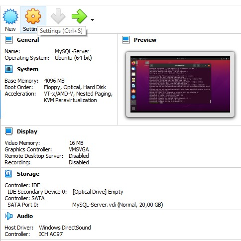

Select NAT as connection and click on advanced, and set as in the picture below.

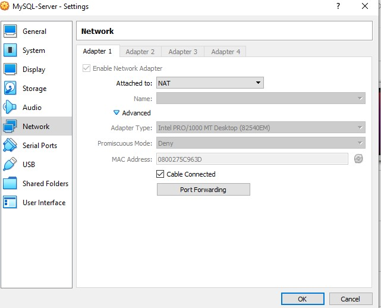

Click on port forwarding:

and set the **MySQL** parameters:

Name: MySQL

Protocol: TCP

Host IP: 127.0.0.1

Host Port: 2223

IP Guest: Empty

Port Guest: 3306

and set the **SSH** parameters:

Name: SSH

Protocol: TCP

Host IP: 127.0.0.1

Host Port: 2222

IP Guest: Empty

Port Guest: 22


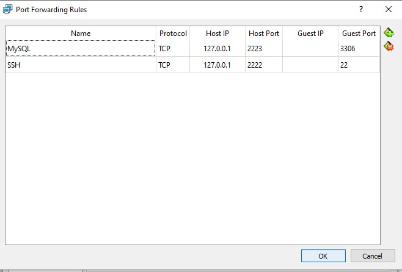

and click **OK.** and start again your virtual machine. When your VM is started, open your terminal and try to connect.

# Section 4 Log in Remotely to MySQL Server


First you install MySQL Shell on Microsoft Windows using the MSI Installer, do the following:

Download package from [http://dev.mysql.com/downloads/shell/.](http://dev.mysql.com/downloads/shell/.)

When prompted, click Run and follow the steps in the Setup Wizard.

```
mysqlsh -h  127.0.0.1 -P 2223 -u root -p
```

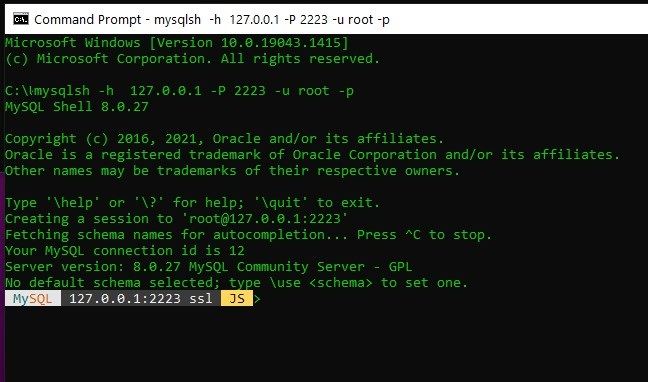


## Login via ssh  to MySQL Server

```
ssh ruslanmv@127.0.0.1 -p 2222
```

now you shoud be inside your virtualmachine. and then enter to you root local

```
mysql -u root -p
```


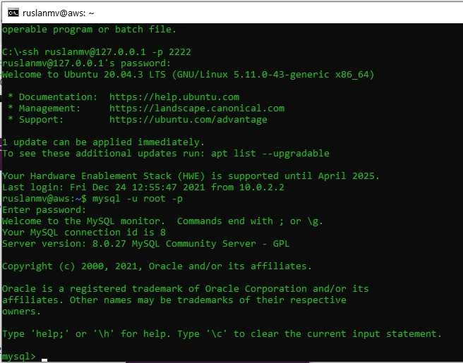


# Troobleshooting

If you can’t connect try to disable or change settings to ubuntu firewall:

```
sudo ufw disable
```

or try to connect to the ip of VM, we go to virtual box preferences and we add a Nat network if you dont have

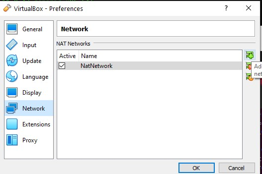

Back to Settings > Network and select **adapter 1**

Select Adapter only Host.


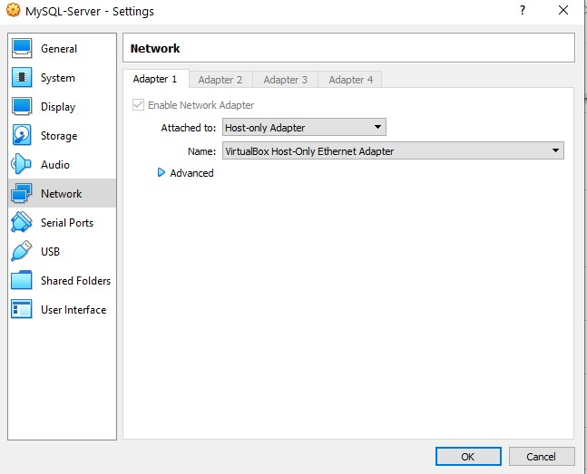


go inside the VM 

```
sudo apt install net-tools
```

and get the ip number with ifconfig and get ip address:

```
ifconfig
```

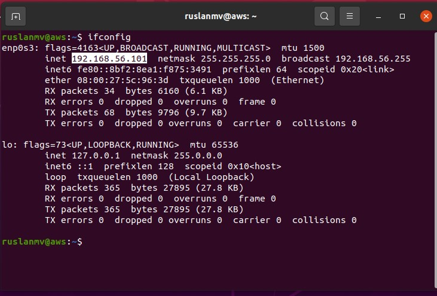

In my case the ip is 192.168.56.101, now from terminal I try to connect in ssh to the ip 192.168.56.101, you should put your username instead ruslanmv

```
ssh ruslanmv@192.168.56.101
```

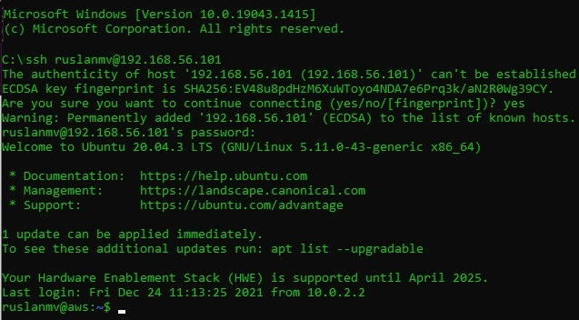

Download the  sample database from to this project

```
mkdir test
```

```
cd test
```

```
wget https://raw.githubusercontent.com/ruslanmv/How-to-create-a-dataframe-in-S3-from-SQL-queries/master/mysqlsampledatabase.sql
```

```
mysql -u root -p
```

```
source /home/ruslanmv/test/mysqlsampledatabase.sql
```

```
USE classicmodels;
SELECT * FROM customers;
```

Basically, those statements switch the current database to `classicmodels` and query data from the `customers` table.

 If you see the customer data returned, you have successfully imported the sample database into the MySQL database server.


**Congratulations !**   You have installed a **MySQL Server** on a virtual machine in windows.

