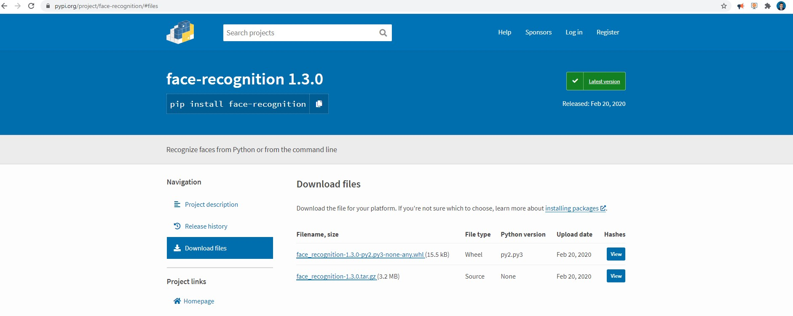
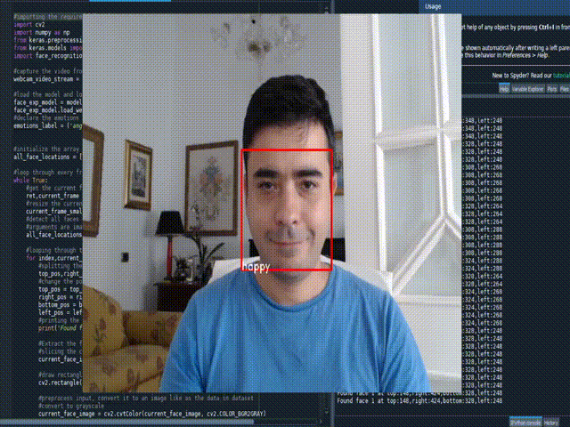
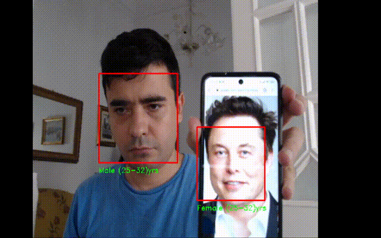
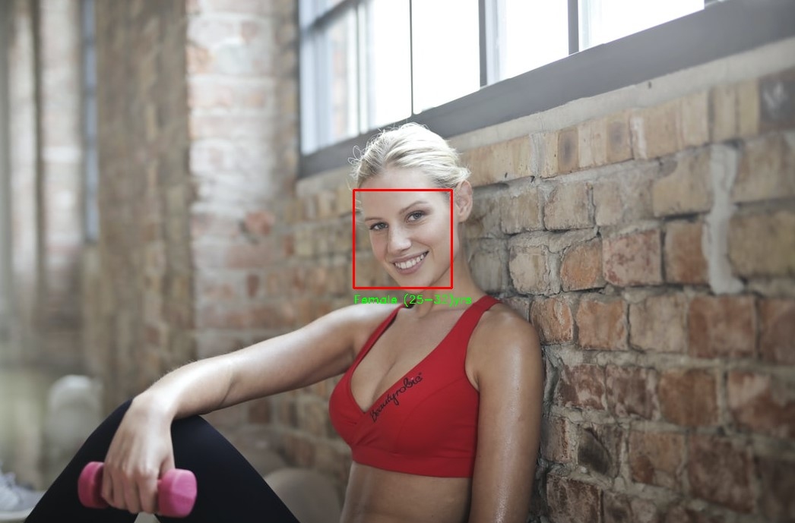

## Realtime Face Recognition

In this blog post, I will show you how to install the face recognition library in python by using Spyder and create your own machine learning program to detect your own face.

The library facer-recognition recognize and manipulate faces from Python or from the command line with the world’s simplest face recognition library.

Built using [dlib](http://dlib.net/)’s state-of-the-art face recognition built with deep learning. The model has an accuracy of 99.38% on the [Labeled Faces in the Wild](http://vis-www.cs.umass.edu/lfw/) benchmark.

This also provides a simple `face_recognition` command line tool that lets

you do face recognition on a folder of images from the command line!

## Installation

The steps for installing OpenCV through Anaconda are pretty easy and straight forward.

Don’t forget to add Anaconda to your path, so you can easily access `conda `command from the prompt.

- Create a folder for your project where you will put your python scripts.
- Head to your folder through the command line `cd C:\Users\<username>\my_folder`, and activate the virtual environment you just created, with the following command:

### Create an anaconda environment

Open **Anaconda Prompt** from start menu and run the following code:

```
conda create --name face python=3.7 spyder=5
```

```
conda activate face
```

```
pip install opencv-python==4.2.0
```

```
pip install opencv-contrib-python
```

```
pip install cmake
```

download the file from [github](https://github.com/ruslanmv/Realtime-Face-Recognition/blob/main/dlib-19.19.0-cp37-cp37m-win_amd64.whl) the file **dlib-19.19.0-cp37-cp37m-win_amd64.whl**

and  we install

```
pip install dlib-19.19.0-cp37-cp37m-win_amd64.whl --no-cache-dir
```

later we download the second file **face_recognition-1.3.0-py2.py3-none-any.whl**

from [github](https://github.com/ruslanmv/Realtime-Face-Recognition/blob/main/face_recognition-1.3.0-py2.py3-none-any.whl) or from the original repository [here](https://pypi.org/project/face-recognition/)



then we install

```
pip install face_recognition-1.3.0-py2.py3-none-any.whl
```

we launch the Spyder  application

```
spyder
```

```
import cv2
import dlib
import face_recognition

#printing versions
print(cv2.__version__)
print(dlib.__version__)
print(face_recognition.__version__)

```

And my output

```
4.5.3
19.19.0
1.2.3
```

Go to Tools -> Preferences

Click Ipython console in left tab

Click on Graphics on top  tab

Change Graphics Backend to 'Automatic'

Apply and OK

File restart

We can verify if the cv2 is working

```python
import cv2
import dlib
import face_recognition

#printing versions
print(cv2.__version__)
print(dlib.__version__)
print(face_recognition.__version__)


#loading the image to detect
image_test= cv2.imread('images/testing/people.jpg')
cv2.imshow("Image",image_test)
cv2.waitKey(0)
```

Installing Tensorflow and Keras in Anaconda

Before installing Keras, install the backend engine Tensorflow

Close all open spyder or Navigator window

```
conda install tensorflow
```

```
conda install keras
```

```
pip install h5py==2.10.0  --user
```

###  Real time Face Detection


```python
#importing the required libraries
import cv2
import face_recognition

#capture the video from default camera
webcam_video_stream = cv2.VideoCapture(1)

#initialize the array variable to hold all face locations in the frame
all_face_locations = []

#loop through every frame in the video
while True:
    #get the current frame from the video stream as an image
    ret,current_frame = webcam_video_stream.read()
    #resize the current frame to 1/4 size to proces faster
    current_frame_small = cv2.resize(current_frame,(0,0),fx=0.25,fy=0.25)
    #detect all faces in the image
    #arguments are image,no_of_times_to_upsample, model
    all_face_locations = face_recognition.face_locations(current_frame_small,number_of_times_to_upsample=2,model='hog')

    #looping through the face locations
    for index,current_face_location in enumerate(all_face_locations):
        #splitting the tuple to get the four position values of current face
        top_pos,right_pos,bottom_pos,left_pos = current_face_location
        #change the position maginitude to fit the actual size video frame
        top_pos = top_pos*4
        right_pos = right_pos*4
        bottom_pos = bottom_pos*4
        left_pos = left_pos*4
        #printing the location of current face
        print('Found face {} at top:{},right:{},bottom:{},left:{}'.format(index+1,top_pos,right_pos,bottom_pos,left_pos))
        #draw rectangle around the face detected
        cv2.rectangle(current_frame,(left_pos,top_pos),(right_pos,bottom_pos),(0,0,255),2)
    #showing the current face with rectangle drawn
    cv2.imshow("Webcam Video",current_frame)

    if cv2.waitKey(1) & 0xFF == ord('q'):
        break

#release the stream and cam
#close all opencv windows open
webcam_video_stream.release()
cv2.destroyAllWindows()
```

##  Real time Face Emotion




```python
#importing the required libraries
import cv2
import numpy as np
from keras.preprocessing import image
from keras.models import model_from_json
import face_recognition

#capture the video from default camera
webcam_video_stream = cv2.VideoCapture(1)

#load the model and load the weights
face_exp_model = model_from_json(open("dataset/facial_expression_model_structure.json","r").read())
face_exp_model.load_weights('dataset/facial_expression_model_weights.h5')
#declare the emotions label
emotions_label = ('angry', 'disgust', 'fear', 'happy', 'sad', 'surprise', 'neutral')


#initialize the array variable to hold all face locations in the frame
all_face_locations = []

#loop through every frame in the video
while True:
    #get the current frame from the video stream as an image
    ret,current_frame = webcam_video_stream.read()
    #resize the current frame to 1/4 size to proces faster
    current_frame_small = cv2.resize(current_frame,(0,0),fx=0.25,fy=0.25)
    #detect all faces in the image
    #arguments are image,no_of_times_to_upsample, model
    all_face_locations = face_recognition.face_locations(current_frame_small,number_of_times_to_upsample=2,model='hog')

    #looping through the face locations
    for index,current_face_location in enumerate(all_face_locations):
        #splitting the tuple to get the four position values of current face
        top_pos,right_pos,bottom_pos,left_pos = current_face_location
        #change the position maginitude to fit the actual size video frame
        top_pos = top_pos*4
        right_pos = right_pos*4
        bottom_pos = bottom_pos*4
        left_pos = left_pos*4
        #printing the location of current face
        print('Found face {} at top:{},right:{},bottom:{},left:{}'.format(index+1,top_pos,right_pos,bottom_pos,left_pos))

        #Extract the face from the frame, blur it, paste it back to the frame
        #slicing the current face from main image
        current_face_image = current_frame[top_pos:bottom_pos,left_pos:right_pos]

        #draw rectangle around the face detected
        cv2.rectangle(current_frame,(left_pos,top_pos),(right_pos,bottom_pos),(0,0,255),2)

        #preprocess input, convert it to an image like as the data in dataset
        #convert to grayscale
        current_face_image = cv2.cvtColor(current_face_image, cv2.COLOR_BGR2GRAY)
        #resize to 48x48 px size
        current_face_image = cv2.resize(current_face_image, (48, 48))
        #convert the PIL image into a 3d numpy array
        img_pixels = image.img_to_array(current_face_image)
        #expand the shape of an array into single row multiple columns
        img_pixels = np.expand_dims(img_pixels, axis = 0)
        #pixels are in range of [0, 255]. normalize all pixels in scale of [0, 1]
        img_pixels /= 255

        #do prodiction using model, get the prediction values for all 7 expressions
        exp_predictions = face_exp_model.predict(img_pixels)
        #find max indexed prediction value (0 till 7)
        max_index = np.argmax(exp_predictions[0])
        #get corresponding lable from emotions_label
        emotion_label = emotions_label[max_index]

        #display the name as text in the image
        font = cv2.FONT_HERSHEY_DUPLEX
        cv2.putText(current_frame, emotion_label, (left_pos,bottom_pos), font, 0.5, (255,255,255),1)

    #showing the current face with rectangle drawn
    cv2.imshow("Webcam Video",current_frame)

    if cv2.waitKey(1) & 0xFF == ord('q'):
        break

#release the stream and cam
#close all opencv windows open
webcam_video_stream.release()
cv2.destroyAllWindows()        

```

## Realtime Age Detector




```python
#importing the required libraries
import cv2
import face_recognition

#capture the video from default camera
webcam_video_stream = cv2.VideoCapture(1)

#initialize the array variable to hold all face locations in the frame
all_face_locations = []

#loop through every frame in the video
while True:
    #get the current frame from the video stream as an image
    ret,current_frame = webcam_video_stream.read()
    #resize the current frame to 1/4 size to proces faster
    current_frame_small = cv2.resize(current_frame,(0,0),fx=0.25,fy=0.25)
    #detect all faces in the image
    #arguments are image,no_of_times_to_upsample, model
    all_face_locations = face_recognition.face_locations(current_frame_small,number_of_times_to_upsample=2,model='hog')

    #looping through the face locations
    for index,current_face_location in enumerate(all_face_locations):
        #splitting the tuple to get the four position values of current face
        top_pos,right_pos,bottom_pos,left_pos = current_face_location
        #change the position maginitude to fit the actual size video frame
        top_pos = top_pos*4
        right_pos = right_pos*4
        bottom_pos = bottom_pos*4
        left_pos = left_pos*4
        #printing the location of current face
        #print('Found face {} at top:{},right:{},bottom:{},left:{}'.format(index+1,top_pos,right_pos,bottom_pos,left_pos))

        #Extract the face from the frame, blur it, paste it back to the frame
        #slicing the current face from main image
        current_face_image = current_frame[top_pos:bottom_pos,left_pos:right_pos]

        #The ‘AGE_GENDER_MODEL_MEAN_VALUES’ calculated by using the numpy. mean()        
        AGE_GENDER_MODEL_MEAN_VALUES = (78.4263377603, 87.7689143744, 114.895847746)
        #create blob of current flace slice
        #params image, scale, (size), (mean),RBSwap)
        current_face_image_blob = cv2.dnn.blobFromImage(current_face_image, 1, (227, 227), AGE_GENDER_MODEL_MEAN_VALUES, swapRB=False)

        # Predicting Gender
        #declaring the labels
        gender_label_list = ['Male', 'Female']
        #declaring the file paths
        gender_protext = "dataset/gender_deploy.prototxt"
        gender_caffemodel = "dataset/gender_net.caffemodel"
        #creating the model
        gender_cov_net = cv2.dnn.readNet(gender_caffemodel, gender_protext)
        #giving input to the model
        gender_cov_net.setInput(current_face_image_blob)
        #get the predictions from the model
        gender_predictions = gender_cov_net.forward()
        #find the max value of predictions index
        #pass index to label array and get the label text
        gender = gender_label_list[gender_predictions[0].argmax()]

        # Predicting Age
        #declaring the labels
        age_label_list = ['(0-2)', '(4-6)', '(8-12)', '(15-20)', '(25-32)', '(38-43)', '(48-53)', '(60-100)']
        #declaring the file paths
        age_protext = "dataset/age_deploy.prototxt"
        age_caffemodel = "dataset/age_net.caffemodel"
        #creating the model
        age_cov_net = cv2.dnn.readNet(age_caffemodel, age_protext)
        #giving input to the model
        age_cov_net.setInput(current_face_image_blob)
        #get the predictions from the model
        age_predictions = age_cov_net.forward()
        #find the max value of predictions index
        #pass index to label array and get the label text
        age = age_label_list[age_predictions[0].argmax()]

        #draw rectangle around the face detected
        cv2.rectangle(current_frame,(left_pos,top_pos),(right_pos,bottom_pos),(0,0,255),2)

        #display the name as text in the image
        font = cv2.FONT_HERSHEY_DUPLEX
        cv2.putText(current_frame, gender+" "+age+"yrs", (left_pos,bottom_pos+20), font, 0.5, (0,255,0),1)

    #showing the current face with rectangle drawn
    cv2.imshow("Webcam Video",current_frame)

    if cv2.waitKey(1) & 0xFF == ord('q'):
        break

#release the stream and cam
#close all opencv windows open
webcam_video_stream.release()
cv2.destroyAllWindows()        

```

## Realtime Face Detector


In ordering to recognize your personal face you require to add a personal photo of your face with your phone and add it with the name and put it on the directory, for example in my case is ruslan.jpg

```
images/samples/ruslan.jpg
```

you can replace my name in all the following code:

```python
#importing the required libraries
import cv2
import face_recognition

#capture the video from default camera
webcam_video_stream = cv2.VideoCapture(1)

#load the sample images and get the 128 face embeddings from them
modi_image = face_recognition.load_image_file('images/samples/bezos.jpg')
modi_face_encodings = face_recognition.face_encodings(modi_image)[0]

trump_image = face_recognition.load_image_file('images/samples/musk.jpg')
trump_face_encodings = face_recognition.face_encodings(trump_image)[0]

ruslan_image = face_recognition.load_image_file('images/samples/ruslan.jpg')
ruslan_face_encodings = face_recognition.face_encodings(ruslan_image)[0]


#save the encodings and the corresponding labels in seperate arrays in the same order
known_face_encodings = [modi_face_encodings, trump_face_encodings, ruslan_face_encodings]
known_face_names = ["Bezos", "Musk", "Ruslan"]


#initialize the array variable to hold all face locations, encodings and names
all_face_locations = []
all_face_encodings = []
all_face_names = []

#loop through every frame in the video
while True:
    #get the current frame from the video stream as an image
    ret,current_frame = webcam_video_stream.read()
    #resize the current frame to 1/4 size to proces faster
    current_frame_small = cv2.resize(current_frame,(0,0),fx=0.25,fy=0.25)
    #detect all faces in the image
    #arguments are image,no_of_times_to_upsample, model
    all_face_locations = face_recognition.face_locations(current_frame_small,number_of_times_to_upsample=1,model='hog')

    #detect face encodings for all the faces detected
    all_face_encodings = face_recognition.face_encodings(current_frame_small,all_face_locations)


    #looping through the face locations and the face embeddings
    for current_face_location,current_face_encoding in zip(all_face_locations,all_face_encodings):
        #splitting the tuple to get the four position values of current face
        top_pos,right_pos,bottom_pos,left_pos = current_face_location

        #change the position maginitude to fit the actual size video frame
        top_pos = top_pos*4
        right_pos = right_pos*4
        bottom_pos = bottom_pos*4
        left_pos = left_pos*4

        #find all the matches and get the list of matches
        all_matches = face_recognition.compare_faces(known_face_encodings, current_face_encoding)

        #string to hold the label
        name_of_person = 'Unknown face'

        #check if the all_matches have at least one item
        #if yes, get the index number of face that is located in the first index of all_matches
        #get the name corresponding to the index number and save it in name_of_person
        if True in all_matches:
            first_match_index = all_matches.index(True)
            name_of_person = known_face_names[first_match_index]

        #draw rectangle around the face    
        cv2.rectangle(current_frame,(left_pos,top_pos),(right_pos,bottom_pos),(255,0,0),2)

        #display the name as text in the image
        font = cv2.FONT_HERSHEY_DUPLEX
        cv2.putText(current_frame, name_of_person, (left_pos,bottom_pos), font, 0.5, (255,255,255),1)

    #display the video
    cv2.imshow("Webcam Video",current_frame)

    if cv2.waitKey(1) & 0xFF == ord('q'):
        break

#release the stream and cam
#close all opencv windows open
webcam_video_stream.release()
cv2.destroyAllWindows()        
```


If you require a program that detect the faces in a single image which gives you the gender and  the years.


## Image gender face detector




```python
#importing the required libraries
import cv2
import face_recognition

#loading the image to detect
image_to_detect = cv2.imread('images/testing/girls.jpg')

#detect all faces in the image
#arguments are image,no_of_times_to_upsample, model
all_face_locations = face_recognition.face_locations(image_to_detect,model='hog')

#print the number of faces detected
print('There are {} no of faces in this image'.format(len(all_face_locations)))

#looping through the face locations
for index,current_face_location in enumerate(all_face_locations):
    #splitting the tuple to get the four position values of current face
    top_pos,right_pos,bottom_pos,left_pos = current_face_location
    #printing the location of current face
    print('Found face {} at top:{},right:{},bottom:{},left:{}'.format(index+1,top_pos,right_pos,bottom_pos,left_pos))
    #slicing the current face from main image
    current_face_image = image_to_detect[top_pos:bottom_pos,left_pos:right_pos]
    
    #The ‘AGE_GENDER_MODEL_MEAN_VALUES’ calculated by using the numpy. mean()        
    AGE_GENDER_MODEL_MEAN_VALUES = (78.4263377603, 87.7689143744, 114.895847746)
    #create blob of current flace slice
    #params image, scale, (size), (mean),RBSwap)
    current_face_image_blob = cv2.dnn.blobFromImage(current_face_image, 1, (227, 227), AGE_GENDER_MODEL_MEAN_VALUES, swapRB=False)
    
    # Predicting Gender
    #declaring the labels
    gender_label_list = ['Male', 'Female']
    #declaring the file paths
    gender_protext = "dataset/gender_deploy.prototxt"
    gender_caffemodel = "dataset/gender_net.caffemodel"
    #creating the model
    gender_cov_net = cv2.dnn.readNet(gender_caffemodel, gender_protext)
    #giving input to the model
    gender_cov_net.setInput(current_face_image_blob)
    #get the predictions from the model
    gender_predictions = gender_cov_net.forward()
    #find the max value of predictions index
    #pass index to label array and get the label text
    gender = gender_label_list[gender_predictions[0].argmax()]
    
    # Predicting Age
    #declaring the labels
    age_label_list = ['(0-2)', '(4-6)', '(8-12)', '(15-20)', '(25-32)', '(38-43)', '(48-53)', '(60-100)']
    #declaring the file paths
    age_protext = "dataset/age_deploy.prototxt"
    age_caffemodel = "dataset/age_net.caffemodel"
    #creating the model
    age_cov_net = cv2.dnn.readNet(age_caffemodel, age_protext)
    #giving input to the model
    age_cov_net.setInput(current_face_image_blob)
    #get the predictions from the model
    age_predictions = age_cov_net.forward()
    #find the max value of predictions index
    #pass index to label array and get the label text
    age = age_label_list[age_predictions[0].argmax()]
          
    #draw rectangle around the face detected
    cv2.rectangle(image_to_detect,(left_pos,top_pos),(right_pos,bottom_pos),(0,0,255),2)
        
    #display the name as text in the image
    font = cv2.FONT_HERSHEY_DUPLEX
    cv2.putText(image_to_detect, gender+" "+age+"yrs", (left_pos,bottom_pos+20), font, 0.5, (0,255,0),1)

cv2.imshow("Age and Gender",image_to_detect)
cv2.waitKey(0)
```

**Congratulations!** we have  created some face recognition applications.

