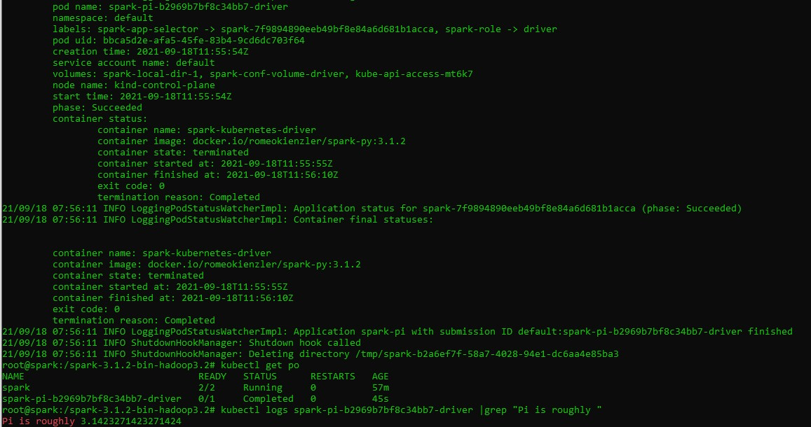

We are going  to setup an experimental Kubernetes cluster  using Kubernetes in Docker in Windows with Apache Spark.  We will create an Apache Spark client POD within that cluster to submit jobs. Then,will use  the spark-submit command to create a job running inside this Kubernetes cluster on experimental windows 10 environment.


Kubernetes is a container orchestrator which allows to schedule millions of "docker" containers on huge compute clusters containing thousands of compute nodes. Originally invented and open-sourced by Google, Kubernetes became the de-facto standard for cloud-native application development and deployment. 


## Install  Docker client on Windows Subsystem for Linux 


## Ubuntu in Windows 

The first step is install the bash in windows 10, you can follow previous instructions written here.

[https://ruslanmv.com/blog/Python3-in-Windows-with-Ubuntu](https://ruslanmv.com/blog/Python3-in-Windows-with-Ubuntu)


## Installation of Docker

We should install the docker  CE in windows from here

[https://hub.docker.com/editions/community/docker-ce-desktop-windows](https://hub.docker.com/editions/community/docker-ce-desktop-windows)


After having installed docker on windows we make sure you expose the daemon on Windows, otherwise it won't work.


Having Ubuntu and Docker in windows you enter to the bash in your terminal

```
Bash.exe
```


Before you install Docker Engine in the Ubuntu for the first time on a new host machine, you need to set up the Docker repository. Afterward, you can install and update Docker from the repository.


Update the `apt` package index and install packages to allow `apt` to use a repository over HTTPS:

```
$ sudo apt-get update

$ sudo apt-get install \
    apt-transport-https \
    ca-certificates \
    curl \
    gnupg \
    lsb-release
```

Add Docker’s official GPG key:

```
$ curl -fsSL https://download.docker.com/linux/ubuntu/gpg | sudo gpg --dearmor -o /usr/share/keyrings/docker-archive-keyring.gpg
```

Use the following command to set up the **stable** repository. To add the **nightly** or **test** repository, add the word `nightly` or `test` (or both) after the word `stable` in the commands below. [Learn about **nightly** and **test** channels](https://docs.docker.com/engine/install/).


```
$ echo \
  "deb [arch=amd64 signed-by=/usr/share/keyrings/docker-archive-keyring.gpg] https://download.docker.com/linux/ubuntu \
  $(lsb_release -cs) stable" | sudo tee /etc/apt/sources.list.d/docker.list > /dev/null
```


## Install Docker Engine

Update the `apt` package index, and install the *latest version* of Docker Engine and containerd, or go to the next step to install a specific version:

```
sudo apt-get update
```

Install packages to allow apt to use a repository over HTTPS:

```
sudo apt-get install apt-transport-https ca-certificates curl software-properties-common
```

Add Docker’s official GPG key:

```
curl -fsSL https://download.docker.com/linux/ubuntu/gpg | sudo apt-key add -
```

Verify that you now have the key with the fingerprint 9DC8 5822 9FC7 DD38 854A E2D8 8D81 803C 0EBF CD88, by searching for the last 8 characters of the fingerprint.

```
sudo apt-key fingerprint 0EBFCD88
```


Use the following command to set up the stable repository. You always need the stable repository, even if you want to install builds from the edge or test repositories as well. To add the edge or test repository, add the word edge or test (or both) after the word stable in the commands below.

```
sudo add-apt-repository "deb [arch=amd64] https://download.docker.com/linux/ubuntu $(lsb_release -cs) stable"
```

Now we're ready to install Docker Community Edition

Update the apt package index again

```
$ sudo apt-get update
```

 And install Docker CE

```
sudo apt-get install docker-ce
```

When that finishes, you'll end up having everything installed in Linux, but as I mentioned before, the Docker Engine does not run in WSL so if you write any command like *docker images*, you'll see a message like this one:

> Cannot connect to the Docker daemon at unix:///var/run/docker.sock. Is the docker daemon running?

No, it is not running and it'll never be, at least for now.

You need to tell the Docker client where the Docker host is, and you can do that by using the -H option as follows:

```
docker -H localhost:2375 images
```

If you don't want to type the host every time, you can set up and environment variable called DOCKER_HOST to localhost:2375

```
export DOCKER_HOST=localhost:2375
```

Now just running *docker images* will show the images in your host environment.

Restart the bash console and the DOCKER_HOST variable should be there, just type *docker images* to check everything is there.

 First, check if the Docker engine is running:

```
sudo service docker status
```

If the Docker engine isn’t working, start it with the following command:

```
sudo service docker start
```

Verify that Docker Engine is installed correctly by running the `hello-world` image.

```
$ sudo docker run hello-world
```

This command downloads a test image and runs it in a container. When the container runs, it prints a message and exits.

Docker Engine is installed and running. The `docker` group is created but no users are added to it. You need to use `sudo` to run Docker commands. 

## Install KIND - Kubernetes in Docker

An easy way to install and run a Kubernetes cluster inside a single docker container

Please enter the following commands in the terminal:

Get the latest code:

```
git clone https://github.com/ruslanmv/Spark-with-Kubernetes.git
```

Change the directory to the downloaded code:

```
cd Spark-with-Kubernetes
```

Change into the "Kubernetes in Docker" installation folder:

```
cd kind
```

Install the "Kubernetes in Docker" install tool (kind):

```
./install_kind.sh
```

We can install the  KIND Kubernetes Cluster running on top of Docker:

```
./create_kind_cluster.sh
```


or Install the Kubernet

Download the latest Kubernetes release with the command:

```yaml
curl -LO "https://storage.googleapis.com/kubernetes-release/release/$(curl -s https://storage.googleapis.com/kubernetes-release/release/stable.txt)/bin/linux/amd64/kubectl"
```

Make the kubectl binary executable:

```yaml
chmod +x ./kubectl
```

Move the binary in to your PATH:

```yaml
sudo mv ./kubectl /usr/local/bin/kubectl
```

Test to ensure the version you installed is up-to-date:

```yaml
kubectl cluster-info
kubectl version
```


## Deploy the Apache Spark Kubernetes Pod

Create a Kubernetes Pod - a set of containers running inside Kubernetes. Here, containing Apache Spark which we use to submit jobs against Kubernetes

Entering the following commands in the terminal:

Install the Apache Spark POD:

```
kubectl apply -f ../spark/pod_spark.yaml 
```

Make sure that we can interact the the Kubernetes Cluster form inside a POD:

```
kubectl apply -f rbac.yaml 
```

Now it is time to check the status of the Pod. Just enter the following command:

```
kubectl get po 
```

If you see the following output it means that the Pod is not yet available and you need to wait a bit.

```
NAME   READY   STATUS              RESTARTS   AGE  
spark  0/2     ContainerCreating   0          29s
```

Just issue the command again after some time:

```
kubectl get po 
```

After a while you should see an output like this:

```
NAME  READY   STATUS    RESTARTS   AGE
spark 2/2     Running   0          10m
```

In case you see the following status you need to delete the pod and start over again later as this usually happens when the image registry is unreliable or offline.

```
NAME   READY   STATUS              RESTARTS   AGE  
spark  0/2     ImagePullBackOff    0          29s
```

Just in this case please delete the pod:

```
kubectl delete po spark 
```

Then start over:

```
kubectl apply -f ../spark/pod_spark.yaml 
```

Again, regularly check status:

```
kubectl get po 
```

Note that this Pod is called *spark* and contains two containers *(2/2)* of which are both in status *Running*. Please also note that Kubernetes automatically *RESTARTS* failed pods - this hasn't happened here so far. Most probably because the *AGE* of this pod is only 10 minutes.


## Submit Apache Spark jobs to Kubernetes

Now it is time to enter the *spark* container of this Pod. The command *exec* is told to provide interactive access (*-it*) to the container called *spark* (-c). With *--* we execute a shell (/bin/bash).

```
kubectl exec -it spark -c spark  -- /bin/bash
```

You've now entered container *spark* in Pod *spark* inside Kubernetes. This container we will use to submit Spark applications to the Kubernetes cluster. This container is based on an image with the Apache Spark distribution and the *kubectl* command pre-installed.

If you are interested you can have a look at the [Dockerfile](https://github.com/ruslanmv/Spark-with-Kubernetes/blob/main/spark/Dockerfile) to understand what's really inside.

You can also check out the [pod.yaml](https://github.com/ruslanmv/Spark-with-Kubernetes/blob/main/spark/pod_spark.yaml). You'll notice that it contains two containers. One is Apache Spark, another one is providing a Kubernetes Proxy - a so called side car container - allowing to interact with the Kubernetes cluster from inside a Pod.

Inside the container you can use the *spark-submit* command which makes use of the new native Kubernetes scheduler that has been added to Spark recently.

The following command submits the *SparkPi* sample application to the cluster. SparkPi computes Pi and the more iterations you run, the more precise it gets:

```
./bin/spark-submit \
--master k8s://http://127.0.0.1:8001 \
--deploy-mode cluster \
--name spark-pi \
--class org.apache.spark.examples.SparkPi \
--conf spark.executor.instances=1 \
--conf spark.kubernetes.container.image=romeokienzler/spark-py:3.1.2 \
--conf spark.kubernetes.executor.limit.cores=1 \
local:///opt/spark/examples/jars/spark-examples_2.12-3.1.2.jar \
10
```

You should see output like below, please ignore the WARNINGS. Unless you don't see ERRORS all is fine:




## Understanding the spark-submit command

So let's have a look what's going on here:

- *./bin/spark-submit* is the command to submit applications to a Apache Spark cluster
- *--master k8s://[http://127.0.0.1:8001](http://127.0.0.1:8001/)* is the address of the Kubernetes API server - the way *kubectl* but also the Apache Spark native Kubernetes scheduler interacts with the Kubernetes cluster
- *--name spark-pi* provides a name for the job and the subsequent Pods created by the Apache Spark native Kubernetes scheduler are prefixed with that name
- *--class org.apache.spark.examples.SparkPi* provides the canonical name for the Spark application to run (Java package and class name)
- *--conf spark.executor.instances=1* tells the Apache Spark native Kubernetes scheduler how many Pods it has to create to parallelize the application. Note that on this single node development Kubernetes cluster increasing this number doesn't make any sense (besides adding overhead for parallelization)
- *--conf spark.kubernetes.container.image=romeokienzler/spark-py:3.1.2* tells the Apache Spark native Kubernetes scheduler which container image it should use for creating the driver and executor Pods. This image can be custom build using the provided Dockerfiles in *kubernetes/dockerfiles/spark/* and *bin/docker-image-tool.sh* in the Apache Spark distribution
- *--conf spark.kubernetes.executor.limit.cores=1* tells the Apache Spark native Kubernetes scheduler to set the CPU core limit to only use one core per executor Pod
- *local:///opt/spark/examples/jars/spark-examples_2.12-3.1.2.jar* indicates the *jar* file the application is contained in. Note that the *local://* prefix addresses a path within the container images provided by the *spark.kubernetes.container.image* option. Since we're using a *jar* provided by the Apache Spark distribution this is not a problem, otherwise the *spark.kubernetes.file.upload.path* option has to be set and an appropriate storage subsystem has to be configured, as described in the [documentation](https://spark.apache.org/docs/latest/running-on-kubernetes.html?utm_medium=Exinfluencer&utm_source=Exinfluencer&utm_content=000026UJ&utm_term=10006555&utm_id=NA-SkillsNetwork-Channel-SkillsNetworkCoursesIBMBD0225ENSkillsNetwork25716109-2021-01-01#running-spark-on-kubernetes)
- *10* tells the application to run for *10* iterations, then output the computed value of *Pi*

Please see the [documentation](https://spark.apache.org/docs/latest/running-on-kubernetes.html?utm_medium=Exinfluencer&utm_source=Exinfluencer&utm_content=000026UJ&utm_term=10006555&utm_id=NA-SkillsNetwork-Channel-SkillsNetworkCoursesIBMBD0225ENSkillsNetwork25716109-2021-01-01#configuration) for a full list of available parameters.

## Monitor the Spark application in a parallel terminal

Once this command runs you can *open a second terminal window* within Theia and issue the following command:

```
kubectl get po  
```

This will show you the additional Pods being created by the Apache Spark native Kubernetes scheduler - one driver and at least one executor (with an exception if there is only one executor, it runs within the driver Pod). 

To check the job's elapsed time just execute (you need to replace the Pod name of course with the one on your system):

Please make sure you run the following code in the newly created terminal window which allows you to execute commands within the Spark driver running in a POD.

```
kubectl logs spark-pi-b2969b7bf8c34bb7-driver |grep "Job 0 finished:"
```

You should get something like:

```
Job 0 finished: reduce at SparkPi.scala:38, took 8.446024 s
```

If you are interested in knowing what value for *Pi* the application came up with just issue:

```
kubectl logs spark-pi-b2969b7bf8c34bb7-driver |grep "Pi is roughly "
```

And you'll see something like:

```
Pi is roughly 3.1416551416551415
```

Now you can play around with values for *spark.executor.instances*, *spark.kubernetes.executor.limit.cores=1* (0.1 is also a valid number) and number of iterations and see how it affects runtime and precision of the outcome.

**Congratulations**!.  You are now able to scale your Apache Spark jobs on any Kubernetes cluster running in the cloud or in your data center to thousands of nodes, CPUs and GB of main memory.

