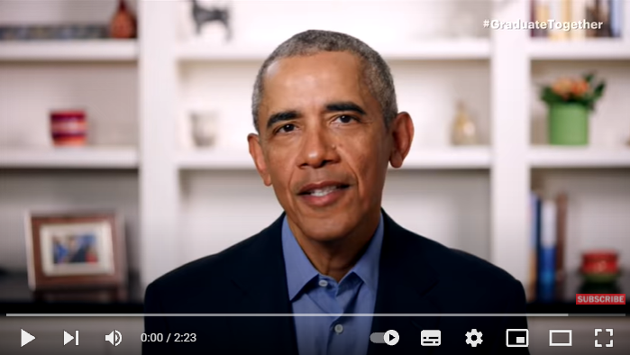
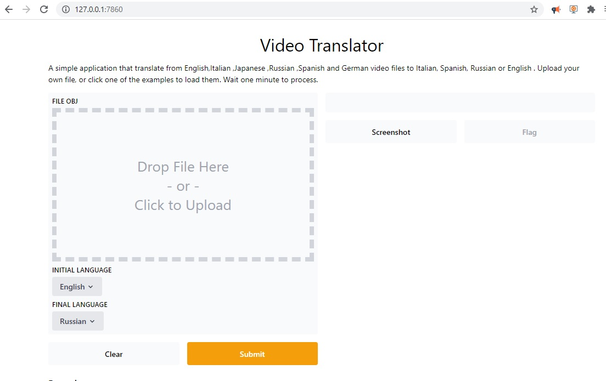
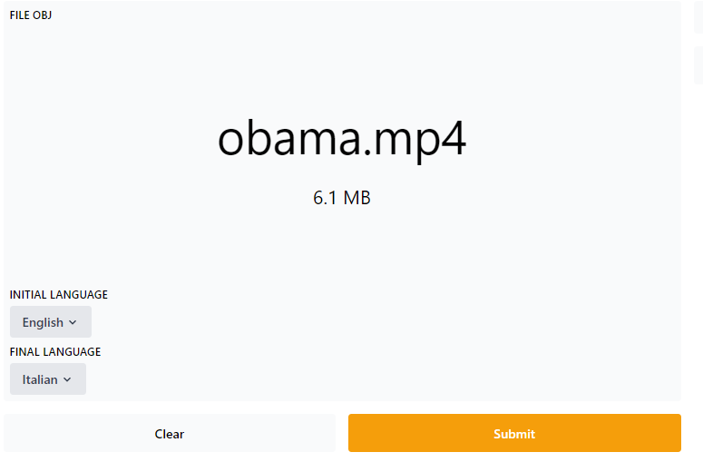
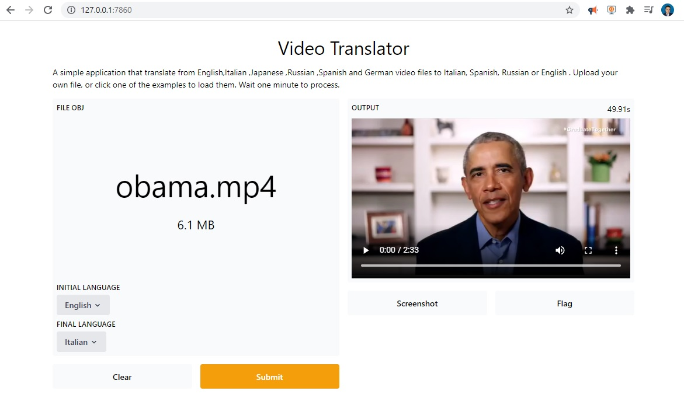
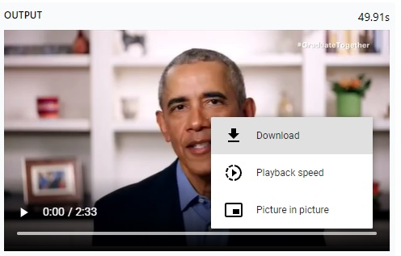

In this post, I will show you how to translate a  video from a video recording file to another language such as Italian, Russian, Spanish or German.


# Getting Started

This will a short and simple project. It will not take us more than five minutes to finish the whole project. 

## Installation of Conda

First you need to install anaconda at this [link](https://www.anaconda.com/products/individual)


After you install , check that your terminal , recognize **conda**

```
C:\conda --version
conda 4.10.1
```

If says ‘conda’ is not recognized as an internal or external command,

Yu can tray this: for me, I installed anaconda3 into `C:\Users\Ruslan\anaconda3`. Therefore you need to add `C:\Users\Ruslan\anaconda3` as well as `C:\Users\Ruslan\anaconda3\Scripts\` to your path variable, e.g. `set PATH=%PATH%;C:\Users\Ruslan\anaconda3;C:\Users\Ruslan\anaconda3\Scripts\`.

```
conda create -n gradio python==3.7
conda activate gradio
```

then in 

```
git clone https://github.com/ruslanmv/Video-Translator.git
```

```
cd Video-Translator
```

```
pip install -r requirements.txt
```

Yes, that’s all we need to get the task done. Without losing any time, let’s move to the next step.

# Define the Video Clip

Hoping that you already have the video clip ready. Let’s copy the file inside our project folder; 

 Before we move to the final line, let’s learn about the formats. The video format that we will consider is MP4

- MP4 (mp4, m4a, m4v, f4v, f4a, m4b, m4r, f4b, mov)

this will make it easier to define the video file. 

For example let us consider the following video from Youtube


[](https://www.youtube.com/watch?v=h5gNSHcoVmQ)


you can download [here](https://github.com/ruslanmv/Video-Translator/raw/master/obama.mp4)

The  recording is in mp4 format,. It will be helpful when we will import the file to the program.

The next step is execute our program  **main,py** that will do the whole thing for us

```
python main.py
```

you will get

```
Running locally at: http://127.0.0.1:7860/
To create a public link, set `share=True` in `launch()`.
```


Now copy the  address   `http://127.0.0.1:7860/` and  paste them in your favorite webrowser.




#  Translating the  Video

This is the final step, we upload the video file that you downloaded and select  it.




Then  choose the  Initial Language **English** and Final Language **Italian**  for example.


Then we proceed to **Submit** and we wait. There is  counter. It is suggested that the video should be no larger than 10 megabytes or 4 minutes of length. Otherwise the program wont work, because we are using free cloud services during the translation and encoding.

The video will be translated.




Then you can **play** it. Also you can download it.





You can see the live program here:

[https://gradio.app/hub/ruslanmv/Video-Translator](https://gradio.app/hub/ruslanmv/Video-Translator)


**Congratulations!.**  We have created a Gradio application that translate videos to different languages.

