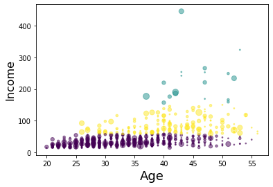

Imagine that you have a customer dataset, and you need to apply customer segmentation on this historical data.

Customer segmentation is the practice of partitioning a customer base into groups of individuals that have similar characteristics.

It is a significant strategy as a business can target these specific groups of customers and effectively allocate marketing resources. 

For example, one group might contain customers who are high-profit and low-risk, that is, more likely to purchase products, or subscribe for a service. 


<h4>Table of contents</h4>
<div class="alert alert-block alert-info" style="margin-top: 20px">
    <ol>
        <li><a href="#ref1">K-Means with Python</a></li>
        <li><a href="#ref2">K-Means with Pyspark</a></li>
    </ol>
</div>
<br>

The installation of **Python** and **Pyspark**  and the introduction of K-Means is given [here.](./Machine-Learning-with-Python-and-Spark)

<a id="ref1"></a>

### K-Means Clustering with Python


```python
import random 
import numpy as np 
import matplotlib.pyplot as plt 
from sklearn.cluster import KMeans 
%matplotlib inline
```


```python
import pandas as pd
cust_df = pd.read_csv("Cust_Segmentation.csv")
cust_df.head()
```


<div>
<style scoped>
    .dataframe tbody tr th:only-of-type {
        vertical-align: middle;
    }


    .dataframe tbody tr th {
        vertical-align: top;
    }
    
    .dataframe thead th {
        text-align: right;
    }

</style>

<table border="1" class="dataframe">
  <thead>
    <tr style="text-align: right;">
      <th></th>
      <th>Customer Id</th>
      <th>Age</th>
      <th>Edu</th>
      <th>Years Employed</th>
      <th>Income</th>
      <th>Card Debt</th>
      <th>Other Debt</th>
      <th>Defaulted</th>
      <th>Address</th>
      <th>DebtIncomeRatio</th>
    </tr>
  </thead>
  <tbody>
    <tr>
      <th>0</th>
      <td>1</td>
      <td>41</td>
      <td>2</td>
      <td>6</td>
      <td>19</td>
      <td>0.124</td>
      <td>1.073</td>
      <td>0.0</td>
      <td>NBA001</td>
      <td>6.3</td>
    </tr>
    <tr>
      <th>1</th>
      <td>2</td>
      <td>47</td>
      <td>1</td>
      <td>26</td>
      <td>100</td>
      <td>4.582</td>
      <td>8.218</td>
      <td>0.0</td>
      <td>NBA021</td>
      <td>12.8</td>
    </tr>
    <tr>
      <th>2</th>
      <td>3</td>
      <td>33</td>
      <td>2</td>
      <td>10</td>
      <td>57</td>
      <td>6.111</td>
      <td>5.802</td>
      <td>1.0</td>
      <td>NBA013</td>
      <td>20.9</td>
    </tr>
    <tr>
      <th>3</th>
      <td>4</td>
      <td>29</td>
      <td>2</td>
      <td>4</td>
      <td>19</td>
      <td>0.681</td>
      <td>0.516</td>
      <td>0.0</td>
      <td>NBA009</td>
      <td>6.3</td>
    </tr>
    <tr>
      <th>4</th>
      <td>5</td>
      <td>47</td>
      <td>1</td>
      <td>31</td>
      <td>253</td>
      <td>9.308</td>
      <td>8.908</td>
      <td>0.0</td>
      <td>NBA008</td>
      <td>7.2</td>
    </tr>
  </tbody>
</table>

</div>


```python
df = cust_df.drop('Address', axis=1)
df.head()
```


<div>
<style scoped>
    .dataframe tbody tr th:only-of-type {
        vertical-align: middle;
    }


    .dataframe tbody tr th {
        vertical-align: top;
    }
    
    .dataframe thead th {
        text-align: right;
    }

</style>

<table border="1" class="dataframe">
  <thead>
    <tr style="text-align: right;">
      <th></th>
      <th>Customer Id</th>
      <th>Age</th>
      <th>Edu</th>
      <th>Years Employed</th>
      <th>Income</th>
      <th>Card Debt</th>
      <th>Other Debt</th>
      <th>Defaulted</th>
      <th>DebtIncomeRatio</th>
    </tr>
  </thead>
  <tbody>
    <tr>
      <th>0</th>
      <td>1</td>
      <td>41</td>
      <td>2</td>
      <td>6</td>
      <td>19</td>
      <td>0.124</td>
      <td>1.073</td>
      <td>0.0</td>
      <td>6.3</td>
    </tr>
    <tr>
      <th>1</th>
      <td>2</td>
      <td>47</td>
      <td>1</td>
      <td>26</td>
      <td>100</td>
      <td>4.582</td>
      <td>8.218</td>
      <td>0.0</td>
      <td>12.8</td>
    </tr>
    <tr>
      <th>2</th>
      <td>3</td>
      <td>33</td>
      <td>2</td>
      <td>10</td>
      <td>57</td>
      <td>6.111</td>
      <td>5.802</td>
      <td>1.0</td>
      <td>20.9</td>
    </tr>
    <tr>
      <th>3</th>
      <td>4</td>
      <td>29</td>
      <td>2</td>
      <td>4</td>
      <td>19</td>
      <td>0.681</td>
      <td>0.516</td>
      <td>0.0</td>
      <td>6.3</td>
    </tr>
    <tr>
      <th>4</th>
      <td>5</td>
      <td>47</td>
      <td>1</td>
      <td>31</td>
      <td>253</td>
      <td>9.308</td>
      <td>8.908</td>
      <td>0.0</td>
      <td>7.2</td>
    </tr>
  </tbody>
</table>

</div>


#### Normalizing over the standard deviation

Now let's normalize the dataset. But why do we need normalization in the first place? Normalization is a statistical method that helps mathematical-based algorithms to interpret features with different magnitudes and distributions equally. We use __StandardScaler()__ to normalize our dataset.


```python
from sklearn.preprocessing import StandardScaler
X = df.values[:,1:]
X = np.nan_to_num(X)
Clus_dataSet = StandardScaler().fit_transform(X)
Clus_dataSet
```


    array([[ 0.74291541,  0.31212243, -0.37878978, ..., -0.59048916,
            -0.52379654, -0.57652509],
           [ 1.48949049, -0.76634938,  2.5737211 , ...,  1.51296181,
            -0.52379654,  0.39138677],
           [-0.25251804,  0.31212243,  0.2117124 , ...,  0.80170393,
             1.90913822,  1.59755385],
           ...,
           [-1.24795149,  2.46906604, -1.26454304, ...,  0.03863257,
             1.90913822,  3.45892281],
           [-0.37694723, -0.76634938,  0.50696349, ..., -0.70147601,
            -0.52379654, -1.08281745],
           [ 2.1116364 , -0.76634938,  1.09746566, ...,  0.16463355,
            -0.52379654, -0.2340332 ]])


```python
clusterNum = 3
k_means = KMeans(init = "k-means++", n_clusters = clusterNum, n_init = 12)
k_means.fit(X)
labels = k_means.labels_
#print(labels)
```

We assign the labels to each row in dataframe.


```python
df["Clus_km"] = labels
df.head(5)
```


<div>
<style scoped>
    .dataframe tbody tr th:only-of-type {
        vertical-align: middle;
    }


    .dataframe tbody tr th {
        vertical-align: top;
    }
    
    .dataframe thead th {
        text-align: right;
    }

</style>

<table border="1" class="dataframe">
  <thead>
    <tr style="text-align: right;">
      <th></th>
      <th>Customer Id</th>
      <th>Age</th>
      <th>Edu</th>
      <th>Years Employed</th>
      <th>Income</th>
      <th>Card Debt</th>
      <th>Other Debt</th>
      <th>Defaulted</th>
      <th>DebtIncomeRatio</th>
      <th>Clus_km</th>
    </tr>
  </thead>
  <tbody>
    <tr>
      <th>0</th>
      <td>1</td>
      <td>41</td>
      <td>2</td>
      <td>6</td>
      <td>19</td>
      <td>0.124</td>
      <td>1.073</td>
      <td>0.0</td>
      <td>6.3</td>
      <td>0</td>
    </tr>
    <tr>
      <th>1</th>
      <td>2</td>
      <td>47</td>
      <td>1</td>
      <td>26</td>
      <td>100</td>
      <td>4.582</td>
      <td>8.218</td>
      <td>0.0</td>
      <td>12.8</td>
      <td>2</td>
    </tr>
    <tr>
      <th>2</th>
      <td>3</td>
      <td>33</td>
      <td>2</td>
      <td>10</td>
      <td>57</td>
      <td>6.111</td>
      <td>5.802</td>
      <td>1.0</td>
      <td>20.9</td>
      <td>0</td>
    </tr>
    <tr>
      <th>3</th>
      <td>4</td>
      <td>29</td>
      <td>2</td>
      <td>4</td>
      <td>19</td>
      <td>0.681</td>
      <td>0.516</td>
      <td>0.0</td>
      <td>6.3</td>
      <td>0</td>
    </tr>
    <tr>
      <th>4</th>
      <td>5</td>
      <td>47</td>
      <td>1</td>
      <td>31</td>
      <td>253</td>
      <td>9.308</td>
      <td>8.908</td>
      <td>0.0</td>
      <td>7.2</td>
      <td>1</td>
    </tr>
  </tbody>
</table>

</div>


We can easily check the centroid values by averaging the features in each cluster.


```python
df.groupby('Clus_km').mean()
```


<div>
<style scoped>
    .dataframe tbody tr th:only-of-type {
        vertical-align: middle;
    }


    .dataframe tbody tr th {
        vertical-align: top;
    }
    
    .dataframe thead th {
        text-align: right;
    }

</style>

<table border="1" class="dataframe">
  <thead>
    <tr style="text-align: right;">
      <th></th>
      <th>Customer Id</th>
      <th>Age</th>
      <th>Edu</th>
      <th>Years Employed</th>
      <th>Income</th>
      <th>Card Debt</th>
      <th>Other Debt</th>
      <th>Defaulted</th>
      <th>DebtIncomeRatio</th>
    </tr>
    <tr>
      <th>Clus_km</th>
      <th></th>
      <th></th>
      <th></th>
      <th></th>
      <th></th>
      <th></th>
      <th></th>
      <th></th>
      <th></th>
    </tr>
  </thead>
  <tbody>
    <tr>
      <th>0</th>
      <td>432.468413</td>
      <td>32.964561</td>
      <td>1.614792</td>
      <td>6.374422</td>
      <td>31.164869</td>
      <td>1.032541</td>
      <td>2.104133</td>
      <td>0.285185</td>
      <td>10.094761</td>
    </tr>
    <tr>
      <th>1</th>
      <td>410.166667</td>
      <td>45.388889</td>
      <td>2.666667</td>
      <td>19.555556</td>
      <td>227.166667</td>
      <td>5.678444</td>
      <td>10.907167</td>
      <td>0.285714</td>
      <td>7.322222</td>
    </tr>
    <tr>
      <th>2</th>
      <td>402.295082</td>
      <td>41.333333</td>
      <td>1.956284</td>
      <td>15.256831</td>
      <td>83.928962</td>
      <td>3.103639</td>
      <td>5.765279</td>
      <td>0.171233</td>
      <td>10.724590</td>
    </tr>
  </tbody>
</table>

</div>


Now, lets look at the distribution of customers based on their age and income:


```python
area = np.pi * ( X[:, 1])**2  
plt.scatter(X[:, 0], X[:, 3], s=area, c=labels.astype(np.float), alpha=0.5)
plt.xlabel('Age', fontsize=18)
plt.ylabel('Income', fontsize=16)

plt.show()

```

    C:\Anaconda3\envs\pyspark\lib\site-packages\ipykernel_launcher.py:2: DeprecationWarning: `np.float` is a deprecated alias for the builtin `float`. To silence this warning, use `float` by itself. Doing this will not modify any behavior and is safe. If you specifically wanted the numpy scalar type, use `np.float64` here.
    Deprecated in NumPy 1.20; for more details and guidance: https://numpy.org/devdocs/release/1.20.0-notes.html#deprecations


​    


​    

​    


k-means will partition your customers into mutually exclusive groups, for example, into 3 clusters. The customers in each cluster are similar to each other demographically.

<a id="ref2"></a>

### K-Means Clustering with Pyspark

First thing to do is start a Spark Session


```python
import findspark
findspark.init()
```


```python
from pyspark.sql import SparkSession
spark = SparkSession.builder.appName('customers').getOrCreate()
```


```python
from pyspark.ml.clustering import KMeans
# Loads data.
dataset = spark.read.csv("Cust_Segmentation.csv",header=True,inferSchema=True)
```


```python
dataset.head(1)
```


    [Row(Customer Id=1, Age=41, Edu=2, Years Employed=6, Income=19, Card Debt=0.124, Other Debt=1.073, Defaulted=0, Address='NBA001', DebtIncomeRatio=6.3)]


```python
#dataset.describe().show(1)
```


```python
dataset.printSchema()
```

    root
     |-- Customer Id: integer (nullable = true)
     |-- Age: integer (nullable = true)
     |-- Edu: integer (nullable = true)
     |-- Years Employed: integer (nullable = true)
     |-- Income: integer (nullable = true)
     |-- Card Debt: double (nullable = true)
     |-- Other Debt: double (nullable = true)
     |-- Defaulted: integer (nullable = true)
     |-- Address: string (nullable = true)
     |-- DebtIncomeRatio: double (nullable = true)


​    

As you can see, __Address__ in this dataset is a categorical variable. k-means algorithm isn't directly applicable to categorical variables because Euclidean distance function isn't really meaningful for discrete variables. So, lets drop this feature and run clustering.


```python
columns_to_drop = ['Address']
dataset = dataset.drop(*columns_to_drop)
dataset.printSchema()
```

    root
     |-- Customer Id: integer (nullable = true)
     |-- Age: integer (nullable = true)
     |-- Edu: integer (nullable = true)
     |-- Years Employed: integer (nullable = true)
     |-- Income: integer (nullable = true)
     |-- Card Debt: double (nullable = true)
     |-- Other Debt: double (nullable = true)
     |-- Defaulted: integer (nullable = true)
     |-- DebtIncomeRatio: double (nullable = true)


​    


```python
dataset.columns
```


    ['Customer Id',
     'Age',
     'Edu',
     'Years Employed',
     'Income',
     'Card Debt',
     'Other Debt',
     'Defaulted',
     'DebtIncomeRatio']


```python
from pyspark.ml.linalg import Vectors
from pyspark.ml.feature import VectorAssembler
```


```python
from pyspark.sql.types import IntegerType
dataset = dataset.withColumn("Defaulted", dataset["Defaulted"].cast(IntegerType()))
```


```python
dataset.printSchema()
```

    root
     |-- Customer Id: integer (nullable = true)
     |-- Age: integer (nullable = true)
     |-- Edu: integer (nullable = true)
     |-- Years Employed: integer (nullable = true)
     |-- Income: integer (nullable = true)
     |-- Card Debt: double (nullable = true)
     |-- Other Debt: double (nullable = true)
     |-- Defaulted: integer (nullable = true)
     |-- DebtIncomeRatio: double (nullable = true)


​    


```python
feat_cols = [
 'Age',
 'Edu','Years Employed','Income','Card Debt','Other Debt','DebtIncomeRatio']
```


```python
vec_assembler = VectorAssembler(inputCols = feat_cols, outputCol='features')
```


```python
final_data = vec_assembler.transform(dataset)
```


```python
from pyspark.ml.feature import StandardScaler
```


```python
scaler = StandardScaler(inputCol="features", outputCol="scaledFeatures", withStd=True, withMean=False)
```


```python
final_data
```


    DataFrame[Customer Id: int, Age: int, Edu: int, Years Employed: int, Income: int, Card Debt: double, Other Debt: double, Defaulted: int, DebtIncomeRatio: double, features: vector]


```python
# Compute summary statistics by fitting the StandardScaler
scalerModel = scaler.fit(final_data)
```


```python
# Normalize each feature to have unit standard deviation.
cluster_final_data = scalerModel.transform(final_data)
```

## Train the Model and Evaluate

** Time to find out whether its 2 or 3! **


```python
# Trains a k-means model.
kmeans3 = KMeans(featuresCol='scaledFeatures',k=3)
kmeans2 = KMeans(featuresCol='scaledFeatures',k=2)
```


```python
model3 = kmeans3.fit(cluster_final_data)
model2 = kmeans2.fit(cluster_final_data)
```


```python
from pyspark.ml.clustering import KMeans
from pyspark.ml.evaluation import ClusteringEvaluator
```


```python
# Make predictions
predictions3 = model3.transform(cluster_final_data)
predictions2 = model2.transform(cluster_final_data)
```


```python
# Evaluate clustering by computing Silhouette score
evaluator = ClusteringEvaluator()
```


```python
silhouette = evaluator.evaluate(predictions3)
print("With k=3 Silhouette with squared euclidean distance = " + str(silhouette))
silhouette = evaluator.evaluate(predictions2)
print("With k=2 Silhouette with squared euclidean distance = " + str(silhouette))
```

    With k=3 Silhouette with squared euclidean distance = 0.05288868077858952
    With k=2 Silhouette with squared euclidean distance = 0.6581986063262965


```python
#Show the results
```


```python
centers=model.clusterCenters()
print("Cluster Centers:")
for center in centers:
    print(center)
```

    Cluster Centers:
    [5.38544237 2.08381863 2.54750121 2.6356673  1.9964595  2.30786829
     2.04421758]
    [3.71924395 2.29195271 0.55736835 0.78361889 0.68066746 0.87084406
     2.18192288]
    [4.38305208 1.49522293 1.24517269 0.97828653 0.34932727 0.44759616
     0.93527274]


```python
# Evaluate clustering by computing Within Set Sum of Squared Errors.
```


```python
for k in range(2,9):
    kmeans = KMeans(featuresCol='scaledFeatures',k=k)
    model = kmeans.fit(cluster_final_data)
    predictions = model.transform(cluster_final_data)
    evaluator = ClusteringEvaluator()
    silhouette = evaluator.evaluate(predictions)
    print("With K={}".format(k))
    print("Silhouette with squared euclidean distance = " + str(silhouette))
    print('--'*30)
```

    With K=2
    Silhouette with squared euclidean distance = 0.6581986063262965
    ------------------------------------------------------------
    With K=3
    Silhouette with squared euclidean distance = 0.05288868077858952
    ------------------------------------------------------------
    With K=4
    Silhouette with squared euclidean distance = 0.23934815694787387
    ------------------------------------------------------------
    With K=5
    Silhouette with squared euclidean distance = 0.09503424227629984
    ------------------------------------------------------------
    With K=6
    Silhouette with squared euclidean distance = 0.03747870420927804
    ------------------------------------------------------------
    With K=7
    Silhouette with squared euclidean distance = 0.07544170107415611
    ------------------------------------------------------------
    With K=8
    Silhouette with squared euclidean distance = 0.07633841797382555
    ------------------------------------------------------------


**Let's check with the transform and prediction columns that result form this! Congratulations if you made this connection, it was quite tricky given what we've covered!**


```python
model3.transform(cluster_final_data).groupBy('prediction').count().show()
```

    +----------+-----+
    |prediction|count|
    +----------+-----+
    |         1|  261|
    |         2|  439|
    |         0|  150|
    +----------+-----+


​    


```python
model2.transform(cluster_final_data).groupBy('prediction').count().show()
```

    +----------+-----+
    |prediction|count|
    +----------+-----+
    |         1|  183|
    |         0|  667|
    +----------+-----+


​    You can download the notebook [here](https://github.com/ruslanmv/Machine-Learning-with-Python-and-Spark/blob/master/Clustering/Clustering-K-means.ipynb)


**Congratulations!** We have practiced K-Means Clustering with Python and Spark.
