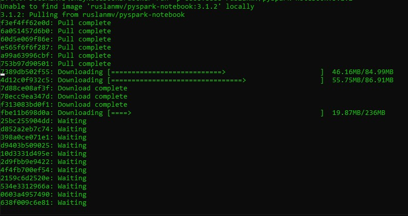
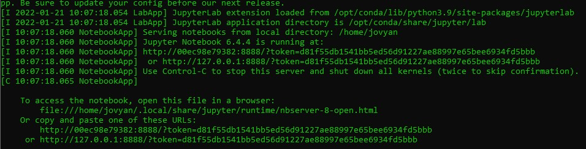
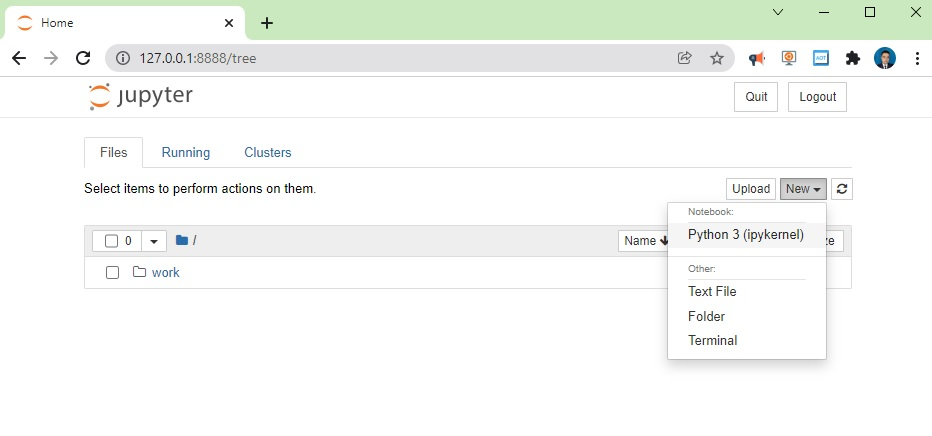
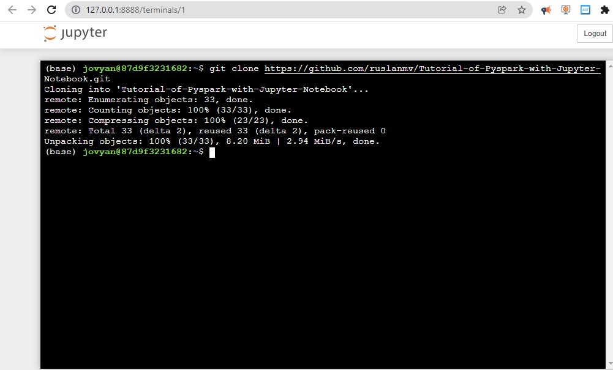
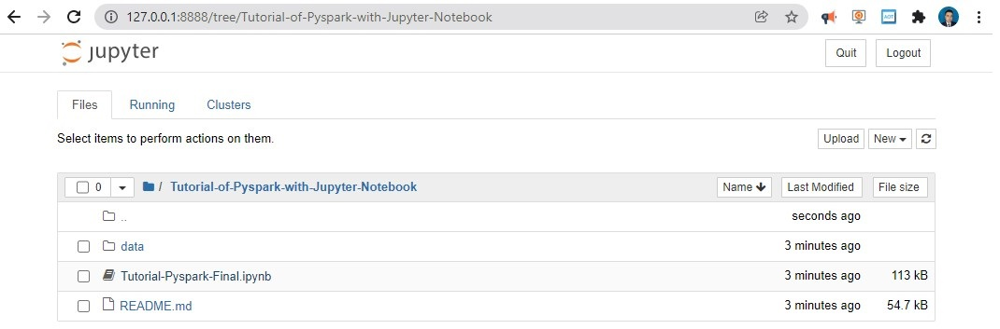
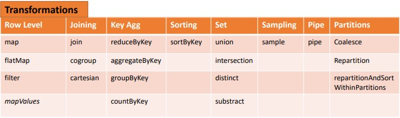
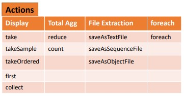

Today we are going to **practice** some exercises and  questions in **Pyspark** by using a ready Jupyter Notebook Instance in a Docker Container
I have collected some relevant questions and answers  to understand better how it works  **Pyspark.**
In order to answer the exercises we are going to use a docker container with **Pyspark**.
Let us  install Docker in your computer 
**Step 1.** Install Docker desktop in you computer.

[https://www.docker.com/products/docker-desktop](https://www.docker.com/products/docker-desktop)

after installed we restart our computer and then we open docker desktop and then open a terminal

**Step 2.** Run the following command 

```
docker run -p 8888:8888 --user root -e GRANT_SUDO=yes ruslanmv/pyspark-notebook:3.1.2
```



after is done you will get adirection something like

`http://127.0.0.1:8888/?token=d81f55db1541bb5ed56d91227ae88997e65bee6934fd5bbb`




copy your address a, open your favorite web browser and paste and press enter.
Then click open new **Terminal**



and type

```bash
git clone https://github.com/ruslanmv/Tutorial-of-Pyspark-with-Jupyter-Notebook.git
```



Then return to your home tree and open the created folder `Tutorial-of-Pyspark-with-Jupyter-Notebook` and open the `Tutorial-Pyspark-Final.ipynb` file



and follow the notebook by pressing shift+enter on each cell. **Great,** now we are ready to answer some questions!

### What is PySpark?

PySpark is an Apache Spark interface in Python. It is used for collaborating with Spark using APIs written in Python.

 It also supports Spark’s features like Spark DataFrame, Spark SQL, Spark Streaming, Spark MLlib and Spark Core.

### What is Findspark used for?
Findspark can add a startup file to the current IPython profile so that the environment vaiables will be properly set and pyspark will be imported upon IPython startup. This file is created when edit_profile is set to true. Findspark can also add to th

```python
import findspark
findspark.init()
```

### How to Initializing Spark?

The first thing a Spark program is to create a SparkContext object, which tells Spark how to access a cluster. 

When we run any spark application, the driver program starts, which has the main() function and the SparkContext gets initiated here


```python
from pyspark.sql import SparkSession
spark = SparkSession \
    .builder \
    .appName("Python Spark SQL basic example") \
    .config("spark.some.config.option", "some-value") \
    .getOrCreate()
```

### Sparksession  is the Spark Entry Point
<a id='sparksession'></a>

It contains the former
-	Sparkcontext
-	SparkConf
-	Sqlcontext
-	Hivecontext
-	Streaming Context

Used for:

- metadata acess
- read data 
- conf session
- manage cluster resources (YARN,MESOS)

### Determine Spark version


```python
# spark
print(f"Spark version = {spark.version}")
```

    Spark version = 3.0.2


**What is PySpark SparkContext?**

PySpark SparkContext is an initial entry point of the spark functionality. It also represents Spark Cluster Connection and can be used for creating the Spark **RDD**s (**R**esilient **D**istributed **D**atasets) and broadcasting the variables on the cluster.


```python
from pyspark import SparkContext
```


```python
sc = SparkContext.getOrCreate()
```


```python
sc.version #Retrieve SparkContext version
```


    '3.0.2'


```python
sc.pythonVer #Retrieve Python version
```


    '3.8'


```python
sc.master #Master URL to connect to
```


    'local[*]'


```python
str(sc.sparkHome) #Path where Spark is installed an worker nodes
```


    'None'


```python
str(sc.sparkUser()) #Retrieve name of the Spark User running SparkContext
```


    'rusla'


```python
sc.appName #Return application name
```


    'Python Spark SQL basic example'


```python
sc.applicationId #Retrieve application ID
```


    'local-1643013259822'


```python
sc.defaultParallelism #Return default level of parallelism
```


    12


```python
sc.defaultMinPartitions #Default minimum number of partitions for RDDs
```


    2


```python
sc.getConf()
```


    <pyspark.conf.SparkConf at 0x19d93300910>


```python
#Apache Spark allow have one Sparkcontect on one node
sc.stop()
```

**Configuration**


```python
from pyspark import SparkConf, SparkContext
conf = (SparkConf()
            .setMaster("local")
            .setAppName("My app")
            .set("spark.executor.memory","1g" ) )
```


```python
sc = SparkContext(conf = conf)
```

**Using The Shell**

In the PySpark shell, a special interpreter aware SparkContext is already created in the variable called sc.

```
$ ./bin/spark shell --master local[2]
$ ./bin/pyspark --master local[4] --py files code.py
```

Set which master the context connects to with the --master argument, and add Python **.zip, .egg** or **.py** files to the  runtime path by passing a comma separated list to --py-files

**What is spark-submit?**
Spark-submit is a utility to run a pyspark application job by specifying options and configurations.


where configurations are:
```python   
spark-submit \
--master <master-url> \
--deploy-mode <deploy-mode> \
--conf <key<=<value> \
--driver-memory <value>g \
--executor-memory <value>g \
--executor-cores <number of cores> \
--jars <comma separated dependencies> \
--packages <package name> \
--py-files \
<application> <application args>
```

**How you can run pyspark program?**

You can use jupyter notebook as in this tutorial we are doing, or just create a python file under bin folder. Write above codes in the .py file.  Execute the file using

```bash 
spark-submit example.py
```

### What are the Data structures in Pyspark?


- RDD :  Data is organized into named columns, like a table in a relational database.  (untyped)
  - Transformations
    - collect : RDD-->  LIST
    - MAP     : RDD --> PipelinedRDD
    - filter  : RDD --> LIST
  - Actions
  
- DF : DataFrame is an immutable distributed collection of data (untyped)

- DS : Dataset (typed)

DataFrame and Dataset APIs are built on top of the Spark SQL engine, it uses Catalyst to generate an optimized logical and physical query plan. 

Across R, Java, Scala, or Python DataFrame/Dataset APIs, all relation type queries undergo the same code optimizer, providing the space and speed efficiency.

Whereas the Dataset[T] typed API is optimized for data engineering tasks, the untyped Dataset[Row] (an alias of DataFrame) is even faster and suitable for interactive analysis.

**How to read a .csv file and infer schema?**


```python
from pyspark.sql import SparkSession        
# Create a SparkSession
spark = (SparkSession
  .builder
  .appName("App")
  .getOrCreate())
# Path to data set
csv_file = "data/departuredelays.csv"
df = (spark.read.format("csv")
  .option("inferSchema", "true")
  .option("header", "true")
  .load(csv_file))
df.createOrReplaceTempView("us_delay_flights_tbl")
```

Now that we have a temporary view, we can issue SQL queries using Spark SQL. These queries are no different from those you might issue against a SQL table in, say, a MySQL or PostgreSQL database.

Next, we’ll find all flights between San Francisco (SFO) and Chicago (ORD) with at least a two-hour delay:


```python
spark.sql("""SELECT date, delay, origin, destination 
FROM us_delay_flights_tbl 
WHERE delay > 120 AND ORIGIN = 'SFO' AND DESTINATION = 'ORD' 
ORDER by delay DESC""").show(10)
```

    +-------+-----+------+-----------+
    |   date|delay|origin|destination|
    +-------+-----+------+-----------+
    |2190925| 1638|   SFO|        ORD|
    |1031755|  396|   SFO|        ORD|
    |1022330|  326|   SFO|        ORD|
    |1051205|  320|   SFO|        ORD|
    |1190925|  297|   SFO|        ORD|
    |2171115|  296|   SFO|        ORD|
    |1071040|  279|   SFO|        ORD|
    |1051550|  274|   SFO|        ORD|
    |3120730|  266|   SFO|        ORD|
    |1261104|  258|   SFO|        ORD|
    +-------+-----+------+-----------+
    only showing top 10 rows


​    

As with the DataFrame and Dataset APIs, with the spark.sql interface you can conduct common data analysis operations

We’ll find all flights whose distance is greater than 1,000 miles:


```python
from pyspark.sql.functions import col, desc
(df.select("distance", "origin", "destination")
  .where(col("distance") > 1000)
  .orderBy(desc("distance"))).show(10)
```

    +--------+------+-----------+
    |distance|origin|destination|
    +--------+------+-----------+
    |    4330|   HNL|        JFK|
    |    4330|   HNL|        JFK|
    |    4330|   HNL|        JFK|
    |    4330|   HNL|        JFK|
    |    4330|   HNL|        JFK|
    |    4330|   HNL|        JFK|
    |    4330|   HNL|        JFK|
    |    4330|   HNL|        JFK|
    |    4330|   HNL|        JFK|
    |    4330|   HNL|        JFK|
    +--------+------+-----------+
    only showing top 10 rows


​    

**What are RDDs in PySpark?**

RDDs expand to Resilient Distributed Datasets. These are the elements that are used for running and operating on multiple nodes to perform parallel processing on a cluster. Since RDDs are suited for parallel processing, they are immutable elements. This means that once we create RDD, we cannot modify it. RDDs are also fault-tolerant which means that whenever failure happens, they can be recovered automatically. Multiple operations can be performed on RDDs to perform a certain task.

- RDD is a distributed collection of data elements without any schema
- No in-built optimization engine for RDDs
- We need to define the schema manually.
- RDD is slower than both Dataframes and Datasets to perform simple operations like grouping the data

### Loading Data

**Parallelized Collection**


```python
rdd = sc.parallelize([('a',7),('a',2),('b',2)])
```


```python
rdd2 = sc.parallelize([('a',2),('d',1),('b',1)])
```


```python
rdd3 = sc.parallelize(range(100))
```


```python
rdd4 = sc.parallelize([("a",["x","y","z"]),
                            ("b",["p","r"])])
```

**External Data**

Read either one text file from HDFS.a local file system or or any Hadoop-supported file system URI with textFile(). or read in a directory of text files with wholeTextFiles()


```python
textFile = sc.textFile("data/people.txt")
textFile2 = sc.wholeTextFiles( "data/Orders")
```

### Retrieving RDD Information

**Basic Information**


```python
rdd.getNumPartitions() #List the number of partitions
```


    1


```python
rdd.count() #Count ROD instances 3
```


    3


```python
rdd.countByKey() #Count ROD instances by key
```


    defaultdict(int, {'a': 2, 'b': 1})


```python
rdd.countByValue() #Count ROD instances by value
```


    defaultdict(int, {('a', 7): 1, ('a', 2): 1, ('b', 2): 1})


```python
rdd.collectAsMap() #Return (key,value) pairs as a dictionary
```


    {'a': 2, 'b': 2}


```python
rdd3.sum() #Sum of ROD elements 4950
```


    4950


```python
sc.parallelize([]).isEmpty() #Check whether ROD is empty
```


    True


**Summary**


```python
rdd3.max() #Maximum value of ROD elements 99
```


    99


```python
rdd3.min() #Minimum value of ROD elements
```


    0


```python
rdd3.mean() #Mean value of ROD elements
```


    49.5


```python
rdd3.stdev() #Standard deviation of ROD elements 
```


    28.86607004772212


```python
rdd3.variance() #Compute variance of ROD elements 833.25
```


    833.25


```python
rdd3.histogram(3) #Compute histogram by bins
```


    ([0, 33, 66, 99], [33, 33, 34])


```python
rdd3.stats() #Summary statistics (count, mean, stdev, max & min)
```


    (count: 100, mean: 49.5, stdev: 28.86607004772212, max: 99.0, min: 0.0)


**Applying Functions**


```python
#Apply a function to each ROD element
rdd.map(lambda x: x+(x[1],x[0])).collect()
```


    [('a', 7, 7, 'a'), ('a', 2, 2, 'a'), ('b', 2, 2, 'b')]


```python
#Apply a function to each ROD element and flatten the result
rdd5 = rdd.flatMap(lambda x: x+(x[1],x[0]))
```


```python
rdd5.collect()
```


    ['a', 7, 7, 'a', 'a', 2, 2, 'a', 'b', 2, 2, 'b']


**Selecting Data**


```python
rdd.collect() #Return a list with all ROD elements
```


    [('a', 7), ('a', 2), ('b', 2)]


```python

rdd.take(2) #Take first 2 ROD elements 
```


    [('a', 7), ('a', 2)]


```python
rdd.first() #Toke first ROD element
```


    ('a', 7)


```python
rdd.top(2) #Take top 2 ROD elements
```


    [('b', 2), ('a', 7)]


**Creation of  RDD using textFile API**


```python
from pyspark.sql import SparkSession
spark = SparkSession \
    .builder \
    .appName("Python Spark SQL basic example") \
    .config("spark.some.config.option", "some-value") \
    .getOrCreate()
```


```python
#  We can create a RDD from file
rdd6 = spark.sparkContext.textFile('data/people.txt')
```


```python
#Now that it is created the rdd we can take the first 5 elements with take()
rdd6.take(5)
```


    ['Michael, 29', 'Andy, 30', 'Justin, 19']


```python
#We can print the elements that we have taken
for i in rdd6.take(5): 
    print(i)
```

    Michael, 29
    Andy, 30
    Justin, 19


**Get the Number of Partitions in the RDD**


```python
rdd6.getNumPartitions()
```


    1


**Create a RDD from a Python List**


```python
lst = [1,2,3,4,5,6,7]
rdd7 = spark.sparkContext.parallelize(lst)
for i in rdd7.take(5) : 
    print(i)
```

    1
    2
    3
    4
    5


**Creation of rdd manually**


```python
rdd8 = sc.parallelize(
    [('Amber', 22), ('Alfred', 23), ('Skye',4), ('Albert', 12), 
     ('Amber', 9)])
print(type(rdd8))
rdd8.collect()
```

    <class 'pyspark.rdd.RDD'>


    [('Amber', 22), ('Alfred', 23), ('Skye', 4), ('Albert', 12), ('Amber', 9)]


**Create a RDD from local file**


```python
lst = open('data/people.txt').read().splitlines()
lst[0:10]
rdd9 = spark.sparkContext.parallelize(lst)
for i in rdd9.take(5) : print(i)

```

    Michael, 29
    Andy, 30
    Justin, 19


```python
#reading from file taking 4 partitions
data_from_file = sc.textFile('data/people.txt',4)
type(data_from_file)
```


    pyspark.rdd.RDD


**how many partitions**


```python
data_from_file.getNumPartitions() 
```


    4


**Create RDD using textFile API and a defined number of partitions**


```python
rdd10 = spark.sparkContext.textFile('data/Orders',10)
for i in rdd10.take(5) : print(i)
```

    1,2013-07-25 00:00:00.0,11599,CLOSED
    2,2013-07-25 00:00:00.0,256,PENDING_PAYMENT
    3,2013-07-25 00:00:00.0,12111,COMPLETE
    4,2013-07-25 00:00:00.0,8827,CLOSED
    5,2013-07-25 00:00:00.0,11318,COMPLETE


**Create RDD from range function**


```python
lst1 = range(10)
rdd11 = spark.sparkContext.parallelize(lst1)
for i in rdd11.take(5) : print(i)
```

    0
    1
    2
    3
    4


**What are Dataframes?**

It was introduced first in Spark version 1.3 to overcome the limitations of the Spark RDD. Spark Dataframes are the distributed collection of the data points, but here, the data is organized into the named columns

- It is also the distributed collection organized into the named columns
- It uses a catalyst optimizer for optimization.
- It will automatically find out the schema of the dataset.
- It performs aggregation faster than both RDDs and Datasets.

**Create RDD from a DataFrame**


```python
df=spark.createDataFrame(data=(('robert',35),('Mike',45)),schema=('name','age'))
df.printSchema()
df.show()
rdd11= df.rdd
type(rdd11)
for i in rdd11.take(2) : print(i)
```

    root
     |-- name: string (nullable = true)
     |-- age: long (nullable = true)
    
    +------+---+
    |  name|age|
    +------+---+
    |robert| 35|
    |  Mike| 45|
    +------+---+
    
    Row(name='robert', age=35)
    Row(name='Mike', age=45)


**What are Datasets?**

Spark Datasets is an extension of Dataframes API with the benefits of both RDDs and the Datasets. It is fast as well as provides a type-safe interface. 

- It is an extension of Dataframes with more features like type-safety and object-oriented interface.
- It uses a catalyst optimizer for optimization.
- It will automatically find out the schema of the dataset.
-  Dataset is faster than RDDs but a bit slower than Dataframes.

**What type of operation has Pyspark?**

The operations can be of 2 types, actions and transformation.

**What is Transformation in Pyspark?**

Transformation: These operations when applied on RDDs result in the creation of a new RDD. Some of the examples of transformation operations are filter, groupBy, map.




**Filtering**


```python
rdd.filter(lambda x: "a" in x).collect() #Filter the ROD

```


    [('a', 7), ('a', 2)]


```python
rdd5.distinct().collect() #Return distinct ROD values
```


    ['a', 7, 2, 'b']


```python
rdd.keys().collect() #Return (key,value) RDD's keys
```


    ['a', 'a', 'b']


```python
def g(x): print(x)
```


```python
rdd.foreach(g) #Apply a function to all ROD elements
```

### Reshaping Data

**Reducing**


```python
rdd.reduceByKey(lambda x,y : x+y).collect() #Merge the rdd values for each key
```


    [('a', 9), ('b', 2)]


```python
rdd.reduce(lambda a, b: a+b) #Merge the rdd values
```


    ('a', 7, 'a', 2, 'b', 2)


**Grouping by**


```python
groupped=rdd3.groupBy(lambda x: x % 2) \
 .mapValues(list)\
 .collect()
```


```python
rdd.groupByKey() \
 .mapValues(list)\
 .collect()
```


    [('a', [7, 2]), ('b', [2])]


**Aggregating**


```python
seqOp = (lambda x,y: (x[0]+y,x[1]+1))
```


```python
combOp = (lambda x,y:(x[0]+y[0],x[1]+y[1]))
```


```python
#Aggregate RDD elements of each partition and then the results
rdd3.aggregate((0,0),seqOp,combOp) 
```


    (4950, 100)


```python
#Aggregate values of each RDD key
rdd.aggregateByKey((0,0),seqOp,combOp).collect()
```


    [('a', (9, 2)), ('b', (2, 1))]


```python
#Create tuples of RDD elements by applying a function
tuple=rdd3.keyBy(lambda x: x+x).collect() 
```

### Mathematical Operations


```python
rdd.subtract(rdd2).collect() #Return each rdd value not contained in rdd2
```


    [('a', 7), ('b', 2)]


```python
#Return each (key,value) pair of rdd2 with no matching key in rdd
rdd2.subtractByKey(rdd).collect()
```


    [('d', 1)]


```python
rdd.cartesian(rdd2).collect() #Return the Cartesian product of rdd and rdd2
```


    [(('a', 7), ('a', 2)),
     (('a', 7), ('d', 1)),
     (('a', 7), ('b', 1)),
     (('a', 2), ('a', 2)),
     (('a', 2), ('d', 1)),
     (('a', 2), ('b', 1)),
     (('b', 2), ('a', 2)),
     (('b', 2), ('d', 1)),
     (('b', 2), ('b', 1))]


**Sort**


```python
rdd2.sortBy(lambda x: x[1]).collect() #Sort ROD by given function
```


    [('d', 1), ('b', 1), ('a', 2)]


```python
rdd2.sortByKey().collect() #Sort (key, value) ROD by key
```


    [('a', 2), ('b', 1), ('d', 1)]


Let us take an example to demonstrate transformation operation by considering filter() operation:


```python
words_list = sc.parallelize (
  ["pyspark", 
  "interview", 
  "questions"]
)

```


```python
filtered_words = words_list.filter(lambda x: 'interview' in x)
filtered = filtered_words.collect()
print(filtered)
```

    ['interview']


**What is map?**

Perform row level transformations where one record transforms into another record. Number of records in input is equal to output, Return a new RDD by applying a function to each element of this RDD

**View RDD contents in Python Spark**
 take / collect

When you call collect() or take(), you get back a list of elements in the rdd. You can then print these values as you would any normal python list.


```python
rdd.take(3)
```


    [('a', 7), ('a', 2), ('b', 2)]


```python
a=data_from_file.collect()
type(a)
```


    list


```python
a=data_from_file.map(lambda row: row)
b=a.collect()
print(type(b))
print(b)
```

    <class 'list'>
    ['Michael, 29', 'Andy, 30', 'Justin, 19']


**Project all the Order_ids by using map**


```python
ord = sc.textFile('data/Orders')
ordMap = ord.map(lambda x : x.split(',')[0])
for i in ordMap.take(5) : print(i)
```

    1
    2
    3
    4
    5


**Project all the Orders and their status**


```python
ord.map(lambda x : (x.split(',')[0],x.split(',')[3])).take(5)
```


    [('1', 'CLOSED'),
     ('2', 'PENDING_PAYMENT'),
     ('3', 'COMPLETE'),
     ('4', 'CLOSED'),
     ('5', 'COMPLETE')]


**Combine Order id and status with '#'**


```python
ord.map(lambda x : x.split(',')[0] + '#' + x.split(',')[3]).take(5)
```


    ['1#CLOSED', '2#PENDING_PAYMENT', '3#COMPLETE', '4#CLOSED', '5#COMPLETE']


**Convert the Order date into YYYY/MM/DD Format.**


```python
ord.map(lambda x : x.split(',')[1].split(' ')[0].replace('-','/')).first()
```


    '2013/07/25'


**Print Five elements of the RDD**


```python
map = ord.map(lambda x: (x, 1))
mapreduce = map.reduceByKey(lambda x,y: x+y)
result = mapreduce.collect()
top5 = result[:5]
```


```python
top5
```


    [('1,2013-07-25 00:00:00.0,11599,CLOSED', 1),
     ('2,2013-07-25 00:00:00.0,256,PENDING_PAYMENT', 1),
     ('3,2013-07-25 00:00:00.0,12111,COMPLETE', 1),
     ('4,2013-07-25 00:00:00.0,8827,CLOSED', 1),
     ('5,2013-07-25 00:00:00.0,11318,COMPLETE', 1)]


**Applied user defined function to convert status into lowercase.**


```python
def lowerCase(str):
    return str.lower()   
```


```python
ord.map(lambda x : lowerCase(x.split(',')[3])).first()

```


    'closed'


**What is flatMap?**

Return a new RDD by first applying a function to all elements of this RDD, and then flattening the results Similar to map, but each input item can be mapped to 0 or more output items (so func should return a Seq rather than a single item). Number of records in input is less than or equal to output.

**Word count in orders file using flatMap**


```python
ord = sc.textFile('data/Orders')
wordCount = ord.flatMap(lambda x : x.split(',')).map(lambda w : (w,1)).reduceByKey(lambda x,y : x+y)
```


```python
####  flatMap  [used to extract word]
```


```python
a=data_from_file.flatMap(lambda row: row)
b=a.collect()
print(type(b))
print(b)
#a.collect()
```

    <class 'list'>
    ['M', 'i', 'c', 'h', 'a', 'e', 'l', ',', ' ', '2', '9', 'A', 'n', 'd', 'y', ',', ' ', '3', '0', 'J', 'u', 's', 't', 'i', 'n', ',', ' ', '1', '9']


```python
#FLATMAP
wordCount =data_from_file.flatMap(lambda line: line.split()).map(lambda word: (word,1)).reduceByKey(lambda a,b: a+b)

```


```python
print('wordCount: %s ' % wordCount.collect())
```

    wordCount: [('Andy,', 1), ('Michael,', 1), ('30', 1), ('29', 1), ('Justin,', 1), ('19', 1)] 


**What is filter?**

Return a new dataset formed by selecting those elements of the source on which func returns true.

Print all the orders which are closed or Complete and ordered in the year 2013 by using filter


```python
ord = sc.textFile('Orders')
filteredOrd = ord.filter(lambda x : (x.split(',')(3) in ("CLOSED","COMPLETE")) and (x.split(',')(1).split('-')(0) == '2014'))
```


```python
# filtering
data_from_file.filter(lambda row: row[0] == 'A').collect()
```


    ['Andy, 30']


```python
# distinct()
```


```python
data_from_file.map(lambda row: row[0]).distinct().collect()
```


    ['J', 'M', 'A']


 **What is mapValues?**

The difference with map is map operates on the entire record.


```python
rdd = sc.parallelize((("a", (1,2,3)), ("b", (3,4,5)),("a", (1,2,3,4,5))))
def f(x): return len(x)
rdd.mapValues(f).collect()
```


    [('a', 3), ('b', 3), ('a', 5)]


**What is join in pyspark?**

When called on datasets of type (K, V) and (K, W), returns a dataset of (K, (V, W)) pairs with all pairs of elements for each key.

 **Find the subtotal for each ORDER_CUSTOMER_ID by using join**


```python
ord = sc.textFile('data/Orders')
ordItems = sc.textFile('data/Order_items')
ordMap=ord.map(lambda x : (x.split(',')(0),x.split(',')(2)))
ordItemsMap=ordItems.map(lambda x : (x.split(',')(1),x.split(',')(4)))
findSubtotalForCust = ordMap.join(ordItemsMap)
```

**join / leftouterjoin / intersection**


```python
rdd1 = sc.parallelize([('a', 1), ('b', 4), ('c',10)])
rdd2 = sc.parallelize([('a', 4), ('a', 1), ('b', '6'), ('d', 15)])

rdd3 = rdd1.leftOuterJoin(rdd2)
rdd3.take(5)
```


    [('b', (4, '6')), ('c', (10, None)), ('a', (1, 4)), ('a', (1, 1))]


```python
rdd4 = rdd1.join(rdd2)
rdd4.collect()
```


    [('b', (4, '6')), ('a', (1, 4)), ('a', (1, 1))]


**reduce**


```python
data_from_file.map(lambda row: row[2]).reduce(lambda x, y: x + y)
```


    'cds'


```python
data_from_file.count()
```


    3


**What is cogroup in pyspark?**

When called on datasets of type (K, V) and (K, W), returns a dataset of (K, (Iterable, Iterable)) tuples.

**Give me an example of cogroup**


```python
x = sc.parallelize((("a", 1), ("b", 4)))
y = sc.parallelize((("a", 2)))
xy = x.cogroup(y)
```

**What is cartesian in Pyspark?**

Perform a cross join. Give me an example of cartesion in Pyspark


```python
rdd13 = sc.parallelize((1,3,2))
sorted(rdd.cartesian(rdd).collect())
```


    [(('a', (1, 2, 3)), ('a', (1, 2, 3))),
     (('a', (1, 2, 3)), ('a', (1, 2, 3, 4, 5))),
     (('a', (1, 2, 3)), ('b', (3, 4, 5))),
     (('a', (1, 2, 3, 4, 5)), ('a', (1, 2, 3))),
     (('a', (1, 2, 3, 4, 5)), ('a', (1, 2, 3, 4, 5))),
     (('a', (1, 2, 3, 4, 5)), ('b', (3, 4, 5))),
     (('b', (3, 4, 5)), ('a', (1, 2, 3))),
     (('b', (3, 4, 5)), ('a', (1, 2, 3, 4, 5))),
     (('b', (3, 4, 5)), ('b', (3, 4, 5)))]


**Give me some Aggregation Operations in Spark**

There are several APIs to perform aggregation Operations. •

- Total aggregations – **reduce, count (Actions)** • 

- By Key aggregations – **reduceByKey, aggregrateByKey, groupByKey, countByKey (Transformations)**


**What is the aggregation reduce?**

 Reduces the elements of this RDD using the specified commutative and associative binary operator. Currently reduces partitions locally

**What is the aggregration count?**

Return the number of elements in this RDD.


```python
from pyspark.sql.functions import explode
```


```python
# dummy data
data = [(10, {3: 3.616726727464709, 4: 2.9996439803387602, 5: 1.6767412921625855}),
        (1, {3: 2.016527311459324, 4: -1.5271512313750577, 5: 1.9665475696370045}),
        (2, {3: 6.230272144805092, 4: 4.033642544526678, 5: 3.1517805604906313}),
        (3, {3: -0.3924680103722977, 4: 2.9757316477407443, 5: -1.5689126834176417})]
```


```python
# create your rdd
rdd14 = sc.parallelize(data)
```


```python
# convert to spark data frame
df = rdd14.toDF(["CId", "Values"])
```


```python
df.printSchema()
```

    root
     |-- CId: long (nullable = true)
     |-- Values: map (nullable = true)
     |    |-- key: long
     |    |-- value: double (valueContainsNull = true)


​    


```python
# use explode
df.select("CId", explode("Values").alias("IID", "Score")).show()
```

    +---+---+-------------------+
    |CId|IID|              Score|
    +---+---+-------------------+
    | 10|  3|  3.616726727464709|
    | 10|  4| 2.9996439803387602|
    | 10|  5| 1.6767412921625855|
    |  1|  3|  2.016527311459324|
    |  1|  4|-1.5271512313750577|
    |  1|  5| 1.9665475696370045|
    |  2|  3|  6.230272144805092|
    |  2|  4|  4.033642544526678|
    |  2|  5| 3.1517805604906313|
    |  3|  3|-0.3924680103722977|
    |  3|  4| 2.9757316477407443|
    |  3|  5|-1.5689126834176417|
    +---+---+-------------------+


​    


```python
#1. flatten your data 2. put it into a dataframe
```


```python
rdd15 = rdd14.flatMapValues(lambda x : [ (k, x[k]) for k in x.keys()])
```


```python
rdd15.map(lambda x : (x[0], x[1][0], x[1][1]))\
    .toDF(("CId", "IID", "Score"))\
    .show()
```

    +---+---+-------------------+
    |CId|IID|              Score|
    +---+---+-------------------+
    | 10|  3|  3.616726727464709|
    | 10|  4| 2.9996439803387602|
    | 10|  5| 1.6767412921625855|
    |  1|  3|  2.016527311459324|
    |  1|  4|-1.5271512313750577|
    |  1|  5| 1.9665475696370045|
    |  2|  3|  6.230272144805092|
    |  2|  4|  4.033642544526678|
    |  2|  5| 3.1517805604906313|
    |  3|  3|-0.3924680103722977|
    |  3|  4| 2.9757316477407443|
    |  3|  5|-1.5689126834176417|
    +---+---+-------------------+


​    

**What is Action in Pyspark?**

Action: These operations instruct Spark to perform some computations on the RDD and return the result to the driver. It sends data from the Executer to the driver. count(), collect(), take() are some of the examples.
Let us consider an example to demonstrate action operation by making use of the count() function.


```python
words = sc.parallelize (
  ["pyspark", 
  "interview", 
  "questions"]
)
counts = words.count()
print("Count of elements in RDD -> ",  counts)
```

    Count of elements in RDD ->  3


we count the number of elements in the spark RDDs. The output of this code is Count of elements in RDD -> 3




## Creating DataFrame


```python
columns = ["language","users_count"]
data = [("Java", "20000"), ("Python", "100000"), ("Scala", "3000")]
```

**DataFrame from RDD**

```python 
# Import PySpark
import pyspark
from pyspark.sql import SparkSession

#Create SparkSession
spark = SparkSession.builder\
                    .master("local[1]")\
                    .appName("App")\
                    .getOrCreate()
```


```python
rdd16 = spark.sparkContext.parallelize(data)
```

**Using toDF() function**


```python

dfFromRDD1 = rdd16.toDF()
dfFromRDD1.printSchema()

```

    root
     |-- _1: string (nullable = true)
     |-- _2: string (nullable = true)


​    

Using createDataFrame() from SparkSession is another way to create manually and it takes rdd object as an argument. and chain with toDF() to specify name to the columns.


```python
dfFromRDD2 = spark.createDataFrame(rdd16).toDF(*columns)
```

**Create DataFrame with schema**


```python
from pyspark.sql.types import StructType,StructField, StringType, IntegerType
data2 = [("James","","Smith","36636","M",3000),
    ("Michael","Rose","","40288","M",4000),
    ("Robert","","Williams","42114","M",4000),
    ("Maria","Anne","Jones","39192","F",4000),
    ("Jen","Mary","Brown","","F",-1)
  ]

schema = StructType([ \
    StructField("firstname",StringType(),True), \
    StructField("middlename",StringType(),True), \
    StructField("lastname",StringType(),True), \
    StructField("id", StringType(), True), \
    StructField("gender", StringType(), True), \
    StructField("salary", IntegerType(), True) \
  ])
 
df = spark.createDataFrame(data=data2,schema=schema)
df.printSchema()
df.show(truncate=False)
```

    root
     |-- firstname: string (nullable = true)
     |-- middlename: string (nullable = true)
     |-- lastname: string (nullable = true)
     |-- id: string (nullable = true)
     |-- gender: string (nullable = true)
     |-- salary: integer (nullable = true)
    
    +---------+----------+--------+-----+------+------+
    |firstname|middlename|lastname|id   |gender|salary|
    +---------+----------+--------+-----+------+------+
    |James    |          |Smith   |36636|M     |3000  |
    |Michael  |Rose      |        |40288|M     |4000  |
    |Robert   |          |Williams|42114|M     |4000  |
    |Maria    |Anne      |Jones   |39192|F     |4000  |
    |Jen      |Mary      |Brown   |     |F     |-1    |
    +---------+----------+--------+-----+------+------+


​    

**Infer Schema**

```python 
from pyspark import SparkContext
# Create the Spark context.
sc = SparkContext()
```


```python
from pyspark import SQLContext
sqlContext = SQLContext(sc)
```


```python
# Create the DataFrame
df = sqlContext.read.json("data/people.json")
```


```python
# Show the content of the DataFrame
df.show()
```

    +----+-------+
    | age|   name|
    +----+-------+
    |null|Michael|
    |  30|   Andy|
    |  19| Justin|
    +----+-------+


​    


```python
# Print the schema in a tree format
df.printSchema()
```

    root
     |-- age: long (nullable = true)
     |-- name: string (nullable = true)


​    


```python
# Select only the "name" column
df.select("name").show()
```

    +-------+
    |   name|
    +-------+
    |Michael|
    |   Andy|
    | Justin|
    +-------+


​    


```python
# Select everybody, but increment the age by 1
df.select(df['name'], df['age'] + 1).show()
```

    +-------+---------+
    |   name|(age + 1)|
    +-------+---------+
    |Michael|     null|
    |   Andy|       31|
    | Justin|       20|
    +-------+---------+


​    


```python
# Select people older than 21
df.filter(df['age'] > 21).show()
```

    +---+----+
    |age|name|
    +---+----+
    | 30|Andy|
    +---+----+


​    


```python
# Count people by age
df.groupBy("age").count().show()
```

    +----+-----+
    | age|count|
    +----+-----+
    |  19|    1|
    |null|    1|
    |  30|    1|
    +----+-----+


​    

**Specify Schema**


```python
from pyspark.sql import SQLContext
sqlContext = SQLContext(sc)
df = sqlContext.createDataFrame([("foo", 1), ("bar", 2), ("baz", 3)], ('k', 'v'))
df.show(n=2)
```

    +---+---+
    |  k|  v|
    +---+---+
    |foo|  1|
    |bar|  2|
    +---+---+
    only showing top 2 rows


​    

**From Spark Data Sources**

**Parquet files**


```python
df = spark.read.load("data/users.parquet")
```

**JSON**


```python
df = spark.read.load( "data/people.json" , format= "json")
```

Filter


```python
df.filter(df["age"] >24).show() 
```

    +---+----+
    |age|name|
    +---+----+
    | 30|Andy|
    +---+----+


​    

**Duplicate Values**


```python
df = df.dropDuplicates()
```

### Queries


**What is PySpark SQL?**
PySpark SQL is the most popular PySpark module that is used to process structured columnar data. Once a DataFrame is created, we can interact with data using the SQL syntax. Spark SQL is used for bringing native raw SQL queries on Spark by using select, where, group by, join, union etc. For using PySpark SQL, the first step is to create a temporary table on DataFrame by using createOrReplaceTempView()


```python
import pyspark
from pyspark.sql import SparkSession

#spark = SparkSession.builder.appName('App').getOrCreate()
data = [("James","Smith","USA","CA"),
    ("Michael","Rose","USA","NY"),
    ("Robert","Williams","USA","CA"),
    ("Maria","Jones","USA","FL")
  ]
columns = ["firstname","lastname","country","state"]
df = spark.createDataFrame(data = data, schema = columns)
df.show(truncate=False)
```

    +---------+--------+-------+-----+
    |firstname|lastname|country|state|
    +---------+--------+-------+-----+
    |James    |Smith   |USA    |CA   |
    |Michael  |Rose    |USA    |NY   |
    |Robert   |Williams|USA    |CA   |
    |Maria    |Jones   |USA    |FL   |
    +---------+--------+-------+-----+


​    


```python
from pyspark.sql import functions as F
```


```python
df.select( "firstName").show() #Show all entries in firstNome column
```

    +---------+
    |firstName|
    +---------+
    |    James|
    |  Michael|
    |   Robert|
    |    Maria|
    +---------+


​    


```python
df.select("firstname","lastname").show()
```

    +---------+--------+
    |firstname|lastname|
    +---------+--------+
    |    James|   Smith|
    |  Michael|    Rose|
    |   Robert|Williams|
    |    Maria|   Jones|
    +---------+--------+


​    


```python
df.select(df.firstname,df.lastname).show()
```

    +---------+--------+
    |firstname|lastname|
    +---------+--------+
    |    James|   Smith|
    |  Michael|    Rose|
    |   Robert|Williams|
    |    Maria|   Jones|
    +---------+--------+


​    


```python

df.select(df["firstname"],df["lastname"]).show()
```

    +---------+--------+
    |firstname|lastname|
    +---------+--------+
    |    James|   Smith|
    |  Michael|    Rose|
    |   Robert|Williams|
    |    Maria|   Jones|
    +---------+--------+


​    


```python
#By using col() function
from pyspark.sql.functions import col
df.select(col("firstname"),col("lastname")).show()

```

    +---------+--------+
    |firstname|lastname|
    +---------+--------+
    |    James|   Smith|
    |  Michael|    Rose|
    |   Robert|Williams|
    |    Maria|   Jones|
    +---------+--------+


​    


```python

#Select columns by regular expression
df.select(df.colRegex("`^.*name*`")).show()
```

    +---------+--------+
    |firstname|lastname|
    +---------+--------+
    |    James|   Smith|
    |  Michael|    Rose|
    |   Robert|Williams|
    |    Maria|   Jones|
    +---------+--------+


​    


```python

# Select All columns from List
df.select(*columns).show()


```

    +---------+--------+-------+-----+
    |firstname|lastname|country|state|
    +---------+--------+-------+-----+
    |    James|   Smith|    USA|   CA|
    |  Michael|    Rose|    USA|   NY|
    |   Robert|Williams|    USA|   CA|
    |    Maria|   Jones|    USA|   FL|
    +---------+--------+-------+-----+


​    


```python
# Select All columns
df.select([col for col in df.columns]).show()
df.select("*").show()
```

    +---------+--------+-------+-----+
    |firstname|lastname|country|state|
    +---------+--------+-------+-----+
    |    James|   Smith|    USA|   CA|
    |  Michael|    Rose|    USA|   NY|
    |   Robert|Williams|    USA|   CA|
    |    Maria|   Jones|    USA|   FL|
    +---------+--------+-------+-----+
    
    +---------+--------+-------+-----+
    |firstname|lastname|country|state|
    +---------+--------+-------+-----+
    |    James|   Smith|    USA|   CA|
    |  Michael|    Rose|    USA|   NY|
    |   Robert|Williams|    USA|   CA|
    |    Maria|   Jones|    USA|   FL|
    +---------+--------+-------+-----+


​    


```python
#Selects first 3 columns and top 3 rows
df.select(df.columns[:3]).show(3)
```

    +---------+--------+-------+
    |firstname|lastname|country|
    +---------+--------+-------+
    |    James|   Smith|    USA|
    |  Michael|    Rose|    USA|
    |   Robert|Williams|    USA|
    +---------+--------+-------+
    only showing top 3 rows


​    


```python
#Selects columns 2 to 4  and top 3 rows
df.select(df.columns[2:4]).show(3)
```

    +-------+-----+
    |country|state|
    +-------+-----+
    |    USA|   CA|
    |    USA|   NY|
    |    USA|   CA|
    +-------+-----+
    only showing top 3 rows


​    


```python
stringJSONRDD = sc.parallelize((""" 
  { "id": "123",
    "name": "Katie",
    "age": 19,
    "eyeColor": "brown"
  }""",
   """{
    "id": "234",
    "name": "Michael",
    "age": 22,
    "eyeColor": "green"
  }""", 
  """{
    "id": "345",
    "name": "Simone",
    "age": 23,
    "eyeColor": "blue"
  }""")
)
swimmersJSON = spark.read.json(stringJSONRDD)
```

Print the schema


```python
swimmersJSON.printSchema()
```

    root
     |-- age: long (nullable = true)
     |-- eyeColor: string (nullable = true)
     |-- id: string (nullable = true)
     |-- name: string (nullable = true)


​    


```python
from pyspark.sql.types import *
# Generate our own CSV data 
stringCSVRDD = sc.parallelize([(123, 'Katie', 19, 'brown'), (234, 'Michael', 22, 'green'), (345, 'Simone', 23, 'blue')])
# The schema is encoded in a string, using StructType we define the schema using various pyspark.sql.types
schemaString = "id name age eyeColor"
schema = StructType([
    StructField("id", LongType(), True),    
    StructField("name", StringType(), True),
    StructField("age", LongType(), True),
    StructField("eyeColor", StringType(), True)
])

# Apply the schema to the RDD and Create DataFrame
swimmers = spark.createDataFrame(stringCSVRDD, schema)

# Creates a temporary view using the DataFrame
swimmers.createOrReplaceTempView("swimmers")
```


```python
#### take show collect
```


```python
swimmersJSON.show()
```

    +---+--------+---+-------+
    |age|eyeColor| id|   name|
    +---+--------+---+-------+
    | 19|   brown|123|  Katie|
    | 22|   green|234|Michael|
    | 23|    blue|345| Simone|
    +---+--------+---+-------+


​    


```python
#### aggregation
```


```python
import pyspark.sql.functions as fn

df = spark.createDataFrame([
        (1, 144.5, 5.9, 33, 'M'),
        (2, 167.2, 5.4, 45, 'M'),
        (3, 124.1, 5.2, 23, 'F'),
        (4, 144.5, 5.9, 33, 'M'),
        (5, 133.2, 5.7, 54, 'F'),
        (3, 124.1, 5.2, 23, 'F'),
        (5, 129.2, 5.3, 42, 'M'),
    ], ['id', 'weight', 'height', 'age', 'gender'])

df.agg(
    fn.count('id').alias('count'),
    fn.countDistinct('id').alias('distinct')
).show()
```

    +-----+--------+
    |count|distinct|
    +-----+--------+
    |    7|       5|
    +-----+--------+


​    


```python
# Create temporary table
swimmersJSON.createOrReplaceTempView("swimmersJSON")
```


```python
# SQL Query
spark.sql("select * from swimmersJSON").collect()
```


    [Row(age=19, eyeColor='brown', id='123', name='Katie'),
     Row(age=22, eyeColor='green', id='234', name='Michael'),
     Row(age=23, eyeColor='blue', id='345', name='Simone')]


```python
# Query id and age for swimmers with age = 22 via DataFrame API in another way
swimmers.select(swimmers.id, swimmers.age).filter(swimmers.age == 22).show()
# Query id and age for swimmers with age = 22 in SQL
spark.sql("select id, age from swimmers where age = 22").show()
```

    +---+---+
    | id|age|
    +---+---+
    |234| 22|
    +---+---+
    
    +---+---+
    | id|age|
    +---+---+
    |234| 22|
    +---+---+


​    


```python
#### Primary Key Artificial /Sequence
```


```python
import pyspark.sql.functions as fn
df.withColumn('new_id', fn.monotonically_increasing_id()).show()
```

    +---+------+------+---+------+------+
    | id|weight|height|age|gender|new_id|
    +---+------+------+---+------+------+
    |  1| 144.5|   5.9| 33|     M|     0|
    |  2| 167.2|   5.4| 45|     M|     1|
    |  3| 124.1|   5.2| 23|     F|     2|
    |  4| 144.5|   5.9| 33|     M|     3|
    |  5| 133.2|   5.7| 54|     F|     4|
    |  3| 124.1|   5.2| 23|     F|     5|
    |  5| 129.2|   5.3| 42|     M|     6|
    +---+------+------+---+------+------+


​    

### What is GroupBy

When called on a dataset of (K, V) pairs, returns a dataset of (K, Iterable) pairs. • If grouping in order to perform an aggregation (such as a sum or average) over each key, using reduceByKey or aggregateByKey will yield much better performance. • The number of reduce tasks is configurable through an optional argument – numPartitions

For each product, find its aggregated revenue.


```python
ordItems = sc.textFile('data/Order_items')
ordGrp = ordItems.map(lambda x : (int(x.split(',')[2]),float(x.split(',')[4]))).groupByKey()
result = ordGrp.mapValues(sum).collect()
```


```python
#Group by age, count the members in the groups
df.groupBy("age").count().show()
```

    +---+-----+
    |age|count|
    +---+-----+
    | 54|    1|
    | 33|    2|
    | 42|    1|
    | 23|    2|
    | 45|    1|
    +---+-----+


​    

What is reduceByKey?

• Like in groupByKey, the number of reduce tasks is configurable through an optional argument - numPartitions


```python
from operator import add
rdd = sc.parallelize((("a", 1), ("b", 1), ("a", 1)))
sorted(rdd.reduceByKey(add).collect())
```


    [('a', 2), ('b', 1)]


**What is aggregateByKey?**

First aggregate elements in each partition and then aggregating results of all partition to get the final result and the result could be any type than the type of your RDD.


```python
ordItems=sc.parallelize([
(2,"Joseph",200), (2,"Jimmy",250), (2,"Tina",130), (4,"Jimmy",50), (4,"Tina",300),
(4,"Joseph",150), (4,"Ram",200), (7,"Tina",200), (7,"Joseph",300), (7,"Jimmy",80)],2)
```


```python
#Create a Paired RDD
ordPair = ordItems.map(lambda x : (x[0],(x[1],x[2])))
```


```python
#Initialize Accumulator
# Zero Value: Zero value in our case will be 0 as we are finding Maximum Marks
zero_val=0
```


```python
#Define Sequence Operation
# Sequence operation : Finding Maximum revenue from each partition
def seq_op(accumulator, element):
    if(accumulator > element[1]):
        return accumulator
    else:
        return element[1]
```


```python
#Define Combiner Operation
#Combiner Operation : Finding Maximum revenue from all partitions
def comb_op(accumulator1, accumulator2):
    if(accumulator1 > accumulator2):
        return accumulator1
    else:
        return accumulator2

```


```python
aggr_ordItems = ordPair.aggregateByKey(zero_val, seq_op, comb_op)

```


```python
for i in aggr_ordItems.collect(): print(i) 
```

    (2, 250)
    (4, 300)
    (7, 300)


**what is countByKey()?**

 Only available on RDDs of type (K, V). Returns a (K, Int) pairs with the count of each key. Returns a Collection Dictionary.  No shuffle

**what is sortByKey?**

When called on a dataset of (K, V) pairs, returns a dataset of (K, V) pairs sorted by keys in ascending or descending order, as specified in the Boolean ascending argument


```python
ord = sc.textFile('data/Orders')
ordPair = ord.map(lambda x : (int(x.split(',')[2]),x))
ordSort = ordPair.sortByKey(ascending=False)
for i in ordSort.take(10) : print(i)
```

    (12435, '41643,2014-04-08 00:00:00.0,12435,PENDING')
    (12435, '61629,2013-12-21 00:00:00.0,12435,CANCELED')
    (12434, '1868,2013-08-03 00:00:00.0,12434,CLOSED')
    (12434, '4799,2013-08-23 00:00:00.0,12434,PENDING_PAYMENT')
    (12434, '5303,2013-08-26 00:00:00.0,12434,PENDING')
    (12434, '6160,2013-09-02 00:00:00.0,12434,COMPLETE')
    (12434, '13544,2013-10-16 00:00:00.0,12434,PENDING')
    (12434, '42915,2014-04-16 00:00:00.0,12434,COMPLETE')
    (12434, '51800,2014-06-14 00:00:00.0,12434,ON_HOLD')
    (12434, '61777,2013-12-26 00:00:00.0,12434,COMPLETE')


**What is union?**

A union will get all the elements from both the data sets. • In the case of a union, it will not get distinct elements. Apply distinct, if you only want to get distinct elements after union operation.  When we use set operations such as union and intersect, data should have a similar structure (Same Columns and Types).

**What is Intersection?**

Return the intersection of this RDD and another one

**Check if duplicates are reported.**


```python
rdd17=sc.parallelize([1,2,3,3,3])
rdd18=sc.parallelize([1,3,5])
rdd17.intersection(rdd18).collect()
```


    [1, 3]

What is distinct?

Return a new RDD containing the distinct elements in this RDD.


```python
rdd17.distinct().collect()
```


    [1, 2, 3]


**What is subtract**

Return each value in left RDD that is not contained in right RDD.


```python
rdd18.subtract(rdd17).collect()
```


    [5]


**Inspect Data**


```python
df.dtypes #Return df column names and data types
df.show() #Display the content of df
df.head() #Return first n raws
df.first() #Return first row
df.take(2) #Return the first n rows 
df.schema #Return the schema of df
df.describe().show() #Compute summary statistics
df.columns #Return the columns of df
df.count() #Count the number of rows in df
df.distinct().count() #Count the number of distinct rows in df
df.printSchema() #Print the schema of df
df.explain() #Print the (logical and physical) plans
```

    +---+------+------+---+------+
    | id|weight|height|age|gender|
    +---+------+------+---+------+
    |  1| 144.5|   5.9| 33|     M|
    |  2| 167.2|   5.4| 45|     M|
    |  3| 124.1|   5.2| 23|     F|
    |  4| 144.5|   5.9| 33|     M|
    |  5| 133.2|   5.7| 54|     F|
    |  3| 124.1|   5.2| 23|     F|
    |  5| 129.2|   5.3| 42|     M|
    +---+------+------+---+------+
    
    +-------+------------------+------------------+------------------+------------------+------+
    |summary|                id|            weight|            height|               age|gender|
    +-------+------------------+------------------+------------------+------------------+------+
    |  count|                 7|                 7|                 7|                 7|     7|
    |   mean|3.2857142857142856| 138.1142857142857| 5.514285714285713|36.142857142857146|  null|
    | stddev|1.4960264830861913|15.405348483717004|0.3132015933791496|  11.5243014456202|  null|
    |    min|                 1|             124.1|               5.2|                23|     F|
    |    max|                 5|             167.2|               5.9|                54|     M|
    +-------+------------------+------------------+------------------+------------------+------+
    
    root
     |-- id: long (nullable = true)
     |-- weight: double (nullable = true)
     |-- height: double (nullable = true)
     |-- age: long (nullable = true)
     |-- gender: string (nullable = true)
    
    == Physical Plan ==
    *(1) Scan ExistingRDD[id#501L,weight#502,height#503,age#504L,gender#505]


​    

**Data Structures**


```python
rdd19 = df.rdd #Convert df into an ROD

```


```python
df.toJSON().first() #Convert df into a ROD of string

```


    '{"id":1,"weight":144.5,"height":5.9,"age":33,"gender":"M"}'


```python
#df.toPandas() #Return the contents of df as Pandas DataFrame
```


```python
df.select( "id", "age").write.save("data/idAnage.parquet" )
```


```python
df.select("id", "age").write.save( "data/idAnage.json",format="json")
```

**Repartitioning** 

What is repartition

Return a new RDD that has exactly numPartitions partitions. 

 Create almost equal sized partitions. 

Can increase or decrease the level of parallelism. 

 Spark performs better with equal sized partitions. If you need further processing of huge data, it is preferred to have a equal sized partitions and so we should consider using repartition.


```python
rdd.repartition(4) #New ROD with 4 partitions
```


    MapPartitionsRDD[451] at coalesce at NativeMethodAccessorImpl.java:0


```python

rdd.coalesce(1) #Decrease the number of partitions in the ROD to 1
```


    CoalescedRDD[452] at coalesce at NativeMethodAccessorImpl.java:0


**Saving**


```python
rdd.saveAsTextFile("data/rdds.txt")
```

**What is Partition ?**

Datasets are huge is size and they cannot fit into a single node and so they have to be partitioned across different nodes or machines. 

 Partition in spark is basically an atomic chuck of data stored on a node in the cluster. They are the basic units of parallelism. 

 One partition can not span over multiple machines. 

Spark automatically partitions RDDs/DataFrames and distributes the partitions across different nodes. 

**What is Coalesce?**

Return a new RDD that is reduced into `numPartitions` partitions. 

Optimized version of repartition(). 

No shuffling.

Reduce number of partitions using coalesce


```python
rdd14 = sc.textFile('data/Orders')
rdd14.getNumPartitions()
rdd14.coalesce(1).getNumPartitions()
```


    1


**Does PySpark provide a machine learning API?**

Similar to Spark, PySpark provides a machine learning API which is known as MLlib that supports various ML algorithms like:

- mllib.classification − This supports different methods for binary or multiclass classification and regression analysis like Random Forest, Decision Tree, Naive Bayes etc.
- mllib.clustering − This is used for solving clustering problems that aim in grouping entities subsets with one another depending on similarity.
- mllib.fpm − FPM stands for Frequent Pattern Matching. This library is used to mine frequent items, subsequences or other structures that are used for analyzing large datasets.
- mllib.linalg − This is used for solving problems on linear algebra.
- mllib.recommendation − This is used for collaborative filtering and in recommender systems.
- spark.mllib − This is used for supporting model-based collaborative filtering where small latent factors are identified using the Alternating Least Squares (ALS) algorithm which is used for predicting missing entries.
- mllib.regression − This is used for solving problems using regression algorithms that find relationships and variable dependencies.

**Is PySpark faster than pandas?**

PySpark supports parallel execution of statements in a distributed environment, i.e on different cores and different machines which are not present in Pandas. This is why PySpark is faster than pandas.

**What is Broadcast Variables?**

Broadcast variables: These are also known as read-only shared variables and are used in cases of data lookup requirements. These variables are cached and are made available on all the cluster nodes so that the tasks can make use of them. The variables are not sent with every task. They are rather distributed to the nodes using efficient algorithms for reducing the cost of communication. When we run an RDD job operation that makes use of Broadcast variables, the following things are done by PySpark:

The job is broken into different stages having distributed shuffling. The actions are executed in those stages.
The stages are then broken into tasks.
The broadcast variables are broadcasted to the tasks if the tasks need to use it.
Broadcast variables are created in PySpark by making use of the broadcast(variable) method from the SparkContext class. The syntax for this goes as follows:


```python
broadcastVar = sc.broadcast([10, 11, 22, 31])
broadcastVar.value    # access broadcast variable
```


    [10, 11, 22, 31]


An important point of using broadcast variables is that the variables are not sent to the tasks when the broadcast function is called. They will be sent when the variables are first required by the executors.

**When to use Broadcast Variable?**

For processing, the executors need information regarding variables or methods. This information is serialized by Spark and sent to each executor and is known as CLOSURE


**What is Accumulator variable?**

Accumulator variables: These variables are called updatable shared variables. They are added through associative and commutative operations and are used for performing counter or sum operations. PySpark supports the creation of numeric type accumulators by default. It also has the ability to add custom accumulator types. 

**What is PySpark Architecture?**

PySpark similar to Apache Spark works in master-slave architecture pattern. Here, the master node is called the Driver and the slave nodes are called the workers. When a Spark application is run, the Spark Driver creates SparkContext which acts as an entry point to the spark application. All the operations are executed on the worker nodes. The resources required for executing the operations on the worker nodes are managed by the Cluster Managers

**What is the common workflow of a spark program?**

The most common workflow followed by the spark program is:
The first step is to create input RDDs depending on the external data.
Data can be obtained from different data sources.
Post RDD creation, the RDD transformation operations like filter() or map() are run for creating new RDDs depending on the business logic.
If any intermediate RDDs are required to be reused for later purposes, we can persist those RDDs.
Lastly, if any action operations like first(), count() etc are present then spark launches it to initiate parallel computation.

Let us practice some exercises:

# Exercises

**Exercise 0**: Create a new SparkSession


```python
import pyspark
from pyspark.sql import SparkSession
spark = SparkSession.builder.appName('example').getOrCreate()
```

**Exercise 1**: Load a csv file from data/Incidents.csv and create two separated "Year" and "Month" columns, and then another one called Year-Month, composed by the first two.
The format must be 2022-1


```python
# We import the Functions library and we load the data
from pyspark.sql import functions as f
incidents = spark.read.csv("data/Incidents.csv", header=True)    
```


```python
incidents = incidents.withColumn("Year", f.year(f.col("Date")))\
                     .withColumn("Month", f.month(f.col("Date")))\
                     .withColumn("Year_Month", f.concat(f.col("Year"), f.lit("-"), f.col("Month")))
```

**Exercise 2**: Create another dataframe containing only the incidents from January 2022.


```python
incidents_of_January = incidents.filter(f.col("Year_Month") == "2022-1")
```

**Exercise 3**: Import another dataset from the the path data/Incidents_with_SnapshotDate.csv
You need to add the Snapshot_date column from the Incidents_snapshow dataframe, also to the first one. Then select only the records with the last snapshot date over the three key fields: Service_code, Customer_code and Date.
Make sure you'll have no duplicated rows.


```python
# Importing additional libs
from datetime import datetime
from pyspark.sql import Window as W
incidents_snapshot = spark.read.csv("data/Incidents_with_SnapshotDate.csv", header=True)
```


```python
incidents_snapshot = incidents_snapshot.select("Service_code", 'Customer_code', 'Date', 'Snapshot_Date')
incidents = incidents.join(incidents_snapshot, on=['Service_code', 'Customer_code', 'Date'], how='left')
incidents = incidents.withColumn("max_snapshotdate", f.max("Snapshot_Date").over(W.partitionBy('Service_code', 'Customer_code', 'Date')))
incidents = incidents.filter(f.col("Snapshot_Date") == f.col("max_snapshotdate")).distinct()  
```

**Exercise 4**: Create a 'key' field composed by the three key fields.
Then use the groupby function to create another dataframe named "incidents_per_service" that contains the number of incidents occurred for each service.


```python
incidents = incidents.withColumn("key", f.concat(f.col("Service_code"), f.col("Customer_code"), f.col("Date")))
incidents_per_service = incidents.groupby("Service_code").agg(f.count('key').alias("Incidents_number"))
```

**Exercise 5**: Group again the incidents in a separate dataframe, but this time calculate the average of incidents occurred for each Year-Month.
Join these two datasets in order to add the average also to the main dataframe.
Then, per each year_month, keep only the incidents where the Relevance is major that the average of the corresponding year_month.


```python
incidents_per_yearmonth = incidents.groupby("Year_Month").agg(f.avg(f.col("Relevance")).alias("Relevance_avg"))
incidents = incidents.join(incidents_per_yearmonth, on=['Year_Month'], how="left")
incidents = incidents.filter(f.col('Relevance') >= f.col("Relevance_avg"))
```

**Exercise 6**: Iter over all the columns and convert all the names in lower case.


```python
incidents = incidents.toDF(*[col.lower() for col in incidents.columns])
```

**Exercise 7**: Load a new dataframe in data/exercise_8.csv and define a function that, when passed a dataframe and a list of columns, returns a duplicate-free dataset for that subset of columns.

```python
# Load another csv file
people = spark.read.csv("data/exercise_7.csv", header=True)
people = people.toDF(*[col.lower() for col in people.columns])
def clean(df, cols):
  return df.dropDuplicates(subset=cols)
people = clean(people, ['Lastname', 'Age'])   
```

**Exercise 8**:  Let's take again the incidents dataframe and Create a month_name column, containing the month written in full.


```python
incidents = incidents.withColumn("month_name",
                                 f.when(f.col("month") == 1, "January")
                                  .when(f.col("month") == 2, "February")
                                  .when(f.col("month") == 3, "March")
                                  .when(f.col("month") == 4, "April")
                                  .when(f.col("month") == 5, "May")
                                  .when(f.col("month") == 6, "June")
                                  .when(f.col("month") == 7, "July")
                                  .when(f.col("month") == 8, "August")
                                  .when(f.col("month") == 9, "September")
                                  .when(f.col("month") == 10, "October")
                                  .when(f.col("month") == 11, "November")
                                  .when(f.col("month") == 12, "December"))
```

  **Exercise 9**: The table imported above contains different services and customers that had incidents in different periods.
You need to re-create the missing columns, so that you can finally unite these new data to the older one.


```python
finalDataframe = spark.read.csv("data/Incidents_with_SnapshotDate_2.csv", header=True)
# finalDataframe.show()
df = finalDataframe
df = df.toDF(*[col.lower() for col in df.columns])
df = df.withColumn("year", f.year(f.col("date")))\
       .withColumn("month", f.month(f.col("date")))\
       .withColumn("year_month", f.concat(f.col("year"), f.lit("-"), f.col("month")))\
       .withColumn("key", f.concat(f.col("service_code"), f.col("customer_code"), f.col("date")))\
       .withColumn("month_name", f.when(f.col("month") == 1, "January")
                                  .when(f.col("month") == 2, "February")
                                  .when(f.col("month") == 3, "March")
                                  .when(f.col("month") == 4, "April")
                                  .when(f.col("month") == 5, "May")
                                  .when(f.col("month") == 6, "June")
                                  .when(f.col("month") == 7, "July")
                                  .when(f.col("month") == 8, "August")
                                  .when(f.col("month") == 9, "September")
                                  .when(f.col("month") == 10, "October")
                                  .when(f.col("month") == 11, "November")
                                  .when(f.col("month") == 12, "December"))\
       .withColumn("max_snapshotdate", f.max("snapshot_date").over(W.partitionBy("service_code", "customer_code", "date")))

df = df.filter(f.col("snapshot_date") == f.col("max_snapshotdate")).distinct()

df_grouped = df.groupby("year_month").agg(f.avg("relevance").alias("relevance_avg"))
df = df.join(df_grouped, on=['year_month'], how='left')\
       .filter(f.col("relevance") >= f.col("relevance_avg"))

df_final = incidents.unionByName(df)
```

**Exercise 10**: Load data/cities.csv and data/pm10.csv and starting from the two tables above, create one that contains, in addition to the id, the name of the city, the population, the date, and the weekly average per city.
Attention: 1 month and 5 days must be added to each date.


```python
# We import two new dataframes: cities and pm10
cities = spark.read.csv("data/cities.csv", header=True)
pm10 = spark.read.csv("data/pm10.csv", header=True)
```


```python
pm10 = pm10.withColumnRenamed("name", "city_name")
pm10 = pm10.withColumnRenamed("id_city","id")
pm10 = pm10.join(cities, on=['id'], how='left')\
           .drop("city_name")
pm10_grouped = pm10.groupby("id").agg(f.avg("value").alias("weekly_average"))
pm10 = pm10.join(pm10_grouped, on=['id'], how='left')

pm10 = pm10.withColumn("date", f.date_add(f.col("date"), 5))\
           .withColumn("date", f.add_months(f.col("date"), 1))
```

**Congratulation!** We have practiced **Pyspark** with Jupyter Notebook in Docker Container

