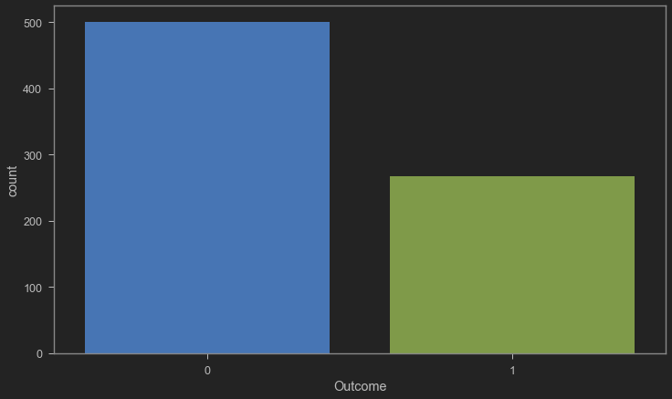
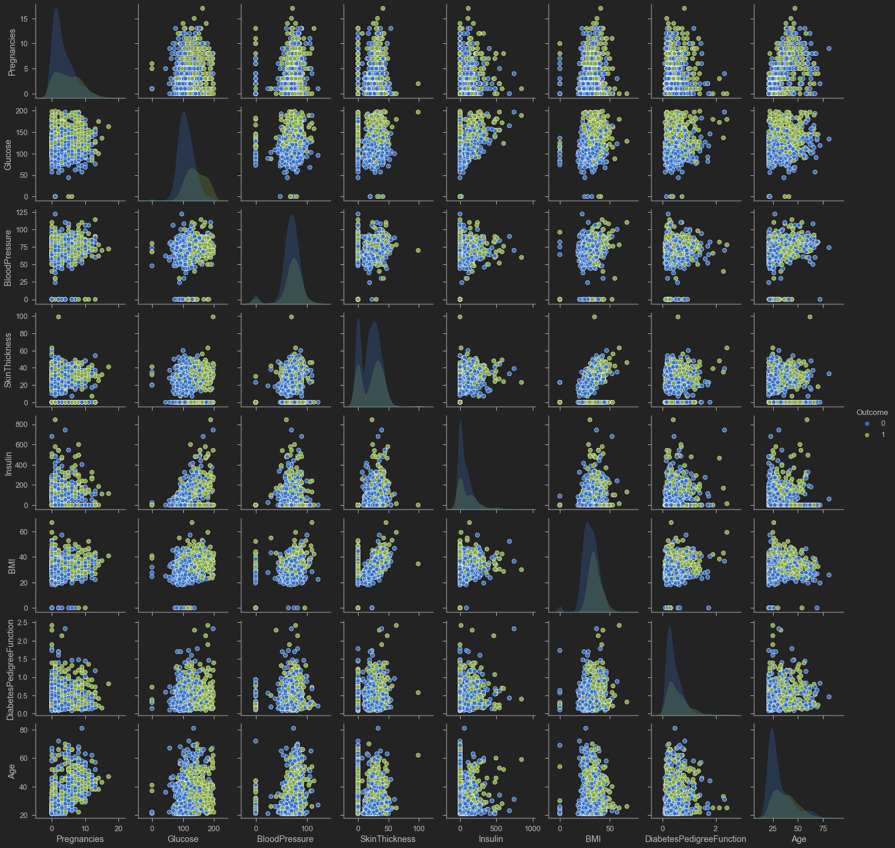
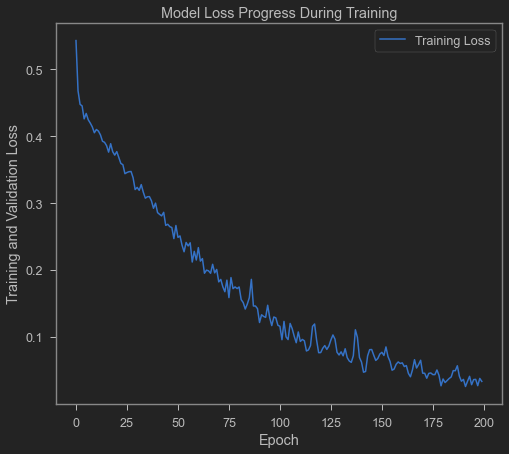
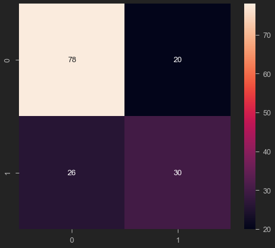
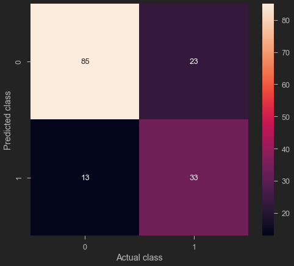

Artificial neural networks, usually simply called neural networks, are computing systems inspired by the biological neural networks that constitute animal brains. 

An ANN is based on a collection of connected units or nodes called artificial neurons, which loosely model the neurons in a biological brain.


XGBoost is an open-source software library that implements optimized distributed gradient boosting machine learning algorithms under the Gradient Boosting framework.


XGBoost, which stands for Extreme Gradient Boosting, is a scalable, distributed gradient-boosted decision tree (GBDT) machine learning library. It provides parallel tree boosting and is the leading machine learning library for regression, classification, and ranking problems.

It’s vital to an understanding of XGBoost to first grasp the machine learning concepts and algorithms that XGBoost builds upon: supervised machine learning, decision trees, ensemble learning, and gradient boosting.

Supervised machine learning uses algorithms to train a model to find patterns in a dataset with labels and features and then uses the trained model to predict the labels on a new dataset’s features.

## Introduction

We will build a neural network model using Keras. So the first model that we're going to use here to train our classifier to detect diabetes. We are going to use artificial neural networks and artificial neural networks. These are information processing models that essentially mimic the human brain and try to map the inputs to the outputs. 

This dataset is used to predict whether or not a patient has diabetes, based on given features/diagnostic measurements. 

Only female patients are considered with at least 21 years old of Pima Indian heritage. 

Inputs: 
* Pregnancies: Number of times pregnant 
* GlucosePlasma: glucose concentration a 2 hours in an oral glucose tolerance test 
* BloodPressure: Diastolic blood pressure (mm Hg)  
* Skin: ThicknessTriceps skin fold thickness (mm) 
* Insulin: 2-Hour serum insulin (mu Wm!) 
* BMI: Body mass index (weight in kg/(height in m)^2) 
* DiabetesPedigreeFunction: Diabetes pedigree function 
* Age: Age (years) 
* Outputs: Diabetes or no diabetes (0 or 1) 


Basically I'm going to build think of it as a mini artificial brain that can consume or use all these different features that we have in the input in X train and it's going to learn all the different features within that data and map it to the output, which is going to be my white train.

Let us first load our libraries and analyze the input data.


```python
import tensorflow as tf
import pandas as pd
import numpy as np
import seaborn as sns
import matplotlib.pyplot as plt
```


```python
# You have to include the full link to the csv file containing your dataset
diabetes = pd.read_csv('diabetes.csv')
```


```python
diabetes
```

<table border="1" class="dataframe">
  <thead>
    <tr style="text-align: right;">
      <th></th>
      <th>Pregnancies</th>
      <th>Glucose</th>
      <th>BloodPressure</th>
      <th>SkinThickness</th>
      <th>Insulin</th>
      <th>BMI</th>
      <th>DiabetesPedigreeFunction</th>
      <th>Age</th>
      <th>Outcome</th>
    </tr>
  </thead>
  <tbody>
    <tr>
      <th>0</th>
      <td>6</td>
      <td>148</td>
      <td>72</td>
      <td>35</td>
      <td>0</td>
      <td>33.6</td>
      <td>0.627</td>
      <td>50</td>
      <td>1</td>
    </tr>
    <tr>
      <th>1</th>
      <td>1</td>
      <td>85</td>
      <td>66</td>
      <td>29</td>
      <td>0</td>
      <td>26.6</td>
      <td>0.351</td>
      <td>31</td>
      <td>0</td>
    </tr>
    <tr>
      <th>2</th>
      <td>8</td>
      <td>183</td>
      <td>64</td>
      <td>0</td>
      <td>0</td>
      <td>23.3</td>
      <td>0.672</td>
      <td>32</td>
      <td>1</td>
    </tr>
    <tr>
      <th>3</th>
      <td>1</td>
      <td>89</td>
      <td>66</td>
      <td>23</td>
      <td>94</td>
      <td>28.1</td>
      <td>0.167</td>
      <td>21</td>
      <td>0</td>
    </tr>
    <tr>
      <th>4</th>
      <td>0</td>
      <td>137</td>
      <td>40</td>
      <td>35</td>
      <td>168</td>
      <td>43.1</td>
      <td>2.288</td>
      <td>33</td>
      <td>1</td>
    </tr>
    <tr>
      <th>...</th>
      <td>...</td>
      <td>...</td>
      <td>...</td>
      <td>...</td>
      <td>...</td>
      <td>...</td>
      <td>...</td>
      <td>...</td>
      <td>...</td>
    </tr>
    <tr>
      <th>763</th>
      <td>10</td>
      <td>101</td>
      <td>76</td>
      <td>48</td>
      <td>180</td>
      <td>32.9</td>
      <td>0.171</td>
      <td>63</td>
      <td>0</td>
    </tr>
    <tr>
      <th>764</th>
      <td>2</td>
      <td>122</td>
      <td>70</td>
      <td>27</td>
      <td>0</td>
      <td>36.8</td>
      <td>0.340</td>
      <td>27</td>
      <td>0</td>
    </tr>
    <tr>
      <th>765</th>
      <td>5</td>
      <td>121</td>
      <td>72</td>
      <td>23</td>
      <td>112</td>
      <td>26.2</td>
      <td>0.245</td>
      <td>30</td>
      <td>0</td>
    </tr>
    <tr>
      <th>766</th>
      <td>1</td>
      <td>126</td>
      <td>60</td>
      <td>0</td>
      <td>0</td>
      <td>30.1</td>
      <td>0.349</td>
      <td>47</td>
      <td>1</td>
    </tr>
    <tr>
      <th>767</th>
      <td>1</td>
      <td>93</td>
      <td>70</td>
      <td>31</td>
      <td>0</td>
      <td>30.4</td>
      <td>0.315</td>
      <td>23</td>
      <td>0</td>
    </tr>
  </tbody>
</table>
<p>768 rows × 9 columns</p>

```python
diabetes.head()
```

<table border="1" class="dataframe">
  <thead>
    <tr style="text-align: right;">
      <th></th>
      <th>Pregnancies</th>
      <th>Glucose</th>
      <th>BloodPressure</th>
      <th>SkinThickness</th>
      <th>Insulin</th>
      <th>BMI</th>
      <th>DiabetesPedigreeFunction</th>
      <th>Age</th>
      <th>Outcome</th>
    </tr>
  </thead>
  <tbody>
    <tr>
      <th>0</th>
      <td>6</td>
      <td>148</td>
      <td>72</td>
      <td>35</td>
      <td>0</td>
      <td>33.6</td>
      <td>0.627</td>
      <td>50</td>
      <td>1</td>
    </tr>
    <tr>
      <th>1</th>
      <td>1</td>
      <td>85</td>
      <td>66</td>
      <td>29</td>
      <td>0</td>
      <td>26.6</td>
      <td>0.351</td>
      <td>31</td>
      <td>0</td>
    </tr>
    <tr>
      <th>2</th>
      <td>8</td>
      <td>183</td>
      <td>64</td>
      <td>0</td>
      <td>0</td>
      <td>23.3</td>
      <td>0.672</td>
      <td>32</td>
      <td>1</td>
    </tr>
    <tr>
      <th>3</th>
      <td>1</td>
      <td>89</td>
      <td>66</td>
      <td>23</td>
      <td>94</td>
      <td>28.1</td>
      <td>0.167</td>
      <td>21</td>
      <td>0</td>
    </tr>
    <tr>
      <th>4</th>
      <td>0</td>
      <td>137</td>
      <td>40</td>
      <td>35</td>
      <td>168</td>
      <td>43.1</td>
      <td>2.288</td>
      <td>33</td>
      <td>1</td>
    </tr>
  </tbody>
</table>


```python
diabetes.tail()
```

<table border="1" class="dataframe">
  <thead>
    <tr style="text-align: right;">
      <th></th>
      <th>Pregnancies</th>
      <th>Glucose</th>
      <th>BloodPressure</th>
      <th>SkinThickness</th>
      <th>Insulin</th>
      <th>BMI</th>
      <th>DiabetesPedigreeFunction</th>
      <th>Age</th>
      <th>Outcome</th>
    </tr>
  </thead>
  <tbody>
    <tr>
      <th>763</th>
      <td>10</td>
      <td>101</td>
      <td>76</td>
      <td>48</td>
      <td>180</td>
      <td>32.9</td>
      <td>0.171</td>
      <td>63</td>
      <td>0</td>
    </tr>
    <tr>
      <th>764</th>
      <td>2</td>
      <td>122</td>
      <td>70</td>
      <td>27</td>
      <td>0</td>
      <td>36.8</td>
      <td>0.340</td>
      <td>27</td>
      <td>0</td>
    </tr>
    <tr>
      <th>765</th>
      <td>5</td>
      <td>121</td>
      <td>72</td>
      <td>23</td>
      <td>112</td>
      <td>26.2</td>
      <td>0.245</td>
      <td>30</td>
      <td>0</td>
    </tr>
    <tr>
      <th>766</th>
      <td>1</td>
      <td>126</td>
      <td>60</td>
      <td>0</td>
      <td>0</td>
      <td>30.1</td>
      <td>0.349</td>
      <td>47</td>
      <td>1</td>
    </tr>
    <tr>
      <th>767</th>
      <td>1</td>
      <td>93</td>
      <td>70</td>
      <td>31</td>
      <td>0</td>
      <td>30.4</td>
      <td>0.315</td>
      <td>23</td>
      <td>0</td>
    </tr>
  </tbody>
</table>


```python
diabetes.info()
```

    <class 'pandas.core.frame.DataFrame'>
    RangeIndex: 768 entries, 0 to 767
    Data columns (total 9 columns):
     #   Column                    Non-Null Count  Dtype  
    ---  ------                    --------------  -----  
     0   Pregnancies               768 non-null    int64  
     1   Glucose                   768 non-null    int64  
     2   BloodPressure             768 non-null    int64  
     3   SkinThickness             768 non-null    int64  
     4   Insulin                   768 non-null    int64  
     5   BMI                       768 non-null    float64
     6   DiabetesPedigreeFunction  768 non-null    float64
     7   Age                       768 non-null    int64  
     8   Outcome                   768 non-null    int64  
    dtypes: float64(2), int64(7)
    memory usage: 54.1 KB


```python
diabetes.describe()
```


<table border="1" class="dataframe">
  <thead>
    <tr style="text-align: right;">
      <th></th>
      <th>Pregnancies</th>
      <th>Glucose</th>
      <th>BloodPressure</th>
      <th>SkinThickness</th>
      <th>Insulin</th>
      <th>BMI</th>
      <th>DiabetesPedigreeFunction</th>
      <th>Age</th>
      <th>Outcome</th>
    </tr>
  </thead>
  <tbody>
    <tr>
      <th>count</th>
      <td>768.000000</td>
      <td>768.000000</td>
      <td>768.000000</td>
      <td>768.000000</td>
      <td>768.000000</td>
      <td>768.000000</td>
      <td>768.000000</td>
      <td>768.000000</td>
      <td>768.000000</td>
    </tr>
    <tr>
      <th>mean</th>
      <td>3.845052</td>
      <td>120.894531</td>
      <td>69.105469</td>
      <td>20.536458</td>
      <td>79.799479</td>
      <td>31.992578</td>
      <td>0.471876</td>
      <td>33.240885</td>
      <td>0.348958</td>
    </tr>
    <tr>
      <th>std</th>
      <td>3.369578</td>
      <td>31.972618</td>
      <td>19.355807</td>
      <td>15.952218</td>
      <td>115.244002</td>
      <td>7.884160</td>
      <td>0.331329</td>
      <td>11.760232</td>
      <td>0.476951</td>
    </tr>
    <tr>
      <th>min</th>
      <td>0.000000</td>
      <td>0.000000</td>
      <td>0.000000</td>
      <td>0.000000</td>
      <td>0.000000</td>
      <td>0.000000</td>
      <td>0.078000</td>
      <td>21.000000</td>
      <td>0.000000</td>
    </tr>
    <tr>
      <th>25%</th>
      <td>1.000000</td>
      <td>99.000000</td>
      <td>62.000000</td>
      <td>0.000000</td>
      <td>0.000000</td>
      <td>27.300000</td>
      <td>0.243750</td>
      <td>24.000000</td>
      <td>0.000000</td>
    </tr>
    <tr>
      <th>50%</th>
      <td>3.000000</td>
      <td>117.000000</td>
      <td>72.000000</td>
      <td>23.000000</td>
      <td>30.500000</td>
      <td>32.000000</td>
      <td>0.372500</td>
      <td>29.000000</td>
      <td>0.000000</td>
    </tr>
    <tr>
      <th>75%</th>
      <td>6.000000</td>
      <td>140.250000</td>
      <td>80.000000</td>
      <td>32.000000</td>
      <td>127.250000</td>
      <td>36.600000</td>
      <td>0.626250</td>
      <td>41.000000</td>
      <td>1.000000</td>
    </tr>
    <tr>
      <th>max</th>
      <td>17.000000</td>
      <td>199.000000</td>
      <td>122.000000</td>
      <td>99.000000</td>
      <td>846.000000</td>
      <td>67.100000</td>
      <td>2.420000</td>
      <td>81.000000</td>
      <td>1.000000</td>
    </tr>
  </tbody>
</table>


# PERFORM DATA VISUALIZATION


```python
plt.figure(figsize = (12, 7))
sns.countplot(x = 'Outcome', data = diabetes)
```


    <AxesSubplot:xlabel='Outcome', ylabel='count'>



​  

```python
sns.pairplot(diabetes, hue = 'Outcome', vars = ['Pregnancies', 'Glucose', 'BloodPressure', 'SkinThickness', 'Insulin', 'BMI', 'DiabetesPedigreeFunction', 'Age'])
```


    <seaborn.axisgrid.PairGrid at 0x1abf1ceddc0>



​    


# SPLIT THE DATA AND PREPARE IT FOR TRAINING


```python
X = diabetes.iloc[:, 0:8].values
```


```python
X
```


    array([[  6.   , 148.   ,  72.   , ...,  33.6  ,   0.627,  50.   ],
           [  1.   ,  85.   ,  66.   , ...,  26.6  ,   0.351,  31.   ],
           [  8.   , 183.   ,  64.   , ...,  23.3  ,   0.672,  32.   ],
           ...,
           [  5.   , 121.   ,  72.   , ...,  26.2  ,   0.245,  30.   ],
           [  1.   , 126.   ,  60.   , ...,  30.1  ,   0.349,  47.   ],
           [  1.   ,  93.   ,  70.   , ...,  30.4  ,   0.315,  23.   ]])


```python
y = diabetes.iloc[:, 8].values
```


```python
# Feature Scaling is a must in ANN
from sklearn.preprocessing import StandardScaler
sc = StandardScaler()
X = sc.fit_transform(X)
```


```python
X
```


    array([[ 0.63994726,  0.84832379,  0.14964075, ...,  0.20401277,
             0.46849198,  1.4259954 ],
           [-0.84488505, -1.12339636, -0.16054575, ..., -0.68442195,
            -0.36506078, -0.19067191],
           [ 1.23388019,  1.94372388, -0.26394125, ..., -1.10325546,
             0.60439732, -0.10558415],
           ...,
           [ 0.3429808 ,  0.00330087,  0.14964075, ..., -0.73518964,
            -0.68519336, -0.27575966],
           [-0.84488505,  0.1597866 , -0.47073225, ..., -0.24020459,
            -0.37110101,  1.17073215],
           [-0.84488505, -0.8730192 ,  0.04624525, ..., -0.20212881,
            -0.47378505, -0.87137393]])


```python
# Splitting the dataset into the Training set and Test set
from sklearn.model_selection import train_test_split
X_train, X_test, y_train, y_test = train_test_split(X, y, test_size = 0.2)
```


```python
X_train.shape
```


    (614, 8)


```python
X_test.shape
```


    (154, 8)

We have been able to change the split between training and testing and we allocated 20% for testing and the remaining which is 80% have been allocated for training. And before that we also have been able to prepare our data.

# BUILD A NEURAL NETWORK MODEL USING KERAS

 Tensorflow as google's framework to build train test and deploy AI and ml models at scale and keras is simply a high level api that could be used to kind of make our life extremely easy.

So instead of building all the math and writing all the equations for example, that describe artificial neural
networks, I'm just gonna use Keras which is high level API.

Let  use sequential mode to build our artificial neural network model object or instance. 

To this object we add a layers dense with 400 neurons. Due to the the non linearity  of the network. We specify the activation function to be a ReLu activation function and ReLu stands for rectified linear units. 

  We need to specify the shape here and the shape is eight because  we have eight inputs in the model. Next we add what we call it, a dropout layer after you add this layer here which contains 400 neurons.

Finally we  add another layer with dropout, the dropout  make sure that the network is able to generalize and not memorize ,  it is a regularization technique. 

We drop a couple of neurons along with their connected weight, we make sure that the neurons do not develop any dependency. 

When we add a dense layer is commonly  followed by dropout. We add another dense layer followed by another dropout. The next dense layer will to contain 400 neurons with again, activation function ReLu. 

And then add the dropout afterwards. And then finally the output include an activation function of sigmoid and the units here is only one neuron. And the reason is is because the output is going to simply going to be a binary values either zero or one.


```python
# !pip install tensorflow
import tensorflow as tf 
ANN_model = tf.keras.models.Sequential()
ANN_model.add(tf.keras.layers.Dense(units=400, activation='relu', input_shape=(8, )))
ANN_model.add(tf.keras.layers.Dropout(0.2))
ANN_model.add(tf.keras.layers.Dense(units=400, activation='relu'))
ANN_model.add(tf.keras.layers.Dropout(0.2))
ANN_model.add(tf.keras.layers.Dense(units=1, activation='sigmoid'))
```


```python
ANN_model.summary()
```

    Model: "sequential"
    _________________________________________________________________
    Layer (type)                 Output Shape              Param #   
    =================================================================
    dense (Dense)                (None, 400)               3600      
    _________________________________________________________________
    dropout (Dropout)            (None, 400)               0         
    _________________________________________________________________
    dense_1 (Dense)              (None, 400)               160400    
    _________________________________________________________________
    dropout_1 (Dropout)          (None, 400)               0         
    _________________________________________________________________
    dense_2 (Dense)              (None, 1)                 401       
    =================================================================
    Total params: 164,401
    Trainable params: 164,401
    Non-trainable params: 0
    _________________________________________________________________

To summarize the network have 164 trainable parameters. It is a optimization problem  where we are trying to connect all these neurons have weights or connections between all these neurons

There are 164 weights or connections than trying to optimize. Which we try to find the best values that could map the inputs to the outputs.


# COMPILE AND TRAIN THE ANN MODEL


```python
ANN_model.compile(optimizer='Adam', loss='binary_crossentropy', metrics = ['accuracy'])
```


```python
epochs_hist = ANN_model.fit(X_train, y_train, epochs = 200)
```

    Epoch 1/200
    20/20 [==============================] - 2s 6ms/step - loss: 0.5430 - accuracy: 0.7427
    Epoch 2/200
    .
    .
    .
    Epoch 200/200
    20/20 [==============================] - 0s 5ms/step - loss: 0.0335 - accuracy: 0.9951

```python
y_pred = ANN_model.predict(X_test)
```


```python
#y_pred
```


```python
y_pred = (y_pred > 0.5)
```


```python
#y_pred
```

# EVALUATE TRAINED MODEL PERFORMANCE 


```python
epochs_hist.history.keys()
```


    dict_keys(['loss', 'accuracy'])


```python
plt.plot(epochs_hist.history['loss'])
plt.title('Model Loss Progress During Training')
plt.xlabel('Epoch')
plt.ylabel('Training and Validation Loss')
plt.legend(['Training Loss'])
```


    <matplotlib.legend.Legend at 0x1abf102b700>



    

```python
# Training set Performance
from sklearn.metrics import confusion_matrix
# Testing Set Performance
cm = confusion_matrix(y_test, y_pred)
sns.heatmap(cm, annot=True)

```


    <AxesSubplot:>



    

```python
from sklearn.metrics import classification_report

print(classification_report(y_test, y_pred))
```

                  precision    recall  f1-score   support
    
               0       0.75      0.80      0.77        98
               1       0.60      0.54      0.57        56
    
        accuracy                           0.70       154
       macro avg       0.68      0.67      0.67       154
    weighted avg       0.70      0.70      0.70       154


# TRAIN AND EVALUATE AN XG-BOOST ALGORITHM


```python
#!pip install xgboost
```


```python
# Train an XGBoost classifier model 
import xgboost as xgb
XGB_model = xgb.XGBClassifier(learning_rate = 0.1, max_depth = 5, n_estimators = 10)
XGB_model.fit(X_train, y_train)
```


```python
result_train = XGB_model.score(X_train, y_train)
print("Accuracy : {}".format(result_train))
```

    Accuracy : 0.8729641693811075

```python
# predict the score of the trained model using the testing dataset

result_test = XGB_model.score(X_test, y_test)
print("Accuracy : {}".format(result_test))
```

    Accuracy : 0.7662337662337663

```python
# make predictions on the test data
y_predict = XGB_model.predict(X_test)

```


```python
from sklearn.metrics import confusion_matrix, classification_report
print(classification_report(y_test, y_predict))
```

                  precision    recall  f1-score   support
    
               0       0.79      0.87      0.83        98
               1       0.72      0.59      0.65        56
    
        accuracy                           0.77       154
       macro avg       0.75      0.73      0.74       154
    weighted avg       0.76      0.77      0.76       154


```python
cm = confusion_matrix(y_predict, y_test) 
sns.heatmap(cm, annot = True)
plt.ylabel('Predicted class')
plt.xlabel('Actual class')
```


    Text(0.5, 34.0, 'Actual class')



You can download this notebook [here](https://github.com/ruslanmv/Neural-Networks-Simple-Classification-using-XG-Boost/blob/master/Neural%20Networks%20with%20XGBoost%20and%20ANNs.ipynb).

**Congratulations!** We have discussed and created a Neural Network with Keras and XGBoost to detect diabetes.

