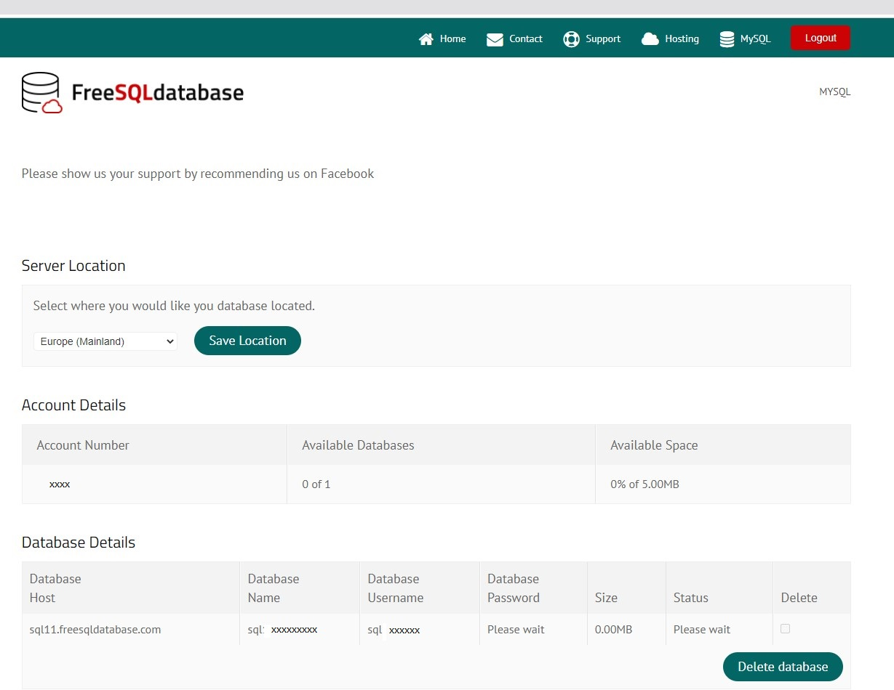

Hello everyone, today I will discuss how to create, and read  a MySQL table by using Jupyter Notebook. I will create a test remote database and setup our environment in Jupyter Notebook.


### Installation of Conda

First you need to install anaconda at this [link](https://www.anaconda.com/products/individual) 


After you have installed Anaconda go to your terminal and let us create an environment called **mysql**, but you can put the name that you like.

```
conda create -n mysql python==3.7
```

If you are running anaconda for first time, you should init conda with the shell that you want to work, in this case I choose the cmd.exe

```
conda init cmd.exe
```

and then close and open the terminal

```
conda activate mysql
```

then in your terminal type the following commands:

```
conda install ipykernel
```

```
python -m ipykernel install --user --name mysql --display-name "Python (mysql)"
```

Then we install **mysql-connector**

```
pip3 install mysql-connector
```

```
pip3 install sqlalchemy
```

```
pip3 install pandas
```

In addition if you want to install you local client

```
conda install -c conda-forge mysqlclient
```

## Creation of testing Free Database.

The first step that we need is the creation of a remote Database, if you have already a Remote **MySQL database,** you can skip this part. Otherwise you can choose one  DB free testing provider.

- [**Free MySQL Hosting**](http://www.freesqldatabase.com/)  5mb
- [**FreeSQLdatabase**](http://www.freesqldatabase.com/)       5mb
- [**Free MySQL Hosting**](http://www.freesqldatabase.com/)  5mb

As I mentioned earlier, best use of these free online MySQL websites would be for testing purposes, or even learning purposes. For this tutorial I have chosen the first one.

It’s pretty easy to use this free [MySQL database](http://www.freesqldatabase.com/) hosting service. Simply register on it via your email and after verification, you will able to see the Control panel. After that, create a database there and it will send you all the database and server credentials via email. You can then create database either using the PhpMyAdmin or you can use a desktop client to do the same.





After creating your database on its server, you can open **Jupyter notebook** and lets try to can create tables, schemas, etc., 

## How to connect MySQL database in Python

Let’s see how to connect the MySQL database in Python using the ‘MySQL Connector Python’ module.

### Arguments required to connect

You need to know the following detail of the MySQL server to perform the connection from Python.

| Argument      | Description                                                  |
| :------------ | :----------------------------------------------------------- |
| Username      | The username that you use to work with MySQL Server. The default username for the MySQL database is a **root**. |
| Password      | Password is given by the user at the time of installing the MySQL server. If you are using root then you won’t need the password. |
| Host name     | The server name or Ip address on which MySQL is running. if you are running on localhost, then you can use **localhost** or its IP `127.0.0.0` |
| Database name | The name of the database to which you want to connect and perform the operations. |

The CREATE TABLE statement is used to create tables in MYSQL database. Here, you need to specify the name of the table and, definition (name and datatype) of each column.

### Syntax

Following is the syntax to create a table in MySQL −

```
CREATE TABLE table_name(
   column1 datatype,
   column2 datatype,
   column3 datatype,
   .....
   columnN datatype,
);
```

### Example

Following query creates a table named EMPLOYEE in MySQL with five columns namely, FIRST_NAME, LAST_NAME, AGE, SEX and, INCOME.

```sql
mysql> CREATE TABLE EMPLOYEE(
   FIRST_NAME CHAR(20) NOT NULL,
   LAST_NAME CHAR(20),
   AGE INT,
   SEX CHAR(1),
   INCOME FLOAT
);
Query OK, 0 rows affected (0.42 sec)
```

The DESC statement gives you the description of the specified table. Using this you can verify if the table has been created or not as shown below −

```
mysql> Desc Employee;
+------------+----------+------+-----+---------+-------+
| Field | Type | Null | Key | Default | Extra |
+------------+----------+------+-----+---------+-------+
| FIRST_NAME | char(20) | NO | | NULL | |
| LAST_NAME | char(20) | YES | | NULL | |
| AGE | int(11) | YES | | NULL | |
| SEX | char(1) | YES | | NULL | |
| INCOME | float | YES | | NULL | |
+------------+----------+------+-----+---------+-------+
5 rows in set (0.07 sec)
```

# How to connect to Mysql using python and import the csv file into mysql  from Jupyter Notebook

In ordering to keep safe our credentials we save our credentials in a file **credentials.json**

Once you have received your credentials in your email you can create the following credentials.json file:

```
{
  "host":"sql11.freesqldatabase.com",
  "database":"xxxxxx",
  "user":"xxxxxxx",
  "password":"xxxxxx"

}
```

Then go to your Jupyter Notebook and open it.

```
conda activate mysql
jupyter notebook .
```

and create a new notebook, then we can type:


```python
# Python program to read
# json file
import json
# Opening JSON file
f = open('credentials.json')
```


```python
# returns JSON object as
# a dictionary
data = json.load(f)
```


```python
# You can uncommnet to see if you put correct credentials
#for i in data:
#    print(data[i])
```


```python
#You can identify the database you have created
data['host']
```


    'sql11.freesqldatabase.com'


```python
import mysql.connector
```


```python
import mysql.connector
from mysql.connector import Error
```

# Checking our Mysql connection


```python
connection = mysql.connector.connect(host=data['host'],
                                         database=data['database'],
                                         user=data['user'],
                                         password=data['password'])
```


```python
try:
    connection = mysql.connector.connect(host=data['host'],
                                             database=data['database'],
                                             user=data['user'],
                                             password=data['password'])
    if connection.is_connected():
        db_Info = connection.get_server_info()
        print("Connected to MySQL Server version ", db_Info)
        cursor = connection.cursor()
        cursor.execute("select database();")
        record = cursor.fetchone()
        print("You're connected to database: ", record)

except Error as e:
    print("Error while connecting to MySQL", e)
finally:
    if connection.is_connected():
        cursor.close()
        connection.close()
        print("MySQL connection is closed")
```

    Connected to MySQL Server version  5.5.62-0ubuntu0.14.04.1
    You're connected to database:  ('sql14543562',)
    MySQL connection is closed

Once a database connection is established, you can create tables by passing the CREATE TABLE query to the **execute()** method.

# Create MySQL table from Python 

Now you know how to connect to a MySQL server from Python, In this section, we will learn how to create a table in MySQL from Python. Let’s create table ‘Laptop’ under your remote database.


```python
import mysql.connector

try:
    connection = mysql.connector.connect(host=data['host'],
                                             database=data['database'],
                                             user=data['user'],
                                             password=data['password'])

    mySql_Create_Table_Query = """CREATE TABLE Laptop ( 
                             Id int(11) NOT NULL,
                             Name varchar(250) NOT NULL,
                             Price float NOT NULL,
                             Purchase_date Date NOT NULL,
                             PRIMARY KEY (Id)) """

    cursor = connection.cursor()
    result = cursor.execute(mySql_Create_Table_Query)
    print("Laptop Table created successfully ")

except mysql.connector.Error as error:
    print("Failed to create table in MySQL: {}".format(error))
finally:
    if connection.is_connected():
        cursor.close()
        connection.close()
        print("MySQL connection is closed")

```

    Failed to create table in MySQL: 1050 (42S01): Table 'Laptop' already exists
    MySQL connection is closed


# Create MySQL table with Pandas


```python
import pandas as pd
```

## Create an in-memory SQLite database.


```python
from sqlalchemy import create_engine
engine = create_engine('sqlite://', echo=False)
```


```python
df = pd.DataFrame({'name' : ['User 1', 'User 2', 'User 3']})
df
```

<table border="1" class="dataframe">
  <thead>
    <tr style="text-align: left;">
      <th></th>
      <th>name</th>
    </tr>
  </thead>
  <tbody>
    <tr>
      <th>0</th>
      <td>User 1</td>
    </tr>
    <tr>
      <th>1</th>
      <td>User 2</td>
    </tr>
    <tr>
      <th>2</th>
      <td>User 3</td>
    </tr>
  </tbody>
</table>


```python
df.to_sql('users', con=engine)
```

An sqlalchemy.engine.Connection can also be passed to con:


```python
with engine.begin() as connection:
    df1 = pd.DataFrame({'name' : ['User 4', 'User 5']})
    df1.to_sql('users', con=connection, if_exists='append')
```

This is allowed to support operations that require that the same DBAPI connection is used for the entire operation.


```python
df2 = pd.DataFrame({'name' : ['User 6', 'User 7']})
df2.to_sql('users', con=engine, if_exists='append')
```


```python
engine.execute("SELECT * FROM users").fetchall()
```


    [(0, 'User 1'),
     (1, 'User 2'),
     (2, 'User 3'),
     (0, 'User 4'),
     (1, 'User 5'),
     (0, 'User 6'),
     (1, 'User 7')]

In short, to create a table using python ;

- Import ***mysql.connector\*** package.
- Create a connection object using the ***mysql.connector.connect()\*** method, by passing the user name, password, host (optional default: localhost) and, database (optional) as parameters to it.
- Create a cursor object by invoking the ***cursor()\*** method on the connection object created above.
- Then, execute the *CREATE TABLE* statement by passing it as a parameter to the **execute()** method.


# Create an MySQL database with Pandas in real Database

## First method with mysql.connector 

### Step 1: Prepare the CSV File

To begin, prepare the CSV file that you'd like to import to MySQL. For example, I prepared a simple CSV file with the following data:


```python
df=pd.read_csv('gpu.csv')  
```


```python
df.head()
```

<table border="1" class="dataframe">
  <thead>
    <tr style="text-align: right;">
      <th></th>
      <th>Product Name</th>
      <th>GPU Chip</th>
      <th>Released</th>
      <th>Bus</th>
      <th>Memory</th>
      <th>GPU clock</th>
      <th>Memory clock</th>
    </tr>
  </thead>
  <tbody>
    <tr>
      <th>0</th>
      <td>GeForce RTX 3060</td>
      <td>GA106</td>
      <td>Jan 12th, 2021</td>
      <td>PCIe 4.0 x16</td>
      <td>12 GB, GDDR6, 192 bit</td>
      <td>1320 MHz</td>
      <td>1875 MHz</td>
    </tr>
    <tr>
      <th>1</th>
      <td>GeForce RTX 3060 Ti</td>
      <td>GA104</td>
      <td>Dec 1st, 2020</td>
      <td>PCIe 4.0 x16</td>
      <td>8 GB, GDDR6, 256 bit</td>
      <td>1410 MHz</td>
      <td>1750 MHz</td>
    </tr>
    <tr>
      <th>2</th>
      <td>GeForce RTX 3070</td>
      <td>GA104</td>
      <td>Sep 1st, 2020</td>
      <td>PCIe 4.0 x16</td>
      <td>8 GB, GDDR6, 256 bit</td>
      <td>1500 MHz</td>
      <td>1750 MHz</td>
    </tr>
    <tr>
      <th>3</th>
      <td>GeForce RTX 3080</td>
      <td>GA102</td>
      <td>Sep 1st, 2020</td>
      <td>PCIe 4.0 x16</td>
      <td>10 GB, GDDR6X, 320 bit</td>
      <td>1440 MHz</td>
      <td>1188 MHz</td>
    </tr>
    <tr>
      <th>4</th>
      <td>Radeon RX 6600 XT</td>
      <td>Navi 23</td>
      <td>Jul 30th, 2021</td>
      <td>PCIe 4.0 x8</td>
      <td>8 GB, GDDR6, 128 bit</td>
      <td>1968 MHz</td>
      <td>2000 MHz</td>
    </tr>
  </tbody>
</table>

You can download [here](https://github.com/ruslanmv/How-to-Run-SQL-from-Jupyter-Notebook/blob/master/gpu.csv)


```python
df.columns
```


    Index(['Product Name', 'GPU Chip', 'Released', 'Bus', 'Memory', 'GPU clock',
           'Memory clock'],
          dtype='object')


```python
import pandas
from pandas.io.json import build_table_schema
```


```python
build_table_schema(df)
```


    {'fields': [{'name': 'index', 'type': 'integer'},
      {'name': 'Product Name', 'type': 'string'},
      {'name': 'GPU Chip', 'type': 'string'},
      {'name': 'Released', 'type': 'string'},
      {'name': 'Bus', 'type': 'string'},
      {'name': 'Memory', 'type': 'string'},
      {'name': 'GPU clock', 'type': 'string'},
      {'name': 'Memory clock', 'type': 'string'}],
     'primaryKey': ['index'],
     'pandas_version': '0.20.0'}


```python
 data_set=df
```


```python
num_cols = len(data_set.axes[1])
```


```python
print(num_cols)
```

    7

```python
col_count = [len(l.split(",")) for l in data_set.columns]
```


```python
print(type(col_count)) 
```

    <class 'list'>

```python
 print(len(col_count))
```

    7


First, I establish the CREATE TABLE command and table name – ‘gpu_data’ – for this example, storing it in an ‘SQL_CREATE_TBL’ variable:


```python
SQL_CREATE_TBL = "CREATE TABLE gpu_data("
```


```python
for name in range(0, len(col_count)):
    column_name=data_set.columns[name].replace(' ', '_')
    SQL_CREATE_TBL += "{} TEXT, ".format(column_name)
```

Let’s view the ‘SQL_CREATE_TBL’ string variable contents once the for loop completes:


```python
SQL_CREATE_TBL 
```


    'CREATE TABLE gpu_data(Product_Name TEXT, GPU_Chip TEXT, Released TEXT, Bus TEXT, Memory TEXT, GPU_clock TEXT, Memory_clock TEXT, '


```python
SQL_CREATE_TBL = SQL_CREATE_TBL.rstrip(" ,")
```

All that’s left to complete the CREATE TABLE statement, is simply append the closing parenthesis and semicolon to the ‘SQL_CREATE_TBL’ variable:


```python
SQL_CREATE_TBL += ");"
```


```python
SQL_CREATE_TBL 
```


    'CREATE TABLE so_data(Product Name TEXT, GPU Chip TEXT, Released TEXT, Bus TEXT, Memory TEXT, GPU clock TEXT, Memory clock TEXT);'

The entire code structure for the dynamic CREATE TABLE statement is shown below:


```python
SQL_CREATE_TBL = "CREATE TABLE gpu_data("
for name in range(0, len(col_count)):
     column_name=data_set.columns[name].replace(' ', '_')
     SQL_CREATE_TBL += "{} TEXT, ".format(column_name)
SQL_CREATE_TBL = SQL_CREATE_TBL.rstrip(" ,")
SQL_CREATE_TBL += ");"
```


```python
SQL_CREATE_TBL
```


    'CREATE TABLE gpu_data(Product_Name TEXT, GPU_Chip TEXT, Released TEXT, Bus TEXT, Memory TEXT, GPU_clock TEXT, Memory_clock TEXT);'


```python
SQL_CREATE_TBL = "CREATE TABLE gpu_data("
for name in range(0, len(col_count)):
        column_name=data_set.columns[name].replace(' ', '_')
        SQL_CREATE_TBL += "{} varchar(255), ".format(column_name)
SQL_CREATE_TBL = SQL_CREATE_TBL.rstrip(" ,")
SQL_CREATE_TBL += ")"
```


```python
SQL_CREATE_TBL
```


    'CREATE TABLE gpu_data(Product_Name varchar(255), GPU_Chip varchar(255), Released varchar(255), Bus varchar(255), Memory varchar(255), GPU_clock varchar(255), Memory_clock varchar(255))'


## Step 2: Connect to the MySQL using Python and create a Database

Create a connection object to connect to MySQL, The connect() constructor creates a connection to the MySQL and returns a MySQLConnection object.


```python
connection = mysql.connector.connect(    host=data['host'],
                                         database=data['database'],
                                         user=data['user'],
                                         password=data['password'])
```

## Step 3: Create a table and Import the CSV data into the MySQL table

We will create an gpus table under the our  database and insert the records in MySQL with below python code.


```python
cursor.close()
connection.close()
```


```python
import mysql.connector as msql
from mysql.connector import Error
try:
    #conn = mysql.connect(host='localhost', database='employee', user='root', password='root@123')
    
    conn = mysql.connector.connect(host=data['host'],database=data['database'],user=data['user'],password=data['password'])
    if conn.is_connected():
        cursor = conn.cursor()
        cursor.execute("select database();")
        record = cursor.fetchone()
        print("You're connected to database: ", record)
        cursor.execute('DROP TABLE IF EXISTS gpu_data;')
        print('Creating table....')
# in the below line please pass the create table statement which you want #to create
        cursor.execute(SQL_CREATE_TBL)
        print("Table is created....")
        #loop through the data frame
        for i,row in df.iterrows():
            #here %S means string values 
            sql = "INSERT INTO "+data['database']+".gpu_data VALUES (%s,%s,%s,%s,%s,%s,%s)"
            cursor.execute(sql, tuple(row))
            print("Record inserted")
            # the connection is not auto committed by default, so we must commit to save our changes
            conn.commit()
except Error as e:
            print("Error while connecting to MySQL", e)
```

    You're connected to database:  ('sql11501562',)
    Creating table....
    Table is created....
    Record inserted
    Record inserted
    .
    .
    .
    
    Record inserted


## Step 4 : Query the Table

Query the table to make sure that our inserted data has been saved correctly.


```python
# Execute query
sql = "SELECT * FROM "+data['database']+".gpu_data"
#sql = "SELECT * FROM employee.employee_data"
```


```python
cursor.execute(sql)
```


```python
# Fetch all the records
result = cursor.fetchall()
for i in result:
    print(i)
```

    ('GeForce RTX 3060', 'GA106', 'Jan 12th, 2021', 'PCIe 4.0 x16', '12 GB, GDDR6, 192 bit', '1320 MHz', '1875 MHz')
    ('GeForce RTX 3060 Ti', 'GA104', 'Dec 1st, 2020', 'PCIe 4.0 x16', '8 GB, GDDR6, 256 bit', '1410 MHz', '1750 MHz')
    .
    .
    .
    
    ('GeForce GTX 980 Ti', 'GM200', 'Jun 2nd, 2015', 'PCIe 3.0 x16', '6 GB, GDDR5, 384 bit', '1000 MHz', '1753 MHz')
    ('GeForce GTX 1650 SUPER', 'TU116', 'Nov 22nd, 2019', 'PCIe 3.0 x16', '4 GB, GDDR6, 128 bit', '1530 MHz', '1500 MHz')
    ('Radeon RX 550', 'Lexa', 'Apr 20th, 2017', 'PCIe 3.0 x8', '2 GB, GDDR5, 128 bit', '1100 MHz', '1750 MHz')


# Using Pandas SQL Query Method


```python
import mysql.connector
```


```python
connection = mysql.connector.connect(host=data['host'],
                                         database=data['database'],
                                         user=data['user'],
                                         password=data['password'])
```

## Step 5: Run Pandas SQL Query method


```python
df_remote = pd.read_sql_query(sql, con = connection)
df_remote.head(3)
```

<table border="1" class="dataframe">
  <thead>
    <tr style="text-align: right;">
      <th></th>
      <th>Product_Name</th>
      <th>GPU_Chip</th>
      <th>Released</th>
      <th>Bus</th>
      <th>Memory</th>
      <th>GPU_clock</th>
      <th>Memory_clock</th>
    </tr>
  </thead>
  <tbody>
    <tr>
      <th>0</th>
      <td>GeForce RTX 3060</td>
      <td>GA106</td>
      <td>Jan 12th, 2021</td>
      <td>PCIe 4.0 x16</td>
      <td>12 GB, GDDR6, 192 bit</td>
      <td>1320 MHz</td>
      <td>1875 MHz</td>
    </tr>
    <tr>
      <th>1</th>
      <td>GeForce RTX 3060 Ti</td>
      <td>GA104</td>
      <td>Dec 1st, 2020</td>
      <td>PCIe 4.0 x16</td>
      <td>8 GB, GDDR6, 256 bit</td>
      <td>1410 MHz</td>
      <td>1750 MHz</td>
    </tr>
    <tr>
      <th>2</th>
      <td>GeForce RTX 3070</td>
      <td>GA104</td>
      <td>Sep 1st, 2020</td>
      <td>PCIe 4.0 x16</td>
      <td>8 GB, GDDR6, 256 bit</td>
      <td>1500 MHz</td>
      <td>1750 MHz</td>
    </tr>

  </tbody>
</table>


```python
cursor.close()
connection.close()
```

## Second method with sqlalchemy 


```python
df=pd.read_csv('gpu.csv')  
```


```python
import pandas as pd
from sqlalchemy import create_engine

```


```python
infile = 'gpu.csv'
db = data['database']
db_tbl_name = 'gpu_data2'
```


```python
'''
Load a csv file into a dataframe; if csv does not have headers, use the headers arg to create a list of headers; rename unnamed columns to conform to mysql column requirements
'''
def csv_to_df(infile, headers = []):
    if len(headers) == 0:
        df = pd.read_csv(infile)
   
    else:
        df = pd.read_csv(infile, header = None)
        df.columns = headers
 
    for r in range(10):
        try:
            df.rename( columns={'Unnamed: {0}'.format(r):'Unnamed{0}'.format(r)},    inplace=True )
            
        except:
            pass
    df.columns = df.columns.str.replace(' ', '_')
    return df

```


```python
'''
Create a mapping of df dtypes to mysql data types local
'''
def dtype_mapping_local():
    return {'object' : 'TEXT',
        'int64' : 'INT',
        'float64' : 'FLOAT',
        'datetime64' : 'DATETIME',
        'bool' : 'TINYINT',
        'category' : 'TEXT',
        'timedelta[ns]' : 'TEXT'}
```


```python
'''
Create a mapping of df dtypes to mysql data types remote (not perfect, but close enough)
'''
def dtype_mapping():
    return {'object' : 'VARCHAR(255)',
        'int64' : 'INT',
        'float64' : 'FLOAT',
        'datetime64' : 'DATETIME',
        'bool' : 'TINYINT',
        'category' : 'VARCHAR(255)',
        'timedelta[ns]' : 'VARCHAR(255)'}
```


```python
'''
Create a sqlalchemy engine local
'''
def mysql_engine_local(user = 'root', password = 'abc', host = '127.0.0.1', port = '3306', database = 'a001_db'):
    engine = create_engine("mysql://{0}:{1}@{2}:{3}/{4}?charset=utf8".format(user, password, host, port, database))
    return engine
```


```python
'''
Create a sqlalchemy engine remote
'''
def mysql_engine_remote(user = data['user'], 
                        password = data['password'], 
                        host = data['host'], 
                        port = '3306', 
                        database = data['database']):
    engine = create_engine("mysql://{0}:{1}@{2}:{3}/{4}?charset=utf8".format(user, password, host, port, database))
    return engine
```


```python
'''
Create a mysql connection from sqlalchemy engine
'''
def mysql_conn(engine):
    conn = engine.raw_connection()
    return conn
```


```python
'''
Create sql input for table names and types
'''
def gen_tbl_cols_sql(df):
    dmap = dtype_mapping()
    sql = "pi_db_uid INT AUTO_INCREMENT PRIMARY KEY"
    df1 = df.rename(columns = {"" : "nocolname"})
    hdrs = df1.dtypes.index
    hdrs_list = [(hdr, str(df1[hdr].dtype)) for hdr in hdrs]
    for hl in hdrs_list:
        sql += " ,{0} {1}".format(hl[0], dmap[hl[1]])
    return sql
```


```python
'''
Create a mysql table from a df
'''
def create_mysql_tbl_schema(df, conn, db, tbl_name):
    tbl_cols_sql = gen_tbl_cols_sql(df)
    sql = "USE {0}; CREATE TABLE {1} ({2})".format(db, tbl_name, tbl_cols_sql)
    cur = conn.cursor()
    cur.execute(sql)
    cur.close()
    conn.commit()
```


```python
'''
Write df data to newly create mysql table
'''
def df_to_mysql(df, engine, tbl_name):
    df.to_sql(tbl_name, engine, if_exists='replace')
```


```python
df = csv_to_df(infile)
df.head()
```

<table border="1" class="dataframe">
  <thead>
    <tr style="text-align: right;">
      <th></th>
      <th>Product_Name</th>
      <th>GPU_Chip</th>
      <th>Released</th>
      <th>Bus</th>
      <th>Memory</th>
      <th>GPU_clock</th>
      <th>Memory_clock</th>
    </tr>
  </thead>
  <tbody>
    <tr>
      <th>0</th>
      <td>GeForce RTX 3060</td>
      <td>GA106</td>
      <td>Jan 12th, 2021</td>
      <td>PCIe 4.0 x16</td>
      <td>12 GB, GDDR6, 192 bit</td>
      <td>1320 MHz</td>
      <td>1875 MHz</td>
    </tr>
    <tr>
      <th>1</th>
      <td>GeForce RTX 3060 Ti</td>
      <td>GA104</td>
      <td>Dec 1st, 2020</td>
      <td>PCIe 4.0 x16</td>
      <td>8 GB, GDDR6, 256 bit</td>
      <td>1410 MHz</td>
      <td>1750 MHz</td>
    </tr>
    <tr>
      <th>2</th>
      <td>GeForce RTX 3070</td>
      <td>GA104</td>
      <td>Sep 1st, 2020</td>
      <td>PCIe 4.0 x16</td>
      <td>8 GB, GDDR6, 256 bit</td>
      <td>1500 MHz</td>
      <td>1750 MHz</td>
    </tr>
    <tr>
      <th>3</th>
      <td>GeForce RTX 3080</td>
      <td>GA102</td>
      <td>Sep 1st, 2020</td>
      <td>PCIe 4.0 x16</td>
      <td>10 GB, GDDR6X, 320 bit</td>
      <td>1440 MHz</td>
      <td>1188 MHz</td>
    </tr>
    <tr>
      <th>4</th>
      <td>Radeon RX 6600 XT</td>
      <td>Navi 23</td>
      <td>Jul 30th, 2021</td>
      <td>PCIe 4.0 x8</td>
      <td>8 GB, GDDR6, 128 bit</td>
      <td>1968 MHz</td>
      <td>2000 MHz</td>
    </tr>
  </tbody>
</table>


```python
create_mysql_tbl_schema(df, mysql_conn(mysql_engine_remote()), db, db_tbl_name)
```


```python
df_to_mysql(df, mysql_engine_remote(), db_tbl_name)
```


```python
connection = mysql.connector.connect(    host=data['host'],
                                         database=data['database'],
                                         user=data['user'],
                                         password=data['password'])
```


```python
# Execute query
sql = "SELECT * FROM "+data['database']+".gpu_data2"
```


```python
df_remote_2 = pd.read_sql_query(sql, con = connection)
df_remote_2.head(10)
```

<table border="1" class="dataframe">
  <thead>
    <tr style="text-align: right;">
      <th></th>
      <th>index</th>
      <th>Product_Name</th>
      <th>GPU_Chip</th>
      <th>Released</th>
      <th>Bus</th>
      <th>Memory</th>
      <th>GPU_clock</th>
      <th>Memory_clock</th>
    </tr>
  </thead>
  <tbody>
    <tr>
      <th>0</th>
      <td>0</td>
      <td>GeForce RTX 3060</td>
      <td>GA106</td>
      <td>Jan 12th, 2021</td>
      <td>PCIe 4.0 x16</td>
      <td>12 GB, GDDR6, 192 bit</td>
      <td>1320 MHz</td>
      <td>1875 MHz</td>
    </tr>
    <tr>
      <th>1</th>
      <td>1</td>
      <td>GeForce RTX 3060 Ti</td>
      <td>GA104</td>
      <td>Dec 1st, 2020</td>
      <td>PCIe 4.0 x16</td>
      <td>8 GB, GDDR6, 256 bit</td>
      <td>1410 MHz</td>
      <td>1750 MHz</td>
    </tr>
    <tr>
      <th>2</th>
      <td>2</td>
      <td>GeForce RTX 3070</td>
      <td>GA104</td>
      <td>Sep 1st, 2020</td>
      <td>PCIe 4.0 x16</td>
      <td>8 GB, GDDR6, 256 bit</td>
      <td>1500 MHz</td>
      <td>1750 MHz</td>
    </tr>
    <tr>
      <th>3</th>
      <td>3</td>
      <td>GeForce RTX 3080</td>
      <td>GA102</td>
      <td>Sep 1st, 2020</td>
      <td>PCIe 4.0 x16</td>
      <td>10 GB, GDDR6X, 320 bit</td>
      <td>1440 MHz</td>
      <td>1188 MHz</td>
    </tr>
    <tr>
      <th>4</th>
      <td>4</td>
      <td>Radeon RX 6600 XT</td>
      <td>Navi 23</td>
      <td>Jul 30th, 2021</td>
      <td>PCIe 4.0 x8</td>
      <td>8 GB, GDDR6, 128 bit</td>
      <td>1968 MHz</td>
      <td>2000 MHz</td>
    </tr>
    <tr>
      <th>5</th>
      <td>5</td>
      <td>GeForce RTX 2060</td>
      <td>TU106</td>
      <td>Jan 7th, 2019</td>
      <td>PCIe 3.0 x16</td>
      <td>6 GB, GDDR6, 192 bit</td>
      <td>1365 MHz</td>
      <td>1750 MHz</td>
    </tr>
    <tr>
      <th>6</th>
      <td>6</td>
      <td>Radeon RX 6600</td>
      <td>Navi 23</td>
      <td>Oct 13th, 2021</td>
      <td>PCIe 4.0 x8</td>
      <td>8 GB, GDDR6, 128 bit</td>
      <td>1626 MHz</td>
      <td>1750 MHz</td>
    </tr>
    <tr>
      <th>7</th>
      <td>7</td>
      <td>GeForce RTX 3050 8 GB</td>
      <td>GA106</td>
      <td>Jan 4th, 2022</td>
      <td>PCIe 4.0 x8</td>
      <td>8 GB, GDDR6, 128 bit</td>
      <td>1552 MHz</td>
      <td>1750 MHz</td>
    </tr>
    <tr>
      <th>8</th>
      <td>8</td>
      <td>GeForce RTX 3090 Ti</td>
      <td>GA102</td>
      <td>Jan 27th, 2022</td>
      <td>PCIe 4.0 x16</td>
      <td>24 GB, GDDR6X, 384 bit</td>
      <td>1560 MHz</td>
      <td>1313 MHz</td>
    </tr>
    <tr>
      <th>9</th>
      <td>9</td>
      <td>GeForce RTX 3070 Ti</td>
      <td>GA104</td>
      <td>May 31st, 2021</td>
      <td>PCIe 4.0 x16</td>
      <td>8 GB, GDDR6X, 256 bit</td>
      <td>1575 MHz</td>
      <td>1188 MHz</td>
    </tr>
  </tbody>
</table>

```python
connection.close()
```


```python
# Closing json file
f.close()
```

You can download this notebook [here](https://github.com/ruslanmv/How-to-Run-SQL-from-Jupyter-Notebook/blob/master/How-to-Run-SQL-from-Jupyter-Notebook.ipynb).

**Congratulations!**   You have learned how to create a MySQL table from a csv file with Jupyter Notebook .