Hello everyone, today I will explain how to to connect to **SageMaker Notebook** via **SSH** and execute a **WebApp** from your Laptop.

In this blog post we are going to create a bastion box and optionally you can also Opening a SSH Tunnel to run Flask.


SageMaker enables developers to create, train, and deploy machine-learning models in the cloud. SageMaker also enables developers to deploy ML models on embedded systems and edge-devices.

## Introduction

Amazon VPC enables you to launch AWS resources on a virtual private network that you have defined. The bastion host runs on an Amazon EC2 instance that is typically in a public subnet of your Amazon VPC. Linux instances are in a subnet that is not publicly accessible, and they are set up with a security group that allows SSH access from the security group attached to the underlying EC2 instance running the bastion host

SSH tunneling is a method of transporting arbitrary networking data over an encrypted SSH connection. It can be used to add encryption to legacy applications. It can also be used to implement VPNs (Virtual Private Networks) and access intranet services across firewalls.

[**SSH**](https://www.ssh.com/ssh/protocol/) is a standard for secure remote logins and file transfers over untrusted networks. It also provides a way to secure the data traffic of any given application using port forwarding, basically tunneling any [**TCP/IP**](https://en.wikipedia.org/wiki/Internet_protocol_suite) port over SSH. This means that the application data traffic is directed to flow inside an encrypted SSH connection so that it cannot be eavesdropped or intercepted while it is in transit. SSH tunneling enables adding network security to legacy applications that do not natively support encryption.

AWS does not natively support SSH-ing into **SageMaker notebook instances**, but nothing really prevents you from setting up SSH yourself.

The only problem is that these instances do not get a public IP address, which means you have to either create a reverse proxy or connect to it via bastion box.  

The following diagram of this project:

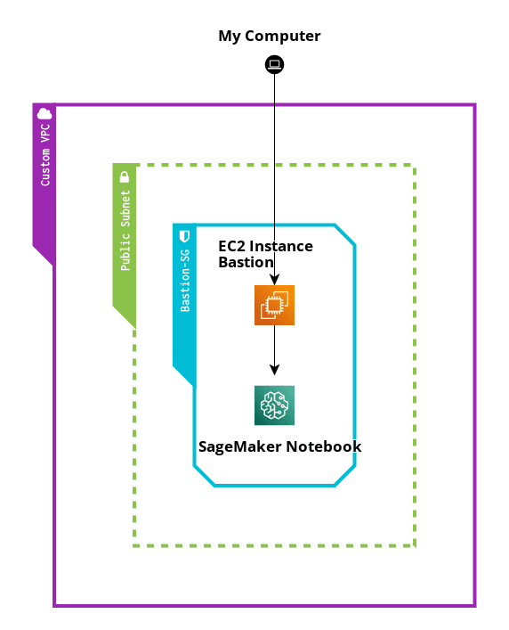

## Step 1 Creation of Custom VPC

In the AWS management console so the first thing   to do is to go to my services then  select **VPC**

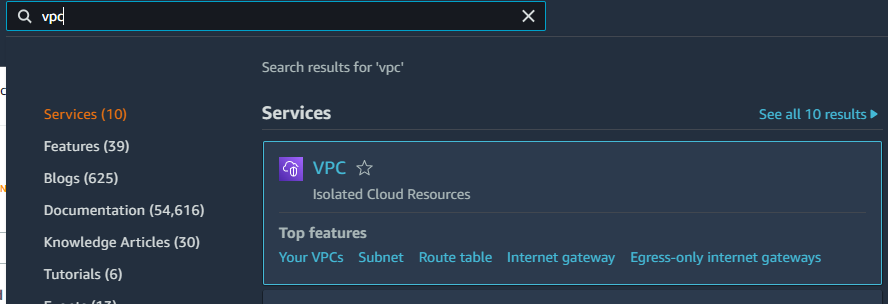

We are using to build our own private network in AWS

Click a create a VPC 

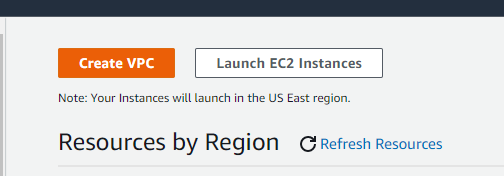

We select `VPC only` and we call  `Custom-VPC`

In the **cidr block** that we want to use is **10.0.0.0/16.** this means that this VPC is going to have about 65 536 available IP  so we can segment that VPC further into more subnets and **default tenancy**

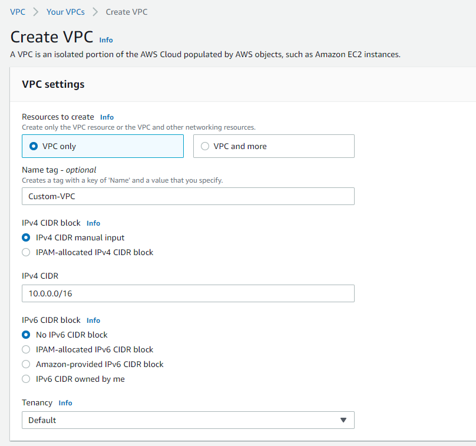


then we click **create a vpc** , once you create a vpc  select the **vpc** and now from the actions

menu  click **Edit DNS hostnames** 


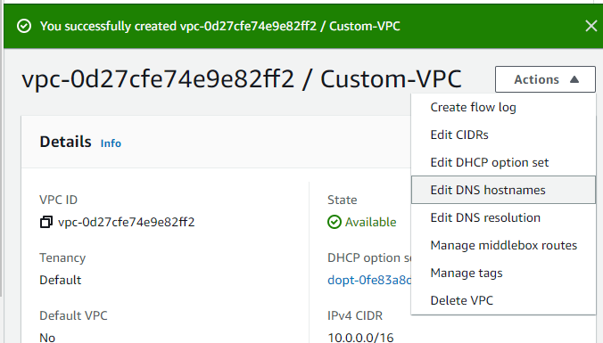

and **Enable DNS hostnames** and click **save**

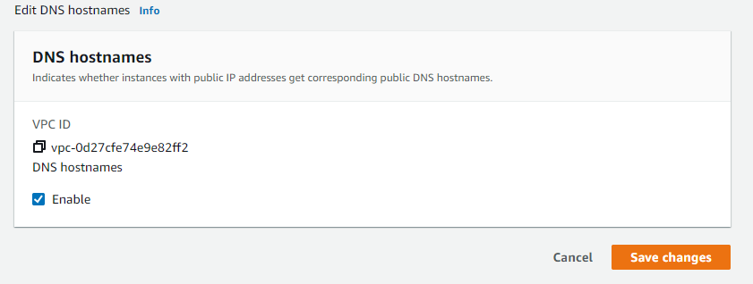


This will give any EC2 Instances in this VPC a DNS name.

 Select **subnet**, select your Custom-VPC and create a new subnet and i will call this **Public Subnet**. In the first availability zone of us-east1a , we choose the ip address **10.0.0.1/24** which means we get up to 2 to the power 8 available IP minus 5 which are the 5 IPs reserved for AWS

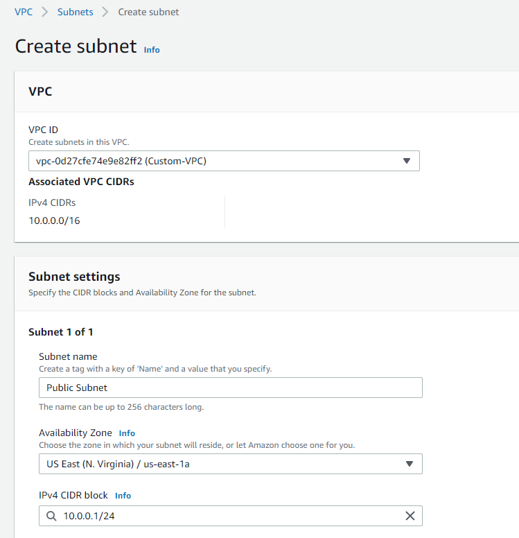

then click create subnet.

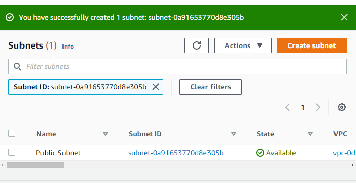

then  select my Public Subnet and from the action menu click **Edit Subnet settings**

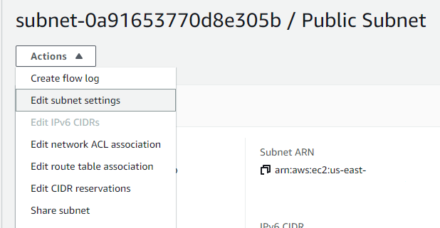

and **enable auto assign** public ip address then click on **save** 

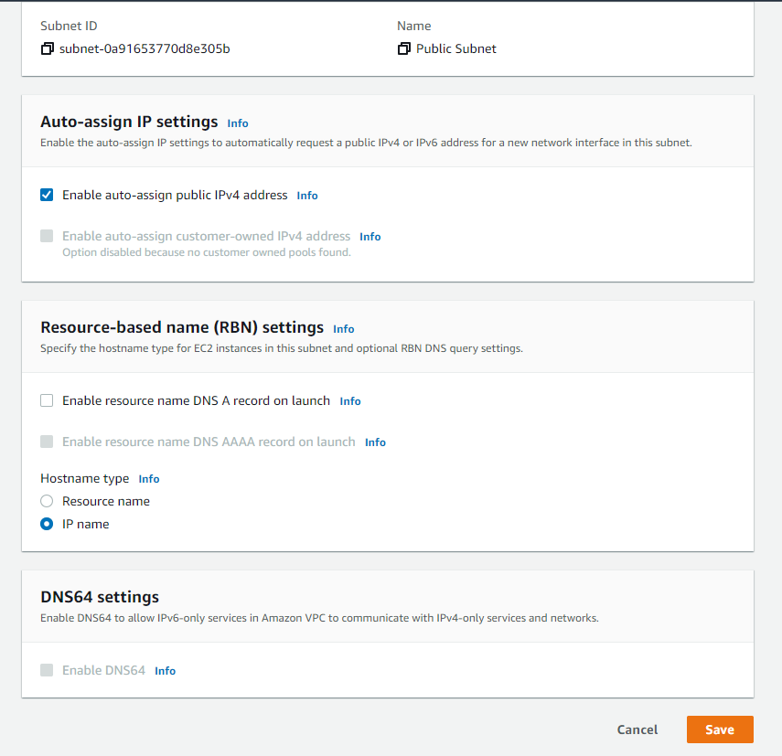


Now let us create **Internet gateway** because we want that the public subnet has   inbound and outbound. internet connection.

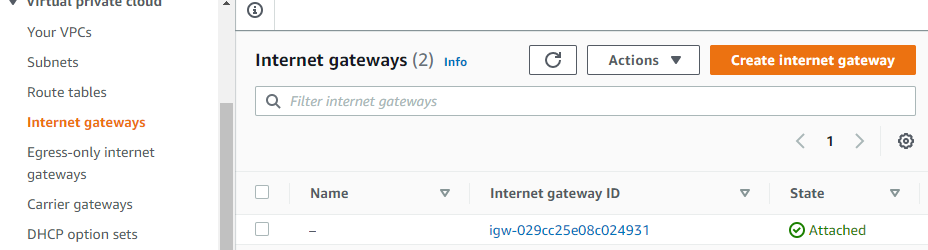


create an internet gateway i will call it **Custom-Internet-Gateway** and click **Create internet gateway**

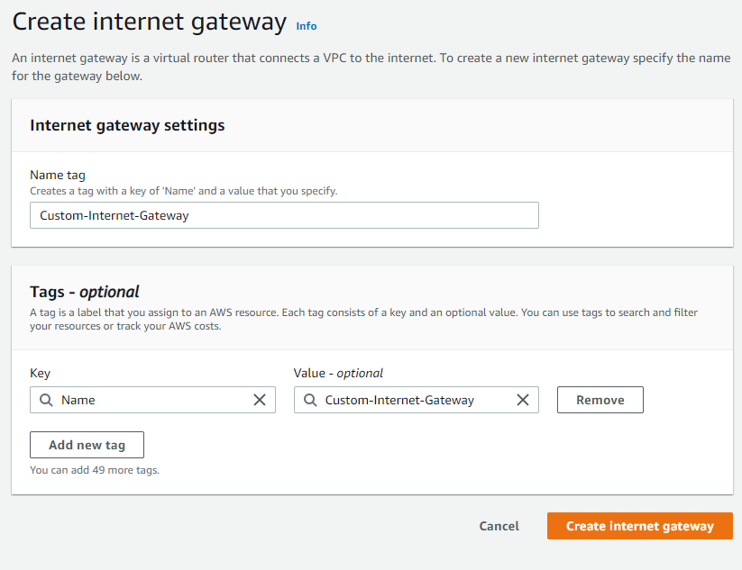


Then we click on  action menu of the internet gateway that  just we created and click **attach to VPC**

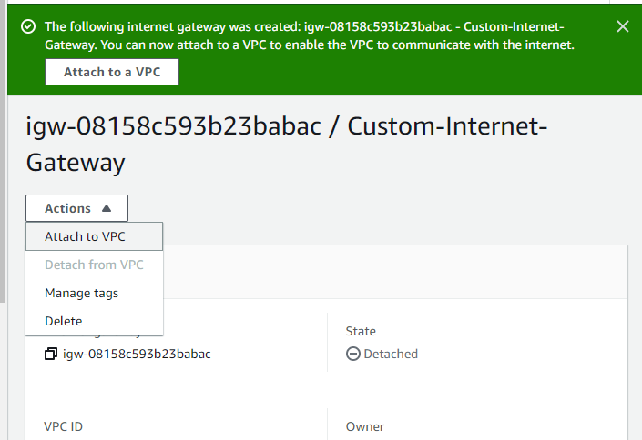


and we select the  Custom-VPC

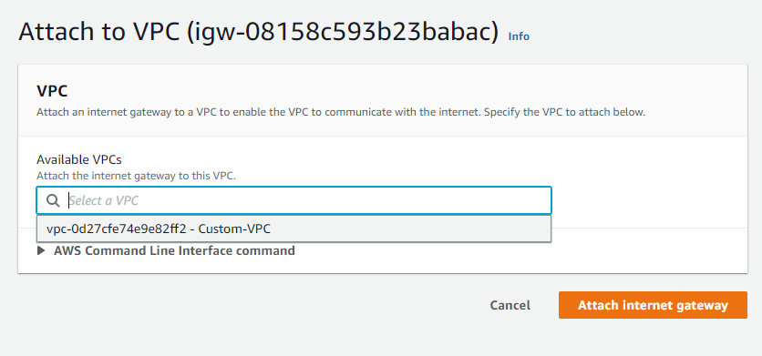

and click **Attach internet gateway**.

Let us go to the **Route tables** and we want to configure the route table now be careful when you go to the route table you must be sure that this route table belongs to the **Custom-VPC** because most likely you will  have a default vpc created in your region by AWS.


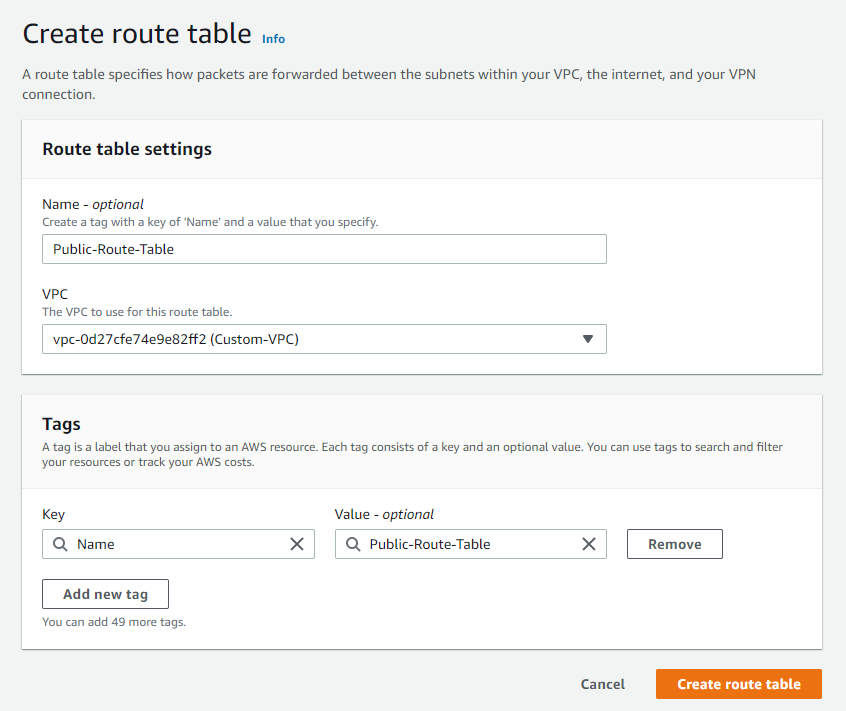


and click **Create route table**, then click on Edit route tables 


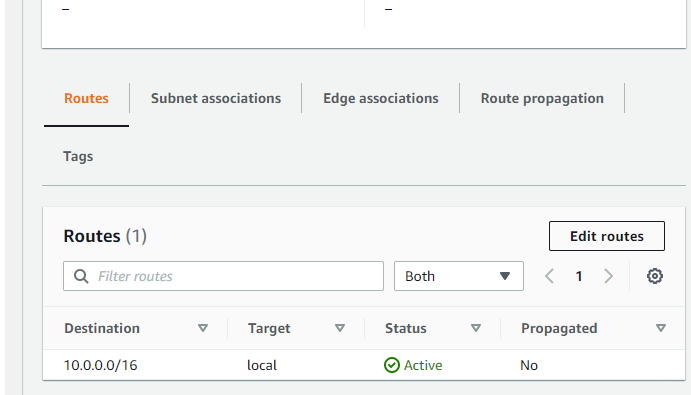


For this project I will  edit the route tables to be public, we add 0.0.0.0/0 

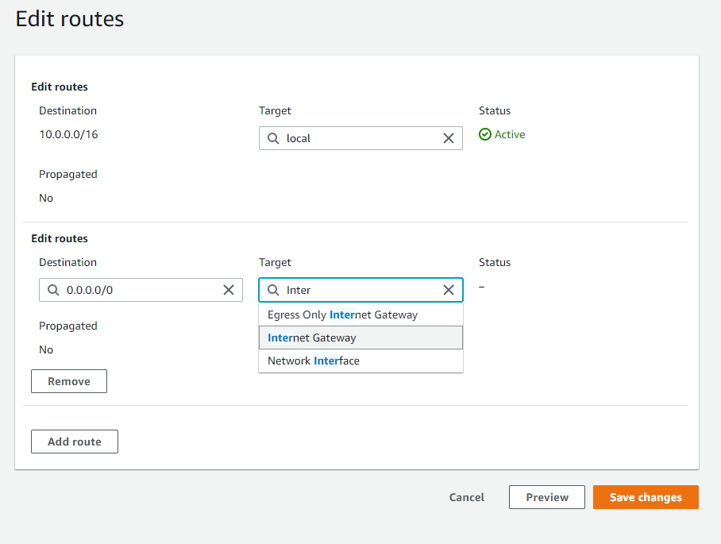

and we select our **Custom-Internet-Gateway**


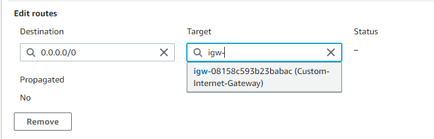

now in the subnet association, we need to point now my public subnet to my public route table , we click on **edit subnet associations**


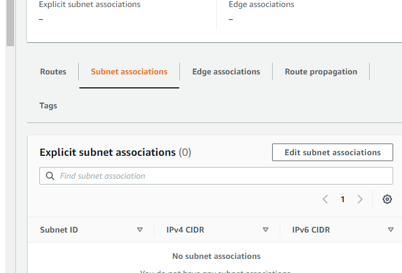


and then Select the **Public Subnet** and click **Save associations**.

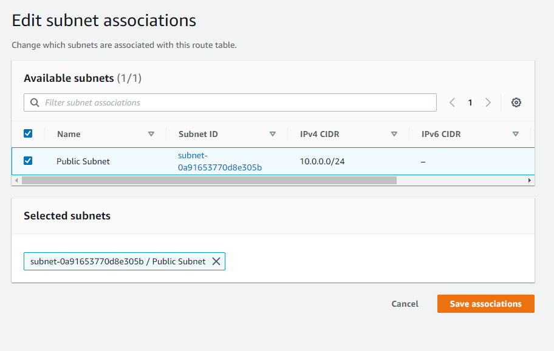

and this is from now on this subnet will be act as a public subnet because it has a destination route to the internet gateway .

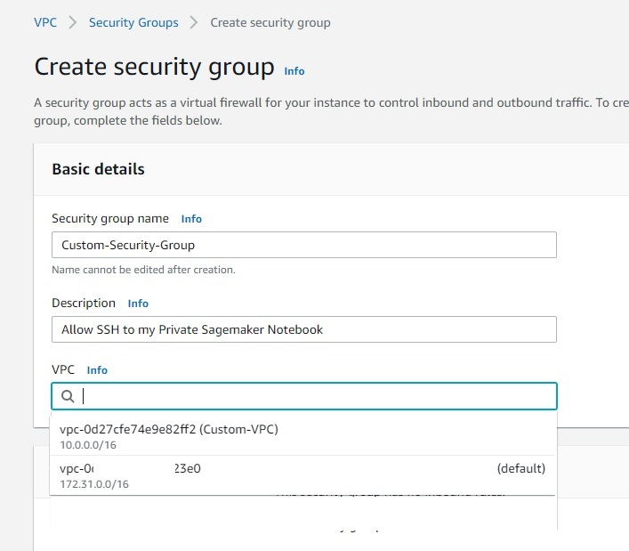


The next step is create a  create a security group , we click on create a security group you need to specify, where this security group in which vpc we choose Custom-VPC, be sure to deselect the default because by default aws console will give you the default vpc , then  a new rule and this is will be ssh and let assign the block CIDR  **10.0.0.0/16** that corresponds to all IPs ouf our VPC  and then we add an extra new rule where we choose **MyIP**


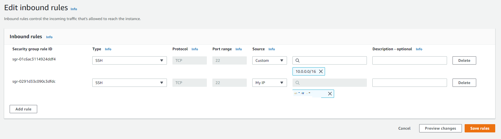

 You can create two different  subnets, one private another public, but  to simplify the things, we I have used only a single subnet. Because the private subnet requires create a NAT Gateway.  But due to I am on my single VPC , and Sagemaker does not generate public IP and has their own private subnet so its okay.

## Step 2 Creation of Bastion-Server Instance


Let us create a **Bastion Server**.


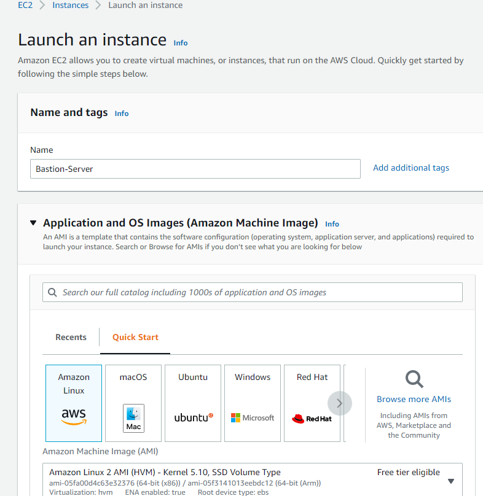


then you  add the Key pair name , **Bastion-Server**


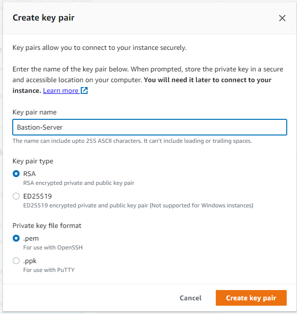

and click create Key pair, you download this **Bastion-Server.pem** , then you select

the Custom-VPC and the Public Subnet and Enable public IP, select  Custom Security Group

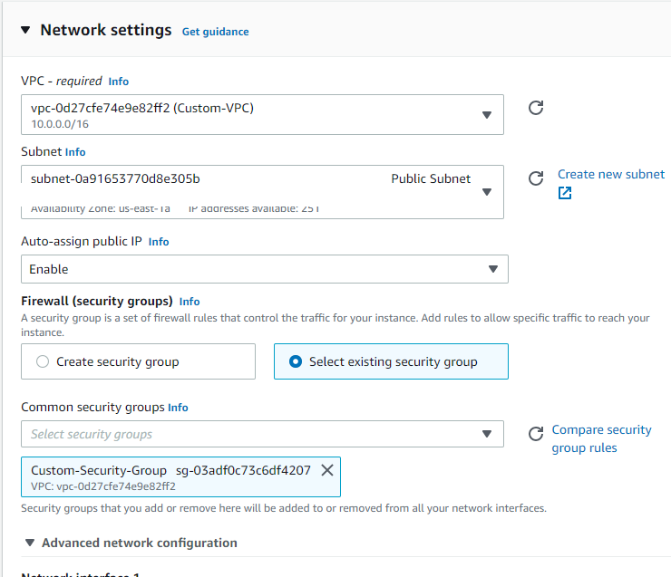


and finally launch the EC2 instance.

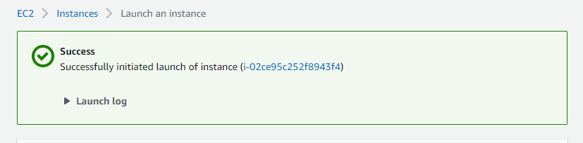


## Step 3. Creation of the SageMaker Notebook

Head to the [AWS Console](https://aws.amazon.com/console/) and from there, under  All Services, choose **SageMaker**.

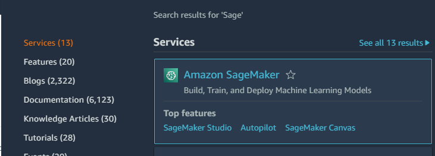

Then we will create a notebook instance,

then we name our server as **Sagemaker** . There are a vast of types of AWS Instaces, for our GPU consuming   I suggest use the Amazon EC2 G4 instances that  provide the latest generation **NVIDIA T4 GPUs**, Amazon Web Services custom Intel Cascade Lake CPUs, up to **100 Gbps** of networking throughput, and up to **1.8 TB** of local NVMe storage.

Moreover **Amazon EC2 G4 instances** deliver a cost-effective GPU instance for deploying machine learning models in production and graphics-intensive applications. 

These instances deliver up to 65 TFLOPs of FP16 performance to accelerate machine learning inference applications and ray-tracing cores to accelerate graphics workloads such as graphics workstations, video transcoding, and game streaming in the cloud.

Let us then choose 

**ml.g4dn.xlarge**

which has the following specs:

1 GPU, 4 vCPUs, 16 GiB of memory, 125 NVMe SSD, up to 25 Gbps network performance

**You should be careful,** choose the appropriate instance, to avoid extra costs!!!

| Accelerated Computing | vCPU | Memory  | Price per Hour |
| :-------------------: | :--: | :-----: | :------------: |
|     ml.p3.2xlarge     |  8   | 61 GiB  |     $3.825     |
|     ml.p3.8xlarge     |  32  | 244 GiB |    $14.688     |
|    ml.p3.16xlarge     |  64  | 488 GiB |    $28.152     |
|    ml.g4dn.xlarge     |  4   | 16 GiB  |    $0.7364     |

In particular this instance **ml.g4dn.xlarge**   , during the writing time, you will pay **$0.7364 per Hour** so  be sure to delete your Instance after you finish.


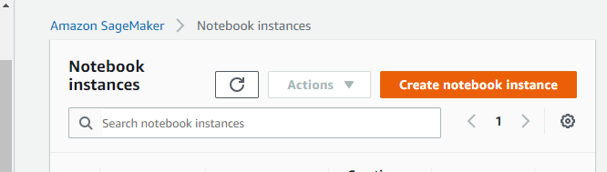


then we name  **Sagemaker-Server**

**Custom-VPC** amd we choose the first subnet that you can see then

it is important to select the security group **Custom-Security-Group** 


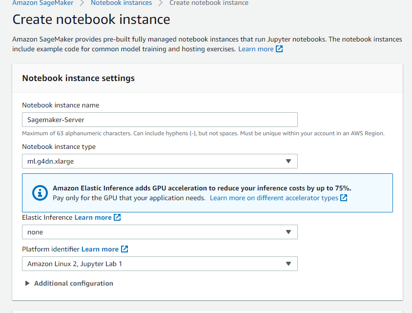

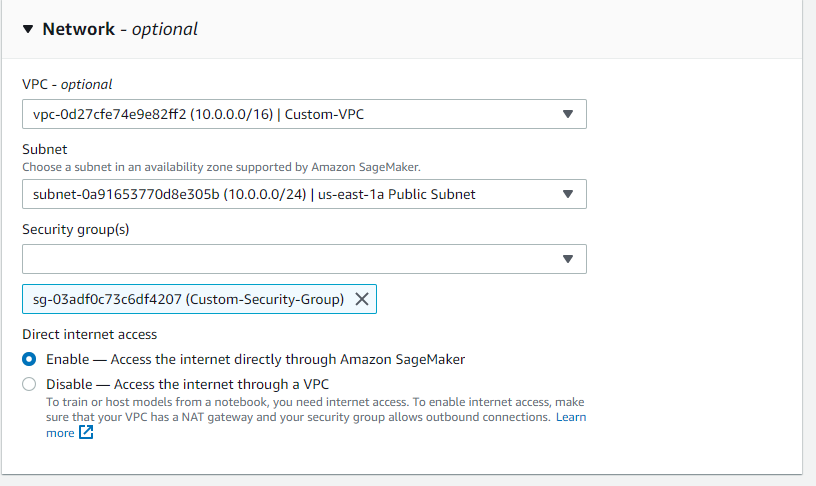

and later click on Create notebook instance


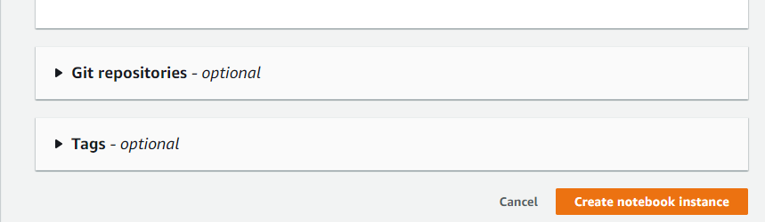

## Step 4. Setup your Computer

Go to your EC2 server

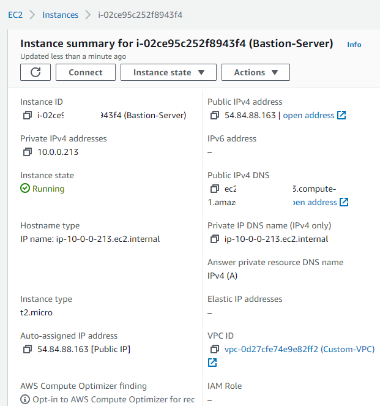


and click connect and then copy the public ip Copy the **Bastion-Server.pem** to  the c:\bastion or in any folder of your preference,you enter to the terminal, to that folder, in my case I use  

```
cd c:\bastion
```

```
chmod 400 Bastion-Server.pem
```

If you don't have openssh or cygwin, use chocolatey to install it easily using [chocolatey](https://chocolatey.org/).

```
choco install cyg-get
```

**Open Cygwin Terminal** that was installed with chocolatey 

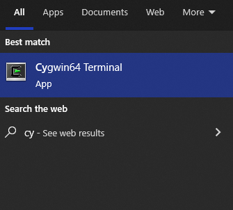

and run 

```
cyg-get install openssh
```

then type

```
cd C:
cd bastion
```

and we can test our connection

```
ssh -i "Bastion-Server.pem" ec2-user@ec2-54-84-88-163.compute-1.amazonaws.com
```

then we return back to our laptop terminal

```
exit
```

For this project we need to  skip call the .pem file , so we copy your .pem file to .ssh

```
cp Bastion-Server.pem ~/.ssh/
```

copy your **public IP address** of your Bastion-server and edit the  **config**  file

```
cd  ~/.ssh/
```

```
code config
```

with the  following lines in the 

```
Host Bastion-Server
  Hostname 35.170.50.56
  User ec2-user
  IdentityFile "~/.ssh/Bastion-Server.pem"
  ForwardAgent yes
```

then you simply to connect type

```
ssh Bastion-Server
```

```
$ ssh Bastion-Server
Last login: Sat Aug 27 23:41:41 2022 from host-87-8-127-173.retail.telecomitalia.it

       __|  __|_  )
       _|  (     /   Amazon Linux 2 AMI
      ___|\___|___|

https://aws.amazon.com/amazon-linux-2/
3 package(s) needed for security, out of 7 available
Run "sudo yum update" to apply all updates.
[ec2-user@ip-10-0-0-213 ~]$

```

then you type

```
ssh-keygen -t rsa
```

```
cd .ssh
```

```
cat id_rsa.pub
```

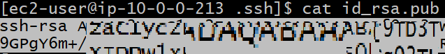

then copy  what you see on your terminal, then return back to Sagemaker Notebook

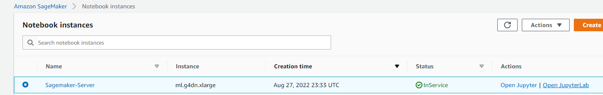

open **Jupyter Lab**, then click on open new terminal

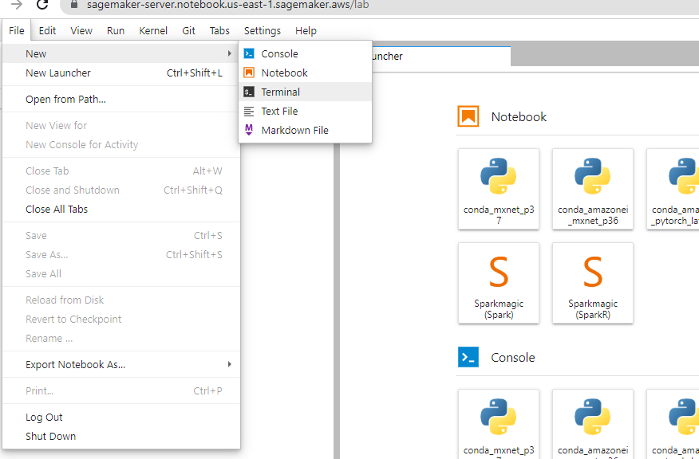

and type the following

```
cd .ssh
```

```
nano authorized_keys
```

and paste the copied code , then to save  press ctrl+X and then press  Y and press enter.

then type

```
/sbin/ifconfig eth2 | grep 'inet' | cut -d: -f2 |  /sbin/ifconfig eth2 | grep 'inet' | cut -d: -f2
```

and then copy the private ip

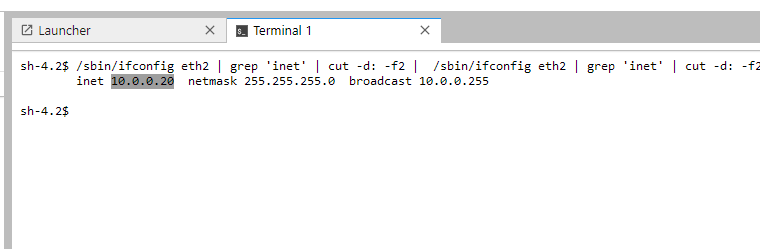

in my case is **10.0.0.20**, then return to your Bastion Terminal

and type

```
ssh ec2-user@10.0.0.20
```

and wuala! you are in your **Jupyter Notebook instance**. For future connections, just type 

```
ssh Bastion-Server
```

then

```
ssh ec2-user@10.0.0.20
```

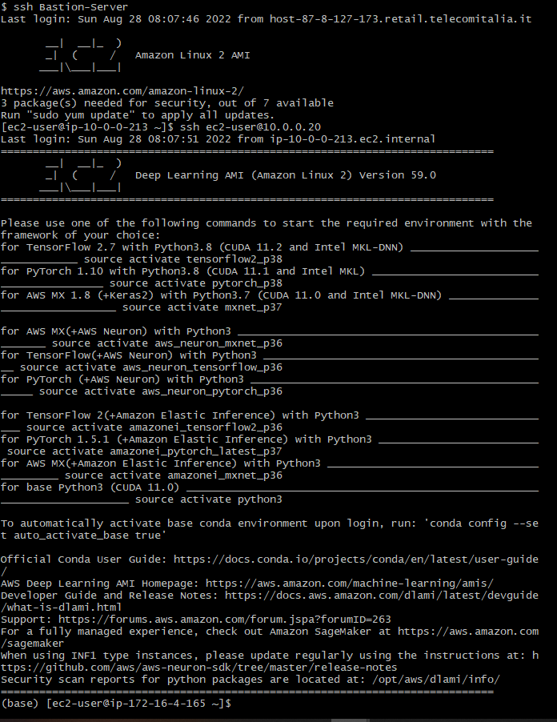

If you see your are in ec2-user@**ip-172-16-1-42** , and **IP** that is managed by AWS

**Gresat!** You have connected via ssh to your Sagemaker Notebook


**Troubleshooting's:**

Sometimes if you have problems, I have collected some of the common errors that I found and I solved.

**Scenario 1:** If you **stop your Sagemaker Notebook** and  start  your instance,  do the following steps:

1. Enter to your Bastion-Server and copy again the  .pub fille

   ```
   cat ~/.ssh/id_rsa.pub
   ```

2. Remove the saved connections

   ```
   rm ~/.ssh/known_hosts
   ```

3. You can test if you can enter to Sagemaker

   ```
   ssh ec2-user@10.0.0.20 -y
   ```

**Scenario 2:** If you **stop your EC2 Bastion** and  start  your instance,  do the following steps:

1. You should update you public IP in your computer,

   ```
   code ~/.ssh/config
   ```

2. Remove old connections with wrong ip

   ```
   rm ~/.ssh/known_hosts
   ```

3. From your personal computer, test if you can connect

   ```
   ssh Bastion-Server
   ```

   then type

   ```
   ssh ssh ec2-user@10.0.0.20  -y
   ```

**General Check :** You have to verify that your  setup is correct:


**Jupyter Notebook Side** : You must update every time the Jupyter notebook **authorized keys** file with the **.pub** key of your Bastion when you stop of restart your **SageMaker Instance**.  

Check that at the end of the **authorized keys** files in .ssh folder

```
nano ~/.ssh/authorized_keys
```

 you have the following:

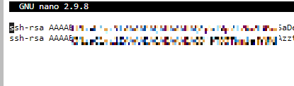

With your latest EC2 key, verify that appears the EC2.internal address  at the end of the file for your Bastion Server

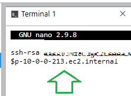

**Bastion Side** : in the authorized keys  file in .ssh folder verify that appears the local ip of your VPC of your Bastion-Server

```
nano  ~/.ssh/authorized_keys 
```

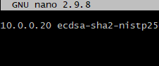


```
cat ~/.ssh/known_hosts
```

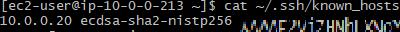

**Your computer Side** : 

You have to check that the config file you have the public IP address of your Bastion-Server

You must update every time the public IP when you stop of restart your EC2 instance. 

```
code ~/.ssh/config
```

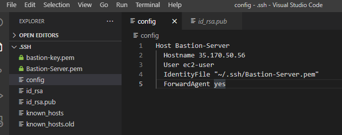


From your computer you can check

```
ssh Bastion-Server
```

then

```
ssh ec2-user@10.0.0.20
```

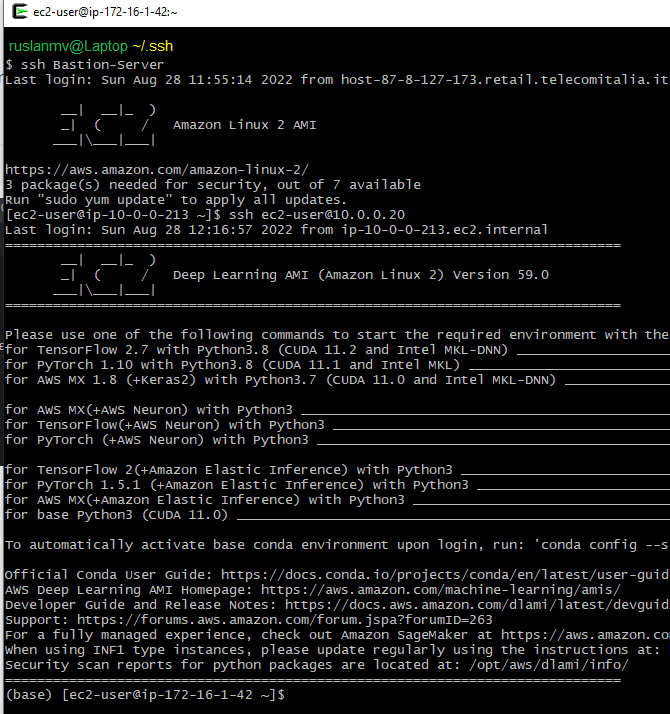

If everything its okay should run.

Great you have learned how to connect to your **Sagameker Notebook instance** from your Laptop.

# Opening SSH Tunnel (Optional)

If your are interested to run a Web Application which uses for example the port  **5000** and you want it to connect it from your Laptop, and connect to you **Cluster Sagemaker Notebook,** you simply should add a new rule on your Custom-Security-Group , with this port 5000 and  CIDR 10.0.0.0/16

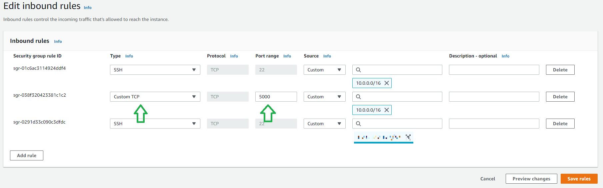


Then let us play with **Sagemaker Notebook,**  open a new terminal there

```
sh-4.2$ source activate python3
(python3) sh-4.2$ pip install flask
```

then open a new Jupyter notebook and paste the following code and press shift enter

```python
from flask import Flask

app = Flask(__name__)

@app.route('/')
def index():
    return 'Web App with Python Flask in SageMaker Notebook!'

app.run(host='0.0.0.0', port=5000)
```

you will have something like

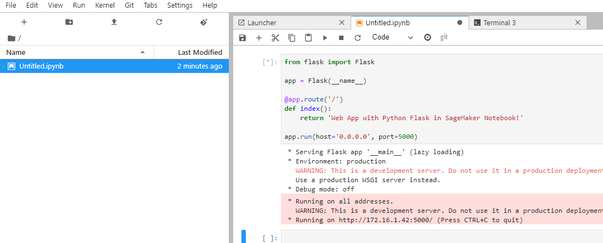

and finally go to your personal computer, and type the following command

```
ssh -N -L 5000:10.0.0.20:5000 -p 22 Bastion-Server
```

This will forward port **5000** from your local desktop to the remote **SageMaker noteboo**k through a Public facing bastion EC2 instance, in our case it is bastion with IP 52.54.209.62 

The key here is `-L` which says we’re doing local port forwarding. Then it says we’re forwarding our local port `5000` to **10.0.0.20:5000**, which is the default port of your WebApp.

Flag `-N` indicates to not execute a remote command. This is useful for just forwarding ports.

Dont worry if does not happen anything , that means that it is working

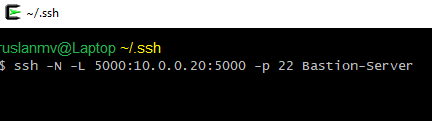

Then go to your favorite web browser like 

[http://localhost:5000/](http://localhost:5000/)

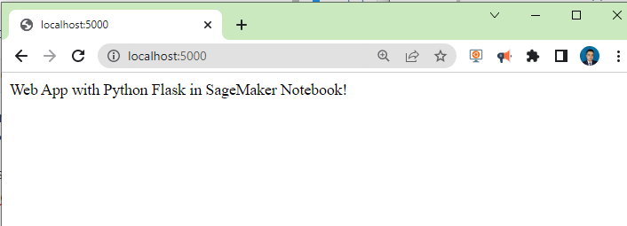

**Congratulations!** You have connected via ssh to your Sagemaker Notebook and executed Flask.

