Sometimes when you need to deploying **machine learning models** in **production** and **graphics-intensive applications** and you have not enough power computing to satisfy your needs. Then you can use the following blog post to solve this issue. Instead of upgrade your  cluster of your company or personal computer, you can use the cloud. 

With **Amazon Web Services** you can simply  create an instance with the adequate requirements for your Web Application .

In this blog post I will show how to create a web application on **AWS SageMaker** Notebook and connect with from your computer.

In particular we will create a demo application by using **Gradio**, that is the fastest way to demo your machine learning model with a friendly web interface so that anyone can use it, anywhere.

## Architecture

AWS does not natively support SSH-ing into **SageMaker notebook instances**, but nothing really prevents you from setting up SSH yourself.

There are two  possible solutions to connect :

a) **Reverse proxy**

b) **Bastion box.**  

In a previous blog post we have discussed the [ How to connect to Sagemaker via SSH](https://ruslanmv.com/blog/How-to-connect-to-Sagemaker-Notebook-via-SSH), which is based on the **Bastion box**. This is useful when you want to control all the pieces of your Cloud Infrastructure. In this new blog post we focus in a more simpler solution that is given by the **Reverse proxy.**

# Reverse proxy Solution

A **reverse proxy** is a type of proxy server.  Unlike a traditional proxy server, which is used to protect clients, a reverse proxy is used to protect servers. A reverse proxy is a server that accepts a request from a client, forwards the request to another one of many other servers, and returns the results from the server that actually processed the request to the client as if the proxy server had processed the request itself. The client only communicates directly with the reverse proxy server and it does not know that some other server actually processed its request.

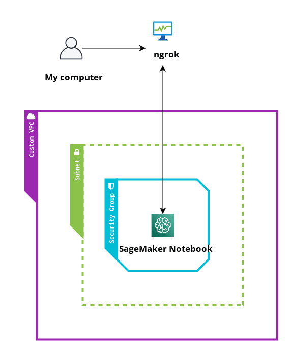

Due to **AWS Sagemaker** notebook officially does not support **ssh** support natively and we want to connect from our Laptop to our Sagemaker Server. We are going to a use a simply application called  **ngrok**  that will allow us connect it to our server.

# Step 1 - Creation of ngrok Account


First create account on [https://ngrok.com/signup]( https://ngrok.com/signup)

[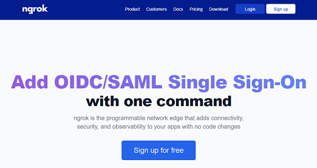]( https://ngrok.com/signup)

after you created your account  and confirm your email, you can copy the **Authtoken**

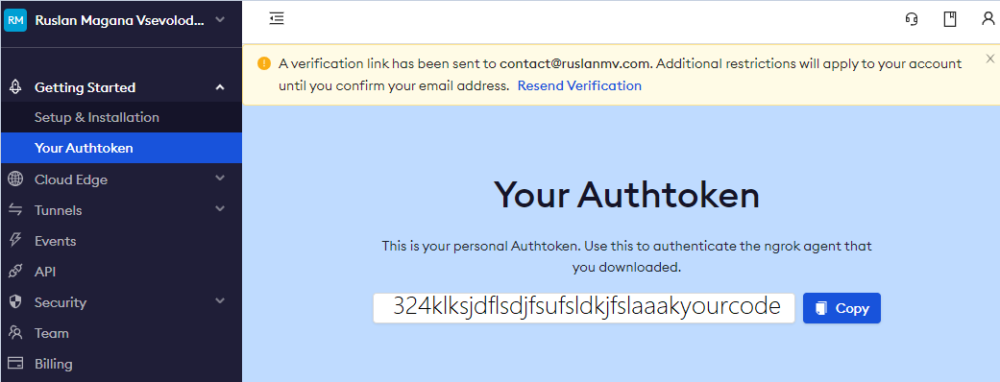

you will use this Token to get the URL site of your web applications.

# Step 2- Creation of Security Group for SageMaker

In ordering to communicate with Sagemaker Notebook Instance we need create a custom  **Security Groups**.

Head to the [AWS Console](https://aws.amazon.com/console/) and from there, under  All Services, choose **EC2**, open a new tab

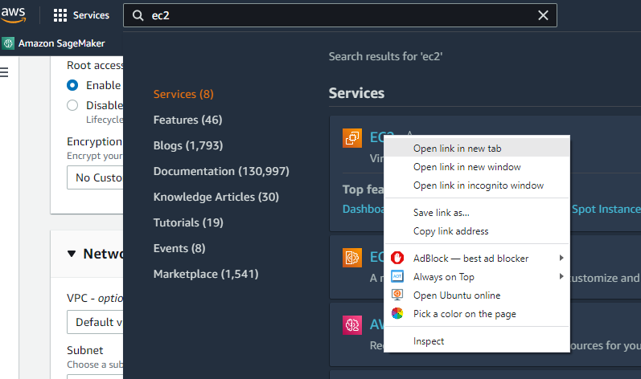

in the new window , click **Security Groups**

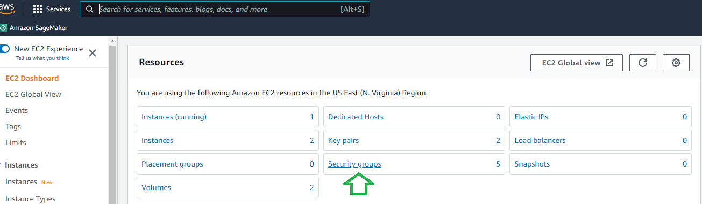

and then **Create Security Group**. Give it a name, such as **SageMaker-Security**, and then create an SSH rule to only allow the my IP in the inboud


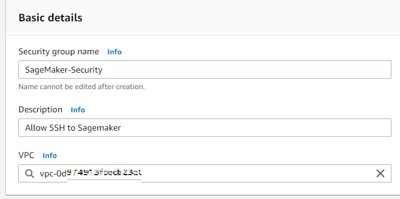

and outbout **Anywhere**

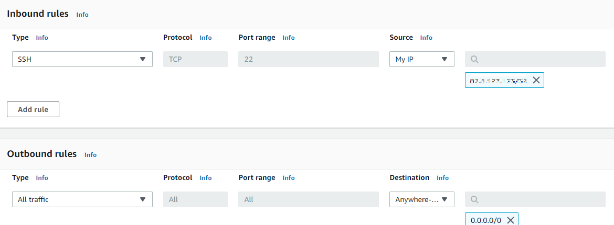

once was created we can continue to create a new SageMaker notebook.

# Step 3 - Creation of SageMaker Notebook

Head to the [AWS Console](https://aws.amazon.com/console/) and from there, under  All Services, choose **SageMaker**. 

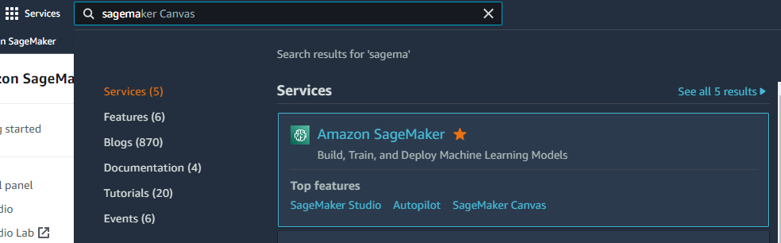


In Sagemaker we will choose the Notebook instances, click **create a notebook instance**

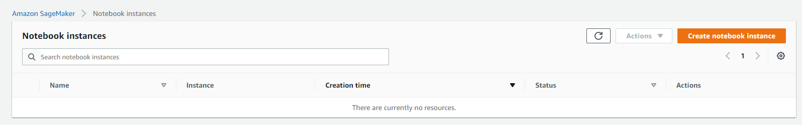


then we name our server as **SageMaker** . There are a vast of types of AWS Instances, for our GPU consuming   

We choose the **ml.g4dn.4xlarge** instances. **You should be careful,** choose the appropriate instance, to avoid extra costs!!!

| Accelerated Computing | vCPU | Memory  | Price per Hour | **GPU Memory (GiB)** |
| :-------------------: | :--: | :-----: | :------------: | -------------------- |
|     ml.p3.8xlarge     |  32  | 244 GiB |    $14.688     | 64                   |
|    ml.g5.12xlarge     |  48  | 192 GiB |     $7.09      | 96                   |
|    ml.g4dn.8xlarge    |  32  | 128 GiB |     $2.72      | 16                   |
|  **ml.g4dn.4xlarge**  |  16  | 64 GiB  |     $1.505     | 16                   |
|     ml.g5.xlarge      |  4   | 16 GiB  |     $1.41      | 24                   |
|    ml.g4dn.xlarge     |  4   | 16 GiB  |    $0.7364     | 16                   |

In particular this instance **ml.g4dn.xlarge** , during the writing time, you will pay **$1.505 per Hour** so  be sure to delete your Instance after you finish!!!.

In the **Notebook instance settings**, we name the instance as **Sagemaker** and Notebook Instance **ml.g4dn.xlarge**  we need to add  an extra **Volume Size** of the instance, for this project we choose **30gb**.

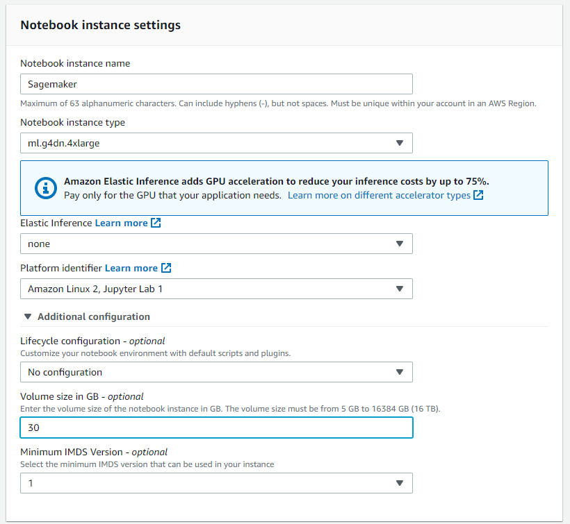


**To save the conda environments after your SageMaker machine stops.**

In AWS console, go to SageMaker -> Lifecycle configurations

Create a new lifecycle configuration. If your machines already use some lifecycle configuration, just open that one.

Under Scripts section make sure “Start notebook” tab is opened

Paste this code at the end

```bash
#!/usr/bin/env bash
set -e
# set up persisted conda environments
curl https://raw.githubusercontent.com/ruslanmv/Save-conda-environments-on-Sagemaker/master/start.sh | bash
```

then click **Create configuration**.

 In the **Network section**, we choose our **Default VPC** and we choose the first subnet that you can see then, in the Security Group 

we create create one with the In **SSH** and port **7860**. If you are planning to use Gradio, 5000 for **Flask** etc... And you can choose the input my IP address.

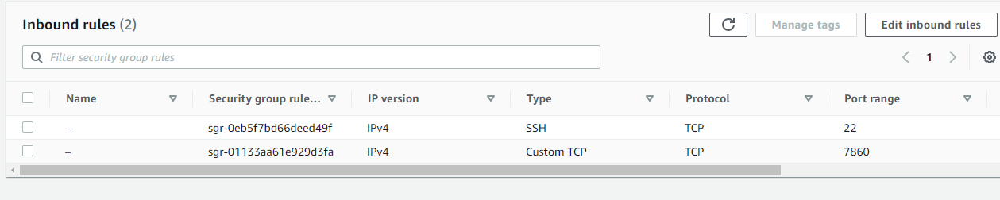

we select **SageMaker-Security** 

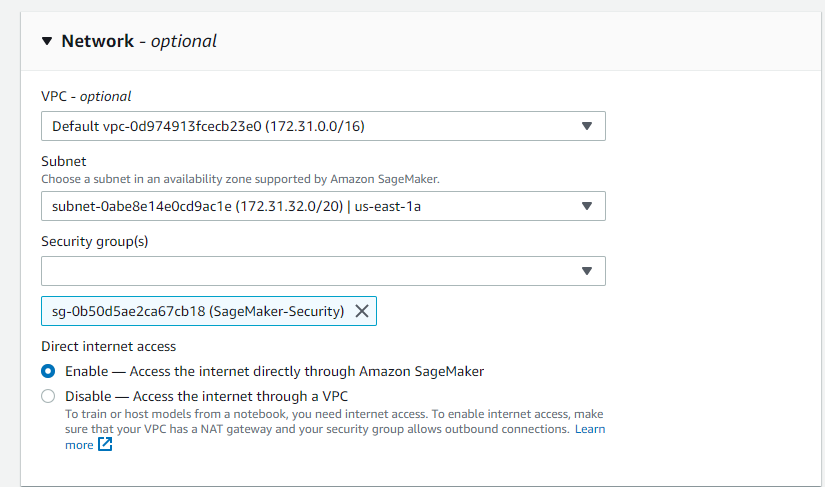

and finally **create the notebook instance** and we wait until the Status changes from **Pending** to **InService.**

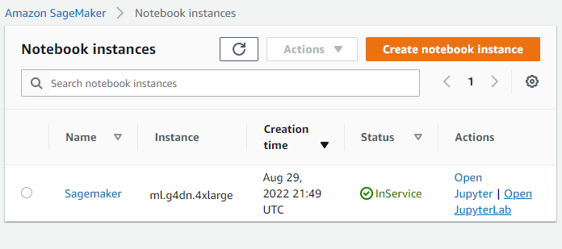


# Step 4- Setup SageMaker Notebook

Click **Open Jupyter Lab**  and  click **File** > **New**>**Terminal**

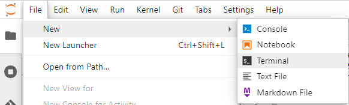


To install the Python packages in the correct Conda environment, first activate the environment before running **pip install** or **conda install** from the terminal.

```
source activate python3
```

and there you can  type

```
conda info --envs
```

as you see , in **SageMaker** you have different environments ready to work,

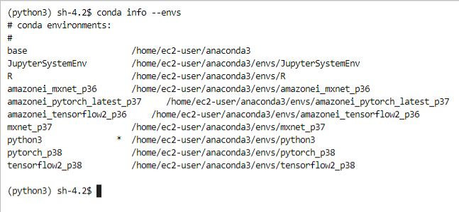

For example, if we want to create a project where the name is  VideoMessage, we type

```
conda create --name YourKernel python=3.7.13
```

To activate any conda environment, run the following command in the terminal.

```
conda activate YourKernel
```

To use your new conda environments with notebooks, make sure the `ipykernel` package is installed in the environment.

```
conda install ipykernel -y
```

After you have created the environment, you can select it as the kernel for your notebook.

```
python -m ipykernel install --user --name YourKernel --display-name "Python 3 (Your Kernel)"
```

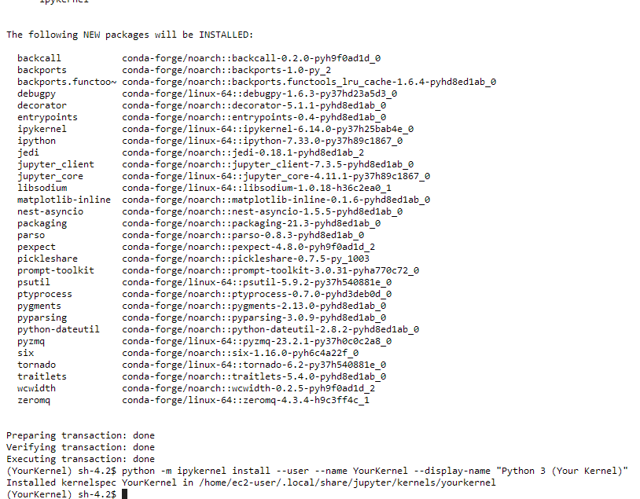

# Step 5 - Hello World project

First enter to **SageMaker** folder

```
cd SageMaker
```

then

```
git clone https://github.com/ruslanmv/How-to-run-WebApp-SageMaker-Notebook.git
```

```
cd How-to-run-WebApp-on-SageMaker-Notebook
```

```
cd Sagemaker
```

in addition we need we need install **pyngrok**  to get the reverse proxy  and **gradio** to test the environment

```
pip install -r requirements.txt
```

after all the requirements well installed.

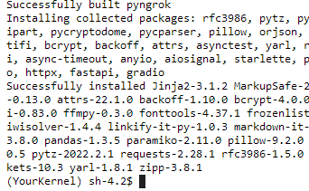


# Step 6 - Setup Pyngrok

Then select **data.json**, open with editor

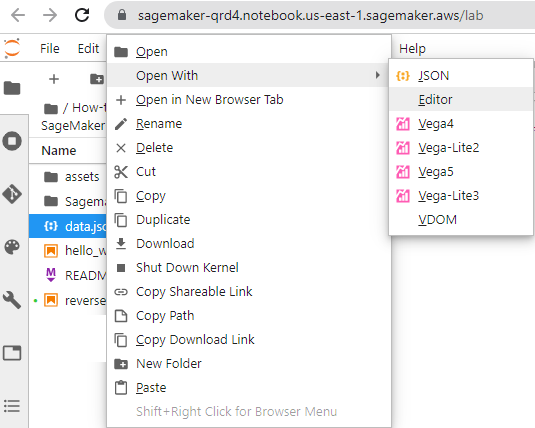

and paste your token between the " "   and save with **ctrl+s**

```
{
    "token": "2DwxLpbhkJVZ2UdJ2Ls0p8tlxTB_6oshozHRwcgL3Z2KtUz11"
}
```

Let us open a the **reverse_proxy.ipynb** notebook

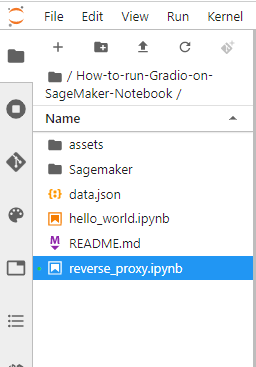


be sure that you are using the kernel  **Python 3 (Your Kernel)** 

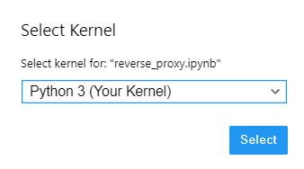


then for the notetbook **reverse_proxy** run the fill cell

```python
#Setup of your token for first time
import sys, IPython
from pyngrok import ngrok
import json 
# Opening JSON file
f = open('data.json')
# returns JSON object as 
# a dictionary
data = json.load(f)
#print(data)
YOUR_TOKEN=data['token']
ngrok.set_auth_token(YOUR_TOKEN)
IPython.Application.instance().kernel.do_shutdown(True)
```

if you see

```
{'status': 'ok', 'restart': True}
```

means that was done well the authentication, then run the next cells

```python
# If is installed the token you can use this code
import sys, IPython
from pyngrok import ngrok
from IPython.core.display import display, HTML
# Open a HTTP tunnel on port 7860
# <NgrokTunnel: "http://<public_sub>.ngrok.io" -> "http://localhost:7860">
http_tunnel = ngrok.connect(7860, bind_tls=True)
http_url = http_tunnel.public_url
display(HTML(f'<b><a target="blank" href="{http_url}">Load test: {http_url}</a></b>'))
```

You will have something similar like:

**[Load test: https://e870-34-236-55-223.ngrok.io](https://e870-34-236-55-223.ngrok.io/)**

```python
# Open a SSH tunnel
# <NgrokTunnel: "tcp://0.tcp.ngrok.io:12345" -> "localhost:22">
ssh_tunnel = ngrok.connect(22, "tcp")
display(HTML(f'<b><a target="blank" href="{ssh_tunnel}">SSH test: {ssh_tunnel}</a></b>'))
```

You will have something similar like:

**["localhost:22"">SSH test: NgrokTunnel: "tcp://8.tcp.ngrok.io:15159" -> "localhost:22"](ngroktunnel:)**

you can see your status

```python
tunnels = ngrok.get_tunnels()
print(tunnels)
```

and the output is	

```
[<NgrokTunnel: "tcp://8.tcp.ngrok.io:15159" -> "localhost:22">, <NgrokTunnel: "https://e870-34-236-55-223.ngrok.io" -> "http://localhost:7860">]
```

Now we are ready to test our enviroment.

# Step 7- Testing Environment

Open the  **hello_world.ipynb** , verify that you are in the kernel  Python 3 (Your Kernell) 

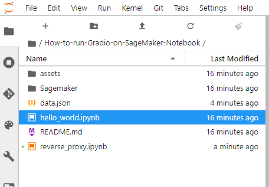


and run the first cell

```python
import gradio as gr
def test(): 
    def greet(name):
      return "Hello " + name + "!"
    iface = gr.Interface(fn=greet, inputs="text", outputs="text")
    iface.launch(server_port=7860)
```

then

```
test()
```

After is running this  return back to your **reverse_proxy** notebook and click the link

**[Load test: https://e870-34-236-55-223.ngrok.io](https://e870-34-236-55-223.ngrok.io/)**

then click **Visit Site**

 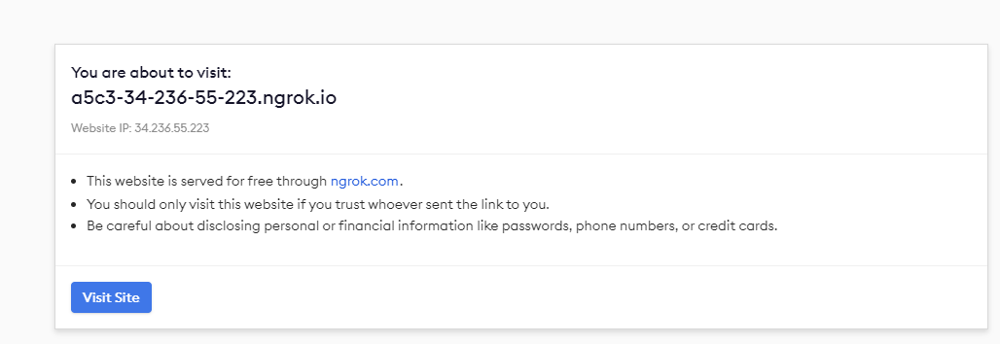

and type your name for example,

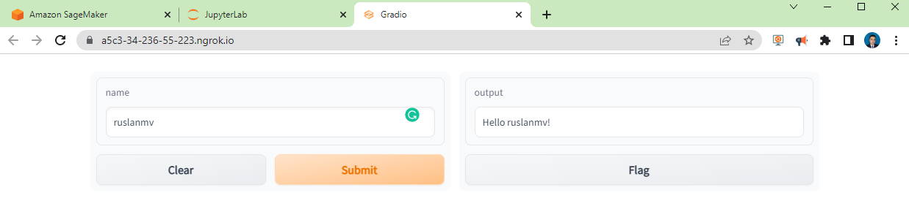Don't worry if  If Chrome says: Deceptive site ahead Attackers ... dont worry. You click visit this site.

Alternative way to avoid this type of issues you can select another method to log into SageMaker,  like in previous blog  [ How to connect to Sagemaker via SSH](https://ruslanmv.com/blog/How-to-connect-to-Sagemaker-Notebook-via-SSH).

If your you **pass the test**, then  you can return to **hello_world.ipynb** and close **Gradio**  running the following cell

```python
msg = 'Would you like stop gradio server?'
shall = input("%s (y/N) " % msg).lower() == 'y'
if shall == True:
    print(" Shutting down gradio server.")
    gr.close_all()
```

by pressing y

```
Would you like stop gradio server? (y/N)  y
 Shutting down gradio server.
Closing server running on port: 7860
```

For complementary you can use also the terminal to use ngrok, but we wont use for this project (dont run now)

```
ngrok authtoken YOUR_TOKEN_HERE
```

and

```
ngrok http 8089
```


when you click ctrl+c, the server is stopped.

# Step 8 - Environments in SageMaker

In ordering to be familiar in SageMaker Notebook, we need to be familiar with the differents enviroments that there are.

In SageMaker Notebook we have loaded our custom python enviroment

```python
import sys ,os
print(sys.prefix)
```

and the output

```
/home/ec2-user/anaconda3/envs/YourKernel
```

However if we want to install  new modules to our environment by using our terminal we have to be careful, because Sagemaker runs on their own container, then in the terminal of Sagemaker we have to load property the environment that we have created

```python
Sagemaker = True
if Sagemaker :
    env='source activate python3 && conda activate VideoMessage &&'
else:
    env='' 
```

then we can create a new hello.py

```python
!echo -e 'import sys , os\nprint(sys.prefix)\nprint("Hello World!")\n'> hello.py
```

and check it

```
cat hello.py
```

with output

```
import sys , os
print(sys.prefix)
print("Hello World!")
```

For example if we run the hello world without loading we get

```python
os.system('python hello.py')
```

you get

```
/home/ec2-user/anaconda3/envs/JupyterSystemEnv
Hello World!
```

As you see in Sagemaker the enviroment is different as we wanted

```python
os.system('source activate python3 && python hello.py')
```

the output is

```
/home/ec2-user/anaconda3/envs/python3
Hello World!
```

defining you base enviroment

```python
base='source activate python3 &&'
```

So we need to call with our custom enviroment

```python
os.system('{}python hello.py'.format(env))
```

you get

```

/home/ec2-user/anaconda3/envs/VideoMessage
Hello World!
```

Moreover  avoid mixing environments like

```python
os.system('conda activate VideoMessage && python hello.py')
```

you get

```
CommandNotFoundError: Your shell has not been properly configured to use 'conda activate'.
To initialize your shell, run
    $ conda init <SHELL_NAME>
Currently supported shells are:
  - bash
  - fish
  - tcsh
  - xonsh
  - zsh
  - powershell
See 'conda init --help' for more information and options.
IMPORTANT: You may need to close and restart your shell after running 'conda init'.
```

In conclusion, try to be always in your enviroment and avoid use the base kernell.

## Catch os.system exceptions with Python

If you are interested to catch errors from your system you can do this trick. Let us assume you have a simple program in python that has errors

```python
#error.py
print("I am on the Terminal")
# We create intentional error
print(Not_defined)
```

 and you want to know if something went wrong.

```python
import os
is_command_ok = os.system("python error.py")
if is_command_ok >0:
    print("Error")
else:
    print("OK")
```

Then you can identiffy the errors

```
I am on the Terminal
Error
Traceback (most recent call last):
  File "error.py", line 3, in <module>
    print(Not_defined)
NameError: name 'Not_defined' is not defined
```

# Step 9 - Stop your instance and delete.

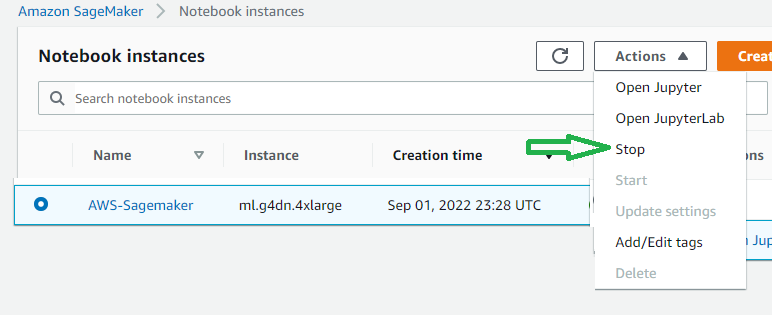

and then delete

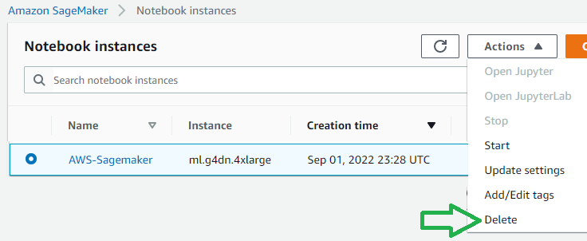


**Congratulations!**  We have built a simple infrastructure in the cloud needed to create our amazing  projects with **SageMaker.** 