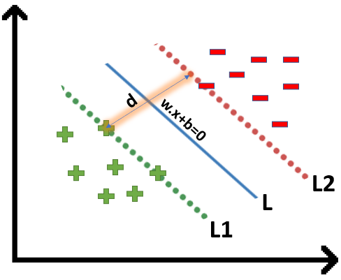
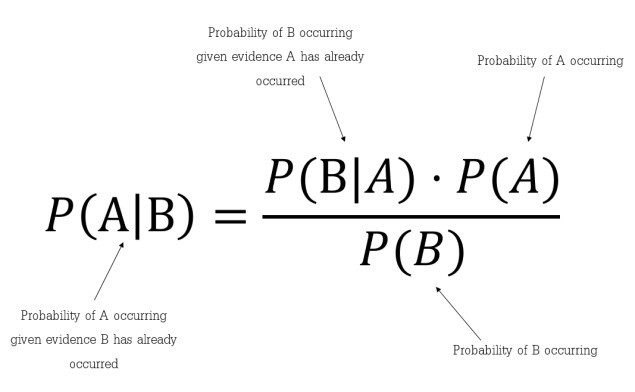
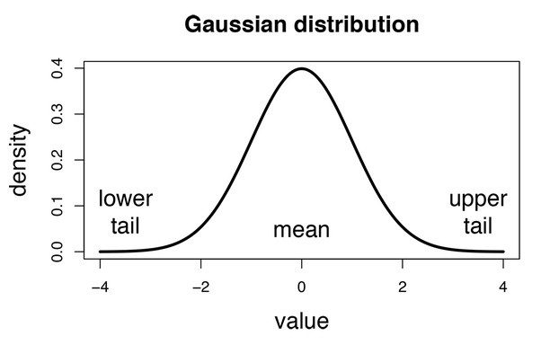
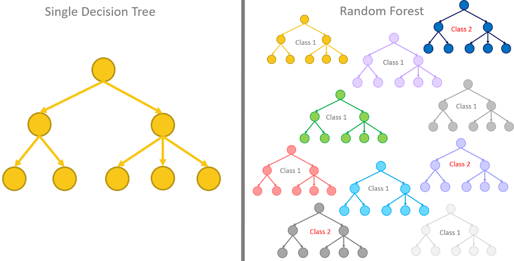
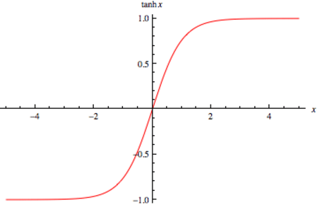
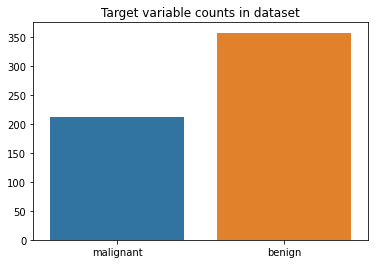
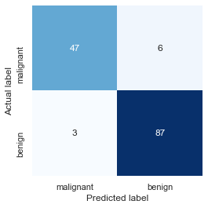
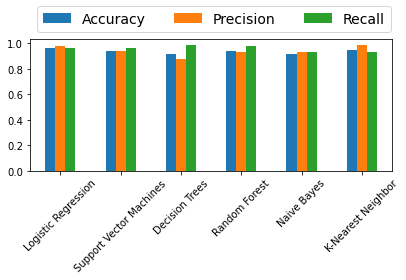

Hello, today I am going to try to explain some methods that we can use to identify which Machine Learning Model we can use to deal with binary classification.

As you know there are plenty of machine learning models for binary classification, but which one to choose, well this is the scope of this blog, try to give you a solution.

In machine learning, there are many methods used for binary classification. The most common are:

- Logistic Regression
- Support Vector Machines
- Naive Bayes
- Nearest Neighbor
- Decision Trees
- Neural Networks

Let us follow some useful steps that may help you to choose the best machine learning model to use in you binary classification.

## Step 1 - Understand the data

The first step to follow is understand the data that you will use to  create you machine learning model.

Until you have understood very well you source data you  can identify which model should be the best.

## Step 2 - Clean the data

In order to analyze the data you should clean the data, this allows you identify patterns of the data.

## Step 3 - Plot the data

A very simple way to understand better the data is through pictures.  But attention, not redundant data.

 This is important, because , it is common that in Data Science, people likes to do a lot a plots but some plots are unnecessary or they repeat the same  information several times.  Use fancy plots does not mean that you can understand better.

One should choose only important plot that shows the necessary information to take into account.

Try to use the  Manifesto of the Data-Ink Ratio during the creation of plots

The **data-ink ratio** is the proportion of Ink that is used to present actual data compared to the total amount of ink (or pixels) used in the entire display. 

- **Data-ink** represents all of the minimal elements of a diagram that are required to represent a set of data. 
- **Total-ink** represents all of the elements used to create the entire diagram (including aesthetic elements).

Good graphics should include only data-Ink. Non-Data-Ink is to be deleted everywhere where possible.

**Five Laws of Data-Ink, which are:**

1. Above all else show the data,
2. Maximise the data-ink ratio,
3. Erase non-data-ink,
4. Erase redundant data-ink, and
5. Revise and edit.

### Step 4 - Identify patterns that allows identify a possible best model

In this part we have to review a little each of the machine learning models that we want to use.

Here we need to remember some basic aspects of the possible machine learning candidates to use . And identify if your dataset features may satisfay the requirements of the machine learning model to be used.

For example in the case of the binary classification, we have

### 1. Logistic Regression

The  logistic function s of the form:

$$p(x)=\frac{1}{1+e^{-(x-\mu)/s}}$$

where $$\mu$$  is a location parameter (the midpoint of the curve, where $$ p(\mu)=1/2$$  and $$s$$ is a  scale parameter.


Binary variables are widely used in statistics to model the probability of a certain class or event taking place

Analogous linear models for binary variables with a different sigmoid function instead of the logistic function (to convert the linear combination to a probability) .

$$S(x)=\frac{1}{1+e^{-(x)}}$$

A sigmoid function is a bounded, differentiable, real function that is defined for all real input values and has a non-negative derivative at each point and exactly one inflection point.


### When use this model?

Well, if the distribution of the data may be distributed this logistic function, or like the sigmoid function, the the outputs may behave as the previous two formulas then this may be a good candidate to test. The logistic regression is a probabilistic approach.

## 2. Support Vector Machines

Support vector machine is based on statistical approaches. Her we try to find a hyperplane that best separates the two classes.

 SVM finding the maximum margin between the hyperplanes that means maximum distances between the two classes.

SVM works best when the dataset is small and complex. 

When the data is perfectly linearly separable only then we can use Linear SVM.

When the data is not linearly separable then we can use Non-Linear SVM, which means when the data points cannot be separated into 2 classes by using a a linear approach.

For example in 2 clasess.



SVM is helpful when you have a simple pattern of data, and you can find this hyperplane that allows this separation of the 2 classes.

An interesting point of SVM that you can use Non-Linear SVM that can be used to separate the classses by using a kernel, and with a Decision surface we can obtain this separation of the 2 classes.


### When use this model?

We can use SVM **when a number of features are high compared to a number of data points in the dataset**. By using the correct kernel and setting an optimum set of parameters.  It is effective in high dimensional spaces. Still effective in cases where number of dimensions is greater than the number of samples. Uses a subset of training points in the decision function (called support vectors), so it is also memory efficient.

### 3. Naive Bayes

Naïve Bayes is a probabilistic machine learning algorithm based on the Bayes Theorem, used in a wide variety of classification tasks.

Bayes’ Theorem is a simple mathematical formula used for calculating conditional probabilities.

**Conditional probability** is a measure of the probability of an event occurring given that another event has (by assumption, presumption, assertion, or evidence) occurred.

The formula is: —



Which tells us: how often A happens *given that B happens*, written **P(A|B)** also called posterior probability, 

> In simpler terms, Bayes’ Theorem is a way of finding a probability when we know certain other probabilities.


### When use this model?

The fundamental Naïve Bayes assumption is that each feature makes an: **independent and equal contribution to the outcome.**

What it does mean that?  This mean that when you have several features and they are **independent,** they are not correlated, and  none of the attributes are irrelevant and assumed to be contributing **Equally** to the outcome.

Due to the independence assumption is never correct we call Naive. This model works particularly well with natural language processing (NLP) problems. Because we can assume

1. The order of the words in document X makes no difference but repetitions of words do. (**Bag of Words assumption** )
2. Words appear independently of each other, given the document class (**Conditional Independence** ).

There are different types , among common types are:

 **a) Multinomial Naïve Bayes Classifier**
Feature vectors represent the frequencies with which certain events have been generated by a **multinomial distribution**. This is the event model typically used for document classification.

 **b) Bernoulli Naïve Bayes Classifier**
In the multivariate Bernoulli event model, features are independent booleans (binary variables) describing inputs. Like the multinomial model, this model is popular for document classification tasks, where binary term occurrence (i.e. a word occurs in a document or not) features are used rather than term frequencies (i.e. frequency of a word in the document).

 **c) Gaussian Naïve Bayes Classifier** 
In Gaussian Naïve Bayes, continuous values associated with each feature are assumed to be distributed according to a **Gaussian distribution (**[Normal distribution](https://en.wikipedia.org/wiki/Normal_distribution)**)**. 





## 3. Nearest Neighbor

K-Nearest Neighbour  (K-NN ) algorithm assumes the similarity between the new case/data and available cases and put the new case into the category that is most similar to the available categories.

K-NN algorithm stores all the available data and classifies a new data point based on the similarity. This means when new data appears then it can be easily classified into a well suite category by using K- NN algorithm.

K-NN algorithm can be used for Regression as well as for Classification but mostly it is used for the Classification problems.

K-NN is a **non-parametric algorithm**, which means it does not make any assumption on underlying data.

It is also called a **lazy learner algorithm** because it does not learn from the training set immediately instead it stores the dataset and at the time of classification, it performs an action on the dataset.

KNN algorithm at the training phase just stores the dataset and when it gets new data, then it classifies that data into a category that is much similar to the new data.

### When use this model?

Suppose there are two categories, i.e., Category A and Category B, and we have a new data point x1, so this data point will lie in which of these categories. To solve this type of problem, we need a K-NN algorithm. With the help of K-NN, we can easily identify the category or class of a particular dataset. Consider the below diagram:


The K-NN is based on the K number of neighbors, where we select the number K of the neighbors

It is calculated the Euclidean distance of **K number of neighbors** and taken the K nearest neighbors as per the calculated Euclidean distance. Among these k neighbors, count the number of the data points in each category.  And finally we assign the new data points to that category for which the number of the neighbor is maximum.

If you can estimate the value of K implicitly by analyzing the data and you don't have a lot of data its okay use K-NN. Otherwise we have to determine the value of K which may be complex some time and the computation cost is high because of calculating the distance between the data points for all the training samples.


## 4. Decision Trees

Decision trees is used to make predictions by going through each and every feature in the data set, one-by-one.

The decision tree is like a tree with nodes. The branches depend on a number of factors. It splits data into branches like these till it achieves a threshold value. A decision tree consists of the root nodes, children nodes, and leaf nodes.

Random forests on the other hand are a collection of decision trees being grouped together and trained together that use random orders of the features in the given data sets




The goal of using a Decision Tree is to create a training model that can use to predict the class or value of the target variable by **learning simple decision rules** inferred from prior data(training data).

In Decision Trees, for predicting a class label for a record we start from the **root** of the tree. We compare the values of the root attribute with the record’s attribute. On the basis of comparison, we follow the branch corresponding to that value and jump to the next node.

### When use this model?

When you don’t need to prepare the data before building the model and when your dataset can have a mix of numerical and categorical data, and you won’t need to [encode](https://scikit-learn.org/stable/modules/generated/sklearn.preprocessing.OneHotEncoder.html) any of the categorial features.

However you should take into account that Decision tree models are often biased toward splits on features having a large number of levels. Small changes in the training data can result in large changes to decision logic and large trees can be difficult to interpret and the decisions they make may seem counter intuitive.

Among some uses are in:

1. Biomedical Engineering (decision trees for identifying features to be used in implantable devices).
2. Financial analysis (Customer Satisfaction with a product or service).
3. Astronomy (classify galaxies).
4. System Control.
5. Manufacturing and Production (Quality control, Semiconductor manufacturing, etc).
6. Medicines (diagnosis, cardiology, psychiatry).
7. Physics (Particle detection).

## 5. Neural Network

Deep learning can be used for binary classification, too. In fact, building a neural network that acts as a binary classifier is little different than building one that acts as a regressor. 

Neural networks are multi layer peceptrons. By stacking many linear units we get neural network.

**Why are Neural Networks popular**

Neural Networks are remarkably good at figuring out functions from X to Y.  In general all input features are connected to hidden units and NN's are capable of drawing hidden features out of them.

**Computation of NN**

Computation of NN is done by forward propagation for computing outputs and Backward pass for computing gradients.

**Forward propagation:**

$$Z=W^Tx+b$$

Here Z is the weighted sum of inputs with the inclusion of bias

Predicted Output is activation function applied on weighted sum(Z)

**Activation Functions:** The following activation functions helps in transforming linear inputs to nonlinear outputs. If we apply linear activation function we will get linear seperable line for classifying the outputs.

1. *Sigmoid*: 

$$\sigma(x) = 1/(1+exp(-x))$$


The main reason why we use sigmoid function is because it exists between (0 to 1). Therefore, it is especially used for models where we have to predict the probability as an output.Since probability of anything exists only between the range of 0 and 1, sigmoid is the right choice.
    

2. *Tanh*: 

$$Tanh(x): (exp(x)-exp(-x))/(exp(x)+exp(-x))$$



The advantage is that the negative inputs will be mapped strongly negative and the zero inputs will be mapped near zero in the tanh graph.

3. *Relu*:

$$Relu(x)=max(0,x)$$


The ReLU is the most used activation function in the world right now. Since, it is used in almost all the convolutional neural networks or deep learning.
    

4. *Softmax*:

$$Softmax(y_i)=exp(y_i)/sigma(exp(y_i))$$

In general we use softmax activation function when we have multiple ouput units. For example for predicting hand written digits we have 10 possibilities. We have 10 output units, for getting the 10 probabilities of a given digit we use softmax.

**Activation functions can be different for hidden and output layers.**

What is categorical variable? What is numeric variable?

**Loss Functions**

- *Regression*: When actual Y values are numeric. Eg: Price of house as output variable, range of price of a house can vary within certain range.
  For regression problems: For regression problems we generally use RMSE as loss function.

- *Classification(binary)*: When the given y takes only two values. i.e 0 or 1 Eg: Whether the person will buy the house and each class is mutually exclusive.
  For binary Classification problems: For binary classification proble we generally use **binary cross entropy** as loss function.

![BCE](data:image/png;base64,iVBORw0KGgoAAAANSUhEUgAAAgwAAABgCAMAAABG8do1AAAAh1BMVEX///8AAADl5eWampr7+/ujo6Pr6+vd3d1qampZWVnx8fGfn5/29vZ7e3vz8/NycnLOzs6zs7OHh4eWlpZFRUXT09O/v78MDAxAQEDFxcXh4eFQUFDX19dhYWEhISGBgYE5OTmOjo4qKioaGhptbW0mJiZMTEw7OzsXFxerq6syMjILCwu4uLjy1lelAAAMMElEQVR4nO2diXaqOhSG2QgoiDIpFQURZ63v/3w3A0MYi95We+r+1jq1B9CE5M8ekmAlCUEQBEEQBEEQBEEQBEHekOE8pC/yPBy+uirIqxlGYJMXbb9GMSAqRPQlcV5dEeT1WHswyMvOfHVFkJdjRBokxE0sXl0R5PX4A0kHSXIGr64I8iQ0VWk7FYeSDTcpwvDxPTBcuLaK4Ur+wUpCL/EeOIMIFm1iWOoSTSgu8TNrhLwQu10MY5pRmgDBM+uDvJAOMVw1+jOG6ROrg7ySVjGYCQyoDMLVcyuEvI52y2AqfK5p+cTaIC+lw00g7waKAclBMSA5DWK4RaMmIvklFUSeR5NlWEAj4SvqhzyRJjHIrO/1xE2JrSOK4R1ojBkc2vcH8Xh4RTH8fZoDSIuZBvGIjGL4+6iwa5pu3lE1jMUjCYrhj2PH29M1Ghu1E8tayKj9lBimfzm1nX7HjkFN1ijldpLnvk3yu6EkKfw05xuKq6NSMVzFW7lLDEN7EH1xyZSvhvqwLe7y1vfzw3SSPJjfUSmK0bEGq4SBN/ni/XJa4LzXWm4Au/zmtIdXf28xfEAUbY7FxmRnA3o8gs0iliRTXcHH52p13EDH5pT/xYiqwRIORPeIIbBg033FUGcqlmEGo/zgfNRvJN0m7Dp7BXdv3E7U1lOKHwl1aSQYMac6j6DPXkANFlCMiY6SvwJgT6oXZf2hbSCmDWCc4EL/bwP47IR1fLiITqZnqobeQ7WK/0Vr+Wfe7ddIGkLRSkPoowaXxbaG68H9YpDijs064y9uWN3QnwotuI8YTjoRe3FhV8mdTHlHDFPHHWZ9T46wLYkXSPcZzH9qI9KchQ2POiELOg34HLidn7jkh7Eprr3Nqpfa42qEe4Hst9kDYpA2fuupWff93nKpjvqIwaVdY57sPiV3cuP9sOSa0IDbA8pa4bVJ7U/4YxuRPCqGBzdAKlfoPL1z+S9cEorQBdtqKydQmQdfQt6mD7gJOrDaelz72HW9USs6weojhtrNtZfcjQVsUwnxBlRYouvhtw/Mtio/Ez2msHlH96G3ytAZP6rQuuP6Um0wryqGUaGzh8Qg7doCA7v7bt3Ch/USQ53zFyFJCx/08RVqt6h7JGaiYnSJDafN6fzo/kSNOYp6Eb6rz2izjKLW2PWST1LconiR/m66q73OjGYW9TrxkTbPdFUE8Ut+4wVVMWhCkNdDDMNBdKVlXrb5Lp24Kq8MN7M5y8kkyhbmfH10HNPqmlBs+uohBnk8ulKr7m8LP9Facich7X7jtuVSPdWs9QA29KqtMEPgjEW+5fFIn4rhszYLYcgn1gkbaN0FtU9Padd93n02DYkHABNyd6ndmIZnKmrjQ3AqsClLrCoGVYg3e4hhOo1Z8Ql42aEbtMT1R+BFJ7RSI26iZuROSAAHBnlbIdMeYjBNj6nnAkVU11pyJyp8ztYAK9YRRBnVKHEB5+sWSonQqrTEWIvDHiKmH9WwCTJkBku5tnop2DKLuuS9rtN21eBTovry6NpHbo4d1sKaIIZNxU94lf9PhIi/n5vYMvM+yR2+3eLDtLTVImZ1fVZJi1lGNuOSCD3Zz00smI69XIWtJXezov1seLCj1QoAKmEoMeCOaWiR2BTaUi5YFg0oi2SHh000zEufqBoaTNuOPpGriNMQJPcuOmlIjQAZlVv24C4RQ0A7lbbfgDaxMEoNONC6C2I/QmZWeY1jsNkvWe10wXGVxWCWbrXIUV0mn0lu4UJhPcaPCiPu86Gf8I726SiQgcp0CuspNRVFYWUxaKWCi+PciA2K+Ch8ZCuRduby1+HKPrPquH1grZz02KyqnJsMRuOGhYYcm4YNl/ph0mCkRnbpzAmK4a3ydktSw3ql+TEf0Qva1WJTRnTgq0JIFGVtbq5Ltcv0s4Ci+8picErXF002p5M1gnJlOGTKmp6hSCBi9skyfLIOG9N3DeHEPjhihRUNVBZD2SgXx3kYbYkHDvc/eBCkw9FjnT4A4f7TurAgwq6/s446EMi6T21g3CAttTwLKVSQDHCLDr5c6bHgmlYsZCChALNExOWa1F869EfMLi2875gcLpmYKGtzhdV8rENCX73sZo+tliH0hDv1iruZrkkHqUVjyakT46Xt8+NXNnWTVW5PR4F5PtBEmJ2IWi2DIzaxcELZkIJ9YYyJJfcmhjV7TZgo/KqbIFl8vqKYK20wEfGk74AkLZtGu0Yja5vWwS6SREFLsKE/Q+YC8hBq8Ol4Z6ZGVYiBQhJQqqx7XT6m9IryqzHD6O6YgXykYVqs1qxZlmJEVdhwjTv0GS+fK1harl1nFrFGjoVl3J6p5YS0zoh/Wr3kvizSCCtiRkcWsv2Q1nRYLCjGectF8FFQ3ozwKAYx1C2eSAeJFaFZ9SVPohBLMqkI+Khb8+5M3HDOx0UgDEdzvU0NQ8Bv8gTlT6xmE4ngt3qKQQV7wByRa/PqNab7Dulgk96zwd/DwkV7NrTl7FOKEdZTDMQaOnwcd5bciZx6vIBPLdG9JunoCHTanOPcMQ3W+ZtMQ+Rbvmwlal+ccGHSPsfhEUvmKsSiMQMw5jejgpsbGRAWVFYQl2agqoOnKoa5MDPUUww2TMR0zGkMg0grh9JEMvnc6ZR3mwa7vHRZ8JhWebNHG0uYlHq/peROPNYJJE/NtHiFKzUF2kRn7TkDlhBrt9lDeWtf2JxACz63qVrQJIkjLOlINFj466c+jigbovTqSDD9Hr9JRfaZJsLqmKuKQdkWA+Cz3wCd8oWcacils2+eFYYPY6JR006aWjnwllbosvAgFfHsI1fzopbsN0KUxczMFyV3YFhwOMD6c6cP8rcmnwBr2LGPnB/PhzTQ3n384FOxNkD7iqjMPKp5aVRjklq2+WHkxDrvy6l1U7eQ5tlDIQjyeWAhT7hH8qoP+tbWJi6pHzHV0269c/ss/qSGds3vp6UjR8C+1U6xzqp6Si3OxfX1PLkO0vhIuRzP63PcZ0X3xC1BsOss+V6UeWA/9xtUDIBzu47HvCnC5kWGZTaE5DDtWo01dHBNU4H4lF9rpZ8w4K6vZvjHh2otNl/tQKlVh9tqZc3siAMtuX4WHk2zrTN8UVWbZPNu+r1TRlr6hq9K/vWsarMbcjEIh6nEB+een7bnzRKmfa1c87WLzLTw9Yl9vaNrDahVM+2vSLfMLJly79i/l60yHrf8/0Z18u8rrFTHd5f8fLxoH/HaqtF+tC+b5wSgmp666eyAIpnZENk0zkI0sOLpjZzZfGPNlTbMokGDxapJr0E//+i/3kN0kAWoY7qhxpz1V1KQ1jZfR5PbV1trEA0nWVG85MWdGn4u8zxnDas5TwD17HTNXcMEkmy5sv9Q8dlonh7zEEPRfRIID/LOD2is4PVcX5OPfb8ogGSxVja9qdMp/qghFW5D4fnD5ZofMY59N12GEBX5lr6/s+RXMMty1GUlzNVIcFrNTv30GnWbh0GkB/uqIVjtPdcSB5YhxdsiQXNXhi31D4f7ps7hZpVbEfADRbnLaxvxyvX2pXSwbxXlxay42ftLfj7ydp36cOdQPnOqPzOjHeqbl27g3pErdbaGtU66Tn8DCowe2P7xHV34WMlPRp0M0imeUbkn3NpOU8U/NEylKv63mT4t+PGR8+R07FeU3B/dN7gFMMs7qW4An8eZCJvXwO8A/MMoJAjge/HLO9TlxgVu+NHZTuTF2Bs2zUi8vifmEkrL9zN0b35H/m1cmlde6YA/ihGC1aIF+OWpEfJ/YKn/BbbEXwiTOPOZ3szol+dGyP9AA74BHOxg8+q6IC/mwlNFF6Lkp1N85Lez4tnBEOADQ8M3x8wWXVbw8dqaIC/nls0u+8KOROQdUW4Al3Rd4fFvYUD+BGYwn9vpWtSlNoEwrywKLt2xi3924j3RKjPPQ5hLzhr/uuV74pRtBXtufvs9z+Ug/zYaCypc/MO374g9Li9W39gSlfrw9zsh/zDLnSUNZ6sUXbmwPQ8Orlq+I9QtaOPs4ewLsQlUDDf8m4bvSFD5MkZuEy7tX9qD/F0mR0ma2jnSnK11D3A/wxuiXD267X+dcp1K7OsrRt/ylD/yb2HAcEwkkUOMwuGBR8uQv4ABs2oSOdkHM9wO+5Y0xAaGjXveEARBEARBEARBEARBEARBEARBEARBEARB3of/AHZQnA7ZxKHLAAAAAElFTkSuQmCC)


A neural network topology with many layers offers more opportunity for the network to extract key features and recombine them in useful nonlinear ways.

We can evaluate whether adding more layers to the network improves the performance easily by making another small tweak to the function used to create our model.


### When use this model?

Usually we use neural networks when we do  forecasting and time series applications, sentiment analysis and other text applications. 

However for binary classification is not suggested as all due to some reasons

- Hard to interpret most of the times
- They require too much data
- They take time to be developed
- They take a lot of time in the training phase

Example: Banks generally will not use Neural Networks to predict whether a person is creditworthy because they need to explain to their customers why they denied them a loan.

Long story short, when you need to provide an explanation to why something happened, Neural networks might not be your best bet. 


## Step 4 - Test Models

Once you have understood the behavior of the data. You can infer which model you can use.


For example, we will use Logistic Regression, which is one of the many algorithms for performing binary classification. Both the data and the algorithm are available in the sklearn library.

First, we'll import and load the data:

```python
import numpy as np
import seaborn as sns
import matplotlib.pyplot as plt
from sklearn.datasets import load_breast_cancer

dataset = load_breast_cancer()
```


## A Python Example for Binary Classification

Here, we will use a sample data set to show demonstrate binary classification. We will use breast cancer data on the size of tumors to predict whether or not a tumor is malignant. For this example, we will use Logistic Regression, which is one of the many algorithms for performing binary classification. Both the data and the algorithm are available in the sklearn library.

First, we'll import and load the data:

```python
import numpy as np
import seaborn as sns
import matplotlib.pyplot as plt
from sklearn.datasets import load_breast_cancer

dataset = load_breast_cancer()
```

We'll print the target variable, target names, and frequency of each unique value:

```python
print('Target variables  : ', dataset['target_names'])

(unique, counts) = np.unique(dataset['target'], return_counts=True)

print('Unique values of the target variable', unique)
print('Counts of the target variable :', counts)
```

OUT:

```python
Target variables  :  ['malignant' 'benign']
Unique values of the target variable [0 1]
Counts of the target variable : [212 357]
```

Now, we can plot a bar chart to see the target variable:

```python
sns.barplot(x=dataset['target_names'], y=counts)
plt.title('Target variable counts in dataset')
plt.show()
```

RESULT:



In this dataset, we have two classes: *malignant* denoted as 0 and *benign* denoted as 1, making this a binary classification problem.

To perform binary classification using Logistic Regression with sklearn, we need to accomplish the following steps.

**Step 1: Define explonatory variables and target variable**

```python
X = dataset['data']
y = dataset['target']
```

**Step 2:  Apply normalization operation for numerical stability**

```python
from sklearn.preprocessing import StandardScaler
standardizer = StandardScaler()
X = standardizer.fit_transform(X)
```

**Step 3: Split the dataset into training and testing sets**

75% of data is used for training, and 25% for testing.

```python
from sklearn.model_selection import train_test_split

X_train, X_test, y_train, y_test = train_test_split(X, y , test_size=0.25, random_state=0)
```

**Step 4: Fit a Logistic Regression Model to the train data**

```python
from sklearn.linear_model import LogisticRegression
model = LogisticRegression()
model.fit(X_train, y_train)
```

OUT:

```python
LogisticRegression()
```

**Step 5: Make predictions on the testing data**

```python
predictions = model.predict(X_test)
```

**Step 6: Calculate the accuracy score by comparing the actual values and predicted values.**

```python
from sklearn.metrics import confusion_matrix

cm = confusion_matrix(y_test, predictions)

TN, FP, FN, TP = confusion_matrix(y_test, predictions).ravel()

print('True Positive(TP)  = ', TP)
print('False Positive(FP) = ', FP)
print('True Negative(TN)  = ', TN)
print('False Negative(FN) = ', FN)

accuracy =  (TP+TN) /(TP+FP+TN+FN)

print('Accuracy of the binary classification = {:0.3f}'.format(accuracy))
```

OUT:

```python
True Positive(TP)  =  88
False Positive(FP) =  3
True Negative(TN)  =  50
False Negative(FN) =  2
Accuracy of the binary classification = 0.965
```

## Other Binary Classifiers in the Scikit-Learn Library

Here, we'll list some of the other classification algorithms defined in Scikit-learn library, which we will be evaluate and compare. You can read more about these algorithms in the sklearn docs [here](https://scikit-learn.org/stable/supervised_learning.html) for details.

Well-known evaluation metrics for classification are also defined in scikit-learn library. Here, we'll focus on Accuracy, Precision, and Recall metrics for performance evaluation. If you'd like to read more about many of the other metric, see the docs [here](https://scikit-learn.org/stable/modules/classes.html#sklearn-metrics-metrics).

### Initializing each binary classifier

Below, we can create an empty dictionary, initialize each model, then store it by name in the dictionary:

### Perfomance evaluation of each binary classifier

Now that all models are initialized, we'll loop over each one, fit it, make predictions, calculate metrics, and store each result in a dictionary.

```python
models = {}

# Logistic Regression
from sklearn.linear_model import LogisticRegression
models['Logistic Regression'] = LogisticRegression()

# Support Vector Machines
from sklearn.svm import LinearSVC
models['Support Vector Machines'] = LinearSVC()

# Decision Trees
from sklearn.tree import DecisionTreeClassifier
models['Decision Trees'] = DecisionTreeClassifier()

# Random Forest
from sklearn.ensemble import RandomForestClassifier
models['Random Forest'] = RandomForestClassifier()

# Naive Bayes
from sklearn.naive_bayes import GaussianNB
models['Naive Bayes'] = GaussianNB()

# K-Nearest Neighbors
from sklearn.neighbors import KNeighborsClassifier
models['K-Nearest Neighbor'] = KNeighborsClassifier()
from sklearn.metrics import accuracy_score, precision_score, recall_score

accuracy, precision, recall = {}, {}, {}

for key in models.keys():
    
    # Fit the classifier model
    models[key].fit(X_train, y_train)
    
    # Prediction 
    predictions = models[key].predict(X_test)
    
    # Calculate Accuracy, Precision and Recall Metrics
    accuracy[key] = accuracy_score(predictions, y_test)
    precision[key] = precision_score(predictions, y_test)
    recall[key] = recall_score(predictions, y_test)
```


```
# Neural Networks
from keras.models import Sequential
from keras.layers import Dense

model = Sequential() 
model.add(Dense(128, activation='relu', input_dim=30))
model.add(Dense(1, activation='sigmoid')) 
model.compile(loss='binary_crossentropy', optimizer='adam', metrics=['accuracy']) 
model.summary()
```


```
Model: "sequential"
_________________________________________________________________
Layer (type)                 Output Shape              Param #   
=================================================================
dense (Dense)                (None, 128)               3968      
_________________________________________________________________
dense_1 (Dense)              (None, 1)                 129       
=================================================================
Total params: 4,097
Trainable params: 4,097
Non-trainable params: 0
___________________________
```

```
hist = model.fit(X_train, y_train, validation_data=(X_test, y_test), epochs=10, batch_size=100)
```


```
Epoch 1/10
5/5 [==============================] - 2s 40ms/step - loss: 0.4963 - accuracy: 0.8873 - val_loss: 0.3877 - val_accuracy: 0.9091
Epoch 2/10
5/5 [==============================] - 0s 13ms/step - loss: 0.3544 - accuracy: 0.9413 - val_loss: 0.2924 - val_accuracy: 0.9091
Epoch 3/10
5/5 [==============================] - 0s 13ms/step - loss: 0.2686 - accuracy: 0.9507 - val_loss: 0.2355 - val_accuracy: 0.9231
Epoch 4/10
5/5 [==============================] - 0s 13ms/step - loss: 0.2139 - accuracy: 0.9601 - val_loss: 0.2003 - val_accuracy: 0.9231
Epoch 5/10
5/5 [==============================] - 0s 12ms/step - loss: 0.1795 - accuracy: 0.9648 - val_loss: 0.1781 - val_accuracy: 0.9301
Epoch 6/10
5/5 [==============================] - 0s 12ms/step - loss: 0.1563 - accuracy: 0.9648 - val_loss: 0.1630 - val_accuracy: 0.9301
Epoch 7/10
5/5 [==============================] - 0s 12ms/step - loss: 0.1407 - accuracy: 0.9624 - val_loss: 0.1515 - val_accuracy: 0.9371
Epoch 8/10
5/5 [==============================] - 0s 10ms/step - loss: 0.1284 - accuracy: 0.9624 - val_loss: 0.1426 - val_accuracy: 0.9371
Epoch 9/10
5/5 [==============================] - 0s 11ms/step - loss: 0.1191 - accuracy: 0.9671 - val_loss: 0.1353 - val_accuracy: 0.9371
Epoch 10/10
5/5 [==============================] - 0s 11ms/step - loss: 0.1118 - accuracy: 0.9742 - val_loss: 0.1291 - val_accuracy: 0.9371
```

```
import seaborn as sns
import matplotlib.pyplot as plt
%matplotlib inline

sns.set()
acc = hist.history['accuracy']
val = hist.history['val_accuracy']
epochs = range(1, len(acc) + 1)

plt.plot(epochs, acc, '-', label='Training accuracy')
plt.plot(epochs, val, ':', label='Validation accuracy')
plt.title('Training and Validation Accuracy')
plt.xlabel('Epoch')
plt.ylabel('Accuracy')
plt.legend(loc='lower right')
plt.plot()
```


A typical accuracy score computed by divding the sum of the true positives and true negatives by the number of test samples isn't very helpful because the dataset is so imbalanced. Use a confusion matrix to visualize how the model performs during testing.

```
from sklearn.metrics import confusion_matrix

y_predicted = model.predict(X_test) > 0.5
mat = confusion_matrix(y_test, y_predicted)
labels = ['malignant', 'benign']

sns.heatmap(mat, square=True, annot=True, fmt='d', cbar=False, cmap='Blues',
            xticklabels=labels, yticklabels=labels)

plt.xlabel('Predicted label')
plt.ylabel('Actual label')
```




With all metrics stored, we can use the [pandas library](https://www.learndatasci.com/tutorials/python-pandas-tutorial-complete-introduction-for-beginners/) to view the data as a table:

```python
import pandas as pd

df_model = pd.DataFrame(index=models.keys(), columns=['Accuracy', 'Precision', 'Recall'])
df_model['Accuracy'] = accuracy.values()
df_model['Precision'] = precision.values()
df_model['Recall'] = recall.values()

df_model
```

OUT:

|                         | Accuracy | Precision | Recall   |
| ----------------------- | -------- | --------- | -------- |
| Logistic Regression     | 0.965035 | 0.977778  | 0.967033 |
| Support Vector Machines | 0.944056 | 0.944444  | 0.965909 |
| Decision Trees          | 0.895105 | 0.855556  | 0.974684 |
| Random Forest           | 0.965035 | 0.966667  | 0.977528 |
| Naive Bayes             | 0.916084 | 0.933333  | 0.933333 |
| K-Nearest Neigbor       | 0.951049 | 0.988889  | 0.936842 |
| Neural Network          | 0.9371   |           |          |

Finally, here's a quick bar chart to compare the classifiers performance:

```python
ax  = df_model.plot.bar(rot=45)
ax.legend(ncol= len(models.keys()), bbox_to_anchor=(0, 1), loc='lower left', prop={'size': 14})
plt.tight_layout()
```

RESULT:



It's important to note that since the default parameters are used for the models, It is difficult to decide which classifier is the best one. Each algorithm should be analyzed carefully and the optimal parameters should be selected to have better performance.

You can download the notebook [here](https://github.com/ruslanmv/The-best-binary-Machine-Learning-Model/blob/master/Binary%20Classification%20-%20Machine%20Learning.ipynb)

**Congratulations!** You have reviewed some binary classification models.