Hello everyone, today we are going to discuss how to build a **Neural Network** to **detect speech words** using Tensorflow.


We are going to build  a neural network using **Convolutional Neural Networks**. 

In the previous blog post we have studied this case by using **Pytorch**  with  **LSTM Recurrent Neural Network** [here.](https://ruslanmv.com/blog/Speech-Recognition-with-RNN-Neural-Networks)


In this post we are going to download several sounds that will be used to create your Machine Learning Model.

The goal of this project is to implement an audio classification system, which: 

1. Reads in an audio clip (containing at most one word),
2. Recognizes the class(label) of this audio.


### Classes  

10 classes are chosen, namely:   

```python
classes=["yes", "no", "up", "down", "left", "right", "on", "off", "stop", "go"]
```

# Introduction

In ordering to understand the sound, it is important to know that the wave equation for sound in three dimensions  may be depicted as

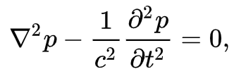

where squared nabla is the Laplace operator and   p  is the  acoustic pressure the local deviation from the ambient pressure, and  c is the speed of sound. The solution of this  equation give us the wave function of the sound. For example is three dimensions, from a point source is best described in spherical polar equation

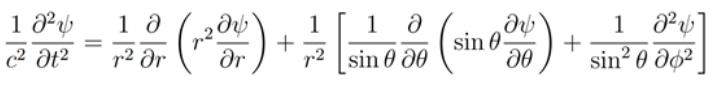

with the wave form

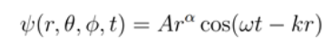

Waves in three-dimensions from a point source is best described in spherical polar coordinates.

One dimensions you can have the wave form like the following.


You can download python code [here.](https://github.com/ruslanmv/Speech-Recognition-with-Convolution-Neural-Networks/blob/master/waveform.ipynb)

## RNN vs CNN

Convolutional Neural Networks it is well known for the community of computer vision to deal problems regarding to images.  However depending of the nature of the problem sometimes the CNN may be also used in other fields of research such as audio classification like I will shown in this blog post.

Let us discuss some differences between RNN and CNN.

#### Comparison:

-  CNN reuses parameters in the space dimension – same kernel, every location 
-  RNN reuses parameters in the time dimension – same parameters, every time step

Long short-term memory (LSTM) 

Problems with vanilla RNN: 

1.  It’s difficult to retain memory for a long time 
2.  It has the vanishing gradient problem 

 Long short-term memory (LSTM) was proposed to address these problem 

 An LSTM unit is composed of:

- A cell 
-  An input gate 
-  An output gate 
-  A forget gate

Long short-term memory (LSTM) 

The core idea: 

-  Cell states: carry over memory information 
-  Input gate: let input affect the memory
-   Output gate: let memory affect output
-   Forget gate: throw away the memory
-   With the forget gate, we can learn to forget


Given an input sequence

 • RNN produces an output for each input 

• The output sequence has the same length as the input sequence

 For speaker recognition: 

• We need a single embedding

### Convolution Neural Network

The innovation of using the convolution operation in a neural network is that the values of the filter are weights to be learned during the training of the network.

The network will learn what types of features to extract from the input. Specifically, training under stochastic gradient descent, the network is forced to learn to extract features from the matrix that minimize the loss for the specific task the network is being trained to solve, e.g. extract features that are the most useful for classifying.

In pure mathematical terms, a convolution represents the blending of two functions, *f(x)* and *g(x)*, as one slides over the other. 

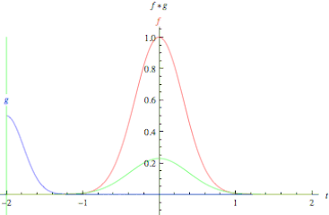

**Fig. Convolution of two functions, f and g.**

Convolution is performed by sliding a small array of numbers, typically a matrix of size [nxm] sequentially over different portions of the picture. 

This convolution matrix is also known as a convolution filter or kernel. For each position of the convolution matrix, the corresponding scalar values are multiplied and added together to replace the original scalar value of the matrix. In this way the values of the neighboring values of the array are blended together with that of the central value of the array to created a convolved feature matrix.

In other words, is a simple matrix multiplication where  the kernel matrix modify the values of the original matrix  to emphasize details of certain properties of the original matrix.

Let us summarize some of the different aspects of the **RNN** vs **CONV**


# Setup the environment

The Python environment that we will use is **Keras** that is explained in this blog post [here](https://ruslanmv.com/blog/Neural-Network-Python-Environment-for-multiclass-classification).

In addition we require the following libraries

```
pip install librosa  tqdm shutil pathlib
```

## Step 1 Import the packages


```python
from time import sleep
from tqdm import tqdm
import os
import urllib.request
import pathlib
import shutil
import os
import librosa
import IPython.display as ipd
import matplotlib.pyplot as plt
import numpy as np
from scipy.io import wavfile
import warnings
warnings.filterwarnings("ignore")
```


## Step 2 Creation of some utility programs

We define some functions that allow us download the datasets that we need to use to create our ML model and train it.


```python
class DownloadProgressBar(tqdm):
    def update_to(self, b=1, bsize=1, tsize=None):
        if tsize is not None:
            self.total = tsize
        self.update(b * bsize - self.n)


def download_file(url, output_path):
    with DownloadProgressBar(unit='B', unit_scale=True,
                             miniters=1, desc=url.split('/')[-1]) as t:
        urllib.request.urlretrieve(
            url, filename=output_path, reporthook=t.update_to)
```

## Step 3 We define some parameters


```python
# current working directory
DIR = os.path.abspath(os.getcwd())
DATASET_DIRECTORY_PATH = DIR+'/data/speech_commands'
#DOWNLOAD_URL = 'http://download.tensorflow.org/data/speech_commands_v0.02.tar.gz'
DOWNLOAD_URL = "http://download.tensorflow.org/data/speech_commands_v0.01.tar.gz"
```

### Downloading the data and  Unzip the tar file


```python
# Check if dataset directory already exist, otherwise download, extract and remove the archive
if not os.path.isdir(DATASET_DIRECTORY_PATH):
    if not os.path.isdir(DIR+'/data'):
        os.mkdir(DIR+'/data')
    print('Downloading from ' + DOWNLOAD_URL)
    download_file(DOWNLOAD_URL, DIR+'/data/speech_commands.tar.gz')
    print("Extracting archive...")
    shutil.unpack_archive(
        DIR+'/data/speech_commands.tar.gz', DATASET_DIRECTORY_PATH)
    os.remove(DIR+'/data/speech_commands.tar.gz')
    print("Done.")
```

    Downloading from http://download.tensorflow.org/data/speech_commands_v0.01.tar.gz


    speech_commands_v0.01.tar.gz: 1.49GB [00:06, 225MB/s]                            


    Extracting archive...
    Done.


# Delete the extra files of extracted file


```python
# Cleaning data
if os.name == 'nt':
    print("We are on Windows")
    paths=DIR+'\data\speech_commands'
    os.chdir(paths)
    files=['testing_list.txt','validation_list.txt','LICENSE','README.md']
    for f in files:
        try:
            os.remove(f)
        except FileNotFoundError:
            continue
    #!dir
    os.chdir(DIR)
else:
    print("We are on Unix")
    extras=DIR+'/data/speech_commands/*.*'
    command='rm -rf '+ extras
    os.system(command)
    extras=DIR+'/data/speech_commands/LICENSE'
    command='rm -rf '+ extras
    os.system(command)
    #!ls ./data/speech_commands
```

```python
train_audio_path =DATASET_DIRECTORY_PATH+"/"
```


```python
# Number of recording of each voices
labels = os.listdir(train_audio_path)
print(labels)
```

    ['nine', 'five', 'sheila', 'zero', 'tree', 'dog', 'wow', 'happy', 'house', 'bird', 'up', 'yes', 'eight', 'left', 'seven', 'no', 'six', '_background_noise_', 'marvin', 'bed', 'four', 'two', 'off', 'down', 'three', 'cat', 'go', 'one', 'on', 'right', 'stop']

```python
to_remove = [x for x in labels if x not in classes]
```


```python
print(to_remove)
```

    ['nine', 'five', 'sheila', 'zero', 'tree', 'dog', 'wow', 'happy', 'house', 'bird', 'eight', 'seven', 'six', '_background_noise_', 'marvin', 'bed', 'four', 'two', 'three', 'cat', 'one']

```python
for directory in to_remove:
    noise_dir_new=DIR+'/data/'+directory
    noise_dir_old=DIR+'/data/speech_commands/'+directory
    try:
        shutil.move(noise_dir_old, noise_dir_new)
    except FileNotFoundError as e:
        pass  #folder doesn't exist, deal with it.
```


```python
# Number of recording of each voices
labels = os.listdir(train_audio_path)
print(labels)
```

    ['up', 'yes', 'left', 'no', 'off', 'down', 'go', 'on', 'right', 'stop']


# Data Exploration and Visualization


```python
train_audio_path =DATASET_DIRECTORY_PATH+"/"
```


```python
#Load the audio file
samples,sample_rate = librosa.load(train_audio_path+'yes/0a7c2a8d_nohash_0.wav',sr = 16000)
```


```python
#Sampling Rate
ipd.Audio(samples, rate=sample_rate)
```

<audio controls="controls" >
    <source src="data:audio/wav;base64,UklGRiR9AABXQVZFZm10IBAAAAABAAEAgD4AAAB9AAACABAAZGF0YQB9AAAwAOj/0P8DACkAAADQ/+X/KQBMAC0AAAD2/wYAKQA0AAMA3v/9/zcAMADs/7T/zP8GAAMArf9y/5z/6P/6/7D/g//J/yIAGAC+/4f/vv87AFAA+v/J/+X/SQB2AB8A1//o/zAAUAAYANP/0/8GAB8A6P+0/77/1//s/97/zP/o//3/9v/9/+//0P/J/9r/3v/J/9D/6P/a/9f/6P/v/97/zP/X/+//EQAUAPr/7P8UAFMAXgA+ACkARQBrAHYAVwA0AB8AGwAwADcAGAD9/wMALQA+ADsAKQAiAEUAUwBQACYAFAA7AEUAJgD9/9P/1//2/w0ADQADAAAA4f/e/+z/1//l//3//f/6//3/AAD6//P/7//9/xEACgDz/+X/8/8GAAMA0/+t/8z/+v/v/9f/xf/a/w0ACgDJ/5H/t/8UADAAAAC3/7f/DQApANP/a/91/+X/IgD6/7D/u/8KAEIALQDv/+//NACAAG8ADQDv/zAAeQByADAABgAKACYAGwDa/63/0/8YABsA8//l/97/9v8RAP3/xf+p/9f/CgDs/8z/1//o//r/+v/a/8n/4f8AAAYAAAD9//P/8/8DACIAGwAAAAMAHwBJAFMAPgAtAEUAbwBrAEkAGAAiAEUAPgAYAAAA/f8GABsAHwAYABsAGwAmACkADQAAAPr/CgAmABgA8//h/+X/9v/9//P/2v/e/wMADQADAPr/7//9/xEADQD6//b/CgANAP3/5f/a/+//DQANAP3/3v/e/+j/0//C/63/nP+p/9f/+v/s/9D/0P/X/9D/yf/F/9f/+v/6/9P/0//2/wMA/f/l/+z/CgARAAoAAwD6/wMAFAAbACIAGwAUABEAGAAYAAMA9v/l/wYAUAA3AOj/4f8fAFAANADs/97/PgCOAFMAxf+i/xgAlQBvAMX/df/a/5UAuAAKAIf/yf+LAMYASQDQ//3/kgC1AEIAtP/M/1MAdgAbAMn/4f8NAA0A/f/z/woAJgAAAL7/vv/z//r/yf+Y/6L/9v8mAOj/h/+f/w0AQgAAAJX/mP/z/xgA3v+D/3L/u//9/+H/kf+A/7D/0//h/8z/t//h/wYA/f/a/7f/2v8AAAAA+v/s//3/DQANAA0AHwA0ADcAJgAYADQAWgBFAA0ABgAwADsAGADs//P/OwBeAAMApv/Q/2gApwAtAKb/xf9vALgALQB8/4D/PgCuACkAdf98/2gA8ABXAHn/Z/87AMYAUwCD/3z/SQDCADcAWf9W/xsAjgAtAG7/YP8bAJkAGwBI/0//HwC4AFAAg/9r/wMAkgBXAKn/h/8pALwAbwDe/8L/LQCnAIcA8//C/x8AcgA+AMn/pv/s/zQADQCw/7T/CgBJABsAvv+7/wMALQARAL7/ov/e/xsAIgD2/9D/0P/a//b/GAD9/9r/7P8DAAoAAADv/9f/2v/e/97/3v/e/8X/kf+H/9r/MAAYAK3/g//v/3IAcgDz/4f/wv95AJwAEQCt/8L/OwBTAPP/wv/6/0UANwDQ/6b/7P8pAOj/df+V/x8AWgDl/3n/sP9FAJkAPgC+/97/hwDNAGEAvv+0/0IAjgBTAOj/0P9CAH0AGwDT/xQAhwBhAML/iv/v/2QAQgCi/4r/NAC1AFoArf+Y/zQArgAwAFn/Wf8mAI4ACgBL/4P/QgBTALT/SP/Q/2sASQCV/0v/AACcAGEAsP+O/xEAZAAfAJ//ov8+AJwASQDF/8X/LQBkAC0A8/8NADsANADX/4f/pv/s/wYA4f+V/4P/t//9/+//rf+3/xEAaABoABgA5f8NAHIAcgDz/5X/yf9MAHkADQCY/7v/UACnAEwA0P/J/zAAfQBMAPb/0P8bAG8ATAAAAN7/+v8pAB8AAAADABEAGAD6/8z/2v8RAA0A2v+t/7v/AwAfAOj/xf/6/z4ALQDJ/5//yf/6//P/tP+m/97/9v/M/6L/sP/s/wAAAwADAPP/8//9/wMA/f/X/7T/zP8UACkA9v/T/+z/EQAAAOX/1//h/w0A/f/a//3/SQBFAO//0/8GAC0AKQAGAAYANwBQADsA6P/C/wMANwA7AAMA7P8KABgAJgAbAAMAFAAiABgACgANABgAHwAUABQAFAAbABQA8//h/wAAGAD6/+j/AwAbABsACgD9/x8AawBeAOX/u/8RAFAAHwDo//P/7/8DADsAKQDv/9P/1/83AH0AHwCY/4f/DQB9AC0Akf+D/w0AbwAiAKn/u/8YADcA8/+3//3/VwAtALv/fP/F/zsARQDh/4r/vv8NABEAt/9g/6L/QgBJAK3/T/+H/xsAdgANAHL/bv/6/0wAKQDl/77/6P83AF4AHwDT/77/1//2/wYAGAD6/+j/DQBFADsA8//F/7v/0P/2/+j/xf/h/wAA7P/v/zAARQBCAFAAeQC/AL8AbwAwAGEAtQCEAOH/nP/h/0kARQDv/9f/AwAfAPb/t//e/2EAiwDl/0j/tP+VALUA4f9B/5//kgDiABQAUv+3/64A5QAKAEj/iv8iAFAA1/9k/6n/NAAYAHn/Uv/e/1MAJgCR/13/5f9TAAMAZ/9y/x8AUwDe/3n/sP9JAGEAAADl/xsAawBeAAYA+v9MAIQAOwDF/9P/MAAwAOH/nP/T/zQAPgDz/5z/0P87ADcA8//Q/+z/IgAwAOX/kf+w/wYAGwDl/5X/mP/o/woA2v+f/6L/xf8DABgA3v+0/9f/GAA0AA0A7P/l/xgAZABvACYA7//9/ykASQAiAPb/+v83AEUA7//M//r/NwBFABQA+v8NAEkAZAAbANP/3v9FAIsAPgDX/9r/JgBCAB8AtP+c/xgAhAA+AHX/M/+3/14ARQCH/2T/BgB5ADcAov+Y/x8AUAARAMX/wv8UADcAAADX//r/HwAKAND/3v8YABgAGwAtAA0A1//T/zcAhABMAML/df/6/4cATACw/6L/NwCSAEUArf+H/wMAZABCAAAA/f8iAB8A9v/6/x8APgAwAOz/wv/o/wMAAAD9/wMAAwDQ/63/1/8AAOH/ov+m/+j/DQAGAOz/5f8GABsABgDe/+X/AADs/9f/7/8GAO//vv+7//b/NwAGAMX/8/8fACYAAwDe/+j/DQAKAPr/6P/v/ykAOwAmAC0APgAUAMX/u//2/xsA+v+3/7T/BgA7AAYAn/+H/wYAhwBQALD/ef/v/5IAgADa/3L/0P9aAFcA6P+i/woAnACuABsAg/+Y/0kArgAwAJH/lf83AKMAPgB8/1b/CgCnAHkA0/9r/8z/iwCHAL7/G/+V/6cA4gAUAEH/df92APAALQA6/27/kgAyAWQAKf8s/14ANQGuAHn/Bv/s//cAzQDe/0H/pv+HANAAOwBy/2v/AABoADAAsP+A/8z/MAAwAOz/qf+K/9f/KQAYAMz/mP/C/ykAWgARALT/yf8GACIAGADX/7v/4f8KAAoA2v/Q/+X/DQAYANr/vv/h/yIAKQD9/9P/5f8UAC0AFADM/9f/JgBCAAAA1//v/yYAQgA0ABEA8/8fAGEAcgBQABgAGwBMAGQATAARAOz/8/8DABsACgD2/+z/0P/e/x8AYQA3AND/rf/s/0wANADC/5X/1/8mABgAzP+H/6L/8/8fABgAAADo/8z/5f8mAFoANADz/+//KQBhAEkA7/+f/9f/TABTAP3/sP/J/xsAGAC0/5j/4f8pACYA0P+w//3/QgARAK3/ov/v/xgA7P9r/zP/tP8mAO//a/9W/8X/NAAmAJ//T/+p/0wAYQDv/3X/mP83AHIALQCi/4P/FACjAIcAAACt/+//hACxAEwA0P++/x8AgAB9AC0A5f/o/0kAhwBeAAoA7P8tAIsAhAANAJX/rf9JAKcANwCD/3X/GwC1AFAAa/9E/woA4gCOAHX/EP/M/8IArgB8/73+h//sAC4BAwAC/2v/tQBAAWEAJf8X/zcAFgGVAEj/7f7C/8YA3gD6/1b/pv9yAL8AGABr/4f/GAByABgAiv+K//b/SQAUAJj/iv/v/zsAOwD2/8z//f9QAEwA1/+R/77/GABJACIAzP+0//3/LQD2/6L/t//z/wYA6P+m/7D/9v8RAPb/0/+w/8L//f8pACkA9v/J/9D/HwBeACkA1/+w//b/bwBhAMz/Z//M/2EAVwC3/0v/u/9vAIcA7P9Z/5//XgCgADsAqf+p/2EA9wCZAMn/sP9vAP4AhADC/63/HwCSAFoAsP+A//3/cgAtAIr/a/8DAH0ASQCw/3z/5f9oAF4AtP9S/7v/TABXAOX/mP/M/yIAKQDo/+X/MABeABQAqf/a/2QAlQD2/zr/n//JAEMBYQBP/3X/vwBqAWQAFP8i/2gAJwF9AFn/M/80AN4AYQCH/1L/7/92AFMAzP+i//P/HwDs/7D/xf/2//3/7P/e/9f/zP/T/+//7P/o/+H/1//9/xQA+v/J/9f/EQAYANf/kf+t/ykAawAKAIr/tP9MAIAAGAB5/3L/AwBTAPP/fP+f/yIARQDo/7D/7P9TAEkA1/+3/x8AdgBCALv/kf8DAGQAGwCO/3n/0/87ADcA0P+Y/9D/PgBMAOj/iv+p/yYAaAAwAK3/t/80AGEA/f+D/6n/VwDQAGEAgP9P/z4ADAFkAEH/Pv+AAHQBuABL/yz/eQBKAacAjv91/3YADwF2AJH/kf9JAKAAKQCY/7f/PgBhAPb/n//e/1MAPgDC/4D/yf8tADsAAwDM/8z//f8NAPP/6P8fAEUAJgAGAP3/AwADANf/0P8DADcAFAC3/6b/AABFAB8A0P+7/wMATAAiALT/Z/+K/+//BgDF/63/wv/C/7D/wv/s/97/pv+V//b/aABQALf/Vv+f/ykAUwDs/3n/rf8+AG8ACgCV/4r/xf/6/+//5f/2/+//4f/2/0kAaAAUAMz/9v+cAAgBvAAbAN7/PgCxALUAVwANAP3/HwBXAGEAHwCt/5X/CgBvAFcA7/+m/9P/bwDlAI4A4f+7/zAAwgC1ABQAov/a/3YAkgANAI7/h//l/yIA/f+p/47/zP/6/+X/sP+Y/7D/0P/T/9P/9v8NAA0A+v8DADAASQAbANP/0P8RADAAGADs/8z/yf/e/9r/zP/X/+H//f8UABEA5f/a/w0AKQAAANP/3v/6/woA+v/M/8z//f8DANf/yf/v/x8AHwDv/9P/8/8pABsA0P+c/9f/QgBTAP3/ov+7/yYAXgApANf/zP8mAHYARQDv/8X/8/8+ADAA8//o/wYAMAAtABgAFAA7AFAAJgAKAAYAGwApAAYA9v8KACkALQAiAAAA3v/o/wMAAwDl/8n/zP/T/9D/0//M/77/5f8DAAAA+v8GAPr/4f/s//r/9v/s//P/7//l/+j/+v8AAP3/AAD9/wYAHwAiAAMA3v/o/x8AOwARAOz/9v8AABQAGwAKAPr/AAAwAEIALQAUAPr/AAAmAEkAPgARAP3/CgAwADcA+v+w/7T/7/8NAOz/wv+w/8z/AwD9/9D/xf/v/xgAEQAUAAAA6P/v/wYAGAAKAA0ABgD2/woAGwD6/63/n//h/wAA1/+0/9D/CgAwABQA1//C/wYAVwA+AP3/AAA+AFoAMADz/+H/BgAtADAAAADo/woANwA0AAYAGwBeAHIAQgAfAEkAfQBrABQA+v8AABsANwANAOz//f8UAAMAzP/C//b/JgAAAK3/n//F/+z/5f/F/6n/tP/X/97/xf/J//b/DQAUACYAHwAUAAYA8//e/9f/4f/6//P/xf+0/7f/4f8DAPP/yf/F/xEANAAYAPb/8//9/wAA7/+7/8X/+v8UAAYA5f/h//P/AwAGAP3/AAADAA0AGwAGAOj/0//X//P//f/v/+//AAAbACIACgAAAAAABgAYAB8ACgAGABsAEQDo/+j/AAAKABsAHwAGAAAAEQAKAO//5f8RAD4APgApAB8AQgBkAEwAHwADAA0ARQBaAC0A/f8AACkAMAAUAA0AFAAbADcASQAwACYALQA0AD4ANAAmABgAIgA0ADAAGADz/97/1//e/97/yf+t/5j/n/+7/8L/t/+p/5H/qf/e/9r/zP/X//3/HwARAPP/0P/C/8X/0//a/8X/t//T/+//8//l/+X//f8bACIACgD9/wAAFAAiAAoAEQAmABgABgAAAAAADQANAAMAAwANACYAGwAAAO//6P/6/+//4f/l/+j/7P/2//r/6P/o/wYACgD2/9r/1//X/8L/wv+0/63/0//o/+//AAAKACYAIgADABQANABCAEkAWgBMAC0AMAA3AD4AWgBkAFAATABMAD4AMAApADQAPgBJACkACgAKAAMAAAADAAAAFAA0ADsALQAUAPP/7P/6//r/AAD9//P/6P/J/7v/zP/e/+z/7P/l/+//8//e/9P/1//M/9D/3v/M/8L/0P/s/+//8/8DABgAGwAGAAAAAwARACIADQDs/97/2v/T/8X/1//2/wAAAwD2/9r/wv++/8z/3v/e/9P/5f/6//r/7//h/+z//f8GAA0ABgAAAAYAFAANAAMAAAD9/wAAAAD6//b/9v8AAAMAAwAiADQAOwA0ACkAHwAUABEAEQAiAB8AGwAbAAYA8//v//r/CgAYAAYABgAUACYAFAD9//b/8/8DAAYAAAAGABQAGAAKAA0AGwA0AD4AMAAfACYAOwApABgAGwA7AFAARQBFAEkAQgAwADAATABMAC0AJgAiABEACgAKAPr/8//z/+z/8//9//3/9v/2/+//5f/Q/7T/rf+0/8L/xf+3/6b/nP+m/7T/rf+i/7D/yf/F/8L/u/+3/8z/1//M/9r/6P/o/+//6P/l/+j/8/8GAAYAAAAAAAYA/f/h/9f/0//a/97/1//F/7f/vv/J/+H//f8AAAMADQAUABsAIgA7ADQAFAAbACkAKQAiACYAHwARAB8AKQAwACYAKQBFAFMAUwBCAEUAUwBaAF4ASQAwADQARQBXAFMAOwApACkAKQAwAB8ADQAiAB8AGAAbAAMAAAAbADcARQA7AB8AEQARAB8ALQAmAAoA6P/X/+H/9v/9/+j/4f/o//b/BgDz/9f/zP/T/+X/7//2//b/2v/T/9r/1//Q/8X/u/+3/77/yf/F/8z/yf/M/+H/7P/v/+j/7P/v//r/AAD9/wMA/f8AAAAA4f/Q/9f/0P/T/97/7P/6//b//f8DABQAGAARAB8AJgAfABsAGwAYABgAGwAUAA0AAwD6//r/DQAiACYAFAARABEABgAGAA0AIgAmACYALQA3ADQAIgAYABEAGAAbABgAGAAGAAAADQAYACkANAAtAB8AGAARAAYAAAADAAoABgAAAAMA/f/o/+H/2v/M/8X/xf/J/8X/u//C/8n/xf/C/7v/xf/X/+j/7P/l/+H/1//T/+z/AAADAAYAAAD6//r/9v8AAAoADQAYABsADQAAAOj/6P8AAAAACgAmADsAHwAKAAMA7//h/+z/DQAUABEAAwD6/+z/5f/s/+z/AAADAAYAEQAAAAAABgAfABQACgARAAMAAAAAAAAA8//2//3/AAAGAAAA+v8AAP3/AAAKAAMAAAD9/wAAAAAUADcAQgBFAD4ALQAUACYARQBJAFcAYQA+AB8AFAAGAP3/9v8AAP3//f8GAAAACgAAAPr/9v/6//3/4f/e/+H/xf+0/63/ov+f/6n/t//C/97/7//h/+X/9v/9/wMABgD6/+j/6P/2//3/AAAAAAAAAwAGAAAADQAfABQAEQANAAoAIgAtADQAPgApABQABgAAAAYADQAbAC0AKQAbAAYA9v/6//b/+v/6/wAA9v/Q/8L/u//J/9D/3v/9//3/7P/Q/8X/0P/o/wAAAwAYABQA/f/z//b/9v/z//3//f8AAPP/1//o/+//8//9/wMACgAGAAAABgADAAAAAwAGABEALQBCADcANAA+AEIAUABXAFMAVwBQAEwARQA7ADAANwA0ACIACgD9/woACgAAAAoAGAAKAAAACgAGAAoAEQAKAPP/0//J/77/vv/J/9P/2v/M/7v/wv++/8L/zP/C/77/zP/X/9D/yf+7/8L/vv+3/8X/0P/h/+X/8/8GAP3/7//6/wMACgARACYAKQAmADQAKQAYABgADQAYACIAGwADAPb/AwAGAAAAAwADAAAAAAANACIAFAANAAoACgAbABQAJgA3AEIAPgAmACkADQD9/w0AGwApACkAJgARAO//5f/2/wAACgAiADcAMAAfABQAEQARAA0ADQARABgAGwAmAB8AFAAbABEACgD9/+//7P/l/97/3v/v/wMAAADz/+//7//z/+//7//9/+//3v/h/97/0P/T/9P/zP/M/8L/t//J/9P/xf+7/6n/nP+f/6n/wv/T/+H/4f/a/9P/yf/a/+j/8//2//b/7//e/+H/8/8AABEAJgA3ADcAJgAiAC0AMAA3ADQANwA7ADsALQARAA0ACgAAAP3/AwAGAAYAFAARAAMACgAYAC0AMAAtADAAJgAfABsAIgAwAC0AGwAUAAMA7//h/+H/+v8AAAAAAAAAAO//4f/o/+X/7P/9/woAEQAUABgAIgAtADAAPgA+ADsANAA0AD4ANAAUAAMAAAD6//3/CgAGAAAAAAAAAAYAAwAGAAMAAAADAAAAAAD9/+//3v/X/97/6P/2//3/+v8DAPP/2v/X/97/7//v//P/5f/X/9D/0//X/+H//f/s/+//AAAAAAoADQANAA0ACgANAB8AJgARABgAHwAfAC0AMAAtABQAAwAAAPr/8//o/+j/1/+7/77/tP+7/9P/0P/Q/+H/+v8DABgAKQAtAC0ALQApAB8AIgANAAMABgAAAAAAAAAGAAMA9v/v//P/+v/z//P/7P/l/+H/4f/z/wAAAAAAAAAAAAAAAAMACgARACYAHwANABEACgAKAAAABgAiAB8ABgDv/9r/2v/o//b/BgAAAPr//f/6//r/+v8KABQADQAAAO//7P/o/+z/8//z//P/9v/9//3/AwARAA0ABgD9//P/5f/T/97/+v/9/wMADQADAP3/7//l/+///f8NABsAGAAUABQAEQAKAAYABgAAAAoAGAANAP3/8//o/+H/zP/J/9P/0//o//P//f8GAA0AFAApADcAIgANAAAAAwADAAoAGAAUAAoAAwD6/+z/3v/Q/9f/9v/9//3/AAD6//3/7P/z/wAAAwAKAA0AHwAfACYAGwAYAC0ANAAtABQAAAAAAAMACgAUACIAOwBFADQAMAAtAC0AKQAmACIADQAKABQADQAKAAoAEQARAAYABgADABgAFAD2//P/5f/e/9r/3v/l/9f/3v/a/+H/6P/l/+z/5f/l/+//3v/Q/8z/tP+p/8L/0P/T/97/7P/o/+H/6P/v//3/9v/9/woAFAAmAC0AIgAKAAYAGwAUABQAHwAUAAoA/f8AAAYA+v/6/wAA9v/2//r/AAAAAAYACgAAAAAAAAAAAPr/7//2//r/7P/e/97/6P/v/wAABgANAA0ACgAKAA0AGwAYABQAFAANAAoAAAAAAO//4f/a/8z/6P/6//b//f8AAP3//f8AAPr/BgARABQACgAGAA0A9v/v//3/CgAKAAMACgAYABsAGAAfACIAEQAUABgAFAAfAA0ADQAYABgAGAAUABEABgANAAYA7//o//r/CgAKAAYACgD6/+//9v8DABEAJgBFADQAFAAGAP3/AwD9/wAABgAKABgAEQAGAAAA/f/9/+//7P/s/+H/3v/h/+j/4f/C/9D/3v/a/97/1//z/wAA+v8KABEA/f/T/7f/sP+m/63/tP+w/77/0//Q/+H/6P/X/9r/6P8DAAAA/f8AAAoAJgAfACYAIgANAAoACgANABgAJgA+AEkAUwBTAEUAPgA7ADQAPgA+ADQAMAA0AC0AJgAtACkAHwAGAP3/AwAKABQAGAApAB8ABgAAAP3//f8AABQAHwAiABsABgD6//r/+v/2/9r/0//M/77/vv++/9D/1//a/+z/+v/9/w0ADQAAAPP/3v/h/+X/4f/M/9D/5f/h/+H/5f/l/+z/8//9/wAA/f8AAAAAAAD9//r/+v/z//P//f/9//b//f/9/wMABgAAAAAA8//s/+z/+v/6/+z/6P/o/+z/8/8AABEAFAAUAB8AHwAbABQAEQANAA0AFAAGAPb/7P/v//b/AAAGAA0AEQAKAAoADQARAAYAAwAKABsANAA+AEIAPgAmAAYAAAADAAMAAAAKAAAA8//9//P/7//s/+j/7//o/+//BgAbAB8AGAARABEA+v/s//r//f8NAB8AGwADAPr/AwADAAYA/f/2//b/7P/e/+H/7P/s//r/AAD9/+//1//e//3/EQARAAYAAAD9/wYAEQAKAA0AKQAtABsAHwAtACYABgD9/wYA+v/s/97/1//J/8X/xf/C/97/5f/h/+//9v8DAAYAFAAwADQALQA7AD4ANAAmABEAAwAGAPb/7P/l/+j/5f/e/+j/7P/9/wYADQAGAPb/7P/s/+z/8//9//b/8/8AACIAGwANAA0ABgANAAoAAAAAAP3/9v/6//P/3v/l//r/AwAKAAMABgADAAMACgARAAoA8//h/97/7/8AAAAAAwAAAAYADQAAAAoAHwAUABQABgADAAAA7P/s//P/9v/2//P/6P/v/+X/0//v/wYAGwAbABQADQADAAMAAwADAAYAAwDv/+z/8//6//b/9v8DAAAAAAAGAAoAIgApAA0ADQAfACkAHwAmADAAMAAiAAMAAwADAP3/7//h/+//+v/9//r/9v/6/+H/1//X/+H/5f/Q/9f/7//l/+X/+v/6/wYADQDz/+z/7P/s/9r/0P/o/+H/0P/J/8z/3v/T/9r//f8AAPP/+v8NAA0AEQAUABQAFAAKAAMABgAKAAMAEQARABsAMAAtADsAUABJADcANABFADQAJgApACkAJgAmACIAIgAYAB8AFAADABEADQD9/+//+v8AAPP/6P/e/+//8/8DAA0AAwARAA0ACgADAPr/6P/l/+H/2v/Q/7v/vv+w/5X/qf+7/8n/1//Q/+X//f8AAAYAAwAGAAoAAAAGACkAOwAtAB8AGwAUAAoAEQAbADAALQAwADsAJgAKAPb/8//6/w0AGwAfABQACgANAA0ADQAYAC0AKQAiADAANAAiAAAA8//a/97/6P/s//r/8//s/+//BgAUABQAEQANAPr/3v/X/97/5f/l/97/0//T/9r/2v/o/+z/7//2//P/+v8AAPb/9v/z/+z/4f/l//P/6P/z//P/5f/X/9D/yf/C/77/xf/J/8n/0P/X/9f/2v/s/+//8//l/+X/AAAYAEIANAAtADAAMAA3ACkAMAApACIARQBJAEkASQBJAF4AVwBQAEwANAAmAC0AKQAiACIAKQA0ADcANAA0ADAAHwANAP3//f/2/+H/2v/a/9r/4f/e/9D/0//z//b//f8DAAYAAwD9/wAAAAAAAAoAAwAGABQAFAAGAAAACgADAO//6P/Q/8L/vv/C/9f/4f/T/8z/1//Q/9f/4f/e/+H/5f/o/9r/6P/v/+z/8//o/+//AwAGAA0AGAAiACkAIgA0ACIAFAARABEAGAADABQAIgADAA0AGAANAAAAEQAwACYAGwAUABgAEQAAAPb/6P/9//3/5f/o/8X/rf+p/6n/vv+w/5j/fP9d/zD/EP8N/wb/9P7t/ub+//4X/xf/Df8p/0H/Vv9d/3L/kf+i/9f/7/8bAEIAgACxAOIARwF0AcgBGwJoAtQCFgOFA84DBgRWBIME0AQBBRkFPAU/BVgFPwUPBc0EfAQpBJMDJAN9ArMB8wARADP/Mf5I/Ub8Rftt+oT5mvix9/z2ZvbR9Uz1uvRu9Ef0E/Qh9ED0hvTZ9Dv10fVx9j73FvgN+UD6gPvH/B3+n/9VARYDtAR5BpEIeAolDAIOKBAyEsMT/xRcFqMXexjuGAIZBhl0GFMXMhbkFPkSMhBiDbQKxwdMBIsAIv2L+dT1R/Lv7s7rh+hj5f7iMuFx37PdYtz528nb09ti3GPdoN7B36nh9ePb5oXpOux37/Xy7vZK+r3+KwNGBwALMQ9/FIkY1RwfILojKCfxKb8sZC4XMEEw4y+dLzUviC1rKiEn3SMfINobaxfzEbAM3gZmAVj8Jvc28sfrC+cF407f/duF2JrWEtTW0svSvdLw06XU/dXv1wbbYN/84Vjlyei+7OjwzPRr+W38lf+cAsAFiAkeDBoOEQ+sEOQSBRQDFYcVrRWAFXYVMhYgFnIVcRSZE4QTAxONEhgR7Q8mD84NBw2uC2QKLAgNBuwEdwMKAuH/+v1p/Df7X/oN+fP3FPcd9qD1qvXf9ZX13fQH9cb1ifbL9qX2Jven90D4yPgw+aD5MPkf+Zn5GfoB+tL4bfgk+Pf3h/df9u31EfVE9O3zw/Pi81DzQvNF9br2mvi4+cf8eQBFBOgImQvBEL8TexjHHHMgMSQWJU4nKymKKrsqLilKJx0lYSJQID8cJBjkEsMN7QlGBfAA4/po9Yjxtu0X6mHmeuKU36fc5NvP2zjat9nt2P/aq9w/3uTfyuDu40zmmumW60PtUO+w8L/z2PXE9hj3APcp+UP6TPsp+zX6PvsW/Kb/kwFaAlEDgAa1C4YQnhQbF5oaLh6QI1ooFiu0LNwr5ytULT4uiixfJyQjah8cHA0Z6RNgDhwH3QGI/rP6uPco8snsGekw6F/nGuVO40fh++Bt4Vrk4OVD5eLm/ehI7FTv2/Fe89vz4PY7+bH5Fvr1+sv64PjB+Iz4avYm9cbzRPLk8Lfwzu8n7RXx9fTW9ADzoPc6/7gCxQhnDNYQERUuHKIjxiYlLJwslSxSMDQ1HTavL2YtqiqqJvAk8CCDGw8Skgs1B4kDwQHi+Tbwd+tP7GvquuWg4s3gAN543V7grN+84BjgDN+z4b/kxOlc507nOOsQ6hTsde5q8AbuF+q+7DHtM+5b7SXqC+vc677s1euu8Uz5ava39CP+/wlaD+cQ0hYXHSQjwipZME01FTeBN3g26TnjPhg7uTMcL9AsxiiJI/serBbhDDkFLQJW//r39O8n6RTm8OSE4vLdhdwo29Xat9sL3FfgCuAQ3yHjU+Yw6kzqW+sl7gDtUO8C8oTxMe9U7cXuHu6K7sftQeq46vHr8+x668Hy8/n39YT1yQAVDeAQeBT0GhggGiddMI02Rzg8Ovg6SzjjPPRAWDp8MOcrminSI8oeLBlHDk4DP/7l+0L3NPHA59TgFeAD4tTeWdke2RvZddmp233eCuD83ybi6eZ06SftiO+p7gXw2PH89Iv1DvNQ8crvpvAE8ZPtueuO6rLpuOpU63DrgOrb8YL4JPZ0+NcE6A4NE0AWzh5yJjMqqzNHOP47rT0iO8E8Tz8bQW852C8lLmgo5iJZHcYVSAyqADr7o/ko9KvrR+Pk37rfXt6G2/3Zz9sb2avapN4m4nvlieOt5pbr/+1i8Qny9/Es8l7zJPYv9Kbw+e7k7rvu1+o66vroMuXd5T7mk+cb5qznsfMV9RDw1/kHCaMRTBViGJ4jvyxUM1M9tj7lQ8VF2UBbRKVHUkfWOrcw+i4TJ80iXRlGDcYEU/ng9Lvs1Oby4zXYgNN5047TvdLN0VjSDNJy1Vvaid944YTkgOiJ6bnvl/Tr9BryGvRY+qf3JvMl8mryRPLC7qHrKepI6HfpVuqH6PXp3OdX7+j7+Pog+hQGoxNpHDEk/igXMok4SkJ7S75JmU42Te9Fvkc/SPhCUjR0K0UkLBnsE/QJgP398E/o3eNb2k3WydNXyc7F3MdzydbK4suSz3jSy9jd4XLmoeub8rH3k/paAMUGtgX6AHsBhwasA8b7Vfiq9cz0LPL769nn/OXx5cjlseRH59fk1ODm8Ur+kPY8+BoKJxamHXImJS6ENVE6W0aeS49K1VEaS7RBcEQtRro6yyt6JFEY4g96B2H9l/TP5UbcINR90/rVncsbxEbFvMtfziLTItln2dbfFudx8BT5h/uA/+P+vQPACfoGpQPv/6MAMvyn81vvVuw/62PlVd8s26LZf9vy2Vvcht1c3WTbNOTa/1YEE/jzAqMZpygcN109dEBpRIJNY142XFNdolysSaBGdkg2R6c1siJ9FzwDYwHQ+5Xs9N5Y0EfMLMSbxhDMvcFCvhTA08h90SfaH+Id4UPpZfND/D4GtArvDBUJ1QkYD0YLDwUKAmH92/Oo6RHmK+cA5KfcxNTk0LvT/ddi2LbWKtoX3Z3eHt998e4OzAjs/agSSC5DQrJIMUrwULVXh2Vna4Vmo2dxXLxKI0TVQpo6+SGxDzr/LPDo6gXfi9N4yOS7hrfTtxO9gsO/vqHBJs1v0/7gBO9H+Hn9vv8CCrYWrRtlHH4WmRGNEvYMTQUm+yH0j++N37PUHdSz1K/QiMUUxPLI5suX0A3Tmtak3kzizOq/8zL4YxCDId4Z/h71OsFLlVSuW1Bdv10FYrJu42iuXaJWC0ZzNQQtFCqHE1b7xe5i2jnUTtK3xoC8crFWs4G45L2ZyUfM9c5z2r3n+vXOBwwSjhE+FWIgKSrSK2MlDR1qEh4OMQkI+s7txd1B05nPeca2vw669LgfvC+9ocNeyX3LFtSw3a7km+yv+Df/LgV5BMMPYTWCOmEqwjDtSAtbwWBoXxZeZVnMWMZhvlQKTNdDmSg1FpQQeg3S+mjmy9j+yQLGVMllyYXDvcFWyLTIhdTN6JPvevWe/CIGOQ6KGYQojCnkIbcfhR6iHfIfaRYzBCj0tOpM5O3Yjs8bxke3ya/ZrkayZbaZuOm8rMHUy/bXMuP07Sb3l/wTAasH7hKPGgQcShJ0Fq41az1bK8crqD5rTglWuk8HTBFKfU7NTuA+jTY9Mq0dDglYBcv+NvTZ5/HaMtTJ1TDZndoN2cPcoeXL5wnurfnF/1oEFwzMDN8NARIGFYIUUxGLDfYE6PtR+gD3Ge/W4wbXTNFGyaXK2MU0vAe6K7uDwlbCCciZ0bnayOEP56vxT/t6B4oMIghWChMSMBklF/MTdhGRCqUhXDQoJQ4ejC0bPS1INEjpSJFF2j8OTKZB+jmWN70pDxhUCxENowQY+wLyOeWJ4TLjK+eo5SnkYunq5xTqdfAw9yn7gvrj+r34Vfrh/1T+y/jo8ifv9PG68uHsdOvN6JLkO+T+3s/h6+Ec3nDYYc+O06TaHtsi2dPXbdh63lbqsfOL9bH35fmM/B7/AgbFCBEEywHO/mQC4PqO/egbxigLGjMXCy3mRu1dFV92XZpXnVuDaaBdB1nzUGg9XCHSEsMPIANa+83mb9MaytzJ8dJ4zpnNU9GEzZzTPd0g56fvSfcb92fynvStAoIQHAnzALn+mP3M/V/+bfjk9BTucuSb2yfWNt/y29LQO8mwyB3O3tMR4MHhO9xh4tzryPZHAegESgNn/VH+HQHjAWMBQf/b+Zr65fnF7H8KIy/RLwIdhyjdRR1eb3LFcZxyHlpYaJhnh1TCWM4+0CblALH3tfM75MXfp8eGt1uwHbt5xi7DJM500LjPrN1S7p/7CgBnCrcMIQpfFEgZFBm1D2wNKQbp93/23OsY4g7axNTNzeDBYMTOxybLCs1V0rrSWtNB5mzxMPWP7/vzEP14AZgIKgdkAqgB1wLqATIFhQV6CcQDZAbBAbIFnCx7POQ0NjZcScdbz21Ecad0U2X+WUBcHESvOtAwThZj9gDe+NZ40OjI9sZJuneyFbqTxQjO8djc6Rfq0fXaBDYI6Q0nHLonUxneExQVoBVuDAEF1/ca4Rrfl9T5ykrD7MC9v5a0yrxLyCPLqtEA3AXhc+J/8Jb+uAItABgAyAGCA6sHhwQ+AJABhQMN/YX6Cf23/1r96QKK+/UBfyVENGo2LTmzS4lidHE3csZ2sGmGYAlcRkLFNMghDAxE8C7U8sqMw229oLxLt3i32b9azTzYD+NC9RL+bQdjDH4WVyKkHnwfZSBdFxoO6Aa9+E7y9eGT2jDPuMBuxBG6B7zVv/PCg8rO1JTj5epv80cBIAcWBwcNkg9MDwAJywNcAQ39cvmR8G3r4ewJ7nnsGu5B8JTyM/uM/mf9lRcYOalDcEZ+UXFiD3X/fxx/CHNMX5tWfkQ+LAgatQBH5ULNFbzlscCuOrNeuBi64r7gzlTeIO0kATYOTBkfICsptSR1Gc8fKyPOGGsGoPPs5OHd7dgU00rDGr2Xv328tMLiyyzXMd4Y5gfzR/heAEgMARKGECgOYA7kCkcD2fxq+N/zPe6x5qriH+Qr4wDkGecl7KfzX/oDAD4GQwVGHFlHSlNDVZ5c/2bNdMl82nqNbehYZUbKL3sSOwIh8LbUxr7erViogqy3t8DBisrh1Xbks/bZA1gc6islLgA16DLCKgcgWxgjD1gDbPGk3EbJs71owA68t7mwu6K7jsTd0DjgpOtJ9bEC4QhSDEIR/BRmGHAY7hLVC4oEgP1f9qHtBuoK6KPii96M2obb6+FW5kjqS+7F9Or8owSaB3wI0iWNS9JT7lFGWYBjsnAId+hvjVrLQpQ2VB45AfbuLNvTxLe10KskrCyzj8Nh0+3chu6oAVwQJxoCLiQ4wTzEOoYngxlZECkG7fXU4tjPwsI2s7uv3rGts5/Ac8ci0QXh1PG/BCYTfB3dJTQoHyaXISAcTxdtEOADHfaJ6fbdPtc00T3QMNPn1jHaO96S5J/sRvP4+lwBFwrtDeINoAvBDqsxa04KUNRKR02KWjVooWY+X7pL/Di9K2MOe/a/5HnTW8kMv7W2vLauvt7P6N+D7kv/ogxBGUQjkSzYMQIymC4HIBoQqAHM9BDqAt8i1ebJPMH4wQLG7sxM14HgWuq881r9nQUzDM8QvxVfFKcNJAWh+hT5y/bB8nTrb+Sn4GXaKtqG3fzjLuuP78PxXPA/8a/2o/tk/TP/mQAn+g371PkDBLsorzzHQFBEuEzfXfpnI2giZctPjDwZKxAMx/op6EbYRM5Kvxi8drqjwnzXAedf+AIK0Be8Ig8rKjV5OTI4VC3iJqIfQwMx7a7giNzj0iDFDrZMryO058F9y1DP2t8e6jn4BgJICoQToxfOHHkX9wupCBQIrQa8AIn0luuT5TvkzeAj3lXjTOZm5fXh1OI05irravIA9Qv6zffV+qH+PAECH947PESwSepRul7lZzhofmb6Uto/2jIKF2EA+exs3MbR/cRBwPi9QcT02A3qX/rlCLkYfSYGLC8y+zEUMKQvziDvCuX3zejm2j3K1L6rtoCxubSRt+W8mcmx1/PoVfZ5BEkREhhlHqYfoh01GIQR0QtNBaP9L/Yn7yDnkOH03lzd69tw3H/hwub26HTpZukg7Y71hfq4+3z92v0WBScDbg5kKCQ29EJMTHdXfWGCZv5jQl3JTmdH+TKTFDUBD+mi2/zOa8SXwcG/B8kI2NHiWPYsCocVUiEYKBItejGrLQ4k7xdrCND7Q+ne0xTG2buOvCK8RrhMvEfBb89834zrgvxBCPMTPRsbG74dkRsZGBMSgwqcBNz8qfT067ji2Nzv2fbZDtz93argBeFH4xvo6u2e9Gj5Q/yC/rT/df88+EYH2SvnQGpHGkvVVTRjJm7ab5VjhFBiRlI2kBhr/ariUM+Hwsa6M7fOtE/ApdIo4bD0ogjTH/8tKDJNM/00QDhsL3Ib7ASn9V/l89Xzwgq48bLhtSm8hLxKxQ3RBuR79EMBQA5tFuocOyA6HSAYDhHjCzcG9v3i9Z3t3Ofz4p7fJt6K3cXd8t/34rrjAeUY6MfpYO6d89T3oPml/OX9y/zQE7U1H0jUTnxYzmQacchxcmvtXelQHkmTLacNvvCt28PLR72Utfiy6bgCyOHXdubb+QUOTSCvLyM3PTbRNfw2VCtqFEH/3O/N4CLRmMJUtoOxLrS+uQi/Jsma1tvkc/M6/zMIng7ZFDkYdhVcEMMJ+gJ0/vf5t/SP77TqPOXa3Rfbu9vW30rj8eXN5mvmg+rQ7GnvEfVn/XkCawKh/mgTIzVsSqhTIVxDaitzGHSpafRZcUubQ6kuBxHR8+HZgclXvNG2UrcwvmjNittA5wf3Xgm8HMksujb4Osg2ITR5KtsT0ABQ85XqAt0vyvm7UrPrs3a6Sb7Ax1TWWuRI8Jn3iQF6CY8PghaaFsESBAs1A8f8nvaP86Txae1754Lhftx33MXfZuXp5o7o6OwZ77Lx+fCl9DP75QRwBbsEyxhGNVRIX03YVexhom06baVizUz1PBg1QCNbCw7vP9ziy6rAEb5WwAnKC9rS5+Hya/39CmIaMSRLLvYy2DFrLrAhJg3++Z/uEukA3inRacdRv6+9Kb4ZwRPKiNgp6LryX/ouAWcGrwkYDYEPqQ60CtAEy/w59nXyXPLW8L7qOee/5B3lLeRF5EfncOmW6y7vZe8x7bTuf/T1+lj83wmSJB8930rZUfRZ12Wlb25tl16NScs8hy6qF1/+Geed1o3KMMINwE/Cqs393W7q8/UfAkcOYRffIMgp5SxKLXksfSCpDOL7w/FP6lrir9qb0IPI38WVwjLBZcki2Yfoz/Ii+Tz8Df3/AxwJXgshCrsIzgWM/PL2Eu967//tXu/q657nQeac4uvjE+PQ5vzp4+8Q8mryhPXi9wr73w1DLfhCe00HV2Fhd2hwZiNfoU8gQrg7dCsiEzv3geLj0i7Hj8PMxHHMotvQ6OTwxvmjBGgPXxjOHlciwSPtJBgglRW0CiX/3fQB643hE9sg1lzS+81VyhHLKc9y13/f/ubj75L3Q/xf/Jr8TP1h/R3+Z/0++RH1z/IA8TTxoPGu8070S/KG8PHtq+3K7zbw2PGn9dT5XPiZ+S0PNSvYN9FCKVIhYF1pG2VXWRVIoT7NNxsmLxDv+77qVd2U0NzHEsdFz4PfJ+1J93gBTQmKDkMUCxgJG6sc/xzqGO4QGQcE/MzyjOv65CXfxdtf2EzT4NB50ZPUq9pv4s7pYOwA7xHzOfaG9ibzou5p7aDvt/B670Huzu/D81H4hfpd+Yv5uPsg/J74OfJx8Gry8vY99q/6zQ9yJgkyLTmuRJZT1l7DX2VXKkifQd06uCjdErT95O7D5M/bh9Ua0CnT4d1/5S/u2/fxAyQQexbAGGYWdBTBFrYUNA2qBpwCy/7I9G/oTt+12hncwNxu29XcOOAp5BjmQeg87S3xnfO68g3uJeiZ5KzlauXJ5NTmiOt68ef24vu9/loCcAdKCfgFQwGE+5P4V/fE9iPzNPdXDZ0ggCbOLZI7W0gPUahThU+kRLJAkjsmKgEWhwSE9aPoJuDH2nfWG9me4eDly+mn8VP7dwWeDngUQRc/GhQd6hhaD8sHgALQ/U72/+3g5Sbgf99n31DeTt9O41roj+vo7Knsxeq96ZHonuWO4vnflt7K3srg1+SF6dPwofjo/UIAMgP7Be4FdgTeAsADmARYBUUCWgCfCkYcXyekLco3oUI/SplKakUnPLw30zYpLAcczA7xA473/eoU5K7eBd3w4tbl6eaF61n0BvuY/a8DAAu4DyYV4BaZERwNpAkyBaX6GPGa6yfl8uEx3lvaydln3TbhK+Gx4HjjoOSO5uXoiuiC583mPuju6VvtufGZ8/z0Svgf+0X9F/8wAAYCLAS2BdMGFgV2BGYD3gi4FZEhrCcqLbc0Az2AQ9FCikHLPPA7CTa0KnMe4BJSCFP9GvS07Pznk+X15TDiduK75srtm/Rp+ocAMAQzCGMMYgvqByIIsgdUBbD/tvg47+rlJuDJ2frTjNQz2X7cz90T32/gA+LJ5qTrue208CH2Hfpm+iv4E/aZ9eb15feA92X3Dfl5+yf+4f1y/58CdQjrCrMOiRZNIOkkGygHLww0yzrZPEw7rjVzM/QxmCpHIeMYRBDxB/3/aPdZ7nvp8ely6HTnn+gu69/rn/Cq+av+NACfAh4I2AeDBpABMvz19ir1V/MI6zvkx9xI2YDVk9b42Ojbb+K/6Bzt9O1C8Zv0rvcB+g396P8iAGT/M/uJ+M33Sfl/+E741/uA/9IBQQKcBA0GFwpGDYIS/RfoHQMi5SYnLSAxqTJEMJUulyvGKiYoxiJsHNwWtxDcCX0CtvqX9BHz6/Lm777udfCn8Z3xsfNJ90P44vmQ+l35FvZl9Zbzeu8c7SDr/eio42fhC97c3NHeK+Fq47XkIOkz7IXvA/Nv9Un3nPnV/Fv8PPyx/Xz/WgCM/sD+df1yAO8EbgbJBhkHzgmbCu0Nrg8wEYkSmRWMGp8ZTRpGHAwhJiQYJGwidx4HIM8fOx4/GpEX4BYbE6kOhwYwAiz92/tt+NjzMfPw88b1MfNG80jwLPJA9Df1IfLC7kvuAuyK6uPlTuNa4vXjG+QA5FfkT+aH6r7siO9u8qD1xvdf+rP4e/YW+JX5Wvtb/Pr7FPtR/nYA5wOIB44G7wjmDdEP+Qx+C5EMPRAIFmUR0Q/+DWAO+w2+DNEL3Am6EqoTVhX3ETATkBYWGHkZ9RShFn4WwhUKD3wGQAFy/RT9Hfrq+F73Pvfk+HH0ivLk8FPzhvRc9Nbyou7o8CXu6OoW557nwupz7e/wg+yp7ELvWfTy8o3wD/bQ90H9fv6C/Of4CPrm/pH9gP9E/7oDKQa0Bt4GVQEKAiIGYguiCFUMiRCLDREPOgydCUMJOA3qC+YLgQ0aDMEOJwvxCUILYgs2Cp4OLw6uC5kP4QwuCf0GhQkUBGYDnAQiBEUAr/yf/Wr2Eff69U70bvLt9e3zsu3F8LTwne9K7QPzl/Qv8ir1UfZj8Njv6/Ym8XjytvaZ92X3E/gK+fzymvga+Mz9Vvsw/dwDnADqA6L/pAXF/YYKfQ2vCYYKYAr5EhAKmwwLB0YHkQgoDIEJTgG0BgkKeArzBG4GJwdsC78PHw1+CXgKCQqRCCoH5QAyBeb+iQHsACD+kvm4+aYCFPmK+/P7rAHG+8T+4gBh90/9a/kS/nD6+Pjz9Wb4xAET+EP4nPcy+KH6NfxB/wDzO/kD+zr/Mvp28+D8RfmzAQX6dPyJ+Pr7FgVm/IAABvvcB+AB7AJYBUj9OQVrAE0L3PxkAq3/dgLJBK396gPx+KsL1ARGC8sDAQe7CroDRg8GAB4EywNvDZ4DN/3HA6r7fgOQ/C7+3fah/gkGkvnc/n/2/wHH/vwBswEt9WQAuAAzBpv0y/ra/QX6Yv7q/IX8yvMIAUECfv5F/WT9+AOfBA0G4AMwAq0GPv90BQMC0AB1/xgAPgQ6+7IFefl5CJH9Yv4jB5X/fAgv8lsLKv7S/MgBfP22AU/wtQl7+J/7rANW/RAGHfarCVoAsf2JAcIANQcG/VoEv/uFAeb+ZP3G+xj7ugMB+oP9v/mRBs/2hfxdAtf/qAGG9LMMX/qZAtD3CwXVA6z2yAzi9RAKUf4lCOkAtv40DZL5mAzgAYwFWgJ4AUYH6P1vAlgDrwFr+Q0CawSM/of7/AGeATf90gNP/dsCKf0Q/18BQ/x5ADf5CgIW+gj64gBT+fcAPe4PBQT+wfht/vP1egcN+5AFhvYPAa8BvPd0/v/4wP74+NP9BgBf+r8AtvhDAzIB7P+oATH+EQSvAcQFs/qDCl730QkgBdIBWgId/FYV2fr5CsIADQhyBoUBIgif/VcLyQDaBE4DQgB7BYT7Agb9/ez5sgWq/Y4GwfQbAL8Ek/obAkD6kANA/EYFnP8J/YT7wv1qAfv+SPsD+bMBjP4w/4j1HwCT/vP9UACp/yz72v2jAKj8Hfh7/PP9aPlmA2v7y/549MIIFgO9+EP6nAR3BZ3+rwNT/RIFMgEPBagBUQPV/v8HwgDPDpH/+P4JDBkDWQyc+24KawDmCz0IsftICFb9NAtK+gMEn/3dASADaPl7/pH7Ogai9ub+8/uo/B8A9fZL/yn5uPWEACz76vpP+Vr5kf3CBGT5Y/gNAMb5TQch+A/+9v1W/5r+9P5k//fz7ASn+WYD3fj8/OL7C/4l/z77IAWv+k8COQMNCJ78uwLxAekNdf1GBSUKQPw9Csf+iA2I9SgK+AXl/ZUIC/5+Bez7Dgmv/l8F7/vgA00H//4kAcIEVv1mAZsIUPUyEFnswQ45+Oz/fvz19LIN8emGFK7kNA2+9Er+TAAH7wwSQuK6EvnwOgSZ+Wb2Iw2L8RwLx+9lERj3fP1kClzyyg8M9CQBCAeC+DENTfFWCDsCi/kZCx/zWBS/9WULeQT+AJIPDvH4FkD6JwlvAhD/SxBi79sR3vvs/WkF7PekD5D2tgG/ACIAMARr/wgHvPWrBfYGwvkkBbP6fv6+BrD0PAUF9AX6rf/m9UsKQeZnCpnvewPuA8/llBK/5pIRYfX698YE7/BrE2Dq3Q7d8uX9uwjw85QMeehjEDv3UQFUCRjoKhq07E8MdAUQ7q4iH+QSGPf1nwg2CMzuZR7x5zMbLPBlC4kBjPoaDJf2QBL97osPMPsu/NYKr/rUAsf6TAYKBM376P1wBWT/2v8GAicHl/YwBvMIcfSHBpf6sQZJ9TwDBv+c9U/9Zv6ZAmLv7gNB/agBQfuJA/39AfpbDeD2PwUf+9r/gAaA++8Eb/kPAy78gQcT9ggFmQKJ9sIGTvqEEUbtLQCbCNkDGf6499YQK/QEDZ/7jwdCADjz0BuG8sIGoPczCqgB3/VCD3HwahAa9AQDdwMb+fQJVu4PEDT5Z/2H/y7+aQeS914An/vCCOH9rvdoAEz5QwWC/C3zZQv07xYF+v8K+wQHtutqEG36KwVy+/750Aic+XMP1+g2Dkv2tv5HEFjl3hMX6rYS2fyq+1EF+fTXGRLxygtD/mD/nQkgAdgJNPMcB+MJcPzgBTv5pgYpAJADlQi493YECgBBBmEAT/u7CJf20gWjBGv54gAe/WsIK/j8AwH8+fZAEJz3iQNS8LMM9v1y92ULL+4uC/nyfgVQALH1bwIP+oEH+fYN/+z9xvscCWv5hwB0/Hj4rg1T+dz6kfuTAe0PKerVCwD3kAUSA3/0yg9l7RYQ1PGuDWf9DPQQDs7vchcJ7o4Gov9b/ooIJf+KBI3wjhNHAa3/fvrABfoCq/5rAoAAl/xF/XoLQ/i5B7H7GwBrBOYHofz1/A8HSv4EBV/+zv6O+xwHsf2EAKH4xP5ZCMH2fgPn+EcDWgCW/r3+Q/q2A0//FgGJAff1zAzi94gJvPU5BZkAyvXJFzbjdxgr4zcX7vxl7dwWIuTtHt7mURKA+Wv3/Bak6dkUv/OyBR8C2/nREc/wAgoY+b0DxQ4P5bYW4vPSBccFzO5pGIjefB2Y7H0CNQfM7F8aF9/pIGbpegvq/tn4kRmL4hQb2urbDb/5N/n1Dtbl4Bgb5tEN1vit+2QG1+oYF63oxhOd7e4BxQr07bgR/+moEsH0CgJVA/71Pw0Y8zgHbfosCNP9QvcZCbf/5QJDAU38NwRfA04DcPr/AcoJ4PSBD5n1LAiVAmv5lBBq8NgPOfRyCjj+vfjDCQLwHRYg6U8MK/qp/w0KhvDWEtTx4Q5A8o4RZvoj/oMGIfBpGFjtwAca8DkO/Pw8+GIF2PWXDsPtLBee5YoO0ATf7+cWrONkG1HlKxD/+qbwjhva17Mll99jFBL6J+/tIMDUwzFw1F8aQf2x8/IfAdSkLbHV8iM28ND76xDd3QEtCNbMH5zmvQfKC/bozB892z8eZ+roDJ8CnvJrE6Hn4xj28LMMo/c8/rMMsfMqCyn30ABfAer+FgGE+2L+7AD6AkcDavYpADUDvQdW+2L8igQp/WsKBv3h/TP/2QFm/o4CYwE1/hr4nQVTBtL40gNA9GEPofpU/s0ANfzoBhn+e/5I/xIFhfr5CIv13wdr/23+OgTn+uoJLfNnCmP6kwOv/Cn9Ggyr7V8SbPFyCBgCYfduCgzyTxn84ZcUzvw3+fcLiO3CGWHiNxel9sX9nQm38E4U0ustE6Tv2AfbAGv5ThCZ4poWoPU1ARf9yfv5CF7vqhHV7eMLAwJC85cOjfYXDrD0xAP1AXD8iAl47mMQCPj3AB4ER/YwCLH9YQTk9K8H4Px5ApUCyPLfC7P6NALo+/gDlf/6+1MAzAinADjxmw6Q+AQJxvmX/DUFsfnJBjn2IQq69AoEv/3LASQFwPHcCUf6rQg6/Rb8wv0BBQ8DR/hBApICmv4+/04Def9E/zQC1//wAGf/cPqfCNL+lf1b/NQCGAKY/TMEkPh8BNsA0P+XA4D9MgMU9zsTo/XnAXQHIO3oHVTprQpc+pX/PAWx94EPp+TtGtjvkwcN/8jydhem6mUNN/mH/T0I1vKNErDsZAYSB7DyKg/c6zUWiux+CQoEjfBKFDnn4Bgc72QCzQI39ckT9ed/EO31yQD2CGPw8RSV7KgH8AIl/VMGyPK6EK7xkA74+MH69Atz838OMfOTBVEBa/lPCGL+9P6T+DgJMQc99JEIvPUjCRYDAPcXClXyIAuT/gsDFvavAbMDZPvYDfvrFwp7/oL+/weO9WgEHfrWDlX0oQPQBvTvPhNe81sNeu+vCSQDIfZXEePprhPe7HsU8PWn+WYHZ/R7FpPrOAt79qgJXf34Af0EafGzDnv0ng649er+2v38AY4EO/mKBB/z9Q7s+df/YgN290oHD/6oA1/6LgHV/lb/EglJ9WcGuvS8DbMBA/W3CkvyMBMa8lYClQTP+PgDRfWTFKTtUwb1+vUDrwVu9CcLAPPpERj3SP00AiABIgIe/c7+qf83AgAAWAOx89ENAvIHDzf56v69BWjzahT/6aMRDvENCBYBzfeWB5X1YA5s85sKpfTWCi76TgMWBXDtthQQ8OINb/X+AND7MQcnAdL0QQwm8SEUBOeWHB7wjP6jAHYEOw1f5S4cL+HbIPnuxAcu+DT3Mxua6UAUHeUuFHv61wLuAS3zZBUR6GsV9fZ5/e8GNvIcEc33UwRV+H0C2AdL9DENO/OACJn5vwKYBNf5TwYv8E4UZO7GE/bszQI4B1H2kBIE6boMOfTZEjHzvv83BD32nQ1t9lsHRffeBMv+6P9kBgP1xwtc+Hf8yguc9WAGcPzM/SwIA/WTBz79Z/33Apj/mQCAAtn4hQcgAxT3MQdH+EQMHfZRAw/8sf3zAqv+ZgNw8ekTLu8XCA0AR/jfCbzxuhLX6rYUDvH1AYMKJezxGIvmhBHg9oEJR/pc+uYPavA3ETPwPQzb+TAEngPS+DIFJf0jDRfuNgr6AC35pws782INi/OXBfkIae9ZEEDyZRMW52MS9v/t75UZTt02JX3kzRM98r0BoAtg6kkeWdcRKuThJwu0AhXzuBNt55AWFutaD732bgaf/eL7Bwkf82oQ8vI4BzL6EAYp+zwBF/9r+zgHqfZ+C+70aQe9+mYFfffyCmr47/81BSj4Iwut7rgRp/eM/CkGdgB+/HUGKvHGEyr1qP5kCHb1yA7078QSregbFTjzRAgd+vf3YhjW470a9+AlFxL6e/iUDMDraxm06gAN//jLAeEGTPUTDgbuzxAK99cCFAQq9fsJsflBBnL5S/+aBYr7XwcH8asL1Puo/ooGRPRUC/X05Ay/97gC8/24AA0EfvrGANX+OAmJ+K4AmQDx/AUM6fGyCQ/47gUlDtnlCRsO7eoJW/4GAMcFB/PWDNv1OA1e85UCywWI8UoSBfYfACn7VgbTBtvzFAgc8e4UrPSOBlz6TPdAFnXwgAjn+v37dAOTBdP9qP6a+NQCjgYz/2T92/vcA9IDMvxPBsb50P/9AmsCSAKc91MC6v7oBMgBB/VjAUUGBv0KAN30xQqX/HsDrgDy8GsTgfG0Cuf8ovYXCID5FwxW7lwS6eYMFMj47PupDm3hfyHX6skKG/1R9uYLsfntB1H4SP86/dULlf2Q9lcPCOszGWXvgwg//hH3gQ809zAIfu1OFnrrChfV6yYNTvre93cY0OpqDl7vIwuVAu78lv6a+mAIKfvEA1cANPVVEFvxcRAo8D8HBgbY77oUwuw/D+jwwwuQ/Nf50geL+Q0KrvX0Cy/wfRPm84AEGQdn8sUONvQNCHn/n/1a++8KbvR/Ckr4nwJjAdr/uP04CUf4F/0sDG7wPBhJ4hkamusQDEYFgOwYE+fpVBjH6wcNoPMZA+wIf+7EFHjfzSJf5x4G5gsp5l0bT+yPD8fxEgum/V/+ywHx+KYKN/u0+3L92gjU+TsAhAKz+hEAMQ288aoAjAcL+ugEtvrUAi7+1/+qBG/5BwmH90EG7P1w/vcCZ/9eAED6pAkt+bQCsf1AAYwDOvuxAGgCtPs8CVr1DQbV/NAGX/ioA3cDYfPuGAXfLhTm/jH+agEW+MAHsfnBDDvxxwOKBGb4MAaX+PMGHfg1CVr3IgaXBZzoEyEF5agSgPmy/EgEyQYv9jsC3Avq64MX0uXVGAPz1gFhAmP4+Q6p9nL/yQSe/GgCMAhJ75cSGPEbCAoCefsW/NUJOfqI/kYJwugxHlPoUgjS/NACa//N96YKY/guBZL5Cwf08+YN5vVBBuj75v62A5r4QQyn8Z0N8PGiDk74mQIi/6v+mAbn9DIUjuhtEv3wUA899uP8UQfi9QAN7OzWElLwjAlA/IsApwD//DYIOfKiEN3wpgqT+mv9cgp/8pQOF+4JDpH7VvsuC43wBQ7N85EGTAKc+fgDjvmFCQ71nQs3+bz3eBTj7XgMr/wp+Z4QJ+9gDnn3DAEIBdL8uwI1+HMNefcPA3X9MQcr+lgFwP4B+NQRlPKIB9n6VQP9+5QMeepOEon2AQNMBhzx5ROa6yIZ+uSCFh7wUgjIAbDyFBe13Fomy+FCEUD8aPNdFwvn+hcr6fYM4P5+/of/Y/oYD9jt9Q7D9//6cgpD+EoF0vgX/9oKO/PtB5D4QQK/BMb7WAEQ/WIDVwAn/qL/YP/3AkT/4/rVBdv72gqT730NqPpd/YgNRulDFCb1pgJ3A3D6zgO4+acNmPCTCZP6QwfB+sf+SAxd6m0Y2em3ECv8ZvjcCUf6bQH8/MMJsO6XElX0JAMNAsv8KwE6+8cNfPAnCar5DwdK/Pb9+APp+U8MUuwYEy/yhwQ8B8zyOw+Y7LgVsfOo/vgHePQXDFX2VwlG860K9wCU8KEUS/BTBpUAffXuEl3spA0a9jcGcgJS8DwYxeE6HfbsPAXjCxTmXR1B6tkQ9fJSCqH6Gfo+E+7lexrz6CoPN/9g9N8PzfPCCJX5BgYq/uH9FAa9+BcGiP7T/Y4Eq/yLAIIDXgAf950Pf/SXA7gCkPYHD3rz3gJE/xgC4gKC9twHjvvQ//YE0vhvAgL/fQLe/e4DK/zJ/eUAuARN/Hz/0PsWBdD9pwDlADf32RDu6dAVQfBpCQP5oACBD1/lhRwu5SAYYPL6/4gNKu2gFdblBheS9SABDwEf+TYScubZGHrtqwd+BQLyqhVB5gQWDvWc/9ULqfA/DZvyPhEC9DsCqAOG+E8MIuz3FUnxJgKFAW36Zgel+nQD3/M2Epvw9Anp+fAC/wNy7vMXB/MIA8v+o/ndCgP77P9oANT3RAyC9hULWvUnBe4Ba/mJEFbuZw6U7q4Tv/vY9VwOIe5DFgDvgwaR/ZD8bw2W73wO5vMhCgn/FvwQBpn5fASM/M4F3vtm/PACvAAIAfz84/6rBbP2Lgu182cGRQBh+2oBPvvGD/PoGxfH564Rafzz9+4On+pwFv3ugQsr+AoAPgbi9zcGjvnOB+72QwmL+bUACweG9J0NkPTXCJL5kQQ8A+T2OAuw9BoOYPR5AtP9AggD+/71axVi5ycYRPCQAZsIavI2EkbtBwt9+asH+v/m88oNcfbfC4TzTASqAtT7xQg68BMUxfSm/XcHhPd2D0jwYgU1A2X3mRFe7fAN6/aXAYgLDu+LDwPz1Qev+JoJCP5w+q4AagFtBc33EgXw+UUER/rkDBLxbw0d9Mn/RAxJ9TMIb/MVCxr45QY6+7UAmfnaBK4A1PlICkbvOw8j8SMPQPgL/n4HM/DaGevj0BVp+qnybh1w3N0f6u+f/ZcQ/uJKJ+HZGh/o7nv46B9P1astStZiHIT1Efd5G2fZMS181Wkc5flz8fcgUNF0K6/nyQIJED3fsCWT5VcPD/yI8T0bfufsGWvsywWzA5z3yxCr67MUG+rWCsUGnvSZC5HqKxJW+2H70wac+Y4ACf0HC2v5Wf9n/V4Awwkq9SADvwAi/0wCZP08AR8A7AD//CkGNfifBsT6MP2rB6z45QTP9tIHiv+v/g39TwLEA0X7ZARh+fQHwvl+BWn+LP1mBfX0nQ909I4CgACqAo7/v/0oChnv3RSG7oELHfxr++QQTObhGa/tSgkIAzPwNRTH7wYI1Pmf/60IEu+SESjwPwUZBxH3bgYK98oN5vFZDNL6PPinEd/rsA5U/qf5uwKL+UsQa+7VBfcCAvS1Dwz2ZP90A639oQEd/h0DY/qMB/j85/zjB8P1AgxQ9w8DPP58BIsAWfSgDf75tgNq+JgE3gDz/UEC0PtN/qkKSfVmBVv+2/vpDQns8hIY8TQNJPbX/UUTcuTxGD3slgv6ApD0PwvZ9FoPL/BXDRD9sfMlF8Tp/A6H+5L3DRPJ6B8Tb/O5Cdf75fnLEkfnHRr97rsCdwtZ8msGUQHz/SkAh/9KA6f3Ggor+tv56Q+O6ngSLfdoAOUE0PnJBpD6sgfw9fQH3P6H+1QFRvycAtL+7PnIDBzzWAcW/oX+BgLB+i8KvvBHEPvxkwcNAnH2NAtm9ikIl/p9ADACiQEP+vMISfdoBAEBfvw8Bbz3hwg++RsI9PN1DM33oQENBGH1khGV7NYOgfUPBxf9MP0SBR30hxWB60MJqAE0+eUGy/opBBQC8/evBU4BSAIW+MQDwAMw9+sQN+TcHE/sVgQLCSju/ReX3+kgU+jkDm344/wADRLtJRka44UYIfL3AiwIPfB7EmPw/wfw+dEJ1/ft/tUFofgQDMr1xwM6+8AHhfxm/p//HwAuA8f8CgIj/vH+fgPq/hL8kwnY8esMA/smAEUCKfnVCxX1PAmc+WIDaQPl+RIFmASS86gJ4wH696oGmvjqBQ37nAaJ9mcKPfCaCQsJPOmtG/zh5xjz+c/4SAy+7t8PkPwGAsj2DQjx/JH7uQfg9n4F+/4f9wAPjveOAuP6cgCaCbX1yQYI+hgAMwQQ/wT8tQDF/ewCiv0zBOL37gXG+VEFCAE59C8OBfKLDXP1KQYG+zACxQZb8QwSWvXLAQ8B2v/ABxP2dgTF/ycH0PnO+jYOn/AtDcj21wJKBar1wAmO97sIA/crAXQHgvZbCVH6VP6zDuHqoRZG86v+YgvT8nEQjfDKCbT7YQRN/r/5WQqJ+GD/wwsO79oMXPrS/lQHzfW6Di7n+yBE42MQ/f9n7mAbh+YhEk3zVw0A82kDCAcc9ZEKJvcDAN4EZADJ+ZgGD/gpBDsCmP8m+XkCjAN5/acAQPwfAJUGFPu2+vkK2PW2B1T+GPnHC6j4JgJ3/MYESP9rAqb7Hv/SA0P++wWn9b8Ea/2KCqL0dQax+ccHnvxP/zcGDvUJDITzZQ2l9OUEuP1w/hcISfUuB0kAtvhXCez5UwQI/g3/uALL+pEMru8fDdf5Vfo7D5/wsgcq/t79gAgr+AgDuPuhCfr15gdr+/8D8Pk0Aj0IKvGPCzHzugw29qoCYQDs+eoDaQO49UkLhPX3AskG/PQFEP7vtQloAND98AAQ/wAAdf90/sYAvf7uASL5YAjc+lUDgv4G+SoPpPHfC1HtBxEE/Ib4MQeM+lED8wKD8i8SCfQi/+EOLutmFPHvBAfXAOwCkPhtBeUA8wBW/9r/uADoBoT51wJ5AjwBkwUf6N8ixuhUC/X6v/u6Eu/suhCY6oIWU/dI/XIG3/XtD9vzlge49wQLLflW/6EF6fNqDobwowZ5AAn9mQB29zQLxvt5AOn5XwEHCdb2WgIUAuEEbO9jFLXzzgW0BDzrQxjb86gJYu93C/r9TPvmCXLuJBBC70IRiO/cC9P9kfJLG+3eBBx06w4Nh/tH+LETOuraDHD8ugHd+BYHzvxp/IoGQvd+B376aATn/Ej/dAVA+gsJ3/GQDoz6cgAwAMn7Ngzi8dwL//iOBL/7dgKrBcXy9w029vMISP0P/L4Gv/U5DqXymwgB+oMEdPx7BRb6ZABVDBvo6Btk6K4Ph/mQ+qANc/P6Bp78wAPd+LYHVfSZC835Hv9w/mEAzgPq+ur+JgKF/FoAlgn27P4PovaRCkL3NABiB9j1fgm19TgLvPejAvP7owQYAjL2+w2f8OkNAPdbB7/3Ege9/Cz9yg3y8lkIWPqxBtT5XA4U7pcOA/0+/4IB3gBiA9T3oQV+ATwDMPeYBj/+nQcK90EEpv3T//UBdAM393kCGwJr+VcLvvIXBgUBAfiIDTT3qAfa8rcK4gCM/JoJkOm5GAPoShxk6hQCJAWn90gV1uE3F/TrwxMa7iEOzfUg/P0KT/CVFezmtRFE8mILz/hKAx/7WAFHAwj+n/+V+8cJ+/EjERDqKRnH56sNQ/zZA03+zfdFEWnpjhub45oYDeyzDHEB4vnJAkD8QQpf9mkLj+38FJT2rf9TBlf19giJAT73DQTAB6/23gApBoD5Wwe/+df7yxDd7i4HkQTS9ikEcgKt/7/7NQUw9X0P//i2/NkDfQDxAab7OQU5/FYGTvIaFAn0LgP6/TL8bgzr8DQN+/GRDAD3Iwcd/t75Wweq+1kGyvVOECfvqwns/Vr9OAme9CkEy/w/C03zawQe/RD9fApe9fAAh//JAh/7RQJE/6f5rwd5+zr/2QMK+7v/GwAkBZ78Sv48A2f94AXh/0z1EQ/88sQHFAAE/JEEJvOeEnbzHgrQ7FgSWPiCAQcJwOmTHJDlLhrv7icHJf1WAsUIc/FmElrqthrJ6CoR/vfX/5UGivBeE9Xv7wok9NwDRAh3+s76ywPlAJcDyfmIB6D1MwiVAPD5YAry8JkNkfBPG6zjvgyaAQP7WQyd6Twc0uHCGZ/sTA/l90X3nhAG7ggayN2wG/HtCQx+/jL4gQvF7tQXK+k0EebzTQeX+joE+AHp9y8KSPAoEMH2QQYJ8IMO//h+/k0FyPJwC2b2tAr78YELJvdpAywExPaKDDjxrg1Y9l4L8PkI+lIOJfKBD2PyKgma+jcEkwOp9JYP1e9QC27/qv2aA8v6rQbb+5YHRfkw/YEJK/o8AYX+hADF/+b+xgLE+DoGTfxr/9kD5fvNAl37TQX0/nv+CgJU/JUE9v8Q/Y7/hwDa/woAFAIn/if+BQEDBP/8mgGa/PMAMQeO90oHJPjqAysDNfxcAQH8PQiE90gKvPeJAyD+JAHCBAr30Aqr81sLJvngA7T/YfVcDnD6fvzUAqr70AKcACIAg/1b/mQGJ/qcBrj3awaf+yQDSgOL+VgDYvy3CNb4fgHT/dIF9fqm/bsGef3F/QL/WwUp/9P9Q/xpB0/94wGG+CoHSP+2/OgEb/dNB6/6qgLz+4oEpv+l/GQCNwBaAn78fgEn/hQGRfu/AkP+QwN1/+z9MwQU/YwDPvuvA/39EQQR908CEQTb+xQA/PzoBOP+iv07AsADkPrNAgMCJwFh/XICHwCZAKb96gP2/Qj+VQFxAbn+Xf+cANr9pAdm9hAGOv3ZAfX8tQAdAw35lQY0+bQGIvt5/0gEuvrsBEX5xQZD/L3+mgO0+2QGcvcbCCn5+gT//nL9ZARm+o4GCve+CGj3cAPQAH76tgW6+K0GfvzX/1P9sQQ0ACf8DwXU+z8HFvpVA8kA6P8WAcL93gTN+S4HH/krA3sBSP3IAar5cAm7+ecD3vsYAh0D//i3CP/4DQQq/sQBEwHJ/QgDVv0nA1v+7ATL/Pb/jgArA5wChPnZAT4AQAMQ/bwAXgAj/qcA7P+oA2j5cgDUACQBNwDE+i4DHv2AAjcAN/0dAZP8SATS/iP+ngHQ/eMDv/0BAyn98fx8Buj7jAPB+rMB+AH6/yz9lQD6Arv5lQY+/aT+7P+XAez/agEd/HQBUQHQ/YIBd/w5Awv88wKA/w/+/f/6/YIDzP3X/+3+4AHsAH7+eQKV/X4B1ACV/3QBkf1WAjP/1wLh/Z3+8wIZ/lEB4f/h/9f9ugO9/NYBqv15AE4D/vkNBon8OwKF/osAQAPn+rgCFgGy/gUBQAEE/HsDgP+A/6n/EQAuAZkA8f6t/zUBd/6AAuX79QP2+/gDzP+A+T0I7P0G/0j9zQJMAFAAdP7EAZMBq/4uAWv/EgUs+xoB0gEbAML/3vtKAYQACgDl+8n/1gFD/OIC+PxG/BYFSP98/z79ZARK/uz9cgR0/lL/yf/jAQn/JAMw/eb+/gAgAd4ACPzWAfb/JgCsATP9ef8iAtD/ugEG/b7/CgJk/7gA4f1u/zACpQGj/a8BgABvAKwDr/xhArL+QgDbAsb7MgH8/J8C3v+D/ZUA5f8mAhn+agEUAN0Btv5RAYD/4gBr/4j+lQKy/AoEa/2TBdz6xgB8BED8IgSe+vgF//waAVcAtv6VANn8+AOD/TUBDf0DAjkBdf/o/3z9XQRf/q4Avv8NAO//Sv4TAXz/jP5eAOb+0//j/kUAPgBU/Cn/yAHPAQP94f97/nYCLv6W/tcA4PxyAgwBJgC0/TIBYv4rATQAMf65/oz+IgZD/HX9oACcADcCLvxGBeb+J/5pA6wB8wBY+j8FSP/J/aAAlf8rAdz8FgXM/UH96QAwBGQAmP8rAcz94P7J/8QHjv3L+kABBANvAJH/Hv/sAHv+WgAlBtz8wP5Y/g8D9wJD/G3+8/0WA1cAJ/7eAD7/gP+4ALoBSv5d/6gBxP4nAb3+SQC9/vH+KQKV/w3/Bv3GAuz/wv9QAHf+QAHm/msE6v6R/7wACAFRA9f99wAb/xQCqf/BASsBjv05ASkAXwE6/2sAQf9u/xgCFgEC/wH+4gAiAmgA1/2v/iQBfP2MAW0BF/1I+4X+2gYJ/4v52fxDBe4B//z7/m3+XgD6AOICtP+s+p3+tgPNAKv86vqw/zsCEwHX/RH7F/+HAhYD1f6r/Gv/dAP4A+X/G/0j/kADkQTQ/yv8Cf/qAyQDawC2/Oz9eQLQAmMBrftT/X0CCwPqAYT7K/yzAfgFswFt+rj9AQPcA4UBn/9A/K3/5QTAA4D9r/o7AkoDowIb/3L9rf/8AVsFnf62/CX/JwNmA5r+VP72/QUBugG7/4P94PzbAE4DvAAd/nD8/gDlBIkB2fxb/JwCzQKSAPH8Af7F/zQCMAI8/vz8P/6cBFEBufw5/IAAPAOA/9D9df17/iYAJAEw/6/8jP6/AnkCTf6x/VMAJwG/ADcAWP4z/1cACwM8ART9CP5mAaoC9v9Z/7b+rAFtAYAAZP0Z/koBcgCqAIr9Jf81AUoBowCP/mT/OwCJAXgBN/0q/sEBxAG6AZX97f4fAk8C2wBi/vr/MADZAbMBHwCv/qn/4AHsALL+Zv4fAIwBfQBP/3YA1f7uAagB8f69/v/+XwOr/h8A8f5W/8EBdf/ZAa/+awBMAhQCowCh/r8ArwEBAQH++v2HADcAKv6c/aL/0vz9/a39LP0S/t77OwB7/g3/hf6OAAgDQgB2AqgBOQNRAfcCbQNAAQYC4gByAsX/GwADAIP/7P8g/mD/4/5i/kb+Gf7L/mL+C/7z/Vv+Qf+t/2QAy/6D/xoBUAADABT/vACzAVcAyQDa/4f/7P+qAFcAFP/l//oA5QCY/63/hADlAFAAiwDe/7EAVQHwAF8BiwDiADwB1ADbAAAA1/9VAf3/a/9S/13/hwDZ/oP/YP9B/9f/Ov+K/87+zP8KAAoANwCf/6cAoADpAGEAMADjAbMB1ADs/wEB8AA7AKn/EQB8/6b/mQDv/47/3P4WAWgArf8bAIcAIAEpAFoAnP9I/77/AABI/4X+Av8tAMX/+/5y//v+g/+0/7D/tP8+/3z/7/+O/0//Ov+R//P/zP/2/0IA5f/T/4AANAAKAF3/hwCxAL7/UAAKAGsANwDe/ykAEQDX/wAA7P95AEIAJgDeAO//GACV/x8AIgCf/7v/jv8fAJj/cv+Y/3L/zP8KAOP+yf9CAGgAAACf/wMAqf/6/47/NACw/xsAqgB9AJwAUwDbAGEAdgDNANcAdgAtAL8AawBoADQA5f/v/zsAnABaAGD/8/9kAFoAcgBu//3/pv8DAMX/LP+c/5j/hADF/1L/t//2/0kAkf9P/5z/mP+t/5//1/+K/4D/dgDQ/5H/AADsAPoALQBkAEIA+v8GAGQANABMAAMANwD2/6L/AwA3ACkAvv8GALD/0P9u/0v/pv9n/9P/iv+0/6b/pv8wAAMANAAtADsARQBrAIcALQAwAFcATAAmALT/ov/Q/6L/sP+H/6L/6P8KABsA4f+V/+j/dgCLACkAbwCZAM0A5QAbAO//AwDJAFMAHwBJAFoAVwDv/z4AtP8GAFoAKQDz/6b/ZABQAAMA1//X/1cAGwCuAO//0/8iAD4AfQDT/zAAFACHAA0At/+H/0j/kf9S/4r/T//C/wYAFAC+/13/3v8RAAAA3v8RAFoA7P+3/77/mP/l/47/6P/J/8L/7/+i/woA1/8GAMn/WgBFAMX/KQDe/y0Au/++/woADQBoAHYAPgDC/+X/GAAiANP/xf9FAJIAMADh/3z/h/+K/8X/5f9P/+j/qf8NAF3/Xf8pAIQABQFvALEAeQDXAJkA+v/o/wAAVwBQACkAAwD6/xQAaAAGANr/2v83AFAAAAD2/9f/OwD6/+X/5f8fADQAOwDs/6L/u/+7//r/lf/M/5X/wv/v//b/CgDv/zcAIgAfAN7/FADe/zQAEQDl/+H/xf8UAMn/7/9L/4f/fP+7/wYAqf/s/xEAaADz//r/AABaAGsAZAA7ABEAVwBMAGgAyf8RAAYAQgA7APb/5f/J/x8AAwA+AAAAZAA3AEIANAD6/yIA7P9MABgAbwBXAGQAYQAYABQA7//z/8L/1/+A/6L/1//s//r/jv9d/4r/qf++/77/n//a/xgAHwADAP3/TACOAH0ATADs/9r/KQBaAEwA6P8AAC0ANAAiAPb/AADM/xgADQDh/+//NAB5APr/7P/J/woADQAYACYA6P8fAP3/RQDl/8n/5f/e/+z/df+m/4r/ov+A/0j/Xf9r/4D/fP+A/5X/gP9r/7T/qf/C/+z/KQAKABEABgAYAB8A5f8AAOX/GABJAHIAYQBQACkAAwA3AEwAQgA0AFAAcgBvAAYAwv+m/+X/EQAbAP3/BgBFABgA9v+V/+//KQBFACYA/f9CAF4AkgApABgAAABMAGEASQA0ABgAUAAwAGEADQAUABgAKQA3ADAAMAAUAC0A8//6/9D/AwAKAOj/pv+c/wAAMAAUANf/7P/6/1MAKQBaAGgAawCAAEIAUAAmAHYASQAYALf/rf/9//b/3v+7/wMAFAA7AO//DQD9/y0AUADo/+j/u/8fAPr/0P/h/+H/7P/C/7v/YP9P/4D/bv9E/x7/M/9L/yz/Jf8e/1L/h/9Z/0//LP9d/3z/kf+0/5//0//o/w0AFAAwADAASQB5AFcAVwBrAJUAgAB5AHYAdgBvAGEAUAAtACkAPgA+ACkAKQDv/xQAUAByAIAAlQC1AJUAhwA7ADAAVwB9AKcAuACcAIQAjgCOAH0AHwD9/xQAGwDv/77/df91/9P/1//C/5//h/+D/5j/qf+w/woAEQANAAAA7/8RABsASQBoAGgAMAA3ADQA+v/s/97/8//J/5z/ov/J//r/LQBvADsAQgA+ABgA5f+w/9D/1//v/9f/wv+i/63/n/+K/5z/0//z/wMA+v+f/4P/Wf+A/1L/Ov9P/0T/Xf9P/4r/S/9W/5H/h/+t/8L/2v/T//P/MABFAGQAeQBCACkASQBhAGQASQD9/+//BgAYAEUARQBeAFcAVwByAF4AWgB9AIsAiwCcAK4AoAB5AJkAkgBrAD4AGwAtAOz/5f/l/9f/9v8AAAYA8//J/9r/+v/X/8z/2v/h/wAAPgApACkATAA7AFcAOwAGABEAHwAYAA0A7P8AABQAEQD6/wYANwAmADsADQD6/wMA/f8NAO//CgA0ACYAHwAbABQAIgBCAG8AWgAtAAMAzP+i/4f/kf+H/4D/cv9B/0j/RP9P/5X/mP+t/9D/wv+t/4D/Uv8z/0j/gP+7/97/AAA0ACIA7//s/+//9v8RADsAJgANABEA/f8AAAAA+v/6//r/AwD2/97/8/8bAFAAbwCEAGsAGwDz/+H/3v/2/w0AJgBoAGgANwAAAL7/sP/J//3/FABXAHkAMAAtAAYA9v8UAAAAJgAYACkAVwAbAEwAiwCLALgApwCOAGQATABTAFcAUwA0ACkADQAGAP3/+v/e/9r/5f/e//r//f8bABsAAwAUABsAGwANAPP/4f/h//P/HwAbAO//7P/M/8z/1//C//b/AwANAPP/vv+w/5H/tP/M/+j/LQApAP3/AwAAAP3/MAAwACkAPgA+ACkAMAAfAP3/GAADABgAJgAAAAYA+v8DAA0A/f/s/6L/T/8U//j+//46/2D/a/95/1n/Wf91/5X/0P/6/xsANAA3ADcAGwDz/+z/4f/J/7f/n/+V/4D/YP9k/4r/tP/v/xEAEQD9/9r/7P/s/xsAaACgAKoAowC1ALEAuACuAJIAqgCAAEUARQA+AFoAWgBFADQABgDo//r/3v/T//3/AwADAOz/4f/e/9r/7P/2/wYALQA+AB8AIgAfABgAFAAGABEAQgBaADQAJgAbAAoAAwApAC0ABgDh/8n/2v/T//b/6P/T/6b/jv+3/8z//f/6/x8AOwBCAF4AZABaABEAFABMAGsAdgBoADsAAADT/7T/5f/6/+j/7P/Q/7f/yf/J/+X/EQAfADsAOwDv/8L/6P8GAAAA+v/2/+X/2v/s//P/zP++/6n/jv+c/5z/mP+K/4f/df+H/5//wv/F/4D/h/+A/2f/cv+K/7f/7P8iADcAJgAfAC0ANwAwADAAOwBJADsAUwB5AEwALQARAAMA7P/J/9P/6P/z//b/KQAtAB8APgBMAIAAhwCAAIAAXgBoAHYAkgDGALEAnACjAEIADQAiACkALQBXAIsAYQA+ABgA+v8bAAMAGwBXAEwAUAA3ACYAPgA0ABsALQAYAAoAEQDh/77/lf+O/6b/wv/6/xgAGAAGAOH/mP9r/2f/Wf9g/4f/mP+V/3n/Xf86/yz/RP95/5z/t//F/5//kf+m/8L/5f8KABEAIgA7ADQAEQDo/+H/7P/l/9f/5f/v/+X/4f/2/+X/wv++/8X/7P8AAPb//f/z/x8AKQAmADsATABXADAAAwAAABEAEQA0AFcAcgBvAG8AcgA0ADQATAA+AFcAUABJAEUAGAAAAOH/7P8NABEAIgAfACkAUwA3AEwAcgBrAHIAUwBCACYA/f/6//b//f8GAOz/yf+p/4P/jv+c/6L/3v/9/xEADQADAOj/0P+p/5X/u/+7/9r/wv/J/8n/n/+p/6b/rf+c/9P/FAAfABgAFAAiABQAAAANACkANAAKABEALQAUAAYAAAAKABsAQgA7ACkALQAYACIAQgBQAEUARQBCAB8AAwDe/8n/+v8AAAYACgD6/wAA1/+3/5j/iv+K/4D/mP+w/5H/g/+c/4r/n/+i/9D//f/X/+X/5f/2//r/AwA3ACIAGwAAABEAPgA3AEUAWgBXAEwAaAB9AGgAWgBkAHYAjgBvAGsAowCgAH0AYQBFABgA/f8fAF4AXgA3AEwAOwD9//r/9v+3/7v/7P/9/w0A7//l/9D/sP/e/xEAEQANACkANwAAALf/n//C/8L/u//X/63/lf+R/5z/rf+0/7D/ov+3/8n/0//T/8n/yf/l/+//+v/z/+//8/8AABEAHwBJAFcAPgAiAAAA9v/v//r/8//e//P/8//o/+H/0P/h/+X/7//a/7D/2v/z//b/9v8RABgAAAADABQAOwAmAAAAEQARAA0ADQAAAOj/xf+t/3z/nP/v/w0AEQAUAAYA7//6/wMA+v80AC0AFAAfAB8AHwAYADcARQBXAD4AFAAbADAAGwDs/+X/1//T/woAHwA0AH0AlQBhADcAMAAiAB8ARQBhAG8AVwA7AAAA5f/9/xsAKQAGACIAKQAfAPb/4f/2//b//f8KABsAHwANAPP/1//a/+H/7P/z/9D/xf+c/3z/ef9g/3L/pv/6/xQAEQD9/+H/6P/v//b/CgAYAB8AGwANAOX/wv/T/9P/yf/e/+X/4f/o//P/7//o/+X/8/8fABgADQANAPr/7//s/wAA9v/s//3/7//h/7T/kf+m/7f/yf/F/9P/6P/o/+X/5f/o/wMANAA0AAoABgAtABsAKQAwABgAKQANAP3/zP+7//P//f8UACYAFADs//P/HwA0AGQAmQDGAN4AsQBXAEwATABFAGEAdgCSAIAASQAtAC0ABgDz//3/DQA0ADAABgAtAEwAJgAtADsAGwDo/8X/t//T/+j/zP++/7f/qf/C/+H/8/8RAAYA+v/9/+//5f/l/+//5f/Q/63/kf+f/6L/t//J/9P/2v/l/+j/yf/6/xgADQAAAAMAEQAAAA0AKQBMAGgAPgBFAF4AJgDv/6n/bv9S/2T/h/+O/6b/mP95/5j/lf+f/8n/6P8GADQARQBCAFoAUABCACIA/f8AAOz/0//l/97/7P/a/8n/7P/o/+//+v/6/wMAIgA7AEUAFAD9//3/4f/l//3/HwBXAFcAVwBTADsAIgADAP3/AAAiADsAMAD6/8z/0P+m/6n/6P8RADAAOwANANr/vv/v//3//f8mADcARQA0ACIANAAwADAAXgBrAGgAeQB5AF4AWgBkADAALQAmAAMA/f/z/wYA3v/J/9r/DQAtABQAQgCAAHkAdgCEAG8AVwA7ABsAAADT/8L/tP+7/9D/2v++/6L/u/+7/7T/qf+i/5z/lf+7/8z/9v8DAOX/4f+3/7v/4f/o/wMADQD2/+X/7P/v/+X/6P/z/+H/0P/Q/77/9v8mACkAFAD6//P/zP/T/9P/u//M/9r/6P8AAAAAEQAfAB8ARQAfAPr/4f/o/w0AFAD2/+//+v/a/9P/tP+3/9r/7/8AAAoAPgBCADQAEQDe/+//EQA+AGsAhAB2ADsAKQAwABQAKQBJACIAGAAKAPb/0//C/8L/zP/h//b/9v/M/9r/9v8AAAoABgAtADcAFAAmAEIAOwAKAPP/7//a/+j/5f/J/9D/6P/l/+H/5f/s/wAA/f8UAB8A+v8NABsADQDh/77/ov95/3L/SP9n/5//xf/v/8z/7/8GAOH/3v/a/8z/vv/s/wYAGAAYADQAWgBFAEIAUABXAFcAYQBkAEwANAAiAEUANwAKAPb/7/8bACIAGAApAFAATAAmAAoABgAYABEAOwBeAFoATAAmAAYA0/+3/8n/BgAtABQACgDz/wMAAADQ/7T/rf+w/5H/qf/o/woAFAARADcAUwBaAHkAfQB5AFMAOwAtABEAFAAGABsAKQAUABQACgAAAO//1//X/8n/wv+c/4P/kf+R/7D/0P/6/w0AHwA7AFAARQAbAA0A3v+0/7T/pv+K/3X/df9g/3L/qf++/6n/n/+0/97/9v/l/9r/6P/9/wMAFAApABEAAwADAAoAFABTAJwAqgCcAIsAYQBFAEkAUwBoAGEAOwAUAAAA/f8AABEAGAARAB8AEQAGAAoAAwADAOz/6P8GAAYAEQAbAAoAAADh/77/qf+c/4D/gP95/13/Wf9k/47/jv+V/4r/bv95/5z/0//z/w0AGwARAAAA5f8DABsANAB5AJUAnACEAGQAUABCADcANwBCAD4ANwAbAC0AawCLAGgATABCAAYA9v8UAC0AVwB5AHIAfQB5AEwAYQBMABsAMAApADcAWgBaAEUAGAADAAYAEQBMAHYAXgBCAB8A8//v//3/AwD2/9P/vv+p/27/S/9I/3L/wv/M/8L/0//X/8z/t//X/yIAJgANAP3/+v/l/9D/0/+0/5j/lf+c/7f/3v/J/7v/tP+3/+H/5f/T/9D/0//J/8n/4f/e/9r/0P+3/77/u/+w/7D/mP+A/3L/fP+Y/8z/7P/e/97/zP/M/8z/qf++/7D/tP/Q/8z/4f/X/+H/AAD9/ykAOwAYAC0AMAAAAAoASQBQAGsArgCuAKcAlQCcAOkA/gD3AOUApwCAAGsAXgBTAFAAYQBJAB8ANAA7AEUAYQBTAHIAjgB5AGgAVwA0ACkAQgAwACkACgAKABgA/f/2/9f/u/+i/6L/pv+w/77/xf/F/7D/qf+p/7T/vv+c/7f/1/+7/7v/xf/J/8X/u/+D/2T/fP+O/7T/zP/T/9D/4f/s/+//AAD2/wAA/f/s/+j/6P/6//3//f8KACYADQDo//3/KQBQAGsAZABQACYA+v/T/7f/3v/h/9f/BgANAPb/AwAiADsAVwBMADsAMAADAAAAGAAAAA0AOwA3ACIAMABQAEwAVwBvAEwAIgANABgABgDX/9f/4f/Q/9P/8/8NAC0AJgAYABQA+v/o/+X/4f/6/+H/0//a/5z/lf+O/3z/n/+m/5H/nP+w/77/1/++/7f/zP/s/wAABgADAAAAFAAYAEkAWgBCADsAHwARABQA7//T/9D/t/+3/7f/tP/Q//r/EQAKADAAMAA0AGQAiwCqAH0AVwBXAEwANwA3AEkAUwBCAC0ALQAbADQAOwApACYADQAYABsACgD9/xEAEQD9/xQARQCAAIsAkgBrACkAFAADAAMA+v8DABQAAwAGAP3/9v/Q/7D/wv+Y/4f/h/9y/3L/Vv9k/4r/bv9k/4D/h/+R/5j/mP+c/5j/n/+3/+X/AwAfACIAGAAKAAoAFAAKACYAKQAYABQAAwAbACYAGAADAPP/BgDz/+X/+v8AAAoAGwAwAEUAQgBaAGEAPgBTAHIAYQBFACkANAAwACIAJgADAAMA+v/e/+H/+v8tADcAGwDs/+j/6P/Q/+z/AwANAAMABgAGANf/vv+c/4f/sP/a/+H/4f/T/8z/0//a/+//6P/s//r/7//v/woADQAAAAoALQApAB8ANwAbAC0AUwBTAFoAYQBQADcAKQAUAEIAWgA3ABsAGwAtABEA/f8AAP3/AAADAAAA+v/l/8n/xf/a/+//0//T/+H/zP+3/8L/3v/e//b/AwDl/+X/8/8DAAoA6P/T//b/5f/T/9f/u//J/+X/AAAfADAANwAiAAoAKQBXAGQAaABaADsAKQAYAB8ALQAfAA0AAAAAAOz/6P/h/8z/vv+Y/6L/t//C/9P/3v8GAC0ASQBQADQABgDX/8n/1//s/+//2v+7/6b/ov+Y/6n/xf/Q/8z/tP/C/7T/mP+O/63/7//s/wAA4f/F/+j/7/8NABQAGwAfABgAHwAmADsAQgA+AEkAWgBaAGQAawBoAGQAdgCHAIAAhwCZAMYAvACnAL8AsQB9AEIAGwAbAB8AGwAUAAoA/f/9/+H/sP+t/7f/4f8AAO//4f/z/+j/vv+3/8n/0P/e/8n/qf+m/4f/g/+V/6L/ov+Y/4f/jv+3/7T/xf/Q/9P/3v/o//3/7//M/7f/yf/e/+z/5f/e/9f/ov+K/6L/zP/h/9f/5f8NADAANwBMAEUANAA3AC0AIgAiAEIAVwBFABQAAADv/8n/xf/s/xQAIgA7AEUARQBFAGQAiwBvAEwAUAA0ACIAOwBJAFAASQA0ABQABgD2//P/+v/v/xQAKQAwAEIALQA+AFAAHwA0AG8AeQCHAIsAgABFAP3/7//s/+j/0/+0/4P/Xf9g/47/0/8UAD4AMAADAOX/zP+7/7T/1//2//P/5f+3/5X/df9r/3n/cv91/4r/n/+D/5H/wv/e/+H/xf/l/wYAGAAtAEkAUwAwABgA/f/X/77/zP/9/w0AEQANAAoACgAGAAYAAAAKAA0AGwA7AC0ANwBaAH0AawBTAEIAJgAwAD4ALQAfADcATAA0AAYA8//v//b/6P/6/wAA7/8RACYAEQDz//3/7P/l/wAACgApAEIAUABTAD4AWgBaADcAMAAfAAAA1//e/+j/3v/e/9f/xf+p/7v/yf/C/+j/AAAGAAoA4f/X/+X/1//o/+X/2v/l/+z/CgAfACYAJgAKACYALQAUAAoA0/+p/8n/5f++/6n/rf+t/6b/qf+i/6b/zP/J/9D/9v8AAAAAAADv//3/DQADAAoAFAAGAP3/BgAKACIAMAAUAAoACgADAA0AGwAfACkANwA3ACkAIgAbAAYAGwA+ADsAAAD6/wYAAAAAAMn/1//9/+//+v8GAPr/6P/h/9r/0//a/+H/9v/6/wMA3v/C/9r/5f/v/+H/4f/9//r/+v8GABEAEQAAAP3//f/9//r/+v8bADcAOwAbAAoAJgA3ADcAJgAbABEABgD9//r/8//Q/+//7//e//b/9v8KAEIAXgBXADcAOwBQAFMAMAAfADsAQgBCADcAPgA7AB8AGwBJAHYAcgBkAFoAWgBFACkAPgAfAOj/6P/J/97/AAAAAOz/tP+w/7f/yf/T/7v/t/+w/8n/5f/X/9D/2v/l/9P/3v/9/wAA/f/h/8n/zP+w/47/jv+Y/7D/0P++/7f/t/+w/9r/6P/v/wYAAwDz/+z/3v/a/+j/8//s/9r/4f/h/+j/8/8GABgAGwApAAAA6P/X/6L/t//a/8L/0P/X/7v/xf/M/8X/0//s/y0AgACjAI4AZABMADQAGwAwAGEAawBkAHIAaACHAKoAlQCOAIsAgAByAGQATAApAB8AAwAKAEIARQBeAA==" type="audio/wav" />
    Your browser does not support the audio element.
</audio>


```python
#Visualizing the audio - waveform
fig = plt.figure(figsize = (14,10))
ax1 = fig.add_subplot(211)
ax1.set_title('Raw wave of ' + 'data/yes/0a7c2a8d_nohash_0.wav')
ax1.set_xlabel('time')
ax1.set_ylabel('Amplitude')
ax1.plot(np.linspace(0, sample_rate/len(samples), sample_rate), samples)
```


​    
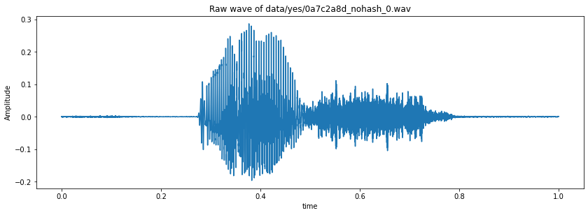
​    

```python
#Visualizing the audio - waveform
import matplotlib.pyplot as plt
import librosa.display
```


```python
#Spectogram
samples_X = librosa.stft(samples)
Xdb = librosa.amplitude_to_db(abs(samples_X))
plt.figure(figsize=(14, 5))
librosa.display.specshow(Xdb, sr=sample_rate, x_axis='time', y_axis='hz')
plt.colorbar()
```


​    

​    

```python
#Interchange the axis
librosa.display.specshow(Xdb, sr=sample_rate, x_axis='time', y_axis='log')
plt.colorbar()
```


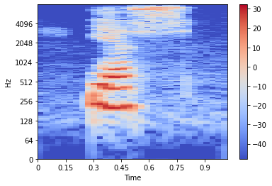
    


# Sampling rate


```python
ipd.Audio(samples,rate = sample_rate)
print(sample_rate)
```

    16000


# Resampling


```python
samples = librosa.resample(samples,sample_rate,8000)
ipd.Audio(samples,rate = 8000)
```

<audio controls="controls" >
    <source src="data:audio/wav;base64,UklGRqQ+AABXQVZFZm10IBAAAAABAAEAQB8AAIA+AAACABAAZGF0YYA+AAAKAOf/FQDg/xoAOwDm/zYA/P8CAC4Atv8GALD/m//1/4v/HgDA/8P/UQC9/08AIQDo/00A1f8GAO3/t//s/9L/+v/5/9b/1f/T/93/3f/t/87/9P8QAPH/TABBAD8AdwAvACEAMQAAACcAOgAmAFYAJwAxAC0A1P/2/xAA9//i/9//9//8////8f///woA5f8IANT/yP/6/7//DwDH/7n/NgC0/wwA0/95/yIAtP8IACwA6/+AABEALQBzAAIAKADb/9L/IgDW/wEA8/+3//v/1f/p//X/z//8/wUA8P8IABoAAABIADsARgBsAB4APQAeAPj/HAAYAB8AIwD+/w0AGADf//j/7//h/xAA8/8BAAkA+f8OAOP/8v8NAOX/3//H/5r/2v/r/8//0//F//f/2//w//3/6/8WAP3/BgAbAB8ADgAcAOj/FgAwAOH/UADq/zwAUwCg/5YAx//h/68Ahv+GAEgAAAC0AL3/RgAlANP/HADq/ygAwP/w/8r/p/8iAI//CwD+/5n/GwCD/73/4f9+/9//w//j//7/wf/8//b//P8PAB0ANwAaAFQAEwApABkA9f9XAKn/YwAyAMP/uQB4/0AAKgCH/+cAef85AFAAgP++AGH/FgApAGb/kwBR/x4AUQBk/5MAqv8oAHkAt/+pAPX/HQA/AKT/MgC1/wsAGAC6/zIAv//c/yIA0P/g/wsA5v///wIA2//d/+H/wv+O/yoAs//o/3gAhP9wABoAyP9QAL3/SwDM//L/4f+Z/1EAff9IADsA3//QAL3/PgBPAN//bQDa/3wAzv/s/z8Ai/+2AKX/QQAlAGP/iQBb/zUAt//H/0oAV/+ZALb/CwAdAKj/mADJ/yoAMAAHADIAjP/t/9z/h//2/7j/CgBrAN//cQD1/8n/dwCb/08ATwDG/3wA7v8eAFEA2v8nAAAAFgD0/93/FACl/wkA5P///yQAo//5/7r/1//S/7H/BgD+//H/CQDQ/9f/IADZ/wsA4v/v//X/BQA7ANf/LgAIADMANADK/zkABwAAACcABgAjAAcAHQASABsADADp/xEA6P8kAPn/OQA/ANf/NQD//+f/NQDz/+L/cACZ/xEAKQCK/2QAt/8QAPj/8/87AHT/QADb/7v/FABm/zYAu/+F/2wAfv/r/zcAt/8/ABwAwf/1/xEA7P9AAPn/vP/s/9f/8P/9/0QASQC9AGoAZAB+AJr/RwDz/wIA8v/k/34AWP+KAOr/oP/ZAF3/pQAUAHj/WQBi/zMAfv/b/yMAaP9MAHH/EQDm/7L/YwDX/3IAAgBQADMA1f83AJ3/NQDp/9H/QADE/y8A2v+1/xwAmv/h/+P/lv8KAN7/1v8zAOb/HQBqAO3/MQAcAAUANQDR/zUAGQAOAF0A1f9BAEkAyv9aAKb/IQAzADb/WwCT////NACe/1UAvv8VAAAA+v8DAOP/GwApANT/OABHAIr/dADB/ygASgCJ/2MA/v8iAPn/IAAoAM3/AAAAAPv/uP/5/6v/4f8JAOf/GQDm//b/3/8CAMD/+/8LAOL/MADZ/w4A8v/9/zEAMgAQALv/HgC2/wQABwCN/4AAs//1/3wAe/9TAOn/AQCzAH3/TgAwAJn/nACG//z/iABj/4oAt/+b/+QAPf96ACkAcv8oATb/VACxAAz/7QDb/6v/zQB6//7/MACE/ygA8f+S/yUAyf/K/00Axf///xUAvP8NAN7/6f8PAMD/HgD+/+P/LwDV/xwADQDl/0oABgAgAHMAGgBKAEkA7v8HAA0A5P/h/1oA0//z/y8Al/8jAMn/pP8gAP7/1P8iADsA5v9pAOL/3/9UALH/FwC//9v/IwC0/z4Asv/t/+P/R/8ZAHb/wf8lAFP/RQDt/5z/fACd/xQAiQCs/38ATgC9/4AAKADz/38ADQApAIgAkv9LADYAdP+sAHT/DQCPAAj/ywB3/43/JgEG/7MAXAAc/w8BWP++/9oAU/94ABgAg/9uAJH/+P8QAIr/QwDw/wIAQwCT/x0AGQDA/yIAsf/u/+T/sv8VAMr/yf8lAPv/0P9bAM7/AwBWAHf/VwC8/7T/jABc/1kANwCx/+wA0f9oAI8Amv+ZAK//AAAqAHD/fQCw/+v/UABf/0UA6v/H/ywA3v9jAKr/bgDq/6T/PgFN/74AaAAi/ygBWP8uAGgAUv95AMz/8P/v/8D/BADX/9b/4v/v/9r/FADN/w0A2P+w/2YAkv9HABEAev9MAIL/HQDu/+7/RAC5/3cAuv8BACEAbv9DAMz/2f9GAJD/IQApALb/ZgCA/14AWgBb//sARP+GAK0AN/9FAY//bwB6AIz/pACW/0EA8v/i/z8AgP8vAP3/1v8FAPL/PgAEAAkA1/8GAA8Aq/9DAM7/BQAlAGn/6v/R/7r/uP/l/6j/9P9RAFT/MADj/7L/awCX/8r/7//1/97/SAAXAPz//wAfADcAuAADACgAWgC4//v/ZQCY/3sAiQC3/8EAEgDi/44Ajv/l//z/kv/8/63/tv/P//f/CAAIAEIA3P8FACAAyP/c/9L/4f8XAOb/CgAFANf/DgDP//f/4P/q/yMAz/8qAMz/2f9TAKX/IwAqAM//bwDr//r/LgDk/zAAFQA6ACwABgAjAPn/JgAgAOL/AADn/8j/2P/G/+L/BAD9/+3/8v/0/+v/6/8AAPz/CgAfAOL/GQAaAOj/HQADAAkAPQASAAAARgATAAsAMwC3/+r/8/+u/wAA1P/q/x4A+v/z/xEADAD8/xgAtP/Y/+L/xv83AM//DQA8AP//XADw/wgAKQDs/zQADgBXAEUAQgBsAOv/KwAIAAAA///G/x8At//C/+n/qv/V/8v/7P8eABwACADd/+X/8f+t/+f/7f/S/y8A9/8AAOX/yf8UAOn/8f8IAPv/EwAGANX/7//0////IgD8/w0AFQAOAAsA5v8TABUABwAFAOv/OQAoAD8AUwD8/0cAKwADAC8ACgAjAD8AKAA1ADUAGQAyABcA3f/e/8v/mf+5/7r/mv/S/9P/+f8YAMz/y//U/7//7f/m//7/IAD8/xQAEwAcAAoAAAAOAAEAIQACAOv/8//e//P/8f/x/wcA3//T/7z/uP/l////HwAQACkAUgBGACwARQBdAEwAPwAoAEEAKwACAAQAAQAxAC0A9v/1////9v/L/8n/7P/p/+7/1v/R/9b/x//m//X/FgAKAAMAHQDy/9b/zv/t/wcA1//C/9r/2//0//H/5/8MAAMACQAOAP7/AAD5//r/AAAfADoAKQATABYAHwAYAPT/+/8SAAcAIQD///f/BAAHABcACQA2ACwAKwAoACAASABIADsAOABEACYAEwAGAPP/8P/5//v/7v/R/6v/xf+3/6D/sf+o/8T/wv+9/9P/2P/u/+j/6f8CAAIAAwDn/9L/4P/F/7z/4/8CAAoAHAAyACEAIAArABcAIAAqAC4AUQBGAE4AXAAxAEYAUAAqACwAHwAXACEAAwAaAEQAIQAQACwACQDY//b/7P/n/wEA2v/S//T/7v/X/9f/xv+5/8j/yf/Q/+z/6v/x//////8BAOb/0P/W/+z/+f8GABUAHAAhABkAGAAXAAAA/v8eABsACgAJABwAKQAyACYAEAAcABIAAwAaADAAIgAOAAMABQAGAPj/4//M/8j/w//C/8f/vv/X/+3/3f/a//z/BwD4//v/BQAaAA0A7//0/xMALQASAOv/8v8UAAUA6//q//r/DAABAAsAFwAIAAMA/P/2/wIAAAD8/wMABAD+/wMAMABHACcAJABQAFQAJgADAPz//f8DAAUA+//5/+v/1/+5/6P/qv/I/+n/5////wQA6v/0/wAAAgABAA8AGAALABsAOgAoAAgAAgAfACgABwD1//r//v/X/73/0f/4/+v/x//m/w0ADQD4//L//f/7/+T/6////wYABQACAAEAFAA7ADUAQwBVAFEATQA3ADcAHwACAAYACwANAAIADgAHANn/v//K/9j/wP/C/8f/xP/U/8n/vf+//8//6//+//j//v8YACUALwAbABEAHwAGAP3/BwD//wQAGQAPAAwAGwA0AD4AHQAGABcALwAKAOr//v8jADAAEwARAA0AFwAhABkAEwD8/+z/3f/x/wAA7//w//X/7//f/9X/0//J/7//z/+8/57/rf/U/+P/0f/Y//T/9f/j/+//EwA0ACkAKAA2ADYAOQAWAAYAAAAEABIABgAZADAALQAdACQAKgATAO//5v8AAAAA8f/i/+//CAAVACAANAA9ADUAOQAbAPn/AgAFAAAAAwAFAAEAAQD8/97/3v/0/wAA8f/X/+z/8P/Y/9H/5//0//j/CwAMAAwAGwAbABcALgAnAAcA+P/t/9X/t//C/9H/4f8HACYALQAoABoACAAAAAQAAADz//X/9P/j/+b//f8AAAAAAQAXABwADgAFAAwAHgDu/9n/+/8AAPz/9/8JAA4A8f/q//H/9f/5/wYADQD//+H/4f8AAAkA/P/o//3/GQAUABEABQAFABIAAADn/9P/zf/n//7/DAApACUAAAAEABUACwD7/9r/3f/8/wAA9v/0/wQAEAAjABsAKQAsAAEAAwAUADgAOgAoAC4AGQAQAAwADQAOAAUAEQAAAOL/3//e/9z/4f/p/+f/6P/W/7X/vv/Y/+f/5f/w//z/BQAoAB0ACwAXABoACQAAAP//+v/4//3/BwABAAEA9//2/+3/3v/y/wgADAALABYAFwANAAMA8v/V/+X//P/+//3///8OABAAAgD2/wQACQARAB8AGgAUABgAEwASABoADQAMAPP/9v8PAAAA9//9/y4AMgAFAAAAAAAOABEAAAD5/+//4P/m/9n/0P/c/+L/+P8MAPn/u/+p/7P/vf/b/9//3f/8/wAACwAnABsACwANACgASgBQADwAOQA6ADMAKgAsABsAAAAIAB8AGwAAAPz/EgAjAAcA+f/y/9L/wv/C/9f/6v8BAA4A7v/j/9z/0//k/+P/7P/8////AAD+//b/9v/7//v/AgAEAPL/8P/3/+n/6v8BABQAGwAcAA4AEQAGAO3/9v8IAA0ACwANAAQAGwBAADkADQD//wcA/v/4/+//7P/q/wUAHwARAP//7/8TABUA/v8EAP//8v/j/+f/+f/+/9r/+v8SAP7/BwAMACIAIwAlAA8A/f/w/9P/xv/L/+L/7//+/xsAMAA5ADQAEgAAAO7/5P/k/+3/CQAFAOz/7v/4//b/FwAUAAYADAD7//7/6//o/wIACAABAAsACADg//D/AQAEAAUADgAYAAsA+v/u//X/8//p/97/BQAdAAsAAQAHAP7/7//1//z/AAAEACAAFQAaACQALgAeAAEA/P/o//b//v/w/9v/3f/b/+L/7P/+/wUA7//l/9z/3f/P/9H/5//5/wAADAAXAA8ACAAEAA4AHAAzAEcAPQA5ACwAJgAlACAAGAANAAgA9v/7/+r/5v8GAAcAEAABAO3/4P/P/7r/oP+7/9H/5v8BAAcAAgAPADMAJAAPABMAJwA2ACUA9//7/xsAFQAKABEAJAAqAC4ACADc/+j/9f/u/wIAGAAJAOP/3P/m/9X/2P/m//D/9//7//f/6v/m//D/7//a/8f/w//H/9L/1//p//D/5v8fADkAKwA1ACgALgBHAEgAVABUADMAKgAiACoANQA0AB8AAAD0/9n/3//Z/9r/+P8DAAMA/v8DAAUAEAAKAAMA9//Q/77/1f/Z/8//2v/f/+X/4f/t/+3/8v8JABYAKAApABkADgATABAAEwAIABYAJwAXAA8A9f/0//X/w/+r/7b/n/9Y/xn/B//t/gP/Gf8n/1f/c/+t//T/RQCwADABwwFkAhoDvwM9BL0EDAU4BS0FvgQOBA8DuAEQAEX+S/x/+qz4Hvfz9e70X/RI9Kn0ZPWa9ir4WfrG/LP/7wKFBjgK7g3ZEdkUOBepGJQYIxeKFBUQggpCBBz9+PU8777oeuO/3wvdHdz/3N3eIeIB56bsGfOs+v8C+wrdE1YcPyN3KRQugi8mL8AsvCadHwsXVgx1AV33bew+423cxdaH05nTOdWY2Ejfy+XW7E71kvyKAkAJyA2LEOETPxUvFcsVJRV4E9ESEBGoDuAMAQo0BnID/P9w/E/6J/gw9uz1jPVD9Yb2Bvee9wj5Z/lj+Qz6OPkp+Jj34/V89Ar0cvMp9Xf4u/xkBC4MwRN6HBEjzibjKegoXSSyH5IX2g1nBR/7bPGF6ufiet3n2/jZJdvd3ozh5ub26yvvz/Pl9or3cvo3+7b6if84AooGVhAfF+Ud3CefK5gray1xJ7UesRi8DeYBS/tG8rbpZeem4wvhiOQu5jPp0O8a8+z26Pnj+m/5UvgT9bnyR/Ao79Dz5vRy/b4IDhC+G9EnXStYMB40pSyTJv4gIBIgB4QAivEI64nn1N/53rbgF+Aw4gvoKulf6qTvRO2z7KHtO+za6rLu5fXm92UHEBNbG4UqLDQ5NsA5YDqMLisoUx56DGQCG/jv6Z7krt/72ovc6d5a4QjmCOxC7HvwLPE17gjv4uym62DrxPN/9hkA7RFHGVInojXDOAE6az1KMqcmFSAuDY/+wPcR6KngZd+t2Kraed4D4VLmfO2P7/3x5vXF8CrxXe5W6mbrdupI8h73hAOGE0wdjCsDOIs7pTwPPgQy3CYfHkIKpvxz89Tk9d433RDa+Ntd4onlmeqr8ejxC/SV9OHuuu636QnnZOYE5+rw2/OzBtgVYyFXNM0/iEIARBdE8TGbJywZJAPz8/3nh9rl0hjU8dEv1n3fuuSH637zEPSQ9131NPG08JTox+rG6J3qIfhX/aQR8SPtL6RBDUzrSRZHu0CXKtgaTAn98Rjistdcy6TH0stZz7jZmuee8UL8qwT+AtsDMv4C9Yfy+uet5VDnluKO8X75gAZmH64sqTs5SrFMK0VbQcoucRfzBx7z2tsY1UnNpMVF0BPYc99h8QT8mACDBxYENf8g9d7svOVx3G7Z79652RzrOQBqA70pZjz9Q+9YUl1kTEVGuTfuERoBP+7J0cvHe8gPwDHIi9vG4/bx+AYjCi8MAgrTAiPzBueQ5KzUUNUr16HcmNoi95EHrBCQQcZJA1hhaSpjPk1wPwkmjfxf6lTUU73jue/Ah8SS1JnvKfw/CigcJxYuEZ8EbPX04NnT3ND2w4jOh9Lm3i7ptv5cGkgjAEoAWgVdQ2m2XwdE3C1WFbnpjNYGyCq03bgEyNHRq+bvB/wRYR+cK4Eb2Q1K/EHeuc62wFq5oMAxx6fWv+IE+w3/xxj6NBYyw1hZX6BYXFsjTespaQ+D/Z7Vx8iRyLnD7cvq5ML3jQO9G10o7h3AH7QUpfWd4kzR0bjRr2u3prxUzYrivvij/oIVzhX6HXM37iyaTeVPOUrOSi03NR4WAnn2YNrP1kfart3X6Qv34gb6C/sRMRSNDFz9pvZS5MfPjMpSvtC8wsQ90ZDiaPAlB/UJBhCSGhkLdCKoJ1QpeEgMRd5EBkJINDYZoAiC/XPlW+Q+5kDnj+tS9kn8RfiV/274z/CM8SXrROab4M7i8dZB1Cfcs9e23/fy9/ff+wsGDgTVATD6kRjYHZEo5Vw0WTJdqGDmTCAldAqe+/zS28zc0KnOAtV05vD3xPGoA6UKJ/3o/k/5Y+5o29/cfdPLx8rXM+BX4hz3mAVt/UUC1/53/9bwow01LYomAmCHcWpjZWH+UZgj0fR16+fHTbTEw0DM6NNz7EoE4QmDE60XeQtQ/I/rtduUzPbDd8yi0C3YmfDc8jz61AjtAXcDiALdCXEAEA8gNyQ4oFrDctdlLFPbO4MVHuDb0A7Fc7U5xXjaFe+Y/zUSqCDaFQsTfASE5n/U2sWovK+9YM232rrl0vy3AckAzgYJAT8CTvppAMP8sQg4Mow6ql+JdNZp9VUPM3YLK9c8xJK7nrlFzPzlZ/4WDvwdZyCIF2IFs+8F2jnFS76YvnPM7+BX9psFRgy9DpEDaf6t8M/siO0c8ID5oQIjM+ZIWV//f51vYlN3Lvj/h85fsku0brtZzT3wwwwAI+khbx6qGaTyDt8y0cy+er/myxfg7++eAjwQcw+3CZb9avNM6CviOeZ46nH9CgACIetS6Vm9c2N4p1kBLVQBkdckrrKu9MHy1tX0PhogMQkx1SCpDhXy68ltvjG8B7020rPrRgEODa8U9heHC6j9ue5z5+He3Nvw5//sff9mAwUnY1QrVQNxNmxnRUkdUu0GyLaroLZV0YrvQA/AKsg9TSiLD572wNCGtvSw2b9x0oPy9BKwJA4mnxshEOr1a9/K0cfTv9q55GX07wCxD1gI/y8GUVNLm2abW246aBDK4pTKTLfawNbfyP7JGIYrSTI2ICoBcOru1EPDbMaL127qdP3KC+kUzw0U/Lz2QOyA3wfb0+PO8P7vNPc4/UUAb/e1CTE670OBWppp+U+QJ8z4vNpnwXS819Q5+lAWTCzgN6YvdxrT7jDbdsbvr+PB8dIz63MCwhHjG+4MHQjy/8nrpOMO4FHm8uKI5nzxGvmU+b4G0TaPSmtbBmpkUuEusQBB3Y3HOL4V2Gv6PhgJLTkxIC0ZDEHopsx1tim1fb6s2FH31g8RHqkcGhJ6BBH3D+fT3+3b+OFq6dLpD/Uo/Iz/IQXpI+RCZ1XRZVRaYUTWFzzqCdBUwGnK/eR6CFggGC1nLbcWNvtl1Qy+Z7yduyLQOu3eCPgZVhwIGHQKff1y67bdANpJ30vhceiH9Fv8IgDn+vMmI0krUrZuvWCIRPca3+HZxKS1PsL/4c0J3SysMm42uRsw9IDWlrfOt5++X9Kl9PcMMB3FHJoRWwVZ9lzn3+Av3Rbh6uMH6G3u1vci/C0AvTEqULNi2XFmXCNFjQ4W2+C/D7PbyFvnqQ3RLj82rzSpFbPus9IPtyS1mMCZ1sTzxQePFMAVJwmV/s/0/uoO3+Lbj+Ty5SLrpe70/gX/hxQjSW1bT3LIZxVMZS4M89XJUrcMwK3bm/bOHJY1Pzi3JzYBCeroy5G0EboCyZLk9vi7CLUVThIyA073G/GG6IDcReHf5hftvvAb9fACsQeJMvtOWl+tbexL7TIXCwnbCsOPwIXa0vLyCiYlUjHhLcwMX+/d3j3HeL4lwv7YW/OnADYKsA4iC5T8SPNB8G7nyORs5Urpbe9g7R/1cv34IsVKGFilbmZcfDtHGCHnrsvSv9XOI+ufAUMYeyeXLgUfhPxc6ojaMMrnwjfK0Oj5+Fj+zQhzCuwEsPXw7pru0ejJ4zjk7Oog8iH1rvxLKnhOpV4QZwBOyjkOE+/hXMnHxAncjPE4BF0YniEIJN8VMf8r61/b4NJHyyDQ3d/Z70T8RPwm/qP8v/U08STyefTZ7/7ufu9r97r2dQ+1OIBPY2iGVng+UyYx+xPeHcjg0CHtFgEJD4QXsRx9GM0GB/NL5fvbldR70anbJem57yL2cvOH7THxPO5H9C/6pvmE/DXy3PO99R0POzLpQmFen1THQEgpRf2L5c/UmtRp5rv36w+PF3kVrBPpBhn+GOmc2/zcJN1d5NnomvGr8q7oLuXa5UPrpPef/g4HmQYx+2/42fLmCy0omTjHUT5Mc0BuKoUDKerE2cjaOOZb8fcFihOpGjYYlQe8/fHtOuFh3/zfZ+hG7U3rkOgT49reeeHo6bL4eQC3BUAElAOnBJ4BRBqSLgdBT0rDO6I0+xygAt3sUN6+4r7ntvMb/3UJcxWZEa4JZfuk6ojiw9rg3eHh3eJy59PoT+eF6knxuPX8+g//9wG6BbYFaAMgFa4ntTNDQrg/izrGKjgSC/5r7M3mHuPZ5hX1mP/zCN8Klgd5BRb4R+eV2V3V+dxJ3xLjNutp8ef5hPhl9b/3b/f++/T9RgPDCmkW5SQDLUE6kjkfM3Eq6Rd5CLb2oeqz6Ajpweys+BQBVwbNBor7kvVY7D/dQNeK2DfjlOx18aH3D/2tAFH7WPiN+KT7uQEHBIAJTBICHc4mczA9MEsroScAHM4Q7gGZ9f7xt+9E8SX01/hG+iv3C/OM7aLoN+Gu3X/huuWO7Pfyo/cU/J78Wv9D/xH+MwQPB5UI4Q1mEBoW2Rn+G+AjJiEZH60dZhd6E/wGDv4u+BPzbvUu8mLy3PR379Psieb14qzkn+Rf6rbvtfWi+Xf3f/l7/Iz7JgEBBoYJGQ8mC78Q5BJHDZkOQArIEDwUwxKIGOgVkxYHD5MAw/xp+Bf4dvVP8Rv1F/Lv70frXef07nPt+u+A8+rzm/3S+5b6Cv+V/7cG2ASzAjYJHgyFD3MLMApLDHEMIg1UCgILqwwRDg0MQAgpBfcDAAED+832e/RP9PPwu+8Y8FPzMfVO8uny0PNi92b44vWO+f38mgBBA4gAegg2C50LnA56BlkKbAeiBfAJtAQjDBQNUQk6CdAC4wGn/5X71vwN/Nn9W//++vP77/pg99n8ffjW98j9B/cS/FL6MvhP/2X5FP7v/97+HgVqAXkC4ATK/7AC7wDr/xgJ5AVlCN4H+AKuCEgA9/+//lf6zgF/+kT+owHw+vcB9vv9+f7+6fhK/sj/Dv6zBfMDSAMiA6gA1QD///gAUwAUA+0AzP+XANf9rvxf/dH/3/+pAQIARALfAX3/s/7M/ND9h/0m/Uv+W/9+/2gAX/4gAUYAKwL3AyMCBgVcBNcD9gHAAlT/PwBbAIz+iwFg/zoAVf7W/hj8O/0H/Av6bf43+hcAZP+e/aX9cvrb/Hf9Pf1n/74BnP/8A4sAKQLFBCABNAeqBG8F8wQ0A40F2QFzAt//0f60ARf97v/p/kr+7QIv/Az/Hf73+4H/7Ppq/u//xPw4/y/6p/zn/kj7iwFF/SkAuQNO/yQEfQJcAYoH3QL+BU8G8wKvCOkBvQMxATkARgBc/Kz/zvs5/bz8x/jp/DD6Afve/xH6T/9K/sf8nwB4+7H9qf5o+7/97v5U/+4DbAHlAwwGHQMzBdAC+AJeBG8BOwKnArkAvANtAeMAiQIb/08AOf1t/NX+lvsd/Ub8cfsq/hn81v3g/rz/HgBaAPr/p/+6AXf/0wDxAJcC+wSJBCcEtQQkBFYC7wJe//sBrQAV/5MDcv9pAaIBwP2pAIT7x/kI/qn4tfxs/O75LgBA+gf/mf/4+2cBDvxe/1YAWv6PAc4B0gK8AskCWQJiA4MCUAEhAokCKADAAT8APgAeAsn+9AEqAQoB6wGv/q3/zf0z+9792PoD/9L/XP6OAjn+7ADhAO/+if+3APH9dgFTAA3+ewTi/f4DAAJZAFsEm/9MAdYADQBMAKv/H/8zAPv9xQAL/un/MQDw+v//xfse/bIA0/s7AY8ARP3JA0D8pv+mADz7EgTP/Y0CrAQy/7oGTgAzAhIETP5ABAsCnv/dA/r+5wAVAbX9nAKG/IcAigBB/JQBdf0x/e//x/u5///9hfwMAyn7XwH//Zr93wJd/JIBvv9l/hwC0f4C//MCKP3PA7sAEABiBc39NQN9AB7+SQNh/3wBuwOx/skDxf69/xIBG/yvAcD8RwB3/wj9UgLZ/WwBtgD6/ZECdf3F/xIAYP0aAs7/OQCqAkH/EQK+AV3/gAK7/hoB0gDV/cb/pP7D/q8A0f9QAQ8C4f98/xn/3v0U/rX+Wvzm/xb+Av9d/8z++v98/3b/yv8VAUT+bwPV/8EB8wGX/4kD0f8qA74AaQHfAMj+JgDR/pz/AQEHAY0AsAMY/tUBoP5n/XEBOfwaAij+hQDlAGX+e/8k/n7+wf7P/yb+sgE8/ykC2AB7/j0DSv2XABEAcf0rAvP+Mv/oAU//DAB5Ao3+DwKo/0j+pAHw+60Cjf7Z/r0DMv02A4YBIf39Aln+B/9CAiH9SgK9/vv/MQH6/uMBDf+EAU4AKgAfAJL/IACe/5EAGAA2AI0A5/+6AF3/6f+rABr/sQGW/twAz/8l/sz/Lf7m/mb/bgC0/2QCiv++AH7/GgAvAP/+jQG9/WwBD//N/nIBJv7+AFYBw/6iAar/Df5AAcj9c/8TATr9fQJI/9n+xAEB/tQBov8FAY4Av/7mAU/+CgBCATH+9wHEADT/0wO9/pkBxgC9/SECmf1SAUX/Sf9PAdD9OwHs/qj/ZADC/rUAYf+g/08ACv5MAEz/jv68Acv+fwAZAQv/8gFh/+T/YgHu/R8CAP+m/44DsfwYAyX/+f4tA1j7wgJW/z/+rwJk/XIBSAGA/m8CG//i/xQCaP1sAmr+VP4oA/b8lAIbAaL9JwOf/cr+4QGt/MwB+f8w/vECAf0sAZYA4v3cAj//vf99Acj9CQCXAKf9DwKc/pEBHQDN/h4CKv1qApb+Of9pAj3+WAEI/63/KwBL/voBZ/6SATEAUP7fAaX9u/8mAcb9cwFWAcj8DAUp/aQBUQIl+6cFp/zVADMCU/2vAgH/JP/WAQL/uP9uAZr+/f+4AQz9FgJv/4n9tQPw+xQCAgB0/cQCIf49ANMACAA7/7IA1P9W/6oAZ/5bAYH/xgDOAND+CQI3/ar/6//b/o0AK/9U/3sAsf+U/2gAs/7/Abr+pQFlAPH/GQKq/rkCgv4SAVcAp//WADAAiACc//gAVP7vAU3/3P84AC7/jwDh/oMAW/6cAEEAMv8QAaH/3v8FAGX+QwAYAHr/RADG/zwAQf+bAAL/WQFs/y0AwwBD/wwC8P3sASX+2gAUAOT9vAGu/cIBuf45AWoA4/4dAiL+GAE8/3b/ZAFl/ccBwP7h/3MBXP6+Adz9RwIw/8n/hAEn/oMDu//p/6sBK/8KAEsBQf0oAoL+X//1Aob7jgSn/cf/lAMh+7QDMP8m/ZgDyv1CAO8Cp/yiA4/+vf6gAuH7zAJh/NQAWAGw/HkD+vzj/0UBqvxUAV3/a/7TApH88AE8ADH9OQSF/WoBQgH8/c4CSv7U/3UC9/wUA7z/Nf5mA2L8wwHu/9f+EwKJ/iYBjf+U/xoAFv89ATIAAgDyAcP/SwC/AB7/SABOAGj/UAFoAAj/XwIJ/jEBPgA4/WsCvPw2AY3+lP4tARf+tAHa/vABcP7wAPT+q/6iAWD9sgIN/tgAFwD0/uMANgBPANb/nQAz/+IA+v42AfP+0wDP//z/nwCr/8AAu/37ArT9XwAMAaz9PwFA/qIAkgAg/2QBFAB3ALAAnQCV/4QAbgDk/mgCQP73AWcAP/+kAUr+hwG2/hEATf95/5D/lf9sAGH+FAF7/xf/ugBh/3UACQHS/tYBoP/S/6EAMP43APT+BAAPAOT/HAAfAIj/UgDw/xP/qQCj/wT/BwEN/2n/KgEm/ggCkf/IALMAj/87AS7/ogEk//oBRv/7AAgBxv6KARv+hwGr/3oA5gCt/mIBff7T/6AAf/57AXT+vQDA/1X/bwFK/e4Buv2mAJj/if7qASX+kAGx/tkAGv+VAKQAJP98ASj+gQEr/xQAfABF/0YBtv/1/1YAcgBY/18Akf89AFcAzP5fAeP+lgDP/67/WwCZ/qYBzf7yAOX/H//MAFX/LwDY/8H/df9JAGf/TgBC/5j/OQEZ//0AjwBq/3oAzf9GAB0ALQA5AKMA//9VAC0AIACeAAIA3wA//8sA+/4MAIcAZP5AAW3+OgBCAfP9GwGI/3P+bQFz/oEAEwBS/y8Bnv9JAIsAlgAe/8EAiP/4/4QAD/+YATH/dgDFAID/ygBHAF7/BAAVAH7+NQCf//v++wC+/wf/6AGi/mn/yQHx/NkBWwDL/jkD3/2hAbIApv7zAb/9YAEIAML/NwI1/mYBef/6/vgAI/82AE7/AQCZ/twAbf8B/2MBZP4jAUf/m/9XABn/8wA1/xUBw/9EAPcAWv+hAQr+QgHO/mkApADM/q8Byf0hAr7+hwBrABf/5QBaAMz/9P9OARn+NQKI/5D/BQIh/lsAMQFG/ucAOgCv/R8CX/+M/hkCaf6u/xYBP/1jABIA5f1lAYz/hP+wAEoA7v+4ABgAQ//FAfD+VQDXADT/CwDqAKP/kwAeAPz+hwEJ/hcCYv8G/7YD9v3DAHsBlf2dARsA9fy+Arz9v/8sAkH9wAFn/77/twCH/2oAQADe/gEAbv8m/xcBvv6SASL/PwAlAXT+OQH1/ssA0gBUAEwAKQB1ALz/vwB2/zgAlP74/zv/Jf9GARD/pgCBAKP+hwFP/9z+VwFx/TEBBv/n/z8Aqv/jAHb/CAEZ/1ABuv4iAS7/2P+CAKL+dQHz/ocAFwDY/xwAYQAv/zsBf/8rACQBKv/1AJv/DAC2/5IA9f+gAJIAQgBGAAQAMgB0/zcAAf81AD4AAwCyAOf/HAD4/wYAef8qAPn/cv8xAGP/YwC7/yYAAwDP/9AAWf+NALz/5f8sANb/1/8MABcAlP9HAO3+gwBnABT/AgHV//b/GQEK/34AAgDU/hwBs/4hAI4AKf+5AMH///9fAE4A4P4hAd7+PwAzASH+1AFO/owAeQDB/lEBAv+OAFcAmv+6ACIAZQDoAN//VAA8AEf+ogEp/o3/mgHF/fUCcf5SANYBBP4PAM3/sP6wAHgADP52AgP+TgB6AFD92wFc/tX/CgDg/l0A+v9m/ywBBgDl/4sBXf+LAbz/r/+oAIL/TACt/1v/mAAwAFcAcgFN/yIBNgDm/9AA2f7VABAAR/8QAUD/fQBIAJH/EgBlAMn/Zv8bAbT9CAJ2/s//JAFu/R8CxP0tAQ3/UgAsAO3/kwDJ/qECPP1EAhj/Pv9UArv97wG//6b/lAAW/+H/YQDj/8j/8ABr/1QAvgDM/r4APv9BAPsA2f4MASEARv/hAMP+Wf84APn9vQBH/0b/TAHk/5MAkgA5/5D/w//s/gsBB/+bALX/of4oATr+GQEC/5UAqwDv/k4Bfv8wARYAYAEXABACof+sAAcBIf+EAi3+9gFX/24ACwEy/xMBqf5L/8r/of6U/3UAY/7sAL0Ar/4iAif/s//kAUz9VAHJ/p3+6wAM/3YATP8AAA8A+v8XAFP/xP9j/8r/HgCr/wMBiP8KAfD/xf9TAfv+MAFa/3wANwH0/qAAuP++/4MA6P8wADUAjP87ANv/aQCa/k8ARv/S/u4An/0hAfz+HAAMAQL/XwDh/7L/Xv8IAQL/+ADm/0f/BQLO/18AVgFvAKAAfQHY/qQB4f8gAPoBrv2YAWH/hf7bAO7+Yf97Atj9jgFsAZL8qwPo/IkAKgG7/GsC3v3S/hsB1/2qAJD/BP/jACr/u/9XAPf+RwD9AGb+5wFw/h4B0ADN/lACZf4KAn3/GQBQACkANgACAF8AOP+NAXn+XgGN/zL/YAE1/7cA1QAS/44BIACo/lQBgv63ADUAMP+/ANUA1/5HAWn/N/+jAe78ZgGf/gP/gwDY/aYAmv/e/sAAIACy/+ABT/7sAHoAxP3XAi/9AgFjARf+GAOz/l4BQwHe//cArwD6/mMAdf+Y/j8CPf06As//3/5iApX9TAFgAA3/8wHf/pn/XAFU/YEBXP/v/v0BcP6WAIMA0f74AAEAfv57Abv9of/X/6L9HQGJ/vX/xwD9/kABiQBW/7EBb/+LABYBgP77Acj/MQCbAbv+EAFx/3P/PwCv/lgA7v9y/70AwP8IAMEALf4fAc3/OP/VAUz+hgH3/y//YAGY/jIBZQAF/2wBa//6/+UADv53AZv+Lf9vAQH+3wEK//3/IQEC/7UAFQBB/2kAyv/F/+0A/f4EAWT/+/9rAMP+7v/o/wcARQBSAK//4AA7ADUAzwC7/2UAwf/K/igAJ/8WAKoA///EALoAEgB3APH/hv+AAFz/oQDe/57/EABc/wgAmP8VAKD/BwCu/x4AEgCX/5YAkv8/AC3/w/88/5z/EAAp/8cAEwCxAIMAgABfAD4Arf9sAGL/zP+wAFT/nADy//f/wAAUAA0AkgFd/0cBlQCP/tUB6f7b/8cAJP6XAIT/oP4wAZb+9v94AOf+rgEe/+r/vwC9/gcBOf/s/3oA7f7+AJL/ov9DANP+YACX/xL/fQA8/54AewCd/w4BgP+uAFwAeP+rAK7/AQDn/5v/NQAiAAoAjACD/8MA7P/g/08Alv/VAI7/UwCS/zIAy/8hAFsAKv+jAFYAIwAUAQoAcAAhAJf+RQBG/u//Cv8k//IAQf9zAHIAlv/GAFIAAf8oAaj+wwDk/zz/kQFx/iUBPf/j/ysBef/+AZP/gQANAKb+dAAa/3AAQQCFAIEA//8RAHf/HgElAC8AxwCr/74Au/86/4YAEP+sAAAAvP/vAJv/4f93/8b/B/8dAKv+Uv/bAG/+kADT/oD/XwGj/osAUP8i/xQBUP6JAM4A6/+rAdP//P/r/1P/3QBP/xcAigJy/gMAIwLr/UABuwBF/rQCBP/4/1cBZf0WAcf/YP/RAJf/FgAvABz/CgAIAMb+JAE0/zIAdQGn/5MBTQDE/3oB+v/0/9UAZv9mAL4A6f5bATX/mP61AXz8sQCb/0v9/wLg/M8AkQGg/CgCBf3E/oYBjvvUAgD/Q//3A7z8LQMDALP+GQSL/E0CKwBd/RgE+/vuAX4BkvwvBXz97ACkAmT8/APd/sP/MQMs/YsCEwD5/TQCwfwWAc0Ad/3EA4j9wwBFAZX8QAOh/TMAIAHF/FoCqf2y/rUAXf3XAX//GP++Afn9lQFXAFr+PALR/igBBQAy/ncBJ/78AF8A6P7SARH+EAG8APT+jALk/r0AfAH6/lkBEP/e//kAIP+CAW7/x//yAI7+NgHJ/9cAugGg/1QB4f5l/0T/rv00/vz8DP7C/mP/fwHhASACygL1AZQBkgDa/13/4f6Y/jv+mP7S/WL/qv+//5QAj/9IAVYAs/9tAJD/sAADADUAvwADAEAB5wDsAPwAJgCTAJH/iv+w/yH/wv8X/67/GAAAAMgAYABmAfcAcACjAGL/LgDJ/7T/bgD3/+kA/f+L/8L/0f6+/2z/G//K/3z/l/+d/0r/0v8FAPf/RADq/ywARwAZAEMA+v/7/wwAVAB0AN//BQDF/8D/vf9w/87/bP8hACIArP/v/7//PgCHAJEAfgC1AIsAZgCBANH/YAAlAMz/jAC6/+j/p/9x/ygAf/8AAMf/XP/V/4H/7//P/x8A2gA2ABwAMgBDAAwA1v8hAPX/zf+D/3L/sv+c/8v/JQAmAFYAYwA4AEsA0P+s/7H/lP8oAMT/+v96AEwA5gAxACYAfAAjAGIA3/8eACAA5/9QANL/LABcAOH/UgATADMAMQBk/4b/U//L//j/mv/4/wAAIwDQ/6b/zP/G/9b/3P/y/yUADwD5/+n/2P91AB8A6P8PAN7/eQDa/3T/zP+Q/+j/ev8AANgAfQDAABkA/P9lAOv/OgAKAO//PgDq/xEA6/8QADQArP/R/8H/p//p//3/IQAVAO//GgDy/9f/+f91/5X/1//m/zwA7/9KAGQAHwBkAPv/FwA0ANf/BAAfAD0AQQANAA8APABjAFEABwDr/7j/nv/8/5r/fP/G/6v/EwAEAEAAjgDo/ygAOwD3/z8A9v/4//z///9OAOH/8/8mAPn/JgDv/9//zP+O/5r/Xf9n/4v/f/+O/6j/+f8TAA8ADwDs/xMAbQBHABUASAA3AHIAEwCq/xcA/v82AN//3P9IAAYAcgA9AA4AYAArADkAQwAMAC0ALwAlAAEA4/8KAKn/8/8aANj/PABHAHsATgBDAFQAv//q/93/7v8tAPD/NwAAANv/AwDO//L/mv9l/2z/LP9D/yL/VP9v/zb/g/+j/8r/CwAjAFQAXQBtAIgAcQBwAEkAKQBDAA8AGABsAJkAnQBIAEgArgCVAI8AawABABsAr/+I/97/nf+K/6X/9f8VAPH/KQBdAEgAHwDu/+H/q/++/zwASgA4AOP/wv/t/7z/qP+S/8n/CgCs/23/Xv9B/13/Z/9l/5b/wv/f/x4AbQBGAEAAZwAGAP//PQBTAF8AYQBxAJQAnwCPAIcARAAQAOn/3P8HAOr/2//l/8z/DgAxADoATgASABwABQAAAA4ACAA6AA8A//8AAAoAMAASACcAXwA2AMr/kP+L/23/P/9h/6D/xP+x/07/T/+z/wwAHQDn//z/LQAVAAMA/f/7//3/6f8VAHgAXwDy/+P/CQBdAD0Aw//I/yUAYwAgAAAADgAjADYASwCcAKcAZABPAE8AIgAGAPP/3P/l/wUAFgAOAB0A9P/g/xgA+//U/8v/7P8LAMf/nv/M/x0ADwD5/yQAMwA4ACkACgAPABgAAAACAAUApP8U/wr/Yf9w/13/nP/6/zIAMgD7/93/t/+T/2n/g//y/w4A5//u/2YAqACsALEAoQB9ADkAVgBJAAgA6v/g/wYA7v/e/+X/DwAzAB8AGgAJADoARAANABQAIgDo/8r/9P/K/5z/0P8LACwAYwBFABwAaQBoAP7/xf/z/+X/v//R/wQAPwD0/93/CwDr/+b/6P+9/5n/mv+S/3f/qf+2/4H/c/+I//P/MAAkADAANgA6AFsAUgATAOb/1P/x/x0AKgBSAIkAcwBkAJUAvAB/ACMAGwBhAGYAGAADACgAUgA5AC8ALAAWAAgAuv+Q/8n/FQAHAJ//Xv9r/5f/f/87/0n/oP+9/5T/x/8AACkALgDx/+L/5P/k/+3/4f+7/+r/+/8AACUAOQBOAA0ABAA3AGcAdgA/AEAATQBNAB0A5v8GABwAMQBFAGMAbQA9AAUA9f8CAMr/j/+W/9f/EAACAMr/of/E/9L/uP+t/53/2v8cAB0ADAAVACMAFwAYAAAAHgBBABwALABHAEgAIgDe/+v/CwAAAN3/mv+G/5v/m/+O/5r/0f/r/+P//v8kABgAEABFAEsAWgBuAF8AdQB4AIsAjAA1AAwASABSACgA/P/H/93/DQDa/8f//v8eACYAx/+s/9L/rv+U/6z/sP+z/9f/yf/g//n/7v8AACUAUwAgAPP/9//m//b/2f/i/+T/yf/m/wQACwAIACsAEAANAAwA6/+f/6X/DwAPAPn//P8iACEAGwAfAEoAOgAaAB0A1//n/xgAdQBrACEALQBZAGMA+/8BABsAHwAZAOn/9/8LAB0A8//V//H/2P+h/2//d//v/xUA5P/w/wYAIgAFAM7/0P/a/+X/8P/n//n/HAAGAPH/+P/z//X/tP+h/8j/0f/v/9z/DgAqAA0AKAAlACEA9f/G/wUAHgD3/xIAYgDKAKYARwBJAH0AdAA2AAUA//8kACQALwA4ABUAyP/O/9r/rf/E//n/CAD4/+b/7f/O/5n/qP/G/+H/2v/2/w8ABQAEAC0AVQBLAC4Aqf9X/4X/nf+N/5X/xP8NAEAAUgA+AAcA6f/d/+T/1v/s//b/BQA9AB0A8f/m/yMAXQBKACUA9f8mACcA1/+v/9n/OwAHAM//+P8gAD8AKwAtAFQAbwByAFkARAAWAAEA8//T/wIALgBlAIMAagA9APv/vv/A/9L/sf+5/6//mP+0//L/8v+//9X/BQD4/+n/6v/t/9T/zf8eABgA5v/S/8b/1//+/wsALwAiAOH/CAD//+7/zf+8/+//EwBFAAsA6P9EAHsASwAbADEAKwAHANr/u//r/+f/3//9/xcAJgArADMA9f/k/9//0f/p/+L/+/8SAAgAFgDn/6D/Zf9q/8v/5P/0/+T/xv/o/xMANgBNAEgAWwBfADAAPAAOAPr/HAAwAEUAEQAIAD8AVgAxAM3/1P8hAAYA/v/b/6n/ov/c/xkAKwBnAHkAWQAlAA0AGgAbAAsA7P/W/7r/jf+V/9b/CwA8AEIAAQDB/6H/fv9k/6b/rv+1//L/3v/4/xgAFgAAAB4AjwCiAGAARABlADwA//8DABUAFwALAAUA8f/7/xYADQDj/6j/i/9z/1z/hf+W/3X/nf/4/xgA/v/5/0EAlACDAE8ANQBDACsANwB9AFMADQALAFYAfABsAFQALgAoAFQAQwAAAB4AZwBGAPP/AADu/8b/cf9P/7H/0v/P/8b/DAAbAOv/3v+z/5P/vf/Q/7H/2f/c/8r/0v/f/87/uf+5/5n/c/+f/+b/2v/L/7z/sf/L/9j/5v8KAC4AJgASAC4AewCuAJQA1gD9AKcAaQBTAFUALgA4AFYAbgCDAEkAMwA0ABEADAD0/7r/ov+x/8n/sv+v/7H/uf/H/7//zP+J/3L/uf/O/+L/8f8AAPf/6v/z/wIAGQD2/yEAawBMAPj/xv/d//z/AQAbAFIAPAAOAAUAGAA0AC4AVQBeACoACwDp/9P/2/8OACoADADq/+j/6f/I/5L/jf+g/5v/x//D/8v/AQADAAsAQwBJACEACQDa/73/tP/S/w0AIwA8AI0AggBMAD4AQgBIAB8AMwAsABcAEwAHAAkAFQB3AIwAMgADAAAACQAIAOv/wf+d/4X/Z/9u/3b/eP+V/5r/mv+5/wcAIAAOAAwAIQAcAAsAIgAEAPr/8P/9/x8AOwBYAEkAaABFACwAKQAMAPX/4P8oABoA4v/g//3/DQD7/73/kP/X/9//zv/e/+7/8P/5/wgADQAuACEANQBTAF8ANAAmAEsAJAAdAAYA+f8GAPX/z//X/+P/0f/G/87//f/o//b/AADh/+n/y//L/wAANAAeACcAaQBVACUAIQAfAAMA7//i/7X/pf/D/+X/KQBQAAIAy//r/9v/qP+e/8T/yf+8/5z/r////97/3f8LABoAHAAmAEIARQBhAGMAbAB8AIkAtAC1AKgARQAUACIAAwD+/7T/wf/0/+7/3/+7/9T/zf+a/4v/of+Z/5L/wP/M/97/+f/O/8j/6P/k/6X/pP/d/+f/LQBEADsAKQAoAFAAIADj/8//CgA+AD0AagBwAEIALABGAEkAFgD7//D/EQAyADwANgA9AHkAjgBAAOv/6f+y/2H/jf8XAC4A4/+8/9L//P+3/33/bv+C/4//nP/Z/9f/+/83AEUAHgDR/9X/DAAPAAYACAACACQALwBYAHIANQA0ACoANgA0APD/8//z/wAAGwD//+z/9/8qAEwATQBPADAA/f/a/+b/0v+3/8D/5P8MAOn/2v/l/9//7/8fAB8AGwAlAMz/yv/I/6j/rf+k/8D/2v8AAPz//P8LAA0AAAAQACcADAAFABkAKQA3ACAADwA3AA4AAAD0/9j/+////+z/2//W//j/9v/Q/+P/6f/w/wAADgAEAP3/9v8bADQAEgAzACwADAADAOj/5f/u//L/QQBOAD8ASAAqADwAQgAtACgAZgBtAEsAPQAXANz/3v8EALz/uf/Q/7H/zv/Z/9v/2v/3//r/0P+x/4r/tv/G/7H/1P/2/wMA5//f/+//4f/h//X/FgAeAOn/tv/H/9T/wv/N/8v/NACbAGsAKwA0AGwAZACJAJsAhQBzAEoAFQASAFIA" type="audio/wav" />
    Your browser does not support the audio element.
</audio>

# Number of recording of each voices


```python
labels = os.listdir(train_audio_path)
labels
```


    ['up', 'yes', 'left', 'no', 'off', 'down', 'go', 'on', 'right', 'stop']


```python
from matplotlib import cm
```


```python
labels=os.listdir(train_audio_path)
#find count of each label and plot bar graph
no_of_recordings=[]
for label in labels:
    waves = [f for f in os.listdir(train_audio_path + label) if f.endswith('.wav')]
    no_of_recordings.append(len(waves))
    
#plot
plt.figure(figsize=(30,5))
index = np.arange(len(labels))
plt.bar(index, no_of_recordings)
plt.xlabel('Commands', fontsize=12)
plt.ylabel('No of recordings', fontsize=12)
plt.xticks(index, labels, fontsize=15, rotation=60)
plt.title('No. of recordings for each command')
plt.show()

labels=["yes", "no", "up", "down", "left", "right", "on", "off", "stop", "go"]

```


​    
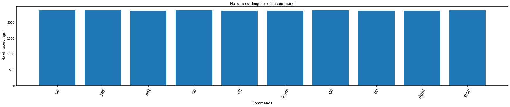
​    


# Duration of recordings


```python
duration_of_recordings=[]
for label in labels:
    waves = [f for f in os.listdir(train_audio_path + '/'+ label) if f.endswith('.wav')]
    for wav in waves:
        sample_rate, samples = wavfile.read(train_audio_path + '/' + label + '/' + wav)
        duration_of_recordings.append(float(len(samples)/sample_rate))
    
plt.hist(np.array(duration_of_recordings))
```


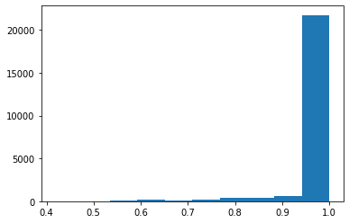
    


# Preprocessing the audio waves


```python
from tqdm.notebook import tqdm # Notebook
#from tqdm import tqdm # Python
```


```python
train_audio_path =DATASET_DIRECTORY_PATH+"/"
all_wave = []
all_label = []
for label in labels:
    print(label)
    waves = [f for f in os.listdir(train_audio_path + '/'+ label) if f.endswith('.wav')]
    #waves=waves[:20] # The first 20
    for wav in tqdm(waves):
        samples, sample_rate = librosa.load(train_audio_path + '/' + label + '/' + wav, sr = 16000)
        samples = librosa.resample(samples, sample_rate, 8000)
        if(len(samples)== 8000) : 
            all_wave.append(samples)
            all_label.append(label)
```


```python
from sklearn.preprocessing import LabelEncoder
le = LabelEncoder()
y = le.fit_transform(all_label)
classes = list(le.classes_)
```


```python
len(all_wave)
```


    21312


```python
from keras.utils import np_utils
y = np_utils.to_categorical(y,num_classes = len(labels))
all_waves = np.array(all_wave).reshape(-1,8000,1)
```

# Split into train and validation set


```python
from sklearn.model_selection import train_test_split
```


```python
#Extract training, test and validation datasets
#Split twice to get the validation set
x_tr, X_test, y_tr, y_test = train_test_split(np.array(all_wave), np.array(y), test_size=0.2, random_state=7, stratify=y)
x_tr, x_val, y_tr, y_val = train_test_split(x_tr, y_tr, test_size=0.2, random_state=7)
#Print the shapes
x_tr.shape, X_test.shape, x_val.shape, len(y_tr), len(y_test), len(y_val)
```


    ((13639, 8000), (4263, 8000), (3410, 8000), 13639, 4263, 3410)


# Analisis of the Shape 


```python
#Print the shapes
x_tr.shape, y_tr.shape, len(y_tr)
```


    ((13639, 8000), (13639, 10), 13639)


```python
index_col= 3 #index_of_column_you_need
print(y_tr[:,index_col])
```

    [0. 0. 0. ... 0. 0. 0.]

```python
print(len(y_tr[:,3]))
```

    13639


# Model - Conv Model for Speach Recognition

![model_architecture.jpg.jpg](data:image/jpeg;base64,/9j/4AAQSkZJRgABAQEAYABgAAD/2wBDAAcFBQYFBAcGBQYIBwcIChELCgkJChUPEAwRGBUaGRgVGBcbHichGx0lHRcYIi4iJSgpKywrGiAvMy8qMicqKyr/2wBDAQcICAoJChQLCxQqHBgcKioqKioqKioqKioqKioqKioqKioqKioqKioqKioqKioqKioqKioqKioqKioqKioqKir/wgARCAGWANADASIAAhEBAxEB/8QAGwABAAMBAQEBAAAAAAAAAAAAAAMEBQIBBgf/xAAYAQEBAQEBAAAAAAAAAAAAAAAAAgMBBP/aAAwDAQACEAMQAAAB/SAIJ8upsOVz05HTkdORNYz7c1KIoAAAAABlauVpE4uSlnm6y4+d2B3iaGaO2BnoAAAAAAytXK0icXMFDWGZ3oOA6TQzR2wM9AAAAAAGZpuzlNVfMpqjKWrZlNUZmj0noTQAAAAAAAAFS3UtgAAAAAAAAA546QJ7PzFRLF3B1ydAJ3HdcDoAAAAABn6GdhrMIsAACO5XkqJx6MgAAAAAGdo53n1mpXaE357WiqdShLEq1eztHhJHD2NFVk9GUyqLSGuXgAAAM7Rz8NZRFgAAJILdR2PRkArWYCcAAACORxXWEVXWBn2OLZXWBFKXIdAKlusWSAnfO/QHSpITgAAAqW6lsAAAAQT1C3BOPmfpOhRlsgAUYq8oM7v5/op7ef6X1AX1C9cejSQFazATgAAAZ2jnefWZXcuwOB4eopRJHJUzj0YgKlusWQAAAM7RzvPr8/V+wKwPPoOXPlZfp3O/JvrK/XMssnY5kkb5w+yeHkU3p0AAABnaNfG+BnoAQzAHk8dnSA2zAAAAAAAAAqW6lsAAAAAAAAAFGKvKDO7+f6Ke3n+l9QF9QvXHo0kAAAAABnaOd59ZhNmfoAACSOSpnHoxAAAAAAZ2jnefWYTfzPH1LvPlOPrnVC+c6kjk7M49GIAAAAADO0a+N8DPQAhmAPJ47OkBtmAAAAAAAABUt1LYAAAAAAAAAM7vNFmKnTz+BX28v002YNNm6M16OdAAAAAAZWrlaROLkpXeCOTojkE0M0dsDPQAAAAABlauVpE/nqpwOPonO/FaP0XXWXqHeJoZo7YGegAAAAADL1K1TE9aR49Hj0ePRzZitxQRYAAAAAAAAAAAAAAAAAH/xAAoEAABAwMEAgIDAAMAAAAAAAADAAECBBMwERIzNBBAFCAFISIVMVD/2gAIAQEAAQUC8zK0Hvq+r6vq+r6vq+omaT+gL9jwSbdEUt4c4eDDT9bOHg8HJKBW/ITsNVyuxqSkrPNP1s4eDwQTEkWhjKl+FF2HRxHLzT9bOHgw0/Wz8KvCV4SvCV4SvCV4SvCV4S3XFFtsfUpen7NL0/Zpen7DyZlSSb4vqPJotfEr4lfEqyzU0346I6emviV8SviUZRl6Mf7wuyjLdDOLhwg6+cXCimnEr1cBjnW08JMcbp657AzTveAdfOLhRRlY8g1O5qCUAjppQrS0pJDGMsqnwCmA1K9KB4WRXmpQNB6UDwsivUwwinhFw4Qdf6ifUmGH8xwSfRoR2D+sGI08MhxmrEFYgrEFYgqcbTprEFYgrEFEcYv9gsNi5qXp4hPqRHu2HrKlwR121VQ1LThJep8FL08UGI00eRIAtVcBRd3jU0g6qFOH49NgpeniCw2LlrWJ8f8AFsV6bEJ9SYdzkWxbFsWxW2Zti2LYv2NM+rfWDEaeEXDhD1/qFhsXCLhiccyBMOoF5/0hkiWPgHX+on1JhFwlGVjlDJxBjLdXMOVbZJrAT/KFTPNSE0A03Up6kD0r1AGjdHdY4njeE0d8N4nk8sIuHztbd5IAJnQevotG12x02RdtsdzRaLYRcWB30YTbQ55C1e2RWyK2RWyITEIG2RWyK2RML9+rS9P2aXp+xWsT4/4tivTepuci2LYti2K2zNsWxbF+xpn1bOLhwh6+cXD4atA8/sDr5xcPjV3pIhJ/kBUtsEhSemooyhR+AdfOLhwg6+cXFgd9GE20OeQtXtkVsitkVsiExCBtkVsitkTC/fq0vT9ml6fsVrE+P+LYr03qPJyrYti2LYrbM2xbFsX9DTPq2cPBhp+tnDweGqwuRQnEg1CcSR8U/Wzh4PDbno9Hc0BDYbsRp0A2EHxT9bOHg+mjbvpT9bOLhwO+jBbaDPMOr2iq0VWiq0VWiq0VWiq0VRD+/wDj/wD/xAAgEQABBAIDAQEBAAAAAAAAAAAAAQIREjBRECAxQCFB/9oACAEDAQE/ARVJUlSVJURcDuY4bgd1bgVJKlSpURI+aqlVKqVXCzq/zAzzhZ/nL/MDOr/MNnbLO2Wdss7ZM/KjZKFChQc2MDPOr/MDPCBEhIEQRIFSGxgYsEt2S3ZLdkt2OXXyo2ShQoUHNjAzzq/zAzziCBPwf5gYsEt2S3ZLdkt2OXXyqsFixYsIs4HdW4HcSKs8NwKhCkKQpCiJ8n//xAAkEQABAwMEAwEBAQAAAAAAAAAAAQIREhNRAyEwMhAgMUBh8P/aAAgBAgEBPwEaklKFKFKFKDkjgZ6u+cDPV3zgRYKysrKxVn81xmS4zJcZkuMyTPBq/UT10+3Bqdk8bG3hnfg1OyerO3AqIv0tswW2YLbMFtmBERPn5XOpLjsFx2C47Bcdga+rg1OyerO/BqdkJ2gnckVZGrL+DUaq7oQ7BDsEOwQ7AxqzK/lc6kuOwXHYLjsFx2Br6uDU7J6s78Gp2TxJUKM78Go1V3Qh2CHYIdgh2BjVmV/KiSUFBQUCpHAz1d84GeI3kTb/AH9nw75wNWCUJQlCUHL+T//EADoQAAEBBAUICQUAAQUAAAAAAAECAAMREiExMnKSEyIwM0BBUeEQIEJhcZGxwdEEI1KBoRRQU2Pw8f/aAAgBAQAGPwLphSo8A2qX/PltUv8Any2qX/PltUv+fLapf8+W1S/58tql/wA+W1S/58tAgpPfsIVvVToSGQo70g7A7ujROrg2B3dHS4CTQpcDhLZRbiAyOVSAuMWybx0EqmFSo0GPwztKUgO/uBVPAw4dR1cGwO7o6UExzDEeUPdsmgmIcl0IsSXrzKRBylERD9MgpWvNKv3NX1HVwbA7ujROrg2CVVA3FtYjzbWI821iPNtYjzbWI821iPNtYjzbWI82g6pPHcGCRUNlc3B6bU5uD02pzcHptIiQI1M6TERDtNH62WKiB4trEYm1iMTaxGJlIyiI1pzt7Z60TrpOc2sRibWIxNrEYmzVA+GwznfV3aGKbW4sFcRHYEXRond0bAi6OgOnKAtZEc5UAAwL8KQoxzZSo0eG5oFe4GhJIgamEFWiUijeGevEuTmLCAFmEYw8q2yT92ELhMJVTAjy6Xd0bAi6OgPnEpMsqkrMIsh6C7U9AUCkmAp/8ZbtKgYukuwfCLLekiQ2RwJr9GfhEsVvErTE8IfDZZ+EJKUypShUekJDl3KtImEozvFkoLh2UosiUZrZXJoylU8tLKQHDsJXaEozmSguHZSiyJRmtlcmjKVTy0s/Dij7kVpAhAyjlokXRond0dZ99uSC6/zzRT7frRSGtNGh79zJTwEOs8yhBSVZncID3jos4N2sZbtYy3axlu1jLO1KmiUAnOLdrGW7WMt2sZaIFPE9f6jJklReZ/cZR7Q07m4PTRvvtyQXX+eaKfb9dCv8eXKQzZqmTk0onVZWU0K7oRr48IMJ4Tb4Mp4RNCpI3lnbyEJ0hUNC5uD00bzKEFJVmdwgPePQouUZR5DNSyVodkqTSlMRPHiaYU0x/TAkSnhwaDyYERlKVEQ8mdugSqRMInQubg9NH9RkySovM/uMo9oaYqcKKVozvFp3qiY0JHADRvvtyQXX+eaKfb9aKMSE7oNaXjLWl4y1peMtWvGWgCrGWtLxlrS8Za0vGWiCT3EtEdZ5lCCkqzO4QHvHRIujRO7o631GTJKi8z+4yj2hokXQzx2lWc7tDgweOTMg74dWZFRpjDpd3R1n325ILr/PNFPt+tEi6GelCF/deZM+BAzvVkuy4jS8hM6K+1RRu8WdLUhckEzAjtwr/wC+zO8s6L1OSVmhM28bmTlna1fUwdyPAIy8ad29tUoPsosvHktaKYU791DOEvXRKZkzAp/42SH7lSnSQ8CRLZMaPCjezq4PRgoPncqEiYzWWSovncq7JmrbJzpn/GNLKUHqCE1mapkkvEQVUY1tJMJvxjSz0laVJmzIbhAe8dEi6OpNAR49QF66QspqmTGHQ7ujoi1QpYCUUVUNNKJuLZoA8NEkcBDQxZAO5I2CKTKWtpw82tpw82tpw82tpw82QuZImSDCXm1tOHm1tOHm1tOHm2eqbuhszm4PTanNwem0lThRStGd4tO9UTGhI4AbLGJCd0GtLxlrS8Za0vGWrXjLQBVjLWl4y1peMtaXjLRBJ7iWiNgRdGid3RsCLo6ZYqtSxKFSx8auu7ujYEXR0vvpg7eZRbxcIuzClVcammVayhMwcmzfjCHcyIOlpm+mg8lTTGjmyZXSQ6D2Kh/jqgqj/brr+WQFR/aYfzpd3RsCLo0Tu6NgSOAhoYsgHckbBFJlLW04ebW04ebW04ebW04ebIXMkTJBhLza2nDza2nDza2nDzbPVN3Q2ZzcHptTm4PTaSpwopWjO8WneqJjQkcANljMQndBrS8Za0vGWtLxlrS8ZaAK8Za0vGWtLxlrS8ZaKST3ExaI37Ai6NE6uDYHd0dMkxrhGUyx4Rq6ErQYpUIjoigxESOl1cGwO7o6U/SZN5lQAmMph4xqZLoul0P1KMU0QILIQr6dRUPp4BIQaFxPl4sp2p2sqU+QuITRDN3/AKZaQ7yf3VdmG/46XVwbA7ujqzQp49V1cGwJHAQ0JJ3MgGsJGwRQqUtrEYObaxGDm2sRg5trEYObaxGDm2sRg5trEYObaxGDm33FTd0If6R//8QAKhAAAQIEBAYDAQEBAAAAAAAAAQARITFR8DBAQfEQYXGBkbEg0eGhwVD/2gAIAQEAAT8h4wZoVP8A3U/91P8A3U/91P8A3U/91P8A3U/91DpukBn3GRJ2kP6nBCQ1CJMBjxkLxTCtFMheKcWkBQWmHPYCfBzE6ABnBhCYqhROIGZMMMpxQ/qOQkRGSN27Xl8LRTIXinEk4E7VXImDgcGLTYckTACAdNGGhomY1TnYZEgxnAwr8LRTIXimFaKZCWS9NltVbVW1VtVbVW1VtVbVQYJntEeY6DLAwyt/ozV/ozV/ozJMDhMBMyiRjGC6IypqAqTLZi2YtmIKloyAKHlpKFBdVsxbMWzEFcTzPkYIG5idoweXAhqpCyC8UwrFTIXinA4vh9yCx9VRzqA2oCGOeboguPLgQmCQGA5qbRkO1HH8KKCBfkypMP8AVHuWlcCxiQiHGmvGxUyF4pwELHqiDuC4BiI6ap67LQwYMCAXZmkeSesXEI63lHMhOObCPw8lG8McEAaSS0J0HHJMBiQSSSBQacR1RQTRN5ImqXO10DRcpshDR5omqXG11DVE1S52ugaLlNkIaPNBnDoQDyYUd1JwrxTCsVPkwJQIcIwWagwZHHQqVygvkMIQkR0Y+TvhNUQiRkfKs/arP2qz9qs/ai/mcJxI6qz9qs/arP2ru5Ak/wB+ZCCAiejjyd8e/wBGGwJQIeBhAUCFwA5Gkx7T6RhxfMgjCaIzCVNxMDgYPyRYxBWaQC54oHZw+Df6MMwhCRHRj5O/BgeTADnuQibPO4UsTSAwkkiOyAEmX6EJMDEqIbUHQhKAeEv5wb/RhkIICJ6OPJ3xpGoG0ahtUADgA+UFLDYEoEOEYYFpQmfm6ZYe0yw9plh7TLj2gEAgSA+xMsPaZYe0yw9oETfE3j+UAUQEOPkYQhIjox8nfCvFMK5U+RCCAiejjyd8K8UT3JuEREHCjtSzgkW1+BLCTIIJKSIARBwQ4nxsVPkwJQIcIy8URaR4gEB4sG8kIiL7fcmxhAIiRqDiAMuaFnhAP3QMzqiKDB70RZI6JBgHLiik76oECArgAGgaeqgyBaPUmBiPJ4IJqZkdb9EgqFCMrEIgghYm1ognEA4t0nVcp7w4OigYjEDddERCp0LdFVyrv9BGzud0og8/ZhXinwdCChgyLfCeLyLsPwuVEwzAWgB6qMEKYNNE4HEjQu1iGKawV3YGwoCJuOohggOUgHRJiAPjIPL8nBwVvdN7pvdN7pqJ0pZw6b3Te6b3Q7DCaGDLX+jNX+jMyNQNo1DaoAHAB8oKWVMC0oTPzdMsPaZYe0yw9plx7QCAQJAfYmWHtMsPaZYe0CJvibx/KAKICHGQvFMK5UyF4pxgl6NRGZ41Qn87FTIXinEMy4YRBDFEDRmhzCdaAtLA6A0jvpqhPROWNqVNE0EmUFilMUHsEOe8AtGgPARFoc+NipkLxTCsVMhARNx1EMEBykA6JMQB8ZB5fk4OCt7pvdN7pvdNROlLOHTe6b3Te6HYYTQwZa/0Zq/0ZmRqBtGobVAA4APlBSysGaGNn5um2/tNt/abb+0239oDAQEgPvTbf2m2/tNt/aBC1xOOdygDI4BxkL5TCtFMheKcWCcqx0MXJ+EdMA0xwOGg4bUFj/RxtFMheKcDEFQHCiCsR/um6frApLLZeRmgB4VyBmif9xTjjNC0AJ0TKE09WB0T42POSPG0UyF4p8dMPDQRb42imQhKm86iGCKWAcosHAD4yDi8pwcHst4JvBN4JvBN4JvBN4JvBCsMFFjH/I//2gAMAwEAAgADAAAAEPPvvvvkPPPPPPPPPMfvK/PPPPPPPPPPvK/PPPPPPL/PPPHfPPPPPPPPPPPPPPPPPPPPvffff/PPPPPPLAwww9fPPPPPPPw76SFePMPPPPPAwww2fPPPPPPPTjjjnfPLOONPPPPPPPPPOLLPPPMMMMPvPPPPPPPxQxQ1PPLPPPPP0QQ4AbAPPPPPPwQSQTPPPPPPPPPPPPPPPPPPPPPMMMMPvPPPPPPPwyww1PPPPPPPPwwcgFPPPPPPPPwQSQTPPPPPPPPPPPPPPPPPPPPPv/8A/wD+888888888680L88888888+eOdr8888888qxxxxN8888888888888888888//xAApEQABAgMHBAMBAQAAAAAAAAABABEwMfAQIUFRYYHRQHGRwSChseHx/9oACAEDAQE/EEYS+NUY3GBMLCCA9TZOZ6x4smgTCxzXlPc1VfZNBDs07NOzTs+mE1olaJWiVolEEXGBKTWPxvugTtvawuqgiAYqr+ITvzQgspHb3FASC4Ws8rWeVrPK1nlEic/I3NrFm1hjTc03NNzTc0SBnbe04tBBDiCztvaDH7vX5srkafRrdMfX1/uyYBsAB4LpryNAC4HFVH4VR+FUfhVH4QyG6UY03NNzTc03NEgZ23uzFobO292FxJrHn8THJz4ZAxoKFwOKqPwqj8Ko/CqPwhkN0oCdi7F2LsQICYWYtbNAmFjg7VcR7V914ARLknNTQDG8LQWgtBaCMLz0n//EACgRAAEDAAkFAQEBAAAAAAAAAAEAEWEhMDGRocHR4fAQQVFxsUAggf/aAAgBAgEBPxBBpFQKBQKBBpCosHp3bnKEC5YcoeqrB6c5egGq7M8JnhM8Jnj82JADlQbwoN4UG8KDeEABxUUjLKcv5oNHcfG1qMMckLRzlKAY55yhDy8D6MnRZhzvorD0foqLZBy/mm/wPraVAFgcKPcFHuCj3BR7ggrAw/oUu3atFDt35n0HIlRL9lEv2US/ZRL9kKgQxqMMckxt5T1IILFWHo/RUYY5Ky4sbfZFzjOIZEy8vjz/AFOuTqqR8g/RUEAJ2fFtFLw1UvDVS8NVLw1QjJu35RyJUS/ZRL9lEv2US/ZCoEMajDHLoxt62Ho/RUYY5dDxdoi4vy10Tl1Yej9FQQAnZ8W0UvDVS8NVLw1UvDVCMm7flKnsvZey9keoWD0cM9XWCiHDIuc5Yck8nqiA4FTqdTqdBIYfk//EACkQAQEAAQMDBAMBAAMBAQAAAAERIQAxUUFh8BAgMEBxkcGBYKGxUPH/2gAIAQEAAT8Q9ZVMrQh3VA/1+Hx48ePHjx4QFMKi4ES9rfotnIn5yf2fgPh2ApXh6J3N9f8AfdAhf/foeC4fF5Hj9DwXD1wyBozGVMZWONH2YJIhJrakI9NtGudxTys7jdhuLQLlBUEE/wDEb7svr5Hj9DwXD1HuAMBSrTaLjM05sJzRGulxyd8a6AGPoEZQHEt2udZtjfWjOyBJEm6W+vkeP0PBcPi8jx+ghk6xRu8C7CGM7ynbwL+68C/uvAv7rwL+68C/uvAv7rwL+68C/uhJyp+8Bj/LX9ptyu3AQ/5EMGDJdBSGVhyw0GgJCCIpuDPq9hFgft14T/deE/3XhP8AdCKco4R1xcn4XRdVItSY3ehn8rXhP914T/deE/3S4G3RB+vooBj4FrkDjEvL8O+QdQM3h5HqaI/ABwJfoeE4fF43j9DwnD0MadqehReqwBWZEyu7DUNkQG+IRqLNKPauIorIRyQ76g2Q5R2FKTecYOSqSq5tBUjBiMGQcD5s1QYyCJQwgi5D08bx+h4Th6V6ZgJQbE2VRZIahZ/C5DKoZEq8NQETdTkIBgzJeulWUubndEbnW9nUxB802JKXYHc1IECXZjWzAwi1sPQmenThUSPu3VtRDm5Yi/E149oYcO11LUQ5uSIvzdW1EObliL8TXj2hhw7XTQkhKoQAI2ublXB8PhOHxeN4+78LeW8yhZcq9NxD4XwAQHgwP4Qvw1EKYHfpBqjtah1gHuOygeZDgMz1sDPQ+GiHAFQ/Ajrv6Dv6Dv6Dv6CM108FWEbuu/oO/oO/oOnikKOKl95wUTxJMBietlZ6H2Rn4W8t5lCy5V6biGm/ERAdQbhTZlNLX4AJfdwQs2BNEkAtSzlCqF2FdQrw6Pftc9AVwOv1TINFhZd59QYdlA8yHAZnrYGehq94uzMqCG7kwb6c4lIjdLAkKAVnoRc5CSZSUU2pjTTUgJtPCMjiKddXqioSRclDgrDBg+oMOCieJJgMT1srPQ+W/wBcXQBpswVCOQ0pi9IBCDq87oDc/H+FvLeZQsuVem4h8NqkpSEZQznoCY3zt7M2bN2NHwAQOA9jNmzJBHUpdnIeMznkQyMnI+47KB5kOAzPWwM9D4fCcPi8rx9xwUTxJMBietlZ6Hw+E4aMCwtzAJETqU1UaA1NFgDuPT2GrgVe2gmZpSEILhNttnPr43j7vwt5bzKFlyr03EPh8Jw0I8ZsyiezCdY0kczIyBPFTAsQXXRCWwgN0MjlFMtKH5xy6kF5kRZpvosKjpA1uAgsQSpp4dJNmWIRIEraR0cIMtmAKTZQ4uHRYQs9f4ERoPQclCIgI9MNL+07IKOxdmaV2sBfi0/xrxbyc7O809Gq6nCs/wBaYIMJL3Wf41+p4Yc9U0RB8kxQg6L3cDPQ+HwnD2KIj2iEig7xQx2PYr5FV7loM2NuD0I2P/x6RAoNhNtdqswz+9BD46z8jrpoR1Aj7HTXbFsceLvp44pBCu7jr8QcMEHGQfsfhYeKS9A0dkIHogH6CbhktrlMZ7ie3p06dO3+gAi7pfZ06dEhQqVb0Uqv7n/CRgy/1xdAGmzBUI5DSmL0gEIOrzugNz9W1SUpCMoZz0BMb529mbNm7Gj4AIHAexmzZkgjqUuzkPGZzyIZGTkfoeE4fF5Xj9DwnD1fGRKVdmaiOpgVff43j9DwnD1eHjDhmCCyKZCsNQo+WuCZVBCAOjSquAY2Q4iIFsocaa5xGxSsgQQW4EbplhAsy2xyIAUgFjQ9PG8foeE4fF43j9AOGCDjIP2PwsPFJegaOyED0QD9BNwyW1ymM9xPb06dOnb/AEAEXdL7OnTokKFSreilV/c/4SMGX+uLoA02YKyOQ0pi9IBCDq87oDc/VZaMlWRlDOegJjfO3s+/fv0kfAAA4D2fv36sL9dj2ojxmc8k9yJyOT6HhuHxeB4/Q8Fw9aTmxGBkZlUiqJKTW2pIMrFCjHJ/vpXMLQzyzwh/nr5Hj9DwXD0KIYpLxqisHhmhmiEhkZBoVeXae0mTIgscIaFzi0yKGwqKBljJXMSbJTGwDWGZM6r/AC3C0LAGiCkAuIenkeP0PBcPaEgYXCgqF3lXHf2+R4/QLiQT4yD9j8KtRiPQC6LeGnogH6Cb7Mpfy4N7id7j4atWrVq1atVZYqL16KKrPzP+p/8AH//Z)


```python
from keras.layers import Dense, Dropout, Flatten, Conv1D, Input, MaxPooling1D
from keras.models import Model
from keras.callbacks import EarlyStopping, ModelCheckpoint
from keras import backend as K
K.clear_session()

inputs = Input(shape=(8000,1))

#First Conv1D layer
conv = Conv1D(8,13, padding='valid', activation='relu', strides=1)(inputs)
conv = MaxPooling1D(3)(conv)
conv = Dropout(0.3)(conv)

#Second Conv1D layer
conv = Conv1D(16, 11, padding='valid', activation='relu', strides=1)(conv)
conv = MaxPooling1D(3)(conv)
conv = Dropout(0.3)(conv)

#Third Conv1D layer
conv = Conv1D(32, 9, padding='valid', activation='relu', strides=1)(conv)
conv = MaxPooling1D(3)(conv)
conv = Dropout(0.3)(conv)

#Fourth Conv1D layer
conv = Conv1D(64, 7, padding='valid', activation='relu', strides=1)(conv)
conv = MaxPooling1D(3)(conv)
conv = Dropout(0.3)(conv)

#Flatten layer
conv = Flatten()(conv)

#Dense Layer 1
conv = Dense(256, activation='relu')(conv)
conv = Dropout(0.3)(conv)

#Dense Layer 2
conv = Dense(128, activation='relu')(conv)
conv = Dropout(0.3)(conv)

outputs = Dense(len(labels), activation='softmax')(conv)

model = Model(inputs, outputs)
model.summary()
```

    Model: "model"
    _________________________________________________________________
     Layer (type)                Output Shape              Param #   
    =================================================================
     input_1 (InputLayer)        [(None, 8000, 1)]         0         
                                                                     
     conv1d (Conv1D)             (None, 7988, 8)           112       
                                                                     
     max_pooling1d (MaxPooling1D  (None, 2662, 8)          0         
     )                                                               
                                                                     
     dropout (Dropout)           (None, 2662, 8)           0         
                                                                     
     conv1d_1 (Conv1D)           (None, 2652, 16)          1424      
                                                                     
     max_pooling1d_1 (MaxPooling  (None, 884, 16)          0         
     1D)                                                             
                                                                     
     dropout_1 (Dropout)         (None, 884, 16)           0         
                                                                     
     conv1d_2 (Conv1D)           (None, 876, 32)           4640      
                                                                     
     max_pooling1d_2 (MaxPooling  (None, 292, 32)          0         
     1D)                                                             
                                                                     
     dropout_2 (Dropout)         (None, 292, 32)           0         
                                                                     
     conv1d_3 (Conv1D)           (None, 286, 64)           14400     
                                                                     
     max_pooling1d_3 (MaxPooling  (None, 95, 64)           0         
     1D)                                                             
                                                                     
     dropout_3 (Dropout)         (None, 95, 64)            0         
                                                                     
     flatten (Flatten)           (None, 6080)              0         
                                                                     
     dense (Dense)               (None, 256)               1556736   
                                                                     
     dropout_4 (Dropout)         (None, 256)               0         
                                                                     
     dense_1 (Dense)             (None, 128)               32896     
                                                                     
     dropout_5 (Dropout)         (None, 128)               0         
                                                                     
     dense_2 (Dense)             (None, 10)                1290      
                                                                     
    =================================================================
    Total params: 1,611,498
    Trainable params: 1,611,498
    Non-trainable params: 0
    _________________________________________________________________

```python
model.compile(loss = 'categorical_crossentropy',optimizer = 'adam',metrics = ['accuracy'])
```


```python
es = EarlyStopping(monitor = 'val_loss',mode = 'min',verbose = 1,patience = 10,min_delta = 0.0001)
mc = ModelCheckpoint('best_model.hdf5',monitor = 'val_acc',verbose = 1,save_best_only = True,mode = 'max')
```


```python
history = model.fit(
    x_tr,
    y_tr,
    epochs = 100,
    callbacks=[es,mc],
    batch_size =32,
    validation_data = (x_val,y_val))
```

    Epoch 1/100
    427/427 [==============================] - ETA: 0s - loss: 2.0496 - accuracy: 0.2332
    .
    .
    .
    Epoch 32/100
    425/427 [============================>.] - ETA: 0s - loss: 0.3039 - accuracy: 0.897
    427/427 [==============================] - 4s 9ms/step - loss: 0.3041 - accuracy: 0.8971 - val_loss: 0.5104 - val_accuracy: 0.8419
    Epoch 32: early stopping

```python
model.save("best_model.hdf5")
```

# Diagnostic plot

```python
from matplotlib import pyplot 
pyplot.plot(history.history['loss'], label='train') 
pyplot.plot(history.history['val_loss'], label='test') 
pyplot.legend() 
pyplot.savefig("plot.jpg")
pyplot.show()
```


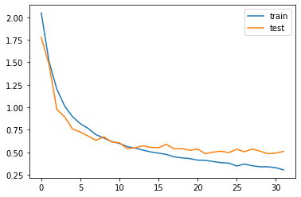
    

```python
n_epochs = len(history.history['loss'])
```


```python
early_epoch=n_epochs
#Adapted from Deep Learning with Python by Francois Chollet, 2018
history_dict=history.history
loss_values=history_dict['loss']
acc_values=history_dict['accuracy']
val_loss_values = history_dict['val_loss']
val_acc_values=history_dict['val_accuracy']
epochs=range(1,early_epoch+1)
fig,(ax1,ax2)=plt.subplots(1,2,figsize=(15,5))
ax1.plot(epochs,loss_values,'co',label='Training Loss')
ax1.plot(epochs,val_loss_values,'m', label='Validation Loss')
ax1.set_title('Training and validation loss')
ax1.set_xlabel('Epochs')
ax1.set_ylabel('Loss')
ax1.legend()
ax2.plot(epochs,acc_values,'co', label='Training accuracy')
ax2.plot(epochs,val_acc_values,'m',label='Validation accuracy')
ax2.set_title('Training and validation accuracy')
ax2.set_xlabel('Epochs')
ax2.set_ylabel('Accuracy')
ax2.legend()
plt.show()
```


​    
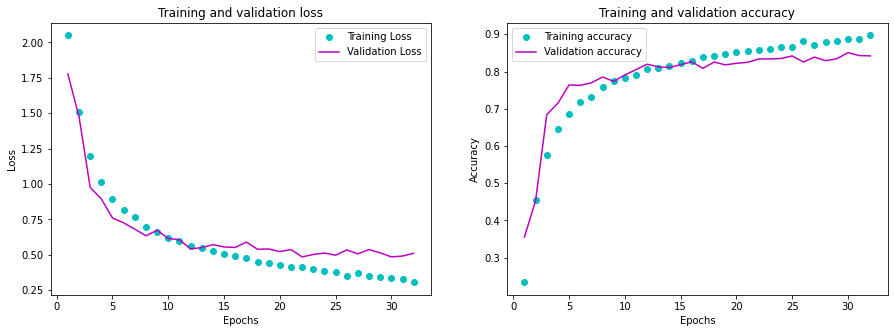
​    


# Loading the best model


```python
from keras.models import load_model
model=load_model('best_model.hdf5')
def predict(audio):
    prob=model.predict(audio.reshape(1,8000,1))
    index=np.argmax(prob[0])
    return classes[index]
```


```python
import random
index=random.randint(0,len(x_val)-1)
print(index)
samples=x_val[index].ravel()
print("Audio:",classes[np.argmax(y_val[index])])
ipd.Audio(samples, rate=8000)
print("Text:",predict(samples))
```

    140
    Audio: off
    Text: off

```python
y_true_label = []
for  index in range(len(x_val)-1):
        y_true_label.append(classes[np.argmax(y_val[index])]) 
```


```python
y_true = []
for  index in range(len(x_val)-1):
        y_true.append(np.argmax(y_val[index])) 
```


```python
test_labels = []
for  index in range(len(x_val)-1):
        test_labels.append(x_val[index].ravel()) 
```


```python
y_pred_label = []
for i in test_labels:
    prediction=predict(i)
    y_pred_label.append(prediction)
```


```python
y_pred = []
for audio in test_labels:
    prob=model.predict(audio.reshape(1,8000,1))
    prediction=np.argmax(prob[0])
    y_pred.append(prediction)
```


```python
# Final evaluation of the model
scores = model.evaluate(x_val, y_val, verbose=0)
print("Accuracy: %.2f%%" % (scores[1]*100))
```

    Accuracy: 84.19%


# Predictions on the validation data:


```python
import tensorflow as tf
import seaborn as sns
```


```python
confusion_matrix = tf.math.confusion_matrix(y_true, y_pred)
```


```python
plt.figure(figsize=(10, 8))
sns.heatmap(confusion_matrix, cmap="PuBu", robust=True,
            xticklabels=classes, yticklabels=classes, 
            annot=True, fmt='g')
plt.xlabel('Prediction')
plt.ylabel('Label')
#plt.savefig(_PATH_TO_RESULTS+'/images/confusion_matrix.png')
```


    Text(69.0, 0.5, 'Label')


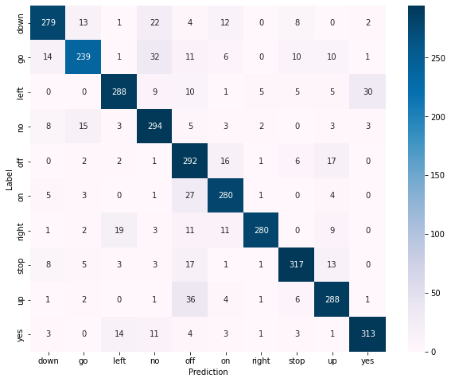
    

You can download the notebook [here](https://github.com/ruslanmv/Speech-Recognition-with-Convolution-Neural-Networks/blob/master/Speech-Recognition-with-Convolution-Neural-Networks.ipynb) or you can run it on Google Colab

 [](https://colab.research.google.com/github/ruslanmv/Speech-Recognition-with-Convolution-Neural-Networks/blob/master/Speech-Recognition-with-Convolution-Neural-Networks.ipynb)

**Congratulations !** We have discussed and created a **Neural Network** to classify  speech words by using **CNN** with **Keras.**