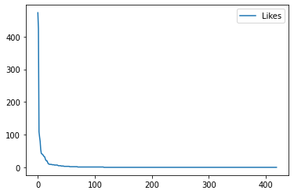
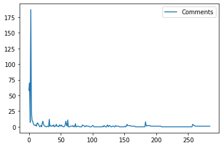
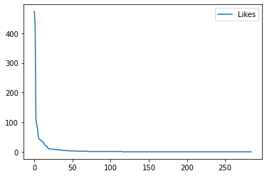
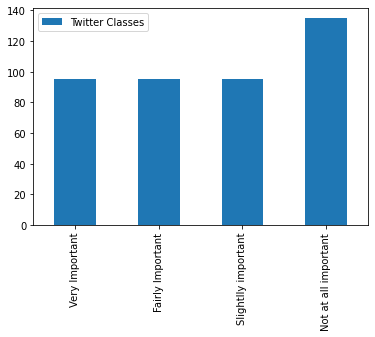
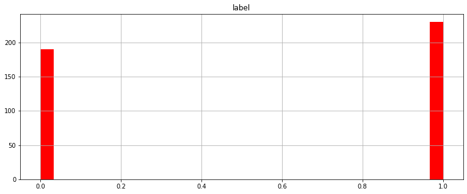
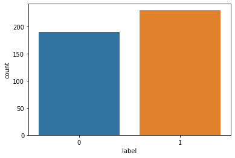
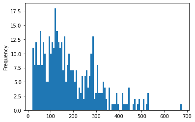
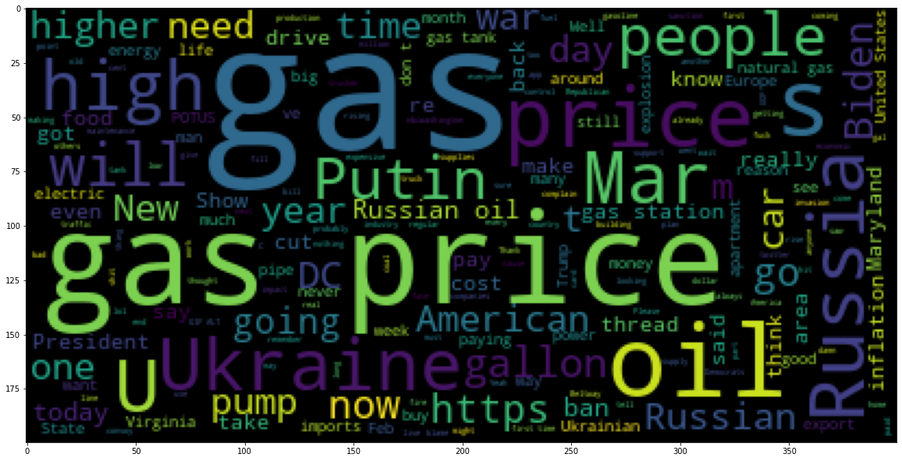
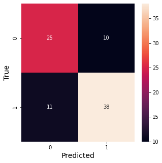

Hello, today we are going to perform  a **Twitter Sentiment Analysis** by a custom **Geographical Area**. In this blog post we are not use the Twitter Developer Account, instead I will use a simple and unlimited Twitter scraper with python.

 I am interested  to get top tweets with a **custom keyword** ,  **geolocated** less than 50 km from **White House** in the United States. I would like to analyze the word **"gas"** around the White House  during one month since the **February 24 2022** .


​															White House in United States

## Installation of Conda

First you need to install anaconda at this [link](https://www.anaconda.com/products/individual)


in this location **C:\Anaconda3** , then you, check that your terminal , recognize **conda**

```
C:\conda --version
conda 4.12.0
```

# Step 1. Environment creation

The environments supported that I will consider is Python 3.7, 

I will create an environment called **twitter**, but you can put the name that you like.

```
conda create -n twitter python==3.7
```

then we activate	

```
conda activate twitter
```

then in your terminal type the following commands:

```
conda install ipykernel
```

then

```
python -m ipykernel install --user --name twitter --display-name "Python (Twitter)"
```

you will get something like

```
(twitter) C:\Users\ruslamv>python -m ipykernel install --user --name twitter --display-name "Python (Twitter)"
Installed kernelspec twitter in C:\Users\ruslanmv\AppData\Roaming\jupyter\kernels\twitter
```

If you want to delete  your conda environment

```
conda env remove -n twitter
```

# Step 2. Installation of the repositories

```
pip install certifi pandas python-dotenv chromedriver-autoinstaller geckodriver-autoinstaller urllib3 seaborn sklearn
```

```
pip install selenium==4.2.0 
```

and finally the great scrapper

```
pip install Scweet==1.8
```

and the geolocation

```
pip install geopy
```

and to analize the text 

```
pip install wordcloud nltk
```

then open the **Jupyter notebook** with the command

```
jupyter notebook&
```

Let us  get top tweets with a **custom keyword** like 'gas' **geolocated** less than 50 km from White house.

In this notebook we are going to classify important and no important twitter text messages by considering the number of likes.
We are going to webscrap one month of twitter messages and analize them. We will choose one geographical area and from it , we will consider a radio around it and extract all possible twitts that contains a keyword of your interest.

For this blogpost we will consider the keyword **gas** and we will choose the **White House** and we are going to choose the dates one month after the War In Ukraine started.  Just for curiosity. Get started. The interesting thing is that we do not need any account with twitter and the requests are unlimited and free.

# Step 3. Getting the data

After the  notebook is open you can import and use the functions as follows:


```python
#Loading Libraries
```


```python
from Scweet.scweet import scrape
from Scweet.user import get_user_information, get_users_following, get_users_followers
from geopy.geocoders import Nominatim
```

The first step is initialize the geolocator engine

```
geolocator = Nominatim(user_agent="twitter")
```

### Selection of place

Here we need to specify the address you want to perform the analysis , for example, you can choose your home address or  the street and number that you want to perform the research, in my case I chose the White House.


```python
location = geolocator.geocode(" White House ") 
```


```python
print(location.address)
```

    White House, 1600, Pennsylvania Avenue Northwest, Washington, District of Columbia, 20500, United States

```python
print((location.latitude, location.longitude))
```

    (38.897699700000004, -77.03655315)

and we setup the radius that we want to explorer

```python
distance="50km"
```


```python
geolocation=str(location.latitude)+","+str(location.longitude)+","+str(distance)
```


```python
geolocation
```


    '38.897699700000004,-77.03655315,50km'

and also the period of time that you want to perform the research, then we create the dataset as follows, after this, we will wait a while until the webscrapping will work, and extract all the data


```python
data = scrape(words=['gas'],
              since="2022-02-24", 
              until="2022-03-24", 
              from_account = None,      
              interval=1, 
              headless=False, 
              display_type="Top", 
              save_images=False, lang="en",
              resume=False, 
              filter_replies=False,
              proximity=False,
              geocode=geolocation)
```

    looking for tweets between 2022-02-24 and 2022-02-25 ...
    .
    .
    .

you can see the shape

```python
data.shape
```


    (420, 11)

you can save the data


```python
data.to_csv('my_twitter.csv', index=False)
```

Get the main information of a given list of users.   From the data, you can identify one single user


```python
users = ['BrianJohnsonMPA',] 
```


```python
# this function return a list that contains : 
# ["nb of following","nb of followers", "join date", "birthdate", "location", "website", "description"]
users_info = get_user_information(users, headless=True)
```

    Scraping on headless mode.
    --------------- BrianJohnsonMPA information : ---------------
    Following :  3,370
    Followers :  1,067
    Location :  Washington, DC
    Join date :  Joined July 2015
    Birth date :  
    Description :  VP Gov & Public Affairs / Head of Office, Veterans Guardian | Past: Vogel Group, American Petroleum Institute & Americans for Tax Reform | views my own
    Website :  https://t.co/SXSxU0WBXH

as you see you can get a lot of information that can be very useful to the analysis of the region.

Moreover you can extract more information of the single user.

```python
import pandas as pd

users_df = pd.DataFrame(users_info, index = ["nb of following","nb of followers", "join date", 
                                             "birthdate", "location", "website", "description"]).T
users_df
```

<table border="1" class="dataframe">
  <thead>
    <tr style="text-align: right;">
      <th></th>
      <th>nb of following</th>
      <th>nb of followers</th>
      <th>join date</th>
      <th>birthdate</th>
      <th>location</th>
      <th>website</th>
      <th>description</th>
    </tr>
  </thead>
  <tbody>
    <tr>
      <th>BrianJohnsonMPA</th>
      <td>3,370</td>
      <td>1,067</td>
      <td>Joined July 2015</td>
      <td></td>
      <td>Washington, DC</td>
      <td>https://t.co/SXSxU0WBXH</td>
      <td>VP Gov &amp; Public Affairs / Head of Office, Vete...</td>
    </tr>
  </tbody>
</table>

Interesting, well, let us continue to clean our dataset.


```python
import pandas as pd
import numpy as np
import seaborn as sns
import matplotlib.pyplot as plt
```


```python
df=pd.read_csv('my_twitter.csv') 
```

We replace NAN values with 0 ror the whole DataFrame using pandas


```python
df=df.fillna(0)
```


```python
df.head()
```


<table border="1" class="dataframe">
  <thead>
    <tr style="text-align: right;">
      <th></th>
      <th>UserScreenName</th>
      <th>UserName</th>
      <th>Timestamp</th>
      <th>Text</th>
      <th>Embedded_text</th>
      <th>Emojis</th>
      <th>Comments</th>
      <th>Likes</th>
      <th>Retweets</th>
      <th>Image link</th>
      <th>Tweet URL</th>
    </tr>
  </thead>
  <tbody>
    <tr>
      <th>0</th>
      <td>Tommie Collins</td>
      <td>@tommiecollins</td>
      <td>2022-02-24T01:30:26.000Z</td>
      <td>Tommie Collins\n@tommiecollins\n·\nFeb 24</td>
      <td>So hold up...gas is almost $4 and y'all drivin...</td>
      <td>0</td>
      <td>6.0</td>
      <td>22.0</td>
      <td>68</td>
      <td>['https://pbs.twimg.com/ext_tw_video_thumb/149...</td>
      <td>https://twitter.com/tommiecollins/status/14966...</td>
    </tr>
    <tr>
      <th>1</th>
      <td>David Nichols</td>
      <td>@DavidNichols_31</td>
      <td>2022-02-24T22:15:45.000Z</td>
      <td>David Nichols\n@DavidNichols_31\n·\nFeb 24</td>
      <td>My only take on the War in the Ukraine is I be...</td>
      <td>0</td>
      <td>0.0</td>
      <td>1.0</td>
      <td>4</td>
      <td>[]</td>
      <td>https://twitter.com/DavidNichols_31/status/149...</td>
    </tr>
    <tr>
      <th>2</th>
      <td>KratosOfPortugal</td>
      <td>@KratosPRT</td>
      <td>2022-02-24T03:35:14.000Z</td>
      <td>KratosOfPortugal\n@KratosPRT\n·\nFeb 24</td>
      <td>Get ready for expensive gas.\nAFP News Agency\...</td>
      <td>0</td>
      <td>0.0</td>
      <td>0.0</td>
      <td>7</td>
      <td>['https://pbs.twimg.com/profile_images/1272776...</td>
      <td>https://twitter.com/KratosPRT/status/149669015...</td>
    </tr>
    <tr>
      <th>3</th>
      <td>Samuel Hammond</td>
      <td>@hamandcheese</td>
      <td>2022-02-24T17:26:52.000Z</td>
      <td>Samuel Hammond\n@hamandcheese\n·\nFeb 24</td>
      <td>Atlantic Canada is sitting on trillions of cub...</td>
      <td>🌐 🏛 🏗</td>
      <td>2.0</td>
      <td>5.0</td>
      <td>34</td>
      <td>['https://pbs.twimg.com/profile_images/1437631...</td>
      <td>https://twitter.com/hamandcheese/status/149689...</td>
    </tr>
    <tr>
      <th>4</th>
      <td>Brian M. Johnson MPA</td>
      <td>@BrianJohnsonMPA</td>
      <td>2022-02-24T19:06:04.000Z</td>
      <td>Brian M. Johnson MPA\n@BrianJohnsonMPA\n·\nFeb 24</td>
      <td>Replying to \n@JerryDunleavy\nOil &amp; natural ga...</td>
      <td>0</td>
      <td>3.0</td>
      <td>3.0</td>
      <td>16</td>
      <td>[]</td>
      <td>https://twitter.com/BrianJohnsonMPA/status/149...</td>
    </tr>
  </tbody>
</table>

and let us choose the information that it is more relevant for us


```python
dfa=df[['Embedded_text','Likes','Comments','Retweets','UserName']]
```


```python
dfa.head()
```

<table border="1" class="dataframe">
  <thead>
    <tr style="text-align: right;">
      <th></th>
      <th>Embedded_text</th>
      <th>Likes</th>
      <th>Comments</th>
      <th>Retweets</th>
      <th>UserName</th>
    </tr>
  </thead>
  <tbody>
    <tr>
      <th>0</th>
      <td>So hold up...gas is almost $4 and y'all drivin...</td>
      <td>22.0</td>
      <td>6.0</td>
      <td>68</td>
      <td>@tommiecollins</td>
    </tr>
    <tr>
      <th>1</th>
      <td>My only take on the War in the Ukraine is I be...</td>
      <td>1.0</td>
      <td>0.0</td>
      <td>4</td>
      <td>@DavidNichols_31</td>
    </tr>
    <tr>
      <th>2</th>
      <td>Get ready for expensive gas.\nAFP News Agency\...</td>
      <td>0.0</td>
      <td>0.0</td>
      <td>7</td>
      <td>@KratosPRT</td>
    </tr>
    <tr>
      <th>3</th>
      <td>Atlantic Canada is sitting on trillions of cub...</td>
      <td>5.0</td>
      <td>2.0</td>
      <td>34</td>
      <td>@hamandcheese</td>
    </tr>
    <tr>
      <th>4</th>
      <td>Replying to \n@JerryDunleavy\nOil &amp; natural ga...</td>
      <td>3.0</td>
      <td>3.0</td>
      <td>16</td>
      <td>@BrianJohnsonMPA</td>
    </tr>
  </tbody>
</table>


```python
df = dfa.sort_values(by=['Likes','Retweets','Comments'], ascending=False)
```


```python
df.head(10)
```

<table border="1" class="dataframe">
  <thead>
    <tr style="text-align: right;">
      <th></th>
      <th>Embedded_text</th>
      <th>Likes</th>
      <th>Comments</th>
      <th>Retweets</th>
      <th>UserName</th>
    </tr>
  </thead>
  <tbody>
    <tr>
      <th>378</th>
      <td>It doesn’t matter what a gallon of gas costs-r...</td>
      <td>473.0</td>
      <td>58.0</td>
      <td>2,739</td>
      <td>@JJCarafano</td>
    </tr>
    <tr>
      <th>323</th>
      <td>"We're banning all imports of Russian gas, oil...</td>
      <td>424.0</td>
      <td>70.0</td>
      <td>2,316</td>
      <td>@Liveuamap</td>
    </tr>
    <tr>
      <th>185</th>
      <td>These are also known as “pump gas with ya gloc...</td>
      <td>109.0</td>
      <td>7.0</td>
      <td>109</td>
      <td>@_JuiceJones</td>
    </tr>
    <tr>
      <th>322</th>
      <td>Gas is already at $4.33 a gallon here in DC, i...</td>
      <td>93.0</td>
      <td>187.0</td>
      <td>575</td>
      <td>@IntelDoge</td>
    </tr>
    <tr>
      <th>219</th>
      <td>In the search for new measures against  becaus...</td>
      <td>80.0</td>
      <td>24.0</td>
      <td>534</td>
      <td>@carlbildt</td>
    </tr>
    <tr>
      <th>377</th>
      <td>Good piece. I’ll add that i saw a thread yeste...</td>
      <td>55.0</td>
      <td>10.0</td>
      <td>199</td>
      <td>@SaysSimonson</td>
    </tr>
    <tr>
      <th>47</th>
      <td>Seeing whole columns of Russian armor out of g...</td>
      <td>43.0</td>
      <td>9.0</td>
      <td>249</td>
      <td>@klonkitchen</td>
    </tr>
    <tr>
      <th>396</th>
      <td>The EU spent almost 13 million EUR on Russian ...</td>
      <td>41.0</td>
      <td>5.0</td>
      <td>88</td>
      <td>@SashaUstinovaUA</td>
    </tr>
    <tr>
      <th>151</th>
      <td>Multiple sources tell me investigators believe...</td>
      <td>40.0</td>
      <td>3.0</td>
      <td>16</td>
      <td>@Brad7News</td>
    </tr>
    <tr>
      <th>375</th>
      <td>Gas might 5+ but riding dick is freee shordy\n...</td>
      <td>38.0</td>
      <td>3.0</td>
      <td>98</td>
      <td>@nikkotank</td>
    </tr>
  </tbody>
</table>

We have created a single dataset of messages around the white house.

# Step 4. Creation of the dataset 

We are interested to classify the twitter messages by the importance or relevance,

- Imporant 
- Unimportant


```python
df=df.reset_index(drop=True)
```


```python
df.plot(y='Likes', use_index=True)
```




```python
# selecting rows based on condition
df_likes = df.loc[df['Likes'] != 0]
df_likes.shape
```


    (116, 5)


```python
# selecting rows based on condition
df_retweets = df.loc[df['Retweets'] != 0]
df_retweets.shape
```


    (253, 5)


```python
# selecting rows based on condition
df_comments = df.loc[df['Comments'] != 0]
df_comments.shape
```


    (161, 5)

# Step 5. Labelling the messages

In this part, we will consider the unimportant messages, that there are not likes, neither retweets or comments.


```python
df_unimportant=df.loc[(df['Likes'] == 0) & (df['Retweets'] == 0)&(df['Comments'] == 0)]
df_unimportant.shape
```


    (135, 5)

and the important messages with likes, retweets and comments,


```python
df_important=df.loc[(df['Likes'] != 0) | (df['Retweets'] != 0)|(df['Comments'] != 0)]
df_important.shape
```


    (285, 5)


```python
# We check if our dimensions are okay
assert df_important.shape[0] +df_unimportant.shape[0] == df.shape[0], 'something is wrong'
print('its okay, the number of total messages are:',df.shape[0])
```

    its okay, the number of total messages are: 420

```python
df_important=df_important.reset_index(drop=True)
```


```python
df_important.plot(y='Comments', use_index=True)
```



    

```python
df_important.plot(y='Likes', use_index=True)
```


​    

​    


If we split the set of important twits into 3 categories we can do this approach


```python
size=int(len(df_important)/3)
```


```python
size
```


    95

It is possible split the the importance of the message may be splitted in

1. Very Important   
2. Fairly Important
3. Slightlly important
4. Not at all important


```python
s# splitting dataframe by row index
df_1 = df_important.iloc[:size,:]
df_2 = df_important.iloc[size:2*size,:]
df_3 = df_important.iloc[2*size:s,:]
df_4 = df_unimportant
```

However we are dealing with very few messages we cannot proceed with this approach, if you have larger dataset for sure you can proceed this way.


```python
df_1.head()
```

<table border="1" class="dataframe">
  <thead>
    <tr style="text-align: right;">
      <th></th>
      <th>Embedded_text</th>
      <th>Likes</th>
      <th>Comments</th>
      <th>Retweets</th>
      <th>UserName</th>
    </tr>
  </thead>
  <tbody>
    <tr>
      <th>0</th>
      <td>It doesn’t matter what a gallon of gas costs-r...</td>
      <td>473.0</td>
      <td>58.0</td>
      <td>2,739</td>
      <td>@JJCarafano</td>
    </tr>
    <tr>
      <th>1</th>
      <td>"We're banning all imports of Russian gas, oil...</td>
      <td>424.0</td>
      <td>70.0</td>
      <td>2,316</td>
      <td>@Liveuamap</td>
    </tr>
    <tr>
      <th>2</th>
      <td>These are also known as “pump gas with ya gloc...</td>
      <td>109.0</td>
      <td>7.0</td>
      <td>109</td>
      <td>@_JuiceJones</td>
    </tr>
    <tr>
      <th>3</th>
      <td>Gas is already at $4.33 a gallon here in DC, i...</td>
      <td>93.0</td>
      <td>187.0</td>
      <td>575</td>
      <td>@IntelDoge</td>
    </tr>
    <tr>
      <th>4</th>
      <td>In the search for new measures against  becaus...</td>
      <td>80.0</td>
      <td>24.0</td>
      <td>534</td>
      <td>@carlbildt</td>
    </tr>
  </tbody>
</table>


```python
print("Shape of new dataframes - {} , {}, {}".format(df_1.shape, df_2.shape,df_3.shape))
```

    Shape of new dataframes - (95, 5) , (95, 5), (95, 5)

```python
# Create a sample dataframe with an text index
plotdata = pd.DataFrame(
    {"Twitter Classes": [len(df_1), len(df_2), len(df_3), len(df_4)]}, 
    index=["Very Important", 
           "Fairly Important", 
           "Slightlly important", 
           "Not at all important"])
# Plot a bar chart
plotdata.plot(kind="bar")
```



    


but for simplicity we choose only two types, important and not important messages.

# Step 6. Let us consider only two classes important and not important 

```python
df_1['label'] = 0
df_2['label'] = 0
df_3['label'] = 1
df_4['label'] = 1
```

<table border="1" class="dataframe">
  <thead>
    <tr style="text-align: right;">
      <th></th>
      <th>Embedded_text</th>
      <th>Likes</th>
      <th>Comments</th>
      <th>Retweets</th>
      <th>UserName</th>
      <th>label</th>
    </tr>
  </thead>
  <tbody>
    <tr>
      <th>190</th>
      <td>Replying to \n@janjowen\nWhat if I want to rem...</td>
      <td>0.0</td>
      <td>2.0</td>
      <td>1</td>
      <td>@mls1776</td>
      <td>1</td>
    </tr>
    <tr>
      <th>191</th>
      <td>Replying to \n@schlthss\nEven our EVs depend o...</td>
      <td>0.0</td>
      <td>1.0</td>
      <td>1</td>
      <td>@sogand_karbalai</td>
      <td>1</td>
    </tr>
    <tr>
      <th>192</th>
      <td>Replying to \n@baecariss\nAll gas no break! \n...</td>
      <td>0.0</td>
      <td>1.0</td>
      <td>1</td>
      <td>@Team_Newby1</td>
      <td>1</td>
    </tr>
    <tr>
      <th>193</th>
      <td>Replying to \n@tharealcatmom\nCramps and gas. ...</td>
      <td>0.0</td>
      <td>1.0</td>
      <td>1</td>
      <td>@itstifftiara</td>
      <td>1</td>
    </tr>
    <tr>
      <th>194</th>
      <td>Replying to \n@Jim__840\n and \n@Arriadna\nThi...</td>
      <td>0.0</td>
      <td>1.0</td>
      <td>1</td>
      <td>@sonofnels</td>
      <td>1</td>
    </tr>
  </tbody>
</table>

There is slightlly unbalanced data


```python
# concatenating df1 and df2 along rows
df_twitter = pd.concat([df_1, df_2,df_3,df_4], axis=0)
```


```python
df_twitter.rename(columns = {'Embedded_text':'tweet'}, inplace = True)
```


```python
df_twitter.to_csv('twitter_gas.csv', index=False)
```


```python
# Load the data
tweets_df = pd.read_csv('twitter_gas.csv')
```


```python
tweets_df.shape
```


    (420, 6)


```python
tweets_df.head()
```

<table border="1" class="dataframe">
  <thead>
    <tr style="text-align: right;">
      <th></th>
      <th>tweet</th>
      <th>Likes</th>
      <th>Comments</th>
      <th>Retweets</th>
      <th>UserName</th>
      <th>label</th>
    </tr>
  </thead>
  <tbody>
    <tr>
      <th>0</th>
      <td>It doesn’t matter what a gallon of gas costs-r...</td>
      <td>473.0</td>
      <td>58.0</td>
      <td>2,739</td>
      <td>@JJCarafano</td>
      <td>0</td>
    </tr>
    <tr>
      <th>1</th>
      <td>"We're banning all imports of Russian gas, oil...</td>
      <td>424.0</td>
      <td>70.0</td>
      <td>2,316</td>
      <td>@Liveuamap</td>
      <td>0</td>
    </tr>
    <tr>
      <th>2</th>
      <td>These are also known as “pump gas with ya gloc...</td>
      <td>109.0</td>
      <td>7.0</td>
      <td>109</td>
      <td>@_JuiceJones</td>
      <td>0</td>
    </tr>
    <tr>
      <th>3</th>
      <td>Gas is already at $4.33 a gallon here in DC, i...</td>
      <td>93.0</td>
      <td>187.0</td>
      <td>575</td>
      <td>@IntelDoge</td>
      <td>0</td>
    </tr>
    <tr>
      <th>4</th>
      <td>In the search for new measures against  becaus...</td>
      <td>80.0</td>
      <td>24.0</td>
      <td>534</td>
      <td>@carlbildt</td>
      <td>0</td>
    </tr>
  </tbody>
</table>


```python
tweets_df.info()
```

    <class 'pandas.core.frame.DataFrame'>
    RangeIndex: 420 entries, 0 to 419
    Data columns (total 6 columns):
     #   Column    Non-Null Count  Dtype  
    ---  ------    --------------  -----  
     0   tweet     420 non-null    object 
     1   Likes     420 non-null    float64
     2   Comments  420 non-null    float64
     3   Retweets  420 non-null    object 
     4   UserName  420 non-null    object 
     5   label     420 non-null    int64  
    dtypes: float64(2), int64(1), object(3)
    memory usage: 19.8+ KB

```python
# Drop the 'id' column
tweets_df = tweets_df.drop(['Likes', 'Comments', 'Retweets', 'UserName'], axis=1)
```


```python
tweets_df.head()
```

<table border="1" class="dataframe">
  <thead>
    <tr style="text-align: right;">
      <th></th>
      <th>tweet</th>
      <th>label</th>
    </tr>
  </thead>
  <tbody>
    <tr>
      <th>0</th>
      <td>It doesn’t matter what a gallon of gas costs-r...</td>
      <td>0</td>
    </tr>
    <tr>
      <th>1</th>
      <td>"We're banning all imports of Russian gas, oil...</td>
      <td>0</td>
    </tr>
    <tr>
      <th>2</th>
      <td>These are also known as “pump gas with ya gloc...</td>
      <td>0</td>
    </tr>
    <tr>
      <th>3</th>
      <td>Gas is already at $4.33 a gallon here in DC, i...</td>
      <td>0</td>
    </tr>
    <tr>
      <th>4</th>
      <td>In the search for new measures against  becaus...</td>
      <td>0</td>
    </tr>
  </tbody>
</table>


```python
tweets_df.hist(bins = 30, figsize = (13,5), color = 'r')
```



    

```python
sns.countplot(tweets_df['label'], label = "Count")
```




```python
# Let's get the length of the messages
tweets_df['length'] = tweets_df['tweet'].apply(len)
```


```python
tweets_df.head()
```

<table border="1" class="dataframe">
  <thead>
    <tr style="text-align: right;">
      <th></th>
      <th>tweet</th>
      <th>label</th>
      <th>length</th>
    </tr>
  </thead>
  <tbody>
    <tr>
      <th>0</th>
      <td>It doesn’t matter what a gallon of gas costs-r...</td>
      <td>0</td>
      <td>131</td>
    </tr>
    <tr>
      <th>1</th>
      <td>"We're banning all imports of Russian gas, oil...</td>
      <td>0</td>
      <td>197</td>
    </tr>
    <tr>
      <th>2</th>
      <td>These are also known as “pump gas with ya gloc...</td>
      <td>0</td>
      <td>67</td>
    </tr>
    <tr>
      <th>3</th>
      <td>Gas is already at $4.33 a gallon here in DC, i...</td>
      <td>0</td>
      <td>125</td>
    </tr>
    <tr>
      <th>4</th>
      <td>In the search for new measures against  becaus...</td>
      <td>0</td>
      <td>284</td>
    </tr>
  </tbody>
</table>


```python
tweets_df.describe()
```

<table border="1" class="dataframe">
  <thead>
    <tr style="text-align: right;">
      <th></th>
      <th>label</th>
      <th>length</th>
    </tr>
  </thead>
  <tbody>
    <tr>
      <th>count</th>
      <td>420.000000</td>
      <td>420.000000</td>
    </tr>
    <tr>
      <th>mean</th>
      <td>0.547619</td>
      <td>178.990476</td>
    </tr>
    <tr>
      <th>std</th>
      <td>0.498321</td>
      <td>116.781234</td>
    </tr>
    <tr>
      <th>min</th>
      <td>0.000000</td>
      <td>20.000000</td>
    </tr>
    <tr>
      <th>25%</th>
      <td>0.000000</td>
      <td>93.750000</td>
    </tr>
    <tr>
      <th>50%</th>
      <td>1.000000</td>
      <td>148.500000</td>
    </tr>
    <tr>
      <th>75%</th>
      <td>1.000000</td>
      <td>258.000000</td>
    </tr>
    <tr>
      <th>max</th>
      <td>1.000000</td>
      <td>677.000000</td>
    </tr>
  </tbody>
</table>


```python
# Let's see the shortest message 
tweets_df[tweets_df['length'] == 20]['tweet'].iloc[0]
```


    'Premium gas is 5.30?'


```python
# Let's view the message with mean length 
tweets_df[tweets_df['length'] == 178]['tweet'].iloc[0]
```


    'The EU spent almost 13 million EUR on Russian coal, oil, and gas since the Kremlin’s war on Ukraine began on February 24. \n\nStop financing Putin’s war machine! #StopPutin\n5\n41\n88'


```python
# Plot the histogram of the length column
tweets_df['length'].plot(bins=100, kind='hist') 
```




```python
#Very Important 
class1 = tweets_df[tweets_df['label']==0]
#Fairly Important
class2 = tweets_df[tweets_df['label']==0]
#Slightlly important
class3 = tweets_df[tweets_df['label']==1]
#Not at all important
class4 = tweets_df[tweets_df['label']==1]
```


```python
sentences = tweets_df['tweet'].tolist()
len(sentences)
```


    420


```python
sentences_as_one_string =" ".join(sentences)
```


```python
sentences_as_one_string =sentences_as_one_string.replace('Replying', '')
```


```python
from wordcloud import WordCloud
plt.figure(figsize=(20,20))
plt.imshow(WordCloud().generate(sentences_as_one_string))
```



    


# Step 7. Perform data cleaning - remove punctuation from text

Let us summarize some standard techniques to clean our text


```python
import string
string.punctuation
```


    '!"#$%&\'()*+,-./:;<=>?@[\\]^_`{|}~'


```python
Test = '$I love AI & Machine learning!!'
Test_punc_removed = [char for char in Test if char not in string.punctuation]
Test_punc_removed_join = ''.join(Test_punc_removed)
Test_punc_removed_join
```


    'I love AI  Machine learning'


```python
Test = 'Good morning beautiful people :)... I am having fun learning Machine learning and AI!!'
```


```python
Test_punc_removed = [char for char in Test if char not in string.punctuation]
```


```python
# Join the characters again to form the string.
Test_punc_removed_join = ''.join(Test_punc_removed)
Test_punc_removed_join
```


    'Good morning beautiful people  I am having fun learning Machine learning and AI'

## Perform Data Cleaning - Remove Stopwords


```python
import nltk # Natural Language tool kit 
nltk.download('stopwords')

# You have to download stopwords Package to execute this command
from nltk.corpus import stopwords
#stopwords.words('english')
```

    [nltk_data] Downloading package stopwords to
    [nltk_data]     C:\Users\rusla\AppData\Roaming\nltk_data...
    [nltk_data]   Package stopwords is already up-to-date!

```python
Test_punc_removed_join = 'I enjoy coding, programming and Artificial intelligence'
Test_punc_removed_join_clean = [word for word in Test_punc_removed_join.split() if word.lower() not in stopwords.words('english')]
```


```python
Test_punc_removed_join_clean # Only important (no so common) words are left
```


    ['enjoy', 'coding,', 'programming', 'Artificial', 'intelligence']

## Perform Count Vectorization (Tokenization)


```python
from sklearn.feature_extraction.text import CountVectorizer
sample_data = ['This is the first paper.','This document is the second paper.','And this is the third one.','Is this the first paper?']
vectorizer = CountVectorizer()
X = vectorizer.fit_transform(sample_data)
```


```python
print(vectorizer.get_feature_names())
```

    ['and', 'document', 'first', 'is', 'one', 'paper', 'second', 'the', 'third', 'this']

```python
print(X.toarray())  
```

    [[0 0 1 1 0 1 0 1 0 1]
     [0 1 0 1 0 1 1 1 0 1]
     [1 0 0 1 1 0 0 1 1 1]
     [0 0 1 1 0 1 0 1 0 1]]


## Removing any URL within a string in Python


```python
text='''
text1
text2
http://url.com/bla1/blah1/
text3
text4
http://url.com/bla2/blah2/
text5
text6
http://url.com/bla3/blah3/'
The White House Gaslights on Gas | by @njhochman  https://nationalreview.com/corner/the-white-house-gaslights-on-gas/?taid=6228b39e07024b000156be08&utm_campaign=trueanthem&utm_medium=social&utm_source=twitter…
'''
```


```python
import re
text = re.sub(r'\w+:\/{2}[\d\w-]+(\.[\d\w-]+)*(?:(?:\/[^\s/]*))*', '', text)
print(text)
```


    text1
    text2
    
    text3
    text4
    
    text5
    text6
    
    The White House Gaslights on Gas | by @njhochman  

# Step 8. Create a pipeline to remove Punctuations, Stopwords and perform Count Vectorization

Let's define a pipeline to clean up all the messages 
The pipeline performs the following:

1. remove urls

2. remove punctuation

3. remove stopwords


```python
import re
def message_cleaning(message):
    message =re.sub(r'\w+:\/{2}[\d\w-]+(\.[\d\w-]+)*(?:(?:\/[^\s/]*))*', '', message)    
    Test_punc_removed = [char for char in message if char not in string.punctuation]
    Test_punc_removed_join = ''.join(Test_punc_removed)
    Test_punc_removed_join_clean = [word for word in Test_punc_removed_join.split() if word.lower() not in stopwords.words('english')]
    return Test_punc_removed_join_clean
```


```python
# Let's test the newly added function
tweets_df_clean = tweets_df['tweet'].apply(message_cleaning)
```


```python
print(tweets_df_clean[5]) # show the cleaned up version
```

    ['Good', 'piece', 'I’ll', 'add', 'saw', 'thread', 'yesterday', '3', 'legacy', 'media', 'reporters', 'total', 'agreement', 'there’s', 'nothing', 'get', 'gas', 'ground', 'right', 'One', 'said', 'straight', 'face', '“even', 'permit', 'issued', 'takes', 'long', 'time', 'drill”', 'National', 'Review', 'NRO', '·', 'Mar', '9', 'White', 'House', 'Gaslights', 'Gas', 'njhochman', '10', '55', '199']

```python
print(tweets_df['tweet'][5]) # show the original version
```

    Good piece. I’ll add that i saw a thread yesterday with 3 legacy media reporters in total agreement that there’s nothing we can do to get more gas out of the ground right now. One of them said with a straight face “even after the permit is issued, it takes a long time to drill”
    National Review
    @NRO
     · Mar 9
    The White House Gaslights on Gas | by @njhochman  https://nationalreview.com/corner/the-white-house-gaslights-on-gas/?taid=6228b39e07024b000156be08&utm_campaign=trueanthem&utm_medium=social&utm_source=twitter…
    10
    55
    199


```python
from sklearn.feature_extraction.text import CountVectorizer
# Define the cleaning pipeline we defined earlier
vectorizer = CountVectorizer(analyzer = message_cleaning, dtype = np.uint8)
tweets_countvectorizer = vectorizer.fit_transform(tweets_df['tweet'])
```


```python
print(vectorizer.get_feature_names())
```

```python
print(tweets_countvectorizer.toarray())  
```

    [[0 0 0 ... 0 0 0]
     [0 0 0 ... 0 0 0]
     [0 0 0 ... 0 0 0]
     ...
     [0 0 0 ... 0 0 0]
     [0 0 0 ... 0 0 0]
     [0 0 0 ... 0 0 0]]

```python
tweets_countvectorizer.shape
```


    (420, 3463)


```python
X = pd.DataFrame(tweets_countvectorizer.toarray())
```


```python
X.head()
```

<table border="1" class="dataframe">
  <thead>
    <tr style="text-align: right;">
      <th></th>
      <th>0</th>
      <th>1</th>
      <th>2</th>
      <th>3</th>
      <th>4</th>
      <th>5</th>
      <th>6</th>
      <th>7</th>
      <th>8</th>
      <th>9</th>
      <th>...</th>
      <th>3453</th>
      <th>3454</th>
      <th>3455</th>
      <th>3456</th>
      <th>3457</th>
      <th>3458</th>
      <th>3459</th>
      <th>3460</th>
      <th>3461</th>
      <th>3462</th>
    </tr>
  </thead>
  <tbody>
    <tr>
      <th>0</th>
      <td>0</td>
      <td>0</td>
      <td>0</td>
      <td>0</td>
      <td>0</td>
      <td>0</td>
      <td>0</td>
      <td>0</td>
      <td>0</td>
      <td>0</td>
      <td>...</td>
      <td>0</td>
      <td>0</td>
      <td>0</td>
      <td>0</td>
      <td>0</td>
      <td>0</td>
      <td>0</td>
      <td>0</td>
      <td>0</td>
      <td>0</td>
    </tr>
    <tr>
      <th>1</th>
      <td>0</td>
      <td>0</td>
      <td>0</td>
      <td>0</td>
      <td>0</td>
      <td>0</td>
      <td>0</td>
      <td>0</td>
      <td>0</td>
      <td>0</td>
      <td>...</td>
      <td>0</td>
      <td>0</td>
      <td>0</td>
      <td>0</td>
      <td>0</td>
      <td>0</td>
      <td>0</td>
      <td>0</td>
      <td>0</td>
      <td>0</td>
    </tr>
    <tr>
      <th>2</th>
      <td>0</td>
      <td>0</td>
      <td>0</td>
      <td>0</td>
      <td>0</td>
      <td>0</td>
      <td>0</td>
      <td>0</td>
      <td>0</td>
      <td>0</td>
      <td>...</td>
      <td>0</td>
      <td>0</td>
      <td>0</td>
      <td>0</td>
      <td>0</td>
      <td>0</td>
      <td>0</td>
      <td>0</td>
      <td>0</td>
      <td>0</td>
    </tr>
    <tr>
      <th>3</th>
      <td>0</td>
      <td>0</td>
      <td>0</td>
      <td>0</td>
      <td>0</td>
      <td>0</td>
      <td>0</td>
      <td>0</td>
      <td>0</td>
      <td>0</td>
      <td>...</td>
      <td>0</td>
      <td>0</td>
      <td>0</td>
      <td>0</td>
      <td>0</td>
      <td>0</td>
      <td>0</td>
      <td>0</td>
      <td>0</td>
      <td>0</td>
    </tr>
    <tr>
      <th>4</th>
      <td>0</td>
      <td>0</td>
      <td>0</td>
      <td>0</td>
      <td>0</td>
      <td>0</td>
      <td>0</td>
      <td>0</td>
      <td>0</td>
      <td>0</td>
      <td>...</td>
      <td>0</td>
      <td>0</td>
      <td>0</td>
      <td>0</td>
      <td>0</td>
      <td>0</td>
      <td>0</td>
      <td>0</td>
      <td>0</td>
      <td>0</td>
    </tr>
  </tbody>
</table>
<p>5 rows × 3463 columns</p>


```python
y = tweets_df['label']
```


# Step 9. Train and evaluate a Naive Bayes Classifier Model


In statistics, naive Bayes classifiers are a family of simple "probabilistic classifiers" based on applying Bayes' theorem with strong independence assumptions between the features. They are among the simplest Bayesian network models, but coupled with kernel density estimation, they can achieve high accuracy levels

The fundamental Naive Bayes assumption is that each feature makes an:

- independent
- equal

contribution to the outcome.

With relation to our dataset, this concept can be understood as:

- We assume that no pair of features are dependent. For example, the  price being ‘Expensive’ has nothing to do with the White. Hence, the features are assumed to be **independent**.
- Secondly, each feature is given the same weight(or importance). For example, knowing only price and oil alone can’t predict the outcome accurately. None of the attributes is irrelevant and assumed to be contributing **equally** to the outcome.


```python
X.shape
```


    (420, 3463)


```python
y.shape
```


    (420,)


```python
from sklearn.model_selection import train_test_split
X_train, X_test, y_train, y_test = train_test_split(X, y, test_size=0.2)
```


```python
from sklearn.naive_bayes import MultinomialNB

NB_classifier = MultinomialNB()
NB_classifier.fit(X_train, y_train)
```


    MultinomialNB()


```python
from sklearn.metrics import classification_report, confusion_matrix
```


```python
# Predicting the Test set results
y_predict_test = NB_classifier.predict(X_test)
fig, ax = plt.subplots(figsize=(5,5))

cm = confusion_matrix(y_test, y_predict_test)
sns.heatmap(cm, annot=True)
plt.xlabel('Predicted',fontsize=14)
plt.ylabel('True',fontsize=14)

```


    Text(24.0, 0.5, 'True')



    

```python
print(classification_report(y_test, y_predict_test))
```

                  precision    recall  f1-score   support
    
               0       0.69      0.71      0.70        35
               1       0.79      0.78      0.78        49
    
        accuracy                           0.75        84
       macro avg       0.74      0.74      0.74        84
    weighted avg       0.75      0.75      0.75        84

​    

You can download the notebook [here](https://github.com/ruslanmv/How-to-predict-Twitter-Sentiment-Analysis/blob/master/Twitter-Sentiment-Analysis-by-Geographical-Area.ipynb).

**Congratulations!.** You have created a dataset from twitter and analyzed which messages are relevant in according to one keyword around one geographical area.