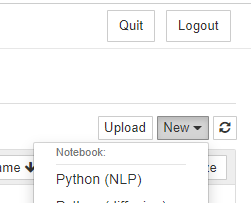
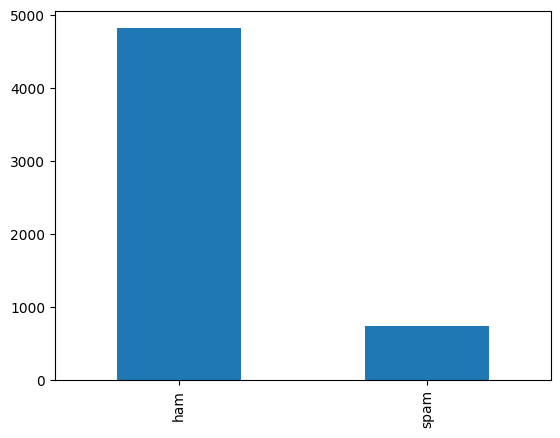
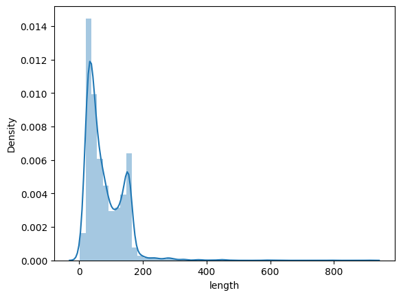
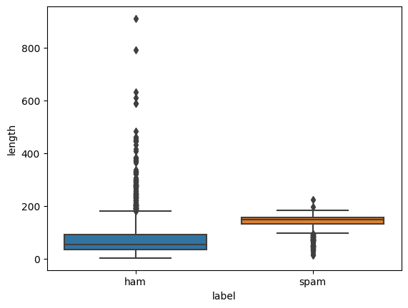
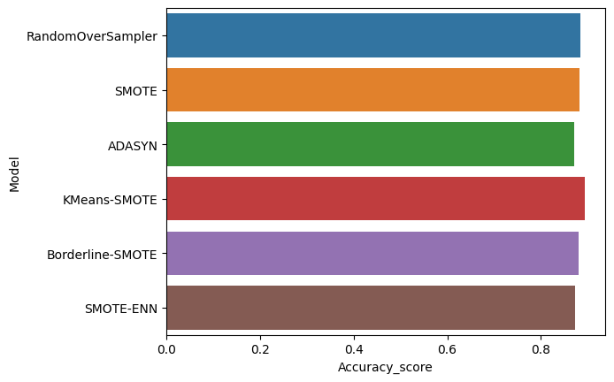
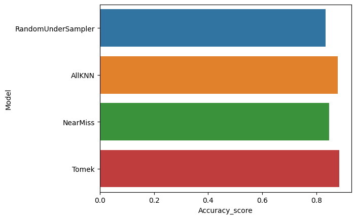
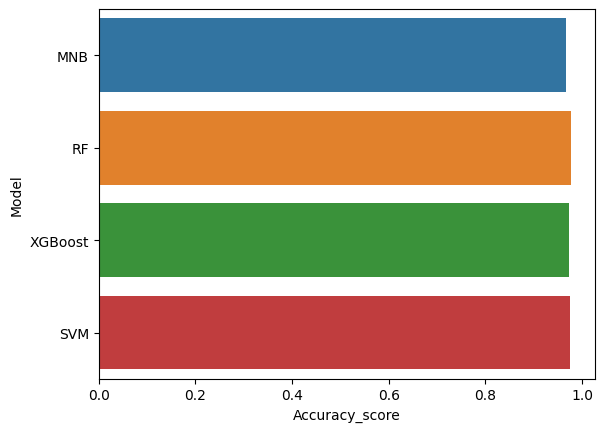

Hello everyone today we are going to discuss an interesting problem with imbalanced text data.

We are interested to **classify messages** that are **spam.** 

We are going to test different classification models such as **Multinomial Naive Bayes**, **Random Forest** (RF), **XGBoost**, **Support Vector Machines** (SVM), and different sampling and under-sampling methods such as **Random over-sampling**, **SMOTE**, and derivations, **Random under-sampling** techniques. 

This example is helpful to show how to deal with this type of problem for your custom **NLP problems**.

## What is Imbalanced Data?

Imbalanced data typically refers to a problem with classification problems where the classes are not represented equally.

There different performance measures that can give more insight into the accuracy of the model than traditional classification accuracy:

- **Confusion Matrix**: A breakdown of predictions into a table showing correct predictions (the diagonal) and the types of incorrect predictions made (what classes incorrect predictions were assigned).
- **Precision**: A measure of a classifiers exactness.
- **Recall**: A measure of a classifiers completeness
- **F1 Score (or F-score)**: A weighted average of precision and recall.

- **Kappa (or [Cohen’s kappa](https://en.wikipedia.org/wiki/Cohen's_kappa))**: Classification accuracy normalized by the imbalance of the classes in the data.
- **ROC Curves**: Like precision and recall, accuracy is divided into sensitivity and specificity and models can be chosen based on the balance thresholds of these values.

## Step 1. Creation of the environment

I will create an environment called **nlp**, because I am interested in  the **Natural Language Processing** (NLP) . 

NLP enables computers to understand natural language as humans do. Whether the language is spoken or written, natural language processing uses artificial intelligence to take real-world input, process it, and make sense of it in a way a computer can understand.

First you need to install anaconda at this [link](https://www.anaconda.com/products/individual)

then after is installed type in your terminal

```
conda create -n nlp python==3.8
```

then

```
conda activate nlp
```

then in your terminal type the following commands:

```
conda install ipykernel
```

then we install

```
python -m ipykernel install --user --name nlp --display-name "Python (NLP)"
```

then  we install the following libraries

```
pip install  matplotlib seaborn nltk sklearn plotly wordcloud xgboost imbalanced-learn notebook jupyter
```

then we type 

```
jupyter notebook
```



and we choose our  Python (NLP) notebook.

We are interested to work in the problem of **Spam Detection by using NLP**.

In this project we are going to use a dataset contains messages that are spam and not.

You can download the dataset [here](https://github.com/ruslanmv/How-to-handle-imbalanced-text-data/blob/master/spam.csv).

## Step 2. Load libraries

```python
#importing necessary libraries
# General

import numpy as np
import pandas as pd
import re
import os
import pickle

# EDA

import matplotlib.pyplot as plt
import seaborn as sns 
import plotly.express as px
from wordcloud import WordCloud
from collections import Counter

# NLP 

import nltk
from nltk.corpus import stopwords
from nltk.stem.porter import PorterStemmer
from sklearn.feature_extraction.text import TfidfVectorizer
from nltk.tokenize import word_tokenize 

# ML
from sklearn.pipeline import Pipeline
from sklearn.model_selection import train_test_split
from sklearn.naive_bayes import MultinomialNB
from sklearn.ensemble import RandomForestClassifier
from xgboost import XGBClassifier
from sklearn.svm import SVC
from sklearn.metrics import classification_report, confusion_matrix
```

## Step 3.  Data analysis

Here we need to analyze our dataset, first we read the dataset and then count how many messages are spam.


```python
df=pd.read_csv('spam.csv',encoding = 'latin-1')
df.head()
```

<table border="1" class="dataframe">
  <thead>
    <tr style="text-align: right;">
      <th></th>
      <th>v1</th>
      <th>v2</th>
      <th>Unnamed: 2</th>
      <th>Unnamed: 3</th>
      <th>Unnamed: 4</th>
    </tr>
  </thead>
  <tbody>
    <tr>
      <th>0</th>
      <td>ham</td>
      <td>Go until jurong point, crazy.. Available only ...</td>
      <td>NaN</td>
      <td>NaN</td>
      <td>NaN</td>
    </tr>
    <tr>
      <th>1</th>
      <td>ham</td>
      <td>Ok lar... Joking wif u oni...</td>
      <td>NaN</td>
      <td>NaN</td>
      <td>NaN</td>
    </tr>
    <tr>
      <th>2</th>
      <td>spam</td>
      <td>Free entry in 2 a wkly comp to win FA Cup fina...</td>
      <td>NaN</td>
      <td>NaN</td>
      <td>NaN</td>
    </tr>
    <tr>
      <th>3</th>
      <td>ham</td>
      <td>U dun say so early hor... U c already then say...</td>
      <td>NaN</td>
      <td>NaN</td>
      <td>NaN</td>
    </tr>
    <tr>
      <th>4</th>
      <td>ham</td>
      <td>Nah I don't think he goes to usf, he lives aro...</td>
      <td>NaN</td>
      <td>NaN</td>
      <td>NaN</td>
    </tr>
  </tbody>
</table>


```python
df['v1'].value_counts(dropna=False).plot(kind='bar')
```



    

Moreover we can get more information of our dataset by typing

```python
df.info()
```

    <class 'pandas.core.frame.DataFrame'>
    RangeIndex: 5572 entries, 0 to 5571
    Data columns (total 5 columns):
     #   Column      Non-Null Count  Dtype 
    ---  ------      --------------  ----- 
     0   v1          5572 non-null   object
     1   v2          5572 non-null   object
     2   Unnamed: 2  50 non-null     object
     3   Unnamed: 3  12 non-null     object
     4   Unnamed: 4  6 non-null      object
    dtypes: object(5)
    memory usage: 217.8+ KB

or simply

```python
df.describe()
```

<table border="1" class="dataframe">
  <thead>
    <tr style="text-align: right;">
      <th></th>
      <th>v1</th>
      <th>v2</th>
      <th>Unnamed: 2</th>
      <th>Unnamed: 3</th>
      <th>Unnamed: 4</th>
    </tr>
  </thead>
  <tbody>
    <tr>
      <th>count</th>
      <td>5572</td>
      <td>5572</td>
      <td>50</td>
      <td>12</td>
      <td>6</td>
    </tr>
    <tr>
      <th>unique</th>
      <td>2</td>
      <td>5169</td>
      <td>43</td>
      <td>10</td>
      <td>5</td>
    </tr>
    <tr>
      <th>top</th>
      <td>ham</td>
      <td>Sorry, I'll call later</td>
      <td>bt not his girlfrnd... G o o d n i g h t . . .@"</td>
      <td>MK17 92H. 450Ppw 16"</td>
      <td>GNT:-)"</td>
    </tr>
    <tr>
      <th>freq</th>
      <td>4825</td>
      <td>30</td>
      <td>3</td>
      <td>2</td>
      <td>2</td>
    </tr>
  </tbody>
</table>


```python
#checking for null values
df.isnull().sum()
```


    v1               0
    v2               0
    Unnamed: 2    5522
    Unnamed: 3    5560
    Unnamed: 4    5566
    dtype: int64


```python
#dropping the column with more null values
df.drop(['Unnamed: 2','Unnamed: 3','Unnamed: 4'],axis=1,inplace=True)
df.isnull().sum()
```


    v1    0
    v2    0
    dtype: int64


```python
#renaming the columns
df=df.rename({'v1':'label','v2':'text'},axis=1)
df.head()
```

<table border="1" class="dataframe">
  <thead>
    <tr style="text-align: right;">
      <th></th>
      <th>label</th>
      <th>text</th>
    </tr>
  </thead>
  <tbody>
    <tr>
      <th>0</th>
      <td>ham</td>
      <td>Go until jurong point, crazy.. Available only ...</td>
    </tr>
    <tr>
      <th>1</th>
      <td>ham</td>
      <td>Ok lar... Joking wif u oni...</td>
    </tr>
    <tr>
      <th>2</th>
      <td>spam</td>
      <td>Free entry in 2 a wkly comp to win FA Cup fina...</td>
    </tr>
    <tr>
      <th>3</th>
      <td>ham</td>
      <td>U dun say so early hor... U c already then say...</td>
    </tr>
    <tr>
      <th>4</th>
      <td>ham</td>
      <td>Nah I don't think he goes to usf, he lives aro...</td>
    </tr>
  </tbody>
</table>


Calculating the length of each data sample. We will create a new length column that will show the length of each data sample. This new column will help us with preprocessing the data samples.


```python
df['length'] = df['text'].apply(lambda x: len(x))
```


```python
df.head()
```

<table border="1" class="dataframe">
  <thead>
    <tr style="text-align: right;">
      <th></th>
      <th>label</th>
      <th>text</th>
      <th>length</th>
    </tr>
  </thead>
  <tbody>
    <tr>
      <th>0</th>
      <td>ham</td>
      <td>Go until jurong point, crazy.. Available only ...</td>
      <td>111</td>
    </tr>
    <tr>
      <th>1</th>
      <td>ham</td>
      <td>Ok lar... Joking wif u oni...</td>
      <td>29</td>
    </tr>
    <tr>
      <th>2</th>
      <td>spam</td>
      <td>Free entry in 2 a wkly comp to win FA Cup fina...</td>
      <td>155</td>
    </tr>
    <tr>
      <th>3</th>
      <td>ham</td>
      <td>U dun say so early hor... U c already then say...</td>
      <td>49</td>
    </tr>
    <tr>
      <th>4</th>
      <td>ham</td>
      <td>Nah I don't think he goes to usf, he lives aro...</td>
      <td>61</td>
    </tr>
  </tbody>
</table>


Distribution based on length of words


```python
#analyzing text
df['length']=df['text'].apply(lambda x: len(x))
```


```python
sns.distplot(df['length'], kde=True)
```



    

```python
sns.boxplot(y='length', x='label', data=df)
```



    

```python
df.head()
```

<table border="1" class="dataframe">
  <thead>
    <tr style="text-align: right;">
      <th></th>
      <th>label</th>
      <th>text</th>
      <th>length</th>
    </tr>
  </thead>
  <tbody>
    <tr>
      <th>0</th>
      <td>ham</td>
      <td>Go until jurong point, crazy.. Available only ...</td>
      <td>111</td>
    </tr>
    <tr>
      <th>1</th>
      <td>ham</td>
      <td>Ok lar... Joking wif u oni...</td>
      <td>29</td>
    </tr>
    <tr>
      <th>2</th>
      <td>spam</td>
      <td>Free entry in 2 a wkly comp to win FA Cup fina...</td>
      <td>155</td>
    </tr>
    <tr>
      <th>3</th>
      <td>ham</td>
      <td>U dun say so early hor... U c already then say...</td>
      <td>49</td>
    </tr>
    <tr>
      <th>4</th>
      <td>ham</td>
      <td>Nah I don't think he goes to usf, he lives aro...</td>
      <td>61</td>
    </tr>
  </tbody>
</table>


## Step 4.  Data Preprocessing

NLTK has smaller sub-libraries that perform specific text cleaning tasks. These smaller libraries also have methods for text cleaning.


```python
from nltk.stem import WordNetLemmatizer
from nltk import word_tokenize
import re
nltk.download('punkt')
```

Downloading stop words. We download the English stop words so that the model can identify the stop words in the texts and remove them.


```python
nltk.download('stopwords')
nltk.download('omw-1.4')
```

We will use it to remove all the stop words in the dataset. We will then create custom functions for text cleaning and pass in the imported methods as parameters. To implement the custom functions, we will require Python regular expression (RegEx) module.


```python
def convert_to_lower(text):
    return text.lower()
def remove_numbers(text):
    number_pattern = r'\d+'
    without_number = re.sub(pattern=number_pattern, repl=" ", string=text)
    return without_number

import string
def remove_punctuation(text):
    return text.translate(str.maketrans('', '', string.punctuation))

def remove_stopwords(text):
    removed = []
    stop_words = list(stopwords.words("english"))
    tokens = word_tokenize(text)
    for i in range(len(tokens)):
        if tokens[i] not in stop_words:
            removed.append(tokens[i])
    return " ".join(removed)
def remove_extra_white_spaces(text):
    single_char_pattern = r'\s+[a-zA-Z]\s+'
    without_sc = re.sub(pattern=single_char_pattern, repl=" ", string=text)
    return without_sc
def lemmatizing(text):
    lemmatizer = WordNetLemmatizer()
    tokens = word_tokenize(text)
    for i in range(len(tokens)):
        lemma_word = lemmatizer.lemmatize(tokens[i])
        tokens[i] = lemma_word
    return " ".join(tokens)


```


```python
df['text_clean'] = df['text'].apply(lambda x: convert_to_lower(x))
```


```python
df['text_clean'] = df['text_clean'].apply(lambda x: remove_numbers(x))
```


```python
df['text_clean'] = df['text_clean'].apply(lambda x: remove_punctuation(x))
```


```python
df['text_clean'] = df['text_clean'].apply(lambda x: remove_stopwords(x))
```


```python
df['text_clean'] = df['text_clean'].apply(lambda x: remove_extra_white_spaces(x))
```


```python
df['text_clean'] = df['text_clean'].apply(lambda x: lemmatizing(x))
```


```python
df['length_after_cleaning'] = df['text_clean'].apply(lambda x: len(x))

```


```python
df.head()
```

<table border="1" class="dataframe">
  <thead>
    <tr style="text-align: right;">
      <th></th>
      <th>label</th>
      <th>text</th>
      <th>length</th>
      <th>text_clean</th>
      <th>length_after_cleaning</th>
    </tr>
  </thead>
  <tbody>
    <tr>
      <th>0</th>
      <td>ham</td>
      <td>Go until jurong point, crazy.. Available only ...</td>
      <td>111</td>
      <td>go jurong point crazy available bugis great wo...</td>
      <td>78</td>
    </tr>
    <tr>
      <th>1</th>
      <td>ham</td>
      <td>Ok lar... Joking wif u oni...</td>
      <td>29</td>
      <td>ok lar joking wif oni</td>
      <td>21</td>
    </tr>
    <tr>
      <th>2</th>
      <td>spam</td>
      <td>Free entry in 2 a wkly comp to win FA Cup fina...</td>
      <td>155</td>
      <td>free entry wkly comp win fa cup final tkts st ...</td>
      <td>101</td>
    </tr>
    <tr>
      <th>3</th>
      <td>ham</td>
      <td>U dun say so early hor... U c already then say...</td>
      <td>49</td>
      <td>u dun say early hor c already say</td>
      <td>33</td>
    </tr>
    <tr>
      <th>4</th>
      <td>ham</td>
      <td>Nah I don't think he goes to usf, he lives aro...</td>
      <td>61</td>
      <td>nah dont think go usf life around though</td>
      <td>40</td>
    </tr>
  </tbody>
</table>


```python
#transform the values of the output variable into 0 and 1
#We can create the label map as follows:
label_map = {
    'ham': 0,
    'spam': 1,
}
df['label'] = df['label'].map(label_map)
```

## Step 5. Implementing text vectorization

It converts the raw text into a format the NLP model can understand and use. Vectorization will create a numerical representation of the text strings called a sparse matrix or word vectors. The model works with numbers and not raw text. We will use TfidfVectorizer to create the sparse matrix.


```python
from sklearn.feature_extraction.text import TfidfVectorizer
import numpy as np
tf_wb= TfidfVectorizer()
X_tf = tf_wb.fit_transform(df['text_clean'])
#Converting the sparse matrix into an array
#We then apply the toarray function to convert the sparse matrix into an array.
X_tf = X_tf.toarray()
```


```python
X_tf.shape
X_train_tf, X_test_tf, y_train_tf, y_test_tf = train_test_split(X_tf, df['label'].values, test_size=0.3)
from sklearn.naive_bayes import GaussianNB
NB = GaussianNB()
NB.fit(X_train_tf, y_train_tf)
NB_pred= NB.predict(X_test_tf)
print(NB_pred)
from sklearn.metrics import accuracy_score
print(accuracy_score(y_test_tf, NB_pred))
```

    [0 0 0 ... 0 0 0]
    0.8767942583732058

```python
from imblearn.over_sampling import RandomOverSampler
```

We will use the RandomOverSampler function to balance the classes.

RandomOverSampler will increase the data samples in the minority class (spam). It makes the minority class have the same data samples as the majority class (ham). The function synthesizes new dummy data samples in the minority class to enable class balancing.


```python
X_train, X_test, y_train, y_test = train_test_split(df['text_clean'], df['label'].values, test_size=0.30)
```

After splitting the dataset, we will use the Counter module to check the number of data samples in the majority and minority classes. We import the module as follows:


```python
from collections import Counter
```


```python
Counter(y_train)
```


    Counter({0: 3391, 1: 509})


```python
#Vectorizing the X_train
vectorizer = TfidfVectorizer()
vectorizer.fit(X_train)
```

The fit function will fit the initialized TfidfVectorizer function to the X_train. We then use the transform function to apply the vectorization method.


```python
X_train_tf = vectorizer.transform(X_train)
```

We finally convert the transformed text (sparse matrix) to an array as follows:


```python
X_train_tf = X_train_tf.toarray()
```


```python
#Vectorizing the X_test
X_test_tf = vectorizer.transform(X_test)
X_test_tf = X_test_tf.toarray()
```

Let’s now apply the RandomOverSampler function.

Applying RandomOverSampler function
We use the following code:


```python
ROS = RandomOverSampler(sampling_strategy=1)
```

The function uses the sampling_strategy parameter to balance the class. We set the parameter’s value to 1 to ensure the dataset classes have 1:1 data samples. We then apply the function to the training set. It will generate the new data samples to ensure both classes are balance


```python
X_train_ros, y_train_ros = ROS.fit_resample(X_train_tf, y_train)
```

Let’s recheck the number of data samples in the majority and minority classes:


```python
Counter(y_train_ros)
```


    Counter({0: 3391, 1: 3391})

Using the balanced dataset to build the same model


```python
nb = GaussianNB()
nb.fit(X_train_ros, y_train_ros)
y_preds = nb.predict(X_test_tf)
print(y_preds)
```

    [0 0 1 ... 0 0 0]

```python
print(accuracy_score(y_test, y_preds))
```

    0.8851674641148325


Actually NLP is one of the most common areas in which resampling of data is needed as there are many text classification tasks dealing with imbalanced problem (think of spam filtering, insulting comment detection, article classification, etc.

# Step 6. Oversampling

Synthetic Minority Oversampling Technique (SMOTE) is a statistical technique for increasing the number of cases in your dataset in a balanced way. The component works by generating new instances from existing minority cases that you supply as input.


```python
X_tf.shape
```


    (5572, 7858)


```python
from imblearn.over_sampling import SMOTE, KMeansSMOTE , ADASYN,SVMSMOTE,KMeansSMOTE,BorderlineSMOTE
from imblearn.combine import SMOTEENN, SMOTETomek
from imblearn.metrics import classification_report_imbalanced
```


```python
def run_model(X,y,model):
    X_train, X_test, y_train, y_test = train_test_split(X, y, test_size=0.30)
    print(Counter(y_train))
    vectorizer_smote = TfidfVectorizer()
    vectorizer_smote.fit(X_train)
    #Vectorizing the X_train
    X_train_vec = vectorizer_smote.transform(X_train)
    X_train_vec = X_train_vec.toarray()
    #Vectorizing the X_test
    X_test_vec = vectorizer_smote.transform(X_test)
    X_test_vec = X_test_vec.toarray()
    # transform the dataset
    oversample = model
    X_train_over, y_train_over = oversample.fit_resample(X_train_vec, y_train)
    print(Counter(y_train_over))
    nb = GaussianNB()
    nb.fit(X_train_over, y_train_over)
    y_preds = nb.predict(X_test_vec)
    score = accuracy_score(y_test,y_preds)
    print("Accuracy: ",score)
    #target_names = ['class 0', 'class 1'] 
    #print(classification_report_imbalanced(y_test, y_preds,     target_names=target_names))
    return score
```


```python
X=df['text_clean']
y=df['label'].values
```


```python
#Object to over-sample the minority class(es) by picking samples at random with replacement. 
oversample= RandomOverSampler(sampling_strategy=1)
ov1=run_model(X,y,model=oversample)
```

    Counter({0: 3353, 1: 547})
    Counter({0: 3353, 1: 3353})
    Accuracy:  0.8839712918660287

```python
# over-sampling using SMOTE.
oversample=SMOTE(sampling_strategy=0.2)
ov2=run_model(X,y,model=oversample)
```

    Counter({0: 3389, 1: 511})
    Counter({0: 3389, 1: 677})
    Accuracy:  0.882177033492823

```python
#Oversample using Adaptive Synthetic (ADASYN) algorithm.
oversample = ADASYN()
ov3=run_model(X,y,model=oversample)
```

    Counter({0: 3375, 1: 525})
    Counter({1: 3399, 0: 3375})
    Accuracy:  0.8708133971291866

```python
#KMeans clustering before to over-sample using SMOTE.
oversample=KMeansSMOTE()
ov4=run_model(X,y,model=oversample)
```

    Counter({0: 3391, 1: 509})
    Counter({1: 3391, 0: 3391})
    Accuracy:  0.8929425837320574

```python
#Over-sampling using Borderline SMOTE
oversample=BorderlineSMOTE()
ov5=run_model(X,y,model=oversample)
```

    Counter({0: 3376, 1: 524})
    Counter({0: 3376, 1: 3376})
    Accuracy:  0.8803827751196173

```python
#Over-sampling using SMOTE and cleaning using ENN.
oversample=SMOTEENN()
ov6=run_model(X,y,model=oversample)
```

    Counter({0: 3376, 1: 524})
    Counter({0: 3361, 1: 3352})
    Accuracy:  0.8738038277511961

```python
#Over-sampling using SVM-SMOTE.
oversample=SVMSMOTE()
ov7=run_model(X,y,model=oversample)
```

    Counter({0: 3391, 1: 509})
    Counter({0: 3391, 1: 3391})
    Accuracy:  0.882177033492823

```python
over_models = pd.DataFrame({
    'Model':['RandomOverSampler',
             'SMOTE',
             'ADASYN',
             'KMeans-SMOTE',
             'Borderline-SMOTE',
             'SMOTE-ENN'
            ],
    'Accuracy_score' :[ov1 ,ov2, ov3, ov4,ov5,ov6
                      ]
})
sns.barplot(x='Accuracy_score', y='Model', data=over_models)
over_models.sort_values(by='Accuracy_score', ascending=False)
```

<table border="1" class="dataframe">
  <thead>
    <tr style="text-align: right;">
      <th></th>
      <th>Model</th>
      <th>Accuracy_score</th>
    </tr>
  </thead>
  <tbody>
    <tr>
      <th>3</th>
      <td>KMeans-SMOTE</td>
      <td>0.892943</td>
    </tr>
    <tr>
      <th>0</th>
      <td>RandomOverSampler</td>
      <td>0.883971</td>
    </tr>
    <tr>
      <th>1</th>
      <td>SMOTE</td>
      <td>0.882177</td>
    </tr>
    <tr>
      <th>4</th>
      <td>Borderline-SMOTE</td>
      <td>0.880383</td>
    </tr>
    <tr>
      <th>5</th>
      <td>SMOTE-ENN</td>
      <td>0.873804</td>
    </tr>
    <tr>
      <th>2</th>
      <td>ADASYN</td>
      <td>0.870813</td>
    </tr>
  </tbody>
</table>



    

- Some researchers have investigated whether SMOTE is effective on high-dimensional or sparse data, such as data used in text classification or genomics datasets. This paper has a good summary of the effects and of the theoretical validity of applying SMOTE in such cases: [Blagus and Lusa: SMOTE for high-dimensional class-imbalanced data](https://bmcbioinformatics.biomedcentral.com/articles/10.1186/1471-2105-14-106).
- If SMOTE is not effective other approaches that you might consider include:
  - Methods for oversampling the minority cases or undersampling the majority cases.
  - Ensemble techniques that help the learner directly by using clustering, bagging, or adaptive boosting.


# Step 7.  Downsampling


```python
from imblearn.under_sampling  import RandomUnderSampler,AllKNN,NearMiss, TomekLinks
```


```python
# random under-sampling
undersample=RandomUnderSampler()
un1=run_model(X,y,model=undersample)
```

    Counter({0: 3393, 1: 507})
    Counter({0: 507, 1: 507})
    Accuracy:  0.8331339712918661

```python
# Undersample based on the AllKNN method.
undersample=AllKNN()
un2=run_model(X,y,model=undersample)
```

    Counter({0: 3373, 1: 527})
    Counter({0: 3370, 1: 527})
    Accuracy:  0.8779904306220095

```python
# under-sampling based on NearMiss methods.
# NearMiss-1: Majority class examples with minimum average distance to three closest minority class examples.
undersample=NearMiss(version=1)
un3=run_model(X,y,model=undersample)
```

    Counter({0: 3395, 1: 505})
    Counter({0: 505, 1: 505})
    Accuracy:  0.8462918660287081

```python
#Under-sampling by removing Tomek's links.
undersample=TomekLinks()
un4=run_model(X,y,model=undersample)
```

    Counter({0: 3385, 1: 515})
    Counter({0: 3383, 1: 515})
    Accuracy:  0.8845693779904307

```python
under_models = pd.DataFrame({
    'Model':['RandomUnderSampler',
             'AllKNN',
             'NearMiss',
             'Tomek'
            ],
    'Accuracy_score' :[un1 ,un2, un3, un4,
                      ]
})
sns.barplot(x='Accuracy_score', y='Model', data=under_models)
under_models.sort_values(by='Accuracy_score', ascending=False)
```

<table border="1" class="dataframe">
  <thead>
    <tr style="text-align: right;">
      <th></th>
      <th>Model</th>
      <th>Accuracy_score</th>
    </tr>
  </thead>
  <tbody>
    <tr>
      <th>3</th>
      <td>Tomek</td>
      <td>0.884569</td>
    </tr>
    <tr>
      <th>1</th>
      <td>AllKNN</td>
      <td>0.877990</td>
    </tr>
    <tr>
      <th>2</th>
      <td>NearMiss</td>
      <td>0.846292</td>
    </tr>
    <tr>
      <th>0</th>
      <td>RandomUnderSampler</td>
      <td>0.833134</td>
    </tr>
  </tbody>
</table>



    

# Step 8.  Oversampling Pipeline

TF-IDF - normalizing and weighting with diminishing importance tokens that occur in the majority of documents.

1.TF(Term frequency)-Term frequency works by looking at the frequency of a particular term you are concerned with relative to the document. There are multiple measures, or ways, of defining frequency

2.IDF (inverse document frequency)-Inverse document frequency looks at how common (or uncommon) a word is amongst the corpus.

The output above shows the label column has the assigned integer values (0 and 1). The next step is to implement text vectorization.

We will split the vectorized dataset into two portions/sets. The first portion will be for model training and the second portion for model testing. We will use the train_test_split method to split the vectorized dataset.


```python
#split the data into train and test sets
X=df['text_clean']
y=df['label']
#y=df['label']
X_train, X_test, y_train, y_test = train_test_split(X,y,test_size = 0.2, random_state = 42)
```


```python
def model(model_name,X_train,y_train,X_test,y_test):
    pipeline=Pipeline([
    ('tfidf', TfidfVectorizer()),#transform the texts into the vectorized input variables X
    ('model', model_name),
    ])
    pipeline.fit(X_train,y_train)

    preds=pipeline.predict(X_test)

    print (classification_report(y_test,preds))
    print (confusion_matrix(y_test,preds))
    print('Accuracy:', pipeline.score(X_test, y_test)*100)
    print("Training Score:",pipeline.score(X_train,y_train)*100)
    from sklearn.metrics import accuracy_score
    score = accuracy_score(y_test,preds)
    return score
```

MultinomialNB


```python
mnb=model(MultinomialNB(),X_train,y_train,X_test,y_test)
```

                  precision    recall  f1-score   support
    
               0       0.96      1.00      0.98       965
               1       1.00      0.75      0.85       150
    
        accuracy                           0.97      1115
       macro avg       0.98      0.87      0.92      1115
    weighted avg       0.97      0.97      0.96      1115
    
    [[965   0]
     [ 38 112]]
    Accuracy: 96.59192825112108
    Training Score: 97.55440879515369


RF

```python
rf=model(RandomForestClassifier(),X_train,y_train,X_test,y_test)
```

                  precision    recall  f1-score   support
    
               0       0.97      1.00      0.99       965
               1       1.00      0.83      0.91       150
    
        accuracy                           0.98      1115
       macro avg       0.99      0.92      0.95      1115
    weighted avg       0.98      0.98      0.98      1115
    
    [[965   0]
     [ 25 125]]
    Accuracy: 97.75784753363229
    Training Score: 100.0


XGBoost


```python
xgb=model(XGBClassifier(),X_train,y_train,X_test,y_test)
```

                  precision    recall  f1-score   support
    
               0       0.97      1.00      0.98       965
               1       0.97      0.82      0.89       150
    
        accuracy                           0.97      1115
       macro avg       0.97      0.91      0.94      1115
    weighted avg       0.97      0.97      0.97      1115
    
    [[961   4]
     [ 27 123]]
    Accuracy: 97.21973094170404
    Training Score: 98.99035225487997


SVM


```python
svc=model(SVC(),X_train,y_train,X_test,y_test)
```

                  precision    recall  f1-score   support
    
               0       0.97      1.00      0.99       965
               1       0.98      0.83      0.90       150
    
        accuracy                           0.98      1115
       macro avg       0.98      0.92      0.94      1115
    weighted avg       0.98      0.98      0.97      1115
    
    [[963   2]
     [ 25 125]]
    Accuracy: 97.57847533632287
    Training Score: 99.73076060130133


Model Comparison


```python
models = pd.DataFrame({
    'Model':['MNB','RF','XGBoost', 'SVM'],
    'Accuracy_score' :[mnb ,rf, xgb, svc]
})
sns.barplot(x='Accuracy_score', y='Model', data=models)
models.sort_values(by='Accuracy_score', ascending=False)
```


<table border="1" class="dataframe">
  <thead>
    <tr style="text-align: right;">
      <th></th>
      <th>Model</th>
      <th>Accuracy_score</th>
    </tr>
  </thead>
  <tbody>
    <tr>
      <th>1</th>
      <td>RF</td>
      <td>0.977578</td>
    </tr>
    <tr>
      <th>3</th>
      <td>SVM</td>
      <td>0.975785</td>
    </tr>
    <tr>
      <th>2</th>
      <td>XGBoost</td>
      <td>0.972197</td>
    </tr>
    <tr>
      <th>0</th>
      <td>MNB</td>
      <td>0.965919</td>
    </tr>
  </tbody>
</table>



    


# Step 9 Final model


```python
def run_model_sampling(X,y,mlmodel,sampling=None):
    X_train, X_test, y_train, y_test = train_test_split(X, y, test_size=0.30)
    print(Counter(y_train))
    vectorizer_smote = TfidfVectorizer()
    vectorizer_smote.fit(X_train)
    #Vectorizing the X_train
    X_train_vec = vectorizer_smote.transform(X_train)
    X_train_vec = X_train_vec.toarray()
    #Vectorizing the X_test
    X_test_vec = vectorizer_smote.transform(X_test)
    X_test_vec = X_test_vec.toarray()
    # transform the dataset ( Sampling model)
    oversample = sampling
    if oversample: 
        X_train_over, y_train_over = oversample.fit_resample(X_train_vec, y_train)
        X_train_vec= X_train_over 
        y_train = y_train_over        
    print(Counter(y_train))
    # Machine Learning Model
    model=mlmodel
    model.fit(X_train_vec, y_train)
    y_preds = model.predict(X_test_vec)
    score = accuracy_score(y_test,y_preds)
    print("Accuracy: ",score)
    target_names = ['class 0', 'class 1'] 
    print(classification_report_imbalanced(y_test, y_preds, target_names=target_names))
    return score
```


```python
X=df['text_clean']
y=df['label'].values
mlmodel=RandomForestClassifier()
sampling=KMeansSMOTE()
run_model_sampling(X,y,mlmodel,sampling)
```

    Counter({0: 3364, 1: 536})
    Counter({0: 3364, 1: 3364})
    Accuracy:  0.9736842105263158
                       pre       rec       spe        f1       geo       iba       sup
    
        class 0       0.97      1.00      0.79      0.99      0.89      0.81      1461
        class 1       1.00      0.79      1.00      0.88      0.89      0.77       211
    
    avg / total       0.97      0.97      0.82      0.97      0.89      0.80      1672
    
    0.9736842105263158


```python
X=df['text_clean']
y=df['label'].values
mlmodel=RandomForestClassifier()
run_model_sampling(X,y,mlmodel)
```

    Counter({0: 3390, 1: 510})
    Counter({0: 3390, 1: 510})
    Accuracy:  0.9766746411483254
                       pre       rec       spe        f1       geo       iba       sup
    
        class 0       0.97      1.00      0.84      0.99      0.91      0.85      1435
        class 1       1.00      0.84      1.00      0.91      0.91      0.82       237
    
    avg / total       0.98      0.98      0.86      0.98      0.91      0.85      1672


    0.9766746411483254

As we see the oversampling/ downsampling in general, does not provide better accuracy for this current set of data. What we have learned is that is better to choose a better machine learning model than apply sampling methods. And also the cleaning of the data provides a big improvement in the NLP accuracy

Actually NLP is one of the most common areas in which resampling of data is needed as there are many text classification tasks dealing with imbalanced problem but SMOTE seem to be problematic here for some reasons: SMOTE works in feature space. It means that the output of SMOTE is not a synthetic data which is a real representative of a text inside its feature space.
On one side SMOTE works with KNN and on the other hand, feature spaces for NLP problem are dramatically huge. KNN will easily fail in those huge dimensions.


Do not care about the real text representation of new synthetic samples. You need to balance the distribution for your classifier not for a reader of text data. In principle we can use SMOTE as traditional with some Dimensionality Reduction step.
1) Lets assume you want to make your data samples from minor class double using K-NN. 
    Ignore the major class(es) and keep only minor class samples.
2) Ignore the major class. Get a length distribution of all documents in minor class so that we generate new samples according the the true document length (number of words/phrases). 

Well I hope was helpful the discussion, you can download this notebook [here](https://github.com/ruslanmv/How-to-handle-imbalanced-text-data/blob/master/nlp.ipynb) 

**Congratulations!** You have practiced how to classify messages by using different NLP methods.


