Hello everyone, today we are going to setup  **Visual Studio Code** to run **Scala** codes from a **Jupyter Notebook**.

**Scala** is a strong statically typed high-level general-purpose programming language that supports both object-oriented programming and functional programming. **Scala is considered the best language to use for Apache Spark** due to its concise syntax, strong type system, and functional programming features, which allow for efficient and scalable distributed computing.  Python is also a popular language for Spark due to its ease of use and extensive libraries. For that reason install a **Jupyter Notebook** with the capability to run **Scala and Python**  is the purpose of this blog post.

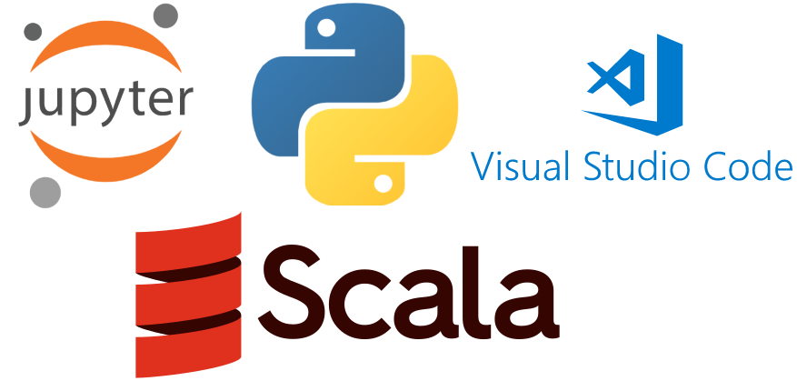


**Apache Spark** is a data processing framework that can quickly perform processing tasks on very large data sets, and can also distribute data processing tasks across multiple computers, either on its own or in tandem with other distributed computing tools.


### Step 1 - Installation of Spark and Scala 

Let us assume you have already installed property Scala and Spark on your computer,  you can follow this [tutorial](https://ruslanmv.com/blog/How-to-install-Spark-on-Windows).  

Moreover we assume you have installed Python from [here](https://www.python.org/downloads/windows/)  and
Visual Studio from [here](https://go.microsoft.com/fwlink/?LinkID=534107)  you can follow this [tutorial](https://ruslanmv.com/blog/How-to-install-Jupyter-Notebook-in-Visual-Studio-Code). 

### Step 2 - Creation of Project

Create your project folder:

For example,
We open a terminal

```
cd \
```

and we create folder called myproject

```
mkdir myproject
```

we enter to the folder

```
cd  myproject
```

then we open VS code


```
code .
```

then we open a new terminal there and we choose the Command Prompt 

### Step 3- Installation of the Environment

In the Command Prompt we create a virtual environment by typing

```
python -m venv .myenv

```

that would create a virtual environment named ‘.myenv’ and
then we activate the environment

```
.myenv\Scripts\activate.bat

```


then we install the notebook


```
pip install notebook
```

and the Scala Kernel


```
pip install spylon-kernel
```


then we create a kernel spec


```
python -m spylon_kernel install 
```

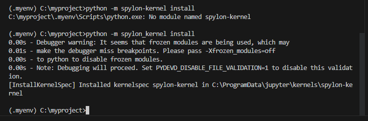


### Step 4. Update jupyter.kernels.trusted


Open the VS User Settings UI from the Command Palette (Ctrl+Shift+P) and find `Preferences: Open User Settings` 

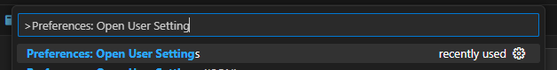

Search for the setting `jupyter.kernels.trusted`
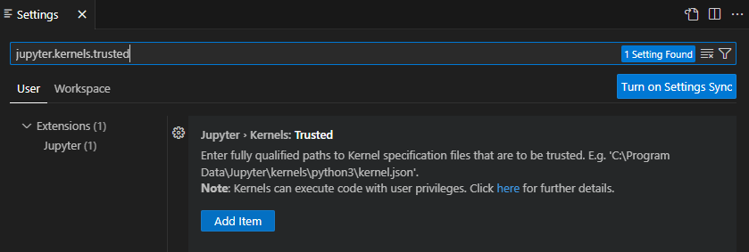

Copy the fully qualified path to the kernelspec,

```
C:\ProgramData\jupyter\kernels\spylon-kernel\kernel.json
```

**Add Item** into the list using the Add button

and we have
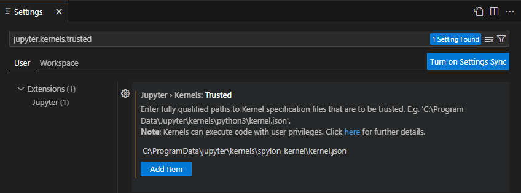
Re-load VS Code, by closing and opening. You can return back to you directory `C:\myproject>` and type

```
code .
```


## Step 5 Create a Jupyter Notebook for Scala

We create a Jupyter Notebook by running the 
`Create: New Jupyter Notebook` command from the Command Palette (Ctrl+Shift+P)
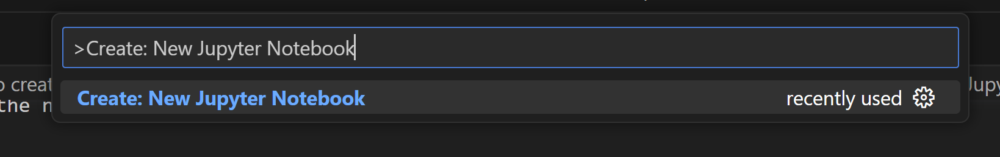


### Step 6 Select a kernel

After a new notebook was created  click select **Another kernel** 

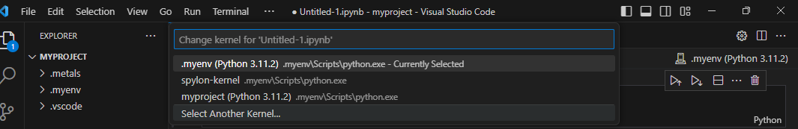

then pick **Jupyter Kernel**

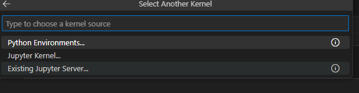

Next, select a kernel **spylon_kernel** using the kernel picker in the top right.

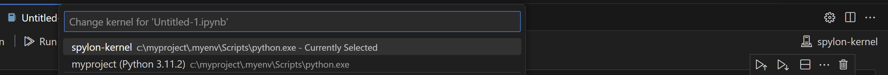


After selecting a kernel, the language picker located in the bottom right of each code cell will automatically update to the language supported by the kernel.  you can see your enviroment installed here. We have choosen
spylon_kernel  that uses **Scala** language
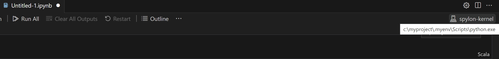


## Step 7 - Hello World in Scala

Let us test our Scala enviroment in Jupyter Notebook
Let us copy the following cell in the notebook.


```
println("Hello World from Jupyter Notebook in VS Code")

```

and you will get

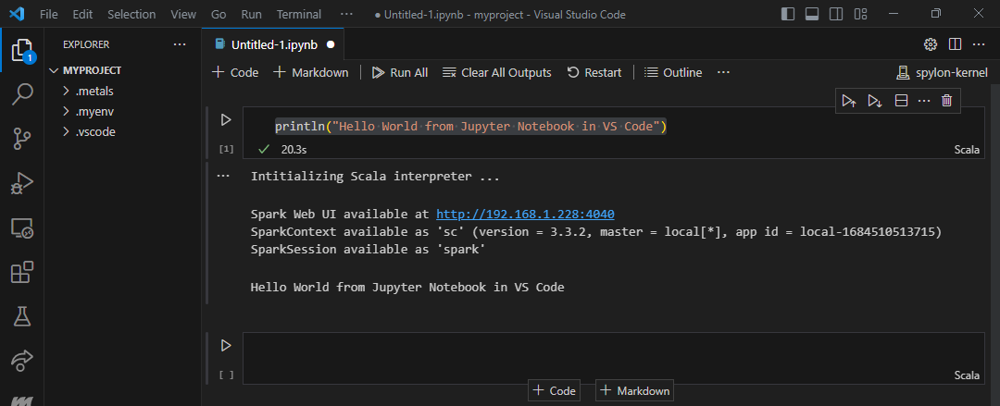

additionally you can see your Spark Job 


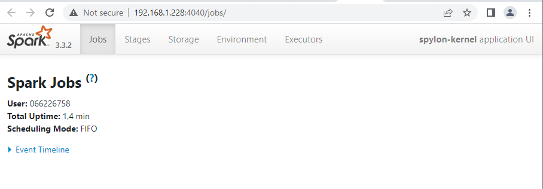

### Checking Spark Version

Like any other tools or language, you can use –version option with spark-submit, spark-shell, and spark-sql to find the version.

```
!spark-submit --version
!spark-shell --version
!spark-sql --version
```

or simply type

```
sc.version
```

or 

```
spark.version
```

you will have something like this
##
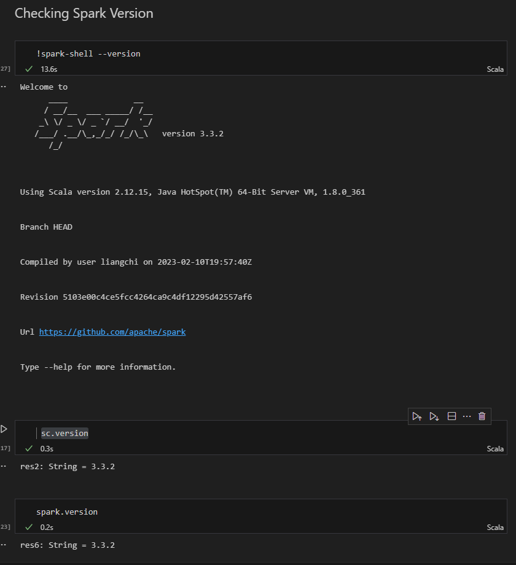

#### Reading files from Scala Notebook

One of the first importat things during the creation of any software are the Environment variables.
Environment variables allow us to define values for given keys on the OS, which applications can read. 

```scala
val SPARK_HOME=sys.env.get("SPARK_HOME").mkString 
val FILE = "\\examples\\src\\main\\resources\\people.json"
val PATH=SPARK_HOME+FILE
val df = spark.read.json(PATH)
df.show()
```


### Other languages

Since this makes use of metakernel you can evaluate normal python code using the `%%python` magic. In addition once the spark context has been created the `spark` variable will be added to your python environment.

#### Reading files in Python from Scala Notebook

The scala spark metakernel provides a scala kernel by default. On the first execution of scala code, a spark session will be constructed so that a user can interact with the interpreter.


```python
%%python
import os
SPARK_HOME=os.environ['SPARK_HOME']
FILE = "examples/src/main/resources/people.json"
PATH=os.path.join(SPARK_HOME, FILE)
df = spark.read.json(PATH)
df.show()
```

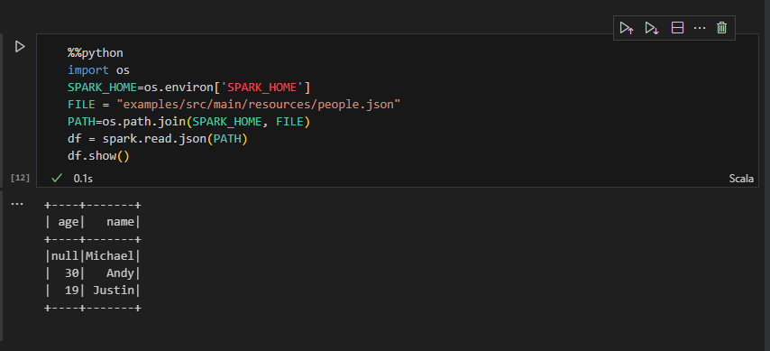


## Step 8 Create a Jupyter Notebook for Python with Scala Support

If we want to work in Python with Scala support we can get the Scala code inside the Python Code as a magic.

We create a  new Jupyter Notebook by running the 
`Create: New Jupyter Notebook` command from the Command Palette (Ctrl+Shift+P)


After a new notebook was created  click select **Another kernel** 


then pick **Jupyter Kernel**


Next, select a kernel **myproject** using the kernel picker in the top right.

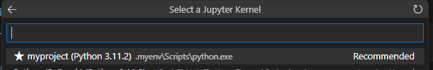


After selecting a kernel,   you can see your enviroment. We have choosen
spylon_kernel  that uses **Python** language

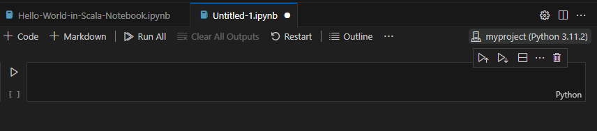

### Hello World in Python with Scala support from Jupyter Notebook


Spylon-kernel can be used as a magic in an existing ipykernel. 
This is the recommended solution when you want to write
relatively small blocks of scala.


If you just want to send a string of scala code to the interpreter and evaluate it you can
do that too.

```python
from spylon_kernel import get_scala_interpreter

interp = get_scala_interpreter()

# Evaluate the result of a scala code block.
out=interp.interpret("""
val string = "Hello World in Python with Scala support"
string
""")
```

```
print(out)
```

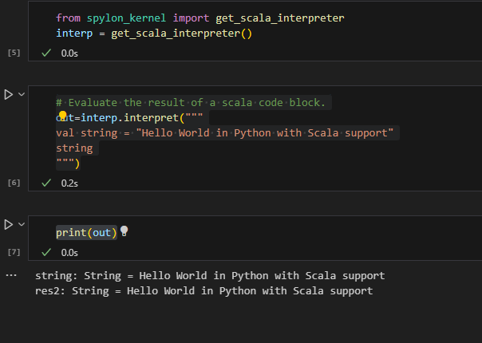


You can download the notebook from Github [here](https://github.com/ruslanmv/How-to-install-Scala-with-Jupyter-Notebook-in-Visual-Studio-Code).

**Congratulations!**  You have installed Scala and Jupyter Notebook in Visual Studio Code.