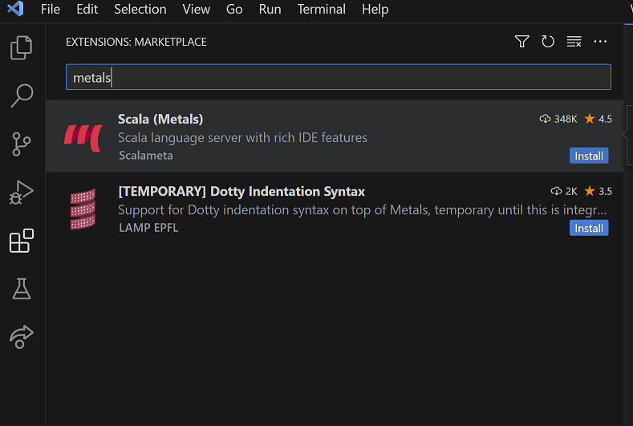
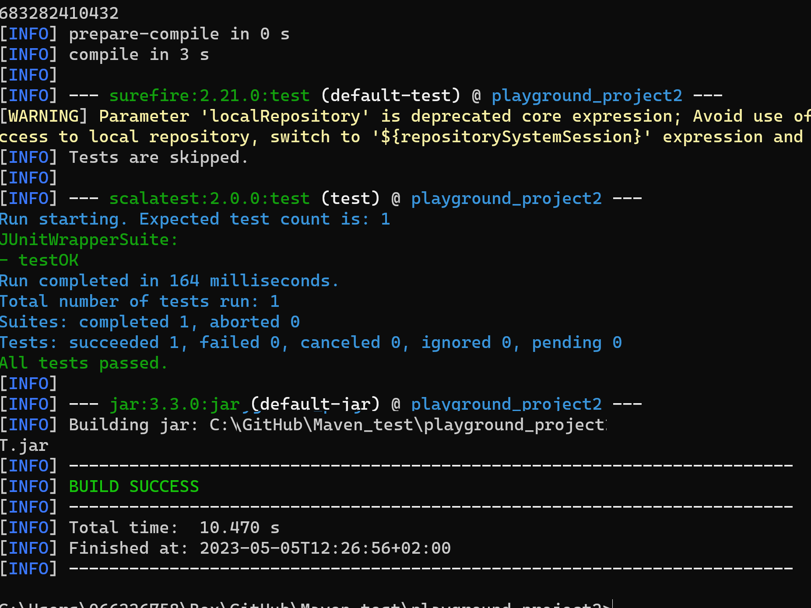
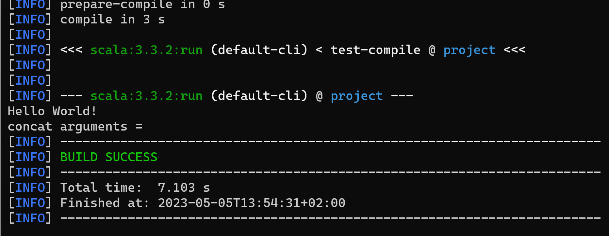
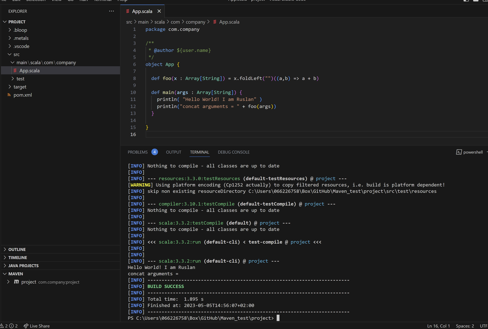

Hello today we are going to create a project in **Scala** on Windows with **Maven** and run a simple demo.

If you are starting to work in a project where you require develop a software in Scala by using Maven and you want start from the beginning. In this blog post I will explain a simple demo by using maven and **Vs Code**.

## Introduction

Developers describe **Apache Maven** as "*Apache build manager for Java projects*". Maven allows a project to build using its project object model (POM) and a set of plugins that are shared by all projects using Maven, providing a uniform build system. 

Once you familiarize yourself with how one Maven project builds you automatically know how all Maven projects build saving you immense amounts of time when trying to navigate many projects. On the other hand, **SBT** is detailed as "*An open-source build tool for Scala and Java projects*". It is similar to Java's Maven and Ant. Its main features are: Native support for compiling Scala code and integrating with many Scala test frameworks. In this demo we will focus on **Apache Maven**


### Installing Apache Maven


First you have to download this the Apache Maven

[https://dlcdn.apache.org/maven/maven-3/3.9.1/binaries/apache-maven-3.9.1-bin.zip](https://dlcdn.apache.org/maven/maven-3/3.9.1/binaries/apache-maven-3.9.1-bin.zip)


The installation of Apache Maven is a simple process of extracting the archive and adding the bin directory with the mvn command to the PATH.

Detailed steps are:

Have a JDK installation on your system. Either set the JAVA_HOME environment variable pointing to your JDK installation or have the java executable on your PATH.

Extract distribution archive in any directory


```
unzip apache-maven-3.9.1-bin.zip
```
or

```
tar xzvf apache-maven-3.9.1-bin.tar.gz
```

Alternatively use your preferred archive extraction tool.

Add the bin directory of the created directory apache-maven-3.9.1 to the PATH environment variable

Confirm with

 ```
mvn -v 
 ```

 in a new shell. The result should look similar to


```
Apache Maven 3.9.1 (2e178502fcdbffc201671fb2537d0cb4b4cc58f8)
Maven home: C:\Maven\apache-maven-3.9.1
Java version: 1.8.0_361, vendor: Oracle Corporation, runtime: C:\Java\jdk1.8.0_361\jre
Default locale: en_US, platform encoding: Cp1252
OS name: "windows 11", version: "10.0", arch: "amd64", family: "windows"
```

### Scala Metals Plugin

Optionally you can install s simple pluggin called Metals on Visutal Studio Code, what has a very useful IDE features.

Simply type Metals into the Search panel. Then  look for the Scala(Metals) extension by Scalametals in the search results, open it, and click the install button



## Creating a Project

You need somewhere for your project to reside. Create a directory somewhere and start a shell in that directory. 

The easiest way to create new projects is using an [“archetype”](https://maven.apache.org/archetype/maven-archetype-plugin/). An archetype is a general skeleton structure, or template for a project. Think back to “convention over configuration”; in our case, the Scala Maven Plugin provides an archetype for scala projects.

Let us first open a terminal and go to your root directory

```
cd \
```


- interactive Mode (select scala-archetype-simple and response to questions) 

```
  mvn archetype:generate
```

Then we should find a number where appears **net.alchim31.maven:scala-archetype-simple**, you can scroll up and find it the correct number, depends on the version of maven you are working with, in my case corresponds to the following number: 

```
1764
```

then we choose the version of  **net.alchim31.maven:scala-archetype-simple** :

```
4
```

Next, Maven will ask you for a **archetype**, **DarchetypeArtifactId,** **groupId**, **artifactId,** and **package**. You can read the [guide to naming conventions](https://maven.apache.org/guides/mini/guide-naming-conventions.html),


Define value for property 'groupId': 

```
com.company
```

Define value for property 'artifactId': 

```
project
```

Define value for property 'version' :

```
1.0
```

Define value for property 'package':

```
com.company: 
```

Confirm properties configuration:

```
Y
```
You will have something like:

```
C:\Maven_test>mvn archetype:generate
[INFO] Scanning for projects...
[INFO]
[INFO] ------------------< org.apache.maven:standalone-pom >-------------------
[INFO] Building Maven Stub Project (No POM) 1
[INFO] --------------------------------[ pom ]---------------------------------
[INFO]
[INFO] >>> archetype:3.2.1:generate (default-cli) > generate-sources @ standalone-pom >>>
[INFO]
[INFO] <<< archetype:3.2.1:generate (default-cli) < generate-sources @ standalone-pom <<<
[INFO]
[INFO]
[INFO] --- archetype:3.2.1:generate (default-cli) @ standalone-pom ---
[WARNING] Parameter 'localRepository' is deprecated core expression; Avoid use of ArtifactRepository type. If you need access to local repository, switch to '${repositorySystemSession}' expression and get LRM from it instead.
[INFO] Generating project in Interactive mode
[INFO] No archetype defined. Using maven-archetype-quickstart (org.apache.maven.archetypes:maven-archetype-quickstart:1.0)
Choose archetype:
1: remote -> am.ik.archetype:elm-spring-boot-blank-archetype (Blank multi project for Spring Boot + Elm)
.
.
.
3277: remote -> za.co.absa.hyperdrive:component-archetype_2.12 (-)
Choose a number or apply filter (format: [groupId:]artifactId, case sensitive contains): 2046: 1749
Choose net.alchim31.maven:scala-archetype-simple version:
1: 1.4
2: 1.5
3: 1.6
4: 1.7
Choose a number: 4: 1.7
Choose a number: 4: 4
Define value for property 'groupId': com.company
Define value for property 'artifactId': project
Define value for property 'version' 1.0-SNAPSHOT: :
Define value for property 'package' com.company: :
Confirm properties configuration:
groupId: com.company
artifactId: project
version: 1.0-SNAPSHOT
package: com.company
 Y: :
[INFO] ----------------------------------------------------------------------------
[INFO] Using following parameters for creating project from Archetype: scala-archetype-simple:1.7
[INFO] ----------------------------------------------------------------------------
[INFO] Parameter: groupId, Value: com.company
[INFO] Parameter: artifactId, Value: project
[INFO] Parameter: version, Value: 1.0-SNAPSHOT
[INFO] Parameter: package, Value: com.company
[INFO] Parameter: packageInPathFormat, Value: com/company
[INFO] Parameter: package, Value: com.company
[INFO] Parameter: groupId, Value: com.company
[INFO] Parameter: artifactId, Value: project
[INFO] Parameter: version, Value: 1.0-SNAPSHOT
[INFO] Project created from Archetype in dir: C:\Maven_test\project
[INFO] ------------------------------------------------------------------------
[INFO] BUILD SUCCESS
[INFO] ------------------------------------------------------------------------
[INFO] Total time:  04:10 min
[INFO] Finished at: 2023-05-05T13:53:50+02:00
[INFO] ------------------------------------------------------------------------

```
or in a simplified way

- non interactive / batch (change info in the last line) :

```
mvn archetype:generate -DarchetypeGroupId=net.alchim31.maven -DarchetypeArtifactId=scala-archetype-simple -DarchetypeVersion=1.7 -DgroupId=com.company -DartifactId=project -Dversion=0.1-SNAPSHOT -Dpackage=com.company
```

If this is your first time, you’ll notice that Maven is downloading many jar files. Maven resolves dependencies and downloads them as needed (and only once). Right now, Maven is downloading its core plugins.

You executed the Maven goal *archetype:generate*, and passed in various parameters to that goal. 
This *archetype:generate* goal created a simple project based upon a [maven-archetype-quickstart](https://maven.apache.org/archetypes/maven-archetype-quickstart/) archetype. 

### The POM

The `pom.xml` file is the core of a project's configuration in Maven. It is a single configuration file that contains the majority of information required to build a project in just the way you want. The POM is huge and can be daunting in its complexity, but it is not necessary to understand all of the intricacies just yet to use it effectively. 

### Build the Project

The groupId and artifactId together should serve as a globally unique identifier for your project

When it’s done, you should see a new folder named with the artifactId. `cd` into it and run:

```
cd project
```

and type

```scala
mvn package
```




In your project root, you’ll see a `pom.xml`, `src` folder, and `target` folder (target folder only appears after building). *Note: this archetype also includes a `.gitignore`*

Inside the `src` folder you’ll see `main` and `test`; `main` includes your application code, and `test` includes your test suites. Inside each of those you’ll find a `scala` folder, followed by your package structure (actually, `test/scala` includes a sample package, but you should replace this with your own package and tests). If you want to mix Scala and Java source code, simply add a `java` folder inside `main` or `test`.

`target` includes generated/built files, such as `.class` and `.jar` files. You can read about `pom.xml` at the [Maven page](https://maven.apache.org/pom.html).

Example structure:

- pom.xml
- src
  - main
    - scala
      - com/my-package/… *.scala
    - java
      - com/my-package/… *.java
  - test
    - scala
      - com/my-package/… *.scala
    - java
      - com/my-package/… *.java
- target …

Again, you can read more about the Scala Maven Plugin at its [website](https://davidb.github.io/scala-maven-plugin).


## Running Scala 

To  compile/run (run 'mvn scala:help' for full command list) :

```
 mvn scala:compile
```

and run

```
  mvn scala:run -DmainClass=com.company.App
```



If you do modifications and you want to re run the code you should clean

```
mvn clean install -Dmaven.test.skip.exec=true
```

and run

```
mvn scala:run -DmainClass=com.company.App
```

 You have created a simple demo application.

If you are in Windows with Power Shell we just need to add back quote sign before -D parameter.

```
mvn clean install `-Dmaven.test.skip.exec=true
```

and

```
mvn scala:run `-DmainClass=com.company.App
```



By default, the jar created by the Scala Maven Plugin doesn’t include a `Main-Class` attribute in the manifest. You cab add the [Maven Assembly Plugin](https://maven.apache.org/plugins/maven-assembly-plugin/) to`pom.xml` in order to specify custom attributes in the manifest. You can check the latest version of this plugin at the [project summary](https://maven.apache.org/plugins/maven-assembly-plugin/summary.html) 


## Adding Spark dependency

In **MAVEN** you can add new packages from internet adding dependencies in the  **pom.xml** file, for example, if we want to include Apache Spark 3.3.2 we can add new properties the pom file
```
  <!-- Begin New properties -->
    <scala.tools.version>2.12</scala.tools.version>
    <spark.version>3.3.2</spark.version>
  <!-- End New properties -->    

```
Then you can add the dependencies that you will going to use, for exmapèle
```
 <!-- Begin New dependency -->
  	<dependency>
			<groupId>org.apache.spark</groupId>
			<artifactId>spark-core_${scala.tools.version}</artifactId>
			<version>${spark.version}</version>
			<scope>provided</scope>
		</dependency>
		<dependency>
			<groupId>org.apache.spark</groupId>
			<artifactId>spark-sql_${scala.tools.version}</artifactId>
			<version>${spark.version}</version>
			<scope>provided</scope>
		</dependency>
		<dependency>
			<groupId>org.apache.spark</groupId>
			<artifactId>spark-hive_${scala.tools.version}</artifactId>
			<version>${spark.version}</version>
			<scope>provided</scope>
		</dependency>
    <dependency>
        <groupId>org.apache.hadoop</groupId>
        <artifactId>hadoop-client</artifactId>
        <version>3.3.0</version>
    </dependency>    
 <!-- End New dependency -->
```
For additional dependencies you can find them in this site:
[https://mvnrepository.com/](https://mvnrepository.com/)

and then you can include them in your App.scala file

```
package com.company
import org.apache.spark.{SparkConf, SparkContext}
import org.apache.spark.sql.SQLContext
import org.apache.spark.sql.hive.HiveContext
```

Then if you have installed Apache Spark you can run this application with

```
spark-submit --class com.company.App "c:\project\target\project2-0.1-SNAPSHOT.jar"
```

### Useful commands

- `mvn dependency:copy-dependencies`: copy all libraries and dependencies to the `target/dependency` folder
- `mvn clean`
- `mvn package`: compile, run tests, and create jar

## Running Simple Scala Code

Given a file named *Hello.scala* with these contents:

```scala
object Hello extends App {
    println("Hello, world")
}
```

you can compile that source code file directly to a JAR file like this:

```
$ scalac Hello.scala -d Hello.jar
```

Now you can run/execute the JAR file with the `scala` command like this:

```
$ scala Hello.jar
```

That produces the expected output:

```
Hello, world
```

Also you can  add the *scala-library.jar* file to your  classpath, so you can ran the command again like this 

```
$ scala -cp $SCALA_HOME/lib/scala-library.jar:RenumberAllMdFiles.jar RenumberAllMdFiles
```

**Congratulations!** You have created a Scala project with Maven.

