Hello everyone today we are going to discuss how to create a custom **Reinforcement Learning Environment (RL**) with **Ray** , **Pygame** and **Gymnasium**.

**Ray** is a high-performance distributed execution framework targeted at large-scale machine learning and reinforcement learning applications. It achieves scalability and fault tolerance by abstracting the control state of the system in a global control store and keeping all other components stateless.


We are interested to understand the building blocks tha allow us create any custom environment applied to any software that we want to create by using the strategy of RL.

I will show several codes  as an example to visualize the idea of the RL algorithm in practice. 

There are at least 3 essential components that is needed to understand:

1. **The environment**.  Here we define the rules of the game. Are the constrains that we have to put in the class.
2. **Agent**. Is the worker or the entity that will play the previous environment by doing an action. Given an observation you got an state which the agent should decide what todo by performing an action. Once the action is performed you got a reward defined in the environment.
3. **RL model**. Once we got the the final state obtained by the environment, it is needed to remember the state or observation that you got with their respective reward. The manner to memorize this information is given by any standard RL model.

In order to play with our environments I will use **Pygame**  which is a cross-platform set of Python modules designed for writing video games. It includes computer graphics and sound libraries designed to be used with the Python programming language.

Let us check some of the essential components said before. 

## Step 1. Creation of  Python environment

I will create an environment called **gym**, because we are interested in the **Gymnasium** library.

Gymnasium is **an open source Python library for developing and comparing reinforcement learning algorithms** by providing a standard API to communicate between learning algorithms and environments, as well as a standard set of environments compliant with that API. 

First you need to install anaconda at this [link](https://www.anaconda.com/products/individual)

```
conda update --all
```

```
conda config --append channels conda-forge
```

then after is installed type in your terminal

```
conda create -n gym python==3.8 gym==0.18.0
```

then

```
conda activate gym
```

# Creation of the project

and then  we clone our repository

```
git clone https://github.com/ruslanmv/How-to-create-custom-Reinforcement-Learning-environment.git
```

```
cd How-to-create-custom-Reinforcement-Learning-environment
```

then we install the following libraries

```
pip install -r requirements.txt
```

or

```
pip install torch==1.7.1  install extras_require keras   tensorflow  keras-rl2  opencv-python seaborn scipy tensorflow_probability torch lz4 gputil ray[rllib] pandas pygame matplotlib dm_tree 
```

then in your terminal type the following commands:

```
conda install ipykernel
```

then we install

```
python -m ipykernel install --user --name gym --display-name "Python (Gym)"
```


```
pip install -e snake
```

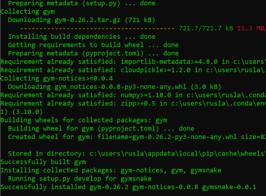


then we type

```
jupyter notebook
```


and we choose our Python (Gym) notebook

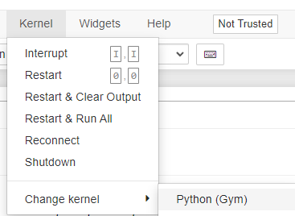

If you want to uninstall your environment

```
conda env remove -n gym
```

and by typing

```
jupyter kernelspec list
```

 to get the paths of all your kernels.
Then simply uninstall your unwanted-kernel

```
jupyter kernelspec uninstall gym
```

# Creating an Open AI Gym Environment

Once is loaded the Python (Gym) kernel  you can open the example notebooks.

The first notebook, is simple the game  where we want to develop the appropriate environment

 [0-Custom-Snake-Game.ipynb](https://github.com/ruslanmv/How-to-create-custom-Reinforcement-Learning-environment/blob/master/0-Custom-Snake-Game.ipynb)


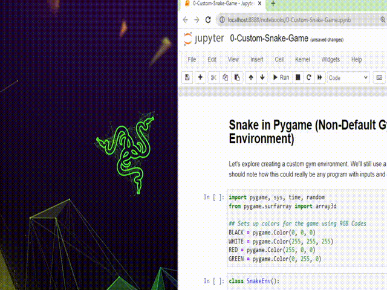

The second notebook is an example about how to initialize the **custom environment,**

[snake_env.py](https://github.com/ruslanmv/How-to-create-custom-Reinforcement-Learning-environment/blob/master/snake/snake/envs/snake_env.py)

where it  has the structure

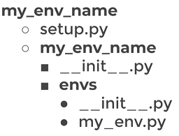

in our case 

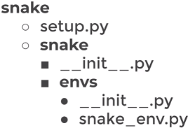

[1-Creating-a-Gym-Environment.ipynb](https://github.com/ruslanmv/How-to-create-custom-Reinforcement-Learning-environment/blob/master/1-Creating-a-Gym-Environment.ipynb)

and finally the third notebook is simply an application of the Gym Environment into a RL model.

[2-Applying-a-Custom-Environment.ipyn](https://github.com/ruslanmv/How-to-create-custom-Reinforcement-Learning-environment/blob/master/2-Applying-a-Custom-Environment.ipynb)

# Custom enviroment game

We are interested to build  a program that will find the best desktop .

The first program is the game where will be developed the environment of gym.

[12_many_office_detection.py](https://github.com/ruslanmv/How-to-create-custom-Reinforcement-Learning-environment/blob/master/custom_game/basics_py/12_many_office_detection.py)


After is cloned this repo , open with  in **Visual Studio Code**

```
code .
```

you can open the program

```
How-to-create-custom-Reinforcement-Learning-environment\custom_game\12_many_office_detection.py
```

make sure you have the **Gym** environment

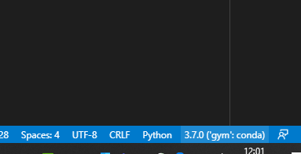

run this program by pressing **ctrl+F5** 

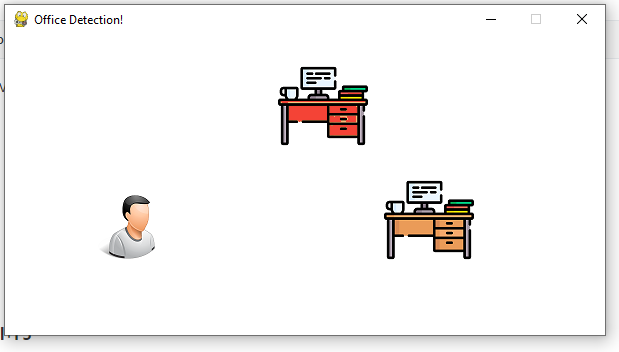

and move with the arrows the desired desktop.


# 3 - RL Environment 

In this part we are going to build the most essential Environment to create a RL  Pipeline.

The first framework that we are going to use is the  **RAY**

We are going to  pass either a string name or a Python class to specify an environment.  In particular we are going to choose the simplest local enviroment.

Custom env classes passed directly to the algorithm must take a single env_config parameter in their constructor:


### Example 1 - Gym + Ray


```python
import gym, ray
from gym import spaces
from ray.rllib.algorithms import ppo
```


```python
class MyEnv(gym.Env):
    def __init__(self, env_config=None):
       # There are two actions, first will get reward of 1, second reward of -1. 
        self.action_space = spaces.Discrete(5)      #<gym.Space>
        self.observation_space = spaces.Discrete(2) #<gym.Space>
    
    def reset(self):
        state = 0
        #return <obs>
        return state
                           
    def step(self, action):

        # if we took an action, we were in state 1
        state = 1
    
        if action == 2:
            reward = 1
        else:
            reward = -1
            
        # regardless of the action, game is done after a single step
        done = True

        info = {}
        # return <obs>, <reward: float>, <done: bool>, <info: dict>
        return state, reward, done, info   
```


```python
ray.shutdown()
ray.init()
algo = ppo.PPO(env=MyEnv,config={"num_workers": 4})
```

```python
mean_ppo = []
for _ in range(5):

    result = algo.train()
    print("episode reward mean:", _, result['episode_reward_mean'])
    mean_ppo.append(result['episode_reward_mean'])
```

    episode reward mean: 0 -0.592
    episode reward mean: 1 -0.1035
    episode reward mean: 2 0.1895
    episode reward mean: 3 0.591
    episode reward mean: 4 0.7615

```python
import matplotlib.pyplot as plt
```


```python
xs = [x for x in range(len(mean_ppo))]
```


```python
plt.plot(xs, mean_ppo)
plt.show()
```


​    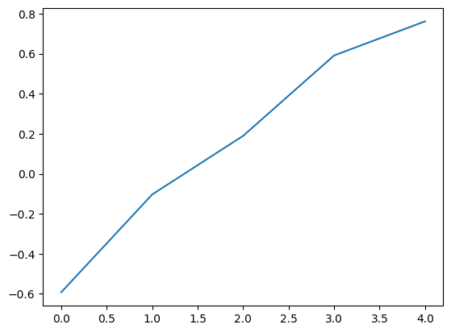


It is possible to add additional setup to the config file


```python
from ray.rllib.algorithms.ppo import PPOConfig
config = PPOConfig()  
config = config.training(gamma=0.9, lr=0.01, kl_coeff=0.3)  
config = config.resources(num_gpus=0)  
config = config.rollouts(num_rollout_workers=4)
algo = ppo.PPO(env=MyEnv, config=config) 
```


```python
mean_ppo = []
for _ in range(10):

    result = algo.train()
    print("episode reward mean:", _, result['episode_reward_mean'])
    mean_ppo.append(result['episode_reward_mean'])
```

    episode reward mean: 0 -0.6125
    episode reward mean: 1 -0.133
    episode reward mean: 2 0.1735
    episode reward mean: 3 0.533
    episode reward mean: 4 0.705
    episode reward mean: 5 0.7445
    episode reward mean: 6 0.764
    episode reward mean: 7 0.8955
    episode reward mean: 8 0.919
    episode reward mean: 9 0.9695


```python
import matplotlib.pyplot as plt
xs = [x for x in range(len(mean_ppo))]
plt.plot(xs, mean_ppo)
plt.show()
```

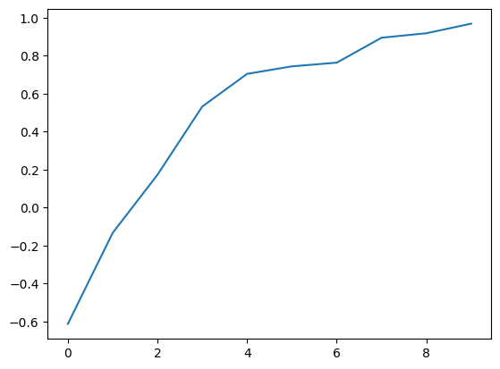


### How to use the trained algorithm in RL with PP0


```python
trainer=algo
```


```python
checkpoint = trainer.save()
```


```python
print(checkpoint)
```


```python
#TODO Fix the windows path
#evaluation = trainer.evaluate(checkpoint)
```

## Computing actions


```python
env = MyEnv()
```


```python
done = False
total_reward = 0
```


```python
observations = env.reset()
```


```python
print(observations) # The state which you should determine the action
```

Given any state compute the action which you get the maximum reward in according to the traning 


```python
action = trainer.compute_single_action(observations)
```


```python
action
```


```python
while not done:
    action = trainer.compute_single_action(observations)
    observations, reward, done, info = env.step(action)
    total_reward += reward
    print("observations, reward, done, info",observations, reward, done, info)

```


```python
action = trainer.compute_actions({"obs_1": observations, "obs_2": observations})
print(action)
# {'obs_1': 0, 'ob
```


### Example 2 - Gym + Ray + Pygame

In order to create an appropiate gym enviroment applied to ray and pygame we need need to pay attention into two gym objects:

-- action (object): The action to be performed in the step() function. 
In a game of chess, the action would be the specific, legal move performed by a player.

--observation (object): This is all the information available to the agent to choose the next action. 
The observation is based only on the current state of the environment.

## Observation_space and Action_space

In  particular  the observation_space and action_space:
there are only certain actions and observations are valid in regards of a specific environment. 

To define a format, the observation_space and action_space variables need to be assigned to a respective gym.space class.

Spaces can differ in their dimensionality and their value range. Continuous and discrete spaces are both possible.

The structure of the **init** in the class inside the environment is 

```
self.observation_space = <gym.space>
self.action_space = <gym.space>
```


We are going to consider an enviroment where there are two
points, one red and one blu. The purpose of the game is give a blue point ( worker) where intercept the red point (target)

## Definition of action space

We want to control the position of the blue point.

So the action is the position, the action are the coordinates that you provides to the enviroment

action =[x, y]

The value of each coordinate are continous and must be in the range of the size of the horizontal box

gym.spaces.Box(low=min_x., high=max_x., shape=(2,), dtype=np.float32)

## Analysis of Spaces

Before we continue le us check some examples of spaces in order to understand how it works.

## Box

Box - Supports continuous (and discrete) vectors or matrices, used for vector observations, images, etc


```python
from gym.spaces import Box, Discrete,MultiBinary , MultiDiscrete
import numpy as np
```


```python
# Example 1
observation_space = Box(low=-1.0, high=2.0, shape=(3, 4), dtype=np.float32)
print(observation_space.sample().shape)
observation_space.sample()
```


```python
#Example 2
observation_space = Box(low=np.array([-1.0, -2.0]), high=np.array([2.0, 4.0]), dtype=np.float32)
print(observation_space.sample().shape)
observation_space.sample()
```


```python
#Example 2
observation_space = Box(low=np.array(-1.0), high=np.array(2.0), dtype=np.float32)
print(observation_space.sample().shape)
observation_space.sample()
```


```python
# Example 1
observation_space = Box(low=0, high=200, shape=(2,), dtype=np.float32)
print(observation_space.sample().shape)
observation_space.sample()
```


```python
print(type(observation_space.sample()))
```

## Discrete


```python
#Example 3
observation_space =Discrete(2)            # {0, 1}
observation_space.sample()
```


```python
#Example 4
observation_space =Discrete(3)  # {0, 1, 2}
observation_space.sample()
```

## MultiBinary


```python
# Example 5
observation_space = MultiBinary(5)
print(observation_space.sample().shape)
observation_space.sample()
```


```python
# Example 5
observation_space = MultiBinary(2)
print(observation_space.sample().shape)
observation_space.sample()
```

## MultiDiscrete


```python
# Example 6
observation_space =  MultiDiscrete(np.array([[1, 2], [3, 4]]))
print(observation_space.sample().shape)
observation_space.sample()
```

## Text


```python
# Example 6a
observation_space =Text(5)
# {"0", "42", "0123456789", ...}
observation_space.sample()
```


```python
# Example 6b
import string
observation_space = Text(min_length = 1,
     max_length = 10,
     charset = string.digits)
observation_space.sample()
```

## Dict

Elements of this space are (ordered) dictionaries of elements from the constituent spaces


```python
# Example 7
from gym.spaces import Dict, Discrete
observation_space = Dict({"position": Discrete(2), "velocity": Discrete(3)})
observation_space.sample()
```


```python
#Example 8 [nested]:
from gym.spaces import Box, Dict, Discrete, MultiBinary, MultiDiscrete
observation_space =Dict(
    {
        "ext_controller": MultiDiscrete([5, 2, 2]),
        "inner_state": Dict(
            {
                "charge": Discrete(100),
                "system_checks": MultiBinary(10),
                "job_status": Dict(
                    {
                        "task": Discrete(5),
                        "progress": Box(low=0, high=100, shape=()),
                    }
                ),
            }
        ),
    }
)
```


```python
type(observation_space.sample())
```


```python
observation_space.sample()
```


```python
# Example 9
from gym.spaces import Box, Discrete
observation_space = Dict({"position": Box(-1, 1, shape=(2,)), "color": Discrete(3)})
```


```python
observation_space.sample()
```

# Tuple


```python
# Example 10
from gym.spaces import Box, Discrete, Tuple
observation_space = Tuple((Discrete(2), Box(-1, 1, shape=(2,))))
observation_space.sample()
```

# Sequence


```python
# Example 11
from gym.spaces import Sequence
space = Sequence(Box(0, 1))
space.sample()
```

for futher information visit
[https://gymnasium.farama.org/api/spaces/composite/#gymnasium.spaces.Dict](https://gymnasium.farama.org/api/spaces/composite/#gymnasium.spaces.Dict)

# Summary

Discrete - Supports a single discrete number of values with an optional start for the values

MultiDiscrete - Supports single or matrices of binary values, used for holding down a button or if an agent has an object

MultiBinary - Supports multiple discrete values with multiple axes, used for controller actions

Text - Supports strings, used for passing agent messages, mission details, etc

Composite Spaces
Often environment spaces require joining fundamental spaces together for vectorised environments, separate agents or readability of the space.

Dict - Supports a dictionary of keys and subspaces, used for a fixed number of unordered spaces

Tuple - Supports a tuple of subspaces, used for multiple for a fixed number of ordered spaces

Sequence - Supports a variable number of instances of a single subspace, used for entities spaces or selecting a variable number of actions

Graph - Supports graph based actions or observations with discrete or continuous nodes and edge values.


Example: if we want to build an observation of a PNG image , you can use the follow:


    # The action and observation spaces need to be gym.spaces objects:
    self.action_space = Discrete(4)  # up, left, right, down
    # Here's an observation space for 200 wide x 100 high RGB image inputs:
    self.observation_space = Box(
        low=0, high=255, shape=(100, 200, 3), dtype=np.uint8)

The standard structure of the ray  enviroment 
[https://docs.ray.io/en/latest/rllib/rllib-env.html](https://docs.ray.io/en/latest/rllib/rllib-env.html)
should be:


```python
import gym, ray
from ray.rllib.algorithms import ppo

class MyEnv(gym.Env):
    def __init__(self, env_config):
        self.action_space = <gym.Space>
        self.observation_space = <gym.Space>
    def reset(self):
        return <obs>
    def step(self, action):
        return <obs>, <reward: float>, <done: bool>, <info: dict>

ray.init()
algo = ppo.PPO(env=MyEnv, config={
    "env_config": {},  # config to pass to env class
})

while True:
    print(algo.train())  
```


## Reinforcement Learning Algorithms in Ray

There are different algorithms that can be used in Ray among them we choose the PP0

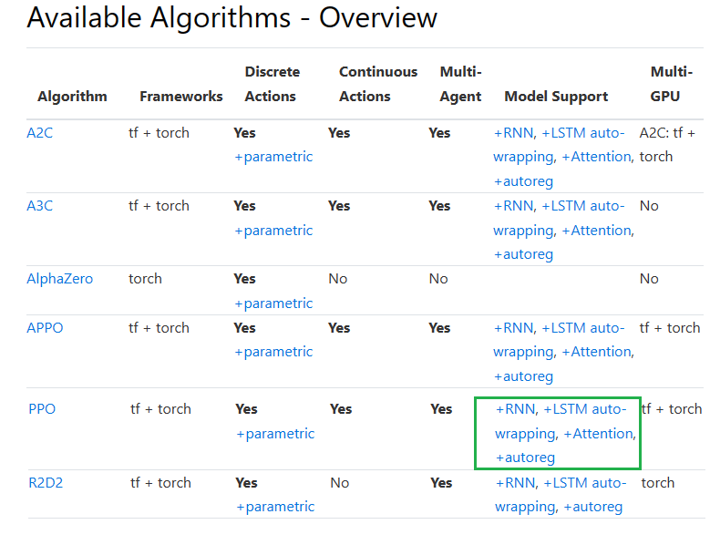

[More Algorithms ](https://docs.ray.io/en/latest/rllib/rllib-algorithms.html?highlight= APPOConfig()#ppo)


### Proximal Policy Optimization (PPO)

PPO’s clipped objective supports multiple SGD passes over the same batch of experiences. RLlib’s multi-GPU optimizer pins that data in GPU memory to avoid unnecessary transfers from host memory, substantially improving performance over a naive implementation. PPO scales out using multiple workers for experience collection, and also to multiple GPUs for SGD.


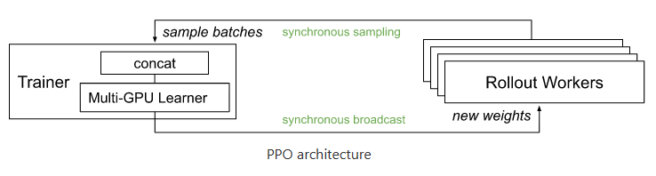

PPO architecture 

[more details](https://docs.ray.io/en/latest/rllib/rllib-algorithms.html?highlight= APPOConfig()#ppo)

# Custom Example of Environment with Pygame Ray and Gym


```python
import gym
from gym import spaces
import numpy as np
import pygame
from pygame import display
from pygame.surfarray import array3d
import random

BLACK = pygame.Color(0, 0, 0)
WHITE = pygame.Color(255, 255, 255)
RED = pygame.Color(255, 0, 0)
GREEN = pygame.Color(0, 255, 0)
BLUE = pygame.Color(0, 0, 255)
worker_pos=[0,0]

resolution=50

class MyEnv(gym.Env):
    
    metadata = {'render.modes': ['human']}

    def __init__(self, env_config):

        # We inizialize the display
        self.frame_size_x = resolution
        self.frame_size_y = resolution
        self.game_window = pygame.display.set_mode((self.frame_size_x, self.frame_size_y))   
        
        # Define action and observation space
        # They must be gym.spaces objects    
            
        # ------------------ACTION SPACE----------------------------------
        # The action space are the possible actions that is allowed by the worker
        # previously was a simple number 
        # self.action_space = spaces.Discrete(1)
        # Now in this example a simple action is a single coordinates (x,y)      
        self.action_space = gym.spaces.Box(low=0, high=resolution, shape=(2,), dtype=np.int32)#dtype=np.float32) 
        
        
        # ------------------OBSERVATION SPACE-------------------------------
        # Is what the state  is observed
        #Previously was a single number discrete
        #self.observation_space = gym.spaces.Discrete(2)
        # For this example we choose a numpy array   shape=(2,) or an image
        # Attention!!! The observation space should have the same shape that the reset 
        # In order to perform the RL training otherwise will fail!!
       
        self.observation_space = spaces.Box(low=0, high=resolution,
                                            shape=(2,), dtype=np.int32) #np.float32) 

        
        # Initial conditions
        
        self.game_window.fill(WHITE)
        # Moreover we add a position in the screen display
        
        # Initial worker position
        self.worker_pos=[0,0]
        
    
        #We assing a kind of gym object to a circle 
        self.worker_rect=pygame.draw.circle(self.game_window,BLUE,(self.worker_pos[0], self.worker_pos[1]),6) # DRAW CIRCLE

        # Initial target position
        
        self.target_pos = [int(resolution/2), int(resolution/2)]
        print('Initial target position',self.target_pos[0],self.target_pos[1])
        self.target_rect=pygame.draw.circle(self.game_window,RED,(self.target_pos[0], self.target_pos[1]),6) # DRAW CIRCLE
        self.steps = 0

    def reward_value(self,worker,target):
         #Check for collision between two rects
        if worker.colliderect(target):
            #print("worker, target",worker, target)
            reward=1.0
            done=True    
        else:
            reward=-1.0
            done=False
        return reward
              
    def step(self, action):
        #reward = 0.0
        
        self.worker_pos = action
        #print('worker_pos:'self.worker_pos)
            
        # We update the state with an image ( in other words plot the points due to the action)
        self.update_game_state()

        #print(self.worker_rect,self.target_rect)
        
        reward= self.reward_value(self.worker_rect,self.target_rect)
 
        # regardless of the action, game is done after step becomes true
        reward_tmp, done = self.game_over(reward)
        
        #self.reward=self.reward+reward_tmp
        self.reward=reward_tmp
        info = {}        
        
        #Accumulative reward
        #print('Reward in step:',self.steps,self.reward)
        
        # -----Under the assuption that we deal with an image---
        #img = self.get_image_array_from_game()
        #state=img
        #--------------------------------------------------------
        self.state=[self.target_pos[0], self.target_pos[1]]

        #print('step:', self.steps)
        self.steps += 1
        
        observation = np.array(self.state, dtype=np.int32) #float32)
        return observation, self.reward, done, info
    
    def worker_step(self,event):   
        '''
        Takes human keyboard event and then returns it as an action string
        '''
        action = None
        if event.type == pygame.QUIT:
            pygame.quit()
            sys.exit()
            
        #Move based on mouse clicks
        if event.type == pygame.MOUSEBUTTONDOWN:
            #print(event)
            mouse_x = event.pos[0]
            mouse_y = event.pos[1]
            self.worker_pos[0]=mouse_x
            self.worker_pos[1]=mouse_y
            action = [self.worker_pos[0], self.worker_pos[1]]
        #Drag the object when the mouse button is clicked
        
        if event.type == pygame.MOUSEMOTION and event.buttons[0] == 1:
            #print(event)
            mouse_x = event.pos[0]
            mouse_y = event.pos[1]
            self.worker_pos[0]=mouse_x
            self.worker_pos[1]=mouse_y
            action = [self.worker_pos[0], self.worker_pos[1]]   
        
        elif event.type == pygame.KEYDOWN:
            # Esc -> Create event to quit the game
            if event.key == pygame.K_ESCAPE:
                pygame.event.post(pygame.event.Event(pygame.QUIT))                
        
        return  action    
    
    def update_game_state(self):
        
        #We fill the screen to white
        self.game_window.fill(WHITE)
        
        #Draw rectangles to represent the rect's of each object
        # For the worker
        
        self.worker_rect.x=self.worker_pos[0]
        self.worker_rect.y=self.worker_pos[1]
        self.worker_rect=pygame.draw.circle(self.game_window,BLUE,(self.worker_rect.x,self.worker_rect.y),6) # DRAW CIRCLE
        
        # For the target
        self.target_rect.x=self.target_pos[0]
        self.target_rect.y=self.target_pos[1]        
        pygame.draw.circle(self.game_window,RED,(self.target_rect.x,self.target_rect.y),6) # DRAW CIRCLE


    def get_image_array_from_game(self):
        img = array3d(display.get_surface())
        #Preprocessing of channels ( needed for tensorflow)
        img = np.swapaxes(img, 0, 1)
        return img    
    
    def reset(self):
        
        # Type 1 Observation
        #print('Target position',self.target_pos[0], self.target_pos[1])
        #observation = np.array([self.target_pos[0], self.target_pos[1]])
        
        #Type 2 Observation
        #We create a simple observation state from a sample
        #self.state = self.observation_space.sample()
        #observation = np.array(self.state, dtype=np.int32) #float32)

        #Type 2 From a random sit
        #sit_random = np.random.randint(1, 9)
        #self.state['x_position'][sit_random:] = 0
        #self.state['y_position'][sit_random:] = 0
        #observation = self.state
        
        #Type 4 From a target
        self.state=[self.target_pos[0], self.target_pos[1]]        
        observation = np.array(self.state, dtype=np.int32) #float32)       
        
        # Type 3 Observation
        #img = array3d(display.get_surface())
        #img = np.swapaxes(img, 0, 1)
        #observation=img
        
        self.steps = 0
        self.reward = 0

        #print("Game Reset.")
        #print('observation',observation)
        return observation    
    
    def render(self, mode='human'):
        if mode == "human":
            display.update()        
    def close(self):
        pass
    
    def game_over(self, reward):
        if (reward < 1) or (self.steps >= 1000): 
            return -1, False
        else:
            return reward, True
```

    pygame 2.1.2 (SDL 2.0.18, Python 3.8.0)
    Hello from the pygame community. https://www.pygame.org/contribute.html


# Testing Environment


```python
# method 1 - use local test class
# Testing local frame
env = MyEnv(env_config={})
```

    Initial target position 25 25

```python
test=env.reset()
```


```python
test.shape
```


    (2,)


```python
action = env.action_space.sample()
print('action',action)
```

    action [23 38]


```python
#action=[100,100]
state, reward, done, info = env.step(action)
print("Reward = {} with action = {}".format(reward,action))
import matplotlib.pyplot as plt
print(reward, done, info)
#state = np.array(state)

print(state,type(state))
#plt.figure()
#plt.imshow(state)
```

    Reward = 1.0 with action = [23 38]
    1.0 True {}
    [25 25] <class 'numpy.ndarray'>


```python
# Testing multiple frames
import sys
env = MyEnv(env_config={})
env.reset()
# This is technically a FPS Refresh rate
FPS = 10
# FPS (frames per second) controller
fps_controller = pygame.time.Clock()
# Checks for errors encountered
check_errors = pygame.init()
# Initialise game window
pygame.display.set_caption('Testing Game') 
#The main game loop
running = True
while running:
    # Check Input from Human Step 
    for event in pygame.event.get():
        action = env.worker_step(event)    
        if event.type == pygame.QUIT:
            running = False
        pygame.display.update()
        if action != None :# (0,0) :# and reward!=0:
            #print(action,type(action))
            state, reward, done, info = env.step(action)
            print("Reward = {} with action = {} , done = {}".format(reward,action,done))
            # Refresh game screen    
    # Refresh rate
    fps_controller.tick(FPS)
    img = array3d(env.game_window)
```

    Initial target position 25 25
    Reward = -1 with action = [13, 17] , done = False
    Reward = -1 with action = [32, 14] , done = False
    Reward = 1.0 with action = [39, 33] , done = True
    Reward = 1.0 with action = [27, 40] , done = True
    Reward = -1 with action = [16, 39] , done = False
    Reward = -1 with action = [17, 9] , done = False
    Reward = -1 with action = [43, 14] , done = False
    Reward = 1.0 with action = [24, 24] , done = True

# Ray testing


```python
config={"env_config": {},}  # config to pass to env class
```


```python
import gym, ray
from ray.rllib.algorithms import ppo
ray.shutdown()
ray.init()
algo = ppo.PPO(env=MyEnv, config=config
)
```

```python
mean_ppo = []
for _ in range(25):
    result = algo.train()
    ##print("episode reward mean:", _, result['episode_reward_mean'])
    mean_ppo.append(result['episode_reward_mean'])
```


```python
import matplotlib.pyplot as plt

xs = [x for x in range(len(mean_ppo))]

plt.plot(xs, mean_ppo)
plt.show()

```


​    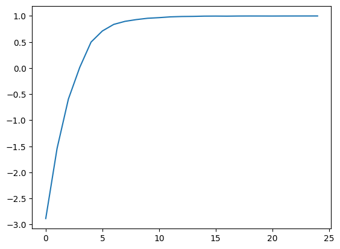
​    


## Computing actions


```python
# Testing local frame
env = MyEnv(env_config={})
```

    Initial target position 25 25


```python
done = False
total_reward = 0
```


```python
observations = env.reset()
```


```python
print(observations) # The state which you should determine the action
```

    [25 25]


Given any state compute the action which you get the maximum reward in according to the traning 


```python
action = algo.compute_single_action(observations)
```


```python
action
```


    array([37, 23])


```python
while not done:
    action = algo.compute_single_action(observations)
    observations, reward, done, info = env.step(action)
    total_reward += reward
    print("observations, reward, done, info",observations, reward, done, info)

```


```python
action = algo.compute_actions({"obs_1": observations, "obs_2": observations})
print(action)
# {'obs_1': 0, 'ob
```

    {'obs_1': array([23, 40]), 'obs_2': array([25, 20])}

**Congratulations!**  We have created several environments that were trained by using Reinforcement Learning using Ray.