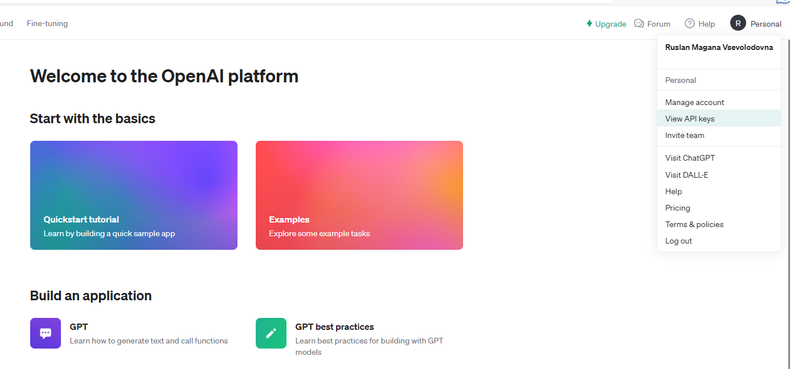

The OpenAI GPT-3 model, also known as ChatGPT, is a powerful language model capable of generating human-like text based on tut it receives. It can be used for various natural language processing tasks, such as text generation, language translation, question-answering, and more. OpenAI provides an API that allows developers to integrate ChatGPT into their applications, making it easy to leverage the model's capabilities. In this blog, we will explore how to use the ChatGPT API in Python, providing examples and best practices along the way.

## Getting Started

To get started with the ChatGPT API in Python, you'll need to sign up for access to the OpenAI API and obtain your API key. Once you have your API key, you can start making requests to the ChatGPT model. You will also need to install the `openai` Python package, which you can do using pip:

```bash
pip install openai
```

## How do I get an OpenAI API Key?

To get your own OpenAI API key, follow the steps below:

### **1. Create an OpenAI account**‍

If you don't already have an OpenAI account, navigate to the [OpenAI website](https://www.openai.com/).

Here, you will see a "Sign Up" button at the top right corner of the website. Click on it and fill in your details to create an account.

### **2. Verify your account**‍

After signing up, you'll receive an email from OpenAI to confirm your account. Open this email and click on the verification link. This step helps to ensure the security of your account.

### **3. Log into your account**‍

Now that your account is verified, return to the OpenAI website and click on the "Log In" button. Enter the username and password you used to sign up.


### **4. Navigate to the API section**

**‍**After logging in, in the top right corner of your screen you'll see an icon with your account name. Click it to open the dropdown menu then click "View API keys".



### **5. Generate a new API key**

**‍**Now you're in the API keys section, you should see a button "Create new secret key". Click on that button to generate a new API key.

Notice 

An API free trial credit expires three months after account creation, and is only created on the first account per phone number. If your trial is in effect, you don’t have to add a payment method to make (rate-limited) API requests.

The prepaid credit system is now required for new API accounts to convert to paid use  and older accounts in case you remove all existing payment methods.

## Making a Simple Request

Let's begin by making a simple request to ChatGPT. Here's a Python code snippet that demonstrates how to use the API:

```python
import openai

# Replace 'YOUR_API_KEY' with your actual API key
api_key = 'YOUR_API_KEY'

openai.api_key = api_key

response = openai.Completion.create(
    engine="gpt-3.5-turbo-instruct",
    prompt="Translate the following English text to French: 'Hello, how are you?'",
    max_tokens=50
)

translated_text = response.choices[0].text
print(translated_text)
```

```
Bonjour, comment vas-tu ?
```


In this example, we're using the OpenAI Python package to set up our API key and make a request to the ChatGPT model. We specify the `engine` as "gpt-3.5-turbo-instruct" which is one of the [available engines](https://platform.openai.com/docs/models). The `prompt` is the input text, and we set a `max_tokens` limit to control the length of the response.

## Advanced Examples

The ChatGPT API can handle a wide range of natural language processing tasks. Let's explore a few more advanced examples:

### 1. Generating Code

You can use ChatGPT to generate code snippets. For example, you can ask it to generate Python code to solve a specific problem:

```python
response = openai.Completion.create(
    engine="gpt-3.5-turbo-instruct",
    prompt="Write Python code to find the factorial of a number.",
    max_tokens=100
)

code_snippet = response.choices[0].text
print(code_snippet)
```

output

```
def factorial(num):
    if num == 0 or num == 1:
        return 1
    else:
        result = 1
        for i in range(2, num+1):
            result *= i
        return result

# Example:
print(factorial(5))
# Output: 120
```


### 2. Answering Questions

ChatGPT can answer questions based on the information provided in the prompt:

```python
response = openai.Completion.create(
    engine="gpt-3.5-turbo-instruct",
    prompt="What is the capital of France?",
    max_tokens=30
)

answer = response.choices[0].text
print(answer)
```

### 3. Writing Content

You can use ChatGPT to generate blog content, product descriptions, or any other type of text:

```python
response = openai.Completion.create(
    engine="gpt-3.5-turbo-instruct",
    prompt="Write an introduction for a blog post about artificial intelligence.",
    max_tokens=150
)

blog_intro = response.choices[0].text
print(blog_intro)
```

answer:

```
Artificial intelligence, or AI, has been a fascination of science fiction for decades, but in recent years, it has become a reality that is transforming our world in profound ways. From self-driving cars to virtual personal assistants, AI has the ability to learn, adapt, and make decisions to mimic and even surpass human intelligence. In this blog post, we will explore the advancements and applications of AI, as well as the potential impact it may have on society in the near future. So buckle up and get ready to dive into the fascinating world of artificial intelligence.
```


## How Much Does ChatGPT API Cost?

OenAI offers the text-DaVinci-003 API, their most powerful API, at $0.02 per 1,000 tokens. Each token represents a sequence of text equivalent to approximately 750 words.

 OpenAI announced significant cost reductions for ChatGPT. Thanks to system optimizations, they were able to lower the cost by 90% compared to December 2022. The newly released gpt-3.5-turbo model, specifically designed for dialogue, reflects this cost reduction. With a $0.002 per 1,000 token, the gpt-3.5-turbo model is 10 times cheaper than the original text-davinci-003 model.

The ChatGPT API is not free, but users are eligible for a free trial credit of $5 upon creating their OpenAI account.  

## Best Practices

When using the ChatGPT API in Python, it's essential to follow some best practices:

1. **Clearly Define Your Prompt**: Be specific and clear in your prompts. The quality of the response largely depends on how well you frame your question or request.

2. **Use System Messages**: You can use system-level instructions to guide the model's behavior. For example, you can start your prompt with "Translate the following English text to French:," and the model will understand the task.

3. **Limit Response Length**: Set a reasonable `max_tokens` value to control the length of the response. This helps in managing the output and avoiding overly lengthy responses.

4. **Iterate and Experiment**: Don't hesitate to iterate and experiment with different prompts and instructions to get the desired output. Adjust your prompt based on the results you receive.

5. **Review and Refine**: Always review the generated content for accuracy and clarity. Post-processing may be necessary to refine the responses.

6. **Respect OpenAI's Usage Policies**: Make sure to review and adhere to OpenAI's usage policies and guidelines when using the API.

## Conclusion

The ChatGPT API for coding enables developers to make HTTP requests to the API endpoint, programmatically sending prompts and receiving model-generated responses. It facilitates the seamless integration of ChatGPT's conversational abilities into software applications. Start using the ChatGPT API today and elevate your chatbots to the next level!

The ChatGPT API in Python opens up a world of possibilities for natural language processing tasks. With the right prompts and instructions, you can harness the power of this model for a wide range of applications. By following best practices and experimenting with different prompts, you can make the most of this powerful tool in your projects.

**Congratulations!**  We have learned hot to use the API of ChatGPT