Hello today we are going to explain how to create a **Jupyter notebok** in the **IBM cloud** and how to upload and download files from the cloud by using python.

## Step 1. Login to IBM Cloud

First you have to login to **IBM Cloud**

[https://cloud.ibm.com/login](https://cloud.ibm.com/login)

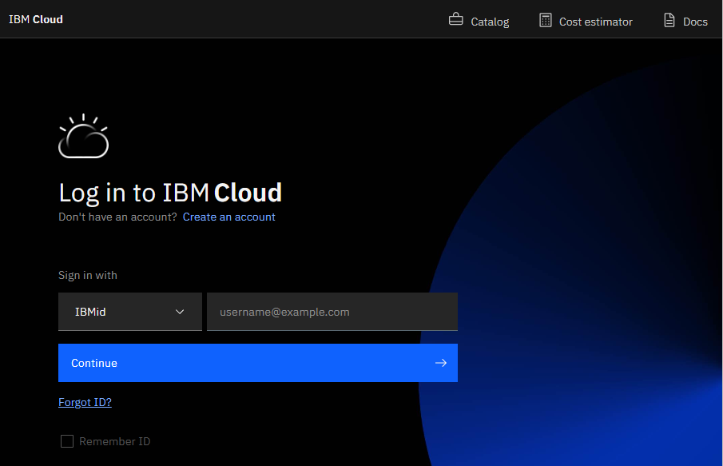


## Step 2. Creation of the Jupyter notebook in IBM Cloud.


In the Dashboard click **create resource** and then


then search for Watson Studio and then create

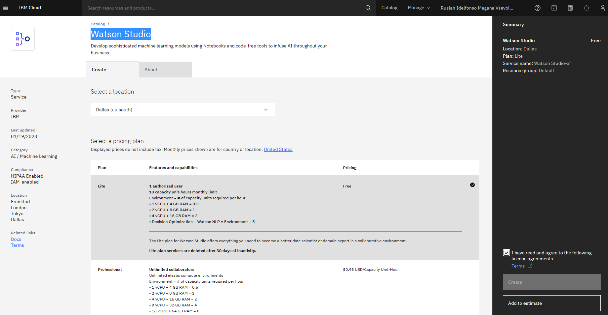

Enter the necessary information

Open Watson Studio by clicking [Resource list - IBM Cloud](https://cloud.ibm.com/resources) and lunch IBM Cloud Park for Data

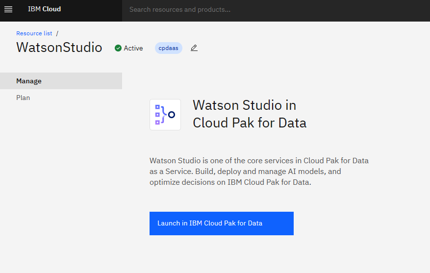

Click **New   project** 

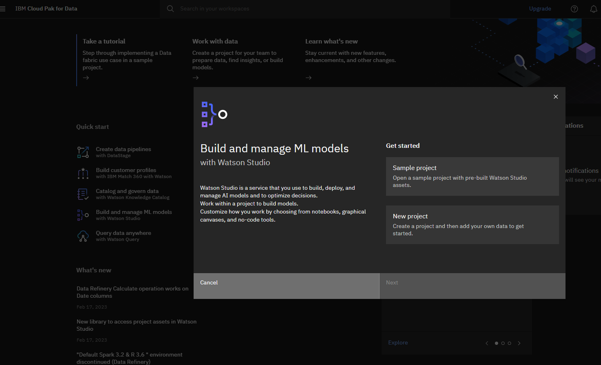

After the project was created you can open the project

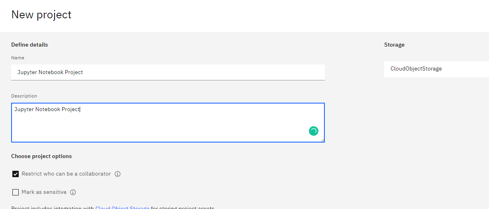

After was created Click on "Assets"

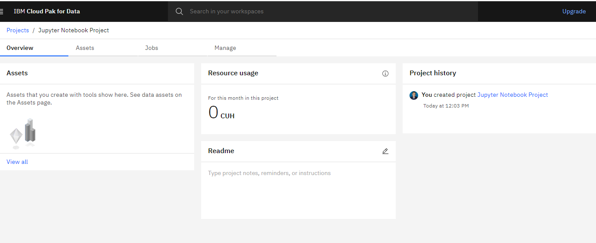

Then we click new asset

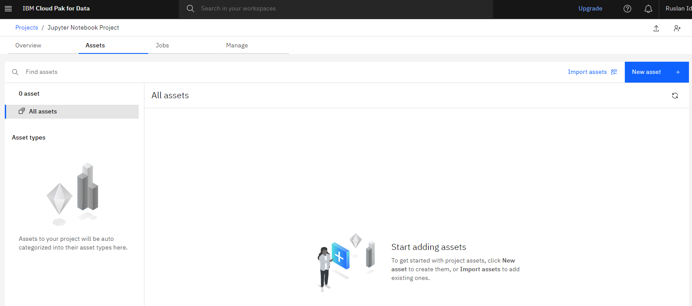

and we type Jupyter Notebook

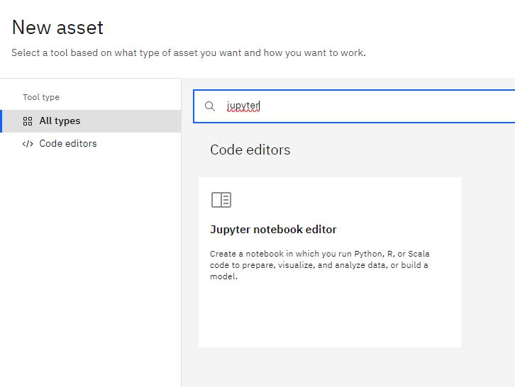

Click on "Notebook"

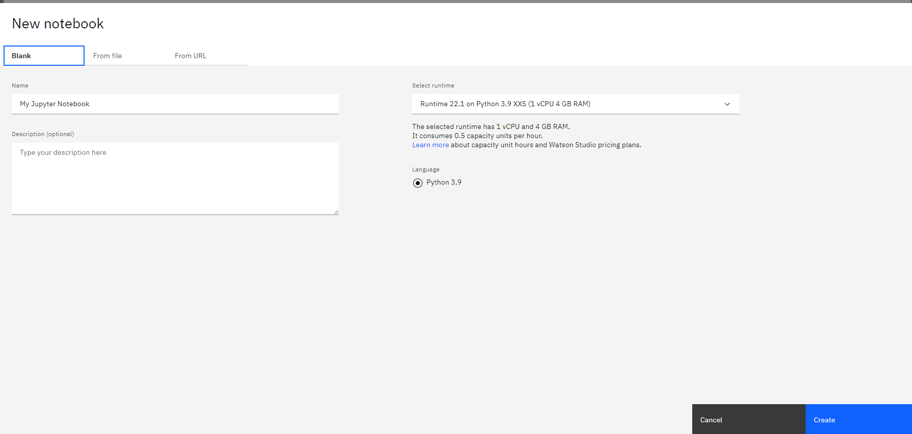


Now click on “Create Notebook”. Now we can use this notebook to getting start with IBM Cloud.


## Step 3 .Connect Jupyter notebook to IBM Cloud Storage


Cloud storage helps you to store data and files in an off-site location and can be accessed either via the public internet or by a dedicated private network. The data you send off-site for storage is a third-party cloud provider ‘s responsibility. The vendor owns, secures, operates and supports the servers and the relevant services and guarantees that you have access to the data anytime you need it.

Assuming you have a account in IBM Cloud Storage , you click customize your bucket


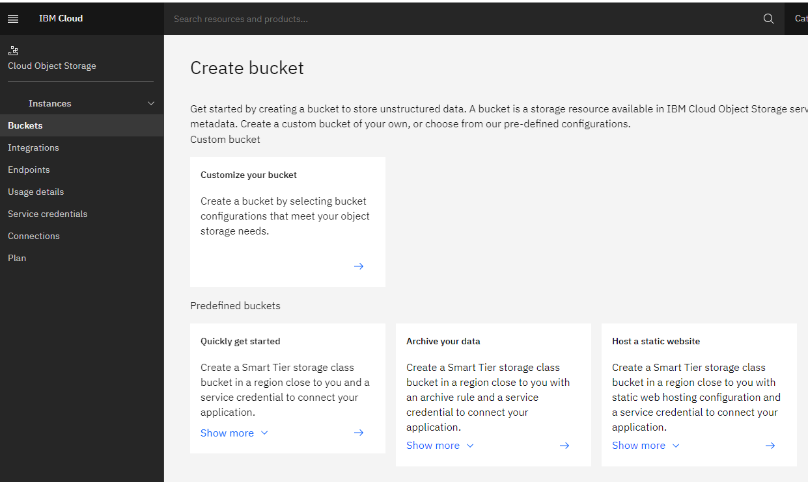

name you unique bucket name as for example ruslanmv-bucket, you can put your favorite unique name


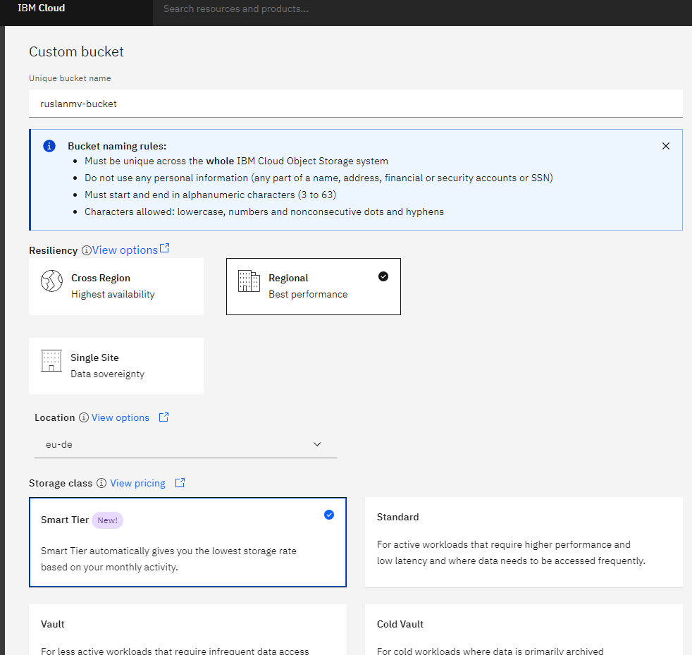

## Step 4 Getting the credentials for the python connection

In this part we should copy your own credentials to use in the next step.

Go to Service credentials and create new credentials 

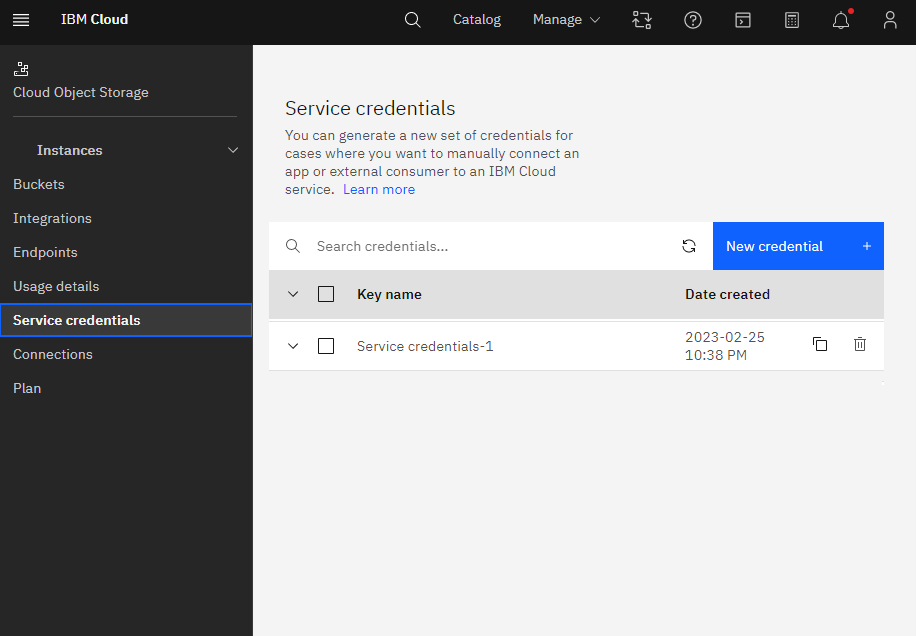

and copy API details

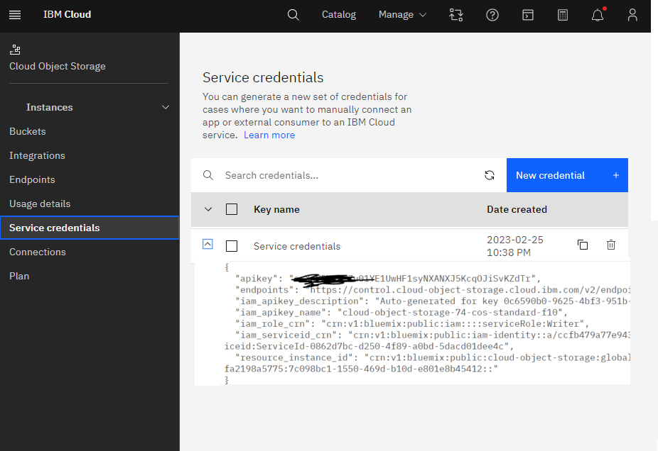

For endpoint_url you have to select configuration under bucket and copy the private URL


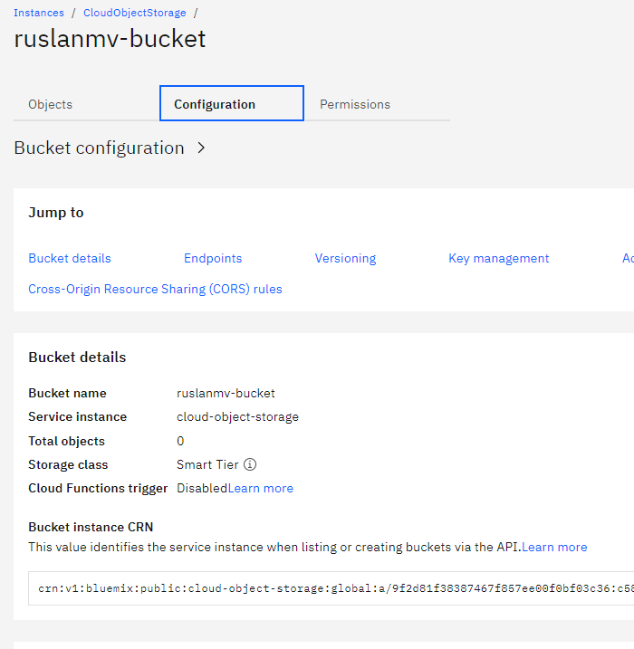

you should choose the edpoints, if you are working in a public bucket you should use the public endopoint, in my case I will use only private buckets so we choose the private endpoint.

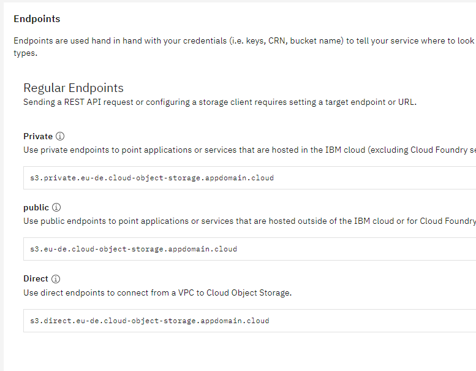

## Step 5. Connect Jupyter Notebook with IBM Cloud

Python support is provided through a fork of the boto3 library with features to make the most of IBM Cloud Object Storage.

The package that we will use is the ibm-cos-sdk that should be installed in the default notebook, 
If you are in your local computer, in this demo we have used  python 3.10.11 that you can download  [here](https://www.python.org/downloads/windows/) and you can  install by creating the following `requirements.txt` file in the project directory

```
ibm-cloud-sdk-core==3.16.5
ibm-cos-sdk==2.12.0
ibm-cos-sdk-core==2.12.0
ibm-cos-sdk-s3transfer==2.12.0
ibm-watson-machine-learning==1.0.326
pandas==1.4.3
```
and then type
```
pip install -r requirements.txt
```

Let us return back you your notebook that you create and first let us load the following libraries.


```python
import ibm_boto3
from ibm_botocore.client import Config, ClientError
import pandas as pd
import io
```

In this part you should paste the credentials that you have copied in the step 4


```python
cos_credentials={
  "apikey": "*********************",
  "endpoints": "https://control.cloud-object-storage.cloud.ibm.com/v2/endpoints",
  "iam_apikey_description": "Auto-generated for key 0c6590b0-9625-4bf3-951b-389a7a5507f2",
  "iam_apikey_name": "cloud-object-storage-74-cos-standard-f10",
  "iam_role_crn": "crn:v1:bluemix:public:iam::::serviceRole:Writer",
  "iam_serviceid_crn": "crn:v1:bluemix:public:iam-identity::a/ccfb479a77e943759e482fa2198a5775::serviceid:ServiceId-0862d7bc-d250-4f89-a0bd-5dacd01dee4c",
  "resource_instance_id": "crn:v1:bluemix:public:cloud-object-storage:global:a/ccfb479a77e943759e482fa2198a5775:7c098bc1-1550-469d-b10d-e801e8b45412::",
  
}

# Constants for IBM COS values
auth_endpoint = 'https://iam.cloud.ibm.com/identity/token' # Current list avaiable at https://control.cloud-object-storage.cloud.ibm.com/v2/endpoints
service_endpoint = 'https://s3.eu-de.cloud-object-storage.appdomain.cloud' #Outside IBM Cloud
#service_endpoint = 'https://s3.private.eu-de.cloud-object-storage.appdomain.cloud' # Inside IBM Cloud
```

## Step 6. Client operations

A client provides a low-level interface to the COS S3 API. This allows for processing HTTP responses directly, rather than making use of abstracted methods and attributes provided by a resource to access the information contained in headers or XML response payloads.


```python
#Create client
cos = ibm_boto3.client('s3',
                         ibm_api_key_id=cos_credentials['apikey'],
                        ibm_service_instance_id=cos_credentials['resource_instance_id'],
                         ibm_auth_endpoint=auth_endpoint,
                         config=Config(signature_version='oauth'),
                         endpoint_url=service_endpoint)
```

You can check all the posible operations that you can do with IBM s3 client by typing


```python
dir(cos)
```

and you get


    ['_PY_TO_OP_NAME',
     '__class__',
     '__delattr__',
     .
     .
     .
     'abort_multipart_upload',
     'add_legal_hold',
     'can_paginate',
     'complete_multipart_upload',
     'copy',
     'copy_object',
     'create_bucket',
     'create_multipart_upload',
     'delete_bucket',
     'delete_bucket_analytics_configuration',
     'delete_bucket_cors',
     'delete_bucket_inventory_configuration',
     'delete_bucket_lifecycle',
     'delete_bucket_metrics_configuration',
     'delete_bucket_policy',
     'delete_bucket_replication',
     'delete_bucket_tagging',
     'delete_bucket_website',
     'delete_legal_hold',
     'delete_object',
     'delete_object_tagging',
     'delete_objects',
     'delete_public_access_block',
     'download_file',
     'download_fileobj',
     'exceptions',
     'extend_object_retention',
     'generate_presigned_post',
     'generate_presigned_url',
     'get_bucket_accelerate_configuration',
     'get_bucket_acl',
     'get_bucket_analytics_configuration',
     'get_bucket_aspera',
     'get_bucket_cors',
     'get_bucket_inventory_configuration',
     'get_bucket_lifecycle_configuration',
     'get_bucket_location',
     'get_bucket_metrics_configuration',
     'get_bucket_protection_configuration',
     'get_bucket_replication',
     'get_bucket_tagging',
     'get_bucket_versioning',
     'get_bucket_website',
     'get_object',
     'get_object_acl',
     'get_object_tagging',
     'get_object_torrent',
     'get_paginator',
     'get_public_access_block',
     'get_waiter',
     'head_bucket',
     'head_object',
     'list_bucket_analytics_configurations',
     'list_bucket_inventory_configurations',
     'list_bucket_metrics_configurations',
     'list_buckets',
     'list_buckets_extended',
     'list_legal_holds',
     'list_multipart_uploads',
     'list_object_versions',
     'list_objects',
     'list_objects_v2',
     'list_parts',
     'meta',
     'put_bucket_accelerate_configuration',
     'put_bucket_acl',
     'put_bucket_analytics_configuration',
     'put_bucket_cors',
     'put_bucket_inventory_configuration',
     'put_bucket_lifecycle_configuration',
     'put_bucket_metrics_configuration',
     'put_bucket_protection_configuration',
     'put_bucket_replication',
     'put_bucket_tagging',
     'put_bucket_versioning',
     'put_bucket_website',
     'put_object',
     'put_object_acl',
     'put_object_tagging',
     'put_public_access_block',
     'restore_object',
     'upload_file',
     'upload_fileobj',
     'upload_part',
     'upload_part_copy',
     'waiter_names']

## List current buckets 

```python
cos.list_buckets()
```

or simply


```python
for bucket in cos.list_buckets()['Buckets']:
    print(bucket['Name'])
```

    apachesparkfundamentals-donotdelete-pr-krj4dovovltwtz
    jupyternotebookproject-donotdelete-pr-ijhhmanwzaepps
    mypersonalbucket1
    ruslanmv-bucket


## Creating sample dataframe


```python
# Import pandas library
import pandas as pd

# initialize list of lists
data = [['tom', 10], ['nick', 15], ['juli', 14]]

# Create the pandas DataFrame
df = pd.DataFrame(data, columns=['Name', 'Age'])

# print dataframe.
df

```

<table border="1" class="dataframe">
  <thead>
    <tr style="text-align: right;">
      <th></th>
      <th>Name</th>
      <th>Age</th>
    </tr>
  </thead>
  <tbody>
    <tr>
      <th>0</th>
      <td>tom</td>
      <td>10</td>
    </tr>
    <tr>
      <th>1</th>
      <td>nick</td>
      <td>15</td>
    </tr>
    <tr>
      <th>2</th>
      <td>juli</td>
      <td>14</td>
    </tr>
  </tbody>
</table>

```python
df.to_csv('out.csv') 
```


```python
!pwd
```

    /home/wsuser/work


```python
!ls
```

    out.csv


```python
#importing the os module
import os

#to get the current working directory
directory = os.getcwd()
```


```python
# Join various path components
file_name=os.path.join(directory, "out.csv")
```


```python
print(file_name)
```

    /home/wsuser/work/out.csv


## File Uploads


```python
def upload_file(file_name, bucket, object_name=None):
    """Upload a file to an S3 bucket

    :param file_name: File to upload
    :param bucket: Bucket to upload to
    :param object_name: S3 object name. If not specified then file_name is used
    :return: True if file was uploaded, else False
    """

    # If S3 object_name was not specified, use file_name
    if object_name is None:
        object_name = os.path.basename(file_name)

    # Upload the file
    s3_client = cos
    try:
        response = s3_client.upload_file(file_name, bucket, object_name)
    except ClientError as e:
        logging.error(e)
        return False
    return True
```

If you want to upload your file a a new bucket that you don't have created yet, you can create a bucket by specifying a unique name for it for example `cos.create_bucket(Bucket='ruslanmv-bucket')`, in my case I have created already the bucket so I skip recreate. The next part I will show how to create the bucket. 


```python
upload_file(file_name,'ruslanmv-bucket')
```


    True


```python
# Upload file out.csv from /home/wsuser/work/ folder into project bucket as out.csv
cos.upload_file(Filename=file_name,Bucket='ruslanmv-bucket',Key='out.csv')

```

## File Downloads

```python
cos.download_file(Bucket='ruslanmv-bucket',Key='out.csv',Filename='downloaded_out.csv')
```


```python
!ls
```

    downloaded_out.csv  out2.csv  out.csv


```python
# download file like object 
with open('object_out.csv', 'wb') as data:
    cos.download_fileobj('ruslanmv-bucket', 'out.csv', data)
```


```python
!ls -ltr
```

    total 12
    
    -rw-rw---- 1 wsuser wscommon 39 Feb 26 15:24 out.csv
    
    -rw-rw---- 1 wsuser wscommon 39 Feb 26 15:24 downloaded_out.csv
    
    -rw-rw---- 1 wsuser wscommon 39 Feb 26 15:37 object_out.csv


```python
from ibm_botocore.client import Config
import ibm_boto3

def download_file_cos(local_file_name,bucket,key):  
    s3_client = cos
    try:
        res=s3_client.download_file(Bucket=bucket,Key=key,Filename=local_file_name)
    except Exception as e:
        print(Exception, e)
    else:
        print('File Downloaded')
```


```python
download_file_cos('downloaded_out2.csv','ruslanmv-bucket','out.csv')
```

    File Downloaded


## Create/Delete Buckets


```python
cos.create_bucket(Bucket='ruslanmv-bucket1-test')
```


    {'ResponseMetadata': {'RequestId': '2234234e-4165-4801-a813-e3c45efe9c15',
      'HostId': '',
      'HTTPStatusCode': 200,
      'HTTPHeaders': {'date': 'Sun, 26 Feb 2023 15:48:40 GMT',
       'x-clv-request-id': '2d47324e-4165-4801-a813-e3c45efe9c15',
       'server': 'Cleversafe',
       'x-clv-s3-version': '2.5',
       'x-amz-request-id': '2234234e-4165-4801-a813-e3c45efe9c15',
       'content-length': '0'},
      'RetryAttempts': 0}}


```python
for bucket in cos.list_buckets()['Buckets']:
    print(bucket['Name'])
```

    apachesparkfundamentals-donotdelete-pr-krj4dovovltwtz
    jupyternotebookproject-donotdelete-pr-ijhhmanwzaepps
    mypersonalbucket1
    ruslanmv-bucket
    ruslanmv-bucket1-test


## Create/Delete Buckets


```python
cos.delete_bucket(Bucket='ruslanmv-bucket1-test')
```


    {'ResponseMetadata': {'RequestId': '003242434a-b64e-44ec-9c3b-9cb5f275e2a4',
      'HostId': '',
      'HTTPStatusCode': 204,
      'HTTPHeaders': {'date': 'Sun, 26 Feb 2023 15:50:31 GMT',
       'x-clv-request-id': '0023434a-b64e-44ec-9c3b-9cb5f275e2a4',
       'server': 'Cleversafe',
       'x-clv-s3-version': '2.5',
       'x-amz-request-id': '034224a-b64e-44ec-9c3b-9cb5f275e2a4'},
      'RetryAttempts': 0}}


```python
for bucket in cos.list_buckets()['Buckets']:
    print(bucket['Name'])
```

    apachesparkfundamentals-donotdelete-pr-krj4dovovltwtz
    jupyternotebookproject-donotdelete-pr-ijhhmanwzaepps
    mypersonalbucket1
    ruslanmv-bucket

Additionally you can check by yourself the content of your uploaded files

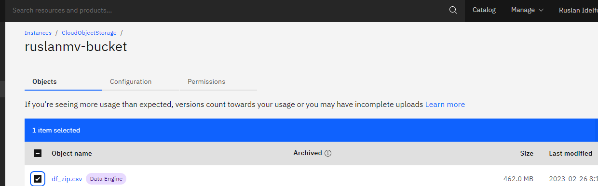

For more commands you can visit the documentation of IBM S3 [here]( https://cloud.ibm.com/docs/cloud-object-storage?topic=cloud-object-storage-python).

You can download the notebook [here.](https://github.com/ruslanmv/Python-with-Jupyter-Notebook-in-IBM-Cloud-Storage/blob/master/My_Jupyter_Notebook.ipynb)

**Congratulations!** we have practice how to upload and download files by using IBM Cloud.
